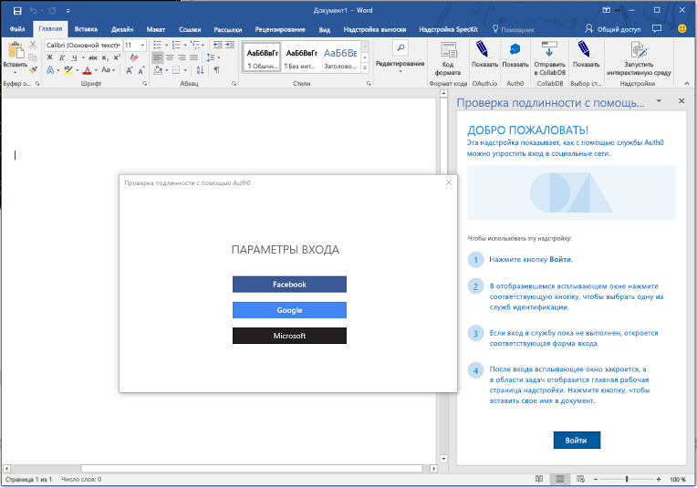
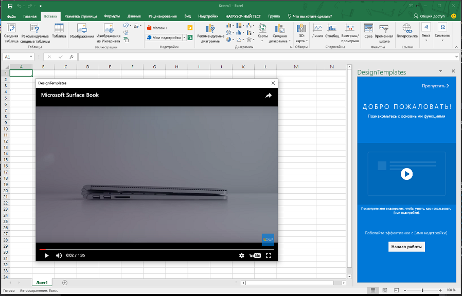

# <a name="use-the-dialog-api-in-your-office-add-ins"></a><span data-ttu-id="5b69c-102">Использование Dialog API в надстройках Office</span><span class="sxs-lookup"><span data-stu-id="5b69c-102">Use the Dialog API in your Office Add-ins</span></span>

<span data-ttu-id="5b69c-p101">Вы можете использовать [Dialog API](https://docs.microsoft.com/javascript/api/office/office.ui?view=office-js), чтобы открывать диалоговые окна в надстройке Office. Эта статья содержит рекомендации по использованию Dialog API в надстройке Office.</span><span class="sxs-lookup"><span data-stu-id="5b69c-p101">You can use the [Dialog API](https://docs.microsoft.com/javascript/api/office/office.ui?view=office-js) to open dialog boxes in your Office Add-in. This article provides guidance for using the Dialog API in your Office Add-in.</span></span>

> [!NOTE]
> <span data-ttu-id="5b69c-p102">Сведения о поддержке Dialog API см. в статье [Наборы обязательных элементов Dialog API](https://docs.microsoft.com/javascript/office/requirement-sets/dialog-api-requirement-sets?view=office-js). В настоящее время Dialog API поддерживается для Word, Excel, PowerPoint и Outlook.</span><span class="sxs-lookup"><span data-stu-id="5b69c-p102">For information about where the Dialog API is currently supported, see [Dialog API requirement sets](https://docs.microsoft.com/javascript/office/requirement-sets/dialog-api-requirement-sets?view=office-js). The Dialog API is currently supported for Word, Excel, PowerPoint, and Outlook.</span></span>

> <span data-ttu-id="5b69c-107">Основной сценарий использования Dialog API — обеспечение проверки подлинности с использованием таких ресурсов, как Google или Facebook.</span><span class="sxs-lookup"><span data-stu-id="5b69c-107">A primary scenario for the Dialog APIs is to enable authentication with a resource such as Google or Facebook.</span></span> <span data-ttu-id="5b69c-108">Если вашей надстройке требуются данные о пользователе Office или ресурсах, доступных ему посредством Microsoft Graph (например, Office 365 или OneDrive), рекомендуем по возможности использовать API единого входа.</span><span class="sxs-lookup"><span data-stu-id="5b69c-108">If your add-in requires data about the Office user or their resources accessible through Microsoft Graph, such as Office 365 or OneDrive, we recommend that you use the single sign-on API whenever you can.</span></span> <span data-ttu-id="5b69c-109">Если вы используете API для единого входа, Dialog API не требуется.</span><span class="sxs-lookup"><span data-stu-id="5b69c-109">If you use the APIs for single sign-on, then you will not need the Dialog API.</span></span> <span data-ttu-id="5b69c-110">Дополнительные сведения см. в статье [Включение единого входа для надстроек Office](sso-in-office-add-ins.md).</span><span class="sxs-lookup"><span data-stu-id="5b69c-110">For details, see [Enable single sign-on for Office Add-ins](sso-in-office-add-ins.md).</span></span>

<span data-ttu-id="5b69c-111">Возможность открытия диалогового окна с помощью области задач, контентной надстройки или [команды надстройки](../design/add-in-commands.md) может позволить следующее:</span><span class="sxs-lookup"><span data-stu-id="5b69c-111">Consider opening a dialog box from a task pane or content add-in or [add-in command](../design/add-in-commands.md) to do the following:</span></span>

- <span data-ttu-id="5b69c-112">отобразить страницу входа, которую невозможно открыть непосредственно в области задач;</span><span class="sxs-lookup"><span data-stu-id="5b69c-112">Display sign in pages that cannot be opened directly in a task pane.</span></span>
- <span data-ttu-id="5b69c-113">предоставить больше места на экране (или даже весь экран) для некоторых задач в надстройке;</span><span class="sxs-lookup"><span data-stu-id="5b69c-113">Provide more screen space, or even a full screen, for some tasks in your add-in.</span></span>
- <span data-ttu-id="5b69c-114">показать видео, которое будет слишком маленьким в области задач.</span><span class="sxs-lookup"><span data-stu-id="5b69c-114">Host a video that would be too small if confined to a task pane.</span></span>

> [!NOTE]
> <span data-ttu-id="5b69c-p104">Так как пользователей раздражают элементы интерфейса, перекрывающие основное содержимое, не допускайте открытия диалогового окна из области задач, если этого не требует сценарий. При планировании контактной зоны помните, что в области задач можно использовать вкладки. Например, как в [надстройке SalesTracker на JavaScript для Excel](https://github.com/OfficeDev/Excel-Add-in-JavaScript-SalesTracker).</span><span class="sxs-lookup"><span data-stu-id="5b69c-p104">Because overlapping UI elements are discouraged, avoid opening a dialog from a task pane unless your scenario requires it. When you consider how to use the surface area of a task pane, note that task panes can be tabbed. For an example, see the [Excel Add-in JavaScript SalesTracker](https://github.com/OfficeDev/Excel-Add-in-JavaScript-SalesTracker) sample.</span></span>

<span data-ttu-id="5b69c-118">На приведенном ниже изображении показан пример диалогового окна.</span><span class="sxs-lookup"><span data-stu-id="5b69c-118">The following image shows an example of a dialog box.</span></span>



<span data-ttu-id="5b69c-p105">Обратите внимание на то, что диалоговое окно всегда открывается в центре экрана. Пользователь может перемещать его и изменять его размер. Окно *не модальное*: пользователь может продолжать работать и с документом в ведущем приложении Office, и с главной страницей в области задач.</span><span class="sxs-lookup"><span data-stu-id="5b69c-p105">Note that the dialog box always opens in the center of the screen. The user can move and resize it. The window is *nonmodal*--a user can continue to interact with both the document in the host Office application and with the host page in the task pane, if there is one.</span></span>

## <a name="dialog-api-scenarios"></a><span data-ttu-id="5b69c-123">Сценарии с Dialog API</span><span class="sxs-lookup"><span data-stu-id="5b69c-123">Dialog API scenarios</span></span>

<span data-ttu-id="5b69c-124">Интерфейсы API JavaScript для Office поддерживают указанные ниже сценарии с объектом [Dialog](https://docs.microsoft.com/javascript/api/office/office.dialog?view=office-js) и две функции в [пространстве имен Office.context.ui](https://docs.microsoft.com/javascript/api/office/office.ui?view=office-js).</span><span class="sxs-lookup"><span data-stu-id="5b69c-124">The Office JavaScript APIs support the following scenarios with a [Dialog](https://docs.microsoft.com/javascript/api/office/office.dialog?view=office-js) object and two functions in the [Office.context.ui namespace](https://docs.microsoft.com/javascript/api/office/office.ui?view=office-js).</span></span>

### <a name="open-a-dialog-box"></a><span data-ttu-id="5b69c-125">Открытие диалогового окна</span><span class="sxs-lookup"><span data-stu-id="5b69c-125">Open a dialog box</span></span>

<span data-ttu-id="5b69c-p106">Чтобы открыть диалоговое окно, код в области задач вызывает метод [displayDialogAsync](https://docs.microsoft.com/javascript/api/office/office.ui?view=office-js) и передает ему URL-адрес ресурса, который нужно открыть. Таким ресурсом обычно является страница, но может быть и метод контроллера в приложении MVC, метод веб-службы, маршрута или любой другой ресурс. В этой статье термин "страница" или "веб-сайт" означает ресурс в диалоговом окне. Ниже приведен простой пример кода.</span><span class="sxs-lookup"><span data-stu-id="5b69c-p106">To open a dialog box, your code in the task pane calls the [displayDialogAsync](https://docs.microsoft.com/javascript/api/office/office.ui?view=office-js) method and passes to it the URL of the resource that you want to open. This is usually a page, but it can be a controller method in an MVC application, a route, a web service method, or any other resource. In this article, 'page' or 'website' refers to the resource in the dialog. The following code is a simple example:</span></span>

```js
Office.context.ui.displayDialogAsync('https://myAddinDomain/myDialog.html');
```

> [!NOTE]
> - <span data-ttu-id="5b69c-p107">В случае URL-адреса используется протокол HTTP**S**, обязательный для всех страниц, загружаемых в диалоговом окне, а не только для первой страницы.</span><span class="sxs-lookup"><span data-stu-id="5b69c-p107">The URL uses the HTTP**S** protocol. This is mandatory for all pages loaded in a dialog box, not just the first page loaded.</span></span>
> - <span data-ttu-id="5b69c-p108">Домен диалогового ресурса совпадает с доменом главной страницы, которая может быть страницей в области задач или [файлом функций](https://docs.microsoft.com/javascript/office/manifest/functionfile?view=office-js) для команды надстройки. Страница, метод контроллера или другой ресурс, передаваемый в метод `displayDialogAsync`, должен находиться в том же домене, что и главная страница.</span><span class="sxs-lookup"><span data-stu-id="5b69c-p108">The domain is the same as the domain of the host page, which can be the page in a task pane or the [function file](https://docs.microsoft.com/javascript/office/manifest/functionfile?view=office-js) of an add-in command. This is required: the page, controller method, or other resource that is passed to the `displayDialogAsync` method must be in the same domain as the host page.</span></span>

> [!IMPORTANT]
> <span data-ttu-id="5b69c-134">У главной страницы и у ресурса диалогового окна должен быть один и тот же полный домен.</span><span class="sxs-lookup"><span data-stu-id="5b69c-134">The host page and the resources of the dialog must have the same full domain.</span></span> <span data-ttu-id="5b69c-135">Если вы попытаетесь передать методу `displayDialogAsync` поддомен домена надстройки, это не сработает.</span><span class="sxs-lookup"><span data-stu-id="5b69c-135">If you attempt to pass `displayDialogAsync` a subdomain of the add-in's domain, it will not work.</span></span> <span data-ttu-id="5b69c-136">Полные доменные имена, включая любые поддомены, должны совпадать.</span><span class="sxs-lookup"><span data-stu-id="5b69c-136">The full domain, including any subdomain, must match.</span></span>

<span data-ttu-id="5b69c-p110">После загрузки первой страницы (или другого ресурса) пользователь может перейти к любому веб-сайту (или другому ресурсу), который использует HTTPS. Первая страница также может сразу перенаправлять пользователя на другой сайт.</span><span class="sxs-lookup"><span data-stu-id="5b69c-p110">After the first page (or other resource) is loaded, a user can go to any website (or other resource) that uses HTTPS. You can also design the first page to immediately redirect to another site.</span></span>

<span data-ttu-id="5b69c-139">По умолчанию диалоговое окно занимает 80 % высоты и ширины экрана устройства, но вы можете установить другие соотношения путем передачи объекта конфигурации в метод, как показано в приведенном ниже примере.</span><span class="sxs-lookup"><span data-stu-id="5b69c-139">By default, the dialog box will occupy 80% of the height and width of the device screen, but you can set different percentages by passing a configuration object to the method, as shown in the following example:</span></span>

```js
Office.context.ui.displayDialogAsync('https://myDomain/myDialog.html', {height: 30, width: 20});
```

<span data-ttu-id="5b69c-140">Подобная надстройка приведена в статье [Пример надстройки Office с Dialog API](https://github.com/OfficeDev/Office-Add-in-Dialog-API-Simple-Example).</span><span class="sxs-lookup"><span data-stu-id="5b69c-140">For a sample add-in that does this, see [Office Add-in Dialog API Example](https://github.com/OfficeDev/Office-Add-in-Dialog-API-Simple-Example).</span></span>

<span data-ttu-id="5b69c-p111">Установите оба значения равными 100 %, чтобы надстройка открывалась во весь экран. (На самом деле, максимальное значение составляет 99,5 %, возможность перемещать окно и изменять его размер сохраняется.)</span><span class="sxs-lookup"><span data-stu-id="5b69c-p111">Set both values to 100% to get what is effectively a full screen experience. (The effective maximum is 99.5%, and the window is still moveable and resizable.)</span></span>

> [!NOTE]
> <span data-ttu-id="5b69c-p112">Из главного окна можно открыть только одно диалоговое окно. При попытке открыть еще одно диалоговое окно произойдет ошибка. Поэтому если пользователь, например, откроет диалоговое окно из области задач, он не сможет открыть второе диалоговое окно на другой странице в области задач. Но при открытии диалогового окна с помощью [команды надстройки](../design/add-in-commands.md) каждый раз открывается новый (невидимый) HTML-файл. При этом создается новое (невидимое) главное окно, которое может запускать собственное диалоговое окно. Дополнительные сведения см. в разделе [Ошибки метода displayDialogAsync](#errors-from-displaydialogasync).</span><span class="sxs-lookup"><span data-stu-id="5b69c-p112">You can open only one dialog box from a host window. An attempt to open another dialog box generates an error. For example, if a user opens a dialog box from a task pane, she cannot open a second dialog box, from a different page in the task pane. However, when a dialog box is opened from an [add-in command](../design/add-in-commands.md), the command opens a new (but unseen) HTML file each time it is selected. This creates a new (unseen) host window, so each such window can launch its own dialog box. For more information, see [Errors from displayDialogAsync](#errors-from-displaydialogasync).</span></span>

### <a name="take-advantage-of-a-performance-option-in-office-online"></a><span data-ttu-id="5b69c-149">Использование параметра производительности в Office Online</span><span class="sxs-lookup"><span data-stu-id="5b69c-149">Take advantage of a performance option in Office Online</span></span>

<span data-ttu-id="5b69c-p113">— дополнительное свойство в объекте конфигурации, которое можно передать `displayDialogAsync`. Когда этому свойству присвоено значение `true`, а надстройка запущена для документа в Office Online, диалоговое окно будет открываться быстрее, потому что будет выступать как плавающий фрейм iframe. Ниже приведен пример.`displayInIframe`</span><span class="sxs-lookup"><span data-stu-id="5b69c-p113">The `displayInIframe` property is an additional property in the configuration object that you can pass to `displayDialogAsync`. When this property is set to `true`, and the add-in is running in a document opened in Office Online, the dialog box will open as a floating iframe rather than an independent window, which makes it open faster. The following is an example:</span></span>

```js
Office.context.ui.displayDialogAsync('https://myDomain/myDialog.html', {height: 30, width: 20, displayInIframe: true});
```

<span data-ttu-id="5b69c-153">Значение по умолчанию: `false`. Его использование равнозначно пропуску всего свойства.</span><span class="sxs-lookup"><span data-stu-id="5b69c-153">The default value is `false`, which is the same as omitting the property entirely.</span></span> <span data-ttu-id="5b69c-154">Если надстройка не работает в Office Online, `displayInIframe` игнорируется.</span><span class="sxs-lookup"><span data-stu-id="5b69c-154">If the add-in is not running in Office Online, the `displayInIframe` is ignored.</span></span>

> [!NOTE]
> <span data-ttu-id="5b69c-p115">**Не** следует использовать `displayInIframe: true`, если диалоговое окно будет выполнять перенаправление на страницу, которую невозможно открыть в элементе iframe. Например, страницы входа многих популярных веб-служб (который выполняется, например, с помощью учетной записи Майкрософт или Google), невозможно открыть в элементе iframe.</span><span class="sxs-lookup"><span data-stu-id="5b69c-p115">You should **not** use `displayInIframe: true` if the dialog will at any point redirect to a page that cannot be opened in an iframe. For example, the sign in pages of many popular web services, such as Google and Microsoft Account, cannot be opened in an iframe.</span></span>

### <a name="send-information-from-the-dialog-box-to-the-host-page"></a><span data-ttu-id="5b69c-157">Отправка сведений из диалогового окна главной странице</span><span class="sxs-lookup"><span data-stu-id="5b69c-157">Send information from the dialog box to the host page</span></span>

<span data-ttu-id="5b69c-158">Диалоговое окно может взаимодействовать с главной страницей в области задач, если:</span><span class="sxs-lookup"><span data-stu-id="5b69c-158">The dialog box cannot communicate with the host page in the task pane unless:</span></span>

- <span data-ttu-id="5b69c-159">Текущая страница в диалоговом окне не находится в том же домене, что и главная страница.</span><span class="sxs-lookup"><span data-stu-id="5b69c-159">The current page in the dialog box is in the same domain as the host page.</span></span>
- <span data-ttu-id="5b69c-p116">Библиотека JavaScript для Office не загружена на странице. (Как и любая страница, которая использует библиотеку JavaScript для Office, сценарий для страницы должен назначить метод свойству `Office.initialize`. Метод может быть пустой. Дополнительные сведения см. в разделе [Инициализация надстройки](understanding-the-javascript-api-for-office.md#initializing-your-add-in).)</span><span class="sxs-lookup"><span data-stu-id="5b69c-p116">The Office JavaScript library is loaded in the page. (Like any page that uses the Office JavaScript library, script for the page must assign a method to the `Office.initialize` property, although it can be an empty method. For details, see [Initializing your add-in](understanding-the-javascript-api-for-office.md#initializing-your-add-in).)</span></span>

<span data-ttu-id="5b69c-p117">Код в диалоговом окне использует функцию `messageParent` для отправки логического значения или строки на главную страницу. Строка может быть словом, предложением, большим двоичным объектом XML, строковым представлением JSON или любым другим объектом, который можно сериализовать, представив в виде строки. Ниже приведен пример.</span><span class="sxs-lookup"><span data-stu-id="5b69c-p117">Code in the dialog page uses the `messageParent` function to send either a Boolean value or a string message to the host page. The string can be a word, sentence, XML blob, stringified JSON, or anything else that can be serialized to a string. The following is an example:</span></span>

```js
if (loginSuccess) {
    Office.context.ui.messageParent(true);
}
```

> [!NOTE]
> - <span data-ttu-id="5b69c-p118">Функция `messageParent` — это один из *двух* API Office, которые можно вызывать в диалоговом окне. Другой — `Office.context.requirements.isSetSupported`. Дополнительные сведения см. в статье [Указание ведущих приложений Office и требований к API](specify-office-hosts-and-api-requirements.md).</span><span class="sxs-lookup"><span data-stu-id="5b69c-p118">The `messageParent` function is one of *only* two Office APIs that can be called in the dialog box. The other is `Office.context.requirements.isSetSupported`. For information about it, see [Specify Office hosts and API requirements](specify-office-hosts-and-api-requirements.md).</span></span>
> - <span data-ttu-id="5b69c-169">Функцию `messageParent` можно вызывать только на странице, которая относится к тому же домену (включая протокол и порт), что и главная страница.</span><span class="sxs-lookup"><span data-stu-id="5b69c-169">The `messageParent` function can only be called on a page with the same domain (including protocol and port) as the host page.</span></span>

<span data-ttu-id="5b69c-170">В следующем примере `googleProfile` — это строковое представление профиля Google пользователя.</span><span class="sxs-lookup"><span data-stu-id="5b69c-170">In the next example, `googleProfile` is a stringified version of the user's Google profile.</span></span>

```js
if (loginSuccess) {
    Office.context.ui.messageParent(googleProfile);
}
```

<span data-ttu-id="5b69c-p119">Чтобы главная страница получила сообщение, ее необходимо настроить. Для этого добавьте параметр обратного вызова в исходный вызов `displayDialogAsync`. Обратный вызов назначает событию `DialogMessageReceived` обработчик. Ниже приведен пример.</span><span class="sxs-lookup"><span data-stu-id="5b69c-p119">The host page must be configured to receive the message. You do this by adding a callback parameter to the original call of `displayDialogAsync`. The callback assigns a handler to the `DialogMessageReceived` event. The following is an example:</span></span>

```js
var dialog;
Office.context.ui.displayDialogAsync('https://myDomain/myDialog.html', {height: 30, width: 20},
    function (asyncResult) {
        dialog = asyncResult.value;
        dialog.addEventHandler(Office.EventType.DialogMessageReceived, processMessage);
    }
);
```

> [!NOTE]
> - <span data-ttu-id="5b69c-p120">Office передает объект [AsyncResult]() в функцию обратного вызова. Он представляет собой результат попытки открыть диалоговое окно, но не результат событий в диалоговом окне. Дополнительные сведения об этой особенности см. в разделе [Обработка ошибок и событий](#handle-errors-and-events).</span><span class="sxs-lookup"><span data-stu-id="5b69c-p120">Office passes an [AsyncResult]() object to the callback. It represents the result of the attempt to open the dialog box. It does not represent the outcome of any events in the dialog box. For more on this distinction, see the section [Handle errors and events](#handle-errors-and-events).</span></span>
> - <span data-ttu-id="5b69c-179">Для свойства `value` объекта `asyncResult` задан объект [Dialog](https://docs.microsoft.com/javascript/api/office/office.dialog?view=office-js), который существует на главной странице, а не в контексте выполнения диалогового окна.</span><span class="sxs-lookup"><span data-stu-id="5b69c-179">The `value` property of the `asyncResult` is set to a [Dialog](https://docs.microsoft.com/javascript/api/office/office.dialog?view=office-js) object, which exists in the host page, not in the dialog box's execution context.</span></span>
> - <span data-ttu-id="5b69c-p121">— это функция, которая обрабатывает событие. Вы можете присвоить ей любое имя.`processMessage`</span><span class="sxs-lookup"><span data-stu-id="5b69c-p121">The `processMessage` is the function that handles the event. You can give it any name you want.</span></span>
> - <span data-ttu-id="5b69c-182">Переменная `dialog` объявляется в более широком контексте, чем обратный вызов, так как на нее также ссылается `processMessage`.</span><span class="sxs-lookup"><span data-stu-id="5b69c-182">The `dialog` variable is declared at a wider scope than the callback because it is also referenced in `processMessage`.</span></span>

<span data-ttu-id="5b69c-183">Ниже приведен простой пример обработчика для события `DialogMessageReceived`.</span><span class="sxs-lookup"><span data-stu-id="5b69c-183">The following is a simple example of a handler for the `DialogMessageReceived` event:</span></span>

```js
function processMessage(arg) {
    var messageFromDialog = JSON.parse(arg.message);
    showUserName(messageFromDialog.name);
}
```

> [!NOTE]
> - <span data-ttu-id="5b69c-p122">Office передает объект `arg` в обработчик. Его свойство `message` — это логическое значение или строка, отправляемая при вызове `messageParent` в диалоговом окне. В данном примере это профиль пользователя из учетной записи Майкрософт, Google или другой службы, представленный в виде строки, поэтому он десериализируется обратно в объект с помощью метода `JSON.parse`.</span><span class="sxs-lookup"><span data-stu-id="5b69c-p122">Office passes the `arg` object to the handler. Its `message` property is the Boolean or string sent by the call of `messageParent` in the dialog. In this example, it is a stringified representation of a user's profile from a service such as Microsoft Account or Google, so it is deserialized back to an object with `JSON.parse`.</span></span>
> - <span data-ttu-id="5b69c-p123">Функция `showUserName` не показана. Она может отображать персонализированное приветствие в области задач.</span><span class="sxs-lookup"><span data-stu-id="5b69c-p123">The `showUserName` implementation is not shown. It might display a personalized welcome message on the task pane.</span></span>

<span data-ttu-id="5b69c-189">Когда взаимодействие пользователя с диалоговым окном закончится, обработчик сообщений должен закрыть диалоговое окно, как показано в этом примере.</span><span class="sxs-lookup"><span data-stu-id="5b69c-189">When the user interaction with the dialog box is completed, your message handler should close the dialog box, as shown in this example.</span></span>

```js
function processMessage(arg) {
    dialog.close();
    // message processing code goes here;
}
```

> [!NOTE]
> - <span data-ttu-id="5b69c-190">Объект `dialog` должен быть таким же, как объект, который возвращается при вызове `displayDialogAsync`.</span><span class="sxs-lookup"><span data-stu-id="5b69c-190">The `dialog` object must be the same one that is returned by the call of `displayDialogAsync`.</span></span>
> - <span data-ttu-id="5b69c-191">Вызов метода `dialog.close` дает указание Office немедленно закрыть диалоговое окно.</span><span class="sxs-lookup"><span data-stu-id="5b69c-191">The call of `dialog.close` tells Office to immediately close the dialog box.</span></span>

<span data-ttu-id="5b69c-192">Пример надстройки, в которой используются эти методы, см. в статье [Пример надстройки Office с Dialog API](https://github.com/OfficeDev/Office-Add-in-Dialog-API-Simple-Example).</span><span class="sxs-lookup"><span data-stu-id="5b69c-192">For a sample add-in that uses these techniques, see [Office Add-in Dialog API Example](https://github.com/OfficeDev/Office-Add-in-Dialog-API-Simple-Example).</span></span>

<span data-ttu-id="5b69c-p124">Если надстройка должна открыть другую страницу области задач после получения сообщения, можно использовать метод `window.location.replace` (или `window.location.href`) в последней строке обработчика. Ниже приведен пример.</span><span class="sxs-lookup"><span data-stu-id="5b69c-p124">If the add-in needs to open a different page of the task pane after receiving the message, you can use the `window.location.replace` method (or `window.location.href`) as the last line of the handler. The following is an example:</span></span>

```js
function processMessage(arg) {
    // message processing code goes here;
    window.location.replace("/newPage.html");
    // Alternatively ...
    // window.location.href = "/newPage.html";
}
```

<span data-ttu-id="5b69c-195">Пример подобной надстройки см. в статье [Вставка диаграмм Excel с помощью Microsoft Graph в надстройке PowerPoint](https://github.com/OfficeDev/PowerPoint-Add-in-Microsoft-Graph-ASPNET-InsertChart).</span><span class="sxs-lookup"><span data-stu-id="5b69c-195">For an example of an add-in that does this, see the [Insert Excel charts using Microsoft Graph in a PowerPoint Add-in](https://github.com/OfficeDev/PowerPoint-Add-in-Microsoft-Graph-ASPNET-InsertChart) sample.</span></span>

#### <a name="conditional-messaging"></a><span data-ttu-id="5b69c-196">Условные сообщения</span><span class="sxs-lookup"><span data-stu-id="5b69c-196">Conditional messaging</span></span>
<span data-ttu-id="5b69c-p125">Так как из диалогового окна можно отправить несколько вызовов `messageParent`, но на главной странице есть только один обработчик для события `DialogMessageReceived`, обработчику необходимо использовать условную логику, чтобы различать сообщения. Например, если диалоговое окно предлагает пользователю войти в учетную запись Майкрософт, Google или другого поставщика удостоверений, оно отправляет профиль пользователя в виде сообщения. Если выполнить аутентификацию не удается, диалоговое окно отправляет сведения об ошибке на главную страницу, как показано в приведенном ниже примере.</span><span class="sxs-lookup"><span data-stu-id="5b69c-p125">Because you can send multiple `messageParent` calls from the dialog box, but you have only one handler in the host page for the `DialogMessageReceived` event, the handler must use conditional logic to distinguish different messages. For example, if the dialog box prompts a user to sign in to an identity provider such as Microsoft Account or Google, it sends the user's profile as a message. If authentication fails, the dialog box sends error information to the host page, as in the following example:</span></span>

```js
if (loginSuccess) {
    var userProfile = getProfile();
    var messageObject = {messageType: "signinSuccess", profile: userProfile};            
    var jsonMessage = JSON.stringify(messageObject);
    Office.context.ui.messageParent(jsonMessage);
} else {
    var errorDetails = getError();
    var messageObject = {messageType: "signinFailure", error: errorDetails};            
    var jsonMessage = JSON.stringify(messageObject);
    Office.context.ui.messageParent(jsonMessage);
}
```

> [!NOTE]
> - <span data-ttu-id="5b69c-200">Переменная `loginSuccess` будет инициализирована после считывания отклика HTTP от поставщика удостоверений.</span><span class="sxs-lookup"><span data-stu-id="5b69c-200">The `loginSuccess` variable would be initialized by reading the HTTP response from the identity provider.</span></span>
> - <span data-ttu-id="5b69c-p126">Реализация функций `getProfile` и `getError` не показана. Они получают данные из параметра запроса или ответа HTTP.</span><span class="sxs-lookup"><span data-stu-id="5b69c-p126">The the implementation of the `getProfile` and `getError` functions are not not shown. They each get data from a query parameter or from the body of the HTTP response.</span></span>
> - <span data-ttu-id="5b69c-p127">В зависимости от того, удалось ли выполнить вход, отправляются анонимные объекты различных типов. Оба содержат свойство `messageType`, но один содержит свойство `profile`, а другой — свойство `error`.</span><span class="sxs-lookup"><span data-stu-id="5b69c-p127">Anonymous objects of different types are sent depending on whether the sign in was successful. Both have a `messageType` property, but one has a `profile` property and the other has an `error` property.</span></span>

<span data-ttu-id="5b69c-205">Примеры использования условных сообщений см. в таких статьях:</span><span class="sxs-lookup"><span data-stu-id="5b69c-205">For samples that use conditional messaging, see:</span></span>
- [<span data-ttu-id="5b69c-206">Использование службы Auth0 в надстройках Office для упрощения входа через социальные сети</span><span class="sxs-lookup"><span data-stu-id="5b69c-206">Office Add-in that uses the Auth0 Service to Simplify Social Login</span></span>](https://github.com/OfficeDev/Office-Add-in-Auth0)
- [<span data-ttu-id="5b69c-207">Использование службы OAuth.io в надстройках Office для упрощения доступа к популярным веб-службам</span><span class="sxs-lookup"><span data-stu-id="5b69c-207">Office Add-in that uses the OAuth.io Service to Simplify Access to Popular Online Services</span></span>](https://github.com/OfficeDev/Office-Add-in-OAuth.io)

<span data-ttu-id="5b69c-p128">Код обработчика на главной странице использует значение свойства `messageType` для разветвления, как показано в приведенном ниже примере. Обратите внимание на то, что здесь используется та же функция `showUserName`, что и в примере выше, а функция `showNotification` отображает сообщение об ошибке в элементе пользовательского интерфейса на главной странице.</span><span class="sxs-lookup"><span data-stu-id="5b69c-p128">The handler code in the host page uses the value of the `messageType` property to branch as shown in the following example. Note that the `showUserName` function is the same as in the previous example and `showNotification` function displays the error in the host page's UI.</span></span>

```js
function processMessage(arg) {
    var messageFromDialog = JSON.parse(arg.message);
    if (messageFromDialog.messageType === "signinSuccess") {
        dialog.close();
        showUserName(messageFromDialog.profile.name);
        window.location.replace("/newPage.html");
    } else {
        dialog.close();
        showNotification("Unable to authenticate user: " + messageFromDialog.error);
    }
}
```

### <a name="closing-the-dialog-box"></a><span data-ttu-id="5b69c-210">Закрытие диалогового окна</span><span class="sxs-lookup"><span data-stu-id="5b69c-210">Closing the dialog box</span></span>

<span data-ttu-id="5b69c-p129">Вы можете добавить в диалоговое окно кнопку, которая будет его закрывать. Для этого обработчик событий кнопки должен использовать `messageParent`, чтобы сообщить главной странице, что кнопка нажата. Ниже приведен пример.</span><span class="sxs-lookup"><span data-stu-id="5b69c-p129">You can implement a button in the dialog box that will close it. To do this, the click event handler for the button should use `messageParent` to tell the host page that the button has been clicked. The following is an example:</span></span>

```js
function closeButtonClick() {
    var messageObject = {messageType: "dialogClosed"};            
    var jsonMessage = JSON.stringify(messageObject);
    Office.context.ui.messageParent(jsonMessage);
}
```

<span data-ttu-id="5b69c-p130">Обработчик главной страницы для `DialogMessageReceived` вызовет `dialog.close`, как показано в этом примере. (Примеры инициализации объекта dialog см. выше в этой статье.)</span><span class="sxs-lookup"><span data-stu-id="5b69c-p130">The host page handler for `DialogMessageReceived` would call `dialog.close`, as in this example. (See previous examples that show how the dialog object is initialized.)</span></span>


```js
function processMessage(arg) {
    var messageFromDialog = JSON.parse(arg.message);
    if (messageFromDialog.messageType === "dialogClosed") {
       dialog.close();
    }
}
```

<span data-ttu-id="5b69c-216">[Конструктивный шаблон обеспечения навигации для диалогового окна](https://github.com/OfficeDev/Office-Add-in-UX-Design-Patterns-Code/tree/master/templates/dialog/navigation), в случае которого используется эта техника, см. в репозитории [конструктивных шаблонов для пользовательского интерфейса надстроек Office](https://github.com/OfficeDev/Office-Add-in-UX-Design-Patterns-Code).</span><span class="sxs-lookup"><span data-stu-id="5b69c-216">For a sample that uses this technique, see the [dialog navigation design pattern](https://github.com/OfficeDev/Office-Add-in-UX-Design-Patterns-Code/tree/master/templates/dialog/navigation) in the [UX design patterns for Office Add-ins](https://github.com/OfficeDev/Office-Add-in-UX-Design-Patterns-Code) repo.</span></span>

<span data-ttu-id="5b69c-p131">Даже если у вас нет собственной кнопки для закрытия диалогового окна, пользователь сможет закрыть его, нажав кнопку **X** в правом верхнем углу. Это действие запускает событие `DialogEventReceived`. Чтобы главная область могла реагировать на это событие, для нее должен быть объявлен обработчик этого события. Подробнее: [Ошибки и события в диалоговом окне](#errors-and-events-in-the-dialog-window).</span><span class="sxs-lookup"><span data-stu-id="5b69c-p131">Even when you don't have your own close dialog UI, an end user can close the dialog box by choosing the **X** in the upper-right corner. This action triggers the `DialogEventReceived` event. If your host pane needs to know when this happens, it should declare a handler for this event. See the section [Errors and events in the dialog window](#errors-and-events-in-the-dialog-window) for details.</span></span>

## <a name="handle-errors-and-events"></a><span data-ttu-id="5b69c-221">Обработка ошибок и событий</span><span class="sxs-lookup"><span data-stu-id="5b69c-221">Handle errors and events</span></span>

<span data-ttu-id="5b69c-222">Код должен обрабатывать две категории событий:</span><span class="sxs-lookup"><span data-stu-id="5b69c-222">Your code should handle two categories of events:</span></span>

- <span data-ttu-id="5b69c-223">Ошибки, возвращаемые при вызове метода `displayDialogAsync`, так как не удается создать диалоговое окно.</span><span class="sxs-lookup"><span data-stu-id="5b69c-223">Errors returned by the call of `displayDialogAsync` because the dialog box cannot be created.</span></span>
- <span data-ttu-id="5b69c-224">Ошибки и другие события в диалоговом окне.</span><span class="sxs-lookup"><span data-stu-id="5b69c-224">Errors, and other events, in the dialog window.</span></span>

### <a name="errors-from-displaydialogasync"></a><span data-ttu-id="5b69c-225">Ошибки метода displayDialogAsync</span><span class="sxs-lookup"><span data-stu-id="5b69c-225">Errors from displayDialogAsync</span></span>

<span data-ttu-id="5b69c-226">Кроме общих ошибок платформы и системы, при вызове метода `displayDialogAsync` возникают указанные ниже ошибки.</span><span class="sxs-lookup"><span data-stu-id="5b69c-226">In addition to general platform and system errors, three errors are specific to calling `displayDialogAsync`.</span></span>

|<span data-ttu-id="5b69c-227">Цифровой код</span><span class="sxs-lookup"><span data-stu-id="5b69c-227">Code number</span></span>|<span data-ttu-id="5b69c-228">Значение</span><span class="sxs-lookup"><span data-stu-id="5b69c-228">Meaning</span></span>|
|:-----|:-----|
|<span data-ttu-id="5b69c-229">12004</span><span class="sxs-lookup"><span data-stu-id="5b69c-229">12004</span></span>|<span data-ttu-id="5b69c-p132">Домен URL-адреса, передаваемого в метод `displayDialogAsync`, не является доверенным. Домен должен быть таким же, как и для главной страницы (а также протокол и номер порта).</span><span class="sxs-lookup"><span data-stu-id="5b69c-p132">The domain of the URL passed to `displayDialogAsync` is not trusted. The domain must be the same domain as the host page (including protocol and port number).</span></span>|
|<span data-ttu-id="5b69c-232">12005</span><span class="sxs-lookup"><span data-stu-id="5b69c-232">12005</span></span>|<span data-ttu-id="5b69c-p133">URL-адрес, передаваемый в метод `displayDialogAsync`, использует протокол HTTP. Необходим протокол HTTPS. (В некоторых версиях Office сообщение об ошибке 12005 совпадает с сообщением 12004.)</span><span class="sxs-lookup"><span data-stu-id="5b69c-p133">The URL passed to `displayDialogAsync` uses the HTTP protocol. HTTPS is required. (In some versions of Office, the error message returned with 12005 is the same one returned for 12004.)</span></span>|
|<span data-ttu-id="5b69c-236"><span id="12007">12007</span></span><span class="sxs-lookup"><span data-stu-id="5b69c-236"><span id="12007">12007</span></span></span>|<span data-ttu-id="5b69c-p134">Диалоговое окно уже открыто из этого главного окна. Для главного окна, например области задач, невозможно открыть сразу несколько диалоговых окон.</span><span class="sxs-lookup"><span data-stu-id="5b69c-p134">A dialog box is already opened from this host window. A host window, such as a task pane, can only have one dialog box open at a time.</span></span>|

<span data-ttu-id="5b69c-p135">При вызове метода `displayDialogAsync` он всегда передает объект [AsyncResult](https://docs.microsoft.com/javascript/api/office/office.asyncresult?view=office-js) в функцию обратного вызова. Если метод вызван, т. е. диалоговое окно открыто, свойство `value` объекта `AsyncResult` приравнивается к объекту [Dialog](https://docs.microsoft.com/javascript/api/office/office.dialog?view=office-js). См. пример в разделе [Отправка сведений из диалогового окна главной странице](#send-information-from-the-dialog-box-to-the-host-page). Если вызвать `displayDialogAsync` не удается, то окно не создается, свойству `status` объекта `AsyncResult` присваивается значение "ошибка", а также заполняется свойство `error` объекта. У вас всегда должна быть функция обратного вызова, которая проверяет `status` и сообщает об ошибке. Ниже приведен пример, в котором просто сообщается об ошибке, независимо от ее кода.</span><span class="sxs-lookup"><span data-stu-id="5b69c-p135">When `displayDialogAsync` is called, it always passes an [AsyncResult](https://docs.microsoft.com/javascript/api/office/office.asyncresult?view=office-js) object to its callback function. When the call is successful - that is, the dialog window is opened - the `value` property of the `AsyncResult` object is a [Dialog](https://docs.microsoft.com/javascript/api/office/office.dialog?view=office-js) object. An example of this is in the section [Send information from the dialog box to the host page](#send-information-from-the-dialog-box-to-the-host-page). When the call to `displayDialogAsync` fails, the window is not created, the `status` property of the `AsyncResult` object is set to "failed", and the `error` property of the object is populated. You should always have a callback that tests the `status` and responds when it's an error. For an example that simply reports the error message regardless of its code number, see the following code:</span></span>

```js
var dialog;
Office.context.ui.displayDialogAsync('https://myDomain/myDialog.html',
function (asyncResult) {
    if (asyncResult.status === "failed") {
        showNotification(asynceResult.error.code = ": " + asyncResult.error.message);
    } else {
        dialog = asyncResult.value;
        dialog.addEventHandler(Office.EventType.DialogMessageReceived, processMessage);
    }
});
```

### <a name="errors-and-events-in-the-dialog-window"></a><span data-ttu-id="5b69c-245">Ошибки и события в диалоговом окне</span><span class="sxs-lookup"><span data-stu-id="5b69c-245">Errors and events in the dialog window</span></span>

<span data-ttu-id="5b69c-246">Три ошибки и события, известных по цифровым кодам, в диалоговом окне вызывают событие `DialogEventReceived` на главной странице.</span><span class="sxs-lookup"><span data-stu-id="5b69c-246">Three errors and events, known by their code numbers, in the dialog box will trigger a `DialogEventReceived` event in the host page.</span></span>

|<span data-ttu-id="5b69c-247">Цифровой код</span><span class="sxs-lookup"><span data-stu-id="5b69c-247">Code number</span></span>|<span data-ttu-id="5b69c-248">Значение</span><span class="sxs-lookup"><span data-stu-id="5b69c-248">Meaning</span></span>|
|:-----|:-----|
|<span data-ttu-id="5b69c-249">12002</span><span class="sxs-lookup"><span data-stu-id="5b69c-249">12002</span></span>|<span data-ttu-id="5b69c-250">Одно из следующих:</span><span class="sxs-lookup"><span data-stu-id="5b69c-250">One of the following:</span></span><br> <span data-ttu-id="5b69c-251">– По URL-адресу, переданному в `displayDialogAsync`, не существует страницы.</span><span class="sxs-lookup"><span data-stu-id="5b69c-251">- No page exists at the URL that was passed to `displayDialogAsync`.</span></span><br> <span data-ttu-id="5b69c-252">– Страница, переданная в метод `displayDialogAsync`, загружена, но выполнена попытка открыть из диалогового окна страницу, которую не удается найти или загрузить, или для которой указан URL-адрес с недопустимым синтаксисом.</span><span class="sxs-lookup"><span data-stu-id="5b69c-252">- The page that was passed to `displayDialogAsync` loaded, but the dialog box was directed to a page that it cannot find or load, or it has been directed to a URL with invalid syntax.</span></span>|
|<span data-ttu-id="5b69c-253">12003</span><span class="sxs-lookup"><span data-stu-id="5b69c-253">12003</span></span>|<span data-ttu-id="5b69c-p136">Выполнена попытка открыть из диалогового окна страницу, для URL-адреса которой используется протокол HTTP. Необходим протокол HTTPS.</span><span class="sxs-lookup"><span data-stu-id="5b69c-p136">The dialog box was directed to a URL with the HTTP protocol. HTTPS is required.</span></span>|
|<span data-ttu-id="5b69c-256">12006</span><span class="sxs-lookup"><span data-stu-id="5b69c-256">12006</span></span>|<span data-ttu-id="5b69c-257">Диалоговое окно закрыто. Скорее всего, пользователь нажал кнопку **X**.</span><span class="sxs-lookup"><span data-stu-id="5b69c-257">The dialog box was closed, usually because the user chooses the **X** button.</span></span>|

<span data-ttu-id="5b69c-p137">Код может назначить обработчик для события `DialogEventReceived` при вызове `displayDialogAsync`. Ниже приведен простой пример.</span><span class="sxs-lookup"><span data-stu-id="5b69c-p137">Your code can assign a handler for the `DialogEventReceived` event in the call to `displayDialogAsync`. The following is a simple example:</span></span>

```js
var dialog;
Office.context.ui.displayDialogAsync('https://myDomain/myDialog.html',
    function (result) {
        dialog = result.value;
        dialog.addEventHandler(Office.EventType.DialogEventReceived, processDialogEvent);
    }
);
```

<span data-ttu-id="5b69c-260">Ниже приведен пример обработчика для события `DialogEventReceived`, который создает особые сообщения об ошибках для каждого кода ошибки.</span><span class="sxs-lookup"><span data-stu-id="5b69c-260">For an example of a handler for the `DialogEventReceived` event that creates custom error messages for each error code, see the following example:</span></span>

```js
function processDialogEvent(arg) {
    switch (arg.error) {
        case 12002:
            showNotification("The dialog box has been directed to a page that it cannot find or load, or the URL syntax is invalid.");
            break;
        case 12003:
            showNotification("The dialog box has been directed to a URL with the HTTP protocol. HTTPS is required.");            break;
        case 12006:
            showNotification("Dialog closed.");
            break;
        default:
            showNotification("Unknown error in dialog box.");
            break;
    }
}
```

<span data-ttu-id="5b69c-261">Надстройку с такой обработкой ошибок см. в статье [Пример надстройки Office с Dialog API](https://github.com/OfficeDev/Office-Add-in-Dialog-API-Simple-Example).</span><span class="sxs-lookup"><span data-stu-id="5b69c-261">For a sample add-in that handles errors in this way, see [Office Add-in Dialog API Example](https://github.com/OfficeDev/Office-Add-in-Dialog-API-Simple-Example).</span></span>


## <a name="pass-information-to-the-dialog-box"></a><span data-ttu-id="5b69c-262">Передача данных диалоговому окну</span><span class="sxs-lookup"><span data-stu-id="5b69c-262">Pass information to the dialog box</span></span>

<span data-ttu-id="5b69c-p138">Иногда главной странице нужно передать данные в диалоговое окно. Есть два основных способа обеспечить эту возможность:</span><span class="sxs-lookup"><span data-stu-id="5b69c-p138">Sometimes the host page needs to pass information to the dialog box. You can do this in two primary ways:</span></span>

- <span data-ttu-id="5b69c-265">Добавьте параметры запроса в URL-адрес, который передается в метод `displayDialogAsync`.</span><span class="sxs-lookup"><span data-stu-id="5b69c-265">Add query parameters to the URL that is passed to `displayDialogAsync`.</span></span>
- <span data-ttu-id="5b69c-p139">Храните информацию в месте, доступном как для главного, так и для диалогового окна. У всех окон есть отдельное хранилище сеанса, но *если для них используется один домен* (включая номер порта), у них общее [локальное хранилище](http://www.w3schools.com/html/html5_webstorage.asp).</span><span class="sxs-lookup"><span data-stu-id="5b69c-p139">Store the information somewhere that is accessible to both the host window and dialog box. The two windows do not share a common session storage, but *if they have the same domain* (including port number, if any),  they share a common [local storage](http://www.w3schools.com/html/html5_webstorage.asp).</span></span>

### <a name="use-local-storage"></a><span data-ttu-id="5b69c-268">Использование локального хранилища</span><span class="sxs-lookup"><span data-stu-id="5b69c-268">Use local storage</span></span>

<span data-ttu-id="5b69c-269">Чтобы использовать локальное хранилище, код вызывает метод `setItem` объекта `window.localStorage` на главной странице перед вызовом `displayDialogAsync`, как показано в приведенном ниже примере.</span><span class="sxs-lookup"><span data-stu-id="5b69c-269">To use local storage, your code calls the `setItem` method of the `window.localStorage` object in the host page before the `displayDialogAsync` call, as in the following example:</span></span>

```js
localStorage.setItem("clientID", "15963ac5-314f-4d9b-b5a1-ccb2f1aea248");
```

<span data-ttu-id="5b69c-270">Код в диалоговом окне считывает элемент, когда это необходимо, как показано в приведенном ниже примере.</span><span class="sxs-lookup"><span data-stu-id="5b69c-270">Code in the dialog window reads the item when it's needed, as in the following example:</span></span>

```js
var clientID = localStorage.getItem("clientID");
// You can also use property syntax:
// var clientID = localStorage.clientID;
```

<span data-ttu-id="5b69c-271">Примеры подобного использования локального хранилища надстройками см. в таких статьях:</span><span class="sxs-lookup"><span data-stu-id="5b69c-271">For sample add-ins that uses local storage in this way, see:</span></span>

- [<span data-ttu-id="5b69c-272">Использование службы Auth0 в надстройках Office для упрощения входа через социальные сети</span><span class="sxs-lookup"><span data-stu-id="5b69c-272">Office Add-in that uses the Auth0 Service to Simplify Social Login</span></span>](https://github.com/OfficeDev/Office-Add-in-Auth0)
- [<span data-ttu-id="5b69c-273">Использование службы OAuth.io в надстройках Office для упрощения доступа к популярным веб-службам</span><span class="sxs-lookup"><span data-stu-id="5b69c-273">Office Add-in that uses the OAuth.io Service to Simplify Access to Popular Online Services</span></span>](https://github.com/OfficeDev/Office-Add-in-OAuth.io)

### <a name="use-query-parameters"></a><span data-ttu-id="5b69c-274">Использование параметров запроса</span><span class="sxs-lookup"><span data-stu-id="5b69c-274">Use query parameters</span></span>

<span data-ttu-id="5b69c-275">В приведенном ниже примере показано, как передавать данные с помощью параметра запроса.</span><span class="sxs-lookup"><span data-stu-id="5b69c-275">The following example shows how to pass data with a query parameter:</span></span>

```js
Office.context.ui.displayDialogAsync('https://myAddinDomain/myDialog.html?clientID=15963ac5-314f-4d9b-b5a1-ccb2f1aea248');
```

<span data-ttu-id="5b69c-276">Пример, в котором используется эта техника, см. в статье [Вставка диаграмм Excel с помощью Microsoft Graph в надстройке PowerPoint](https://github.com/OfficeDev/PowerPoint-Add-in-Microsoft-Graph-ASPNET-InsertChart).</span><span class="sxs-lookup"><span data-stu-id="5b69c-276">For a sample that uses this technique, see [Insert Excel charts using Microsoft Graph in a PowerPoint Add-in](https://github.com/OfficeDev/PowerPoint-Add-in-Microsoft-Graph-ASPNET-InsertChart).</span></span>

<span data-ttu-id="5b69c-277">Код в диалоговом окне может проанализировать URL-адрес и считать значение параметра.</span><span class="sxs-lookup"><span data-stu-id="5b69c-277">Code in your dialog window can parse the URL and read the parameter value.</span></span>

> [!NOTE]
> <span data-ttu-id="5b69c-p140">Office автоматически добавляет параметр запроса `_host_info` в URL-адрес, который передается `displayDialogAsync`. (Этот параметр добавляется после пользовательских параметров запроса, если они есть. Он не добавляется в последующие URL-адреса, которые открываются в диалоговом окне.) Корпорация Майкрософт может изменить содержимое этого значения или удалить его полностью, поэтому ваш код не должен его считывать. То же значение добавляется в хранилище сеанса диалогового окна. *Ваш код не должен ни считывать это значение, ни записывать в него данные*.</span><span class="sxs-lookup"><span data-stu-id="5b69c-p140">Office automatically adds a query parameter called `_host_info` to the URL that is passed to `displayDialogAsync`. (It is appended after your custom query parameters, if any. It is not appended to any subsequent URLs that the dialog box navigates to.) Microsoft may change the content of this value, or remove it entirely, in the future, so your code should not read it. The same value is added to the dialog box's session storage. Again, *your code should neither read nor write to this value*.</span></span>

## <a name="use-the-dialog-apis-to-show-a-video"></a><span data-ttu-id="5b69c-283">Использование Dialog API для показа видео</span><span class="sxs-lookup"><span data-stu-id="5b69c-283">Use the Dialog APIs to show a video</span></span>

<span data-ttu-id="5b69c-284">Чтобы показать видео в диалоговом окне:</span><span class="sxs-lookup"><span data-stu-id="5b69c-284">To show a video in a dialog box:</span></span>

1.  <span data-ttu-id="5b69c-p141">Создайте страницу с единственным содержимым — элементом iframe. Атрибут `src` этого элемента указывает на видео из Интернета. В URL-адресе видео должен быть указан протокол HTTP**S**. В этой статье мы назовем эту страницу "video.dialogbox.html". Ниже приведен пример кода.</span><span class="sxs-lookup"><span data-stu-id="5b69c-p141">Create a page whose only content is an iframe. The `src` attribute of the iframe points to an online video. The protocol of the video's URL must be HTTP**S**. In this article we'll call this page "video.dialogbox.html". The following is an example of the markup:</span></span>

    ```HTML
    <iframe class="ms-firstrun-video__player"  width="640" height="360"
        src="https://www.youtube.com/embed/XVfOe5mFbAE?rel=0&autoplay=1"
        frameborder="0" allowfullscreen>
    </iframe>
    ```

2.  <span data-ttu-id="5b69c-290">Страница video.dialogbox.html должна находиться в том же домене, что и главная страница.</span><span class="sxs-lookup"><span data-stu-id="5b69c-290">The video.dialogbox.html page must be in the same domain as the host page.</span></span>
3.  <span data-ttu-id="5b69c-291">Используйте вызов `displayDialogAsync` на главной странице, чтобы открыть страницу video.dialogbox.html.</span><span class="sxs-lookup"><span data-stu-id="5b69c-291">Use a call of `displayDialogAsync` in the host page to open video.dialogbox.html.</span></span>
4.  <span data-ttu-id="5b69c-p142">Если надстройке необходимо знать, когда пользователь закрывает диалоговое окно, зарегистрируйте обработчик для события `DialogEventReceived` и обработайте событие 12006. Дополнительные сведения см. в разделе [Ошибки и события в диалоговом окне](#errors-and-events-in-the-dialog-window).</span><span class="sxs-lookup"><span data-stu-id="5b69c-p142">If your add-in needs to know when the user closes the dialog box, register a handler for the `DialogEventReceived` event and handle the 12006 event. For details, see the section [Errors and events in the dialog window](#errors-and-events-in-the-dialog-window).</span></span>

<span data-ttu-id="5b69c-294">[Конструктивный шаблон размещения видео](https://github.com/OfficeDev/Office-Add-in-UX-Design-Patterns-Code/tree/master/templates/first-run/video-placemat) в диалоговом окне вы найдете в репозитории [конструктивных шаблонов для пользовательского интерфейса надстроек Office](https://github.com/OfficeDev/Office-Add-in-UX-Design-Patterns-Code).</span><span class="sxs-lookup"><span data-stu-id="5b69c-294">For a sample that shows a video in a dialog box, see the [video placemat design pattern](https://github.com/OfficeDev/Office-Add-in-UX-Design-Patterns-Code/tree/master/templates/first-run/video-placemat) in the [UX design patterns for Office Add-ins](https://github.com/OfficeDev/Office-Add-in-UX-Design-Patterns-Code) repo.</span></span>



## <a name="use-the-dialog-apis-in-an-authentication-flow"></a><span data-ttu-id="5b69c-296">Использование Dialog API в потоке аутентификации</span><span class="sxs-lookup"><span data-stu-id="5b69c-296">Use the Dialog APIs in an authentication flow</span></span>

<span data-ttu-id="5b69c-297">Основной сценарий для Dialog API — обеспечить аутентификацию с помощью ресурса или поставщика удостоверений, который не разрешает открытие страницы входа в окне Iframe, такого как учетная запись Майкрософт, Office 365, Google или Facebook.</span><span class="sxs-lookup"><span data-stu-id="5b69c-297">A primary scenario for the Dialog APIs is to enable authentication with a resource or identity provider that does not allow its sign-in page to open in an Iframe, such as Microsoft Account, Office 365, Google, and Facebook.</span></span>

> [!NOTE]
> <span data-ttu-id="5b69c-p143">Когда вы используете Dialog API для этого сценария, *не* применяйте параметр `displayInIframe: true` при вызове `displayDialogAsync`. Сведения об этом параметре приведены выше, в разделе [Использование параметра производительности в Office Online](#take-advantage-of-a-performance-option-in-office-online).</span><span class="sxs-lookup"><span data-stu-id="5b69c-p143">When you are using the Dialog APIs for this scenario, do *not* use the `displayInIframe: true` option in the call to `displayDialogAsync`. See [Take advantage of a performance option in Office Online](#take-advantage-of-a-performance-option-in-office-online) previously in this article for details about this option.</span></span>

<span data-ttu-id="5b69c-300">Ниже показан простой и типичный поток аутентификации.</span><span class="sxs-lookup"><span data-stu-id="5b69c-300">The following is a simple and typical authentication flow:</span></span>

1. <span data-ttu-id="5b69c-p144">Сначала в диалоговом окне открывается локальная страница или другой ресурс, размещенный в домене надстройки (то есть в домене главного окна). На этой странице может быть простая надпись "Подождите, мы перенаправляем вас на страницу, где вы сможете войти в учетную запись *ИМЯ_ПОСТАВЩИКА*". Код на этой странице создает URL-адрес страницы входа поставщика удостоверений, используя данные, передаваемые в диалоговое окно, как описано в разделе [Передача данных диалоговому окну](#pass-information-to-the-dialog-box).</span><span class="sxs-lookup"><span data-stu-id="5b69c-p144">The first page that opens in the dialog box is a local page (or other resource) that is hosted in the add-in's domain; that is, the host window's domain. This page can have a simple UI that says "Please wait, we are redirecting you to the page where you can sign in to *NAME-OF-PROVIDER*." Code in this page constructs the URL of the identity provider's sign-in page by using information that is passed to the dialog box as described in [Pass information to the dialog box](#pass-information-to-the-dialog-box).</span></span>
2. <span data-ttu-id="5b69c-p145">Затем диалоговое окно перенаправляет пользователя на страницу входа. URL-адрес включает параметр запроса, который дает указание поставщику удостоверений после входа пользователя перенаправить последнего на определенную страницу. В этой статье мы назовем эту страницу "redirectPage.html". *Эта страница должна находиться в том же домене, что и главное окно*, так как диалоговое окно может передавать результаты попытки входа только с помощью вызова метода `messageParent`, а вызвать его можно только на такой странице.</span><span class="sxs-lookup"><span data-stu-id="5b69c-p145">The dialog window then redirects to the sign-in page. The URL includes a query parameter that tells the identity provider to redirect the dialog window, after the user signs in, to a specific page. In this article, we'll call this page "redirectPage.html". (*This must be a page in the same domain as the host window*, because the only way for the dialog window to pass the results of the sign-in attempt is with a call of `messageParent`, which can only be called on a page with the same domain as the host window.)</span></span>
2. <span data-ttu-id="5b69c-p146">Служба поставщика удостоверений обрабатывает входящий запрос GET, поступивший из диалогового окна. Если пользователь уже вошел в систему, она немедленно перенаправляет его на страницу redirectPage.html и включает пользовательские данные в параметр запроса. Если пользователь еще не вошел, в окне появляется страница поставщика для входа. Если пользователю не удается войти, большинство поставщиков показывают в диалоговом окне страницу с сообщением об ошибке и не перенаправляют его на страницу redirectPage.html. Пользователь должен закрыть это окно, нажав кнопку **X** в углу. Если пользователь успешно входит, он перенаправляется на страницу redirectPage.html, а пользовательские данные добавляются в параметр запроса.</span><span class="sxs-lookup"><span data-stu-id="5b69c-p146">The identity provider's service processes the incoming GET request from the dialog window. If the user is already logged on, it immediately redirects the window to redirectPage.html and includes user data as a query parameter. If the user is not already signed in, the provider's sign-in page appears in the window, and the user signs in. For most providers, if the user cannot sign in successfully, the provider shows an error page in the dialog window and does not redirect to redirectPage.html. The user must close the window by selecting the **X** in the corner. If the user successfully signs in, the dialog window is redirected to redirectPage.html and user data is included as a query parameter.</span></span>
3. <span data-ttu-id="5b69c-314">Когда открывается страница redirectPage.html, она вызывает функцию `messageParent`, чтобы сообщить о результате главной странице, а также сообщить пользовательские данные или данные об ошибке.</span><span class="sxs-lookup"><span data-stu-id="5b69c-314">When the redirectPage.html page opens, it calls `messageParent` to report the success or failure to the host page and optionally also report user data or error data.</span></span>
4. <span data-ttu-id="5b69c-315">На главной странице запускается событие `DialogMessageReceived`, и его обработчик закрывает диалоговое окно и (при необходимости) обрабатывает сообщение.</span><span class="sxs-lookup"><span data-stu-id="5b69c-315">The `DialogMessageReceived` event fires in the host page and its handler closes the dialog window and optionally does other processing of the message.</span></span>

<span data-ttu-id="5b69c-316">Примеры надстроек, в которых используется этот шаблон, см. в следующих статьях:</span><span class="sxs-lookup"><span data-stu-id="5b69c-316">For sample add-ins that use this pattern, see:</span></span>

- <span data-ttu-id="5b69c-317">[Вставка диаграмм Excel с помощью Microsoft Graph в надстройке PowerPoint](https://github.com/OfficeDev/PowerPoint-Add-in-Microsoft-Graph-ASPNET-InsertChart). Ресурс, который изначально открывается в диалоговом окне, — метод контроллера, не имеющий своего представления.</span><span class="sxs-lookup"><span data-stu-id="5b69c-317">[Insert Excel charts using Microsoft Graph in a PowerPoint Add-in](https://github.com/OfficeDev/PowerPoint-Add-in-Microsoft-Graph-ASPNET-InsertChart): The resource that is initially opened in the dialog window is a controller method that has no view of its own. It redirects to the Office 365 sign in page.</span></span> <span data-ttu-id="5b69c-318">Он перенаправляет пользователя на страницу входа в Office 365.</span><span class="sxs-lookup"><span data-stu-id="5b69c-318">It redirects to the Office 365 sign in page.</span></span>
- <span data-ttu-id="5b69c-319">[Проверка подлинности клиента Office 365 для надстройки Office с помощью AngularJS](https://github.com/OfficeDev/Word-Add-in-AngularJS-Client-OAuth). Ресурс, который изначально открывается в диалоговом окне, — это страница.</span><span class="sxs-lookup"><span data-stu-id="5b69c-319">[Office Add-in Office 365 Client Authentication for AngularJS](https://github.com/OfficeDev/Word-Add-in-AngularJS-Client-OAuth): The resource that is initially opened in the dialog window is a page.</span></span>

#### <a name="support-multiple-identity-providers"></a><span data-ttu-id="5b69c-320">Поддержка нескольких поставщиков удостоверений</span><span class="sxs-lookup"><span data-stu-id="5b69c-320">Support multiple identity providers</span></span>

<span data-ttu-id="5b69c-p148">Если пользователь может выбрать поставщика для входа в надстройку, например учетную запись Майкрософт, Google или Facebook, первой должна открываться локальная страница со списком поставщиков (см. предыдущий раздел). После выбора поставщика происходит создание URL-адреса входа и перенаправление на него.</span><span class="sxs-lookup"><span data-stu-id="5b69c-p148">If your add-in gives the user a choice of providers, such as Microsoft Account, Google, or Facebook, you need a local first page (see preceding section) that provides a UI for the user to select a provider. Selection triggers the construction of the sign-in URL and redirection to it.</span></span>

<span data-ttu-id="5b69c-323">Пример, в котором используется этот шаблон, см. в статье [Использование службы Auth0 в надстройках Office для упрощения входа через социальные сети](https://github.com/OfficeDev/Office-Add-in-Auth0).</span><span class="sxs-lookup"><span data-stu-id="5b69c-323">For a sample that uses this pattern, see [Office Add-in that uses the Auth0 Service to Simplify Social Login](https://github.com/OfficeDev/Office-Add-in-Auth0).</span></span>

#### <a name="authorization-of-the-add-in-to-an-external-resource"></a><span data-ttu-id="5b69c-324">Авторизация надстройки через внешний ресурс</span><span class="sxs-lookup"><span data-stu-id="5b69c-324">Authorization of the add-in to an external resource</span></span>

<span data-ttu-id="5b69c-p149">В современном Интернете веб-приложения — это такие же субъекты безопасности, как пользователи, у них есть свои удостоверения и разрешения для онлайн-ресурсов, таких как Office 365, Google+, Facebook и LinkedIn. Перед развертыванием приложение регистрируется у поставщика ресурса. Регистрация включает:</span><span class="sxs-lookup"><span data-stu-id="5b69c-p149">In the modern web, web applications are security principals just as users are, and the application has its own identity and permissions to an online resource such as Office 365, Google Plus, Facebook, or LinkedIn. The application is registered with the resource provider before it is deployed. The registration includes:</span></span>

- <span data-ttu-id="5b69c-328">Список разрешений на доступ к ресурсам пользователя, которые нужны приложению.</span><span class="sxs-lookup"><span data-stu-id="5b69c-328">A list of the permissions that the application needs to a user's resources.</span></span>
- <span data-ttu-id="5b69c-329">URL-адрес, на который служба ресурса должна возвращать маркер доступа, когда приложение получает доступ к службе.</span><span class="sxs-lookup"><span data-stu-id="5b69c-329">A URL to which the resource service should return an access token when the application accesses the service.</span></span>  

<span data-ttu-id="5b69c-p150">Когда пользователь вызывает функцию в приложении, которое получает доступ к его данным в службе ресурса, пользователю будет предложено войти в службу, а затем предоставить приложению необходимые разрешения. Служба затем перенаправляет пользователя на зарегистрированный URL-адрес и передает маркер доступа. Приложение использует маркер доступа для доступа к ресурсам пользователя.</span><span class="sxs-lookup"><span data-stu-id="5b69c-p150">When a user invokes a function in the application that accesses the user's data in the resource service, they are prompted to sign in to the service and then prompted to grant the application the permissions it needs to the user's resources. The service then redirects the sign-in window to the previously registered URL and passes the access token. The application uses the access token to access the user's resources.</span></span>

<span data-ttu-id="5b69c-p151">Вы можете управлять этим процессом с помощью Dialog API, используя поток, похожий на тот, который обеспечивает возможность входа пользователей. В чем заключаются отличия:</span><span class="sxs-lookup"><span data-stu-id="5b69c-p151">You can use the Dialog APIs to manage this process by using a flow that is similar to the one described for users to sign in. The only differences are:</span></span>

- <span data-ttu-id="5b69c-335">Если пользователь не предоставил приложению необходимые разрешения, ему будет предложено сделать это в диалоговом окне после входа.</span><span class="sxs-lookup"><span data-stu-id="5b69c-335">If the user hasn't previously granted the application the permissions it needs, she is prompted to do so in the dialog box after signing in.</span></span>
- <span data-ttu-id="5b69c-p152">Диалоговое окно отправляет маркер доступа в главное окно, преобразовывая его в строку с помощью функции `messageParent` или сохраняя его там, откуда главное окно сможет его извлечь. Пока срок действия этого маркера не истек, главное окно может использовать его для прямого доступа к ресурсам пользователя без дополнительных запросов.</span><span class="sxs-lookup"><span data-stu-id="5b69c-p152">The dialog window sends the access token to the host window either by using `messageParent` to send the stringified access token or by storing the access token where the host window can retrieve it. The token has a time limit, but while it lasts, the host window can use it to directly access the user's resources without any further prompting.</span></span>

<span data-ttu-id="5b69c-338">Dialog API используется для этой цели в следующих примерах:</span><span class="sxs-lookup"><span data-stu-id="5b69c-338">The following samples use the Dialog APIs for this purpose:</span></span>
- <span data-ttu-id="5b69c-339">[Вставка диаграмм Excel с помощью Microsoft Graph в надстройке PowerPoint](https://github.com/OfficeDev/PowerPoint-Add-in-Microsoft-Graph-ASPNET-InsertChart) (маркер доступа хранится в базе данных).</span><span class="sxs-lookup"><span data-stu-id="5b69c-339">[Insert Excel charts using Microsoft Graph in a PowerPoint Add-in](https://github.com/OfficeDev/PowerPoint-Add-in-Microsoft-Graph-ASPNET-InsertChart) - Stores the access token in a database.</span></span>
- [<span data-ttu-id="5b69c-340">Использование службы OAuth.io в надстройках Office для упрощения доступа к популярным веб-службам</span><span class="sxs-lookup"><span data-stu-id="5b69c-340">Office Add-in that uses the OAuth.io Service to Simplify Access to Popular Online Services</span></span>](https://github.com/OfficeDev/Office-Add-in-OAuth.io)

<span data-ttu-id="5b69c-341">Дополнительные сведения об аутентификации и авторизации в надстройках см. в статьях:</span><span class="sxs-lookup"><span data-stu-id="5b69c-341">For more information about authentication and authorization in add-ins, see:</span></span>
- [<span data-ttu-id="5b69c-342">Авторизация внешних служб в надстройке Office</span><span class="sxs-lookup"><span data-stu-id="5b69c-342">Authorize external services in your Office Add-in</span></span>](auth-external-add-ins.md)
- [<span data-ttu-id="5b69c-343">Библиотека вспомогательных приложений API JavaScript для Office</span><span class="sxs-lookup"><span data-stu-id="5b69c-343">Office JavaScript API Helpers library</span></span>](https://github.com/OfficeDev/office-js-helpers)


## <a name="use-the-office-dialog-api-with-single-page-applications-and-client-side-routing"></a><span data-ttu-id="5b69c-344">Использование Dialog API для Office с одностраничными приложениями и клиентской маршрутизацией</span><span class="sxs-lookup"><span data-stu-id="5b69c-344">Use the Office Dialog API with single-page applications and client-side routing</span></span>

<span data-ttu-id="5b69c-345">Если надстройка использует клиентскую маршрутизацию подобно тому, как это делает одностраничное приложение, вы можете передавать в метод [displayDialogAsync](https://docs.microsoft.com/javascript/api/office/office.ui?view=office-js) не URL-адрес отдельной HTML-страницы, а URL-адрес маршрута.</span><span class="sxs-lookup"><span data-stu-id="5b69c-345">If your add-in uses client-side routing, as single-page applications typically do, you have the option to pass the URL of a route to the [displayDialogAsync](https://docs.microsoft.com/javascript/api/office/office.ui?view=office-js) method, instead of the URL of a complete and separate HTML page.</span></span>

> [!IMPORTANT]
><span data-ttu-id="5b69c-p153">Диалоговое окно — это новое окно с собственным контекстом выполнения. Если вы передаете маршрут, базовая страница со всем ее кодом инициализации и начальной загрузки запускается снова в этом новом контексте, а возможным переменным присваиваются первоначальные значения в диалоговом окне. Такой способ приводит к запуску второго экземпляра приложения в диалоговом окне. Код, меняющий переменные в диалоговом окне, не меняет версию области задач этих переменных. Для диалогового окна предусмотрено отдельное хранилище сеанса, недоступное из кода в области задач.</span><span class="sxs-lookup"><span data-stu-id="5b69c-p153">The dialog box is in a new window with its own execution context. If you pass a route, your base page and all its initialization and bootstrapping code run again in this new context, and any variables are set to their initial values in the dialog window. So this technique launches a second instance of your application in the dialog window. Code that changes variables in the dialog window does not change the task pane version of the same variables. Similarly, the dialog window has its own session storage, which is not accessible from code in the task pane.</span></span>
