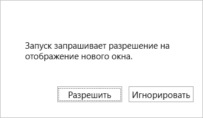

# <a name="best-practices-and-rules-for-the-office-dialog-api"></a>Рекомендации и правила Office dialog API

В этой статье данная статья содержит правила, приемы и лучшие практики для API диалогового Office, включая лучшие практики для разработки пользовательского интерфейса диалогов и использования API в одно-странице приложения (SPA)

> [!NOTE]
> В этой статье предполагается, что вы знакомы с основами использования API диалогового Office, как описано в Статье [Использование API](dialog-api-in-office-add-ins.md)диалогов Office в Office надстройки .
> 
> См. также обработку ошибок и событий [Office диалоговом окне](dialog-handle-errors-events.md).

## <a name="rules-and-gotchas"></a>Правила и подсказки

- Диалоговое окно может перемещаться только по URL-адресам HTTPS, а не по HTTP.
- URL-адрес, переданный [методу displayDialogAsync,](/javascript/api/office/office.ui) должен быть в том же домене, что и сама надстройка. Это не может быть поддомен. Но страница, которая передается ему, может перенаправляться на страницу в другом домене.
- В окне хост, которое может быть области [](../reference/manifest/functionfile.md) задач или файл функций без пользовательского интерфейса команды надстройки, может одновременно открываться только одно диалоговое окно.
- В диалоговом окне Office только два API:
  - Функция [messageParent.](/javascript/api/office/office.ui#messageparent-message-)
  - `Office.context.requirements.isSetSupported`(Дополнительные сведения см. в [Office приложениях и требованиях API.)](specify-office-hosts-and-api-requirements.md)
- Функция [messageParent](/javascript/api/office/office.ui#messageparent-message-) может быть вызвана только со страницы в том же домене, что и сама надстройка.

## <a name="best-practices"></a>Рекомендованные методики

### <a name="avoid-overusing-dialog-boxes"></a>Избегайте чрезмерного окантовки диалогов

Поскольку перекрывающиеся элементы пользовательского интерфейса не приветствуются, избегайте открытия диалогового окна на панели задач, если это не требуется в сценарий. При планировании контактной зоны помните, что в области задач можно использовать вкладки. Пример области задач на вкладке см. в примере Excel Надстройки [JavaScript SalesTracker.](https://github.com/OfficeDev/Excel-Add-in-JavaScript-SalesTracker)

### <a name="designing-a-dialog-box-ui"></a>Проектирование пользовательского интерфейса диалоговых полей

Лучшие практики в диалоговом окне см. в Office [надстройки.](../design/dialog-boxes.md)

### <a name="handling-pop-up-blockers-with-office-on-the-web"></a>Обработка блокировщиков всплывающих окон с помощью Office в Интернете

Попытка отобразить диалоговое окно при Office в Интернете может привести к блокировке блокатора всплывающих окна браузера. Office в Интернете имеет функцию, которая позволяет диалоговике надстройки быть исключением из блокатора всплывающее окно браузера. Когда код вызывает метод, Office в Интернете откроет запрос, аналогичный `displayDialogAsync` следующему.



Если пользователь выбирает **Разрешить,** откроется Office диалоговое окно. Если пользователь выбирает **Ignore,** запрос закрывается, а Office диалоговое окно не открывается. Вместо этого `displayDialogAsync` метод возвращает ошибку 12009. Код должен уловить эту ошибку и либо предоставить альтернативный интерфейс, не требующий диалога, либо отобразить сообщение пользователю, который сообщает, что надстройка требует от них разрешить диалоговое окно. (Подробнее о 12009 см. в руб. [Ошибки из displayDialogAsync](dialog-handle-errors-events.md#errors-from-displaydialogasync).)

Если по какой-либо причине необходимо отключить эту функцию, код должен отказаться. Он делает этот запрос с [объектом DialogOptions,](/javascript/api/office/office.dialogoptions) который передается `displayDialogAsync` методу. В частности, объект должен включать `promptBeforeOpen: false` . Если этот параметр установлен ложным, Office в Интернете не будет побуждать пользователя разрешить надстройки открыть диалоговое окно, и Office диалоговое окно не откроется.

### <a name="do-not-use-the-_host_info-value"></a>Не используйте значение \_ информации \_ о хост-сайте

Office автоматически добавляет параметр запроса `_host_info` в URL-адрес, который передается `displayDialogAsync`. Он примыкает к параметрам настраиваемого запроса, если таковые есть. Он не примыкает к последующим URL-адресам, в которые перемещается диалоговое окно. Корпорация Майкрософт может изменить содержимое этого значения или удалить его полностью, поэтому код не должен его читать. Это же значение добавляется в хранилище сеансов диалоговое окно (то есть свойство [Window.sessionStorage).](https://developer.mozilla.org/docs/Web/API/Window/sessionStorage) *Ваш код не должен ни считывать это значение, ни записывать в него данные*.

### <a name="opening-another-dialog-immediately-after-closing-one"></a>Открытие другого диалоговое окно сразу после закрытия одного

Не может быть открыто несколько диалогов с данной хост-страницы, поэтому перед открытием другого диалоговое окно код должен вызвать [Диалог.закрыть](/javascript/api/office/office.dialog#close__) в открытом `displayDialogAsync` диалоговом ок. Метод `close` асинхронный. По этой причине, если вы звоните сразу после звонка, первый диалог может не полностью закрыться, Office при попытке `displayDialogAsync` `close` открыть второй. Если это произойдет, Office возвращает ошибку [12007:](dialog-handle-errors-events.md#12007) "Операция не удалась, так как у этой надстройки уже есть активный диалог".

Метод не принимает параметр обратного вызова и не возвращает объект Promise, поэтому его нельзя ожидать ни с ключевым словом, ни `close` `await` с помощью `then` метода. По этой причине мы предлагаем следующий метод, когда необходимо открыть новый диалог сразу после закрытия диалогов: инкапсулировать код, чтобы открыть новый диалоговое окно в методе и разработать метод для повторного вызова себя, если вызов `displayDialogAsync` `12007` возвращается . Ниже приведен пример.

```javascript
function openFirstDialog() {
  Office.context.ui.displayDialogAsync("https://MyDomain/firstDialog.html", { width: 50, height: 50},
     (result) => {
      if(result.status === Office.AsyncResultStatus.Succeeded) {
        const dialog = result.value;
        dialog.close();
        openSecondDialog();
      }
      else {
         // Handle errors
      }
    }
  );
}
 
function openSecondDialog() {
  Office.context.ui.displayDialogAsync("https://MyDomain/secondDialog.html", { width: 50, height: 50},
    (result) => {
      if(result.status === Office.AsyncResultStatus.Failed) {
        if (result.error.code === 12007) {
          openSecondDialog(); // Recursive call
        }
        else {
         // Handle other errors
        }
      }
    }
  );
}
```

Кроме того, можно заставить код приостановить работу, прежде чем он попытается открыть второй диалог с помощью [метода setTimeout.](https://www.w3schools.com/jsref/met_win_settimeout.asp) Ниже приведен пример.

```javascript
function openFirstDialog() {
  Office.context.ui.displayDialogAsync("https://MyDomain/firstDialog.html", { width: 50, height: 50},
     (result) => {
      if(result.status === Office.AsyncResultStatus.Succeeded) {
        const dialog = result.value;
        dialog.close();
        setTimeout(() => { 
          Office.context.ui.displayDialogAsync("https://MyDomain/secondDialog.html", { width: 50, height: 50},
             (result) => { /* callback body */ }
          );
        }, 1000);
      }
      else {
         // Handle errors
      }
    }
  );
}
```

### <a name="best-practices-for-using-the-office-dialog-api-in-an-spa"></a>Наилучшие методы использования API Office диалогов в SPA

Если в вашей надстройке используется клиентская маршрутия, как это обычно делают одно-страницы приложений (SPAs), у вас есть возможность передать URL-адрес маршрута методу [displayDialogAsync](/javascript/api/office/office.ui) вместо URL-адреса отдельной страницы HTML. *Мы рекомендуем не делать этого по причинам, которые приведены ниже.*

> [!NOTE]
> Эта статья не относится к *маршрутике* на стороне сервера, например в веб-приложении на основе Express.

#### <a name="problems-with-spas-and-the-office-dialog-api"></a>Проблемы с spAs и API Office диалогов

Диалоговое Office находится в новом окне с собственным экземпляром двигателя JavaScript, а значит, это собственный контекст полного выполнения. Если вы пройдете маршрут, ваша базовая страница и весь ее код инициализации и загрузки снова запустится в этом новом контексте, и любые переменные задают свои начальные значения в диалоговом окне. Таким образом, этот метод загружает и запускает второй экземпляр приложения в окне окна, что частично побивает назначение SPA. Кроме того, код, который изменяет переменные в окне диалоговое окно, не изменяет версию области задач тех же переменных. Кроме того, в диалоговом окне имеется собственное хранилище сеансов (свойство [Window.sessionStorage),](https://developer.mozilla.org/docs/Web/API/Window/sessionStorage) которое не доступно из кода в области задач. Диалоговое окно и хост-страница, на которой был вызван, выглядят как `displayDialogAsync` два разных клиента на сервере. (Чтобы напомнить о том, что такое хост-страница, см. в этой странице Откройте диалоговое [окно с хост-страницы.)](dialog-api-in-office-add-ins.md#open-a-dialog-box-from-a-host-page)

Таким образом, если вы прошли путь к методу, у вас действительно не будет SPA; у вас будет два экземпляра одного и того же `displayDialogAsync` *SPA.* Кроме того, большая часть кода в экземпляре области задач никогда не будет использоваться в этом экземпляре, а большая часть кода в экземпляре диалогового окна никогда не будет использоваться в этом экземпляре. Это соответствует применению двух одностраничных приложений в одном пакете.

#### <a name="microsoft-recommendations"></a>Рекомендации Корпорации Майкрософт

Вместо передачи клиентского маршрута методу рекомендуется сделать один `displayDialogAsync` из следующих способов:

* Если код, который необходимо выполнить в диалоговом окне, достаточно сложный, создайте два разных spAs явно; то есть иметь два spAs в разных папках одного домена. Один SPA выполняется в диалоговом окне, а другой на хост-странице диалогового окна, где `displayDialogAsync` был вызван. 
* В большинстве сценариев в диалоговом окне требуется только простая логика. В таких случаях ваш проект будет значительно упрощен путем размещения одной HTML-страницы со встроенным javaScript или ссылкой на нее в домене spa. Передайте URL-адрес страницы в метод `displayDialogAsync`. Это означает, что вы отклонили от буквальной идеи одно-страницного приложения; При использовании API диалогового Office у вас нет ни одного экземпляра SPA.
