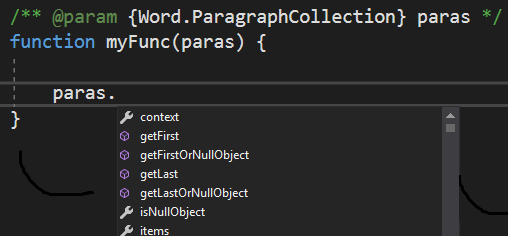

# <a name="get-javascript-intellisense-in-visual-studio-2017"></a><span data-ttu-id="07332-102">Создание IntelliSense для JavaScript в Visual Studio 2017</span><span class="sxs-lookup"><span data-stu-id="07332-102">Get JavaScript IntelliSense in Visual Studio 2017</span></span> 

<span data-ttu-id="07332-p101">При применении Visual Studio 2017 для разработки надстроек Office можно использовать JSDoc, чтобы активировать IntelliSense для переменных, объектов, параметров и возвращаемых значений JavaScript. В этой статье предоставлен обзор JSDoc, а также возможности его использования для создания IntellSense в Visual Studio. Дополнительные сведения см. в статьях [IntelliSense для JavaScript](https://docs.microsoft.com/visualstudio/ide/javascript-intellisense) и [Поддержка JSDoc в JavaScript](https://github.com/Microsoft/TypeScript/wiki/JsDoc-support-in-JavaScript).</span><span class="sxs-lookup"><span data-stu-id="07332-p101">When you use Visual Studio 2017 to develop Office Add-ins, you can use JSDoc to enable IntelliSense for your JavaScript variables, objects, parameters, and return values. This article provides an overview of JSDoc and how you can use it to create IntellSense in Visual Studio. For more details, see [JavaScript IntelliSense](https://docs.microsoft.com/visualstudio/ide/javascript-intellisense) and [JSDoc support in JavaScript](https://github.com/Microsoft/TypeScript/wiki/JsDoc-support-in-JavaScript).</span></span> 

## <a name="officejs-type-definitions"></a><span data-ttu-id="07332-106">Определения типов Office.js</span><span class="sxs-lookup"><span data-stu-id="07332-106">Office.js type definitions</span></span>

<span data-ttu-id="07332-p102">Вам необходимо предоставить Visual Studio определения типов Office.js. Для этого можно сделать следующее:</span><span class="sxs-lookup"><span data-stu-id="07332-p102">You need to provide the definitions of the types in Office.js to Visual Studio. To do this, you can:</span></span>

- <span data-ttu-id="07332-p103">Создать локальную копию файлов Office.js в папке вашего решения под названием `\Office\1\`. Эта локальная копия будет добавлена в шаблоны надстройки Office в Visual Studio во время создания проекта надстройки.</span><span class="sxs-lookup"><span data-stu-id="07332-p103">Have a local copy of the Office.js files in a folder in your solution named `\Office\1\`. The Office Add-in project templates in Visual Studio add this local copy when you create an add-in project.</span></span> 
- <span data-ttu-id="07332-p104">Использовать интернет-версию Office.js, добавив файл tsconfig.json в корневой каталог проекта веб-приложения в решении надстройки. Этот файл должен иметь указанное ниже содержимое.</span><span class="sxs-lookup"><span data-stu-id="07332-p104">Use an online version of Office.js by adding a tsconfig.json file to the root of the web application project in the add-in solution. The file should include the following content.</span></span>

    ```json
        {        
            "compilerOptions": {
                "allowJs": true,            // These settings apply to JavaScript files also.
                "noEmit":  true             // Do not compile the JS (or TS) files in this project.
            },
            "exclude": [
                "node_modules",             // Don't include any JavaScript found under "node_modules".
                "Scripts/Office/1"          // Suppress loading all the JavaScript files from the Office NuGet package.
            ],
            "typeAcquisition": {
                "enable": true,             // Enable automatic fetching of type definitions for detected JavaScript libraries.
                "include": [ "office-js" ]  // Ensure that the "Office-js" type definition is fetched.
            }
        }
    ```

## <a name="jsdoc-syntax"></a><span data-ttu-id="07332-113">Синтаксис JSDoc</span><span class="sxs-lookup"><span data-stu-id="07332-113">JSDoc syntax</span></span>

<span data-ttu-id="07332-p105">Основной метод — добавить перед переменной (параметром и т. п.) комментарий с указанием типа данных. Это позволит IntelliSense в Visual Studio определять участников. Примеры.</span><span class="sxs-lookup"><span data-stu-id="07332-p105">The basic technique is to precede the variable (or parameter, and so on) with a comment that identifies its data type. This allows IntelliSense in Visual Studio to infer its members. The following are examples.</span></span>

### <a name="variable"></a><span data-ttu-id="07332-117">Переменная</span><span class="sxs-lookup"><span data-stu-id="07332-117">Variable</span></span>

```js
/** @type {Excel.Range} */
var subsetRange;
```


### <a name="parameter"></a><span data-ttu-id="07332-119">Параметр</span><span class="sxs-lookup"><span data-stu-id="07332-119">Parameter</span></span>

```js
/** @param {Word.ParagraphCollection} paragraphs */
function myFunc(paragraphs){

}
```


### <a name="return-value"></a><span data-ttu-id="07332-121">Возвращаемое значение</span><span class="sxs-lookup"><span data-stu-id="07332-121">Return value</span></span>

```js
/** @returns {Word.Range} */
function myFunc() {

}
```


### <a name="complex-types"></a><span data-ttu-id="07332-123">Сложные типы</span><span class="sxs-lookup"><span data-stu-id="07332-123">Complex types</span></span>

```js
/** @typedef {{range: Word.Range, paragraphs: Word.ParagraphCollection}} MyType

/** @returns {MyType} */
function myFunc() {

}
```


## <a name="see-also"></a><span data-ttu-id="07332-125">См. также</span><span class="sxs-lookup"><span data-stu-id="07332-125">See also</span></span>

- [<span data-ttu-id="07332-126">Создание и отладка надстроек в Visual Studio</span><span class="sxs-lookup"><span data-stu-id="07332-126">Create and debug add-ins in Visual Studio</span></span>](create-and-debug-office-add-ins-in-visual-studio.md)
