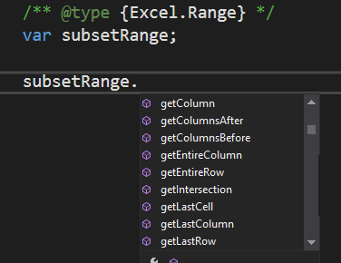

# <a name="get-javascript-intellisense-in-visual-studio-2017"></a>Создание IntelliSense для JavaScript в Visual Studio 2017

При применении Visual Studio 2017 для разработки надстроек Office можно использовать JSDoc, чтобы активировать IntelliSense для переменных, объектов, параметров и возвращаемых значений JavaScript. В этой статье предоставлен обзор JSDoc, а также возможности его использования для создания IntellSense в Visual Studio. Дополнительные сведения см. в статьях [IntelliSense для JavaScript](/visualstudio/ide/javascript-intellisense) и [Поддержка JSDoc в JavaScript](https://github.com/Microsoft/TypeScript/wiki/JsDoc-support-in-JavaScript). 

## <a name="officejs-type-definitions"></a>Определения типов Office.js

Вам необходимо предоставить Visual Studio определения типов Office.js. Для этого можно сделать следующее:

- Создать локальную копию файлов Office.js в папке вашего решения под названием `\Office\1\`. Эта локальная копия будет добавлена в шаблоны надстройки Office в Visual Studio во время создания проекта надстройки. 
- Использовать интернет-версию Office.js, добавив файл tsconfig.json в корневой каталог проекта веб-приложения в решении надстройки. Этот файл должен иметь указанное ниже содержимое.

    ```json
        {
            "compilerOptions": {
                "allowJs": true,            // These settings apply to JavaScript files also.
                "noEmit":  true             // Do not compile the JS (or TS) files in this project.
            },
            "exclude": [
                "node_modules",             // Don't include any JavaScript found under "node_modules".
                "Scripts/Office/1"          // Suppress loading all the JavaScript files from the Office NuGet package.
            ],
            "typeAcquisition": {
                "enable": true,             // Enable automatic fetching of type definitions for detected JavaScript libraries.
                "include": [ "office-js" ]  // Ensure that the "Office-js" type definition is fetched.
            }
        }
    ```

## <a name="jsdoc-syntax"></a>Синтаксис JSDoc

Основной метод — добавить перед переменной (параметром и т. п.) комментарий с указанием типа данных. Это позволит IntelliSense в Visual Studio определять участников. Примеры.

### <a name="variable"></a>Переменная

```js
/** @type {Excel.Range} */
var subsetRange;
```


### <a name="parameter"></a>Параметр

```js
/** @param {Word.ParagraphCollection} paragraphs */
function myFunc(paragraphs){

}
```


### <a name="return-value"></a>Возвращаемое значение

```js
/** @returns {Word.Range} */
function myFunc() {

}
```


### <a name="complex-types"></a>Сложные типы

```js
/** @typedef {{range: Word.Range, paragraphs: Word.ParagraphCollection}} MyType

/** @returns {MyType} */
function myFunc() {

}
```


## <a name="see-also"></a>См. также

- [Создание и отладка надстроек в Visual Studio](create-and-debug-office-add-ins-in-visual-studio.md)
