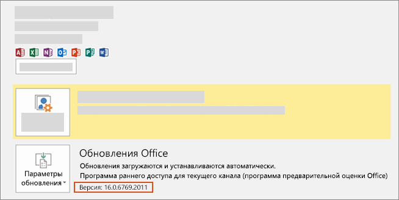

# Установка последней версии Office

Первыми новые функции для разработчиков, в том числе предварительные версии, получают подписчики, которые получают последние сборки Office раньше других.

## Выберите получение последних сборки Office

- Если вы абонент Microsoft 365 для семьи, личный или университетский, см. статью [Be an Office Insider](https://insider.office.com).
- Если вы клиент Приложения Microsoft 365 для бизнеса, см. в выпуске [Install the First Release build for Приложения Microsoft 365 для бизнеса клиентов.](https://support.office.com/article/Install-the-First-Release-build-for-Office-365-for-business-customers-4dd8ba40-73c0-4468-b778-c7b744d03ead)
- Если вы используете Office для Mac:
  - Запустите приложение Office.
  - Выберите пункт **Проверить наличие обновлений** в меню "Справка".
  - В окне "Автоматическое обновление (Майкрософт)" установите флажок для участия в программе предварительной оценки Office.

## Получите последнюю сборку Office

1. Скачайте [средство развертывания Office](https://www.microsoft.com/download/details.aspx?id=49117).
2. Запустите это средство. Будут извлечены два файла: Setup.exe и configuration.xml.
3. Замените файл configuration.xml [файлом конфигурации первого выпуска](https://raw.githubusercontent.com/OfficeDev/Office-Add-in-Commands-Samples/master/Tools/FirstReleaseConfig/configuration.xml).
4. Выполните следующую команду от имени администратора: `setup.exe /configure configuration.xml`

> [!NOTE]
> Команда может выполняться долго, при этом ход ее выполнения нигде не отображается.

По завершении процесса установки у вас будут последние версии приложений Office. Чтобы убедиться, что у вас последняя сборка, в любом приложении Office последовательно выберите **Файл** > **Учетная запись**. В разделе "Обновления Office" над номером версии должна быть надпись "Предварительная оценка Office".

## Минимальные сборки Office, которые могут использовать наборы обязательных элементов API JavaScript для Office

- [Наборы обязательных элементов API JavaScript для Excel](../reference/requirement-sets/excel-api-requirement-sets.md)
- [Наборы обязательных элементов API JavaScript для OneNote](../reference/requirement-sets/onenote-api-requirement-sets.md)
- [Наборы обязательных элементов API JavaScript для Outlook](../reference/requirement-sets/outlook-api-requirement-sets.md)
- [Наборы обязательных элементов API JavaScript для PowerPoint](../reference/requirement-sets/powerpoint-api-requirement-sets.md)
- [Наборы обязательных элементов API JavaScript для Word](../reference/requirement-sets/word-api-requirement-sets.md)
- [Наборы обязательных элементов API диалоговых окон](../reference/requirement-sets/dialog-api-requirement-sets.md)
- [Наборы обязательных элементов общего API для Office](../reference/requirement-sets/office-add-in-requirement-sets.md)
