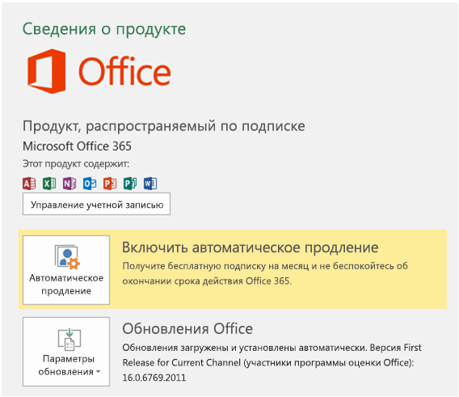

# Установка последней версии Office

Первыми новые функции для разработчиков, в том числе предварительные версии, получают подписчики, которые получают последние сборки Office раньше других.

## Как получать последние сборки раньше других

Чтобы получать последние сборки Office раньше других:

- Если вы подписаны на Office 365 для дома, Office 365 персональный или Office 365 для студентов, [примите участие в программе предварительной оценки Office](https://products.office.com/office-insider).
- Если вы пользуетесь Office 365 для бизнеса, прочитайте статью [Установка сборки раннего выпуска для клиентов Office 365 для бизнеса](https://support.office.com/article/Install-the-First-Release-build-for-Office-365-for-business-customers-4dd8ba40-73c0-4468-b778-c7b744d03ead).
- Если вы используете Office для Mac:
    - Запустите программу Office для Mac.
    - Выберите пункт **Проверить наличие обновлений** в меню "Справка".
    - В окне "Автоматическое обновление (Майкрософт)" установите флажок для участия в программе предварительной оценки Office.

## Как получить последнюю сборку

Чтобы получить последнюю сборку Office:

1. Скачайте [средство развертывания Office](https://www.microsoft.com/download/details.aspx?id=49117).
2. Запустите это средство. Будут извлечены два файла: Setup.exe и configuration.xml.
3. Замените файл configuration.xml [файлом конфигурации первого выпуска](https://raw.githubusercontent.com/OfficeDev/Office-Add-in-Commands-Samples/master/Tools/FirstReleaseConfig/configuration.xml).
4. Выполните следующую команду от имени администратора: `setup.exe /configure configuration.xml`

    > [!NOTE]
    > Команда может выполняться долго, при этом ход ее выполнения нигде не отображается.

По завершении процесса установки у вас будут последние версии приложений Office. Чтобы убедиться, что у вас последняя сборка, в любом приложении Office последовательно выберите **Файл** > **Учетная запись**. В разделе "Обновления Office" над номером версии должна быть надпись "Предварительная оценка Office".

## Минимальные сборки Office, которые могут использовать наборы обязательных элементов API JavaScript для Office

Сведения о минимальных сборках продуктов для каждой платформы см. в следующих статьях:

- [Наборы обязательных элементов API JavaScript для Word](/office/dev/add-ins/reference/requirement-sets/word-api-requirement-sets)
- [Наборы обязательных элементов API JavaScript для Excel](/office/dev/add-ins/reference/requirement-sets/excel-api-requirement-sets)
- [Наборы обязательных элементов API JavaScript для OneNote](/office/dev/add-ins/reference/requirement-sets/onenote-api-requirement-sets)
- [Наборы обязательных элементов API диалоговых окон](/office/dev/add-ins/reference/requirement-sets/dialog-api-requirement-sets)
- [Наборы обязательных элементов общего API для Office](/office/dev/add-ins/reference/requirement-sets/office-add-in-requirement-sets)
