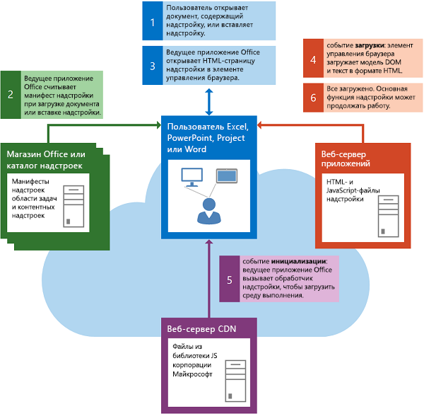
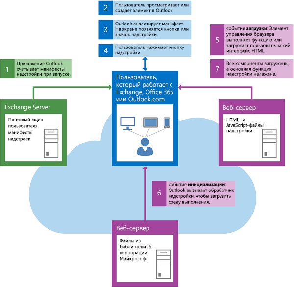

# Загрузка модели DOM и среды выполнения

Перед запуском собственной логики надстройка должна проверить, что загружены модель DOM и среда выполнения Надстройки Office.

## Запуск контентной надстройки или надстройки области задач

На рисунке ниже приведен поток событий, происходящих при запуске контентной надстройки или надстройки области задач в Excel, PowerPoint, Project или Word.

Следующие события происходят, когда начинается надстройка содержимого или области задач.

1. Пользователь открывает документ, который уже содержит надстройку, или вставляет надстройку в документ.

2. Клиентское Office читает XML-манифест надстройки из AppSource, каталог приложений в SharePoint или из общего каталога папок, из него исходят.

3. Клиент Office открывает страницу HTML надстройки в элементе управления браузером.

    Следующие два действия, 4 и 5, выполняются одновременно и параллельно. Поэтому код надстройки перед обработкой должен убедиться, что и модель DOM, и среда выполнения надстройки полностью загрузились.

4. Элемент управления браузером загружает тело DOM и HTML и вызывает обработчик событий для `window.onload` события.

5. Клиентское приложение Office загружает среду времени запуска, которая загружает и засеивает файлы библиотеки API Office JavaScript с сервера сети рассылки контента (CDN), а  затем вызывает обработчик событий надстройки для события инициализации объекта [Office,](/javascript/api/office) если ему назначен обработчик. В это время также проверяется, выполнялась ли передача (или связывание) любых обратных вызовов (или связанных функций `then()`) обработчику `Office.onReady`. Дополнительные сведения о различиях между `Office.initialize` и `Office.onReady` , см. в [инициализации надстройки](initialize-add-in.md).

6. После завершения загрузки DOM и основного текста HTML и инициализации надстройки запускается основная функция надстройки.

## Запуск надстройки Outlook

На рисунке ниже приведен поток событий при запуске надстройки Outlook на настольном компьютере, планшетном ПК или смартфоне.

Следующие события происходят при Outlook надстройки.

1. При запуске Outlook считывает XML-манифесты надстроек Outlook, установленных для учетной записи пользователя.

2. Пользователь выбирает элемент в Outlook.

3. Если выбранный элемент удовлетворяет условиям активации надстройки Outlook, то Outlook активирует надстройку и делает соответствующую кнопку видимой в пользовательском интерфейсе.

4. Если пользователь нажимает кнопку для запуска надстройки Outlook, то ведущее приложение открывает HTML-страницу в элементе управления браузером. Следующие два шага, шаг 5 и шаг 6, выполняются одновременно.

5. Элемент управления браузером загружает тело DOM и HTML и вызывает обработчик событий для `onload` события.

6. Outlook загружает среду выполнения, которая загружает и кэширует API JavaScript для файлов библиотеки JavaScript с сервера сети доставки содержимого, а затем вызывает обработчик события [инициализации](/javascript/api/office#Office_initialize_reason_) объекта [Office](/javascript/api/office) надстройки, если ему назначен обработчик. В это время также проверяется, выполнялась ли передача (или связывание) любых обратных вызовов (или связанных функций `then()`) обработчику `Office.onReady`. Дополнительные сведения о различиях между `Office.initialize` и `Office.onReady` , см. в [инициализации надстройки](initialize-add-in.md).

7. После завершения загрузки DOM и основного текста HTML и инициализации надстройки запускается основная функция надстройки.

## См. также

- [Общие сведения об API JavaScript для Office](understanding-the-javascript-api-for-office.md)
- [Инициализация надстройки Office](initialize-add-in.md)
