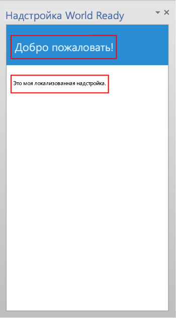
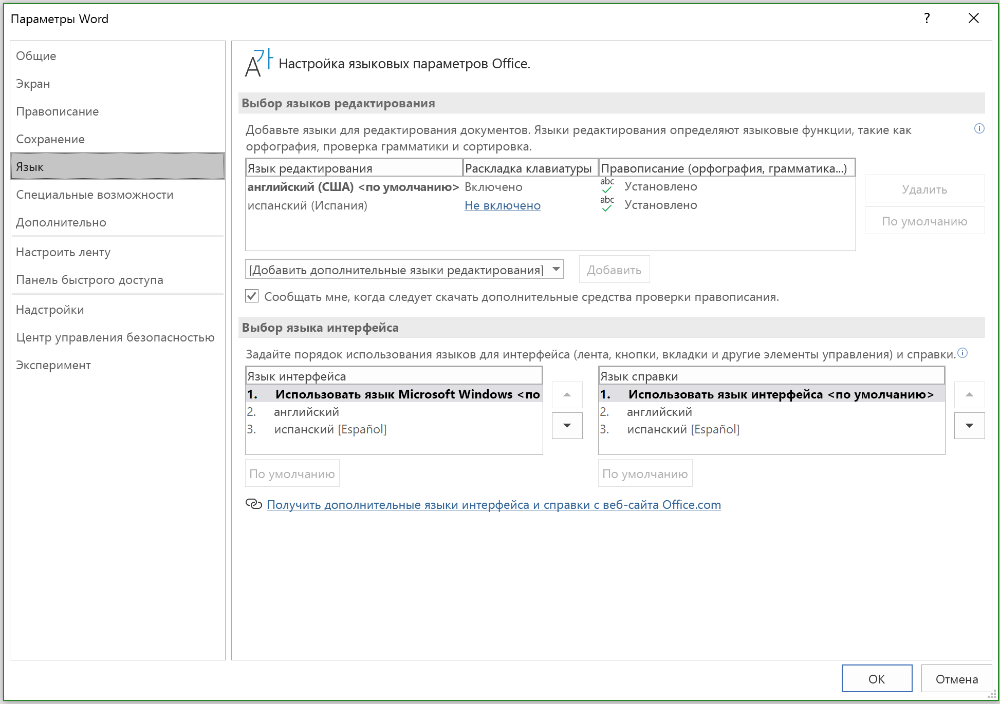

# <a name="localization-for-office-add-ins"></a>Локализация надстроек Office

Вы можете реализовать любую схему локализации, которая подходит вашему Надстройка Office. API JavaScript и схема манифеста платформы Надстройки Office предоставляют несколько вариантов. Вы можете использовать API JavaScript для Office, чтобы определить языковые параметры и отображать строки, основываясь на языковых параметрах ведущего приложения, или интерпретировать и отображать данные на основе языковых параметров данных. Вы можете использовать манифест, чтобы указать расположение файла надстройки и описательной информации, зависящих от языковых параметров. Либо можно использовать сценарий Microsoft Ajax для поддержки глобализации и локализации.

## <a name="use-the-javascript-api-to-determine-locale-specific-strings"></a>Определение параметров, зависящих от языка, с помощью API JavaScript

API JavaScript для Office предоставляет два свойства, которые поддерживают отображение и интерпретацию значений в соответствии с языковыми параметрами ведущего приложения и данными:

- [Context.displayLanguage][displayLanguage] задает языковой стандарт (или язык) пользовательского интерфейса ведущего приложения. В примере ниже показано, как проверить, какой языковый стандарт используется (en-US или fr-Fr), и отобразить приветствие на языке ведущего приложения.

    ```js
    function sayHelloWithDisplayLanguage() {
        var myLanguage = Office.context.displayLanguage;
        switch (myLanguage) {
            case 'en-US':
                write('Hello!');
                break;
            case 'fr-FR':
                write('Bonjour!');
                break;
        }
    }

    // Function that writes to a div with id='message' on the page.
    function write(message) {
        document.getElementById('message').innerText += message;
    }
    ```

- [Context.contentLanguage][contentLanguage] задает языковой стандарт данных. Вы можете не проверять свойство [displayLanguage], а назначить свойству [contentLanguage] значение `myLanguage` и воспользоваться тем же кодом для отображения приветствия на языке данных:

    ```js
    var myLanguage = Office.context.contentLanguage;
    ```

## <a name="control-localization-from-the-manifest"></a>Управление локализацией через манифест


Каждая надстройка Office задает в своем манифесте элемент [DefaultLocale] и языковой стандарт. По умолчанию платформа надстроек Office и ведущие приложения Office применяют значения элементов [Description], [DisplayName], [IconUrl], [HighResolutionIconUrl] и [SourceLocation] ко всем языковым стандартам. Чтобы изменить значения для определенных языковых стандартов, укажите для любого из этих пяти элементов дочерний элемент [Override]. Значение элемента [DefaultLocale] и атрибута `Locale` элемента [Override] указывается в соответствии со спецификацией [RFC 3066], "Теги для идентификации языков". В таблице 1 описана поддержка локализации для этих элементов.

*Таблица 1. Поддержка локализации*


|**Элемент**|**Поддержка локализации**|
|:-----|:-----|
|[Описание]   |Для каждого заданного языкового стандарта пользователи могут видеть локализованное описание надстройки в AppSource (или частном каталоге).<br/>В случае надстроек Outlook пользователи смогут увидеть описание в Центре администрирования Exchange после установки.|
|[DisplayName]   |Для каждого заданного языкового стандарта пользователи могут видеть локализованное описание надстройки в AppSource (или частном каталоге).<br/>В случае надстроек Outlook пользователи смогут увидеть отображаемое имя в качестве метки для кнопки надстройки Outlook и в Центре администрирования Exchange после установки.<br/>В случае контентных надстроек и надстроек области задач пользователи могут видеть отображаемое имя на ленте после установки надстройки.|
|[IconUrl]        |Изображение значка является необязательным. Можно использовать ту же методику переопределений, чтобы задать определенное изображение для определенной культуры. Если вы используете значок и локализуете его, пользователи с заданными языковыми параметрами могут видеть локализованный значок надстройки.<br/>В случае надстроек Outlook пользователи могут видеть значок в Центре администрирования Exchange после установки надстройки.<br/>После установки надстроек области задач и контентных надстроек пользователи видят значок на ленте.|
|[HighResolutionIconUrl] **Важно!** Этот элемент доступен только для надстроек, использующих схему манифеста версии 1.1.|Изображение значка с высоким разрешением не является обязательным, но если оно указано, то должно находиться после элемента [IconUrl]. Если указан параметр [HighResolutionIconUrl] и надстройка установлена на устройстве, поддерживающем высокое разрешение, то вместо значения [IconUrl] используется значение [HighResolutionIconUrl].<br/>Можно использовать ту же методику переопределений, чтобы задать определенное изображение для определенной культуры. Если вы используете значок и локализуете его, пользователи с заданными языковыми параметрами могут видеть локализованный значок надстройки.<br/>В случае надстроек Outlook пользователи могут видеть значок в Центре администрирования Exchange после установки надстройки.<br/>После установки надстроек области задач и контентных надстроек пользователи видят значок на ленте.|
|[Resources] **Важно!** Этот элемент доступен только для надстроек, в которых используется схема манифеста версии 1.1.   |Для пользователей в каждой указываемой вами локали отображаются ресурсы строк и значков, которые вы специально создаете для надстройки в этой локали. |
|[SourceLocation]   |Пользователи каждого языкового стандарта видят веб-страницу, специально разработанную для использования надстройки с этим стандартом. |


> [!NOTE]
> Локализовать описание и отображаемое имя можно только для языковых стандартов, которые поддерживаются в Office. Список языков и языковых стандартов для текущего выпуска Office см. в статье [Идентификаторы языков и значения OptionState Id в Office 2013](https://docs.microsoft.com/previous-versions/office/office-2013-resource-kit/cc179219(v=office.15)).


### <a name="examples"></a>Примеры

Например, надстройка Office может задать для параметра [DefaultLocale] значения `en-us`. Для элемента [DisplayName] надстройка может задать дочерний элемент [Override], соответствующий языковому стандарту `fr-fr`, как показано ниже.


```xml
<DefaultLocale>en-us</DefaultLocale>
...
<DisplayName DefaultValue="Video player">
    <Override Locale="fr-fr" Value="Lecteur vidéo" />
</DisplayName>
```

> [!NOTE]
> Если вам необходимо локализовать несколько областей в семействе языков, например `de-de` и `de-at`, рекомендуется разделить элементы `Override` для каждой области. Использование только названия языка, в этом случае `de`, не поддерживается ни для одного сочетания ведущих приложений Office и платформ.

Это значит, что по умолчанию надстройка использует языковой стандарт `en-us`. Пользователи видят отображаемое имя Video player (видеопроигрыватель) на английском языке для всех языковых стандартов за исключением случаев, когда на клиентском компьютере используется языковой стандарт `fr-fr`. В этом случае пользователи увидят отображаемое имя Lecteur video на французском языке.

> [!NOTE]
> Вы можете указать только одно переопределение на язык, в том числе для языкового стандарта по умолчанию. Например, если по умолчанию используется языковой стандарт `en-us`, невозможно также указать переопределение для `en-us`. 

В приведенном ниже примере применяется переопределение языкового стандарта для элемента [Description]. Сначала он задает языковой стандарт по умолчанию `en-us` и описание на английском языке, а затем указывает оператор [Override] с описанием на французском языке для языкового стандарта `fr-fr`:

```xml
<DefaultLocale>en-us</DefaultLocale>
...
<Description DefaultValue=
   "Watch YouTube videos referenced in the emails you receive
   without leaving your email client.">
   <Override Locale="fr-fr" Value=
   "Visualisez les vidéos YouTube référencées dans vos courriers 
   électronique directement depuis Outlook et Outlook Web App."/>
</Description>
```

Это значит, что надстройка предполагает языковой стандарт `en-us` по умолчанию. Пользователи увидят описание на английском языке в атрибуте `DefaultValue` для всех языковых стандартов, если на клиентском компьютере не выбран языковой стандарт `fr-fr`. В этом случае они увидят описание на французском языке.

В следующем примере надстройка задает отдельное приложение, которое больше подходит для языкового стандарта и региональных параметров `fr-fr`. Пользователи видят изображение DefaultLogo.png по умолчанию, кроме тех случаев, когда на клиентском компьютере используется языковой стандарт `fr-fr`. В этом случае пользователи видят изображение FrenchLogo.png. 


```xml
<!-- Replace "domain" with a real web server name and path. -->
<IconUrl DefaultValue="https://<domain>/DefaultLogo.png"/>
<Override Locale="fr-fr" Value="https://<domain>/FrenchLogo.png"/>
```

В примере ниже показано, как локализовать ресурс в разделе `Resources`. Здесь применяется переопределение локали для изображения, и используется изображение, более подходящее для языка и региональных параметров `ja-jp`.

```xml
<Resources>
      <bt:Images>
        <bt:Image id="icon1_16x16" DefaultValue="https://www.contoso.com/icon_default.png">
          <bt:Override Locale="ja-jp" Value="https://www.contoso.com/ja-jp16-icon_default.png" />
        </bt:Image>
 ...
```


В случае элемента [SourceLocation] поддержка дополнительных языковых стандартов означает предоставление отдельного исходного HTML-файла для каждого из указанных языковых стандартов. Пользователи с заданными языковыми стандартами увидят настраиваемые для них веб-страницы.

В случае надстроек Outlook элемент [SourceLocation] также сопоставляется с форм-фактором. Это позволяет предоставлять отдельный локализованный исходный HTML-файл для каждого соответствующего форм-фактора. Вы можете задать один или несколько дочерних элементов [Override] в каждом применимом элементе параметров ([DesktopSettings], [TabletSettings] или [PhoneSettings]). В приведенном ниже примере показаны элементы параметров для форм-факторов настольного компьютера, планшета и смартфона, каждому из которых соответствует один HTML-файл для языкового стандарта по умолчанию и другой файл для французского языкового стандарта.


```xml
<DesktopSettings>
   <SourceLocation DefaultValue="https://contoso.com/Desktop.html">
      <Override Locale="fr-fr" Value="https://contoso.com/fr/Desktop.html" />
   </SourceLocation>
   <RequestedHeight>250</RequestedHeight>
</DesktopSettings>
<TabletSettings>
   <SourceLocation DefaultValue="https://contoso.com/Tablet.html">
      <Override Locale="fr-fr" Value="https://contoso.com/fr/Tablet.html" />
   </SourceLocation>
   <RequestedHeight>200</RequestedHeight>
</TabletSettings>
<PhoneSettings>
   <SourceLocation DefaultValue="https://contoso.com/Mobile.html">
      <Override Locale="fr-fr" Value="https://contoso.com/fr/Mobile.html" />
   </SourceLocation>
</PhoneSettings>
```

## <a name="match-datetime-format-with-client-locale"></a>Приведение формата даты и времени в соответствие языковому стандарту клиента

Получить языковой стандарт интерфейса ведущего приложения можно с помощью свойства [displayLanguage]. Затем можно отобразить значения даты и времени в формате, соответствующем текущему языковому стандарту ведущего приложения. Для этого можно подготовить файл ресурсов и указать в нем формат даты и времени для каждого языкового стандарта, который поддерживает надстройка Office. После этого надстройка сможет сопоставлять соответствующий формат даты и времени с языковым стандартом, полученным из свойства [displayLanguage], во время выполнения.

Получить языковой стандарт данных ведущего приложения можно с помощью свойства [contentLanguage]. На основе этого значения можно должным образом толковать или отображать строки даты и времени. Например, в языковом стандарте `jp-JP` дата и время представляются в формате `yyyy/MM/dd`, а в языковом стандарте `fr-FR` — в формате `dd/MM/yyyy`.


## <a name="use-ajax-for-globalization-and-localization"></a>Использование Ajax для глобализации и локализации


Если для создания Надстройки Office вы используете Visual Studio, платформа .NET Framework и Ajax предоставляют способы глобализации и локализации файлов клиентских скриптов.

Можно глобализировать и использовать расширения типов JavaScript [Date](https://msdn.microsoft.com/library/caf98d32-2de2-4704-8198-692350343681.aspx) и [Number](https://msdn.microsoft.com/library/c216d3a1-12ae-47d1-bca1-c3666d04572f.aspx) и объект JavaScript [Date](https://developer.mozilla.org/docs/Web/JavaScript/Reference/Global_Objects/Date) в коде JavaScript для Надстройка Office, чтобы отображать значения в зависимости от языковых параметров, заданных в текущем браузере. Дополнительные сведения см. в статье [Walkthrough: Globalizing a Date by Using Client Script](https://msdn.microsoft.com/library/69b34e6d-d590-4d03-a763-b7ae54b47d74.aspx).

Можно включить локализованные строки ресурсов напрямую в отдельные файлы JavaScript, чтобы предоставить клиентские файлы скриптов для разных языковых параметров, задаваемых в браузере или предоставляемых пользователем. Создайте отдельный файл скрипта для каждого поддерживаемого языкового параметра. В каждый файл скрипта включите объект в формате JSON, содержащий строки ресурсов для соответствующего языкового параметра. Локализованные значения применяются во время выполнения скрипта в браузере.


## <a name="example-build-a-localized-office-add-in"></a>Пример. Создание локализованной надстройки Office

В этом разделе представлены примеры того, как локализовать описание, отображаемое имя и пользовательский интерфейс Надстройка Office. 

> [!NOTE]
> Чтобы скачать Visual Studio 2017, перейдите на [страницу интегрированной среды разработки Visual Studio](https://visualstudio.microsoft.com/vs/). Во время установки потребуется выбрать рабочую нагрузку разработки для Office и SharePoint.

### <a name="configure-office-to-use-additional-languages-for-display-or-editing"></a>Настройка Office на использование дополнительных языков для отображения или редактирования

Чтобы запустить предоставленный образец кода, настройте Microsoft Office на своем компьютере для использования дополнительных языков, чтобы надстройку можно было тестировать на переключение языка меню и команд, для редактирования и/или проверки.

Для установки дополнительного языка можно использовать языковой пакет Office. Дополнительные сведения о языковых пакетах и способах их получения см. на странице [дополнительных языковых пакетов для Office](https://office.microsoft.com/language-packs/).

После установки языкового пакета вы можете настроить Office на использование установленного языка для пользовательского интерфейса и/или для редактирования содержимого документов. В примере в этой статье используется установка Office, в которой применяется испанский языковой пакет.

### <a name="create-an-office-add-in-project"></a>Создание проекта надстройки Office

Необходимо создать проект надстройки Office в Visual Studio 2017. 

> [!NOTE]
> Если вы еще не установили Visual Studio 2017, см. инструкции по скачиванию на [странице интегрированной среды разработки Visual Studio](https://visualstudio.microsoft.com/vs/). Во время установки потребуется выбрать рабочую нагрузку разработки для Office и SharePoint. Если вы уже установили Visual Studio 2017, [используйте установщик Visual Studio](https://docs.microsoft.com/visualstudio/install/modify-visual-studio/), чтобы убедиться, что также установлена рабочая нагрузка разработки для Office и SharePoint.


1. В Visual Studio выберите команду **Файл** > **Создать проект**.
2. В диалоговом окне **Создание проекта** разверните узел  **Visual Basic** или **Visual C#**, узел **Office/SharePoint**, а затем выберите **Надстройки**.
3. Выберите **Надстройка Word** и присвойте надстройке имя **WorldReadyAddIn**. Нажмите кнопку **ОК**.

### <a name="localize-the-text-used-in-your-add-in"></a>Локализация текста, используемого в вашей надстройке

Текст, который нужно локализовать на другом языке, отображается в двух областях:

-  **Отображаемое имя и описание надстройки**. Они управляются записями в файле манифеста приложения.

-  **Пользовательский интерфейс надстройки**. Вы можете локализовать строки, отображаемые в пользовательском интерфейсе надстройки, с помощью кода JavaScript, например используя отдельный файл ресурсов с локализованными строками.

Локализация отображаемого имени и описания надстройки:

1. В **обозревателе решений** разверните узлы **WorldReadyAddIn** и **WorldReadyAddInManifest**, а затем выберите **WorldReadyAddIn.xml**.

2. В файле WorldReadyAddInManifest.xml замените элементы [DisplayName] и [Description] на приведенный ниже блок кода.

    > [!NOTE]
    > Вы можете заменить локализованные строки на испанском языке, используемые в этом примере для элементов [DisplayName] и [Description], локализованными строками на любом другом языке.

    ```xml
    <DisplayName DefaultValue="World Ready add-in">
      <Override Locale="es-es" Value="Aplicación de uso internacional"/>
    </DisplayName>
    <Description DefaultValue="An add-in for testing localization">
      <Override Locale="es-es" Value="Una aplicación para la prueba de la localización"/>
    </Description>
    ```

3. После изменения отображаемого языка для Office 2013, к примеру, с английского на испанский и последующего запуска надстройки отображаемое имя и описание надстройки локализуются.

Настройка пользовательского интерфейса надстройки:

1. В **обозревателе решений** Visual Studio выберите элемент **Home.html**.

2. Замените содержимое элемента `<body>` в файле Home.html на приведенный ниже HTML-код и сохраните файл.

    ```html
    <body>
        <!-- Page content -->
        <div id="content-header" class="ms-bgColor-themePrimary ms-font-xl">
            <div class="padding">
                <h1 id="greeting" class="ms-fontColor-white"></h1>
            </div>
        </div>
        <div id="content-main">
            <div class="padding">
                <div class="ms-font-m">
                    <p id="about"></p>
                </div>
            </div>
        </div>
    </body>
    ```

На приведенном ниже рисунке показаны элемент заголовка (h1) и элемент абзаца (p), в которых будет отображаться локализованный текст после завершения оставшихся действий и запуска надстройки.

*Рис. 1. Пользовательский интерфейс надстройки*



### <a name="add-the-resource-file-that-contains-the-localized-strings"></a>Добавление файла ресурсов с локализованными строками

Файл ресурсов JavaScript содержит строки, используемые для пользовательского интерфейса надстройки. HTML-код для пользовательского интерфейса примера надстройки содержит элемент `<h1>`, отображающий приветствие, и элемент `<p>`, который знакомит пользователя с надстройкой. 

Чтобы включить локализованные строки для заголовка и абзаца, нужно поместить строки в отдельный файл ресурса. Файл ресурса создает объект JavaScript, который содержит отдельный объект Нотация объектов JavaScript (JSON) для каждого набора локализованных строк. Файл ресурса также предоставляет метод для получения соответствующего объекта JSON для определенного региона.

Добавление файла ресурсов в проект надстройки:

1. В **обозревателе решений** Visual Studio, щелкните правой кнопкой мыши проект **WorldReadyAddInWeb** и выберите **Добавить** > **Создать элемент**. 

2. В диалоговом окне **Добавление нового элемента** выберите параметр **файл JavaScript**.

3. Введите **UIStrings.js** в качестве имени файла и нажмите кнопку **Добавить**.

4. Добавьте в файл UIStrings.js приведенный ниже код и сохраните файл.

    ```js
    /* Store the locale-specific strings */

    var UIStrings = (function ()
    {
        "use strict";

        var UIStrings = {};

        // JSON object for English strings
        UIStrings.EN =
        {
            "Greeting": "Welcome",
            "Introduction": "This is my localized add-in."
        };

        // JSON object for Spanish strings
        UIStrings.ES =
        {
            "Greeting": "Bienvenido",
            "Introduction": "Esta es mi aplicación localizada."
        };

        UIStrings.getLocaleStrings = function (locale)
        {
            var text;

            // Get the resource strings that match the language.
            switch (locale)
            {
                case 'en-US':
                    text = UIStrings.EN;
                    break;
                case 'es-ES':
                    text = UIStrings.ES;
                    break;
                default:
                    text = UIStrings.EN;
                    break;
            }

            return text;
        };

        return UIStrings;
    })();
    ```

Файл ресурса UIStrings.js создает объект **UIStrings**, который содержит локализованные строки пользовательского интерфейса надстройки.

### <a name="localize-the-text-used-for-the-add-in-ui"></a>Локализация текста, используемого для пользовательского интерфейса надстройки

Чтобы использовать в надстройке файл ресурсов, вам потребуется добавить для него тег сценария в файл Home.html. При загрузке файла Home.html выполняется файл UIStrings.js, и объект **UIStrings**, используемый для получения строк, становится доступен в коде. Добавьте приведенный ниже HTML-код в тег заголовка для файла Home.html, чтобы сделать объект **UIStrings** доступным в коде.

```html
<!-- Resource file for localized strings:                                                          -->
<script src="../UIStrings.js" type="text/javascript"></script>
```

Теперь вы можете использовать объект **UIStrings**, чтобы задать строки для пользовательского интерфейса надстройки.

Если вы хотите изменить локализацию в зависимости от языка, используемого для меню и команд в ведущем приложении, используйте свойство **Office.context.displayLanguage**, чтобы получить языковой стандарт для этого языка. Например, если в ведущем приложении для отображения меню и команд используется испанский язык, свойство **Office.context.displayLanguage** возвращает код языка es-ES.

Если вы хотите изменить локализацию в зависимости от языка, используемого для редактирования содержимого документов, используйте свойство **Office.context.contentLanguage**, чтобы получить языковой стандарт для этого языка. Например, если в ведущем приложении для редактирования содержимого документов используется испанский язык, свойство **Office.context.contentLanguage** возвращает код языка es-ES.

Узнав, какой язык использует ведущее приложение, вы можете использовать объект **UIStrings**, чтобы получить набор локализованных строк на языке ведущего приложения.

Замените код в файле Home.js на следующий код. Этот код показывает, как вы можете изменить строки, используемые в элементах пользовательского интерфейса из файла Home.html, в зависимости от языка отображаемых элементов или языка редактирования в ведущем приложении.

> [!NOTE]
> Чтобы переключаться между локализацией надстройки, основанной на языке редактирования, удалите символы комментария из строки кода `var myLanguage = Office.context.contentLanguage;` и заключите в знаки комментария строку кода `var myLanguage = Office.context.displayLanguage;`.

```js
/// <reference path="../App.js" />
/// <reference path="../UIStrings.js" />


(function () {
    "use strict";

    // The initialize function must be run each time a new page is loaded.
    Office.initialize = function (reason)
    {

        $(document).ready(function () {
            // Get the language setting for editing document content.
            // To test this, uncomment the following line and then comment out the
            // line that uses Office.context.displayLanguage.
            // var myLanguage = Office.context.contentLanguage;

            // Get the language setting for UI display in the host application.
            var myLanguage = Office.context.displayLanguage;
            var UIText;

            // Get the resource strings that match the language.
            // Use the UIStrings object from the UIStrings.js file
            // to get the JSON object with the correct localized strings.
            UIText = UIStrings.getLocaleStrings(myLanguage);

            // Set localized text for UI elements.
            $("#greeting").text(UIText.Greeting);
            $("#about").text(UIText.Introduction);
        });
    };
})();
```

### <a name="test-your-localized-add-in"></a>Тестирование локализованной надстройки

Чтобы тестировать локализованную надстройку, измените язык, используемый для отображения или редактирования в ведущем приложении, а затем запустите надстройку.

Изменение языка, используемого для отображения или редактирования в надстройке:

1. В Word выберите **Файл** > **Параметры** > **Язык**. На рисунке ниже показано диалоговое окно **Параметры Word**, открытое на вкладке языка.

    *Рис. 2. Параметры языка в диалоговом окне "Параметры Word"*

    

2. В разделе **Выбор языков интерфейса** выберите язык, на котором должны отображаться данные (например, испанский), а затем нажмите стрелку вверх, чтобы переместить испанский язык в начало списка. Вы также можете изменить язык, используемый для редактирования. В разделе **Выбор языков редактирования** выберите язык, который требуется использовать для редактирования (например, испанский), а затем нажмите кнопку **По умолчанию**.

3. Нажмите кнопку **ОК**, чтобы подтвердить выбор, а затем закройте Word.

4. Нажмите клавишу **F5** в Visual Studio, чтобы запустить пример надстройки, или выберите **Отладка** > **Начать отладку** в строке меню.

5. В Word выберите **Главная** > **Показать область задач**.

После запуска надстройки, строки в ее пользовательском интерфейсе меняются в соответствии с языком ведущего приложения, как показано на рисунке ниже.


*Рис. 3. Пользовательский интерфейс надстройки с локализованным текстом*


## <a name="see-also"></a>См. также

- [Рекомендации по разработке надстроек Office](../design/add-in-design.md)
- [Идентификаторы языков и значения OptionState Id в Office 2013](https://docs.microsoft.com/previous-versions/office/office-2013-resource-kit/cc179219(v=office.15))

[DefaultLocale]:        https://docs.microsoft.com/office/dev/add-ins/reference/manifest/defaultlocale
[Описание]:          https://docs.microsoft.com/office/dev/add-ins/reference/manifest/description
[DisplayName]:          https://docs.microsoft.com/office/dev/add-ins/reference/manifest/displayname
[IconUrl]:              https://docs.microsoft.com/office/dev/add-ins/reference/manifest/iconurl
[HighResolutionIconUrl]:https://docs.microsoft.com/office/dev/add-ins/reference/manifest/highresolutioniconurl
[Resources]:            https://docs.microsoft.com/office/dev/add-ins/reference/manifest/resources
[SourceLocation]:       https://docs.microsoft.com/office/dev/add-ins/reference/manifest/sourcelocation
[Переопределение]:             https://docs.microsoft.com/office/dev/add-ins/reference/manifest/override
[DesktopSettings]:      https://docs.microsoft.com/office/dev/add-ins/reference/manifest/desktopsettings
[TabletSettings]:       https://docs.microsoft.com/office/dev/add-ins/reference/manifest/tabletsettings
[PhoneSettings]:        https://docs.microsoft.com/office/dev/add-ins/reference/manifest/phonesettings
[displayLanguage]:  https://docs.microsoft.com/javascript/api/office/office.context#displaylanguage 
[contentLanguage]:  https://docs.microsoft.com/javascript/api/office/office.context#contentlanguage 
[RFC 3066]: https://www.rfc-editor.org/info/rfc3066
