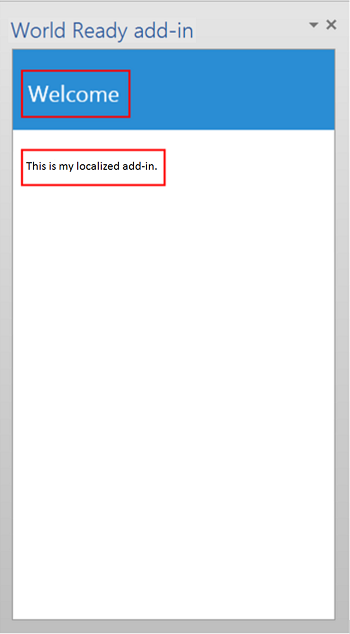

# <a name="localization-for-office-add-ins"></a><span data-ttu-id="8695b-103">Локализация надстроек для Office</span><span class="sxs-lookup"><span data-stu-id="8695b-103">Localization for Office Add-ins</span></span>

<span data-ttu-id="8695b-104">Вы можете реализовать любую схему локализации, которая подходит вашему Надстройка Office.</span><span class="sxs-lookup"><span data-stu-id="8695b-104">You can implement any localization scheme that's appropriate for your Office Add-in.</span></span> <span data-ttu-id="8695b-105">API JavaScript и схема манифеста платформы Надстройки Office предоставляют несколько вариантов.</span><span class="sxs-lookup"><span data-stu-id="8695b-105">The JavaScript API and manifest schema of the Office Add-ins platform provide some choices.</span></span> <span data-ttu-id="8695b-106">Вы можете использовать API JavaScript для Office для определения языкового стандарта и отображаемых строк на основе языкового стандарта ведущего приложения, а также для интерпретации или отображения данных на основе языкового стандарта данных.</span><span class="sxs-lookup"><span data-stu-id="8695b-106">You can use the Office JavaScript API to determine a locale and display strings based on the locale of the host application, or to interpret or display data based on the locale of the data.</span></span> <span data-ttu-id="8695b-107">Вы можете использовать манифест, чтобы указать расположение файла надстройки и описательной информации, зависящих от языковых параметров.</span><span class="sxs-lookup"><span data-stu-id="8695b-107">You can use the manifest to specify locale-specific add-in file location and descriptive information.</span></span> <span data-ttu-id="8695b-108">Либо можно использовать сценарий Microsoft Ajax для поддержки глобализации и локализации.</span><span class="sxs-lookup"><span data-stu-id="8695b-108">Alternatively, you can use Microsoft Ajax script to support globalization and localization.</span></span>

## <a name="use-the-javascript-api-to-determine-locale-specific-strings"></a><span data-ttu-id="8695b-109">Определение параметров, зависящих от языка, с помощью API JavaScript</span><span class="sxs-lookup"><span data-stu-id="8695b-109">Use the JavaScript API to determine locale-specific strings</span></span>

<span data-ttu-id="8695b-110">API JavaScript для Office предоставляет два свойства, которые поддерживают отображение и интерпретацию значений, соответствующих языку и региональным параметрам ведущего приложения и данных:</span><span class="sxs-lookup"><span data-stu-id="8695b-110">The Office JavaScript API provides two properties that support displaying or interpreting values consistent with the locale of the host application and data:</span></span>

- <span data-ttu-id="8695b-111">[Context.displayLanguage][displayLanguage] задает языковой стандарт (или язык) пользовательского интерфейса ведущего приложения.</span><span class="sxs-lookup"><span data-stu-id="8695b-111">[Context.displayLanguage][displayLanguage] specifies the locale (or language) of the user interface of the host application.</span></span> <span data-ttu-id="8695b-112">В примере ниже показано, как проверить, какой языковый стандарт используется (en-US или fr-Fr), и отобразить приветствие на языке ведущего приложения.</span><span class="sxs-lookup"><span data-stu-id="8695b-112">The following example verifies if the host application uses the en-US or fr-FR locale, and displays a locale-specific greeting.</span></span>

    ```js
    function sayHelloWithDisplayLanguage() {
        var myLanguage = Office.context.displayLanguage;
        switch (myLanguage) {
            case 'en-US':
                write('Hello!');
                break;
            case 'fr-FR':
                write('Bonjour!');
                break;
        }
    }

    // Function that writes to a div with id='message' on the page.
    function write(message) {
        document.getElementById('message').innerText += message;
    }
    ```

- <span data-ttu-id="8695b-p103">[Context.contentLanguage][contentLanguage] задает языковой стандарт данных. Вы можете не проверять свойство [displayLanguage], а назначить свойству [contentLanguage] значение `myLanguage` и воспользоваться тем же кодом для отображения приветствия на языке данных:</span><span class="sxs-lookup"><span data-stu-id="8695b-p103">[Context.contentLanguage][contentLanguage] specifies the locale (or language) of the data. Extending the last code sample, instead of checking the [displayLanguage] property, assign `myLanguage` the value of the [contentLanguage] property, and use the rest of the same code to display a greeting based on the locale of the data:</span></span>

    ```js
    var myLanguage = Office.context.contentLanguage;
    ```

## <a name="control-localization-from-the-manifest"></a><span data-ttu-id="8695b-115">Управление локализацией через манифест</span><span class="sxs-lookup"><span data-stu-id="8695b-115">Control localization from the manifest</span></span>


<span data-ttu-id="8695b-p104">Каждая надстройка Office задает в своем манифесте элемент [DefaultLocale] и языковой стандарт. По умолчанию платформа "Надстройка Office" и ведущие приложения Office применяют значения элементов [Description], [DisplayName], [IconUrl], [HighResolutionIconUrl] и [SourceLocation] ко всем языковым стандартам. Чтобы изменить значения для определенных языковых стандартов, укажите для любого из этих пяти элементов дочерний элемент [Override]. Значение элемента [DefaultLocale] и атрибута `Locale` элемента [Override] указывается в соответствии со спецификацией [RFC 3066], "Теги для идентификации языков". В таблице 1 описана поддержка локализации для этих элементов.</span><span class="sxs-lookup"><span data-stu-id="8695b-p104">Every Office Add-in specifies a [DefaultLocale] element and a locale in its manifest. By default, the Office Add-in platform and Office host applications apply the values of the [Description], [DisplayName], [IconUrl], [HighResolutionIconUrl], and [SourceLocation] elements to all locales. You can optionally support specific values for specific locales, by specifying an [Override] child element for each additional locale, for any of these five elements. The value for the [DefaultLocale] element and for the `Locale` attribute of the [Override] element is specified according to [RFC 3066], "Tags for the Identification of Languages." Table 1 describes the localizing support for these elements.</span></span>

<span data-ttu-id="8695b-121">*Таблица 1. Поддержка локализации*</span><span class="sxs-lookup"><span data-stu-id="8695b-121">*Table 1. Localization support*</span></span>


|<span data-ttu-id="8695b-122">**Элемент**</span><span class="sxs-lookup"><span data-stu-id="8695b-122">**Element**</span></span>|<span data-ttu-id="8695b-123">**Поддержка локализации**</span><span class="sxs-lookup"><span data-stu-id="8695b-123">**Localization support**</span></span>|
|:-----|:-----|
|<span data-ttu-id="8695b-124">[Описание]</span><span class="sxs-lookup"><span data-stu-id="8695b-124">[Description]</span></span>   |<span data-ttu-id="8695b-125">Для каждого заданного языкового стандарта пользователи могут видеть локализованное описание надстройки в AppSource (или частном каталоге).</span><span class="sxs-lookup"><span data-stu-id="8695b-125">Users in each locale you specify can see a localized description for the add-in in AppSource (or private catalog).</span></span><br/><span data-ttu-id="8695b-126">В случае надстроек Outlook пользователи смогут увидеть описание в Центре администрирования Exchange после установки.</span><span class="sxs-lookup"><span data-stu-id="8695b-126">For Outlook add-ins, users can see the description in the Exchange Admin Center (EAC) after installation.</span></span>|
|<span data-ttu-id="8695b-127">[DisplayName]</span><span class="sxs-lookup"><span data-stu-id="8695b-127">[DisplayName]</span></span>   |<span data-ttu-id="8695b-128">Для каждого заданного языкового стандарта пользователи могут видеть локализованное описание надстройки в AppSource (или частном каталоге).</span><span class="sxs-lookup"><span data-stu-id="8695b-128">Users in each locale you specify can see a localized description for the add-in in AppSource (or private catalog).</span></span><br/><span data-ttu-id="8695b-129">В случае надстроек Outlook пользователи смогут увидеть отображаемое имя в качестве метки для кнопки надстройки Outlook и в Центре администрирования Exchange после установки.</span><span class="sxs-lookup"><span data-stu-id="8695b-129">For Outlook add-ins, users can see the display name as a label for the Outlook add-in button and in the EAC after installation.</span></span><br/><span data-ttu-id="8695b-130">В случае контентных надстроек и надстроек области задач пользователи могут видеть отображаемое имя на ленте после установки надстройки.</span><span class="sxs-lookup"><span data-stu-id="8695b-130">For content and task pane add-ins, users can see the display name in the ribbon after installing the add-in.</span></span>|
|<span data-ttu-id="8695b-131">[IconUrl]</span><span class="sxs-lookup"><span data-stu-id="8695b-131">[IconUrl]</span></span>        |<span data-ttu-id="8695b-p105">Изображение значка является необязательным. Можно использовать ту же методику переопределений, чтобы задать определенное изображение для определенной культуры. Если вы используете значок и локализуете его, пользователи с заданными языковыми параметрами могут видеть локализованный значок надстройки.</span><span class="sxs-lookup"><span data-stu-id="8695b-p105">The icon image is optional. You can use the same override technique to specify a certain image for a specific culture. If you use and localize an icon, users in each locale you specify can see a localized icon image for the add-in.</span></span><br/><span data-ttu-id="8695b-135">В случае надстроек Outlook пользователи могут видеть значок в Центре администрирования Exchange после установки надстройки.</span><span class="sxs-lookup"><span data-stu-id="8695b-135">For Outlook add-ins, users can see the icon in the EAC after installing the add-in.</span></span><br/><span data-ttu-id="8695b-136">В случае контентных надстроек и надстроек области задач пользователи могут видеть значок на ленте после установки надстройки.</span><span class="sxs-lookup"><span data-stu-id="8695b-136">For content and task pane add-ins, users can see the icon in the ribbon after installing the add-in.</span></span>|
|<span data-ttu-id="8695b-137">[HighResolutionIconUrl] **Важно!** Этот элемент доступен только для надстроек, использующих схему манифеста версии 1.1.</span><span class="sxs-lookup"><span data-stu-id="8695b-137">[HighResolutionIconUrl] **Important:** This element is available only when using add-in manifest version 1.1.</span></span>|<span data-ttu-id="8695b-p106">Изображение значка с высоким разрешением не является обязательным, но если оно указано, то должно находиться после элемента [IconUrl]. Если указан параметр [HighResolutionIconUrl] и надстройка установлена на устройстве, поддерживающем высокое разрешение, то вместо значения [IconUrl] используется значение [HighResolutionIconUrl].</span><span class="sxs-lookup"><span data-stu-id="8695b-p106">The high resolution icon image is optional but if it is specified, it must occur after the  [IconUrl] element. When [HighResolutionIconUrl] is specified, and the add-in is installed on a device that supports high dpi resolution, the [HighResolutionIconUrl] value is used instead of the value for [IconUrl].</span></span><br/><span data-ttu-id="8695b-p107">Можно использовать ту же методику переопределений, чтобы задать определенное изображение для определенной культуры. Если вы используете значок и локализуете его, пользователи с заданными языковыми параметрами могут видеть локализованный значок надстройки.</span><span class="sxs-lookup"><span data-stu-id="8695b-p107">You can use the same override technique to specify a certain image for a specific culture. If you use and localize an icon, users in each locale you specify can see a localized icon image for the add-in.</span></span><br/><span data-ttu-id="8695b-142">В случае надстроек Outlook пользователи могут видеть значок в Центре администрирования Exchange после установки надстройки.</span><span class="sxs-lookup"><span data-stu-id="8695b-142">For Outlook add-ins, users can see the icon in the EAC after installing the add-in.</span></span><br/><span data-ttu-id="8695b-143">После установки надстроек области задач и контентных надстроек пользователи видят значок на ленте.</span><span class="sxs-lookup"><span data-stu-id="8695b-143">For content and task pane add-ins, users can see the icon in the ribbon after installing the add-in.</span></span>|
|<span data-ttu-id="8695b-144">[Resources] **Важно!** Этот элемент доступен только для надстроек, в которых используется схема манифеста версии 1.1.</span><span class="sxs-lookup"><span data-stu-id="8695b-144">[Resources] **Important:** This element is available only when using add-in manifest version 1.1.</span></span>   |<span data-ttu-id="8695b-145">Для пользователей в каждой указываемой вами локали отображаются ресурсы строк и значков, которые вы специально создаете для надстройки в этой локали.</span><span class="sxs-lookup"><span data-stu-id="8695b-145">Users in each locale you specify can see string and icon resources that you specifically create for the add-in for that locale.</span></span> |
|<span data-ttu-id="8695b-146">[SourceLocation]</span><span class="sxs-lookup"><span data-stu-id="8695b-146">[SourceLocation]</span></span>   |<span data-ttu-id="8695b-147">Пользователи каждого языкового стандарта видят веб-страницу, специально разработанную для использования надстройки с этим стандартом.</span><span class="sxs-lookup"><span data-stu-id="8695b-147">Users in each locale you specify can see a webpage that you specifically design for the add-in for that locale.</span></span> |


> [!NOTE]
> <span data-ttu-id="8695b-148">Локализовать описание и отображаемое имя можно только для языковых стандартов, которые поддерживаются в Office.</span><span class="sxs-lookup"><span data-stu-id="8695b-148">You can localize the description and display name for only the locales that Office supports.</span></span> <span data-ttu-id="8695b-149">Список языков и языковых стандартов для текущего выпуска Office см. в статье [Идентификаторы языков и значения OptionState Id в Office 2013](/previous-versions/office/office-2013-resource-kit/cc179219(v=office.15)).</span><span class="sxs-lookup"><span data-stu-id="8695b-149">See [Language identifiers and OptionState Id values in Office 2013](/previous-versions/office/office-2013-resource-kit/cc179219(v=office.15)) for a list of languages and locales for the current release of Office.</span></span>


### <a name="examples"></a><span data-ttu-id="8695b-150">Примеры</span><span class="sxs-lookup"><span data-stu-id="8695b-150">Examples</span></span>

<span data-ttu-id="8695b-p109">Например, надстройка Office может задать для параметра [DefaultLocale] значения `en-us`. Для элемента [DisplayName] надстройка может задать дочерний элемент [Override], соответствующий языковому стандарту `fr-fr`, как показано ниже.</span><span class="sxs-lookup"><span data-stu-id="8695b-p109">For example, an Office Add-in can specify the [DefaultLocale] as `en-us`. For the [DisplayName] element, the add-in can specify an [Override] child element for the locale `fr-fr`, as shown below.</span></span>


```xml
<DefaultLocale>en-us</DefaultLocale>
...
<DisplayName DefaultValue="Video player">
    <Override Locale="fr-fr" Value="Lecteur vidéo" />
</DisplayName>
```

> [!NOTE]
> <span data-ttu-id="8695b-153">Если вам необходимо локализовать несколько областей в семействе языков, например `de-de` и `de-at`, рекомендуется разделить элементы `Override` для каждой области.</span><span class="sxs-lookup"><span data-stu-id="8695b-153">If you need to localize for more than one area within a language family, such as `de-de` and `de-at`, we recommend that you use separate `Override` elements for each area.</span></span> <span data-ttu-id="8695b-154">Использование только названия языка, в этом случае `de`, не поддерживается ни для одного сочетания ведущих приложений Office и платформ.</span><span class="sxs-lookup"><span data-stu-id="8695b-154">Using just the language name alone, in this case, `de`, is not supported across all combinations of Office host applications and platforms.</span></span>

<span data-ttu-id="8695b-p111">Это значит, что по умолчанию надстройка использует языковой стандарт `en-us`. Пользователи видят отображаемое имя Video player (видеопроигрыватель) на английском языке для всех языковых стандартов за исключением случаев, когда на клиентском компьютере используется языковой стандарт `fr-fr`. В этом случае пользователи увидят отображаемое имя Lecteur video на французском языке.</span><span class="sxs-lookup"><span data-stu-id="8695b-p111">This means that the add-in assumes the  `en-us` locale by default. Users see the English display name of "Video player" for all locales unless the client computer's locale is `fr-fr`, in which case users would see the French display name "Lecteur vidéo".</span></span>

> [!NOTE]
> <span data-ttu-id="8695b-157">Вы можете указать только одно переопределение на язык, в том числе для языкового стандарта по умолчанию.</span><span class="sxs-lookup"><span data-stu-id="8695b-157">You may only specify a single override per language, including for the default locale.</span></span> <span data-ttu-id="8695b-158">Например, если по умолчанию используется языковой стандарт `en-us`, невозможно также указать переопределение для `en-us`.</span><span class="sxs-lookup"><span data-stu-id="8695b-158">For example, if your default locale is `en-us` you cannot not specify an  override for `en-us` as well.</span></span> 

<span data-ttu-id="8695b-p113">В приведенном ниже примере применяется переопределение языкового стандарта для элемента [Description]. Сначала он задает языковой стандарт по умолчанию `en-us` и описание на английском языке, а затем указывает оператор [Override] с описанием на французском языке для языкового стандарта `fr-fr`:</span><span class="sxs-lookup"><span data-stu-id="8695b-p113">The following example applies a locale override for the [Description] element. It first specifies a default locale of `en-us` and an English description, and then specifies an [Override] statement with a French description for the `fr-fr` locale:</span></span>

```xml
<DefaultLocale>en-us</DefaultLocale>
...
<Description DefaultValue=
   "Watch YouTube videos referenced in the emails you receive
   without leaving your email client.">
   <Override Locale="fr-fr" Value=
   "Visualisez les vidéos YouTube référencées dans vos courriers 
   électronique directement depuis Outlook."/>
</Description>
```

<span data-ttu-id="8695b-p114">Это значит, что надстройка предполагает языковой стандарт `en-us` по умолчанию. Пользователи увидят описание на английском языке в атрибуте `DefaultValue` для всех языковых стандартов, если на клиентском компьютере не выбран языковой стандарт `fr-fr`. В этом случае они увидят описание на французском языке.</span><span class="sxs-lookup"><span data-stu-id="8695b-p114">This means that the add-in assumes the `en-us` locale by default. Users would see the English description in the `DefaultValue` attribute for all locales unless the client computer's locale is `fr-fr`, in which case they would see the French description.</span></span>

<span data-ttu-id="8695b-p115">В следующем примере надстройка задает отдельное приложение, которое больше подходит для языкового стандарта и региональных параметров `fr-fr`. Пользователи видят изображение DefaultLogo.png по умолчанию, кроме тех случаев, когда на клиентском компьютере используется языковой стандарт `fr-fr`. В этом случае пользователи видят изображение FrenchLogo.png.</span><span class="sxs-lookup"><span data-stu-id="8695b-p115">In the following example, the add-in specifies a separate image that's more appropriate for the `fr-fr` locale and culture. Users see the image DefaultLogo.png by default, except when the locale of the client computer is `fr-fr`. In this case, users would see the image FrenchLogo.png.</span></span> 


```xml
<!-- Replace "domain" with a real web server name and path. -->
<IconUrl DefaultValue="https://<domain>/DefaultLogo.png"/>
<Override Locale="fr-fr" Value="https://<domain>/FrenchLogo.png"/>
```

<span data-ttu-id="8695b-p116">В примере ниже показано, как локализовать ресурс в разделе `Resources`. Здесь применяется переопределение локали для изображения, и используется изображение, более подходящее для языка и региональных параметров `ja-jp`.</span><span class="sxs-lookup"><span data-stu-id="8695b-p116">The following example shows how to localize a resource in the `Resources` section. It applies a locale override for an image that is more appropriate for the `ja-jp` culture.</span></span>

```xml
<Resources>
      <bt:Images>
        <bt:Image id="icon1_16x16" DefaultValue="https://www.contoso.com/icon_default.png">
          <bt:Override Locale="ja-jp" Value="https://www.contoso.com/ja-jp16-icon_default.png" />
        </bt:Image>
 ...
```


<span data-ttu-id="8695b-p117">В случае элемента [SourceLocation] поддержка дополнительных языковых стандартов означает предоставление отдельного исходного HTML-файла для каждого из указанных языковых стандартов. Пользователи с заданными языковыми стандартами увидят настраиваемые для них веб-страницы.</span><span class="sxs-lookup"><span data-stu-id="8695b-p117">For the [SourceLocation] element, supporting additional locales means providing a separate source HTML file for each of the specified locales. Users in each locale you specify can see a customized webpage that you design for that them.</span></span>

<span data-ttu-id="8695b-p118">В случае надстроек Outlook элемент [SourceLocation] также сопоставляется с форм-фактором. Это позволяет предоставлять отдельный локализованный исходный HTML-файл для каждого соответствующего форм-фактора. Вы можете задать один или несколько дочерних элементов [Override] в каждом применимом элементе параметров ([DesktopSettings], [TabletSettings] или [PhoneSettings]). В приведенном ниже примере показаны элементы параметров для форм-факторов настольного компьютера, планшета и смартфона, каждому из которых соответствует один HTML-файл для языкового стандарта по умолчанию и другой файл для французского языкового стандарта.</span><span class="sxs-lookup"><span data-stu-id="8695b-p118">For Outlook add-ins, the [SourceLocation] element also aligns to the form factor. This allows you to provide a separate, localized source HTML file for each corresponding form factor. You can specify one or more [Override] child elements in each applicable settings element ([DesktopSettings], [TabletSettings], or [PhoneSettings]). The following example shows settings elements for the desktop, tablet, and smartphone form factors, each with one HTML file for the default locale and another for the French locale.</span></span>


```xml
<DesktopSettings>
   <SourceLocation DefaultValue="https://contoso.com/Desktop.html">
      <Override Locale="fr-fr" Value="https://contoso.com/fr/Desktop.html" />
   </SourceLocation>
   <RequestedHeight>250</RequestedHeight>
</DesktopSettings>
<TabletSettings>
   <SourceLocation DefaultValue="https://contoso.com/Tablet.html">
      <Override Locale="fr-fr" Value="https://contoso.com/fr/Tablet.html" />
   </SourceLocation>
   <RequestedHeight>200</RequestedHeight>
</TabletSettings>
<PhoneSettings>
   <SourceLocation DefaultValue="https://contoso.com/Mobile.html">
      <Override Locale="fr-fr" Value="https://contoso.com/fr/Mobile.html" />
   </SourceLocation>
</PhoneSettings>
```

## <a name="match-datetime-format-with-client-locale"></a><span data-ttu-id="8695b-174">Приведение формата даты и времени в соответствие языковому стандарту клиента</span><span class="sxs-lookup"><span data-stu-id="8695b-174">Match date/time format with client locale</span></span>

<span data-ttu-id="8695b-p119">Получить языковой стандарт интерфейса ведущего приложения можно с помощью свойства [displayLanguage]. Затем можно отобразить значения даты и времени в формате, соответствующем текущему языковому стандарту ведущего приложения. Для этого можно подготовить файл ресурсов и указать в нем формат даты и времени для каждого языкового стандарта, который поддерживает надстройка Office. После этого надстройка сможет сопоставлять соответствующий формат даты и времени с языковым стандартом, полученным из свойства [displayLanguage], во время выполнения.</span><span class="sxs-lookup"><span data-stu-id="8695b-p119">You can get the locale of the user interface of the hosting application by using the [displayLanguage] property. You can then display date and time values in a format consistent with the current locale of the host application. One way to do that is to prepare a resource file that specifies the date/time display format to use for each locale that your Office Add-in supports. At run time, your add-in can use the resource file and match the appropriate date/time format with the locale obtained from the [displayLanguage] property.</span></span>

<span data-ttu-id="8695b-p120">Получить языковой стандарт данных ведущего приложения можно с помощью свойства [contentLanguage]. На основе этого значения можно должным образом толковать или отображать строки даты и времени. Например, в языковом стандарте `jp-JP` дата и время представляются в формате `yyyy/MM/dd`, а в языковом стандарте `fr-FR` — в формате `dd/MM/yyyy`.</span><span class="sxs-lookup"><span data-stu-id="8695b-p120">You can get the locale of the data of the hosting application by using the [contentLanguage] property. Based on this value, you can then appropriately interpret or display date/time strings. For example, the `jp-JP` locale expresses data/time values as `yyyy/MM/dd`, and the `fr-FR` locale, `dd/MM/yyyy`.</span></span>


## <a name="use-ajax-for-globalization-and-localization"></a><span data-ttu-id="8695b-182">Использование Ajax для глобализации и локализации</span><span class="sxs-lookup"><span data-stu-id="8695b-182">Use Ajax for globalization and localization</span></span>


<span data-ttu-id="8695b-183">Если для создания Надстройки Office вы используете Visual Studio, платформа .NET Framework и Ajax предоставляют способы глобализации и локализации файлов клиентских скриптов.</span><span class="sxs-lookup"><span data-stu-id="8695b-183">If you use Visual Studio to create Office Add-ins, the .NET Framework and Ajax provide ways to globalize and localize client script files.</span></span>

<span data-ttu-id="8695b-p121">Можно глобализировать и использовать расширения типов JavaScript [Date](https://msdn.microsoft.com/library/caf98d32-2de2-4704-8198-692350343681.aspx) и [Number](https://msdn.microsoft.com/library/c216d3a1-12ae-47d1-bca1-c3666d04572f.aspx) и объект JavaScript [Date](https://developer.mozilla.org/docs/Web/JavaScript/Reference/Global_Objects/Date) в коде JavaScript для Надстройка Office, чтобы отображать значения в зависимости от языковых параметров, заданных в текущем браузере. Дополнительные сведения см. в статье [Walkthrough: Globalizing a Date by Using Client Script](https://msdn.microsoft.com/library/69b34e6d-d590-4d03-a763-b7ae54b47d74.aspx).</span><span class="sxs-lookup"><span data-stu-id="8695b-p121">You can globalize and use the [Date](https://msdn.microsoft.com/library/caf98d32-2de2-4704-8198-692350343681.aspx) and [Number](https://msdn.microsoft.com/library/c216d3a1-12ae-47d1-bca1-c3666d04572f.aspx) JavaScript type extensions and the JavaScript [Date](https://developer.mozilla.org/docs/Web/JavaScript/Reference/Global_Objects/Date) object in the JavaScript code for an Office Add-in to display values based on the locale settings on the current browser. For more information, see [Walkthrough: Globalizing a Date by Using Client Script](https://msdn.microsoft.com/library/69b34e6d-d590-4d03-a763-b7ae54b47d74.aspx).</span></span>

<span data-ttu-id="8695b-p122">Можно включить локализованные строки ресурсов напрямую в отдельные файлы JavaScript, чтобы предоставить клиентские файлы скриптов для разных языковых параметров, задаваемых в браузере или предоставляемых пользователем. Создайте отдельный файл скрипта для каждого поддерживаемого языкового параметра. В каждый файл скрипта включите объект в формате JSON, содержащий строки ресурсов для соответствующего языкового параметра. Локализованные значения применяются во время выполнения скрипта в браузере.</span><span class="sxs-lookup"><span data-stu-id="8695b-p122">You can include localized resource strings directly in standalone JavaScript files to provide client script files for different locales, which are set on the browser or provided by the user. Create a separate script file for each supported locale. In each script file, include an object in JSON format that contains the resource strings for that locale. The localized values are applied when the script runs in the browser.</span></span>


## <a name="example-build-a-localized-office-add-in"></a><span data-ttu-id="8695b-190">Пример. Создание локализованной надстройки Office</span><span class="sxs-lookup"><span data-stu-id="8695b-190">Example: Build a localized Office Add-in</span></span>

<span data-ttu-id="8695b-191">В этом разделе представлены примеры того, как локализовать описание, отображаемое имя и пользовательский интерфейс Надстройка Office.</span><span class="sxs-lookup"><span data-stu-id="8695b-191">This section provides examples that show you how to localize an Office Add-in description, display name, and UI.</span></span> 

> [!NOTE]
> <span data-ttu-id="8695b-192">Чтобы скачать Visual Studio 2019, посетите [страницу Visual Studio IDE](https://visualstudio.microsoft.com/vs/).</span><span class="sxs-lookup"><span data-stu-id="8695b-192">To download Visual Studio 2019, see the [Visual Studio IDE page](https://visualstudio.microsoft.com/vs/).</span></span> <span data-ttu-id="8695b-193">Во время установки потребуется выбрать рабочую нагрузку разработки для Office и SharePoint.</span><span class="sxs-lookup"><span data-stu-id="8695b-193">During installation you'll need to select the Office/SharePoint development workload.</span></span>

### <a name="configure-office-to-use-additional-languages-for-display-or-editing"></a><span data-ttu-id="8695b-194">Настройка Office на использование дополнительных языков для отображения или редактирования</span><span class="sxs-lookup"><span data-stu-id="8695b-194">Configure Office to use additional languages for display or editing</span></span>

<span data-ttu-id="8695b-195">Чтобы запустить приведенный пример кода, Настройте Office на вашем компьютере для использования дополнительных языков, чтобы можно было протестировать надстройку, переключив язык, используемый для отображения в меню и командах, для редактирования и проверки правописания.</span><span class="sxs-lookup"><span data-stu-id="8695b-195">To run the sample code provided, configure Office on your computer to use additional languages so that you can test your add-in by switching the language used for display in menus and commands, for editing and proofing, or both.</span></span>

<span data-ttu-id="8695b-196">Для установки дополнительного языка можно использовать языковой пакет Office.</span><span class="sxs-lookup"><span data-stu-id="8695b-196">You can use an Office Language pack to install an additional language.</span></span> <span data-ttu-id="8695b-197">Дополнительные сведения о языковых пакетах и способах их получения см. на странице [дополнительных языковых пакетов для Office](https://office.microsoft.com/language-packs/).</span><span class="sxs-lookup"><span data-stu-id="8695b-197">For more information about Language Packs and where to get them, see [Language Accessory Pack for Office](https://office.microsoft.com/language-packs/).</span></span>

<span data-ttu-id="8695b-198">После установки языкового пакета вы можете настроить Office на использование установленного языка для пользовательского интерфейса и/или для редактирования содержимого документов.</span><span class="sxs-lookup"><span data-stu-id="8695b-198">After you install the Language Accessory Pack, you can configure Office to use the installed language for display in the UI, for editing document content, or both.</span></span> <span data-ttu-id="8695b-199">В примере в этой статье используется установка Office, в которой применяется испанский языковой пакет.</span><span class="sxs-lookup"><span data-stu-id="8695b-199">The example in this article uses an installation of Office that has the Spanish Language Pack applied.</span></span>

### <a name="create-an-office-add-in-project"></a><span data-ttu-id="8695b-200">Создание проекта надстройки Office</span><span class="sxs-lookup"><span data-stu-id="8695b-200">Create an Office Add-in project</span></span>

<span data-ttu-id="8695b-201">Вам потребуется создать проект надстройки Office для Visual Studio 2019.</span><span class="sxs-lookup"><span data-stu-id="8695b-201">You'll need to create a Visual Studio 2019 Office Add-in project.</span></span>

> [!NOTE]
> <span data-ttu-id="8695b-202">Если вы не установили Visual Studio 2019, посетите [страницу IDE Visual Studio](https://visualstudio.microsoft.com/vs/) , чтобы получить инструкции по загрузке.</span><span class="sxs-lookup"><span data-stu-id="8695b-202">If you haven't installed Visual Studio 2019, see the [Visual Studio IDE page](https://visualstudio.microsoft.com/vs/) for download instructions.</span></span> <span data-ttu-id="8695b-203">Во время установки потребуется выбрать рабочую нагрузку разработки Office и SharePoint.</span><span class="sxs-lookup"><span data-stu-id="8695b-203">During installation you'll need to select the Office/SharePoint development workload.</span></span> <span data-ttu-id="8695b-204">Если вы уже установили Visual Studio 2019, [Используйте установщик Visual Studio](/visualstudio/install/modify-visual-studio/) , чтобы убедиться в том, что Рабочая нагрузка разработки Office и SharePoint установлена.</span><span class="sxs-lookup"><span data-stu-id="8695b-204">If you have previously installed Visual Studio 2019, [use the Visual Studio Installer](/visualstudio/install/modify-visual-studio/) to ensure that the Office/SharePoint development workload is installed.</span></span>

1. <span data-ttu-id="8695b-205">Выберите **Создание нового проекта**.</span><span class="sxs-lookup"><span data-stu-id="8695b-205">Choose **Create a new project**.</span></span>

2. <span data-ttu-id="8695b-206">Используя поле поиска, введите **надстройка**.</span><span class="sxs-lookup"><span data-stu-id="8695b-206">Using the search box, enter **add-in**.</span></span> <span data-ttu-id="8695b-207">Выберите вариант **Веб-надстройка Word** и нажмите кнопку **Далее**.</span><span class="sxs-lookup"><span data-stu-id="8695b-207">Choose **Word Web Add-in**, then select **Next**.</span></span>

3. <span data-ttu-id="8695b-208">Назовите проект **WorldReadyAddIn** и нажмите кнопку **создать**.</span><span class="sxs-lookup"><span data-stu-id="8695b-208">Name your project **WorldReadyAddIn** and select **Create**.</span></span>

4. <span data-ttu-id="8695b-209">Visual Studio создаст решение, и в **обозревателе решений** появятся два соответствующих проекта.</span><span class="sxs-lookup"><span data-stu-id="8695b-209">Visual Studio creates a solution and its two projects appear in **Solution Explorer**.</span></span> <span data-ttu-id="8695b-210">В Visual Studio откроется файл **Home.html**.</span><span class="sxs-lookup"><span data-stu-id="8695b-210">The **Home.html** file opens in Visual Studio.</span></span>


### <a name="localize-the-text-used-in-your-add-in"></a><span data-ttu-id="8695b-211">Локализация текста, используемого в вашей надстройке</span><span class="sxs-lookup"><span data-stu-id="8695b-211">Localize the text used in your add-in</span></span>

<span data-ttu-id="8695b-212">Текст, который нужно локализовать на другом языке, отображается в двух областях:</span><span class="sxs-lookup"><span data-stu-id="8695b-212">The text that you want to localize for another language appears in two areas:</span></span>

-  <span data-ttu-id="8695b-p129">**Отображаемое имя и описание надстройки**. Они управляются записями в файле манифеста приложения.</span><span class="sxs-lookup"><span data-stu-id="8695b-p129">**Add-in display name and description**. This is controlled by entries in the add-in manifest file.</span></span>

-  <span data-ttu-id="8695b-215">**Пользовательский интерфейс надстройки**.</span><span class="sxs-lookup"><span data-stu-id="8695b-215">**Add-in UI**.</span></span> <span data-ttu-id="8695b-216">Вы можете локализовать строки, отображаемые в пользовательском интерфейсе надстройки, с помощью кода JavaScript, например используя отдельный файл ресурсов с локализованными строками.</span><span class="sxs-lookup"><span data-stu-id="8695b-216">You can localize the strings that appear in your add-in UI by using JavaScript code, for example, by using a separate resource file that contains the localized strings.</span></span>

<span data-ttu-id="8695b-217">Локализация отображаемого имени и описания надстройки:</span><span class="sxs-lookup"><span data-stu-id="8695b-217">To localize the add-in display name and description:</span></span>

1. <span data-ttu-id="8695b-218">В **обозревателе решений** разверните узлы **WorldReadyAddIn** и **WorldReadyAddInManifest**, а затем выберите **WorldReadyAddIn.xml**.</span><span class="sxs-lookup"><span data-stu-id="8695b-218">In **Solution Explorer**, expand **WorldReadyAddIn**, **WorldReadyAddInManifest**, and then choose **WorldReadyAddIn.xml**.</span></span>

2. <span data-ttu-id="8695b-219">В файле WorldReadyAddInManifest.xml замените элементы [DisplayName] и [Description] на приведенный ниже блок кода.</span><span class="sxs-lookup"><span data-stu-id="8695b-219">In WorldReadyAddInManifest.xml, replace the [DisplayName] and [Description] elements with the following block of code:</span></span>

    > [!NOTE]
    > <span data-ttu-id="8695b-220">Вы можете заменить локализованные строки на испанском языке, используемые в этом примере для элементов [DisplayName] и [Description], локализованными строками на любом другом языке.</span><span class="sxs-lookup"><span data-stu-id="8695b-220">You can replace the Spanish language localized strings used in this example for the [DisplayName] and [Description] elements with the localized strings for any other language.</span></span>

    ```xml
    <DisplayName DefaultValue="World Ready add-in">
      <Override Locale="es-es" Value="Aplicación de uso internacional"/>
    </DisplayName>
    <Description DefaultValue="An add-in for testing localization">
      <Override Locale="es-es" Value="Una aplicación para la prueba de la localización"/>
    </Description>
    ```

3. <span data-ttu-id="8695b-221">После изменения отображаемого языка для Office 2013, к примеру, с английского на испанский и последующего запуска надстройки отображаемое имя и описание надстройки локализуются.</span><span class="sxs-lookup"><span data-stu-id="8695b-221">When you change the display language for Office 2013 from English to Spanish, for example, and then run the add-in, the add-in display name and description are shown with localized text.</span></span>

<span data-ttu-id="8695b-222">Настройка пользовательского интерфейса надстройки:</span><span class="sxs-lookup"><span data-stu-id="8695b-222">To lay out the add-in UI:</span></span>

1. <span data-ttu-id="8695b-223">В **обозревателе решений** Visual Studio выберите элемент **Home.html**.</span><span class="sxs-lookup"><span data-stu-id="8695b-223">In Visual Studio, in **Solution Explorer**, choose **Home.html**.</span></span>

2. <span data-ttu-id="8695b-224">Замените содержимое элемента `<body>` в файле Home.html на приведенный ниже HTML-код и сохраните файл.</span><span class="sxs-lookup"><span data-stu-id="8695b-224">Replace the `<body>` element contents in Home.html with the following HTML, and save the file.</span></span>

    ```html
    <body>
        <!-- Page content -->
        <div id="content-header" class="ms-bgColor-themePrimary ms-font-xl">
            <div class="padding">
                <h1 id="greeting" class="ms-fontColor-white"></h1>
            </div>
        </div>
        <div id="content-main">
            <div class="padding">
                <div class="ms-font-m">
                    <p id="about"></p>
                </div>
            </div>
        </div>
    </body>
    ```

<span data-ttu-id="8695b-225">На приведенном ниже рисунке показаны элемент заголовка (h1) и элемент абзаца (p), в которых будет отображаться локализованный текст после завершения оставшихся действий и запуска надстройки.</span><span class="sxs-lookup"><span data-stu-id="8695b-225">The following figure shows the heading (h1) element and the paragraph (p) element that will display localized text when you complete the remaining steps and run the add-in.</span></span>

<span data-ttu-id="8695b-226">*Рис. 1. Пользовательский интерфейс надстройки*</span><span class="sxs-lookup"><span data-stu-id="8695b-226">*Figure 1. The add-in UI*</span></span>



### <a name="add-the-resource-file-that-contains-the-localized-strings"></a><span data-ttu-id="8695b-228">Добавление файла ресурсов с локализованными строками</span><span class="sxs-lookup"><span data-stu-id="8695b-228">Add the resource file that contains the localized strings</span></span>

<span data-ttu-id="8695b-229">Файл ресурсов JavaScript содержит строки, используемые для пользовательского интерфейса надстройки.</span><span class="sxs-lookup"><span data-stu-id="8695b-229">The JavaScript resource file contains the strings used for the add-in UI.</span></span> <span data-ttu-id="8695b-230">HTML-код для пользовательского интерфейса примера надстройки содержит элемент `<h1>`, отображающий приветствие, и элемент `<p>`, который знакомит пользователя с надстройкой.</span><span class="sxs-lookup"><span data-stu-id="8695b-230">The HTML for the sample add-in UI contains an `<h1>` element that displays a greeting, and a `<p>` element that introduces the add-in to the user.</span></span> 

<span data-ttu-id="8695b-p132">Чтобы включить локализованные строки для заголовка и абзаца, нужно поместить строки в отдельный файл ресурса. Файл ресурса создает объект JavaScript, который содержит отдельный объект Нотация объектов JavaScript (JSON) для каждого набора локализованных строк. Файл ресурса также предоставляет метод для получения соответствующего объекта JSON для определенного региона.</span><span class="sxs-lookup"><span data-stu-id="8695b-p132">To enable localized strings for the heading and paragraph, you place the strings in a separate resource file. The resource file creates a JavaScript object that contains a separate JavaScript Object Notation (JSON) object for each set of localized strings. The resource file also provides a method for getting back the appropriate JSON object for a given locale.</span></span>

<span data-ttu-id="8695b-234">Добавление файла ресурсов в проект надстройки:</span><span class="sxs-lookup"><span data-stu-id="8695b-234">To add the resource file to the add-in project:</span></span>

1. <span data-ttu-id="8695b-235">В **обозревателе решений** Visual Studio, щелкните правой кнопкой мыши проект **WorldReadyAddInWeb** и выберите **Добавить** > **Создать элемент**.</span><span class="sxs-lookup"><span data-stu-id="8695b-235">In **Solution Explorer** in Visual Studio, right-click the **WorldReadyAddInWeb** project and choose **Add** > **New Item**.</span></span> 

2. <span data-ttu-id="8695b-236">В диалоговом окне **Добавление нового элемента** выберите параметр **файл JavaScript**.</span><span class="sxs-lookup"><span data-stu-id="8695b-236">In the **Add New Item** dialog box, choose **JavaScript File**.</span></span>

3. <span data-ttu-id="8695b-237">Введите **UIStrings.js** в качестве имени файла и нажмите кнопку **Добавить**.</span><span class="sxs-lookup"><span data-stu-id="8695b-237">Enter **UIStrings.js** as the file name and choose **Add**.</span></span>

4. <span data-ttu-id="8695b-238">Добавьте в файл UIStrings.js приведенный ниже код и сохраните файл.</span><span class="sxs-lookup"><span data-stu-id="8695b-238">Add the following code to the UIStrings.js file, and save the file.</span></span>

    ```js
    /* Store the locale-specific strings */

    var UIStrings = (function ()
    {
        "use strict";

        var UIStrings = {};

        // JSON object for English strings
        UIStrings.EN =
        {
            "Greeting": "Welcome",
            "Introduction": "This is my localized add-in."
        };

        // JSON object for Spanish strings
        UIStrings.ES =
        {
            "Greeting": "Bienvenido",
            "Introduction": "Esta es mi aplicación localizada."
        };

        UIStrings.getLocaleStrings = function (locale)
        {
            var text;

            // Get the resource strings that match the language.
            switch (locale)
            {
                case 'en-US':
                    text = UIStrings.EN;
                    break;
                case 'es-ES':
                    text = UIStrings.ES;
                    break;
                default:
                    text = UIStrings.EN;
                    break;
            }

            return text;
        };

        return UIStrings;
    })();
    ```

<span data-ttu-id="8695b-239">Файл ресурса UIStrings.js создает объект **UIStrings**, который содержит локализованные строки пользовательского интерфейса надстройки.</span><span class="sxs-lookup"><span data-stu-id="8695b-239">The UIStrings.js resource file creates an object, **UIStrings**, which contains the localized strings for your add-in UI.</span></span>

### <a name="localize-the-text-used-for-the-add-in-ui"></a><span data-ttu-id="8695b-240">Локализация текста, используемого для пользовательского интерфейса надстройки</span><span class="sxs-lookup"><span data-stu-id="8695b-240">Localize the text used for the add-in UI</span></span>

<span data-ttu-id="8695b-p133">Чтобы использовать в надстройке файл ресурсов, вам потребуется добавить для него тег сценария в файл Home.html. При загрузке файла Home.html выполняется файл UIStrings.js, и объект **UIStrings**, используемый для получения строк, становится доступен в коде. Добавьте приведенный ниже HTML-код в тег заголовка для файла Home.html, чтобы сделать объект **UIStrings** доступным в коде.</span><span class="sxs-lookup"><span data-stu-id="8695b-p133">To use the resource file in your add-in, you'll need to add a script tag for it on Home.html. When Home.html is loaded, UIStrings.js executes and the **UIStrings** object that you use to get the strings is available to your code. Add the following HTML in the head tag for Home.html to make **UIStrings** available to your code.</span></span>

```html
<!-- Resource file for localized strings:                                                          -->
<script src="../UIStrings.js" type="text/javascript"></script>
```

<span data-ttu-id="8695b-244">Теперь вы можете использовать объект **UIStrings**, чтобы задать строки для пользовательского интерфейса надстройки.</span><span class="sxs-lookup"><span data-stu-id="8695b-244">Now you can use the **UIStrings** object to set the strings for the UI of your add-in.</span></span>

<span data-ttu-id="8695b-p134">Если вы хотите изменить локализацию в зависимости от языка, используемого для меню и команд в ведущем приложении, используйте свойство **Office.context.displayLanguage**, чтобы получить языковой стандарт для этого языка. Например, если в ведущем приложении для отображения меню и команд используется испанский язык, свойство **Office.context.displayLanguage** возвращает код языка es-ES.</span><span class="sxs-lookup"><span data-stu-id="8695b-p134">If you want to change the localization for your add-in based on what language is used for display in menus and commands in the host application, you use the **Office.context.displayLanguage** property to get the locale for that language. For example, if the host application language uses Spanish for display in menus and commands, the **Office.context.displayLanguage** property will return the language code es-ES.</span></span>

<span data-ttu-id="8695b-247">Если вы хотите изменить локализацию для надстройки на основе языка, используемого для редактирования контента документа, используйте свойство **Office. Context. contentLanguage** , чтобы получить языковой стандарт.</span><span class="sxs-lookup"><span data-stu-id="8695b-247">If you want to change the localization for your add-in based on what language is being used for editing document content, you use the **Office.context.contentLanguage** property to get the locale for that language.</span></span> <span data-ttu-id="8695b-248">Например, если в ведущем приложении для редактирования содержимого документов используется испанский язык, свойство  **Office.context.contentLanguage** возвращает код языка es-ES.</span><span class="sxs-lookup"><span data-stu-id="8695b-248">For example, if the host application language uses Spanish for editing document content, the **Office.context.contentLanguage** property will return the language code es-ES.</span></span>

<span data-ttu-id="8695b-249">Узнав, какой язык использует ведущее приложение, вы можете использовать объект **UIStrings**, чтобы получить набор локализованных строк на языке ведущего приложения.</span><span class="sxs-lookup"><span data-stu-id="8695b-249">After you know the language the host application is using, you can use **UIStrings** to get the set of localized strings that matches the host application language.</span></span>

<span data-ttu-id="8695b-p136">Замените код в файле Home.js на следующий код. Этот код показывает, как вы можете изменить строки, используемые в элементах пользовательского интерфейса из файла Home.html, в зависимости от языка отображаемых элементов или языка редактирования в ведущем приложении.</span><span class="sxs-lookup"><span data-stu-id="8695b-p136">Replace the code in the Home.js file with the following code. The code shows how you can change the strings used in the UI elements on Home.html based on either the display language of the host application or the editing language of the host application.</span></span>

> [!NOTE]
> <span data-ttu-id="8695b-252">Чтобы переключаться между локализацией надстройки, основанной на языке редактирования, удалите символы комментария из строки кода `var myLanguage = Office.context.contentLanguage;` и заключите в знаки комментария строку кода `var myLanguage = Office.context.displayLanguage;`.</span><span class="sxs-lookup"><span data-stu-id="8695b-252">To switch between changing the localization of the add-in based on the language used for editing, uncomment the line of code  `var myLanguage = Office.context.contentLanguage;` and comment out the line of code `var myLanguage = Office.context.displayLanguage;`</span></span>

```js
/// <reference path="../App.js" />
/// <reference path="../UIStrings.js" />


(function () {
    "use strict";

    // The initialize function must be run each time a new page is loaded.
    Office.initialize = function (reason)
    {

        $(document).ready(function () {
            // Get the language setting for editing document content.
            // To test this, uncomment the following line and then comment out the
            // line that uses Office.context.displayLanguage.
            // var myLanguage = Office.context.contentLanguage;

            // Get the language setting for UI display in the host application.
            var myLanguage = Office.context.displayLanguage;
            var UIText;

            // Get the resource strings that match the language.
            // Use the UIStrings object from the UIStrings.js file
            // to get the JSON object with the correct localized strings.
            UIText = UIStrings.getLocaleStrings(myLanguage);

            // Set localized text for UI elements.
            $("#greeting").text(UIText.Greeting);
            $("#about").text(UIText.Introduction);
        });
    };
})();
```

### <a name="test-your-localized-add-in"></a><span data-ttu-id="8695b-253">Тестирование локализованной надстройки</span><span class="sxs-lookup"><span data-stu-id="8695b-253">Test your localized add-in</span></span>

<span data-ttu-id="8695b-254">Чтобы тестировать локализованную надстройку, измените язык, используемый для отображения или редактирования в ведущем приложении, а затем запустите надстройку.</span><span class="sxs-lookup"><span data-stu-id="8695b-254">To test your localized add-in, change the language used for display or editing in the host application and then run your add-in.</span></span>

<span data-ttu-id="8695b-255">Изменение языка, используемого для отображения или редактирования в надстройке:</span><span class="sxs-lookup"><span data-stu-id="8695b-255">To change the language used for display or editing in your add-in:</span></span>

1. <span data-ttu-id="8695b-256">В Word выберите **Файл** > **Параметры** > **Язык**.</span><span class="sxs-lookup"><span data-stu-id="8695b-256">In Word, choose **File** > **Options** > **Language**.</span></span> <span data-ttu-id="8695b-257">На рисунке ниже показано диалоговое окно **Параметры Word**, открытое на вкладке языка.</span><span class="sxs-lookup"><span data-stu-id="8695b-257">The following figure shows the **Word Options** dialog box opened to the Language tab.</span></span>

    <span data-ttu-id="8695b-258">*Рис. 2. Параметры языка в диалоговом окне "Параметры Word"*</span><span class="sxs-lookup"><span data-stu-id="8695b-258">*Figure 2. Language options in the Word Options dialog box*</span></span>

    

2. <span data-ttu-id="8695b-260">В разделе **Выбор языков интерфейса** выберите язык, на котором должны отображаться данные (например, испанский), а затем нажмите стрелку вверх, чтобы переместить испанский язык в начало списка.</span><span class="sxs-lookup"><span data-stu-id="8695b-260">Under **Choose Display Language**, select the language that you want for display, for example Spanish, and then choose the up arrow to move the Spanish language to the first position in the list.</span></span> <span data-ttu-id="8695b-261">Кроме того, чтобы изменить язык, используемый для редактирования, в разделе **Выбор языков редактирования**выберите язык, который необходимо использовать для редактирования, например испанский, а затем нажмите кнопку **по умолчанию**.</span><span class="sxs-lookup"><span data-stu-id="8695b-261">Alternatively, to change the language used for editing, under **Choose Editing Languages**, choose the language you want to use for editing, for example, Spanish, and then choose **Set as Default**.</span></span>

3. <span data-ttu-id="8695b-262">Нажмите кнопку **ОК**, чтобы подтвердить выбор, а затем закройте Word.</span><span class="sxs-lookup"><span data-stu-id="8695b-262">Choose **OK** to confirm your selection, and then close Word.</span></span>

4. <span data-ttu-id="8695b-263">Нажмите клавишу **F5** в Visual Studio, чтобы запустить пример надстройки, или выберите **Отладка** > **Начать отладку** в строке меню.</span><span class="sxs-lookup"><span data-stu-id="8695b-263">Press **F5** in Visual Studio to run the sample add-in, or choose **Debug** > **Start Debugging** from the menu bar.</span></span>

5. <span data-ttu-id="8695b-264">В Word выберите **Главная** > **Показать область задач**.</span><span class="sxs-lookup"><span data-stu-id="8695b-264">In Word, choose **Home** > **Show Taskpane**.</span></span>

<span data-ttu-id="8695b-265">После запуска надстройки, строки в ее пользовательском интерфейсе меняются в соответствии с языком ведущего приложения, как показано на рисунке ниже.</span><span class="sxs-lookup"><span data-stu-id="8695b-265">Once running, the strings in the add-in UI change to match the language used by the host application, as shown in the following figure.</span></span>


<span data-ttu-id="8695b-266">*Рис. 3. Пользовательский интерфейс надстройки с локализованным текстом*</span><span class="sxs-lookup"><span data-stu-id="8695b-266">*Figure 3. Add-in UI with localized text*</span></span>


## <a name="see-also"></a><span data-ttu-id="8695b-268">См. также</span><span class="sxs-lookup"><span data-stu-id="8695b-268">See also</span></span>

- [<span data-ttu-id="8695b-269">Рекомендации по разработке надстроек Office</span><span class="sxs-lookup"><span data-stu-id="8695b-269">Design guidelines for Office Add-ins</span></span>](../design/add-in-design.md)
- <span data-ttu-id="8695b-270">[Идентификаторы языков и значения OptionState Id в Office 2013](/previous-versions/office/office-2013-resource-kit/cc179219(v=office.15))</span><span class="sxs-lookup"><span data-stu-id="8695b-270">[Language identifiers and OptionState Id values in Office 2013](/previous-versions/office/office-2013-resource-kit/cc179219(v=office.15))</span></span>

[DefaultLocale]:         ../reference/manifest/defaultlocale.md
[Описание]:           ../reference/manifest/description.md
[Description]:           ../reference/manifest/description.md
[DisplayName]:           ../reference/manifest/displayname.md
[IconUrl]:               ../reference/manifest/iconurl.md
[HighResolutionIconUrl]: ../reference/manifest/highresolutioniconurl.md
[Resources]:             ../reference/manifest/resources.md
[SourceLocation]:        ../reference/manifest/sourcelocation.md
[Override]:              ../reference/manifest/override.md
[DesktopSettings]:       ../reference/manifest/desktopsettings.md
[TabletSettings]:        ../reference/manifest/tabletsettings.md
[PhoneSettings]:         ../reference/manifest/phonesettings.md
[displayLanguage]:       /javascript/api/office/office.context#displaylanguage
[contentLanguage]:       /javascript/api/office/office.context#contentlanguage
[RFC 3066]:              https://www.rfc-editor.org/info/rfc3066
