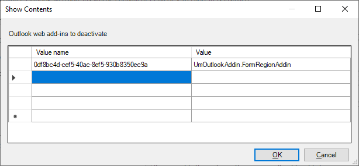

# <a name="make-your-office-add-in-compatible-with-an-existing-com-add-in"></a>Убедитесь, что надстройка Office совместима с существующей надстройкой COM

Если у вас есть существующая надстройка COM, вы можете создать эквивалентные функции в надстройки Office, что позволит вашему решению работать на других платформах, таких как Office в Интернете или Mac. В некоторых случаях Office надстройка может не предоставить всю функциональность, доступную в соответствующей надстройки COM. В таких ситуациях надстройка COM может предоставлять пользователям более Windows, чем соответствующие Office надстройки.

Вы можете настроить надстройку Office, чтобы при установке эквивалентной надстройки COM на компьютере пользователя Office на Windows надстройка COM вместо надстройки Office com. Надстройка COM называется "эквивалентной", так как Office плавно переходит между надстройки COM и надстройки Office, в соответствии с которой устанавливается компьютер пользователя.

[!INCLUDE [Support note for equivalent add-ins feature](../includes/equivalent-add-in-support-note.md)]

## <a name="specify-an-equivalent-com-add-in"></a>Укажите эквивалентную надстройка COM

### <a name="manifest"></a>Манифест

> [!IMPORTANT]
> Применяется к Excel, Outlook, PowerPoint и Word.

Чтобы обеспечить совместимость Office надстройки и надстройки COM, определите эквивалентную надстройка COM в манифесте [](add-in-manifests.md) Office надстройки. Затем Office на Windows надстройка COM вместо надстройки Office, если они установлены.

В следующем примере показана часть манифеста, которая указывает надстройки COM в качестве эквивалентной надстройки. Значение элемента определяет `ProgId` надстройку COM, а элемент [EquivalentAddins](/javascript/api/manifest/equivalentaddins) должен быть позиционен непосредственно перед закрывающими тегами `VersionOverrides` .

```xml
<VersionOverrides>
  ...
  <EquivalentAddins>
    <EquivalentAddin>
      <ProgId>ContosoCOMAddin</ProgId>
      <Type>COM</Type>
    </EquivalentAddin>
  </EquivalentAddins>
</VersionOverrides>
```

> [!TIP]
> Сведения о совместимости надстройки COM и совместимости XLL UDF см. в этой ссылке: Сделайте настраиваемые функции совместимыми с функциями, определенными пользователем [XLL](../excel/make-custom-functions-compatible-with-xll-udf.md). Не применимо для Outlook.

### <a name="group-policy"></a>Групповая политика

> [!IMPORTANT]
> Применяется только Outlook.

Чтобы объявить совместимость между Outlook веб-надстройки и надстройки COM/VSTO, определите эквивалентную надстройку COM в групповой политике **Deactivate Outlook веб-надстроек**, эквивалентные com или VSTO надстройке, установленной путем настройки на компьютере пользователя. Затем Outlook на Windows надстройка COM вместо веб-надстройки, если они установлены.

1. Скачайте последний [инструмент Административные шаблоны](https://www.microsoft.com/download/details.aspx?id=49030), уделив внимание инструкциям по **установке этого средства**.
1. Откройте редактор локальной групповой политики (**gpedit.msc**).
1. Перейдите **к конфигурации** **пользователейAdministrative** >  **TemplatesMicrosoft**  >  Outlook 2016  > **Miscellaneous**.
1. Выберите параметр **Deactivate Outlook веб-надстроек**, VSTO com или VSTO надстройки.
1. Откройте ссылку для редактирования параметра политики.
1. В диалоговом **Outlook веб-надстроек для отключения**:
    1. Установите **имя value** для найденного `Id` в манифесте веб-надстройки. **Важно**. *Не добавляйте* фигурные скобки `{}` вокруг записи.
    1. Установите **значение** эквивалентной `ProgId` надстройки COM/VSTO.
    1. Выберите **ОК** , чтобы вложить обновление в действие.
    

## <a name="equivalent-behavior-for-users"></a>Эквивалентное поведение для пользователей

При [указании](#specify-an-equivalent-com-add-in) эквивалентной надстройки COM Office на Windows не будет отображаться пользовательский интерфейс Office надстройки (пользовательский интерфейс), если установлена эквивалентная надстройка COM. Office скрывает только кнопки ленты надстройки Office надстройки и не препятствует установке. Поэтому Office надстройка по-прежнему будет отображаться в следующих расположениях в пользовательском интерфейсе.

- В **статье Мои надстройки**
- В качестве записи в диспетчере ленты (только Excel, Word и PowerPoint)

> [!NOTE]
> Указание эквивалентной надстройки COM в манифесте не влияет на другие платформы, такие как Office в Интернете или Mac.

В следующих сценариях описывается, что происходит в зависимости от того, как пользователь Office надстройку.

### <a name="appsource-acquisition-of-an-office-add-in"></a>Приобретение appSource Office надстройки

Если пользователь приобретает надстройки Office AppSource и эквивалентная надстройка COM уже установлена, Office будет:

1. Установите Office надстройки.
2. Скрыть пользовательский Office надстройки в ленте.
3. Отображение вызова для пользователя, который указывает кнопку ленты надстройки COM.

### <a name="centralized-deployment-of-office-add-in"></a>Централизованное развертывание Office надстройки

Если администратор развертывает надстройку Office клиента с помощью централизованного развертывания и эквивалентная надстройка COM уже установлена, пользователь должен перезапустить Office, прежде чем они увидят какие-либо изменения. После Office перезапуска будет:

1. Установите Office надстройки.
2. Скрыть пользовательский Office надстройки в ленте.
3. Отображение вызова для пользователя, который указывает кнопку ленты надстройки COM.

### <a name="document-shared-with-embedded-office-add-in"></a>Документ, общий со встроенными Office надстройки

Если у пользователя установлена надстройка COM, а затем он получает общий документ со встроенной надстройки Office, то при открываемом документе Office:

1. Побудить пользователя доверять Office надстройки.
2. При доверии Office надстройка будет устанавливаться.
3. Скрыть пользовательский Office надстройки в ленте.

## <a name="other-com-add-in-behavior"></a>Другое поведение надстройки COM

### <a name="excel-powerpoint-word"></a>Excel, PowerPoint, Word

Если пользователь отстраивается от эквивалентной надстройки COM, Office на Windows восстанавливает пользовательский интерфейс Office надстройки.

После указания эквивалентной надстройки COM для Office надстройки Office прекращается обработка обновлений Office надстройки. Чтобы получить последние обновления для надстройки Office, пользователю необходимо сначала удалить надстройку COM.

### <a name="outlook"></a>Outlook

Надстройка com/VSTO должна быть подключена при Outlook, чтобы соответствующая веб-надстройка была отключена.

Если надстройка com/VSTO отключена во время последующего сеанса Outlook, веб-надстройка, скорее всего, будет отключена до Outlook перезапуска.

## <a name="see-also"></a>См. также

- [Совместите пользовательские функции с определенными функциями пользователя XLL](../excel/make-custom-functions-compatible-with-xll-udf.md)
