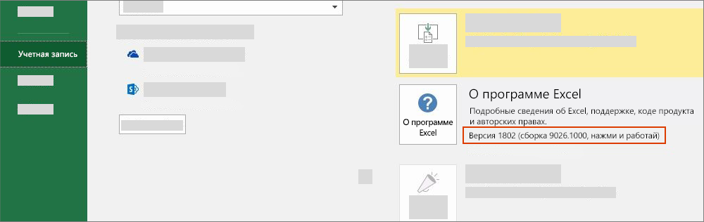

# Версии Office и наборы обязательных элементов

Не все версии Office поддерживают все API в API JavaScript для Office (Office.js). Не всегда можно указать версию Office, с которой должны работать пользователи. Для таких ситуаций существуют наборы обязательных элементов, которые помогают определить, поддерживает приложение Office необходимые надстройке возможности.

> [!NOTE]
>
> - Office работает на различных платформах, в том числе Windows, в браузере, на компьютерах Mac и на iPad.
> - Примеры приложений Office — Excel, Word, PowerPoint, Outlook, OneNote и другие продукты.  
> - Набор обязательных элементов — это именованная группа элементов API, например, `ExcelApi 1.5`, `WordApi 1.3` и т. д.  

## Как узнать, какая версия Office используется

Чтобы определить используемую версию Office, в приложении Office откройте меню **Файл** и выберите **Учетная запись**. Версия Office будет указана в разделе **Сведения о продукте**. Например, на следующем снимке экрана указана версия Office 1802 (сборка 9026.1000):

## Доступность наборов обязательных элементов для Office

Используя наборы обязательных элементов API, надстройки Office могут определять, поддерживает ли приложение Office необходимые элементы API. Поддержка набора обязательных элементов зависит от приложения Office и его версии (см. предыдущий раздел).

У некоторых приложений Office есть собственные наборы обязательных элементов API. Например, первым набором обязательных элементов для API Excel был `ExcelApi 1.1`, а для API Word — `WordApi 1.1`. Со временем для обеспечения дополнительной функциональности API были добавлены новые наборы обязательных элементов (ExcelApi и WordApi).

Кроме того, к общему API были добавлены другие функции, такие как команды надстроек (расширение ленты) и возможность запуска диалоговых окон (API диалоговых окон). Наборы обязательных элементов для команд надстроек и API диалоговых окон — это примеры наборов API, общие для всех приложений Office.

Надстройка может использовать API только в наборах обязательных элементов, поддерживаемых версией приложения Office, в которой она работает. Чтобы узнать, какие наборы обязательных элементов доступны для конкретной версии приложения Office, просмотрите следующие статьи:

- [Наборы обязательных элементов API JavaScript для Excel](../reference/requirement-sets/excel-api-requirement-sets.md) (ExcelApi)
- [Наборы обязательных элементов API JavaScript для Word](../reference/requirement-sets/word-api-requirement-sets.md) (WordApi)
- [Наборы обязательных элементов API JavaScript для OneNote](../reference/requirement-sets/onenote-api-requirement-sets.md) (OneNoteApi)
- [Наборы обязательных элементов PowerPoint JavaScript API](../reference/requirement-sets/powerpoint-api-requirement-sets.md) (PowerPointApi)
- [Общие сведения о наборах обязательных элементов API Outlook](../reference/requirement-sets/outlook-api-requirement-sets.md) (MailBox)

Некоторые наборы обязательных элементов содержат API, которые могут использоваться любым приложением Office. Информацию об этих наборах обязательных элементов см. в следующих статьях:

- [Общие наборы обязательных элементов для Office](../reference/requirement-sets/office-add-in-requirement-sets.md)
- [Наборы обязательных элементов для команд надстроек](../reference/requirement-sets/add-in-commands-requirement-sets.md)
- [Наборы обязательных элементов API диалоговых окон](../reference/requirement-sets/dialog-api-requirement-sets.md)
- [Наборы обязательных элементов API идентификации](../reference/requirement-sets/identity-api-requirement-sets.md)

Номер версии набора обязательных элементов, например "1.1" в `ExcelApi 1.1`, указывается относительно приложения Office. Номер версии набора обязательных элементов (например, `ExcelApi 1.1`) не соответствует номеру версии Office.js или наборам обязательных элементов для других приложений Office (например, Word, Outlook и т. д.). Наборы обязательных элементов для разных приложений Office выпускаются с разной частотой. Например, набор обязательных элементов `ExcelApi 1.5` был выпущен до набора обязательных элементов `WordApi 1.3`.

Библиотека API JavaScript для Office (Office.js) включает все доступные наборы обязательных элементов. Наборы обязательных элементов `ExcelApi 1.3` и `WordApi 1.3` существуют, но набора обязательных элементов `Office.js 1.3` нет. Доступ к последнему выпуску Office.js осуществляется через единую конечную точку Office, предоставляемую с помощью сети доставки содержимого (CDN). Дополнительные сведения о CDN Office.js, в том числе об управлении версиями и обратной совместимостью, см. в статье [Общие сведения об интерфейсе API JavaScript для Office](../develop/understanding-the-javascript-api-for-office.md).

## Указание приложений Office и наборов обязательных элементов

Указать необходимые надстройке приложения Office и наборы обязательных элементов можно разными способами. Подробные сведения см. в статье [Указание приложений Office и обязательных элементов API](../develop/specify-office-hosts-and-api-requirements.md).

## См. также

- [Указание приложений Office и обязательных элементов API](../develop/specify-office-hosts-and-api-requirements.md)
- [Установка последней версии Office](../develop/install-latest-office-version.md)
- [Обзор каналов обновления для Приложений Microsoft 365](/deployoffice/overview-of-update-channels-for-office-365-proplus)
- [Свежий взгляд на продуктивность благодаря Microsoft 365 и Microsoft Teams](https://products.office.com/compare-all-microsoft-office-products?tab=2)
