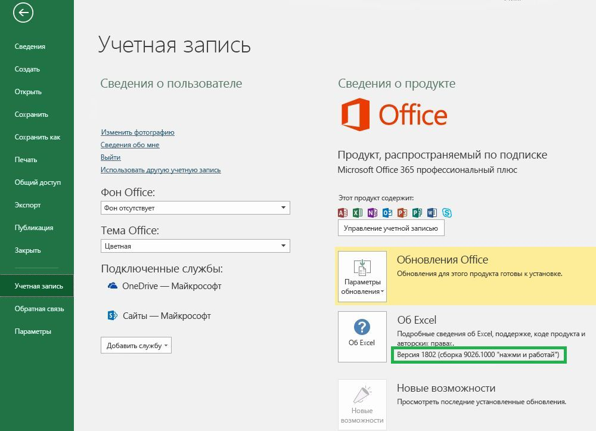

# Версии и наборы обязательных требований Office

Не все версии Office поддерживают все API в API JavaScript для Office (Office.js). Не всегда можно указать версию Office, с которой должны работать пользователи.  Для таких ситуаций существуют наборы обязательных элементов, которые помогают определить, поддерживает ли ведущее приложение Office необходимые надстройке возможности. 

> [!NOTE]
> - Office работает на разных платформах, в том числе Office для Windows, Office Online, Office для Mac и Office для iPad.  
> - Примеры ведущих приложений Office — Excel, Word, PowerPoint, Outlook, OneNote и другие продукты.  
> - Набор обязательных элементов — это именованная группа элементов API, например, `ExcelApi 1.5`, `WordApi 1.3` и т. д.  

## Как узнать, какая версия Office используется

Чтобы определить используемую версию Office, в приложении Office откройте меню **Файл** и выберите **Учетная запись**. Версия Office будет указана в разделе **Сведения о продукте**. Например, на следующем снимке экрана указана версия Office 1802 (сборка 9026.1000):

## Доступность наборов обязательных элементов для Office

Используя наборы обязательных элементов API, надстройки Office могут определять, поддерживает ли ведущее приложение Office необходимые элементы API. Поддержка набора обязательных элементов зависит от ведущего приложения Office и его версии (см. предыдущий раздел).

У некоторых ведущих приложений Office есть собственные наборы обязательных элементов API. Например, первым набором обязательных элементов для API Excel был `ExcelApi 1.1`, а для API Word — `WordApi 1.1`. Со временем для обеспечения дополнительной функциональности API были добавлены новые наборы обязательных элементов (ExcelApi и WordApi).

Кроме того, к общему API были добавлены другие функции, такие как команды надстроек (расширение ленты) и возможность запуска диалоговых окон (API диалоговых окон). Наборы обязательных элементов для команд надстроек и API диалоговых окон — это наборы API, общие для всех ведущих приложений Office.

Надстройка может использовать API только в наборах обязательных элементов, поддерживаемых версией ведущего приложения Office, в которой она работает. Чтобы узнать, какие наборы обязательных элементов доступны для конкретной версии ведущего приложения Office, просмотрите следующие статьи:

- [Наборы обязательных элементов API JavaScript для Excel](https://dev.office.com/reference/add-ins/requirement-sets/excel-api-requirement-sets?product=excel) (ExcelApi)
- [Наборы обязательных элементов API JavaScript для Word](https://dev.office.com/reference/add-ins/requirement-sets/word-api-requirement-sets) (WordApi)
- [Наборы обязательных элементов API JavaScript для OneNote](https://dev.office.com/reference/add-ins/requirement-sets/onenote-api-requirement-sets) (OneNoteApi)
- [Общие сведения о наборах обязательных элементов API Outlook](https://dev.office.com/reference/add-ins/outlook/tutorial-api-requirement-sets) (MailBox)

Некоторые наборы обязательных элементов содержат API, которые могут использоваться любым ведущим приложением Office. Информацию об этих наборах обязательных элементов см. в следующих статьях:

- [Общие наборы обязательных элементов для Office](https://dev.office.com/reference/add-ins/requirement-sets/office-add-in-requirement-sets)
- [Наборы обязательных элементов для команд надстроек](https://dev.office.com/reference/add-ins/requirement-sets/add-in-commands-requirement-sets?product=excel)
- [Наборы обязательных элементов API диалоговых окон](https://dev.office.com/reference/add-ins/requirement-sets/dialog-api-requirement-sets?product=excel)
- [Наборы обязательных элементов API идентификации](https://dev.office.com/reference/add-ins/requirement-sets/identity-api-requirement-sets?product=excel)

Номер версии набора обязательных элементов, например "1.1" в `ExcelApi 1.1`, указывается относительно ведущего приложения Office. Номер версии набора обязательных элементов (например, `ExcelApi 1.1`) не соответствует номеру версии Office.js или наборам обязательных элементов для других ведущих приложений Office (например, Word, Outlook и т. д.).  Наборы обязательных элементов для разных ведущих приложений Office выпускаются с разной скоростью и интервалом. Например, набор обязательных элементов `ExcelApi 1.5` был выпущен до набора обязательных элементов `WordApi 1.3`.

Библиотека API JavaScript для Office (Office.js) включает все доступные наборы обязательных элементов. Наборы обязательных элементов `ExcelApi 1.3` и `WordApi 1.3` существуют, но набора обязательных элементов `Office.js 1.3` нет. Доступ к последней версии Office.js осуществляется через единую конечную точку Office, интегрированную в сеть доставки содержимого (CDN). |||UNTRANSLATED_CONTENT_START|||For more details around the Office.js CDN, including how versioning and backward compatibility is handled, see [Understanding the JavaScript API for Office](https://docs.microsoft.com/office/dev/add-ins/develop/understanding-the-javascript-api-for-office).|||UNTRANSLATED_CONTENT_END|||

## Указание ведущих приложений Office и наборов обязательных элементов

Указать необходимые надстройке ведущие приложения Office и наборы обязательных элементов можно разными способами.  Подробные сведения см. в статье [Указание ведущих приложений Office и обязательных элементов API](https://docs.microsoft.com/office/dev/add-ins/develop/specify-office-hosts-and-api-requirements).

## См. также

- [Указание ведущих приложений Office и обязательных элементов API](https://docs.microsoft.com/office/dev/add-ins/develop/specify-office-hosts-and-api-requirements)
- [Установка последней версии Office](https://docs.microsoft.com/office/dev/add-ins/develop/install-latest-office-version)
- [Обзор каналов обновления Office 365 профессиональный плюс](https://docs.microsoft.com/deployoffice/overview-of-update-channels-for-office-365-proplus)
- [Получите максимум от наших продуктов благодаря Office 365](https://products.office.com/compare-all-microsoft-office-products?tab=2)
