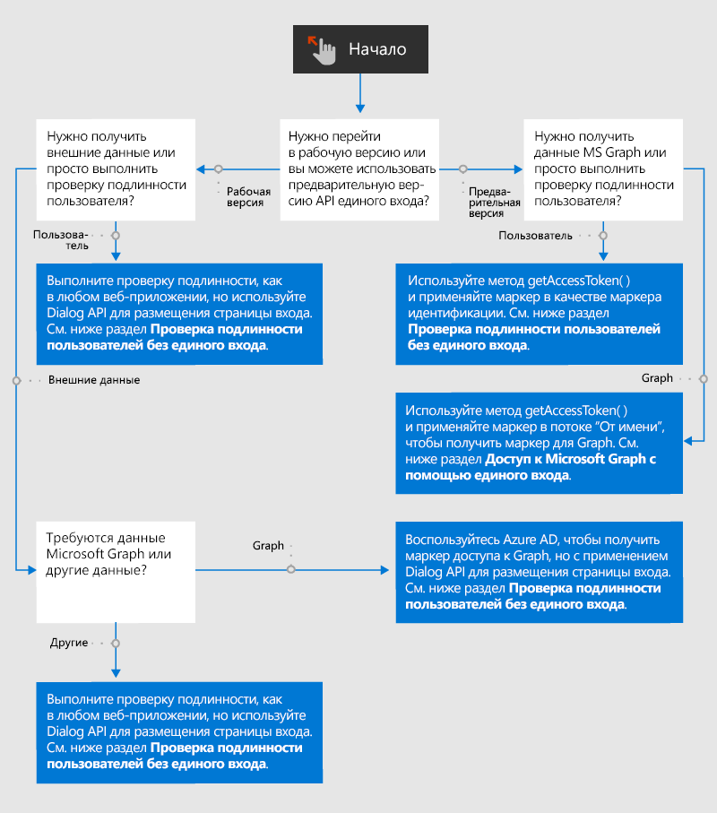

# Обзор проверки подлинности и авторизации в надстройках Office

Веб-приложения и, следовательно, надстройки Office по умолчанию поддерживают анонимный доступ, но вы можете требовать проверку подлинности пользователей с помощью входа. Например, вы можете требовать, чтобы пользователи выполняли вход с помощью учетной записи Майкрософт, Microsoft 365 для образования, рабочей учебной записи либо другой учетной записи. Эта задача называется проверкой подлинности пользователей, так как она позволяет надстройке определить пользователя.

Ваша надстройка также может получать согласие пользователя на доступ к данным Microsoft Graph (например, к профилю Microsoft 365, файлам OneDrive и данным SharePoint) или данным в других внешних источниках, таких как Google, Facebook, LinkedIn, SalesForce и GitHub. Эта задача называется авторизацией надстройки (или приложения), так как выполняется авторизация *надстройки*, а не пользователя.

Можно выбрать один из двух способов выполнения проверки подлинности и авторизации.

- **Единый вход (SSO) Office** — система, позволяющая использовать вход пользователя в Office в качестве входа в надстройку. При необходимости надстройка также может использовать учетные данные пользователя Office для своей авторизации в Microsoft Graph. (Источники, отличные от Майкрософт, не поддерживаются в этой системе.)
- **Проверка подлинности и авторизация веб-приложения с помощью Azure Active Directory**. Это не новое решение, а просто способ, которым надстройки Office (и другие веб-приложения) проверяли подлинность пользователей и авторизовали приложения до появления системы единого входа Office. Он по-прежнему используется в сценариях, не поддерживающих единый вход. Кроме того, существуют сценарии, в которых вам может требоваться отдельный вход пользователей в вашу надстройку даже при доступности единого входа. Например, если вы хотите, чтобы у них была возможность входа в надстройку с помощью другого идентификатора, отличающегося от текущего входа в Office.

На следующей блок-схеме показаны решения, которые нужно принять разработчику надстройки. Более подробные сведения появятся позже в этой статье.

## Проверка подлинности пользователей без единого входа

Вы можете проверить подлинность пользователя в надстройке Office с помощью Azure Active Directory (AAD) как в любом другом веб-приложении с одним исключением: служба AAD не разрешает открывать свою страницу входа в элементе iframe. При работе с надстройкой Office в *Office в Интернете* область задач является элементом iframe. Это означает, что вам потребуется открыть экран входа в AAD в диалоговом окне, вызванном с помощью Dialog API для Office. Это влияет на способ использования библиотек помощника проверки подлинности. Дополнительные сведения см. в статье [Проверка подлинности с помощью Dialog API для Office](auth-with-office-dialog-api.md).

Сведения о программной проверке подлинности с помощью AAD см. в статье [Общие сведения о платформе удостоверений Майкрософт (версии 2.0)](/azure/active-directory/develop/v2-overview), где вы найдете множество учебников и руководств, а также ссылки на соответствующие примеры и библиотеки. Как описано в статье [Проверка подлинности с помощью Dialog API для Office](auth-with-office-dialog-api.md), вам может потребоваться изменить код из примеров, чтобы запустить его в диалоговом окне Office.

## Доступ к Microsoft Graph без единого входа

Вы можете получить для надстройки разрешение на доступ к данным Microsoft Graph, получив маркер доступа к Graph из Azure Active Directory (AAD). Это можно сделать без использования единого входа Office. Дополнительные сведения об этом см. в статье [Доступ к Microsoft Graph без единого входа](authorize-to-microsoft-graph-without-sso.md), содержащей подробности и ссылки на примеры.

## Проверка подлинности пользователей с помощью единого входа

Для проверки подлинности пользователей с помощью единого входа код в области задач или файл функции вызывает метод [getAccessToken](/javascript/api/office-runtime/officeruntime.auth#getAccessToken_options_). Если пользователь не выполнил вход, Office откроет диалоговое окно и перейдет к странице входа в Azure Active Directory. После входа пользователя метод возвращает маркер доступа, являющийся маркером начальной загрузки в потоке **От имени**. (См. раздел [Доступ к Microsoft Graph с помощью единого входа](#access-to-microsoft-graph-with-sso).) Однако его также можно использовать в качестве маркера идентификации, так как он содержит несколько утверждений, уникальных для текущего пользователя, включая `preferred_username`, `name`, `sub` и `oid`. Инструкции о том, какое свойство использовать в качестве конечного идентификатора пользователя, см. в статье [Маркеры доступа платформы удостоверений Майкрософт](/azure/active-directory/develop/access-tokens#payload-claims). Пример одного из этих маркеров см. в статье с [примером маркера доступа](sso-in-office-add-ins.md#example-access-token).

После извлечения кодом нужного утверждения из маркера он использует это значение для поиска пользователя в таблице пользователей или вашей базе данных пользователей. Используйте базу данных для хранения сведений, относящихся к пользователям, например параметров пользователя или состояния учетной записи пользователя. Так как вы используете единый вход, пользователи не входят отдельно в вашу надстройку, поэтому вам не нужно хранить пароли для пользователей.

Перед началом внедрения проверки подлинности пользователей с помощью единого входа внимательно ознакомьтесь со статьей [Включение единого входа для надстроек Office](sso-in-office-add-ins.md). Обратите внимание также на эти примеры:

- [Единый вход с использованием NodeJS для надстройки Office](https://github.com/OfficeDev/Office-Add-in-samples/tree/main/Samples/auth/Office-Add-in-NodeJS-SSO), особенно на файл [ssoAuthES6.js](https://github.com/OfficeDev/Office-Add-in-samples/tree/main/Samples/auth/Office-Add-in-NodeJS-SSO/Complete/public/javascripts/ssoAuthES6.js).
- [Единый вход с использованием ASP.NET для надстройки Office](https://github.com/OfficeDev/Office-Add-in-samples/tree/main/Samples/auth/Office-Add-in-ASPNET-SSO).

Однако в этих примерах маркер не используется в качестве маркера идентификации. Он используется для получения доступа к Microsoft Graph с потоком **от имени**.

## Доступ к Microsoft Graph с помощью единого входа

Чтобы использовать единый вход для получения доступа к Microsoft Graph, ваша надстройка в области задач или файл функции вызывает метод [getAccessToken](/javascript/api/office-runtime/officeruntime.auth#getAccessToken_options_). Если пользователь не выполнил вход, Office откроет диалоговое окно и перейдет к странице входа в Azure Active Directory. После входа пользователя метод возвращает маркер доступа, являющийся маркером начальной загрузки в потоке **От имени**. В частности он содержит утверждение `scope` со значением `access_as_user`. Руководство по утверждениям в маркере см. в статье [Маркеры доступа платформы удостоверений Майкрософт](/azure/active-directory/develop/access-tokens#payload-claims). Пример одного из этих маркеров см. в статье с [примером маркера доступа](sso-in-office-add-ins.md#example-access-token).

После получения маркера кодом он используется в потоке **От имени**, чтобы получить второй маркер: маркер доступа к Microsoft Graph.

Перед началом внедрения единого входа для Office внимательно ознакомьтесь со следующими двумя статьями:

- [Включение единого входа для надстроек Office](sso-in-office-add-ins.md)
- [Авторизация в Microsoft Graph с помощью единого входа](authorize-to-microsoft-graph.md)

Вам также следует ознакомиться хотя бы с одним руководством, указанным здесь. Даже если вы не выполняете описанные действия, они содержат важную информацию о реализации единого входа Office и потока **От имени**.

- [Создание надстройки Office на платформе ASP.NET с использованием единого входа](create-sso-office-add-ins-aspnet.md)
- [Создание надстройки Office на платформе Node.js с использованием единого входа](create-sso-office-add-ins-nodejs.md)

Обратите внимание также на следующие примеры:

- [Единый вход с использованием NodeJS для надстройки Office](https://github.com/OfficeDev/Office-Add-in-samples/tree/main/Samples/auth/Office-Add-in-NodeJS-SSO)
- [Единый вход с использованием ASP.NET для надстройки Office](https://github.com/OfficeDev/Office-Add-in-samples/tree/main/Samples/auth/Office-Add-in-ASPNET-SSO)

## Доступ к сторонним источникам данных (отличным от Майкрософт)

С помощью популярных веб-служб, в том числе Google, Facebook, LinkedIn, SalesForce и GitHub, разработчики могут предоставлять пользователям доступ к их учетным записям в других приложениях. Благодаря этому вы можете включать эти службы в свои надстройки Office. Обзор способов, доступных вашей надстройке для выполнения этих действий, см. в статье [Авторизация внешних служб в надстройке Office](auth-external-add-ins.md).

> [!IMPORTANT]
> Перед началом создания кода выясните, позволяет ли источник данных экрану входа открываться в элементе iframe. При работе с надстройкой Office в *Office в Интернете* область задач является элементом iframe. Если источник данных не позволяет экрану входа открываться в элементе iframe, вам потребуется открыть экран входа в диалоговом окне, вызываемом с помощью Dialog API для Office. Дополнительные сведения см. в статье [Проверка подлинности с помощью Dialog API для Office](auth-with-office-dialog-api.md).
