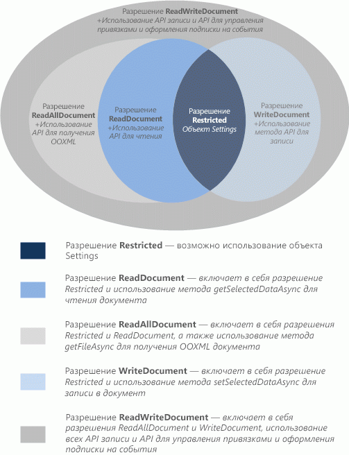

# <a name="requesting-permissions-for-api-use-in-add-ins"></a>Запрос разрешений на использование API в надстройках

В этой статье описываются различные уровни разрешений, которые можно объявить в манифесте контентной надстройки или надстройки области задач, чтобы указать уровень доступа JavaScript API, необходимый вашей надстройке. 

## <a name="permissions-model"></a>Модель разрешений

5-уровневая модель разрешений JavaScript API — это основа безопасности и конфиденциальности для пользователей контентных надстроек и надстроек области задач. На рис. 1 показаны пять уровней разрешений API, которые можно объявить в манифесте надстройки.

*Рис. 1. Пятиуровневая модель разрешений для контентных надстроек и надстроек области задач*



Эти разрешения задают подмножество API, которые контентная надстройки или надстройка области задач сможет использовать во время выполнения, когда пользователь вставляет, а затем активирует ваше приложение (доверяет ему). Чтобы объявить уровень разрешений, необходимый вашей надстройке, укажите одно из текстовых значений разрешения в элементе [Permissions](../reference/manifest/permissions.md) манифеста надстройки. Следующий пример запрашивает разрешение **WriteDocument**, который разрешает использовать только методы записи в документ (но не методы чтения).

```XML
<Permissions>WriteDocument</Permissions>
```

Рекомендуется запрашивать разрешения по принципу  _минимальной привилегии_. Т. е. следует запрашивать разрешения для доступа только к минимальному подмножеству API, необходимому надстройке для правильной работы. Например, если надстройке требуется только читать данные документа пользователя, оно должно запрашивать максимум разрешение **ReadDocument**.

В следующей таблице описывается подмножество API JavaScript, предоставляемое каждым уровнем разрешений.

|**Разрешение**|**Включенное подмножество API**|
|:-----|:-----|
|**Restricted**|Методы объекта [Settings](/javascript/api/office/office.settings) и метод [Document.getActiveViewAsync](/javascript/api/office/office.document#getActiveViewAsync_options__callback_).Это минимальный уровень разрешений, запрашиваемый контентной надстройкой или надстройкой области задач.|
|**ReadDocument**|Помимо API, разрешенного  ограниченным разрешением, добавляется доступ к участникам API, необходимым для чтения документа и управления привязками. Это включает в себя использование:<br/><ul><li>Метод <a href="/javascript/api/office/office.document#getSelectedDataAsync_coercionType__options__callback_" target="_blank">Document.getSelectedDataAsync</a> для получения выбранного текста, HTML (только Word) или табличных данных, но не базовый код Open Office XML (OOXML), содержащий все данные в документе.</p></li><li><p>Метод <a href="/javascript/api/office/office.document#getFileAsync_fileType__options__callback_" target="_blank">Document.getFileAsync</a> для получения всего текста документа, но не двоичной копии OOXML документа.</p></li><li><p>Метод <a href="/javascript/api/office/office.binding#getDataAsync_options__callback_" target="_blank">Binding.getDataAsync</a> для чтения связанных данных в документе.</p></li><li><p>Методы <a href="/javascript/api/office/office.bindings#addFromNamedItemAsync_itemName__bindingType__options__callback_" target="_blank">addFromNamedItemAsync</a>, <a href="/javascript/api/office/office.bindings#addFromPromptAsync_bindingType__options__callback_" target="_blank">addFromPromptAsync</a>, <a href="/javascript/api/office/office.bindings#addFromSelectionAsync_bindingType__options__callback_" target="_blank">addFromSelectionAsync</a> объекта <span class="keyword">Bindings</span> для создания привязок в документе.</p></li><li><p>Методы <a href="/javascript/api/office/office.bindings#getAllAsync_options__callback_" target="_blank">getAllAsync</a>, <a href="/javascript/api/office/office.bindings#getByIdAsync_id__options__callback_" target="_blank">getByIdAsync</a> и <a href="/javascript/api/office/office.bindings#releaseByIdAsync_id__options__callback_" target="_blank">releaseByIdAsync</a> объекта <span class="keyword">Bindings</span> для доступа к привязкам документа и их удаления.</p></li><li><p>Метод <a href="/javascript/api/office/office.document#getFilePropertiesAsync_options__callback_" target="_blank">Document.getFilePropertiesAsync</a> для доступа к свойствам файла документа, таким как URL-адрес документа.</p></li><li><p>Метод <a href="/javascript/api/office/office.document#goToByIdAsync_id__goToType__options__callback_" target="_blank">Document.goToByIdAsync</a> для перехода к именованным объектам и расположениям в документе.</p></li><li><p>Для надстроек области задач для Project — все методы "get" объекта <a href="/javascript/api/office/office.document" target="_blank">ProjectDocument</a>. </p></li></ul>|
|**ReadAllDocument**|Помимо API, разрешенного  разрешениями на доступ к документам и разрешениям **ReadDocument,** можно получить дополнительный доступ к данным документов.<br/><ul><li><p>Методы <span class="keyword">Document.getSelectedDataAsync</span> и <span class="keyword">Document.getFileAsync</span> получают доступ к коду OOXML документа (который кроме текста может содержать форматирование, ссылки, встроенную графику, комментарии, редакции и т. д.).</p></li></ul>|
|**WriteDocument**|Помимо API, разрешенного  ограниченным разрешением, добавляется доступ к следующим участникам API.<br/><ul><li><p>Метод <a href="/javascript/api/office/office.document#setSelectedDataAsync_data__options__callback_" target="_blank">Document.setSelectedDataAsync</a> для записи данных в выделенную пользователем область документа.</p></li></ul>|
|**ReadWriteDocument**|Помимо API, разрешенного **ограничениями,** **readDocument,** **ReadAllDocument** и **разрешениями WriteDocument,** включает доступ ко всем оставшимся API, поддерживаемым надстройки контента и области задач, включая методы подписки на события. Чтобы получить доступ к этим дополнительным членам API, необходимо объявить разрешение **ReadWriteDocument:**<br/><ul><li><p>Метод <a href="/javascript/api/office/office.binding#setDataAsync_data__options__callback_" target="_blank">Binding.setDataAsync</a> для записи связанных областей документа.</p></li><li><p>Метод <a href="/javascript/api/office/office.tablebinding#addRowsAsync_rows__options__callback_" target="_blank">TableBinding.addRowsAsync</a> для добавления строк в связанные таблицы.</p></li><li><p>Метод <a href="/javascript/api/office/office.tablebinding#addColumnsAsync_tableData__options__callback_" target="_blank">TableBinding.addColumnsAsync</a> для добавления столбцов в связанные таблицы.</p></li><li><p>Метод <a href="/javascript/api/office/office.tablebinding#deleteAllDataValuesAsync_options__callback_" target="_blank">TableBinding.deleteAllDataValuesAsync</a> для удаления всех данных в связанной таблице.</p></li><li><p>Методы <a href="/javascript/api/office/office.tablebinding#setFormatsAsync_cellFormat__options__callback_" target="_blank">setFormatsAsync</a>, <a href="/javascript/api/office/office.tablebinding#clearFormatsAsync_options__callback_" target="_blank">clearFormatsAsync</a> и <a href="/javascript/api/office/office.tablebinding#setTableOptionsAsync_tableOptions__options__callback_" target="_blank">setTableOptionsAsync</a> объекта <span class="keyword">TableBinding</span> для настройки форматирования и параметров связанных таблиц.</p></li><li><p>Все элементы объектов <a href="/javascript/api/office/office.customxmlnode" target="_blank">CustomXmlNode</a>, <a href="/javascript/api/office/office.customxmlpart" target="_blank">CustomXmlPart</a>, <a href="/javascript/api/office/office.customxmlparts" target="_blank">CustomXmlParts</a> и <a href="/javascript/api/office/office.customxmlprefixmappings" target="_blank">CustomXmlPrefixMappings</a>.</p></li><li><p>Все методы для подписки на события, поддерживаемые контентными надстройками и надстройками области задач, в частности методы <span class="keyword">addHandlerAsync</span> и <span class="keyword">removeHandlerAsync</span> объектов <a href="/javascript/api/office/office.binding" target="_blank">Binding</a>, <a href="/javascript/api/office/office.customxmlpart" target="_blank">CustomXmlPart</a>, <a href="/javascript/api/office/office.document" target="_blank">Document</a>, <a href="/javascript/api/office/office.document" target="_blank">ProjectDocument</a> и <a href="/javascript/api/office/office.document#settings" target="_blank">Settings</a>.</p></li></ul>|

## <a name="see-also"></a>См. также

- [Конфиденциальность и безопасность надстроек Office](../concepts/privacy-and-security.md)
