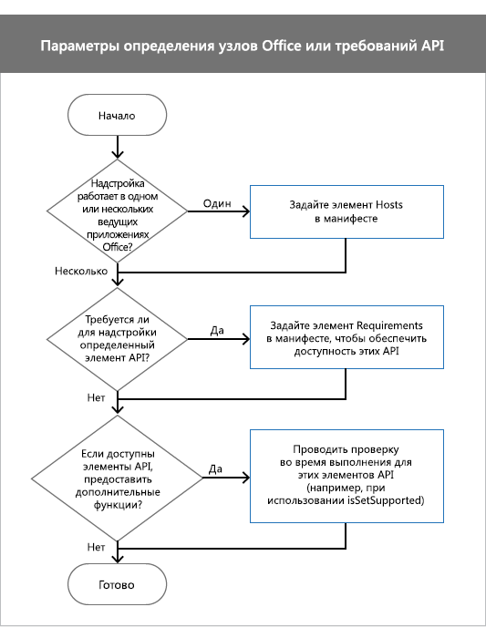

# <a name="specify-office-applications-and-api-requirements"></a>Указание приложений Office и требований API

Ваша надстройка Office может зависеть от конкретного приложения Office, набора требований, члена API или версии API, чтобы работать ожидаемым образом. Например, надстройка может:

- работать в одном (например, Word или Excel) или нескольких приложениях Office;

- использовать API JavaScript, доступные только в некоторых версиях Office. Например, можно создать надстройку Excel 2016 на базе новых API JavaScript для Excel;

- работать только в версиях Office, которые поддерживают элементы API, используемые вашей надстройкой.

Эта статья поможет вам разобраться, какие параметры следует выбрать для правильной работы надстройки и максимального охвата аудитории.

> [!NOTE]
> Высокоуровневые представления о том, где в настоящее время поддерживаются надстройки Office, см. на странице доступности клиентских приложений и платформ Office для [надстройки Office.](../overview/office-add-in-availability.md)

В таблице ниже перечислены основные понятия, рассматриваемые в этой статье.

|**Концепция**|**Описание**|
|:-----|:-----|
|Приложение Office, клиентские приложения Office|Приложение Office, используемое для запуска надстройки, например Word, Excel и т. д.|
|Платформа|Место запуска приложения Office, например в браузере или на iPad.|
|Набор обязательных элементов|Именованная группа связанных элементов API. Надстройки используют наборы требований, чтобы определить, поддерживает ли приложение Office члены API, используемые надстройой. Проще проверять поддержку набора требований, а не отдельных элементов API. Поддержка набора требований зависит от приложения Office и его версии. <br >Наборы обязательных элементов указываются в файле манифеста. При указании наборов требований в манифесте устанавливается минимальный уровень поддержки API, который приложение Office должно предоставить для запуска надстройки. Приложения Office, которые не поддерживают наборы требований, указанные в манифесте, не могут запускать надстройку, и надстройка не будет отображаться в my <span class="ui">Add-ins.</span> Это ограничивает доступ к надстройки. в коде с помощью проверок в среде выполнения. Полный список наборов требований см. в статье [Наборы обязательных элементов для надстроек Office](../reference/requirement-sets/office-add-in-requirement-sets.md).|
|Проверка в среде выполнения|Тест, выполняемый во время выполнения, чтобы определить, поддерживает ли приложение Office, запуская надстройку, наборы требований или методы, используемые надстройой. Чтобы выполнить проверку в рамках  времени выполнения, используйте с методом, наборами требований или именами методов, которые не являются частью `isSetSupported` набора требований. Проверки в среде выполнения позволяют максимально расширить аудиторию надстройки. В отличие от наборов требований, проверки в времени работы не указывают минимальный уровень поддержки API, который приложение Office должно предоставить для запуска надстройки. Вместо этого используйте утверждение **if,** чтобы определить, поддерживается ли член API. и если это так, добавляете в надстройку дополнительные функции. Если вы используете проверки в среде выполнения, ваша надстройка всегда будет отображаться в разделе **Мои надстройки**.|

## <a name="before-you-begin"></a>Подготовка

Надстройка должна использовать последнюю версию схемы манифеста надстройки. Если вы используете проверки в среде работы надстройки, убедитесь, что вы используете последнюю библиотеку API JavaScript для Office (office.js).

### <a name="specify-the-latest-add-in-manifest-schema"></a>Выбор последней версии схема манифестов надстроек

Ваша надстройка должна использовать схему манифеста 1.1. Установите элемент `OfficeApp` в манифесте надстройки следующим образом.

```XML
<OfficeApp xmlns="http://schemas.microsoft.com/office/appforoffice/1.1" xmlns:xsi="http://www.w3.org/2001/XMLSchema-instance" xsi:type="TaskPaneApp">
```

### <a name="specify-the-latest-office-javascript-api-library"></a>Указание последней библиотеки API JavaScript для Office

Если вы используете проверки в среде запуска, ссылаясь на текущую версию библиотеки API JavaScript для Office из сети доставки содержимого (CDN). Для этого добавьте указанный ниже тег `script` в HTML-код. Чтобы всегда ссылаться на последнюю версию файла Office.js, используйте `/1/` в URL-адресе сети доставки содержимого.

```HTML
<script src="https://appsforoffice.microsoft.com/lib/1/hosted/office.js" type="text/javascript"></script>
```

## <a name="options-to-specify-office-applications-or-api-requirements"></a>Параметры для указания требований к приложениям Office или API

При указании требований к приложениям Office или API необходимо учитывать несколько факторов. На следующей схеме показано, как выбрать правильный метод для надстройки.



- Если надстройка работает в одном приложении Office, установите `Hosts` элемент в манифесте. Дополнительные сведения см. в разделе [Задание элемента Hosts](#set-the-hosts-element).

- Чтобы установить минимальный набор требований или элементы API, которые приложение Office должно поддерживать для запуска надстройки, установите элемент `Requirements` в манифесте. Дополнительные сведения см. в [подстройки "Настройка элемента Requirements" в манифесте.](#set-the-requirements-element-in-the-manifest)

- Если вы хотите предоставить дополнительные функции, если в приложении Office доступны определенные наборы требований или члены API, выполните проверку в среде выполнения в коде JavaScript надстройки. Например, если надстройка выполняется в Excel 2016, используйте элементы нового API JavaScript для Excel, чтобы предоставить дополнительные функции. Дополнительные сведения см. в разделе [Использование проверок в среде выполнения в коде JavaScript](#use-runtime-checks-in-your-javascript-code).

## <a name="set-the-hosts-element"></a>Задание элемента Hosts

Чтобы надстройка запускалась в одном клиенте Office, используйте элементы `Hosts` `Host` манифеста и элементы. Если не указать элемент, ваша надстройка будет работать во всех приложениях Office, поддерживаемых `Hosts` надстройки Office.

Например, следующее и объявление указывает, что надстройка будет работать с любым выпуском Excel, который включает Excel в `Hosts` `Host` Интернете, Windows и iPad.

```xml
<Hosts>
  <Host Name="Workbook" />
</Hosts>
```

Элемент `Hosts` может содержать один или несколько `Host` элементов. Элемент `Host` указывает приложение Office, необходимое для надстройки. Атрибут `Name` является требуемым и может иметь одно из следующих значений.

| Name          | Клиентские приложения Office                      |
|:--------------|:----------------------------------------------|
| Database      | Веб-приложения Access                               |
| Document      | Word в Интернете, Windows, Mac, iPad           |
| Почтовый ящик       | Outlook в Интернете, Windows, Mac, Android, iOS|
| Presentation  | PowerPoint в Интернете, Windows, Mac, iPad     |
| Проект       | Project для Windows                            |
| Рабочая книга      | Excel в Интернете, Windows, Mac, iPad          |

> [!NOTE]
> Этот `Name` атрибут указывает клиентские приложения Office, которые могут запускать надстройку. Приложения Office поддерживаются на различных платформах и работают на настольных компьютерах, веб-браузерах, планшетах и мобильных устройствах. Вам не удастся указать, какую платформу можно использовать для запуска надстройки. Например, если указать, для запуска надстройки можно использовать Как Outlook в Интернете, так и в `Mailbox` Windows.

> [!IMPORTANT]
> Больше не рекомендуется создавать и использовать веб-приложения и базы данных Access в SharePoint. В качестве альтернативы рекомендуем использовать [Microsoft PowerApps](https://powerapps.microsoft.com/) для создания бизнес-решений для Интернета и мобильных устройств без написания кода.

## <a name="set-the-requirements-element-in-the-manifest"></a>Указание элемента Requirements в манифесте

Этот элемент задает минимальные наборы требований или элементы API, которые должны поддерживаться приложением Office для запуска `Requirements` надстройки. Элемент может указывать как наборы требований, так и `Requirements` отдельные методы, используемые в надстройки. В версии 1.1 схемы манифеста надстройки элемент является необязательным для всех надстроек, кроме надстроек `Requirements` Outlook.

> [!WARNING]
> Используйте элемент только для указания критически важных наборов требований или элементов API, которые должна `Requirements` использовать надстройка. Если приложение или платформа Office не поддерживают наборы требований или элементы API, указанные в элементе, надстройка не будет работать в этом приложении или платформе и не будет отображаться в my `Requirements` **Add-ins**. Вместо этого мы рекомендуем сделать надстройки доступными на всех платформах приложения Office, таких как Excel в Интернете, Windows и iPad. Чтобы надстройка была доступна на всех приложениях  _и_ платформах Office, используйте проверки в времени работы вместо `Requirements` элемента.

В следующем примере кода показана надстройка, загружаемая во всех клиентских приложениях Office, которые поддерживают следующее:

-  `TableBindings` набор требований с минимальной версией "1.1".

-  `OOXML` набор требований с минимальной версией "1.1".

-  `Document.getSelectedDataAsync` method.

```XML
<Requirements>
   <Sets DefaultMinVersion="1.1">
      <Set Name="TableBindings" MinVersion="1.1"/>
      <Set Name="OOXML" MinVersion="1.1"/>
   </Sets>
   <Methods>
      <Method Name="Document.getSelectedDataAsync"/>
   </Methods>
</Requirements>
```

- Элемент `Requirements` содержит элементы и их `Sets` `Methods` потомки.

- Элемент `Sets` может содержать один или несколько `Set` элементов. `DefaultMinVersion` указывает значение по `MinVersion` умолчанию для всех `Set` элементов.

- Этот `Set` элемент задает наборы требований, которые приложение Office должно поддерживать для запуска надстройки. Атрибут `Name` указывает имя набора требований. Указывает `MinVersion` минимальную версию набора требований. `MinVersion`переопределяет значение для дополнительных сведений о наборах требований и версиях набора требований, к которые принадлежат ваши члены API, см. в подразделе "Наборы `DefaultMinVersion` [требований для надстройки Office".](../reference/requirement-sets/office-add-in-requirement-sets.md)

- Элемент `Methods` может содержать один или несколько `Method` элементов. Этот элемент нельзя использовать с надстройки `Methods` Outlook.

- Элемент `Method` указывает отдельный метод, который должен поддерживаться в приложении Office, где работает надстройка. Атрибут является обязательной и указывает имя `Name` метода, квалифицировать его родительский объект.

## <a name="use-runtime-checks-in-your-javascript-code"></a>Использование проверок в среде выполнения в коде JavaScript

Если приложение Office поддерживает определенные наборы требований, вам может потребоваться предоставить дополнительные функции. Например, если надстройка работает в Word 2016, вы можете использовать в ней API JavaScript для Word. Для этого используйте метод [isSetSupported](/javascript/api/office/office.requirementsetsupport#issetsupported-name--minversion-) с именем набора обязательных элементов. `isSetSupported` определяет, поддерживает ли приложение Office, запуская надстройку, набор требований. Если набор требований поддерживается, возвращается true и выполняется дополнительный код, использующий `isSetSupported` члены API из этого набора.  Если приложение Office не поддерживает набор требований, возвращается false, и дополнительный код `isSetSupported` не будет  запускаться. В следующем коде показан синтаксис, который следует использовать `isSetSupported` с .

```js
if (Office.context.requirements.isSetSupported(RequirementSetName, MinimumVersion))
{
   // Code that uses API members from RequirementSetName.
}

```

- _RequirementSetName_ (обязательный параметр) — это строка, представляющая имя набора обязательных элементов (например, "**ExcelApi**", "**Mailbox**" и т. д.). Дополнительные сведения о доступных наборах обязательных элементов см. в статье [Наборы обязательных элементов для надстроек Office](../reference/requirement-sets/office-add-in-requirement-sets.md).
- _MinimumVersion_ (необязательный) — это строка, указывавая минимальную версию набора требований, которую должно поддерживать приложение Office для запуска кода в этом заявлении `if` (например,**"1.9").**

> [!WARNING]
> При вызове метода значением параметра `isSetSupported` `MinimumVersion` (если он указан) должна быть строка. Это обусловлено тем, что средство синтаксического анализа JavaScript не может различить числовые значения, например 1.1 и 1.10, но может различать строковые значения, например "1.1" и "1.10".
> Перегрузка оператора `number` не рекомендуется.

Используйте `isSetSupported` его со связанным с `RequirementSetName` приложением Office следующим образом.

|Приложение Office|RequirementSetName|
|---|---|
|Excel|ExcelApi|
|OneNote|OneNoteApi|
|Outlook|Mailbox|
|Word|WordApi|

Метод и наборы требований для этих приложений доступны в последнем Office.js в `isSetSupported` CDN. Если вы не используете Office.js CDN, надстройка может создавать исключения, так как они будут `isSetSupported` неопределенными. Дополнительные сведения см. в [подразделе "Указание последней библиотеки API JavaScript для Office".](#specify-the-latest-office-javascript-api-library)

В следующем примере кода показано, как надстройка может предоставлять различные функции для различных приложений Office, которые могут поддерживать различные наборы требований или члены API.

```js
if (Office.context.requirements.isSetSupported('WordApi', '1.1'))
{
    // Run code that provides additional functionality using the Word JavaScript API when the add-in runs in Word 2016 or later.
}
else if (Office.context.requirements.isSetSupported('CustomXmlParts'))
{
    // Run code that uses API members from the CustomXmlParts requirement set.
}
else
{
    // Run additional code when the Office application is not Word 2016 or later and does not support the CustomXmlParts requirement set.
}

```

## <a name="runtime-checks-using-methods-not-in-a-requirement-set"></a>Проверки в среде выполнения с использованием методов, не входящих в набор обязательных элементов

Некоторые элементы API не входят в наборы обязательных элементов. Это относится только к членам API, которые являются частью пространства имен [API JavaScript для Office](../reference/javascript-api-for-office.md) (все, кроме API почтовых ящиков Outlook), но не относятся к `Office.` [API JavaScript](../reference/overview/word-add-ins-reference-overview.md) для Word (все в), [](/javascript/api/outlook)API JavaScript для Excel (все в) или `Word.` [](../reference/overview/excel-add-ins-reference-overview.md) `Excel.` [API JavaScript OneNote](../reference/overview/onenote-add-ins-javascript-reference.md) (все в) пространствах `OneNote.` имен. Если надстройка зависит от метода, который не входит в набор требований, вы можете использовать проверку в времени работы, чтобы определить, поддерживается ли метод приложением Office, как показано в следующем примере кода. Список всех методов, не входящих в набор обязательных элементов, см. в статье [Наборы обязательных элементов для надстроек Office](../reference/requirement-sets/office-add-in-requirement-sets.md#methods-that-arent-part-of-a-requirement-set).

> [!NOTE]
> Рекомендуем ограничить использование этого типа проверки в среде выполнения в коде надстройки.

В следующем примере кода проверяется, поддерживает ли приложение `document.setSelectedDataAsync` Office.

```js
if (Office.context.document.setSelectedDataAsync)
{
    // Run code that uses `document.setSelectedDataAsync`.
}
```


## <a name="see-also"></a>См. также

- [XML-манифест надстройки Office](add-in-manifests.md)
- [Наборы обязательных элементов для надстроек Office](../reference/requirement-sets/office-add-in-requirement-sets.md)
- [Word-Add-in-Get-Set-EditOpen-XML ](https://github.com/OfficeDev/Word-Add-in-Get-Set-EditOpen-XML)
