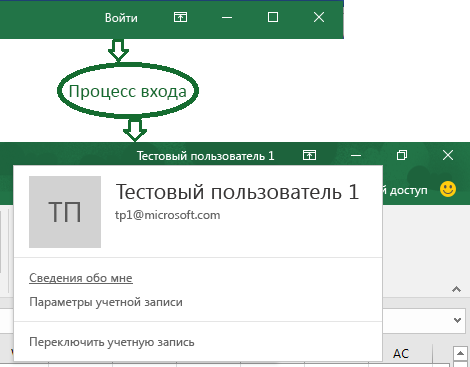

# <a name="enable-single-sign-on-for-office-add-ins-preview"></a><span data-ttu-id="83221-102">Включение единого входа для надстроек Office (предварительная версия)</span><span class="sxs-lookup"><span data-stu-id="83221-102">Enable single sign-on for Office Add-ins (preview)</span></span>

<span data-ttu-id="83221-p101">Пользователи выполняют вход в Office (сетевые, мобильные и компьютерные платформы) с помощью своей личной учетной записи Майкрософт, либо их учебной или рабочей учетной записи (Office 365). Также можно воспользоваться преимуществами, предлагаемыми единым входом (SSO), и использовать его для авторизации пользователя при работе с надстройкой без повторного ввода данных для входа в систему.</span><span class="sxs-lookup"><span data-stu-id="83221-p101">Users sign in to Office (online, mobile, and desktop platforms) using either their personal Microsoft account or their work or school (Office 365) account. You can take advantage of this and use single sign-on (SSO) to authorize the user to your add-in without requiring the user to sign in a second time.</span></span>



### <a name="preview-status"></a><span data-ttu-id="83221-106">Статус предварительной версии</span><span class="sxs-lookup"><span data-stu-id="83221-106">Preview Status</span></span>

<span data-ttu-id="83221-p102">API единого входа в настоящее время поддерживается только в рамках предварительной версии. Он может использоваться разработчиками для экспериментов, но применять его в производственных надстройках не следует. Кроме того, надстройки, в которых используется единый вход, не принимаются в [AppSource](https://appsource.microsoft.com).</span><span class="sxs-lookup"><span data-stu-id="83221-p102">The Single Sign-on API is currently supported in preview only. It is available to developers for experimentation; but it should not be used in a production add-in. In addition, add-ins that use SSO are not accepted in [AppSource](https://appsource.microsoft.com).</span></span>

<span data-ttu-id="83221-p103">Не все приложения Office поддерживают предварительную версию единого входа. Она может использоваться в Word, Excel, Outlook и PowerPoint. Чтобы больше узнать о приложениях, поддерживающих в настоящее время API единого входа, см. [Набор требований IdentityAPI](https://docs.microsoft.com/office/dev/add-ins/reference/requirement-sets/identity-api-requirement-sets?view=office-js).</span><span class="sxs-lookup"><span data-stu-id="83221-p103">Not all Office applications support the SSO preview. It is available in Word, Excel, Outlook, and PowerPoint. For more information about where the Single Sign-on API is currently supported, see [IdentityAPI requirement sets](https://docs.microsoft.com/office/dev/add-ins/reference/requirement-sets/identity-api-requirement-sets?view=office-js).</span></span>

### <a name="requirements-and-best-practices"></a><span data-ttu-id="83221-113">Требования и рекомендации</span><span class="sxs-lookup"><span data-stu-id="83221-113">Requirements and Best Practices</span></span>

<span data-ttu-id="83221-114">Чтобы использовать единый вход, необходимо загрузить бета-версию библиотеки JavaScript Office из `https://appsforoffice.microsoft.com/lib/beta/hosted/office.js` на стартовой HTML-странице надстройки.</span><span class="sxs-lookup"><span data-stu-id="83221-114">To use SSO, you must load the beta version of the Office JavaScript Library from `https://appsforoffice.microsoft.com/lib/beta/hosted/office.js` in the startup HTML page of the add-in.</span></span>

<span data-ttu-id="83221-p104">При работе с надстройкой **Outlook** не забудьте включить современную проверку подлинности для клиентов Office 365. Чтобы узнать о том, как это сделать, см. [Exchange Online: как разрешить клиенту использование современной проверки подлинности](https://social.technet.microsoft.com/wiki/contents/articles/32711.exchange-online-how-to-enable-your-tenant-for-modern-authentication.aspx).</span><span class="sxs-lookup"><span data-stu-id="83221-p104">If you are working with an **Outlook** add-in, be sure to enable Modern Authentication for the Office 365 tenancy. For information about how to do this, see [Exchange Online: How to enable your tenant for modern authentication](https://social.technet.microsoft.com/wiki/contents/articles/32711.exchange-online-how-to-enable-your-tenant-for-modern-authentication.aspx).</span></span>

<span data-ttu-id="83221-p105">Полагаться на единый вход, как на единственный способ проверки подлинности *не* следует. Необходимо реализовать альтернативную систему проверки подлинности, которая может применяться надстройкой при возникновении определенных ошибок. Для этой цели можно использовать пользовательские таблицы и проверку подлинности, либо воспользоваться услугми одного из поставщиков учетных данных для входа в социальные сети. Дополнительные сведения о том, как это сделать с помощью надстройки Office, можно найти в статье [Авторизация внешних служб в вашей надстройке Office](https://docs.microsoft.com/en-us/office/dev/add-ins/develop/auth-external-add-ins). Для *Outlook* предусмотрена рекомендованная к применению система восстановления предшествующего состояния. Чтобы узнать больше, см. [Сценарий: реализация единого входа для службы в надстройке Outlook](https://docs.microsoft.com/outlook/add-ins/implement-sso-in-outlook-add-in).</span><span class="sxs-lookup"><span data-stu-id="83221-p105">You should *not* rely on SSO as your add-in's only method of authentication. You should implement an alternate authentication system that your add-in can fall back to in certain error situations. You can use a system of user tables and authentication, or you can leverage one of the social login providers. For more information about how to do this with an Office add-in, see [Authorize external services in your Office Add-in](https://docs.microsoft.com/en-us/office/dev/add-ins/develop/auth-external-add-ins). For *Outlook*, there is a recommended fall back system. For more information, see [Scenario: Implement single sign-on to your service in an Outlook add-in](https://docs.microsoft.com/outlook/add-ins/implement-sso-in-outlook-add-in).</span></span>

### <a name="how-sso-works-at-runtime"></a><span data-ttu-id="83221-123">Принцип работы единого входа во время выполнения</span><span class="sxs-lookup"><span data-stu-id="83221-123">How it works at runtime</span></span>

<span data-ttu-id="83221-124">На приведенной ниже схеме показано, как работает единый вход.</span><span class="sxs-lookup"><span data-stu-id="83221-124">The following diagram shows how the SSO process works.</span></span>


1. <span data-ttu-id="83221-p106">В надстройке JavaScript вызывает новый API Office.js [getAccessTokenAsync](#sso-api-reference). Это сообщает основному приложению Office получить маркер доступа к надстройке. В разделе [примере маркера доступа](#example-access-token).</span><span class="sxs-lookup"><span data-stu-id="83221-p106">In the add-in, JavaScript calls a new Office.js API [getAccessTokenAsync](#sso-api-reference). This tells the Office host application to obtain an access token to the add-in. See [Example access token](#example-access-token).</span></span>
2. <span data-ttu-id="83221-129">Если вход в Office не выполнен, в ведущем приложении открывается всплывающее окно, в котором пользователю предлагается войти.</span><span class="sxs-lookup"><span data-stu-id="83221-129">If the user is not signed in, the Office host application opens a pop-up window for the user to sign in.</span></span>
3. <span data-ttu-id="83221-130">Если пользователь запускает надстройку в первый раз, ему предлагается дать согласие.</span><span class="sxs-lookup"><span data-stu-id="83221-130">If this is the first time the current user has used your add-in, he or she is prompted to consent.</span></span>
4. <span data-ttu-id="83221-131">Ведущее приложение Office запрашивает **маркер надстройки** у конечной точки Azure AD версии 2.0 для текущего пользователя.</span><span class="sxs-lookup"><span data-stu-id="83221-131">The Office host application requests the **add-in token** from the Azure AD v2.0 endpoint for the current user.</span></span>
5. <span data-ttu-id="83221-132">Azure AD отправляет маркер надстройки ведущему приложению Office.</span><span class="sxs-lookup"><span data-stu-id="83221-132">Azure AD sends the add-in token to the Office host application.</span></span>
6. <span data-ttu-id="83221-133">Ведущее приложение Office отправляет **маркер** надстройке в составе объекта результата, возвращенного при вызове метода `getAccessTokenAsync`.</span><span class="sxs-lookup"><span data-stu-id="83221-133">The Office host application sends the **add-in token** to the add-in as part of the result object returned by the `getAccessTokenAsync` call.</span></span>
7. <span data-ttu-id="83221-134">JavaScript в надстройке может проанализировать маркер и извлечь из него требуемую информацию, например, адрес электронной почты пользователя.</span><span class="sxs-lookup"><span data-stu-id="83221-134">JavaScript in the add-in can parse the token and extract the information it needs, such as the user's email address.</span></span> 
8. <span data-ttu-id="83221-p107">В качестве альтернативного варианта, надстройка может отправить HTTP-запрос своему серверу для получения дополнительных данных о пользователе, например, сведений о пользовательских настройках. Кроме того, серверу может передаваться сам маркер доступа для последующего анализа и проверки.</span><span class="sxs-lookup"><span data-stu-id="83221-p107">Optionally, the add-in can send HTTP request to its server-side for more data about the user; such as the user's preferences. Alternatively, the access token itself could be sent to the server-side for parsing and validation there.</span></span> 

## <a name="develop-an-sso-add-in"></a><span data-ttu-id="83221-137">Разработка надстройки с единым входом</span><span class="sxs-lookup"><span data-stu-id="83221-137">Develop an SSO add-in</span></span>

<span data-ttu-id="83221-p108">В этом разделе описываются задачи, решаемые при создании надстройки Office с единым входом. При описании этих задач применяемые язык и платформа не учитываются. Чтобы ознакомиться с примерами подробных пошаговых руководств см.:</span><span class="sxs-lookup"><span data-stu-id="83221-p108">This section describes the tasks involved in creating an Office Add-in that uses SSO. These tasks are described here in a language- and framework-agnostic way. For examples of detailed walkthroughs, see:</span></span>

* [<span data-ttu-id="83221-141">Создание надстройки Office на платформе Node.js с использованием единого входа</span><span class="sxs-lookup"><span data-stu-id="83221-141">Create a Node.js Office Add-in that uses single sign-on</span></span>](create-sso-office-add-ins-nodejs.md)
* [<span data-ttu-id="83221-142">Создание надстройки Office на платформе ASP.NET с использованием единого входа</span><span class="sxs-lookup"><span data-stu-id="83221-142">Create an ASP.NET Office Add-in that uses single sign-on</span></span>](create-sso-office-add-ins-aspnet.md)

### <a name="create-the-service-application"></a><span data-ttu-id="83221-143">Создание приложения-службы</span><span class="sxs-lookup"><span data-stu-id="83221-143">Create the service application</span></span>

<span data-ttu-id="83221-p109">Зарегистрируйте надстройку на портале регистрации для конечной точки Azure версии 2.0: https://apps.dev.microsoft.com. Этот процесс занимает 5–10 минут и включает следующие задачи.</span><span class="sxs-lookup"><span data-stu-id="83221-p109">Register the add-in at the registration portal for the Azure v2.0 endpoint: https://apps.dev.microsoft.com. This is a 5–10 minute process that includes the following tasks:</span></span>

* <span data-ttu-id="83221-146">Получение идентификатора клиента и секрета клиента для надстройки.</span><span class="sxs-lookup"><span data-stu-id="83221-146">Get a client ID and secret for the add-in.</span></span>
* <span data-ttu-id="83221-p110">Укажите разрешения, необходимые вашей надстройке, в конечной точке AAD версии 2.0 (и, при необходимости, в Microsoft Graph). Разрешение «Профиль» требуется всегда.</span><span class="sxs-lookup"><span data-stu-id="83221-p110">Specify the permissions that your add-in needs to AAD v. 2.0 endpoint (and optionally to Microsoft Graph). The "profile" permission is always needed.</span></span>
* <span data-ttu-id="83221-150">Установка доверия надстройке для ведущего приложения Office.</span><span class="sxs-lookup"><span data-stu-id="83221-150">Grant the Office host application trust to the add-in.</span></span>
* <span data-ttu-id="83221-151">предварительная авторизация ведущего приложения Office для надстройки с помощью заданного по умолчанию разрешения *access_as_user*.</span><span class="sxs-lookup"><span data-stu-id="83221-151">Preauthorize the Office host application to the add-in with the default permission *access_as_user*.</span></span>

<span data-ttu-id="83221-152">Для получения дополнительной информации об этом процессе см. статью [Регистрация надстройки Office, использующей единый вход с конечной точкой Azure AD версии 2.0](register-sso-add-in-aad-v2.md).</span><span class="sxs-lookup"><span data-stu-id="83221-152">For more details about this process, see [Register an Office Add-in that uses SSO with the Azure AD v2.0 endpoint](register-sso-add-in-aad-v2.md).</span></span>

### <a name="configure-the-add-in"></a><span data-ttu-id="83221-153">Конфигурация надстройки</span><span class="sxs-lookup"><span data-stu-id="83221-153">Configure the add-in</span></span>

<span data-ttu-id="83221-154">Добавьте новую разметку в манифест надстройки:</span><span class="sxs-lookup"><span data-stu-id="83221-154">Add new markup to the add-in manifest:</span></span>

* <span data-ttu-id="83221-155">**WebApplicationInfo** — родительский элемент для указанных ниже элементов.</span><span class="sxs-lookup"><span data-stu-id="83221-155">**WebApplicationInfo** - The parent of the following elements.</span></span>
* <span data-ttu-id="83221-p111">**Id** — идентификатор клиента надстройки. Это идентификатор приложения, предоставляемый в процессе регистрации надстройки. См. [Регистрация использующей единый вход надстройки Office в конечной точке Azure AD версии 2.0](register-sso-add-in-aad-v2.md).</span><span class="sxs-lookup"><span data-stu-id="83221-p111">**Id** - The client ID of the add-in This is an application ID that you obtain as part of registering the add-in. See [Register an Office Add-in that uses SSO with the Azure AD v2.0 endpoint](register-sso-add-in-aad-v2.md).</span></span>
* <span data-ttu-id="83221-158">**Resource** — URL-адрес надстройки.</span><span class="sxs-lookup"><span data-stu-id="83221-158">**Resource** - The URL of the add-in.</span></span>
* <span data-ttu-id="83221-159">**Scopes** — родительский элемент одного или нескольких элементов **Scope**.</span><span class="sxs-lookup"><span data-stu-id="83221-159">**Scopes** - The parent of one or more **Scope** elements.</span></span>
* <span data-ttu-id="83221-p112">**Scope** — характеризует разрешение, необходимое надстройке в AAD. `profile` Это разрешение требуется всегда, а в случае, если надстройка не имеет доступа к Microsoft Graph, могут потребоваться и другие разрешения. При наличии у надстройки доступа к Microsoft Graph элементы **Scope** также требуются для необходимых разрешений Microsoft Graph, например, для `User.Read` и `Mail.Read`. Библиотекам, применяемым в коде для доступа к Microsoft Graph, могут потребоваться дополнительные разрешения. Так, к примеру, библиотеке проверки подлинности Майкрософт (MSAL) для .NET требуется разрешение `offline_access`. Чтобы больше узнать, см. [Авторизация в Microsoft Graph из надстройки Office](authorize-to-microsoft-graph.md).</span><span class="sxs-lookup"><span data-stu-id="83221-p112">**Scope** - Specifies a permission that the add-in needs to AAD. The `profile` permission is always needed and it may be the only permission needed, if your add-in does not access Microsoft Graph. If it does, you also need **Scope** elements for the required Microsoft Graph permissions; for example, `User.Read`, `Mail.Read`. Libraries that you use in your code to access Microsoft Graph may need additional permissions. For example, Microsoft Authentication Library (MSAL) for .NET requires `offline_access` permission. For more information, see [Authorize to Microsoft Graph from an Office Add-in](authorize-to-microsoft-graph.md).</span></span>

<span data-ttu-id="83221-p113">Для отличных от Outlook ведущих приложений Office добавляйте разметку в конец раздела `<VersionOverrides ... xsi:type="VersionOverridesV1_0">`. Для Outlook добавляйте разметку в конец раздела `<VersionOverrides ... xsi:type="VersionOverridesV1_1">`.</span><span class="sxs-lookup"><span data-stu-id="83221-p113">For Office hosts other than Outlook, add the markup to the end of the `<VersionOverrides ... xsi:type="VersionOverridesV1_0">` section. For Outlook, add the markup to the end of the `<VersionOverrides ... xsi:type="VersionOverridesV1_1">` section.</span></span>

<span data-ttu-id="83221-168">Ниже приведен пример части кода.</span><span class="sxs-lookup"><span data-stu-id="83221-168">The following is an example of the markup:</span></span>

```xml
<WebApplicationInfo>
    <Id>5661fed9-f33d-4e95-b6cf-624a34a2f51d</Id>
    <Resource>api://addin.contoso.com/5661fed9-f33d-4e95-b6cf-624a34a2f51d</Resource>
    <Scopes>
        <Scope>user.read</Scope>
        <Scope>files.read</Scope>
        <Scope>profile</Scope>
    </Scopes>
</WebApplicationInfo>
```

### <a name="add-client-side-code"></a><span data-ttu-id="83221-169">Добавление кода для клиента</span><span class="sxs-lookup"><span data-stu-id="83221-169">Add client-side code</span></span>

<span data-ttu-id="83221-170">Добавьте в надстройку код JavaScript для:</span><span class="sxs-lookup"><span data-stu-id="83221-170">Add JavaScript to the add-in to:</span></span>

* <span data-ttu-id="83221-171">Вызов [getAccessTokenAsync](https://docs.microsoft.com/office/dev/add-ins/develop/sso-in-office-add-ins#sso-api-reference).</span><span class="sxs-lookup"><span data-stu-id="83221-171">Call [getAccessTokenAsync](https://docs.microsoft.com/office/dev/add-ins/develop/sso-in-office-add-ins#sso-api-reference).</span></span>

* <span data-ttu-id="83221-172">анализа маркера доступа или его передачи в серверный код надстройки;</span><span class="sxs-lookup"><span data-stu-id="83221-172">Parse the access token or pass it to the add-in’s server-side code.</span></span> 

<span data-ttu-id="83221-173">Далее представлен простой пример вызова `getAccessTokenAsync`.</span><span class="sxs-lookup"><span data-stu-id="83221-173">Here's a simple example of a call to `getAccessTokenAsync`.</span></span> 

> [!NOTE]
> <span data-ttu-id="83221-p114">В этом примере явным образом обрабатывается только один тип ошибки. Примеры более сложной обработки ошибок см. в [Home.js в Office-Add-in-ASPNET-SSO](https://github.com/OfficeDev/Office-Add-in-ASPNET-SSO/blob/master/Complete/Office-Add-in-ASPNET-SSO-WebAPI/Scripts/Home.js) и [program.js в Office-Add-in-NodeJS-SSO](https://github.com/OfficeDev/Office-Add-in-NodeJS-SSO/blob/master/Completed/public/program.js). См. также [Устранение неполадок при появлении сообщений об ошибках для единого входа (SSO)](troubleshoot-sso-in-office-add-ins.md).</span><span class="sxs-lookup"><span data-stu-id="83221-p114">This example handles only one kind of error explicitly. For examples of more elaborate error handling, see [Home.js in Office-Add-in-ASPNET-SSO](https://github.com/OfficeDev/Office-Add-in-ASPNET-SSO/blob/master/Complete/Office-Add-in-ASPNET-SSO-WebAPI/Scripts/Home.js) and [program.js in Office-Add-in-NodeJS-SSO](https://github.com/OfficeDev/Office-Add-in-NodeJS-SSO/blob/master/Completed/public/program.js). And see [Troubleshoot error messages for single sign-on (SSO)](troubleshoot-sso-in-office-add-ins.md).</span></span>
 

```js
Office.context.auth.getAccessTokenAsync(function (result) {
    if (result.status === "succeeded") {
        // Use this token to call Web API
        var ssoToken = result.value;
        ...
    } else {
        if (result.error.code === 13003) {
            // SSO is not supported for domain user accounts, only
            // work or school (Office 365) or Microsoft Account IDs.
        } else {
            // Handle error
        }
    }
});
```

<span data-ttu-id="83221-p115">Ниже приводится простой пример передачи маркера надстройки серверу. Данный маркер используется в качестве заголовка `Authorization` при отправке запроса серверу. В этом примере демонстрируется отправка данных JSON: здесь используется метод `POST`, но для отправки маркера доступа без выполнения записи на сервер достаточно применения `GET`.</span><span class="sxs-lookup"><span data-stu-id="83221-p115">Here's a simple example of passing the add-in token to the server-side. The token is included as an `Authorization` header when sending a request back to the server-side. This example envisions sending JSON data, so it uses the `POST` method, but `GET` is sufficient to send the access token when you are not writing to the server.</span></span>

```js
$.ajax({
    type: "POST",
    url: "/api/DoSomething",
    headers: {
        "Authorization": "Bearer " + ssoToken
    },
    data: { /* some JSON payload */ },
    contentType: "application/json; charset=utf-8"
}).done(function (data) {
    // Handle success
}).fail(function (error) {
    // Handle error
}).always(function () {
    // Cleanup
});
```

#### <a name="when-to-call-the-method"></a><span data-ttu-id="83221-180">Когда вызывается данный метод</span><span class="sxs-lookup"><span data-stu-id="83221-180">When to call the method</span></span>

<span data-ttu-id="83221-181">Если надстройка не может работать без входа пользователя в Office, то при запуске надстройки необходимо вызвать `getAccessTokenAsync` \*\*.</span><span class="sxs-lookup"><span data-stu-id="83221-181">If your add-in cannot be used when a no user is logged into Office and Office does not have an access token to your add-in, then you should call `getAccessTokenAsync` *when the add-in launches*.</span></span>

<span data-ttu-id="83221-p116">Если некоторые функциональные возможности надстройки не требуют входа пользователя в систему, то при выполнении пользователем операции, требующей входа в систему, можно вызвать `getAccessTokenAsync` \*\*. Значительного снижения производительности при совершении `getAccessTokenAsync` избыточных вызовов не наблюдается, так как Office кэширует и повторно использует маркер доступа до истечения его срока действия, не обращаясь к конечной точке AAD версии 2.0 при каждом вызове `getAccessTokenAsync`. В связи с этим, вызовы `getAccessTokenAsync` можно добавлять во все функции и обработчики, которые инициируют действие, требующее наличия маркера.</span><span class="sxs-lookup"><span data-stu-id="83221-p116">If the add-in has some functionality that doesn't require a logged in user, then you call `getAccessTokenAsync` *when the user takes an action that requires a logged in user*. There is no significant performance degradation with redundant calls of `getAccessTokenAsync` because Office caches the access token and will reuse it, until it expires, without making another call to the AAD v. 2.0 endpoint whenever `getAccessTokenAsync` is called. So you can add calls of `getAccessTokenAsync` to all functions and handlers that initiate an action where the token is needed.</span></span>

### <a name="add-server-side-code"></a><span data-ttu-id="83221-186">Добавление кода со стороны сервера</span><span class="sxs-lookup"><span data-stu-id="83221-186">Add server-side code</span></span>

<span data-ttu-id="83221-p117">Если маркер доступа не передается надстройкой использующему его серверу, то, в большинстве случаев, получение этого маркера особого смысла не имеет. Некоторые задачи, которые могут выполняться надстройкой со стороны сервера, включают в себя:</span><span class="sxs-lookup"><span data-stu-id="83221-p117">In most scenarios, there would be little point to obtaining the access token, if your add-in does not pass it on to a server-side and use it there. Some server-side tasks your add-in could do:</span></span>

* <span data-ttu-id="83221-p118">Создание одного или нескольких методов веб-API, использующих извлекаемую из маркера информацию о пользователе, например, метода, выполняющего поиск пользовательских настройек в размещенной базе данных (см. **Использование маркера единого доступа в качестве удостоверения** ниже). В зависимости от применяемого языка и платформы, могут оказаться доступными библиотеки, упрощающие написание кода.</span><span class="sxs-lookup"><span data-stu-id="83221-p118">Create one or more Web API methods that use information about the user that is extracted from the token; for example, a method that looks up the user's preferences in your hosted data base. (See **Using the SSO token as an identity** below.) Depending on your language and framework, libraries might be available that will simplify the code you have to write.</span></span>
* <span data-ttu-id="83221-p119">Получение данных Microsoft Graph. Код со стороны сервера должен выполнять следующие операции:</span><span class="sxs-lookup"><span data-stu-id="83221-p119">Get Microsoft Graph data. Your server-side code should do the following:</span></span>

    * <span data-ttu-id="83221-193">Проверка маркеров доступа (см. приведенную ниже статью **Проверка маркера доступа**).</span><span class="sxs-lookup"><span data-stu-id="83221-193">Validate the access token (see **Validate the access token** below).</span></span>
    * <span data-ttu-id="83221-p120">Запуск потока «от имени пользователя» с вызовом конечной точки Azure AD версии 2.0, которая включает в себя маркер доступа, некоторые метаданные о пользователе и учетные данные надстройки (ее идентификатор и секрет). В подобной ситуации маркер доступа именуется маркером начальной загрузки.</span><span class="sxs-lookup"><span data-stu-id="83221-p120">Initiate the “on behalf of” flow with a call to the Azure AD v2.0 endpoint that includes the access token, some metadata about the user, and the credentials of the add-in (its ID and secret). In this context, the access token is called the bootstrap token.</span></span>
    * <span data-ttu-id="83221-196">Кэширование нового маркера доступа, возвращаемого потоком, запущенным «от имени пользователя»</span><span class="sxs-lookup"><span data-stu-id="83221-196">Cache the new access token that is returned from the on-behalf-of flow.</span></span>
    * <span data-ttu-id="83221-197">Получите данные с Microsoft Graph, используя новый маркер.</span><span class="sxs-lookup"><span data-stu-id="83221-197">Get data from Microsoft Graph by using the MSG token.</span></span>

 <span data-ttu-id="83221-198">Для ознакомления с дополнительной информацией о получении авторизованного доступа к данным пользователя Microsoft Graph см. статью [Авторизованный доступ в Microsoft Graph из вашей надстройки Office](authorize-to-microsoft-graph.md).</span><span class="sxs-lookup"><span data-stu-id="83221-198">For more details about getting authorized access to the user's Microsoft Graph data, see [Authorize to Microsoft Graph in your Office Add-in](authorize-to-microsoft-graph.md).</span></span>

#### <a name="validate-the-access-token"></a><span data-ttu-id="83221-199">Утверждение маркера доступа</span><span class="sxs-lookup"><span data-stu-id="83221-199">For more information, see Validate the access token.</span></span>

<span data-ttu-id="83221-p121">После получения веб-API маркера доступа, ему необходимо проверить его до начала использования. Этот маркер представляет собой веб-маркер JSON (JWT), в связи с чем, его проверка осуществляется так же, как проверка маркеров в большинстве стандартных потоков OAuth. Существует несколько библиотек, способных обработать проверку JWT, но основные действия, производимые в ходе ее выполнения, включают в себя:</span><span class="sxs-lookup"><span data-stu-id="83221-p121">Once the Web API receives the access token, it must validate it before using it. The token is a JSON Web Token (JWT), which means that validation works just like token validation in most standard OAuth flows. There are a number of libraries available that can handle JWT validation, but the basics include:</span></span>

- <span data-ttu-id="83221-203">проверку правильности формата маркера;</span><span class="sxs-lookup"><span data-stu-id="83221-203">Checking that the token is well-formed</span></span>
- <span data-ttu-id="83221-204">проверку факта выдачи маркера нужным центром сертификации;</span><span class="sxs-lookup"><span data-stu-id="83221-204">Checking that the token was issued by the intended authority</span></span>
- <span data-ttu-id="83221-205">проверку предназначения маркера для веб-API.</span><span class="sxs-lookup"><span data-stu-id="83221-205">Checking that the token is targeted to the Web API</span></span>

<span data-ttu-id="83221-206">При проверке маркера следует руководствоваться следующими рекомендациями.</span><span class="sxs-lookup"><span data-stu-id="83221-206">Keep in mind the following guidelines when validating the token:</span></span>

- <span data-ttu-id="83221-p122">Допустимые маркеры единого входа будет выдаваться центром предоставления полномочий Azure, `https://login.microsoftonline.com`. Содержащееся в маркере утверждение `iss` должно начинаться с этого значения.</span><span class="sxs-lookup"><span data-stu-id="83221-p122">Valid SSO tokens will be issued by the Azure authority, `https://login.microsoftonline.com`. The `iss` claim in the token should start with this value.</span></span>
- <span data-ttu-id="83221-209">Параметру `aud` маркера будет присваиваться идентификатор приложения, полученный при регистрации надстройки.</span><span class="sxs-lookup"><span data-stu-id="83221-209">The token's `aud` parameter will be set to the application ID of the add-in's registration.</span></span>
- <span data-ttu-id="83221-210">Для параметра `scp` маркера будет задано значение `access_as_user`.</span><span class="sxs-lookup"><span data-stu-id="83221-210">The token's `scp` parameter will be set to `access_as_user`.</span></span>

#### <a name="using-the-sso-token-as-an-identity"></a><span data-ttu-id="83221-211">Использование маркера единого входа в качестве удостоверения</span><span class="sxs-lookup"><span data-stu-id="83221-211">Using the SSO token as an identity</span></span>

<span data-ttu-id="83221-p123">Если надстройке требуется проверить идентификатор пользователя, то информация, которая может использоваться в качестве удостоверения, содержится в маркере единого входа. С идентификатором связаны следующие утверждения, имеющиеся в маркере.</span><span class="sxs-lookup"><span data-stu-id="83221-p123">If your add-in needs to verify the user's identity, the SSO token contains information that can be used to establish the identity. The following claims in the token relate to identity.</span></span>

- <span data-ttu-id="83221-214">`name` — отображаемое имя пользователя.</span><span class="sxs-lookup"><span data-stu-id="83221-214">`name` - The user's display name.</span></span>
- <span data-ttu-id="83221-215">`preferred_username` — адрес электронной почты пользователя.</span><span class="sxs-lookup"><span data-stu-id="83221-215">`preferred_username`The user's email address.</span></span>
- <span data-ttu-id="83221-216">`oid` — GUID, предоставляющий ИД пользователя в Azure Active Directory.</span><span class="sxs-lookup"><span data-stu-id="83221-216">`oid` - A GUID representing the ID of the user in the Azure Active Directory.</span></span>
- <span data-ttu-id="83221-217">`tid` — GUID, предоставляющий ИД организации пользователя в Azure Active Directory.</span><span class="sxs-lookup"><span data-stu-id="83221-217">`tid` - A GUID representing the ID of the user's organization in the Azure Active Directory.</span></span>

<span data-ttu-id="83221-218">В связи с тем,что значения `name` и `preferred_username` могут меняться, рекомендуется использовать значения `oid` и `tid`, позволяющие коррелировать идентификатор с внутренней службой авторизации.</span><span class="sxs-lookup"><span data-stu-id="83221-218">Since the `name` and `preferred_username` values could change, it's recommended that the `oid` and `tid` values be used to correlate the identity with your back-end's authorization service.</span></span>

<span data-ttu-id="83221-p124">Так, к примеру, ваша служба может отформатировать все эти значения, как `{oid-value}@{tid-value}`, а затем сохранить их в качестве записи пользователя во внутренней базе данных пользователей. После этого, при подаче последующих запросов, информацию о пользователе можно получить с применением того же самого значения, а доступ к определенным ресурсам может предоставляться с помощью существующих механизмов управления доступом.</span><span class="sxs-lookup"><span data-stu-id="83221-p124">For example, your service could format those values together like `{oid-value}@{tid-value}`, then store that as a value on the user's record in your internal user database. Then on subsequent requests, the user could be retrieved by using the same value, and access to specific resources could be determined based on your existing access control mechanisms.</span></span>

### <a name="example-access-token"></a><span data-ttu-id="83221-221">Пример маркера доступа</span><span class="sxs-lookup"><span data-stu-id="83221-221">Example access token</span></span>

<span data-ttu-id="83221-p125">Ниже приводятся типовые декодированные данные маркера доступа. Чтобы больше узнать о свойствах, см. [Руководство по маркерам Azure Active Directory версии 2.0](https://docs.microsoft.com/azure/active-directory/develop/active-directory-v2-tokens).</span><span class="sxs-lookup"><span data-stu-id="83221-p125">The following is a typical decoded payload of an access token. For information about the properties, see [Azure Active Directory v2.0 tokens reference](https://docs.microsoft.com/azure/active-directory/develop/active-directory-v2-tokens).</span></span>


```js
{
    aud: "2c3caa80-93f9-425e-8b85-0745f50c0d24",         
    iss: "https://login.microsoftonline.com/fec4f964-8bc9-4fac-b972-1c1da35adbcd/v2.0",         
    iat: 1521143967,         
    nbf: 1521143967,         
    exp: 1521147867,         
    aio: "ATQAy/8GAAAA0agfnU4DTJUlEqGLisMtBk5q6z+6DB+sgiRjB/Ni73q83y0B86yBHU/WFJnlMQJ8",         
    azp: "e4590ed6-62b3-5102-beff-bad2292ab01c",         
    azpacr: "0",         
    e_exp: 262800,         
    name: "Mila Nikolova",         
    oid: "6467882c-fdfd-4354-a1ed-4e13f064be25",         
    preferred_username: "milan@contoso.com",         
    scp: "access_as_user",         
    sub: "XkjgWjdmaZ-_xDmhgN1BMP2vL2YOfeVxfPT_o8GRWaw",         
    tid: "fec4f964-8bc9-4fac-b972-1c1da35adbcd",         
    uti: "MICAQyhrH02ov54bCtIDAA",         
    ver: "2.0"
}
```

## <a name="using-sso-with-an-outlook-add-in"></a><span data-ttu-id="83221-224">Использование единого доступа с надстройкой Outlook</span><span class="sxs-lookup"><span data-stu-id="83221-224">Using SSO with and Outlook add-in</span></span>

<span data-ttu-id="83221-p126">Есть несколько небольших, но важных отличий в использовании SSO в надстройке Outlook от его использования в надстройке Excel, PowerPoint или Word. Обязательно прочитайте [«Аутентификация пользователя с единым маркером входа» в надстройке Outlook](https://docs.microsoft.com/outlook/add-ins/authenticate-a-user-with-an-sso-token) и [сценарии: выполните единый вход в свою службу в надстройке Outlook](https://docs.microsoft.com/outlook/add-ins/implement-sso-in-outlook-add-in).</span><span class="sxs-lookup"><span data-stu-id="83221-p126">There are some small, but important differences in using SSO in an Outlook add-in from using it in an Excel, PowerPoint, or Word add-in. Be sure to read [Authenticate a user with a single sign-on token in an Outlook add-in](https://docs.microsoft.com/outlook/add-ins/authenticate-a-user-with-an-sso-token) and [Scenario: Implement single sign-on to your service in an Outlook add-in](https://docs.microsoft.com/outlook/add-ins/implement-sso-in-outlook-add-in).</span></span>

## <a name="sso-api-reference"></a><span data-ttu-id="83221-227">Ссылка на API SSO</span><span class="sxs-lookup"><span data-stu-id="83221-227">SSO API reference</span></span>

### <a name="getaccesstokenasync"></a><span data-ttu-id="83221-228">getAccessTokenAsync</span><span class="sxs-lookup"><span data-stu-id="83221-228">getAccessTokenAsync</span></span>

<span data-ttu-id="83221-p127">Пространство имен Office Auth `Office.context.auth` предоставляет метод `getAccessTokenAsync`, позволяющий ведущему приложению Office получить маркер доступа к веб-приложению надстройки. Также он косвенно позволяет надстройке получить доступ к данным Microsoft Graph вошедшего в систему пользователя без повторного ввода им учетных данных.</span><span class="sxs-lookup"><span data-stu-id="83221-p127">The Office Auth namespace, `Office.context.auth`, provides a method, `getAccessTokenAsync` that enables the Office host to obtain an access token to the add-in's web application. Indirectly, this also enables the add-in to access the signed-in user's Microsoft Graph data without requiring the user to sign in a second time.</span></span>

```typescript
getAccessTokenAsync(options?: AuthOptions, callback?: (result: AsyncResult<string>) => void): void;
```

<span data-ttu-id="83221-p128">Этот метод вызывает конечную точку Azure Active Directory версии 2.0, чтобы получить маркер доступа для веб-приложения надстройки. Это позволяет надстройкам идентифицировать пользователей. Код со стороны сервера может использовать этот маркер, для предоставления веб-приложению надстройки доступа к Microsoft Graph с помощью [потока OAuth, запускаемого «от имени пользователя»](https://docs.microsoft.com/azure/active-directory/develop/active-directory-v2-protocols-oauth-on-behalf-of).</span><span class="sxs-lookup"><span data-stu-id="83221-p128">The method calls the Azure Active Directory V 2.0 endpoint to get an access token to your add-in's web application. This enables add-ins to identify users. Server side code can use this token to access Microsoft Graph for the add-in's web application by using the ["on behalf of" OAuth flow](https://docs.microsoft.com/azure/active-directory/develop/active-directory-v2-protocols-oauth-on-behalf-of).</span></span>

> [!NOTE]
> <span data-ttu-id="83221-234">В Outlook этот API не поддерживается, если надстройка загружается в почтовый ящик Outlook.com или Gmail.</span><span class="sxs-lookup"><span data-stu-id="83221-234">In Outlook, this API is not supported if the add-in is loaded in an Outlook.com or Gmail mailbox.</span></span>

<table><tr><td><span data-ttu-id="83221-235">Основные приложения</span><span class="sxs-lookup"><span data-stu-id="83221-235">Hosts</span></span></td><td><span data-ttu-id="83221-236">Excel, OneNote, Outlook, PowerPoint, Word</span><span class="sxs-lookup"><span data-stu-id="83221-236">Excel, Outlook, PowerPoint, Word</span></span></td></tr>

 <tr><td>[<span data-ttu-id="83221-237">Наборы требований</span><span class="sxs-lookup"><span data-stu-id="83221-237">Requirement sets</span></span>](https://docs.microsoft.com/office/dev/add-ins/develop/specify-office-hosts-and-api-requirements)</td><td>[<span data-ttu-id="83221-238">IdentityAPI</span><span class="sxs-lookup"><span data-stu-id="83221-238">IdentityAPI</span></span>](https://docs.microsoft.com/office/dev/add-ins/reference/requirement-sets/identity-api-requirement-sets?view=office-js)</td></tr></table>

#### <a name="parameters"></a><span data-ttu-id="83221-239">Параметры</span><span class="sxs-lookup"><span data-stu-id="83221-239">Parameters</span></span>

<span data-ttu-id="83221-p129">`options` — не обязательный. Принимает объект `AuthOptions` (см. ниже) для определения метода входа.</span><span class="sxs-lookup"><span data-stu-id="83221-p129">`options` - Optional. Accepts an `AuthOptions` object (see below) to define sign-on behaviors.</span></span>

<span data-ttu-id="83221-p130">`callback` — не обязательный. Принимает метод обратного вызова, способный проанализировать маркер на наличие идентификатора пользователя или использовать его в потоке, запускаемом «от имени пользователя», для получения доступа к Microsoft Graph. Если [AsyncResult](https://docs.microsoft.com/javascript/api/office/office.asyncresult)`.status` выполняется успешно, то `AsyncResult.value` представляет собой неформатированный маркер доступа AAD версии 2.0.</span><span class="sxs-lookup"><span data-stu-id="83221-p130">`callback` - Optional. Accepts a callback method that can parse the token for the user's ID or use the token in the "on behalf of" flow to get access to Microsoft Graph. If [AsyncResult](https://docs.microsoft.com/javascript/api/office/office.asyncresult)`.status` is "succeeded", then `AsyncResult.value` is the raw AAD v. 2.0-formatted access token.</span></span>

<span data-ttu-id="83221-p131">После получения Office маркера доступа для надстройки от AAD версии 2.0 с применением метода `getAccessTokenAsync` интерфейс `AuthOptions` предоставляет средства для взаимодействия с пользователем.</span><span class="sxs-lookup"><span data-stu-id="83221-p131">The `AuthOptions` interface provides options for the user experience when Office obtains an access token to the add-in from AAD v. 2.0 with the `getAccessTokenAsync` method.</span></span>

```typescript
interface AuthOptions {
    /**
        * Causes Office to display the add-in consent experience. Useful if the add-in's Azure permissions have changed or if the user's consent has 
        * been revoked.
        */
    forceConsent?: boolean,
    /**
        * Prompts the user to add their Office account (or to switch to it, if it is already added).
        */
    forceAddAccount?: boolean,
    /**
        * Causes Office to prompt the user to provide the additional factor when the tenancy being targeted by Microsoft Graph requires multifactor 
        * authentication. The string value identifies the type of additional factor that is required. In most cases, you won't know at development 
        * time whether the user's tenant requires an additional factor or what the string should be. So this option would be used in a "second try" 
        * call of getAccessTokenAsync after Microsoft Graph has sent an error requesting the additional factor and containing the string that should 
        * be used with the authChallenge option.
        */
    authChallenge?: string
    /**
        * A user-defined item of any type that is returned, unchanged, in the asyncContext property of the AsyncResult object that is passed to a callback.
        */
    asyncContext?: any
}
```


