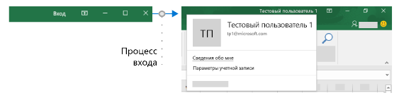
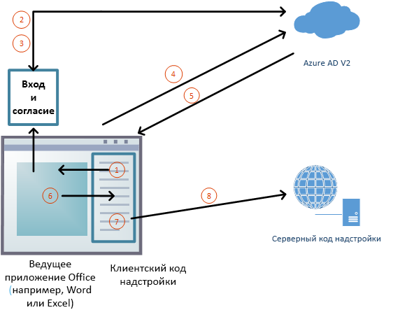

# <a name="enable-single-sign-on-for-office-add-ins"></a>Включение единого входа для надстроек Office

Пользователи входят в Office (в Интернете, на мобильных устройствах и настольных компьютерах), используя личную учетную запись Майкрософт либо учетную запись Microsoft 365 для образования или рабочую учетную запись. Вы можете использовать единый вход для авторизации пользователя в надстройке (при этом пользователю не потребуется входить повторно).



## <a name="requirements-and-best-practices"></a>Рекомендации и требования

Если вы работаете с надстройкой **Outlook**, обязательно включите современную проверку подлинности для клиента Microsoft 365. Сведения о том, как это сделать, см. в статье [Exchange Online: как включить в клиенте современную проверку подлинности](https://social.technet.microsoft.com/wiki/contents/articles/32711.exchange-online-how-to-enable-your-tenant-for-modern-authentication.aspx).

Вам *не* следует опираться на функцию единого в качестве единого способа проверки подлинности вашей надстройки. Вам следует внедрить альтернативную систему проверки подлинности, на которую ваша надстройка может опираться при определенных ошибках. Вы можете использовать систему таблиц пользователя и проверки подлинности, либо вы можете выделить одну из систем входа с использованием социальных сервисов. Дополнительные сведения о том, как это сделать с помощью надстройки Office см. в статье [Авторизация внешних служб в надстройке Office](auth-external-add-ins.md). Для *Outlook* существует рекомендуемая система возврата. Дополнительные сведения см. в статье [Сценарий: реализация единого входа для службы в надстройке Outlook](../outlook/implement-sso-in-outlook-add-in.md). Примеры использования Azure Active Directory в качестве системы возврата см. в статьях [Единый вход с использованием NodeJS для надстройки Office](https://github.com/OfficeDev/Office-Add-in-samples/tree/main/Samples/auth/Office-Add-in-NodeJS-SSO) и [Единый вход с использованием ASP.NET для надстройки Office](https://github.com/OfficeDev/Office-Add-in-samples/tree/main/Samples/auth/Office-Add-in-ASPNET-SSO).

## <a name="how-sso-works-at-runtime"></a>Принцип работы единого входа во время выполнения

На приведенной ниже схеме показано, как работает единый вход.



1. Код JavaScript надстройки вызывает новый API Office.js — [getAccessToken](/javascript/api/office-runtime/officeruntime.auth#getAccessToken_options_). Он указывает клиентскому приложению Office, что необходимо получить маркер доступа к надстройке. См. [Пример маркера доступа](#example-access-token).
2. Если вход в Office не выполнен, в клиентском приложении открывается всплывающее окно, в котором пользователю предлагается войти.
3. Если пользователь запускает надстройку в первый раз, ему предлагается дать согласие.
4. Клиентское приложение Office запрашивает **маркер надстройки** у конечной точки Azure AD версии 2.0 для текущего пользователя.
5. Azure AD отправляет маркер надстройки клиентскому приложению Office.
6. Клиентское приложение Office отправляет **маркер** надстройке в составе объекта результата, возвращенного при вызове метода `getAccessToken`.
7. JavaScript в надстройке может проанализировать маркер и извлечь данные, которые необходимы, например адрес электронной почты.
8. Кроме того, надстройка может отправить HTTP-запрос на серверную часть для получения дополнительных данных о пользователе, например, настройки пользователя. Кроме того маркер доступа сам может быть отправлен на серверную часть для анализа и проверки.

## <a name="develop-an-sso-add-in"></a>Разработка надстройки с единым входом

В этом разделе описаны задачи, необходимые для создания надстройки Office с единым входом. Эти задачи описываются независимо от языка и платформы. Подробные пошаговые инструкции см. в следующих статьях:

- [Создание надстройки Office на платформе Node.js с использованием единого входа](create-sso-office-add-ins-nodejs.md)
- [Создание надстройки Office на платформе ASP.NET с использованием единого входа](create-sso-office-add-ins-aspnet.md)

> [!NOTE]
> Вы можете использовать генератор Yeoman для создания надстройки Office на платформе Node.js с использованием единого входа. Генератор Yeoman упрощает процесс создания надстройки с использованием единого входа, автоматизируя действия, необходимые для настройки единого входа в Azure, и создавая код, необходимый для его использования в надстройке. Дополнительные сведения см. в статье [Краткое руководство по использованию единого входа (SSO)](../quickstarts/sso-quickstart.md).

### <a name="create-the-service-application"></a>Создание приложения-службы

Зарегистрируйте надстройку на портале регистрации для конечной точки Azure версии 2.0. Этот процесс занимает 5–10 минут и включает следующие задачи.

- Получение идентификатора и секрета клиента для надстройки;
- Указание необходимых надстройке разрешений для конечной точки AAD в. 2.0 (и Microsoft Graph в качестве опции). Разрешения "профиль" и "openid" требуются во всех случаях.
- Предоставление надстройке доверия клиентского приложения Office;
- Предварительная авторизация клиентского приложения Office для надстройки с помощью заданного по умолчанию разрешения *access_as_user*.

Дополнительные сведения о данном процессе см. в статье [Регистрация надстройки Office, использующей единый вход с конечной точкой Microsoft Azure AD версии 2.0](register-sso-add-in-aad-v2.md).

### <a name="configure-the-add-in"></a>Конфигурация надстройки

Добавьте новую разметку в манифест надстройки:

- **WebApplicationInfo** — родительский элемент для указанных ниже элементов.
- **Id** - Идентификатор клиента надстройки. Это идентификатор приложения, который вы получаете в процессе регистрации надстройки. См. [Регистрация надстройки Office, использующей единый вход с конечной точкой Microsoft Azure AD версии 2.0](register-sso-add-in-aad-v2.md).
- **Resource** — URL-адрес надстройки; Это тот же URI (включая протокол `api:`), который вы использовали при регистрации надстройки и в AAD. Доменная часть данного URI должна соответствовать домену, в том числе поддомену, используемом в URL-адресах в части`<Resources>` манифеста настройки. URI должен заканчиваться идентификатором клиента в `<Id>`.
- **Scopes** — родительский элемент одного или нескольких элементов **Scope**;
- **Scope** — указывает разрешение, необходимое надстройке для работы с AAD. Разрешения `profile` и `openID` требуются во всех случаях и они могут быть единственными необходимыми разрешениями, если ваша надстройка не имеет доступа к Microsoft Graph. В противном случае вам также могут потребоваться элементы типа **Область** для необходимым разрешений Microsoft Graph; например, `User.Read`, `Mail.Read`. Библиотеки, которые вы используете в коде, чтобы получить доступ к Microsoft Graph, могут потребовать дополнительные разрешения. Например, библиотека проверки подлинности Microsoft (MSAL) для .NET требует разрешения `offline_access`. Дополнительные сведения см. в статье [Авторизация в Microsoft Graph для надстройки Office](authorize-to-microsoft-graph.md).

Для всех клиентских приложений, кроме Outlook, добавьте разметку в конец раздела `<VersionOverrides ... xsi:type="VersionOverridesV1_0">`. Для Outlook добавьте разметку в конец раздела `<VersionOverrides ... xsi:type="VersionOverridesV1_1">`.

Ниже приведен пример разметки.

```xml
<WebApplicationInfo>
    <Id>5661fed9-f33d-4e95-b6cf-624a34a2f51d</Id>
    <Resource>api://addin.contoso.com/5661fed9-f33d-4e95-b6cf-624a34a2f51d</Resource>
    <Scopes>
        <Scope>openid</Scope>
        <Scope>user.read</Scope>
        <Scope>files.read</Scope>
        <Scope>profile</Scope>
    </Scopes>
</WebApplicationInfo>
```

> [!NOTE]
> Несоблюдение требований формата в манифесте для единого входа приведет к тому, что ваша надстройка будет убрана из AppSource до тех пор, пока она не будет соответствовать требуемому формату.

### <a name="add-client-side-code"></a>Добавьте код для клиента

Добавьте в надстройку код JavaScript для:

- Вызова [getAccessToken](/javascript/api/office-runtime/officeruntime.auth#getAccessToken_options_).

- Анализа маркера доступа или передачи его в код надстройки на стороне сервера.

Вот простой пример вызова для `getAccessToken`.

> [!NOTE]
> В этом примере обрабатывается только один тип ошибки явным образом. Примеры более сложной обработки ошибок см. в статьях [Единый вход с использованием NodeJS для надстройки Office](https://github.com/OfficeDev/Office-Add-in-samples/tree/main/Samples/auth/Office-Add-in-NodeJS-SSO) и [Единый вход с использованием ASP.NET для надстройки Office](https://github.com/OfficeDev/Office-Add-in-samples/tree/main/Samples/auth/Office-Add-in-ASPNET-SSO).

```js
async function getGraphData() {
    try {
        let bootstrapToken = await OfficeRuntime.auth.getAccessToken();

        // The /api/DoSomething controller will make the token exchange and use the
        // access token it gets back to make the call to MS Graph.
        getData("/api/DoSomething", bootstrapToken);
    }
    catch (exception) {
        if (exception.code === 13003) {
            // SSO is not supported for domain user accounts, only
            // Microsoft 365 Education or work account, or a Microsoft account.
        } else {
            // Handle error
        }
    }
}
```

Вот простой пример передачи маркера надстройки стороне сервера. Маркер включается в виде заголовка `Authorization` при отправке запроса назад стороне сервера. В этом примере представлена отправка данных JSON, поэтому в нем используется метод `POST`, но `GET` достаточно для отправки маркера доступа, когда запись не осуществляется на сервере.

```js
$.ajax({
    type: "POST",
    url: "/api/DoSomething",
    headers: {
        "Authorization": "Bearer " + bootstrapToken
    },
    data: { /* some JSON payload */ },
    contentType: "application/json; charset=utf-8"
}).done(function (data) {
    // Handle success
}).fail(function (error) {
    // Handle error
}).always(function () {
    // Cleanup
});
```

#### <a name="when-to-call-the-method"></a>Когда вызывать метод

Если надстройка не может работать, когда ни один пользователь не выполнил вход в Office, необходимо вызывать метод `getAccessToken` *при запуске надстройки* и передать `allowSignInPrompt: true` в параметр `options` метода `getAccessToken`. Например: `OfficeRuntime.auth.getAccessToken( { allowSignInPrompt: true });`

Если ряд функций надстройки может работать без входа пользователя в систему, вы вызываете `getAccessToken` *, когда пользователь выполняет действие, для которого необходимо выполнить вход*. Производительность не снижается при повторяющихся вызовах `getAccessToken`, так как Office кэширует маркер начальной загрузки и использует его, пока не истечет срок его действия, не вызывая конечную точку AAD версии 2.0 при каждом вызове `getAccessToken`. Поэтому вызовы `getAccessToken` можно добавлять во все функции и обработчики, которые инициируют действие, где нужен маркер.

### <a name="add-server-side-code"></a>Добавление серверного кода

В большинстве случаев практически нет смысла получать маркер доступа, если надстройка не передает его на сторону сервера и не использует его там. Некоторые задачи на стороне сервера, которые может выполнять ваша надстройка:

- Создание одного или нескольких методов Web API, которые используют сведения о пользователе, извлеченные из маркера, например, метод, который выполняет поиск параметров пользователя в вашей базе данных. (См. **Использование маркера единого входа в качестве удостоверения** ниже) В зависимости от языка и платформы, могут быть доступны библиотеки, который упростят создание нужного кода.
- Получение данных Microsoft Graph. Ваш серверный код должен выполнять следующее:

  - Запуск потока "от имени" пути вызова конечной точки Azure AD версии 2.0, включающего маркер доступа, некоторые метаданные пользователя и учетные данные надстройки (идентификатор и секрет). В этом контексте маркер доступа вызывается маркером начальной загрузки.
  - Получение данных из Microsoft Graph с помощью нового маркера.
  - Перед запуском потока можно проверить маркер доступа (см. раздел **Проверка маркера доступа** ниже).
  - После завершения потока "от имени" можно кэшировать новый маркер доступа, полученный из этого потока, чтобы использовать его повторно в других вызовах к Microsoft Graph до истечения его срока действия.

 Дополнительные сведения о получении авторизованного доступа к данным Microsoft Graph пользователя см. в статье [Авторизация в Microsoft Graph для надстройки Office](authorize-to-microsoft-graph.md).

#### <a name="validate-the-access-token"></a>Проверка маркера доступа

Когда веб-API получит маркер доступа, этот маркер можно проверить перед использованием. Это маркер JSON Web Token (JWT), то есть его проверка выполняется так же, как и в большинстве стандартных потоков OAuth. Доступно множество библиотек, которые могут выполнять проверку JWT, основные их действия:

- проверяют правильность формата маркера;
- проверяют, выдан ли маркер нужным центром сертификации;
- проверяют, предназначен ли маркер для веб-API.

При проверке маркера учитывайте приведенные ниже рекомендации.

- Действительные маркеры единого входа выдает центр сертификации Azure, `https://login.microsoftonline.com`. Утверждение `iss` в маркере должно начинаться с этого значения.
- Параметру `aud` маркера будет присвоено значение идентификатора приложения с портала регистрации.
- Для параметра `scp` маркера будет задано значение `access_as_user`.

#### <a name="using-the-sso-token-as-an-identity"></a>Использование маркера единого входа в качестве удостоверения

Если приложению необходимо проверить удостоверение пользователя, то маркер единого входа содержит сведения, с помощью которых можно определить его. Ниже перечислены утверждения из маркера, связанные с удостоверениями.

- `name` — Отображаемое имя пользователя.
- `preferred_username` — Электронный адрес пользователя.
- `oid` — GUID, предоставляющий ИД пользователя в Azure Active Directory.
- `tid` — GUID, предоставляющий ИД организации пользователя в Azure Active Directory.

Значения `name` и `preferred_username` могут меняться, мы рекомендуем использовать значения `oid` и `tid`, чтобы связать удостоверение с внутренней службой авторизации.

Например, если служба может форматировать эти значения вместе (в виде `{oid-value}@{tid-value}`), то их следует хранить в качестве значения в записи пользователя во внутренней базе данных пользователей. При последующих запросах удостоверение пользователя можно будет получать с помощью того же значения, а доступ к определенным ресурсам может предоставляться в соответствии с действующими механизмами управления доступом.

### <a name="example-access-token"></a>Пример маркера доступа

Ниже приведен типичная раскодированная нагрузка маркера доступа. Сведения о свойствах см. в статье [Справочные материалы для маркеров в Azure Active Directory 2.0](/azure/active-directory/develop/active-directory-v2-tokens).

```js
{
    aud: "2c3caa80-93f9-425e-8b85-0745f50c0d24",
    iss: "https://login.microsoftonline.com/fec4f964-8bc9-4fac-b972-1c1da35adbcd/v2.0",
    iat: 1521143967,
    nbf: 1521143967,
    exp: 1521147867,
    aio: "ATQAy/8GAAAA0agfnU4DTJUlEqGLisMtBk5q6z+6DB+sgiRjB/Ni73q83y0B86yBHU/WFJnlMQJ8",
    azp: "e4590ed6-62b3-5102-beff-bad2292ab01c",
    azpacr: "0",
    e_exp: 262800,
    name: "Mila Nikolova",
    oid: "6467882c-fdfd-4354-a1ed-4e13f064be25",
    preferred_username: "milan@contoso.com",
    scp: "access_as_user",
    sub: "XkjgWjdmaZ-_xDmhgN1BMP2vL2YOfeVxfPT_o8GRWaw",
    tid: "fec4f964-8bc9-4fac-b972-1c1da35adbcd",
    uti: "MICAQyhrH02ov54bCtIDAA",
    ver: "2.0"
}
```

## <a name="using-sso-with-an-outlook-add-in"></a>С использованием единого входа с надстройкой Outlook

Существует ряд небольшие, но важных различий при использовании единого входа в надстройке Outlook и его использования в надстройках Excel, PowerPoint или Word. Обязательно ознакомьтесь с содержанием статей [Выполнение проверки подлинности пользователя с маркером единого входа в надстройке Outlook](../outlook/authenticate-a-user-with-an-sso-token.md) и [Сценарий: Реализация единого входа для вашей службы в надстройке Outlook](../outlook/implement-sso-in-outlook-add-in.md).

## <a name="sso-api-reference"></a>Справочные материалы по API единого входа

### <a name="getaccesstoken"></a>getAccessToken

В пространстве имен OfficeRuntime [Auth](/javascript/api/office-runtime/officeruntime.auth) (`OfficeRuntime.Auth`) имеется метод `getAccessToken`, позволяющий приложению Office получать маркер доступа для веб-приложения надстройки. Косвенно это также дает возможность надстройке получать доступ к данным Microsoft Graph пользователя, вошедшего в систему, не требуя от пользователя еще раз выполнить вход в систему.

```typescript
getAccessToken(options?: AuthOptions: (result: AsyncResult<string>) => void): void;
```

Метод вызывает конечную точку Azure Active Directory версии 2.0, чтобы получить маркер доступа к вашей надстройке в веб-приложении. Это позволяет надстройкам идентифицировать пользователей. Код на стороне сервера может использовать этот маркер для доступа к Microsoft Graph, чтобы добавить веб-приложение надстройки с помощью [потока OAuth "от имени пользователя"](/azure/active-directory/develop/active-directory-v2-protocols-oauth-on-behalf-of).

> [!NOTE]
> В Outlook эта API не поддерживается, если надстройка загружается в почтовый ящик Outlook.com или Gmail.

|Hosts|Excel, Outlook, PowerPoint, Word|
|---|---|
|[Наборы требований](specify-office-hosts-and-api-requirements.md)|[IdentityAPI](../reference/requirement-sets/identity-api-requirement-sets.md)|

#### <a name="parameters"></a>Параметры

`options` - Опционально. Принимает объект [AuthOptions](/javascript/api/office-runtime/officeruntime.authoptions) (см. ниже) для определения поведения при входе.

`callback` - Опционально. Принимает метод обратного вызова, который может выполнить анализ маркера для идентификатора пользователя или использовать маркер в потоке «от имени ваших», чтобы получать доступ к Microsoft Graph. Если [AsyncResult](/javascript/api/office/office.asyncresult) `.status` был выполнен «успешно», тогда `AsyncResult.value` представляет собой необработанный маркер доступа AAD версии 2.0.

Интерфейс [AuthOptions](/javascript/api/office-runtime/officeruntime.authoptions) предоставляет опции для взаимодействия с пользователем, когда Office получает маркер доступа для надстройки из AAD версии 2.0 с методом `getAccessToken`.
