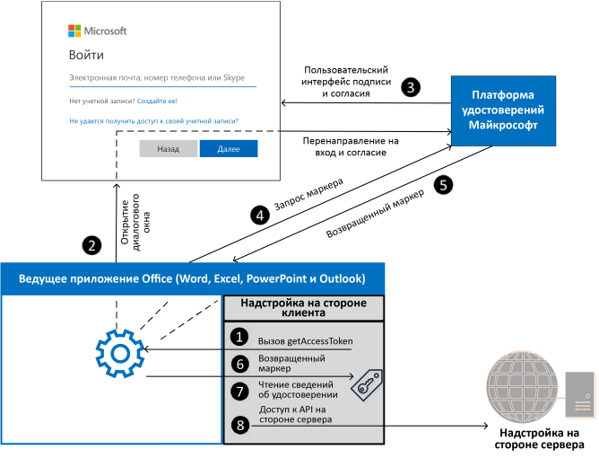

# <a name="enable-single-sign-on-sso-in-an-office-add-in"></a>Включение единого вход (SSO) в надстройке Office

Пользователи входят в Office (в Интернете, на мобильных устройствах и настольных компьютерах), используя личную учетную запись Майкрософт либо учетную запись Microsoft 365 для образования или рабочую учетную запись. Воспользуйтесь этим и используйте единый вход для авторизации пользователя в надстройке (при этом пользователю не потребуется входить повторно).


## <a name="how-sso-works-at-runtime"></a>Принцип работы единого входа во время выполнения

На приведенной ниже схеме показано, как работает единый вход. Синие элементы представляют Office или платформу удостоверений Майкрософт. Серые элементы представляют код, который вы пишете, и включают клиентский код (область задач) и серверный код надстройки.



1. Код JavaScript надстройки вызывает Office.js API [getAccessToken](/javascript/api/office-runtime/officeruntime.auth#office-runtime-officeruntime-auth-getaccesstoken-member(1)). Если пользователь уже вошел в Office, ведущее приложение Office возвращает маркер доступа с утверждениями пользователя, вошедшего в систему.
2. Если пользователь не вошел в систему, ведущее приложение Office открывает диалоговое окно для входа пользователя. Office перенаправляет на платформу удостоверений Майкрософт для завершения процесса входа.
3. Если текущий пользователь использует надстройку впервые, ему будет предложено дать согласие.
4. Ведущее приложение Office запрашивает **маркер доступа** с платформы удостоверений Майкрософт для текущего пользователя.
5. Платформа удостоверений Майкрософт возвращает маркер доступа в Office. Office поместит в кэш маркер от вашего имени, чтобы дальнейшие вызовы **getAccessToken** просто возвращали кэшированный маркер.
6. Ведущее приложение Office возвращает **маркер доступа** в надстройку как часть объекта результатов, возвращаемого вызовом `getAccessToken`.
7. Токен является и **токеном доступа**, и **токеном удостоверения**. Его можно использовать в качестве маркера удостоверений для анализа и проверки утверждений о пользователе, таких как имя пользователя и адрес электронной почты.
8. Кроме того, надстройка может использовать маркер в качестве **маркера доступа** для выполнения HTTPS-запросов с проверкой подлинности к API на стороне сервера. Так как маркер доступа содержит утверждения удостоверений, сервер может хранить сведения, связанные с удостоверением пользователя; например, предпочтения пользователя.

## <a name="requirements-and-best-practices"></a>Рекомендации и требования

### <a name="dont-cache-the-access-token"></a>Не помещать в кэш маркер доступа

Никогда не помещать в кэш и не хранить маркер доступа в клиентском коде. Если нужен маркер доступа, всегда вызывайте [getAccessToken](/javascript/api/office-runtime/officeruntime.auth#office-runtime-officeruntime-auth-getaccesstoken-member(1)). Office поместит в кэш маркер доступа (или запросит новый, если срок его действия истек.). Это поможет избежать случайной утечки маркера из надстройки.

### <a name="enable-modern-authentication-for-outlook"></a>Включение современной проверки подлинности для Outlook

Если вы работаете с надстройкой **Outlook**, обязательно включите современную проверку подлинности для клиента Microsoft 365. Сведения о том, как это сделать, см. в статье [Exchange Online: как включить в клиенте современную проверку подлинности](https://social.technet.microsoft.com/wiki/contents/articles/32711.exchange-online-how-to-enable-your-tenant-for-modern-authentication.aspx).

### <a name="implement-a-fallback-authentication-system"></a>Реализация резервной системы проверки подлинности

Вам *не* следует опираться на функцию единого в качестве единого способа проверки подлинности вашей надстройки. Вам следует внедрить альтернативную систему проверки подлинности, на которую ваша надстройка может опираться при определенных ошибках. Например, если надстройка загружена на более старую версию Office, которая не поддерживает единый вход, вызов `getAccessToken` завершится ошибкой.

Для надстроек Excel, Word и PowerPoint обычно необходимо вернуться к использованию платформы удостоверений Майкрософт. Дополнительные сведения см. в разделе [Проверка подлинности с помощью платформы удостоверений Майкрософт](overview-authn-authz.md#authenticate-with-the-microsoft-identity-platform).

Для надстроек Outlook существует рекомендуемая резервная система. Дополнительные сведения см. в статье [Сценарий: реализация единого входа для службы в надстройке Outlook](../outlook/implement-sso-in-outlook-add-in.md).

Кроме того, можно использовать систему пользовательских таблиц и проверки подлинности или использовать одного из поставщиков входа социальных сетей. Дополнительные сведения о том, как это сделать с помощью надстройки Office см. в статье [Авторизация внешних служб в надстройке Office](auth-external-add-ins.md).

Примеры кода, использующие платформу удостоверений Майкрософт в качестве резервной системы, см. в разделах [Единый вход NodeJS надстройки Office](https://github.com/OfficeDev/PnP-OfficeAddins/tree/main/Samples/auth/Office-Add-in-NodeJS-SSO) и [Единый вход ASP.NET надстройки Office](https://github.com/OfficeDev/PnP-OfficeAddins/tree/main/Samples/auth/Office-Add-in-ASPNET-SSO).

## <a name="develop-an-sso-add-in"></a>Разработка надстройки с единым входом

В этом разделе описаны задачи, необходимые для создания надстройки Office с единым входом. Эти задачи описаны здесь независимо от языка или инфраструктуры. Пошаговые инструкции см. в разделах:

- [Создание надстройки Office на платформе Node.js с использованием единого входа](create-sso-office-add-ins-nodejs.md)
- [Создание надстройки Office на платформе ASP.NET с использованием единого входа](create-sso-office-add-ins-aspnet.md)

> [!NOTE]
> Вы можете использовать генератор Yeoman для создания надстройки Office на платформе Node.js с использованием единого входа. Генератор Yeoman упрощает процесс создания надстройки с использованием единого входа, автоматизируя действия, необходимые для настройки единого входа в Azure, и создавая код, необходимый для его использования в надстройке. Дополнительные сведения см. в статье [Краткое руководство по использованию единого входа (SSO)](../quickstarts/sso-quickstart.md).

### <a name="register-your-add-in-with-the-microsoft-identity-platform"></a>Регистрация надстройки на платформе удостоверений Майкрософт

Для работы с единым входом необходимо зарегистрировать надстройку на платформе удостоверений Майкрософт. Это позволит платформе удостоверений Майкрософт предоставлять службы проверки подлинности и авторизации для надстройки. Создание регистрации приложения включает следующие задачи.

- Получить идентификатор приложения (клиента) для идентификации надстройки на платформе удостоверений Майкрософт.
- Создать секрет клиента, который будет действовать в качестве пароля для надстройки при запросе маркера.
- Указать разрешения, требующиеся для надстройки. Всегда требуются разрешения "профиль" и "openid" Microsoft Graph. В зависимости от задач надстройки могут потребоваться дополнительные разрешения.
- Предоставить приложениям Office доверие к надстройке.
- Предварительно авторизовать приложения Office в надстройке с областью по умолчанию *access_as_user*.

Дополнительные сведения об этом процессе см. в разделе [Регистрация надстройки Office, использующей единый вход, на платформе удостоверений Майкрософт](register-sso-add-in-aad-v2.md).

### <a name="configure-the-add-in"></a>Конфигурация надстройки

Добавьте новую разметку в манифест надстройки:

- **WebApplicationInfo** — родительский элемент для указанных ниже элементов.
- **Идентификатор**. Идентификатор приложения (клиента), полученный при регистрации надстройки на платформе удостоверений Майкрософт. Дополнительные сведения см. в разделе [Регистрация надстройки Office, использующей единый вход, на платформе удостоверений Майкрософт](register-sso-add-in-aad-v2.md).
- **Ресурс**. Это универсальный код ресурса (URI) надстройки. Это тот же универсальный код ресурса (URI) (включая протокол `api:`), использованный при регистрации надстройки на платформе удостоверений Майкрософт. Доменная часть этого универсального кода ресурса (URI) должна соответствовать домену, в том числе всем поддоменам, используемым в URL-адресах в разделе `<Resources>` манифеста надстройки, а универсальный код ресурса (URI) должен заканчиваться идентификатором клиента, указанным в элементе `<Id>`.
- **Scopes** — родительский элемент одного или нескольких элементов **Scope**;
- **Scope** — указывает разрешение, необходимое надстройке. Разрешения `profile` и `openID` всегда необходимы и могут быть единственными необходимыми разрешениями. Если надстройке требуется доступ к Microsoft Graph или другим ресурсам Microsoft 365, вам потребуются дополнительные элементы **Scope**. Например, для разрешений Microsoft Graph можно запросить области `User.Read` и `Mail.Read`. Библиотеки, которые вы используете в коде, чтобы получить доступ к Microsoft Graph, могут потребовать дополнительные разрешения. Дополнительные сведения см. в статье [Авторизация в Microsoft Graph для надстройки Office](authorize-to-microsoft-graph.md).

Для надстроек Word, Excel и PowerPoint добавьте исправления в конец раздела `<VersionOverrides ... xsi:type="VersionOverridesV1_0">`. Для надстройки Outlook добавьте исправления в конец раздела `<VersionOverrides ... xsi:type="VersionOverridesV1_1">`.

Ниже приведен пример разметки.

```xml
<WebApplicationInfo>
    <Id>5661fed9-f33d-4e95-b6cf-624a34a2f51d</Id>
    <Resource>api://addin.contoso.com/5661fed9-f33d-4e95-b6cf-624a34a2f51d</Resource>
    <Scopes>
        <Scope>openid</Scope>
        <Scope>user.read</Scope>
        <Scope>files.read</Scope>
        <Scope>profile</Scope>
    </Scopes>
</WebApplicationInfo>
```

> [!NOTE]
> Несоблюдение требований к формату в манифесте для единого входа приведет к удалению надстройки из AppSource до тех пор, пока она не будет соответствовать требуемому формату.

### <a name="include-the-identity-api-requirement-set"></a>Включение набора обязательных элементов API удостоверений

Для использования единого входа надстройке требуется набор обязательных элементов API удостоверений 1.3. Дополнительные сведения см. в разделе [IdentityAPI](/javascript/api/requirement-sets/common/identity-api-requirement-sets).

### <a name="add-client-side-code"></a>Добавьте код для клиента

Добавьте в надстройку код JavaScript для:

- Вызова [getAccessToken](/javascript/api/office-runtime/officeruntime.auth#office-runtime-officeruntime-auth-getaccesstoken-member(1)).
- Анализа маркера доступа или передачи его в код надстройки на стороне сервера.

В следующем коде показан простой пример `getAccessToken` вызова и анализа маркера для имени пользователя и других учетных данных.

> [!NOTE]
> В этом примере обрабатывается только один тип ошибки явным образом. Примеры более сложной обработки ошибок см. в статьях [Единый вход с использованием NodeJS для надстройки Office](https://github.com/OfficeDev/Office-Add-in-samples/tree/main/Samples/auth/Office-Add-in-NodeJS-SSO) и [Единый вход с использованием ASP.NET для надстройки Office](https://github.com/OfficeDev/Office-Add-in-samples/tree/main/Samples/auth/Office-Add-in-ASPNET-SSO).

```js
async function getUserData() {
    try {
        let userTokenEncoded = await OfficeRuntime.auth.getAccessToken();
        let userToken = jwt_decode(userTokenEncoded); // Using the https://www.npmjs.com/package/jwt-decode library.
        console.log(userToken.name); // user name
        console.log(userToken.preferred_username); // email
        console.log(userToken.oid); // user id     
    }
    catch (exception) {
        if (exception.code === 13003) {
            // SSO is not supported for domain user accounts, only
            // Microsoft 365 Education or work account, or a Microsoft account.
        } else {
            // Handle error
        }
    }
}
```


#### <a name="when-to-call-getaccesstoken"></a>Когда вызывать getAccessToken

Если надстройке требуется пользователь, выполнивший вход, необходимо выполнить вызов `getAccessToken`изнутри `Office.initialize`. Вы также должны пройти `allowSignInPrompt: true` в параметре `options` `getAccessToken`. Например; `OfficeRuntime.auth.getAccessToken( { allowSignInPrompt: true });` Это гарантирует, что если пользователь еще не вошел в систему, Office предложит пользователю войти в систему сейчас через пользовательский интерфейс.

Если надстройка обладает некоторыми функциями, для которых не требуется пользователь, вошедший в систему, можно выполнить вызов `getAccessToken` *когда пользователь выполняет действие, для которого требуется вошедший в систему пользователь*. Производительность не снижается при повторяющихся вызовах `getAccessToken`, так как Office помещает в кэш маркер доступа и использует его, пока не истечет срок его действия, не вызывая [платформу удостоверений Майкрософт](/azure/active-directory/develop/) при каждом `getAccessToken`вызове. Поэтому вызовы `getAccessToken` можно добавлять во все функции и обработчики, которые инициируют действие, где нужен маркер.

> [!IMPORTANT]
> Рекомендация по безопасности: вызывайте `getAccessToken` тогда, когда вам нужен маркер доступа. Office поместит его в кэш для вас. Не помещайте в кэш и не храните маркер доступа с помощью собственного кода.

### <a name="pass-the-access-token-to-server-side-code"></a>Передача маркера доступа серверному коду

Чтобы получить доступ к веб-API на сервере или дополнительным службам, таким как Microsoft Graph, необходимо передать маркер доступа в серверный код. Маркер доступа предоставляет доступ (для пользователя, прошедшего проверку подлинности) к веб-API. Кроме того, серверный код может анализировать маркер на наличие сведений об удостоверении, если это необходимо. (См раздел **Использование маркера доступа в качестве маркера удостоверений** ниже.). Существует множество библиотек для разных языков и платформ, которые могут упростить написание кода. Дополнительные сведения см. в разделе [Обзор библиотеки проверки подлинности Майкрософт (MSAL)](/azure/active-directory/develop/msal-overview).

Если необходимо получить доступ к данным Microsoft Graph, серверный код должен выполнить следующие действия:

- Проверка маркера доступа (см. статью **Проверка маркер доступа** ниже).
- Инициирование [потока On-Behalf-Of OAuth 2.0](/azure/active-directory/develop/v2-oauth2-on-behalf-of-flow) с вызовом платформы удостоверений Майкрософт, которая включает маркер доступа, некоторые метаданные о пользователе и учетные данные надстройки (ее идентификатор и секрет). Платформа удостоверений Майкрософт вернет новый маркер доступа, который можно использовать для доступа к Microsoft Graph.
- Получение данных из Microsoft Graph с помощью нового маркера.
- Если необходимо поместить в кэш новый маркер доступа для нескольких вызовов, рекомендуется использовать [сериализацию кэша маркеров в MSAL.NET](/azure/active-directory/develop/msal-net-token-cache-serialization?tabs=aspnet).

> [!IMPORTANT]
> Рекомендация по системе безопасности: всегда используйте серверный код для выполнения вызовов Microsoft Graph или других вызовов, требующих передачи маркера доступа. Никогда не возвращайте маркер OBO клиенту, чтобы клиент мог выполнять прямые вызовы в Microsoft Graph. Это помогает защитить маркер от перехвата или утечки. Дополнительные сведения о правильном потоке протокола см. в разделе [Схема протокола OAuth 2.0](/azure/active-directory/develop/v2-oauth2-on-behalf-of-flow#protocol-diagram).

В следующем коде показан пример передачи маркера доступа на сервер. Маркер передается в `Authorization`заголовке при отправке запроса в серверный веб-API. В этом примере представлена отправка данных JSON, поэтому в нем используется метод `POST`, но `GET` достаточно для отправки маркера доступа, когда запись не осуществляется на сервере.

```js
$.ajax({
    type: "POST",
    url: "/api/DoSomething",
    headers: {
        "Authorization": "Bearer " + accessToken
    },
    data: { /* some JSON payload */ },
    contentType: "application/json; charset=utf-8"
}).done(function (data) {
    // Handle success
}).fail(function (error) {
    // Handle error
}).always(function () {
    // Cleanup
});
```

Дополнительные сведения о получении авторизованного доступа к данным Microsoft Graph пользователя см. в статье [Авторизация в Microsoft Graph для надстройки Office](authorize-to-microsoft-graph.md).

#### <a name="validate-the-access-token"></a>Проверка маркера доступа

Веб-API на сервере должны проверять маркер доступа, если он отправлен от клиента. Это маркер JSON Web Token (JWT), то есть его проверка выполняется так же, как и в большинстве стандартных потоков OAuth. Доступно множество библиотек, которые могут выполнять проверку JWT, основные их действия:

- проверяют правильность формата маркера;
- проверяют, выдан ли маркер нужным центром сертификации;
- проверяют, предназначен ли маркер для веб-API.

При проверке маркера учитывайте приведенные ниже рекомендации.

- Действительные маркеры единого входа выдает центр сертификации Azure, `https://login.microsoftonline.com`. Утверждение `iss` в маркере должно начинаться с этого значения.
- Параметру `aud` маркера будет присвоено значение идентификатора приложения с портала регистрации приложения Azure надстройки.
- Для параметра `scp` маркера будет задано значение `access_as_user`.

Дополнительные сведения о проверке маркеров см. в разделе [Маркеры доступа платформы удостоверений Майкрософт](/azure/active-directory/develop/access-tokens#validating-tokens).

#### <a name="use-the-access-token-as-an-identity-token"></a>Использование маркера доступа в качестве маркера удостоверений

Если вашей надстройке необходимо проверить удостоверение пользователя, маркер доступа, возвращенный из `getAccessToken()`, содержит сведения, которые можно использовать для установления личности. Следующие утверждения в токене относятся к удостоверению.

- `name` — Отображаемое имя пользователя.
- `preferred_username` — Электронный адрес пользователя.
- `oid` — GUID, представляющий идентификатор пользователя в системе удостоверений Майкрософт.
- `tid` — GUID, представляющий клиента, в который вошел пользователь.

Дополнительные сведения об этих и других утверждениях см. в разделе [Маркеры удостоверений платформы удостоверений Майкрософт](/azure/active-directory/develop/id-tokens). Если необходимо создать уникальный идентификатор для представления пользователя в системе, см. дополнительные сведения в разделе [Использование утверждений для надежной идентификации пользователя](/azure/active-directory/develop/id-tokens#using-claims-to-reliably-identify-a-user-subject-and-object-id).

### <a name="example-access-token"></a>Пример маркера доступа

Ниже приведен типичная раскодированная нагрузка маркера доступа. Сведения о свойствах см. в разделе [Маркеры доступа платформы удостоверений Майкрософт](/azure/active-directory/develop/active-directory-v2-tokens).

```js
{
    aud: "2c3caa80-93f9-425e-8b85-0745f50c0d24",
    iss: "https://login.microsoftonline.com/fec4f964-8bc9-4fac-b972-1c1da35adbcd/v2.0",
    iat: 1521143967,
    nbf: 1521143967,
    exp: 1521147867,
    aio: "ATQAy/8GAAAA0agfnU4DTJUlEqGLisMtBk5q6z+6DB+sgiRjB/Ni73q83y0B86yBHU/WFJnlMQJ8",
    azp: "e4590ed6-62b3-5102-beff-bad2292ab01c",
    azpacr: "0",
    e_exp: 262800,
    name: "Mila Nikolova",
    oid: "6467882c-fdfd-4354-a1ed-4e13f064be25",
    preferred_username: "milan@contoso.com",
    scp: "access_as_user",
    sub: "XkjgWjdmaZ-_xDmhgN1BMP2vL2YOfeVxfPT_o8GRWaw",
    tid: "fec4f964-8bc9-4fac-b972-1c1da35adbcd",
    uti: "MICAQyhrH02ov54bCtIDAA",
    ver: "2.0"
}
```

## <a name="using-sso-with-an-outlook-add-in"></a>С использованием единого входа с надстройкой Outlook

Существует ряд небольшие, но важных различий при использовании единого входа в надстройке Outlook и его использования в надстройках Excel, PowerPoint или Word. Обязательно ознакомьтесь с содержанием статей [Выполнение проверки подлинности пользователя с маркером единого входа в надстройке Outlook](../outlook/authenticate-a-user-with-an-sso-token.md) и [Сценарий: Реализация единого входа для вашей службы в надстройке Outlook](../outlook/implement-sso-in-outlook-add-in.md).

## <a name="see-also"></a>См. также

- [Документация по платформе удостоверений Майкрософт](/azure/active-directory/develop/)
- [Наборы требований](specify-office-hosts-and-api-requirements.md)
- [IdentityAPI](/javascript/api/requirement-sets/common/identity-api-requirement-sets)