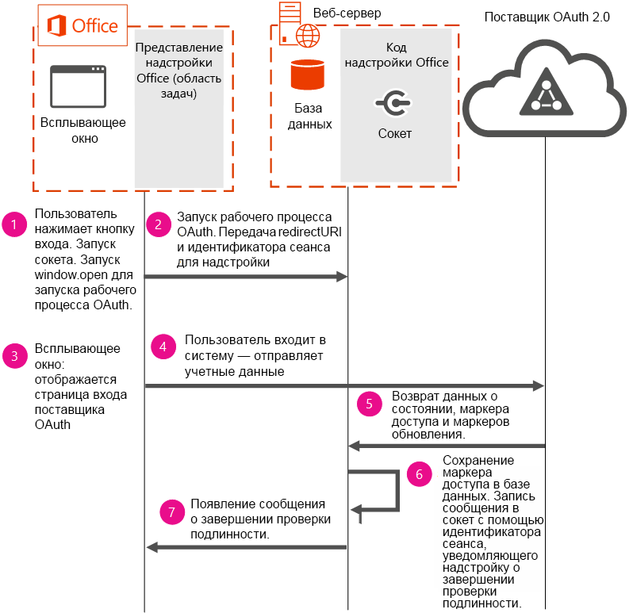

# <a name="use-the-oauth-authorization-framework-in-an-office-add-in"></a><span data-ttu-id="4218b-102">Использование платформы авторизации OAuth в надстройке Office</span><span class="sxs-lookup"><span data-stu-id="4218b-102">Use the OAuth authorization framework in an Office Add-in</span></span>

<span data-ttu-id="4218b-p101">OAuth — это открытый стандарт авторизации, который используется в Office 365, Facebook, Google, SalesForce, LinkedIn и других интернет-службах для проверки подлинности пользователей. Протокол авторизации OAuth используется по умолчанию в Azure и Office 365. Платформа авторизации OAuth используется как в корпоративных, так и частных решениях.</span><span class="sxs-lookup"><span data-stu-id="4218b-p101">OAuth is the open standard for authorization that online service providers such as Office 365, Facebook, Google, SalesForce, LinkedIn and others use to perform user authentication. The OAuth authorization framework is the default authorization protocol used in Azure and Office 365. The OAuth authorization framework is used in both enterprise (corporate) and consumer scenarios.</span></span>

<span data-ttu-id="4218b-106">Поставщики онлайновых услуг могут предоставлять общедоступные интерфейсы API с помощью REST.</span><span class="sxs-lookup"><span data-stu-id="4218b-106">Online service providers may provide public APIs exposed via REST.</span></span> <span data-ttu-id="4218b-107">Разработчики могут использовать эти общедоступные интерфейсы API в своих надстроек Office для чтения или записи данных для поставщика онлайновых услуг.</span><span class="sxs-lookup"><span data-stu-id="4218b-107">Developers can use these public APIs in their Office Add-ins to read or write data to the online service provider.</span></span> <span data-ttu-id="4218b-108">Интегрируя данные из онлайновых служб в надстройку, вы повышаете ее ценность и привлекаете больше пользователей.</span><span class="sxs-lookup"><span data-stu-id="4218b-108">Integrating data from online service providers in an add-in increases its value, which leads to greater user adoption.</span></span> <span data-ttu-id="4218b-109">При использовании этих API в надстройке требуется проверка подлинности с помощью платформы авторизации OAuth.</span><span class="sxs-lookup"><span data-stu-id="4218b-109">When using these APIs in your add-in, users will be required to authenticate using the OAuth authorization framework.</span></span>

<span data-ttu-id="4218b-p103">В этой статье рассказывается, как реализовать проверку подлинности в надстройке. Используемые в статье сегменты кода взяты из примера [Office-Add-in-NodeJS-ServerAuth](https://github.com/OfficeDev/Office-Add-in-NodeJS-ServerAuth).</span><span class="sxs-lookup"><span data-stu-id="4218b-p103">This topic describes how to implement an authentication flow in your add-in to perform user authentication. Code segments included in this topic are taken from the [Office-Add-in-NodeJS-ServerAuth](https://github.com/OfficeDev/Office-Add-in-NodeJS-ServerAuth) code sample.</span></span>

> [!NOTE]
> <span data-ttu-id="4218b-p104">Из соображений безопасности браузеры не могут отображать страницы входа в IFrame. В зависимости от версий Office, которые используют ваши клиенты, особенно веб-версий, надстройка может отображаться в IFrame. Поэтому существуют специальные рекомендации по управлению потоком проверки подлинности.</span><span class="sxs-lookup"><span data-stu-id="4218b-p104">For security reasons, browsers are not allowed to display sign-in pages in an IFrame. Depending on the version of Office that your customers use, most notably web-based versions, your add-in is displayed in an IFrame. This imposes some considerations on how to manage the authentication flow.</span></span> 

<span data-ttu-id="4218b-115">На следующей схеме показаны необходимые компоненты и поток событий, происходящих при реализации проверки подлинности в надстройке.</span><span class="sxs-lookup"><span data-stu-id="4218b-115">The following diagram shows the required components and the flow of events that occur when implementing authentication in your add-in.</span></span>



<span data-ttu-id="4218b-117">На схеме показано, как используются необходимые компоненты:</span><span class="sxs-lookup"><span data-stu-id="4218b-117">The diagram shows how the following required components are used:</span></span>


- <span data-ttu-id="4218b-p105">Office запускает надстройку области задач на компьютере пользователя. Надстройка открывает всплывающее окно для проверки подлинности. Надстройки не могут запускать проверку подлинности напрямую, так как, в зависимости от используемой платформы, они могут выполняться в IFRAME. Из соображений безопасности страницы входа OAuth не могут отображаться в IFRAME.</span><span class="sxs-lookup"><span data-stu-id="4218b-p105">Office runs a task pane add-in on the user's computer. Your add-in opens a pop-up window to start the authentication flow. Add-ins cannot start authentication flows directly because add-ins, depending on the platform used, may run in an IFRAME. For security reasons, OAuth sign-in pages can't be displayed in an IFRAME.</span></span> 
    
- <span data-ttu-id="4218b-p106">На веб-сервере размещается код надстройки. В этом примере кода для хранения маркера доступа пользователя используется сервер базы данных, запущенный на веб-сервере. Сохранение маркера доступа необходимо, чтобы после проверки подлинности с помощью всплывающего окна главные страницы надстройки могли использовать те же маркеры для доступа к данным интернет-службы. Сохранение маркеров на стороне сервера необходимо, так как сведения, передаваемые из надстройки или всплывающего окна, не надежны.</span><span class="sxs-lookup"><span data-stu-id="4218b-p106">A web server hosts your add-in's code. This code sample uses a database server running on the web server to store the user's access token. Persisting the access token is necessary so that after authentication completes using the pop-up window, the main add-in's pages can use the same tokens to access data from the online service. Saving the tokens by using server-side options is necessary because you can't rely on information passed from the add-in or the pop-up.</span></span>
    
- <span data-ttu-id="4218b-126">Поставщик OAuth 2.0 выполняет проверку подлинности пользователя.</span><span class="sxs-lookup"><span data-stu-id="4218b-126">The OAuth 2.0 provider performs user authentication.</span></span>
    

    
> [!IMPORTANT]
> <span data-ttu-id="4218b-p107">Маркеры доступа невозможно возвратить на панель задач, но их можно использовать на сервере. В этом примере кода маркеры доступа хранятся в базе данных в течение 2 минут. Через 2 минуты маркеры удаляются из базы данных, и пользователям предлагается повторить проверку подлинности. Прежде чем менять этот период времени в своей реализации, изучите риски для безопасности, связанные с хранением маркеров доступа в базе данных дольше 2 минут.</span><span class="sxs-lookup"><span data-stu-id="4218b-p107">Access tokens can't be returned to the task pane, but they can be used on the server. In this code sample, the access tokens are stored in the database for 2 minutes. After 2 minutes, tokens are purged from the database and users are prompted to re-authenticate. Before changing this time period in your own implementation, consider the security risks associated with storing access tokens in a database for a time period that is longer than 2 minutes.</span></span>


## <a name="step-1---start-socket-and-open-a-pop-up-window"></a><span data-ttu-id="4218b-131">Этап 1. Запуск сокета и открытие всплывающего окна</span><span class="sxs-lookup"><span data-stu-id="4218b-131">Step 1 - Start socket and open a pop-up window</span></span>

<span data-ttu-id="4218b-p108">После запуска кода из этого примера в Office отображается надстройка области задач. Когда пользователь выбирает поставщика OAuth для входа, надстройка прежде всего создает сокет. В этом примере применен сокет, чтобы обеспечить удобство работы с надстройкой для пользователя. С помощью сокета надстройка сообщает пользователю об успешной проверке подлинности или ошибке. С помощью сокета состояние проверки подлинности обновляется на главной странице надстройки без опроса пользователя или его вмешательства. В указанном ниже сегменте кода, взятом из файла routes/connect.js, показано, как запустить сокет. В имени сокета используется идентификатор сеанса надстройки **decodedNodeCookie**. В этом примере кода показано, как создать сокет с помощью [socket.io](http://socket.io/).</span><span class="sxs-lookup"><span data-stu-id="4218b-p108">When you run this code sample, a task pane add-in displays in Office. When the user chooses an OAuth provider to log into, the add-in first creates a socket. This sample uses a socket to provide a good user experience in the add-in. The add-in uses the socket to communicate the success or failure of the authentication to the user. By using a socket, the add-in's main page is easily updated with the authentication status, and doesn't require user interaction or polling. The following code segment, taken from routes/connect.js, shows how to start the socket. The socket is named using  **decodedNodeCookie**, which is the add-in's session ID. This code sample creates the socket by using [socket.io](http://socket.io/).</span></span>


```js
io.on('connection', function (socket) {
  console.log('Socket connection established');
  var jsonCookie =
    cookie.parse(socket
      .handshake
      .headers
      .cookie);
  var decodedNodeCookie =
    cookieParser
      .signedCookie(jsonCookie.nodecookie, '<Insert a random string>');
  console.log('Decoded cookie: ' + decodedNodeCookie);
  // The session ID becomes the room name for this session.
  socket.join(decodedNodeCookie);
  io.to(decodedNodeCookie).emit('init', 'Private socket session established');
});

```

<span data-ttu-id="4218b-p109">Затем надстройка подключается к сокету. Следующий код можно найти в файле /public/javascripts/client.js.</span><span class="sxs-lookup"><span data-stu-id="4218b-p109">Next, the add-in connects to the socket. The following code can be found in /public/javascripts/client.js.</span></span>


```js
var socket = io.connect('https://localhost:3001', { secure: true });
```

<span data-ttu-id="4218b-p110">Затем надстройка открывает всплывающее окно на компьютере пользователя с помощью команды **window.open**. При запуске команды **window.open** убедитесь, что в URL-адресе передаются универсальный код ресурса (URI) перенаправления и идентификатор сеанса надстройки. Последний определяет, какой сокет необходимо использовать при отправке сведений о состоянии проверки подлинности в пользовательский интерфейс надстройки. Указанны ниже фрагмент кода можно найти в файле views/index.jade.</span><span class="sxs-lookup"><span data-stu-id="4218b-p110">Next, the add-in opens a pop-up window on the user's computer using  **window.open**. When running  **window.open**, ensure the redirect URI and session ID of the add-in is passed in the URL. The session ID of the add-in is used to identify the socket to use when sending authentication status information to the add-in's UI. The following code segment can be found in views/index.jade.</span></span>


```js
onclick="window.open('/connect/azure/#{sessionID}', 'AuthPopup', 'width=500,height=500,centerscreen=1,menubar=0,toolbar=0,location=0,personalbar=0,status=0,titlebar=0,dialog=1')")
```


## <a name="steps-2-amp-3---start-the-authentication-flow-and-show-the-sign-in-page"></a><span data-ttu-id="4218b-146">Этапы 2 и 3. Запуск потока проверки подлинности и отображение страницы входа&amp;</span><span class="sxs-lookup"><span data-stu-id="4218b-146">Steps 2 &amp; 3 - Start the authentication flow and show the sign-in page</span></span>

<span data-ttu-id="4218b-p111">Надстройка должна запустить проверку подлинности. В приведенном ниже сегменте кода используется библиотека Passport OAuth. При запуске проверки подлинности убедитесь, что передается URL-адрес авторизации поставщика OAuth и идентификатор сеанса надстройки. Последний необходимо передавать в параметре состояния. Теперь во всплывающем окне отображается страница поставщика OAuth для входа пользователей.</span><span class="sxs-lookup"><span data-stu-id="4218b-p111">The add-in must start the authentication flow. The code segment below uses the Passport OAuth library. When starting the authentication flow, ensure that you pass the authorization URL of the OAuth provider, and the session ID of the add-in. The session ID of the add-in must be passed in the state parameter. The pop-up window now displays the OAuth provider's sign-in page so that users can sign in.</span></span>


```js
router.get('/azure/:sessionID', function(req, res, next) { 
   passport.authenticate( 
     'azure',  
     { state: req.params.sessionID }, 

```


## <a name="steps-4-5-amp-6---user-signs-in-and-web-server-receives-tokens"></a><span data-ttu-id="4218b-152">Этапы 4, 5 и 6. Пользователь входит в систему, а веб-сервер получает маркеры&amp;</span><span class="sxs-lookup"><span data-stu-id="4218b-152">Steps 4, 5 &amp; 6 - User signs in and web server receives tokens</span></span>

 <span data-ttu-id="4218b-p112">После успешного входа в надстройку возвращаются маркер доступа, маркер обновления и параметр состояния. Последний содержит идентификатор сеанса, который используется для отправки сведений о состоянии проверки подлинности в сокет в действии 7. В указанном ниже сегменте кода, взятом из файла app.js, показано, как сохранить маркер доступа в базе данных.</span><span class="sxs-lookup"><span data-stu-id="4218b-p112">After a successful sign-in, an access token, refresh token, and state parameter are returned to the add-in. The state parameter contains the session ID, which is used to send authentication status information to the socket in step 7. The following code segment, taken from app.js, stores the access token in the database.</span></span>


```js
  dbHelperInstance.insertDoc(userData, null, 
         function (err, body) { 
           if (!err) { 
             console.log("Inserted session entry [" + userData.sessid + "] id: " + body.id); 
           } 
           done(err, userData); 
         }); 

```


## <a name="step-7---show-authentication-information-in-the-add-ins-ui"></a><span data-ttu-id="4218b-156">Этап 7. Отображение сведений о проверке подлинности в пользовательском интерфейсе надстройки</span><span class="sxs-lookup"><span data-stu-id="4218b-156">Step 7 - Show authentication information in the add-in's UI</span></span>

<span data-ttu-id="4218b-p113">В указанном ниже сегменте кода, взятом из файла connect.js, показано, как обновить сведения о состоянии проверки подлинности в пользовательском интерфейсе надстройки. Пользовательский интерфейс надстройки обновляется с помощью сокета, созданного в действии 1.</span><span class="sxs-lookup"><span data-stu-id="4218b-p113">The following code segment, taken from connect.js, updates the add-in's UI with the authentication status information. The add-in's UI is updated by using the socket that was created in step 1.</span></span>


```js
  
       io.to(user.sessid).emit('auth_success', providers); 
       next(); 

```


## <a name="see-also"></a><span data-ttu-id="4218b-159">См. также</span><span class="sxs-lookup"><span data-stu-id="4218b-159">See also</span></span>

- [<span data-ttu-id="4218b-160">Пример проверки подлинности на сервере в надстройке Office для Node.js</span><span class="sxs-lookup"><span data-stu-id="4218b-160">Office Add-in Server Authentication Sample for Node.js</span></span>](https://github.com/OfficeDev/Office-Add-in-Nodejs-ServerAuth/blob/master/README.md)
    
