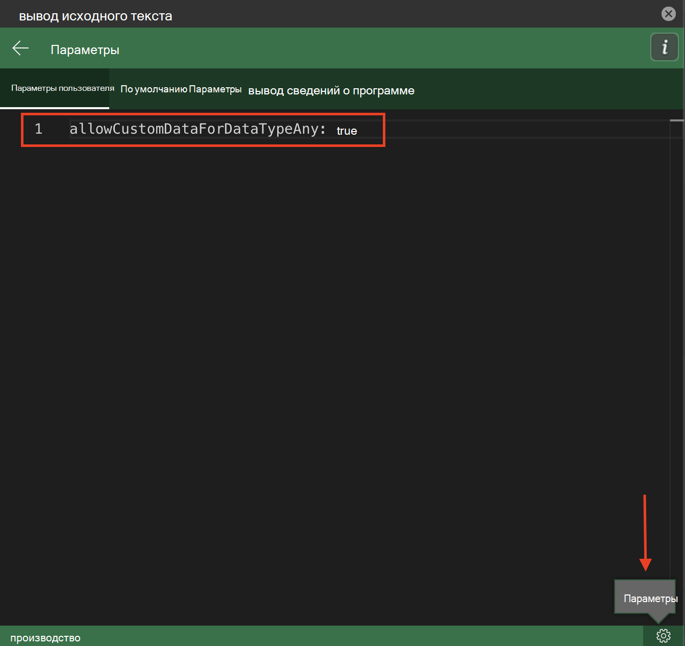

# <a name="use-data-types-with-custom-functions-in-excel-preview"></a>Используйте типы данных в пользовательских функциях Excel (предварительная версия)

[!include[Custom functions and data types availability note](../includes/excel-custom-functions-data-types-note.md)]

Типы данных расширяют программный интерфейс API JavaScript для Excel для поддержки новых типов данных в дополнение к исходным четырем типам значений ячеек (строка, число, логическое значение и ошибка). Типы данных включают поддержку веб-изображений, форматированных чисел, сущностей и массивов сущностей.

За счет этих типов данных расширяются возможности пользовательских функций, поскольку такие функции принимают типы данных в качестве значений как входных, так и выходных данных. Типы данных можно создавать с помощью пользовательских функций или использовать существующие типы данных в качестве аргументов функций при вычислениях. После установки схемы JSON типа данных она поддерживается во всех вычислениях.

Дополнительные сведения об использовании типов данных с помощью надстройки Excel см. в статье [Обзор типов данных в надстройках Excel](excel-data-types-overview.md).

## <a name="how-custom-functions-handle-data-types"></a>Как пользовательские функции обрабатывают типы данных

Пользовательские функции могут распознавать типы данных и принимать их в качестве значений параметров. Пользовательская функция может создать новый тип данных для возвращаемого значения. Пользовательские функции используют ту же схему JSON для типов данных, что и программный интерфейс API JavaScript для Excel. Эта схема JSON поддерживается при вычислениях и оценке пользовательскими функциями.

> [!NOTE]
> Пользовательские функции не поддерживают полную функциональность объектов расширенных ошибок, предлагаемых типами данных. Пользовательская функция может принимать объект ошибки типов данных, но он не будет поддерживаться во время вычислений. В настоящее время пользовательские функции поддерживают только ошибки, включенные в объект [CustomFunctions.Error](custom-functions-errors.md).

## <a name="enable-data-types-for-custom-functions"></a>Включение типов данных для пользовательских функций

Чтобы использовать эту возможность, необходимо вручную обновить метаданные JSON. Для временного тестирования вы можете настроить параметры Script Lab вместо обновления метаданных JSON вручную. В следующих разделах эти действия описаны более подробно.

### <a name="manually-update-json-metadata"></a>Обновление метаданных JSON вручную

Проекты пользовательских функций включают файл метаданных JSON. Этот файл метаданных JSON отличается от схемы JSON, используемой API-интерфейсами типов данных. Чтобы использовать интеграцию типов данных с пользовательскими функциями, файл метаданных JSON пользовательских функций должен обновляться вручную, чтобы включить свойство `allowCustomDataForDataTypeAny`. Присвойте этому свойству значение `true`.

Полное описание процесса создания JSON вручную см. в разделе [Создание JSON вручную для пользовательских функций](custom-functions-json.md). Дополнительные сведения об этом свойстве см. в разделе [allowCustomDataForDataTypeAny](custom-functions-json.md#allowcustomdatafordatatypeany-preview).

### <a name="script-lab-option"></a>Возможность Script Lab

Интеграция пользовательских функций с типами данных доступна для тестирования с помощью Script Lab в дополнение к обновлению метаданных JSON вручную, описанному в предыдущем разделе. Дополнительные сведения о Script Lab см. в статье [Изучение API JavaScript для Office с помощью Script Lab](../overview/explore-with-script-lab.md). Чтобы протестировать эту функцию с помощью Script Lab, обновите параметры с использованием следующих действий.

1. Откройте область задач **Код** в Script Lab.
1. В правом нижнем углу нажмите кнопку **Параметры**.
1. Перейдите на вкладку **Параметры пользователя** и введите `allowCustomDataForDataTypeAny: true`.



## <a name="output-a-formatted-number-value"></a>Вывод форматированного числового значения

В следующем примере кода показано, как создать тип данных [FormattedNumberCellValue](/javascript/api/excel/excel.formattednumbercellvalue) с помощью пользовательской функции. Функция принимает базовое число и параметр формата в качестве входных параметров и возвращает тип данных форматированного числа в качестве выходного значения.

```js
/**
 * Take a number as the input value and return a formatted number value as the output.
 * @customfunction
 * @param {number} value
 * @param {string} format (e.g. "0.00%")
 * @returns A formatted number value.
 */
function createFormattedNumber(value, format) {
    return {
        type: "FormattedNumber",
        basicValue: value,
        numberFormat: format
    }
}
```

## <a name="input-an-entity-value"></a>Ввод значения сущности

В следующем примере кода показана пользовательская функция, которая принимает тип данных [EntityCellValue](/javascript/api/excel/excel.entitycellvalue) в качестве входного значения. Если параметру `attribute` присвоено значение `text`, функция возвращает свойство `text` значения сущности. В противном случае функция возвращает свойство `basicValue` значения сущности.

```js
/**
 * Accept an entity value data type as a function input.
 * @customfunction
 * @param {any} value
 * @param {string} attribute
 * @returns {any} The text value of the entity.
 */
function getEntityAttribute(value, attribute) {
    if (value.type == "Entity") {
        if (attribute == "text") {
            return value.text;
        } else {
            return value.properties[attribute].basicValue;
        }
    } else {
        return JSON.stringify(value);
    }
}
```

## <a name="see-also"></a>См. также

* [Обзор типов данных в надстройках Excel](excel-data-types-overview.md)
* [Основные понятия, связанные с типами данных Excel](excel-data-types-concepts.md)
* [Настройка надстройки Office для использования общей среды выполнения](../develop/configure-your-add-in-to-use-a-shared-runtime.md)
