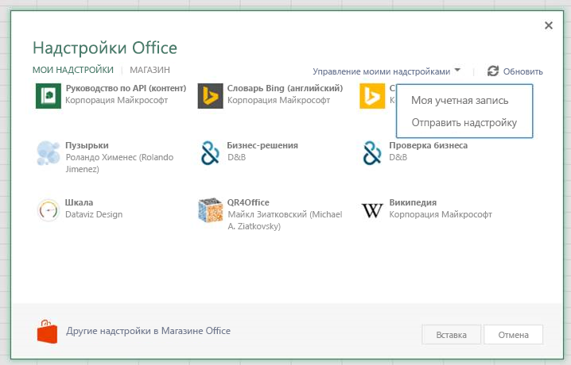

# Отладка пользовательских функций без пользовательского интерфейса

В этой статье обсуждается  отладка только для настраиваемой функции, которая не использует области задач или другие элементы пользовательского интерфейса (пользовательские функции без пользовательского интерфейса).

[!include[Excel custom functions note](../includes/excel-custom-functions-note.md)]

[!include[Shared runtime note](../includes/shared-runtime-note.md)]

На Windows:

- [Excel Отладка настольных Visual Studio Code (VS Code)](#use-the-vs-code-debugger-for-excel-desktop)
- [Excel в Интернете и VS Code отладка](#use-the-vs-code-debugger-for-excel-in-microsoft-edge)
- [Excel в Интернете и средства браузера](#use-the-browser-developer-tools-to-debug-custom-functions-in-excel-on-the-web)
- [Командная строка](#use-the-command-line-tools-to-debug)

На Mac:

- [Excel в Интернете и средства браузера](#use-the-browser-developer-tools-to-debug-custom-functions-in-excel-on-the-web)
- [Командная строка](#use-the-command-line-tools-to-debug)

> [!NOTE]
> Для простоты в этой статье показана отладка в контексте использования Visual Studio Code для редактирования, выполнения задач, а в некоторых случаях — представления отладки. При использовании другого средства редактора или  командной строки см. инструкции по командной строке в конце этой статьи.

## Требования

Этот процесс отладки работает **только** для пользовательских функций без пользовательского интерфейса, которые не используют области задач или другие элементы пользовательского интерфейса. Настраиваемая функция без пользовательского интерфейса может быть создана, следуя шагам в руководстве Create custom [functions in Excel,](../tutorials/excel-tutorial-create-custom-functions.md) а затем удалив все элементы области задач и пользовательского интерфейса, установленные генератором [Yeoman](https://www.npmjs.com/package/generator-office)для надстроек Office.

Обратите внимание, что этот процесс отладки не совместим с пользовательскими проектами функций с помощью общего [времени запуска.](../develop/configure-your-add-in-to-use-a-shared-runtime.md)

## Использование отладки VS Code для Excel Desktop

Вы можете использовать VS Code для отлаговки пользовательских функций без пользовательского интерфейса в Office Excel на рабочем столе.

> [!NOTE]
> Отладка рабочего стола для Mac недоступна, но может быть достигнута с помощью средств браузера и командной строки для отладки [Excel в Интернете).](#use-the-command-line-tools-to-debug)

### Запустите надстройку из VS Code

1. Откройте настраиваемую папку корневого проекта функций [в VS Code.](https://code.visualstudio.com/)
1. Выберите **терминал > выполнить задачу и** введите или выберите **Часы**. Это позволит отслеживать и восстанавливать любые изменения файлов.
1. Выберите **терминальный > выполнить задачу и** введите или выберите **Сервер разработчиков**.

### Запуск отладки VS Code

1. Выберите **просмотр > выполнить** или ввести **Ctrl+Shift+D,** чтобы перейти на отлагивание представления.
1. Из выпадаемого меню Run выберите **Excel Desktop (Настраиваемые функции).**
1. Чтобы начать отладку, выберите **F5** **(или > запустить** отладку из меню). Новая книга Excel откроется с помощью вашей надстройки, уже загруженной и готовой к использованию.

### Начало отладки

1. В VS Code откройте исходный файл скрипта кода **(functions.js** **или functions.ts).**
2. [Установите точку разрыва в](https://code.visualstudio.com/Docs/editor/debugging#_breakpoints) пользовательском коде источника функции.
3. В Excel введите формулу, использующую настраиваемую функцию.

На этом этапе выполнение остановится на строке кода, где заданной точкой разрыва. Теперь вы можете ступить через код, установить часы и использовать все необходимые VS Code отладки.

## Используйте отлад VS Code для Excel в Microsoft Edge

Вы можете использовать VS Code для отлаговки пользовательских функций в Excel браузере Microsoft Edge пользовательского интерфейса. Чтобы использовать VS Code с Microsoft Edge, необходимо установить [debugger для Microsoft Edge](https://marketplace.visualstudio.com/items?itemName=msjsdiag.debugger-for-edge) расширения.

### Запустите надстройку из VS Code

1. Откройте настраиваемую папку корневого проекта функций [в VS Code.](https://code.visualstudio.com/)
2. Выберите **терминал > выполнить задачу и** введите или выберите **Часы**. Это позволит отслеживать и восстанавливать любые изменения файлов.
3. Выберите **терминальный > выполнить задачу и** введите или выберите **Сервер разработчиков**.

### Запуск отладки VS Code

1. Выберите **просмотр > выполнить** или ввести **Ctrl+Shift+D,** чтобы перейти на отлагивание представления.
1. Из параметров отлагивание выберите **Office Online (Edge Chromium).**
1. Откройте Excel в Microsoft Edge браузере и создайте новую книгу.
1. Выберите **Share** в ленте и скопируйте ссылку на URL-адрес этой новой книги.
1. Чтобы начать отладку, выберите **F5** (> **запустить** отладку из меню). Появится запрос, в котором будет указан URL-адрес документа.
1. Введите URL-адрес книги и нажмите кнопку Ввод.

### Загрузка неопубликованной надстройки

1. Выберите **вкладку Insert** на ленте и в разделе Надстройки, выберите Office  **надстройки.**
2. В **диалоговом Office** надстройки выберите вкладку **MY ADD-INS,** выберите Управление надстройками, а затем Upload надстройки. 
  
    

3. **Просмотрите** файл манифеста надстройки и выберите **Upload.**
  
    

### Настройка точек разрыва

1. В VS Code откройте исходный файл скрипта кода **(functions.js** **или functions.ts).**
2. [Установите точку разрыва в](https://code.visualstudio.com/Docs/editor/debugging#_breakpoints) пользовательском коде источника функции.
3. В Excel введите формулу, использующую настраиваемую функцию.

## Используйте средства разработчика браузера для отлаговки настраиваемой функции в Excel в Интернете

Вы можете использовать средства разработчика браузера для отлаговки пользовательских функций без пользовательского интерфейса в Excel в Интернете. Следующие действия работают как для Windows, так и для macOS.

### Запустите надстройку из Visual Studio Code

1. Откройте настраиваемую папку корневого проекта [функций в Visual Studio Code (VS Code).](https://code.visualstudio.com/)
2. Выберите **терминал > выполнить задачу и** введите или выберите **Часы**. Это позволит отслеживать и восстанавливать любые изменения файлов.
3. Выберите **терминальный > выполнить задачу и** введите или выберите **Сервер разработчиков**.

### Загрузка неопубликованной надстройки

1. Откройте [Office в Интернете](https://office.live.com/).
2. Откройте новую книгу Excel.
3. Откройте **вкладку Insert** на ленте и в **разделе** Надстройки выберите Office **надстройки.**
4. В **диалоговом Office** надстройки выберите вкладку **MY ADD-INS,** выберите Управление надстройками, а затем Upload надстройки. 
  
    

5. **Найдите** файл манифеста надстройки и выберите **Отправить**.
  
    

> [!NOTE]
> После загрузки в документ он будет оставаться в стороне при каждом открываемом документе.

### Начало отладки

1. Откройте средства разработчика в браузере. Для Chrome и большинства браузеров F12 откроет средства разработчика.
2. В средствах разработчика откройте исходный файл скрипта кода с помощью **Cmd+P** или **Ctrl+P** **(functions.js** **или functions.ts).**
3. [Установите точку разрыва в](https://code.visualstudio.com/Docs/editor/debugging#_breakpoints) пользовательском коде источника функции. 

Если вам нужно изменить код, вы можете внести изменения в VS Code и сохранить изменения. Обновите браузер, чтобы увидеть загруженные изменения.

## Отламывка с помощью средств командной строки

Если вы не используете VS Code, для запуска надстройки можно использовать командную строку (например, bash или PowerShell). Для отлаговки кода в Excel в Интернете необходимо использовать средства разработчика браузера. Отламывка настольной версии Excel с помощью командной строки.

1. Из командной строки запустите, чтобы следить за изменениями кода и восстанавливать `npm run watch` их.
2. Откройте второе окно командной строки (первое будет заблокировано во время запуска часов.)

3. Если вы хотите запустить надстройку в настольной версии Excel, запустите следующую команду.
  
    `npm run start:desktop`
  
    Или если вы предпочитаете запустить надстройку в Excel в Интернете выполнить следующую команду.
  
    `npm run start:web`
  
    Для Excel в Интернете необходимо также побокзагрузить надстройку. Выполните действия [в Sideload надстройки,](#sideload-your-add-in) чтобы побокзагрузить надстройку. Затем продолжайте отладку в следующем разделе.
  
4. Откройте средства разработчика в браузере. Для Chrome и большинства браузеров F12 откроет средства разработчика.
5. В средствах разработчика откройте исходный файл скрипта кода **(functions.js** **или functions.ts).** Пользовательский код функций может быть расположен в конце файла.
6. В пользовательском коде источника функции нанесите точку разрыва, выбрав строку кода.

Если вам нужно изменить код, вы можете внести изменения в Visual Studio и сохранить изменения. Обновите браузер, чтобы увидеть загруженные изменения.

### Команды для создания и запуска надстройки

Существует несколько задач сборки.

- `npm run watch`: сборки для разработки и автоматическое восстановление при сэкономлении исходных файлов
- `npm run build-dev`: сборки для разработки один раз
- `npm run build`: сборки для производства
- `npm run dev-server`: запускает веб-сервер, используемый для разработки

Вы можете использовать следующие задачи для начала отладки на рабочем столе или в Интернете.

- `npm run start:desktop`: Запускает Excel на рабочем столе и заряжает надстройку.
- `npm run start:web`: Запускает Excel в Интернете и перегружает надстройку.
- `npm run stop`: Останавливает Excel и отладку.

## Дальнейшие действия

Узнайте о [практике проверки подлинности для пользовательских функций без пользовательского интерфейса.](custom-functions-authentication.md)

## См. также

* [Устранение неполадок пользовательских функций](custom-functions-troubleshooting.md)
* [Обработка ошибок в пользовательских функциях Excel](custom-functions-errors.md)
* [Создание пользовательских функций в Excel](custom-functions-overview.md)
