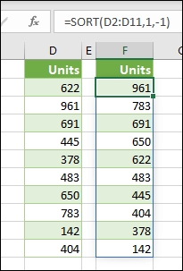

# <a name="return-multiple-results-from-your-custom-function"></a><span data-ttu-id="087e9-103">Возвращение нескольких результатов из пользовательской функции</span><span class="sxs-lookup"><span data-stu-id="087e9-103">Return multiple results from your custom function</span></span>

<span data-ttu-id="087e9-104">Вы можете получить несколько результатов из пользовательской функции, которая будет возвращена соседним ячейкам.</span><span class="sxs-lookup"><span data-stu-id="087e9-104">You can return multiple results from your custom function which will be returned to neighboring cells.</span></span> <span data-ttu-id="087e9-105">Такое поведение называется сбросом.</span><span class="sxs-lookup"><span data-stu-id="087e9-105">This behavior is called spilling.</span></span> <span data-ttu-id="087e9-106">Когда пользовательская функция возвращает массив результатов, она называется динамической формулой массива.</span><span class="sxs-lookup"><span data-stu-id="087e9-106">When your custom function returns an array of results, it is known as a dynamic array formula.</span></span> <span data-ttu-id="087e9-107">Более подробную информацию о формулах динамических массивов в Excel можно узнать в статье [динамические массивы и функции переданных массивов](https://support.office.com/article/dynamic-arrays-and-spilled-array-behavior-205c6b06-03ba-4151-89a1-87a7eb36e531).</span><span class="sxs-lookup"><span data-stu-id="087e9-107">For more information on dynamic array formulas in Excel, see [Dynamic arrays and spilled array behavior](https://support.office.com/article/dynamic-arrays-and-spilled-array-behavior-205c6b06-03ba-4151-89a1-87a7eb36e531).</span></span>

<span data-ttu-id="087e9-108">На приведенном ниже изображении показано, как функция **сортировки** переключается на соседние ячейки.</span><span class="sxs-lookup"><span data-stu-id="087e9-108">The following image shows how the **SORT** function spills down into neighboring cells.</span></span> <span data-ttu-id="087e9-109">Пользовательская функция также может возвращать несколько результатов, как показано ниже.</span><span class="sxs-lookup"><span data-stu-id="087e9-109">Your custom function can also return multiple results like this.</span></span>



<span data-ttu-id="087e9-111">Чтобы создать пользовательскую функцию, которая представляет собой формулу динамической массивов, она должна возвращать двухмерный массив значений.</span><span class="sxs-lookup"><span data-stu-id="087e9-111">To create a custom function that is a dynamic array formula, it must return a two-dimensional array of values.</span></span> <span data-ttu-id="087e9-112">Если результаты изменяются на соседние ячейки, у которых уже есть значения, то в формуле отображается **#SPILL!**</span><span class="sxs-lookup"><span data-stu-id="087e9-112">If the results spill into neighboring cells that already have values, the formula will display a **#SPILL!**</span></span> <span data-ttu-id="087e9-113">ошибкой.</span><span class="sxs-lookup"><span data-stu-id="087e9-113">error.</span></span> 

<span data-ttu-id="087e9-114">В приведенном ниже примере показано, как вернуть динамический массив, который переключается.</span><span class="sxs-lookup"><span data-stu-id="087e9-114">The following example shows how to return a dynamic array that spills down.</span></span>

```javascript
/**
 * Get text values that spill down.
 * @customfunction
 * @returns {string[][]} A dynamic array with multiple results.
 */
function spillDown() {
  return [['first'], ['second'], ['third']];
}
```

<span data-ttu-id="087e9-115">В приведенном ниже примере показано, как вернуть динамический массив, который наводится вправо.</span><span class="sxs-lookup"><span data-stu-id="087e9-115">The following example shows how to return a dynamic array that spills right.</span></span> 

```javascript
/**
 * Get text values that spill to the right.
 * @customfunction
 * @returns {string[][]} A dynamic array with multiple results.
 */
function spillRight() {
  return [['first', 'second', 'third']];
}
```

<span data-ttu-id="087e9-116">В приведенном ниже примере показано, как вернуть динамический массив, который будет исключаться и вправо, и вниз.</span><span class="sxs-lookup"><span data-stu-id="087e9-116">The following example shows how to return a dynamic array that spills both down and right.</span></span>

```javascript
/**
 * Get text values that spill both right and down.
 * @customfunction
 * @returns {string[][]} A dynamic array with multiple results.
 */
function spillRectangle() {
  return [
    ['apples', 1, 'pounds'],
    ['oranges', 3, 'pounds'],
    ['pears', 5, 'crates']
  ];
}
```

## <a name="see-also"></a><span data-ttu-id="087e9-117">См. также</span><span class="sxs-lookup"><span data-stu-id="087e9-117">See also</span></span>

- [<span data-ttu-id="087e9-118">Динамическое массивы и переопределяющее поведение массива</span><span class="sxs-lookup"><span data-stu-id="087e9-118">Dynamic arrays and spilled array behavior</span></span>](https://support.office.com/article/dynamic-arrays-and-spilled-array-behavior-205c6b06-03ba-4151-89a1-87a7eb36e531)
- [<span data-ttu-id="087e9-119">Параметры для пользовательских функций Excel</span><span class="sxs-lookup"><span data-stu-id="087e9-119">Options for Excel custom functions</span></span>](custom-functions-parameter-options.md)