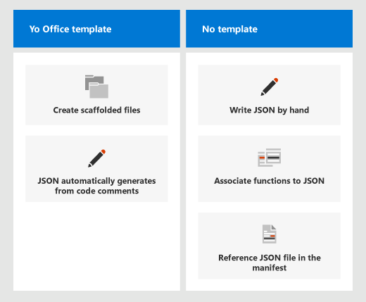

# <a name="manually-create-json-metadata-for-custom-functions"></a><span data-ttu-id="69b3f-103">Вручную создайте метаданные JSON для пользовательских функций</span><span class="sxs-lookup"><span data-stu-id="69b3f-103">Manually create JSON metadata for custom functions</span></span>

<span data-ttu-id="69b3f-104">Как описано [](custom-functions-overview.md) в статье обзор пользовательских функций, проект пользовательских функций должен включать как файл метаданных JSON, так и файл скрипта (JavaScript или TypeScript), чтобы зарегистрировать функцию, что делает ее доступной для использования.</span><span class="sxs-lookup"><span data-stu-id="69b3f-104">As described in the [custom functions overview](custom-functions-overview.md) article, a custom functions project must include both a JSON metadata file and a script (either JavaScript or TypeScript) file to register a function, making it available for use.</span></span> <span data-ttu-id="69b3f-105">Настраиваемые функции регистрируются, когда пользователь запускает надстройки в первый раз и после этого доступен одному пользователю во всех книгах.</span><span class="sxs-lookup"><span data-stu-id="69b3f-105">Custom functions are registered when the user runs the add-in for the first time and after that are available to the same user in all workbooks.</span></span>

[!include[Excel custom functions note](../includes/excel-custom-functions-note.md)]

<span data-ttu-id="69b3f-106">По возможности рекомендуется использовать автогенерацию JSON вместо создания собственного JSON-файла.</span><span class="sxs-lookup"><span data-stu-id="69b3f-106">We recommend using JSON autogeneration when possible instead of creating your own JSON file.</span></span> <span data-ttu-id="69b3f-107">Автогенерация менее подвержена ошибкам пользователей, и в них уже содержатся файлы `yo office` с подмостки.</span><span class="sxs-lookup"><span data-stu-id="69b3f-107">Autogeneration is less prone to user error and the `yo office` scaffolded files already include this.</span></span> <span data-ttu-id="69b3f-108">Дополнительные сведения о тегах JSDoc и процессе автоматическойгенерации JSON см. в сайте [Autogenerate JSON metadata for custom functions.](custom-functions-json-autogeneration.md)</span><span class="sxs-lookup"><span data-stu-id="69b3f-108">For more information on JSDoc tags and the JSON autogeneration process, see [Autogenerate JSON metadata for custom functions](custom-functions-json-autogeneration.md).</span></span>

<span data-ttu-id="69b3f-109">Однако проект настраиваемой функции можно сделать с нуля.</span><span class="sxs-lookup"><span data-stu-id="69b3f-109">However, you can make a custom functions project from scratch.</span></span> <span data-ttu-id="69b3f-110">Этот процесс требует:</span><span class="sxs-lookup"><span data-stu-id="69b3f-110">This process requires you to:</span></span>

- <span data-ttu-id="69b3f-111">Напишите файл JSON.</span><span class="sxs-lookup"><span data-stu-id="69b3f-111">Write your JSON file.</span></span>
- <span data-ttu-id="69b3f-112">Убедитесь, что файл манифеста подключен к файлу JSON.</span><span class="sxs-lookup"><span data-stu-id="69b3f-112">Check that your manifest file is connected to your JSON file.</span></span>
- <span data-ttu-id="69b3f-113">Связать функции `id` и свойства в файле скрипта для `name` регистрации функций.</span><span class="sxs-lookup"><span data-stu-id="69b3f-113">Associate your functions' `id` and `name` properties in the script file in order to register your functions.</span></span>

<span data-ttu-id="69b3f-114">На следующем изображении объясняются различия между использованием файлов леса и `yo office` написанием JSON с нуля.</span><span class="sxs-lookup"><span data-stu-id="69b3f-114">The following image explains the differences between using `yo office` scaffold files and writing JSON from scratch.</span></span>



> [!NOTE]
> <span data-ttu-id="69b3f-116">Не забудьте подключить манифест к файлу JSON, который вы создаете, через раздел в файле манифеста XML, если вы `<Resources>` не используете `yo office` генератор.</span><span class="sxs-lookup"><span data-stu-id="69b3f-116">Remember to connect your manifest to the JSON file you create, through the `<Resources>` section in your XML manifest file if you do not use the `yo office` generator.</span></span>

## <a name="authoring-metadata-and-connecting-to-the-manifest"></a><span data-ttu-id="69b3f-117">Авторство метаданных и подключение к манифесту</span><span class="sxs-lookup"><span data-stu-id="69b3f-117">Authoring metadata and connecting to the manifest</span></span>

<span data-ttu-id="69b3f-118">Создайте файл JSON в проекте и укажи все сведения о его функциях, таких как параметры функции.</span><span class="sxs-lookup"><span data-stu-id="69b3f-118">Create a JSON file in your project and provide all the details about your functions in it, such as the function's parameters.</span></span> <span data-ttu-id="69b3f-119">См. следующий пример [метаданных](#json-metadata-example) и ссылку на [метаданные](#metadata-reference) для полного списка свойств функций.</span><span class="sxs-lookup"><span data-stu-id="69b3f-119">See the [following metadata example](#json-metadata-example) and [the metadata reference](#metadata-reference) for a complete list of function properties.</span></span>

<span data-ttu-id="69b3f-120">Убедитесь, что файл манифеста XML ссылается на файл JSON в разделе, аналогично `<Resources>` следующему примеру.</span><span class="sxs-lookup"><span data-stu-id="69b3f-120">Ensure your XML manifest file references your JSON file in the `<Resources>` section, similar to the following example.</span></span>

```json
<Resources>
    <bt:Urls>
        <bt:Url id="JSON-URL" DefaultValue="https://subdomain.contoso.com/config/customfunctions.json"/>
        <bt:Url id="JS-URL" DefaultValue="https://subdomain.contoso.com/dist/win32/ship/index.win32.bundle"/>
            <bt:Url id="HTML-URL" DefaultValue="https://subdomain.contoso.com/index.html"/>
    </bt:Urls>
    <bt:ShortStrings>
        <bt:String id="namespace" DefaultValue="CONTOSO"/>
    </bt:ShortStrings>
</Resources>
```

## <a name="json-metadata-example"></a><span data-ttu-id="69b3f-121">Пример метаданных JSON</span><span class="sxs-lookup"><span data-stu-id="69b3f-121">JSON metadata example</span></span>

<span data-ttu-id="69b3f-122">В примере кода ниже показано содержимое JSON-файла метаданных для надстройки, определяющей настраиваемые функции.</span><span class="sxs-lookup"><span data-stu-id="69b3f-122">The following example shows the contents of a JSON metadata file for an add-in that defines custom functions.</span></span> <span data-ttu-id="69b3f-123">В следующих за этим примером разделах приводятся подробные сведения об отдельных свойствах, представленных в этом примере JSON.</span><span class="sxs-lookup"><span data-stu-id="69b3f-123">The sections that follow this example provide detailed information about the individual properties within this JSON example.</span></span>

```json
{
  "functions": [
    {
      "id": "ADD",
      "name": "ADD",
      "description": "Add two numbers",
      "helpUrl": "http://www.contoso.com/help",
      "result": {
        "type": "number",
        "dimensionality": "scalar"
      },
      "parameters": [
        {
          "name": "first",
          "description": "first number to add",
          "type": "number",
          "dimensionality": "scalar"
        },
        {
          "name": "second",
          "description": "second number to add",
          "type": "number",
          "dimensionality": "scalar"
        }
      ]
    },
    {
      "id": "GETDAY",
      "name": "GETDAY",
      "description": "Get the day of the week",
      "helpUrl": "http://www.contoso.com/help",
      "result": {
        "dimensionality": "scalar"
      },
      "parameters": []
    },
    {
      "id": "INCREMENTVALUE",
      "name": "INCREMENTVALUE",
      "description": "Count up from zero",
      "helpUrl": "http://www.contoso.com/help",
      "result": {
        "dimensionality": "scalar"
      },
      "parameters": [
        {
          "name": "increment",
          "description": "the number to be added each time",
          "type": "number",
          "dimensionality": "scalar"
        }
      ],
      "options": {
        "stream": true,
        "cancelable": true
      }
    },
    {
      "id": "SECONDHIGHEST",
      "name": "SECONDHIGHEST",
      "description": "Get the second highest number from a range",
      "helpUrl": "http://www.contoso.com/help",
      "result": {
        "dimensionality": "scalar"
      },
      "parameters": [
        {
          "name": "range",
          "description": "the input range",
          "type": "number",
          "dimensionality": "matrix"
        }
      ]
    }
  ]
}
```

> [!NOTE]
> <span data-ttu-id="69b3f-124">Полный пример JSON-файла доступен в истории фиксации [OfficeDev/Excel-Custom-Functions](https://github.com/OfficeDev/Excel-Custom-Functions/blob/77760adb1dcc53469183049bea08196734dbc114/config/customfunctions.json) GitHub репозитория.</span><span class="sxs-lookup"><span data-stu-id="69b3f-124">A complete sample JSON file is available in the [OfficeDev/Excel-Custom-Functions](https://github.com/OfficeDev/Excel-Custom-Functions/blob/77760adb1dcc53469183049bea08196734dbc114/config/customfunctions.json) GitHub repository's commit history.</span></span> <span data-ttu-id="69b3f-125">Поскольку проект был скорректирован для автоматического создания JSON, полный пример рукописного JSON доступен только в предыдущих версиях проекта.</span><span class="sxs-lookup"><span data-stu-id="69b3f-125">As the project has been adjusted to automatically generate JSON, a full sample of handwritten JSON is only available in previous versions of the project.</span></span>

## <a name="metadata-reference"></a><span data-ttu-id="69b3f-126">Ссылка на метаданные</span><span class="sxs-lookup"><span data-stu-id="69b3f-126">Metadata reference</span></span>

### <a name="functions"></a><span data-ttu-id="69b3f-127">functions</span><span class="sxs-lookup"><span data-stu-id="69b3f-127">functions</span></span>

<span data-ttu-id="69b3f-128">Свойство `functions` представляет собой массив объектов настраиваемых функций.</span><span class="sxs-lookup"><span data-stu-id="69b3f-128">The `functions` property is an array of custom function objects.</span></span> <span data-ttu-id="69b3f-129">В таблице ниже приведены свойства каждого объекта.</span><span class="sxs-lookup"><span data-stu-id="69b3f-129">The following table lists the properties of each object.</span></span>

| <span data-ttu-id="69b3f-130">Свойство</span><span class="sxs-lookup"><span data-stu-id="69b3f-130">Property</span></span>      | <span data-ttu-id="69b3f-131">Тип данных</span><span class="sxs-lookup"><span data-stu-id="69b3f-131">Data type</span></span> | <span data-ttu-id="69b3f-132">Обязательный</span><span class="sxs-lookup"><span data-stu-id="69b3f-132">Required</span></span> | <span data-ttu-id="69b3f-133">Описание</span><span class="sxs-lookup"><span data-stu-id="69b3f-133">Description</span></span>                                                                                                                                                                      |
| :------------ | :-------- | :------- | :------------------------------------------------------------------------------------------------------------------------------------------------------------------------------- |
| `description` | <span data-ttu-id="69b3f-134">string</span><span class="sxs-lookup"><span data-stu-id="69b3f-134">string</span></span>    | <span data-ttu-id="69b3f-135">Нет</span><span class="sxs-lookup"><span data-stu-id="69b3f-135">No</span></span>       | <span data-ttu-id="69b3f-136">Описание функции, которое отображается пользователям в Excel</span><span class="sxs-lookup"><span data-stu-id="69b3f-136">The description of the function that end users see in Excel.</span></span> <span data-ttu-id="69b3f-137">(например, **преобразует значение по шкале Цельсия в температуру по шкале Фаренгейта**).</span><span class="sxs-lookup"><span data-stu-id="69b3f-137">For example, **Converts a Celsius value to Fahrenheit**.</span></span>                                                            |
| `helpUrl`     | <span data-ttu-id="69b3f-138">string</span><span class="sxs-lookup"><span data-stu-id="69b3f-138">string</span></span>    | <span data-ttu-id="69b3f-139">Нет</span><span class="sxs-lookup"><span data-stu-id="69b3f-139">No</span></span>       | <span data-ttu-id="69b3f-140">URL-адрес, по которому можно получить сведения о функции</span><span class="sxs-lookup"><span data-stu-id="69b3f-140">URL that provides information about the function.</span></span> <span data-ttu-id="69b3f-141">(отображается в области задач). Пример: `http://contoso.com/help/convertcelsiustofahrenheit.html`.</span><span class="sxs-lookup"><span data-stu-id="69b3f-141">(It is displayed in a task pane.) For example, `http://contoso.com/help/convertcelsiustofahrenheit.html`.</span></span>                      |
| `id`          | <span data-ttu-id="69b3f-142">string</span><span class="sxs-lookup"><span data-stu-id="69b3f-142">string</span></span>    | <span data-ttu-id="69b3f-143">Да</span><span class="sxs-lookup"><span data-stu-id="69b3f-143">Yes</span></span>      | <span data-ttu-id="69b3f-144">Уникальный идентификатор для функции.</span><span class="sxs-lookup"><span data-stu-id="69b3f-144">A unique ID for the function.</span></span> <span data-ttu-id="69b3f-145">Этот идентификатор может содержать только буквы, цифры и точки и не может изменяться после настройки.</span><span class="sxs-lookup"><span data-stu-id="69b3f-145">This ID can only contain alphanumeric characters and periods and should not be changed after it is set.</span></span>                                            |
| `name`        | <span data-ttu-id="69b3f-146">string</span><span class="sxs-lookup"><span data-stu-id="69b3f-146">string</span></span>    | <span data-ttu-id="69b3f-147">Да</span><span class="sxs-lookup"><span data-stu-id="69b3f-147">Yes</span></span>      | <span data-ttu-id="69b3f-148">Имя функции, которое отображается пользователям в Excel.</span><span class="sxs-lookup"><span data-stu-id="69b3f-148">The name of the function that end users see in Excel.</span></span> <span data-ttu-id="69b3f-149">В Excel это имя функции префиксировали в настраиваемом пространстве имен функций, указанном в XML-файле манифеста.</span><span class="sxs-lookup"><span data-stu-id="69b3f-149">In Excel, this function name is prefixed by the custom functions namespace that's specified in the XML manifest file.</span></span> |
| `options`     | <span data-ttu-id="69b3f-150">object</span><span class="sxs-lookup"><span data-stu-id="69b3f-150">object</span></span>    | <span data-ttu-id="69b3f-151">Нет</span><span class="sxs-lookup"><span data-stu-id="69b3f-151">No</span></span>       | <span data-ttu-id="69b3f-152">Позволяет настроить некоторые аспекты того, как и когда Excel выполняет функцию.</span><span class="sxs-lookup"><span data-stu-id="69b3f-152">Enables you to customize some aspects of how and when Excel executes the function.</span></span> <span data-ttu-id="69b3f-153">Дополнительные сведения см. в разделе [options](#options).</span><span class="sxs-lookup"><span data-stu-id="69b3f-153">See [options](#options) for details.</span></span>                                                          |
| `parameters`  | <span data-ttu-id="69b3f-154">array</span><span class="sxs-lookup"><span data-stu-id="69b3f-154">array</span></span>     | <span data-ttu-id="69b3f-155">Да</span><span class="sxs-lookup"><span data-stu-id="69b3f-155">Yes</span></span>      | <span data-ttu-id="69b3f-156">Массив, который определяет входные параметры для функции.</span><span class="sxs-lookup"><span data-stu-id="69b3f-156">Array that defines the input parameters for the function.</span></span> <span data-ttu-id="69b3f-157">Сведения [см. в параметрах.](#parameters)</span><span class="sxs-lookup"><span data-stu-id="69b3f-157">See [parameters](#parameters) for details.</span></span>                                                                             |
| `result`      | <span data-ttu-id="69b3f-158">object</span><span class="sxs-lookup"><span data-stu-id="69b3f-158">object</span></span>    | <span data-ttu-id="69b3f-159">Да</span><span class="sxs-lookup"><span data-stu-id="69b3f-159">Yes</span></span>      | <span data-ttu-id="69b3f-160">Объект, который определяет тип информации, возвращаемый функцией.</span><span class="sxs-lookup"><span data-stu-id="69b3f-160">Object that defines the type of information that is returned by the function.</span></span> <span data-ttu-id="69b3f-161">Дополнительные сведения см. в разделе [result](#result).</span><span class="sxs-lookup"><span data-stu-id="69b3f-161">See [result](#result) for details.</span></span>                                                                 |

### <a name="options"></a><span data-ttu-id="69b3f-162">options</span><span class="sxs-lookup"><span data-stu-id="69b3f-162">options</span></span>

<span data-ttu-id="69b3f-163">Объект `options` позволяет настроить некоторые аспекты того, как и когда Excel выполняет функцию.</span><span class="sxs-lookup"><span data-stu-id="69b3f-163">The `options` object enables you to customize some aspects of how and when Excel executes the function.</span></span> <span data-ttu-id="69b3f-164">В таблице ниже приведены свойства объекта `options`.</span><span class="sxs-lookup"><span data-stu-id="69b3f-164">The following table lists the properties of the `options` object.</span></span>

| <span data-ttu-id="69b3f-165">Свойство</span><span class="sxs-lookup"><span data-stu-id="69b3f-165">Property</span></span>          | <span data-ttu-id="69b3f-166">Тип данных</span><span class="sxs-lookup"><span data-stu-id="69b3f-166">Data type</span></span> | <span data-ttu-id="69b3f-167">Обязательный</span><span class="sxs-lookup"><span data-stu-id="69b3f-167">Required</span></span>                               | <span data-ttu-id="69b3f-168">Описание</span><span class="sxs-lookup"><span data-stu-id="69b3f-168">Description</span></span> |
| :---------------- | :-------- | :------------------------------------- | :---------- |
| `cancelable`      | <span data-ttu-id="69b3f-169">boolean</span><span class="sxs-lookup"><span data-stu-id="69b3f-169">boolean</span></span>   | <span data-ttu-id="69b3f-170">Нет</span><span class="sxs-lookup"><span data-stu-id="69b3f-170">No</span></span><br/><br/><span data-ttu-id="69b3f-171">Значение по умолчанию: `false`.</span><span class="sxs-lookup"><span data-stu-id="69b3f-171">Default value is `false`.</span></span>  | <span data-ttu-id="69b3f-172">Если это свойство имеет значение `true`, Excel будет вызывать обработчик `CancelableInvocation` каждый раз, когда пользователь будет предпринимать действия, которые приводят к отмене функции (например, вручную вызывает пересчет или редактирует ячейку, на которую ссылается функция).</span><span class="sxs-lookup"><span data-stu-id="69b3f-172">If `true`, Excel calls the `CancelableInvocation` handler whenever the user takes an action that has the effect of canceling the function; for example, manually triggering recalculation or editing a cell that is referenced by the function.</span></span> <span data-ttu-id="69b3f-173">Отменяемые функции обычно используются только для асинхронных функций, которые возвращают один результат и требуют обработки отмены запроса на данные.</span><span class="sxs-lookup"><span data-stu-id="69b3f-173">Cancelable functions are typically only used for asynchronous functions that return a single result and need to handle the cancellation of a request for data.</span></span> <span data-ttu-id="69b3f-174">Функция не может использовать как свойства, так `stream` `cancelable` и свойства.</span><span class="sxs-lookup"><span data-stu-id="69b3f-174">A function can't use both the `stream` and `cancelable` properties.</span></span> |
| `requiresAddress` | <span data-ttu-id="69b3f-175">boolean</span><span class="sxs-lookup"><span data-stu-id="69b3f-175">boolean</span></span>   | <span data-ttu-id="69b3f-176">Нет</span><span class="sxs-lookup"><span data-stu-id="69b3f-176">No</span></span> <br/><br/><span data-ttu-id="69b3f-177">Значение по умолчанию: `false`.</span><span class="sxs-lookup"><span data-stu-id="69b3f-177">Default value is `false`.</span></span> | <span data-ttu-id="69b3f-178">Если `true` ваша настраиваемая функция может получить доступ к адресу вызываемой ячейки.</span><span class="sxs-lookup"><span data-stu-id="69b3f-178">If `true`, your custom function can access the address of the cell that invoked it.</span></span> <span data-ttu-id="69b3f-179">Свойство параметра вызов содержит адрес ячейки, вызываемой `address` вашей настраиваемой [](custom-functions-parameter-options.md#invocation-parameter) функцией.</span><span class="sxs-lookup"><span data-stu-id="69b3f-179">The `address` property of the [invocation parameter](custom-functions-parameter-options.md#invocation-parameter) contains the address of the cell that invoked your custom function.</span></span> <span data-ttu-id="69b3f-180">Функция не может использовать как свойства, так `stream` `requiresAddress` и свойства.</span><span class="sxs-lookup"><span data-stu-id="69b3f-180">A function can't use both the `stream` and `requiresAddress` properties.</span></span> |
| `requiresParameterAddresses` | <span data-ttu-id="69b3f-181">boolean</span><span class="sxs-lookup"><span data-stu-id="69b3f-181">boolean</span></span>   | <span data-ttu-id="69b3f-182">Нет</span><span class="sxs-lookup"><span data-stu-id="69b3f-182">No</span></span> <br/><br/><span data-ttu-id="69b3f-183">Значение по умолчанию: `false`.</span><span class="sxs-lookup"><span data-stu-id="69b3f-183">Default value is `false`.</span></span> | <span data-ttu-id="69b3f-184">Если ваша настраиваемая функция может получить доступ `true` к адресам входных параметров функции.</span><span class="sxs-lookup"><span data-stu-id="69b3f-184">If `true`, your custom function can access the addresses of the function's input parameters.</span></span> <span data-ttu-id="69b3f-185">Это свойство должно использоваться в сочетании с свойством объекта `dimensionality` [результатов](#result) и `dimensionality` должно быть заданной для `matrix` .</span><span class="sxs-lookup"><span data-stu-id="69b3f-185">This property must be used in combination with the `dimensionality` property of the [result](#result) object, and `dimensionality` must be set to `matrix`.</span></span> <span data-ttu-id="69b3f-186">Дополнительные [сведения см. в](custom-functions-parameter-options.md#detect-the-address-of-a-parameter) дополнительных сведениях Об обнаружении адреса параметра.</span><span class="sxs-lookup"><span data-stu-id="69b3f-186">See [Detect the address of a parameter](custom-functions-parameter-options.md#detect-the-address-of-a-parameter) for more information.</span></span> |
| `stream`          | <span data-ttu-id="69b3f-187">boolean</span><span class="sxs-lookup"><span data-stu-id="69b3f-187">boolean</span></span>   | <span data-ttu-id="69b3f-188">Нет</span><span class="sxs-lookup"><span data-stu-id="69b3f-188">No</span></span><br/><br/><span data-ttu-id="69b3f-189">Значение по умолчанию: `false`.</span><span class="sxs-lookup"><span data-stu-id="69b3f-189">Default value is `false`.</span></span>  | <span data-ttu-id="69b3f-190">Если это свойство имеет значение `true`, функция может выводить значение в ячейку несколько раз, даже если вызвана всего единожды.</span><span class="sxs-lookup"><span data-stu-id="69b3f-190">If `true`, the function can output repeatedly to the cell even when invoked only once.</span></span> <span data-ttu-id="69b3f-191">Этот параметр полезен для быстро изменяющихся источников данных, таких как цена акций.</span><span class="sxs-lookup"><span data-stu-id="69b3f-191">This option is useful for rapidly-changing data sources, such as a stock price.</span></span> <span data-ttu-id="69b3f-192">Функция не должна содержать оператор `return`.</span><span class="sxs-lookup"><span data-stu-id="69b3f-192">The function should have no `return` statement.</span></span> <span data-ttu-id="69b3f-193">Вместо этого результирующее значение передается как аргумент метода обратного вызова `StreamingInvocation.setResult`.</span><span class="sxs-lookup"><span data-stu-id="69b3f-193">Instead, the result value is passed as the argument of the `StreamingInvocation.setResult` callback method.</span></span> <span data-ttu-id="69b3f-194">Дополнительные сведения см. в [дополнительных сведениях: Сделать функцию потоковой передачи.](custom-functions-web-reqs.md#make-a-streaming-function)</span><span class="sxs-lookup"><span data-stu-id="69b3f-194">For more information, see [Make a streaming function](custom-functions-web-reqs.md#make-a-streaming-function).</span></span> |
| `volatile`        | <span data-ttu-id="69b3f-195">boolean</span><span class="sxs-lookup"><span data-stu-id="69b3f-195">boolean</span></span>   | <span data-ttu-id="69b3f-196">Нет</span><span class="sxs-lookup"><span data-stu-id="69b3f-196">No</span></span> <br/><br/><span data-ttu-id="69b3f-197">Значение по умолчанию: `false`.</span><span class="sxs-lookup"><span data-stu-id="69b3f-197">Default value is `false`.</span></span> | <span data-ttu-id="69b3f-198">Если функция пересчитывает каждый раз Excel пересчет, а не только в случае изменения зависимых значений `true` формулы.</span><span class="sxs-lookup"><span data-stu-id="69b3f-198">If `true`, the function recalculates each time Excel recalculates, instead of only when the formula's dependent values have changed.</span></span> <span data-ttu-id="69b3f-199">Функция не может использовать как свойства, так `stream` `volatile` и свойства.</span><span class="sxs-lookup"><span data-stu-id="69b3f-199">A function can't use both the `stream` and `volatile` properties.</span></span> <span data-ttu-id="69b3f-200">Если оба замеяны свойства и свойства, свойство `stream` `volatile` летучих свойств будет `true` проигнорировано.</span><span class="sxs-lookup"><span data-stu-id="69b3f-200">If the `stream` and `volatile` properties are both set to `true`, the volatile property will be ignored.</span></span> |

### <a name="parameters"></a><span data-ttu-id="69b3f-201">parameters</span><span class="sxs-lookup"><span data-stu-id="69b3f-201">parameters</span></span>

<span data-ttu-id="69b3f-202">Свойство `parameters` представляет собой массив объектов параметров.</span><span class="sxs-lookup"><span data-stu-id="69b3f-202">The `parameters` property is an array of parameter objects.</span></span> <span data-ttu-id="69b3f-203">В таблице ниже приведены свойства каждого объекта.</span><span class="sxs-lookup"><span data-stu-id="69b3f-203">The following table lists the properties of each object.</span></span>

|  <span data-ttu-id="69b3f-204">Свойство</span><span class="sxs-lookup"><span data-stu-id="69b3f-204">Property</span></span>  |  <span data-ttu-id="69b3f-205">Тип данных</span><span class="sxs-lookup"><span data-stu-id="69b3f-205">Data type</span></span>  |  <span data-ttu-id="69b3f-206">Обязательный</span><span class="sxs-lookup"><span data-stu-id="69b3f-206">Required</span></span>  |  <span data-ttu-id="69b3f-207">Описание</span><span class="sxs-lookup"><span data-stu-id="69b3f-207">Description</span></span>  |
|:-----|:-----|:-----|:-----|
|  `description`  |  <span data-ttu-id="69b3f-208">string</span><span class="sxs-lookup"><span data-stu-id="69b3f-208">string</span></span>  |  <span data-ttu-id="69b3f-209">Нет</span><span class="sxs-lookup"><span data-stu-id="69b3f-209">No</span></span> |  <span data-ttu-id="69b3f-210">Описание параметра.</span><span class="sxs-lookup"><span data-stu-id="69b3f-210">A description of the parameter.</span></span> <span data-ttu-id="69b3f-211">Это отображается в Excel IntelliSense.</span><span class="sxs-lookup"><span data-stu-id="69b3f-211">This is displayed in Excel's IntelliSense.</span></span>  |
|  `dimensionality`  |  <span data-ttu-id="69b3f-212">string</span><span class="sxs-lookup"><span data-stu-id="69b3f-212">string</span></span>  |  <span data-ttu-id="69b3f-213">Нет</span><span class="sxs-lookup"><span data-stu-id="69b3f-213">No</span></span>  |  <span data-ttu-id="69b3f-214">Должно быть `scalar` либо (не массивное значение), либо `matrix` (двухмерный массив).</span><span class="sxs-lookup"><span data-stu-id="69b3f-214">Must be either `scalar` (a non-array value) or `matrix` (a 2-dimensional array).</span></span>  |
|  `name`  |  <span data-ttu-id="69b3f-215">string</span><span class="sxs-lookup"><span data-stu-id="69b3f-215">string</span></span>  |  <span data-ttu-id="69b3f-216">Да</span><span class="sxs-lookup"><span data-stu-id="69b3f-216">Yes</span></span>  |  <span data-ttu-id="69b3f-217">Имя параметра.</span><span class="sxs-lookup"><span data-stu-id="69b3f-217">The name of the parameter.</span></span> <span data-ttu-id="69b3f-218">Это имя отображается в Excel в IntelliSense.</span><span class="sxs-lookup"><span data-stu-id="69b3f-218">This name is displayed in Excel's IntelliSense.</span></span>  |
|  `type`  |  <span data-ttu-id="69b3f-219">string</span><span class="sxs-lookup"><span data-stu-id="69b3f-219">string</span></span>  |  <span data-ttu-id="69b3f-220">Нет</span><span class="sxs-lookup"><span data-stu-id="69b3f-220">No</span></span>  |  <span data-ttu-id="69b3f-221">Тип данных параметра.</span><span class="sxs-lookup"><span data-stu-id="69b3f-221">The data type of the parameter.</span></span> <span data-ttu-id="69b3f-222">Может быть , или , что позволяет использовать любой `boolean` `number` из `string` `any` предыдущих трех типов.</span><span class="sxs-lookup"><span data-stu-id="69b3f-222">Can be `boolean`, `number`, `string`, or `any`, which allows you to use of any of the previous three types.</span></span> <span data-ttu-id="69b3f-223">Если это свойство не указано, тип данных по умолчанию `any` .</span><span class="sxs-lookup"><span data-stu-id="69b3f-223">If this property is not specified, the data type defaults to `any`.</span></span> |
|  `optional`  | <span data-ttu-id="69b3f-224">boolean</span><span class="sxs-lookup"><span data-stu-id="69b3f-224">boolean</span></span> | <span data-ttu-id="69b3f-225">Нет</span><span class="sxs-lookup"><span data-stu-id="69b3f-225">No</span></span> | <span data-ttu-id="69b3f-226">Если присвоено значение `true`, параметр не обязателен.</span><span class="sxs-lookup"><span data-stu-id="69b3f-226">If `true`, the parameter is optional.</span></span> |
|`repeating`| <span data-ttu-id="69b3f-227">boolean</span><span class="sxs-lookup"><span data-stu-id="69b3f-227">boolean</span></span> | <span data-ttu-id="69b3f-228">Нет</span><span class="sxs-lookup"><span data-stu-id="69b3f-228">No</span></span> | <span data-ttu-id="69b3f-229">Если `true` параметры заполняются из указанного массива.</span><span class="sxs-lookup"><span data-stu-id="69b3f-229">If `true`, parameters populate from a specified array.</span></span> <span data-ttu-id="69b3f-230">Обратите внимание, что все повторяющие параметры по определению считаются необязательными.</span><span class="sxs-lookup"><span data-stu-id="69b3f-230">Note that functions all repeating parameters are considered optional parameters by definition.</span></span>  |

### <a name="result"></a><span data-ttu-id="69b3f-231">result</span><span class="sxs-lookup"><span data-stu-id="69b3f-231">result</span></span>

<span data-ttu-id="69b3f-232">Объект `result` определяет тип информации, возвращаемый функцией.</span><span class="sxs-lookup"><span data-stu-id="69b3f-232">The `result` object defines the type of information that is returned by the function.</span></span> <span data-ttu-id="69b3f-233">В таблице ниже приведены свойства объекта `result`.</span><span class="sxs-lookup"><span data-stu-id="69b3f-233">The following table lists the properties of the `result` object.</span></span>

| <span data-ttu-id="69b3f-234">Свойство</span><span class="sxs-lookup"><span data-stu-id="69b3f-234">Property</span></span>         | <span data-ttu-id="69b3f-235">Тип данных</span><span class="sxs-lookup"><span data-stu-id="69b3f-235">Data type</span></span> | <span data-ttu-id="69b3f-236">Обязательный</span><span class="sxs-lookup"><span data-stu-id="69b3f-236">Required</span></span> | <span data-ttu-id="69b3f-237">Описание</span><span class="sxs-lookup"><span data-stu-id="69b3f-237">Description</span></span>                                                                          |
| :--------------- | :-------- | :------- | :----------------------------------------------------------------------------------- |
| `dimensionality` | <span data-ttu-id="69b3f-238">string</span><span class="sxs-lookup"><span data-stu-id="69b3f-238">string</span></span>    | <span data-ttu-id="69b3f-239">Нет</span><span class="sxs-lookup"><span data-stu-id="69b3f-239">No</span></span>       | <span data-ttu-id="69b3f-240">Должно быть `scalar` либо (не массивное значение), либо `matrix` (двухмерный массив).</span><span class="sxs-lookup"><span data-stu-id="69b3f-240">Must be either `scalar` (a non-array value) or `matrix` (a 2-dimensional array).</span></span> |
| `type` | <span data-ttu-id="69b3f-241">string</span><span class="sxs-lookup"><span data-stu-id="69b3f-241">string</span></span>    | <span data-ttu-id="69b3f-242">Нет</span><span class="sxs-lookup"><span data-stu-id="69b3f-242">No</span></span>       | <span data-ttu-id="69b3f-243">Тип данных результата.</span><span class="sxs-lookup"><span data-stu-id="69b3f-243">The data type of the result.</span></span> <span data-ttu-id="69b3f-244">Может быть , или (что позволяет использовать любой `boolean` `number` из `string` `any` предыдущих трех типов).</span><span class="sxs-lookup"><span data-stu-id="69b3f-244">Can be `boolean`, `number`, `string`, or `any` (which allows you to use of any of the previous three types).</span></span> <span data-ttu-id="69b3f-245">Если это свойство не указано, тип данных по умолчанию `any` .</span><span class="sxs-lookup"><span data-stu-id="69b3f-245">If this property is not specified, the data type defaults to `any`.</span></span> |

## <a name="associating-function-names-with-json-metadata"></a><span data-ttu-id="69b3f-246">Сопоставление имен функций с метаданными JSON</span><span class="sxs-lookup"><span data-stu-id="69b3f-246">Associating function names with JSON metadata</span></span>

<span data-ttu-id="69b3f-247">Для правильной работы функции необходимо связать свойство функции с реализацией `id` JavaScript.</span><span class="sxs-lookup"><span data-stu-id="69b3f-247">For a function to work properly, you need to associate the function's `id` property with the JavaScript implementation.</span></span> <span data-ttu-id="69b3f-248">Убедитесь, что существует связь, в противном случае функция не будет зарегистрирована и не может быть Excel.</span><span class="sxs-lookup"><span data-stu-id="69b3f-248">Make sure there is an association, otherwise the function won't be registered and isn't useable in Excel.</span></span> <span data-ttu-id="69b3f-249">В следующем примере кода показано, как сделать объединение с помощью `CustomFunctions.associate()` метода.</span><span class="sxs-lookup"><span data-stu-id="69b3f-249">The following code sample shows how to make the association using the `CustomFunctions.associate()` method.</span></span> <span data-ttu-id="69b3f-250">Пример определяет пользовательскую функцию `add` и связывает ее с объектом в файле метаданных JSON, где для свойства `id` установлено значение **ADD**.</span><span class="sxs-lookup"><span data-stu-id="69b3f-250">The sample defines the custom function `add` and associates it with the object in the JSON metadata file where the value of the `id` property is **ADD**.</span></span>

```js
/**
 * Add two numbers
 * @customfunction
 * @param {number} first First number
 * @param {number} second Second number
 * @returns {number} The sum of the two numbers.
 */
function add(first, second) {
  return first + second;
}

CustomFunctions.associate("ADD", add);
```

<span data-ttu-id="69b3f-251">В следующем JSON показаны метаданные JSON, связанные с предыдущим пользовательским кодом JavaScript функции.</span><span class="sxs-lookup"><span data-stu-id="69b3f-251">The following JSON shows the JSON metadata that is associated with the previous custom function JavaScript code.</span></span>

```json
{
  "functions": [
    {
      "description": "Add two numbers",
      "id": "ADD",
      "name": "ADD",
      "parameters": [
        {
          "description": "First number",
          "name": "first",
          "type": "number"
        },
        {
          "description": "Second number",
          "name": "second",
          "type": "number"
        }
      ],
      "result": {
        "type": "number"
      }
    }
  ]
}
```

<span data-ttu-id="69b3f-252">Имейте в виду приведенные ниже рекомендации при создании пользовательских функций в файле JavaScript и указании соответствующих сведений в файле метаданных JSON.</span><span class="sxs-lookup"><span data-stu-id="69b3f-252">Keep in mind the following best practices when creating custom functions in your JavaScript file and specifying corresponding information in the JSON metadata file.</span></span>

- <span data-ttu-id="69b3f-253">Убедитесь, что в файле метаданных JSON значение каждого свойства `id` содержит только буквы, цифры и точки.</span><span class="sxs-lookup"><span data-stu-id="69b3f-253">In the JSON metadata file, ensure that the value of each `id` property contains only alphanumeric characters and periods.</span></span>

- <span data-ttu-id="69b3f-254">Убедитесь, что в файле метаданных JSON значение каждого свойства `id` уникально в пределах файла.</span><span class="sxs-lookup"><span data-stu-id="69b3f-254">In the JSON metadata file, ensure that the value of each `id` property is unique within the scope of the file.</span></span> <span data-ttu-id="69b3f-255">То есть никакие два объекта функций в файле метаданных не должны иметь одинаковое значение `id`.</span><span class="sxs-lookup"><span data-stu-id="69b3f-255">That is, no two function objects in the metadata file should have the same `id` value.</span></span>

- <span data-ttu-id="69b3f-256">Не изменяйте значение свойства `id` в файле метаданных JSON после его сопоставления с соответствующим именем функции JavaScript.</span><span class="sxs-lookup"><span data-stu-id="69b3f-256">Do not change the value of an `id` property in the JSON metadata file after it's been associated with a corresponding JavaScript function name.</span></span> <span data-ttu-id="69b3f-257">Вы можете изменить имя функции, которое отображается для конечных пользователей в Excel, путем обновления свойства `name` в файле метаданных JSON, но никогда не следует изменять значение свойства `id` после его установления.</span><span class="sxs-lookup"><span data-stu-id="69b3f-257">You can change the function name that end users see in Excel by updating the `name` property within the JSON metadata file, but you should never change the value of an `id` property after it's been established.</span></span>

- <span data-ttu-id="69b3f-258">В файле JavaScript укажите настраиваемую ассоциацию функций с использованием `CustomFunctions.associate` после каждой функции.</span><span class="sxs-lookup"><span data-stu-id="69b3f-258">In the JavaScript file, specify a custom function association using `CustomFunctions.associate` after each function.</span></span>

<span data-ttu-id="69b3f-259">В следующем примере показаны метаданные JSON, соответствующие функциям, определенным в предыдущем примере кода JavaScript.</span><span class="sxs-lookup"><span data-stu-id="69b3f-259">The following sample shows the JSON metadata that corresponds to the functions defined in the preceding JavaScript code sample.</span></span> <span data-ttu-id="69b3f-260">Значения свойства и свойства находятся в верхнем шкафу, что является наилучшей практикой при `id` `name` описании пользовательских функций.</span><span class="sxs-lookup"><span data-stu-id="69b3f-260">The `id` and `name` property values are in uppercase, which is a best practice when describing your custom functions.</span></span> <span data-ttu-id="69b3f-261">Этот JSON необходимо добавить только в том случае, если вы готовите собственный JSON-файл вручную и не используете автогенерацию.</span><span class="sxs-lookup"><span data-stu-id="69b3f-261">You only need to add this JSON if you are preparing your own JSON file manually and not using autogeneration.</span></span> <span data-ttu-id="69b3f-262">Дополнительные сведения об автогенерации см. в метаданных [Autogenerate JSON для пользовательских функций.](custom-functions-json-autogeneration.md)</span><span class="sxs-lookup"><span data-stu-id="69b3f-262">For more information on autogeneration, see [Autogenerate JSON metadata for custom functions](custom-functions-json-autogeneration.md).</span></span>

```json
{
  "$schema": "https://developer.microsoft.com/en-us/json-schemas/office-js/custom-functions.schema.json",
  "functions": [
    {
      "id": "ADD",
      "name": "ADD",
      ...
    },
    {
      "id": "INCREMENT",
      "name": "INCREMENT",
      ...
    }
  ]
}
```

## <a name="next-steps"></a><span data-ttu-id="69b3f-263">Дальнейшие действия</span><span class="sxs-lookup"><span data-stu-id="69b3f-263">Next steps</span></span>

<span data-ttu-id="69b3f-264">Узнайте о [лучших методах](custom-functions-naming.md) для именования функции или узнайте, как локализовать функцию с помощью описанного ранее рукописного метода JSON. [](custom-functions-localize.md)</span><span class="sxs-lookup"><span data-stu-id="69b3f-264">Learn the [best practices for naming your function](custom-functions-naming.md) or discover how to [localize your function](custom-functions-localize.md) using the previously described handwritten JSON method.</span></span>

## <a name="see-also"></a><span data-ttu-id="69b3f-265">См. также</span><span class="sxs-lookup"><span data-stu-id="69b3f-265">See also</span></span>

- [<span data-ttu-id="69b3f-266">Автоматическое генерирование метаданных JSON для пользовательских функций</span><span class="sxs-lookup"><span data-stu-id="69b3f-266">Autogenerate JSON metadata for custom functions</span></span>](custom-functions-json-autogeneration.md)
- [<span data-ttu-id="69b3f-267">Параметры настраиваемой функции</span><span class="sxs-lookup"><span data-stu-id="69b3f-267">Custom functions parameter options</span></span>](custom-functions-parameter-options.md)
- [<span data-ttu-id="69b3f-268">Создание пользовательских функций в Excel</span><span class="sxs-lookup"><span data-stu-id="69b3f-268">Create custom functions in Excel</span></span>](custom-functions-overview.md)
