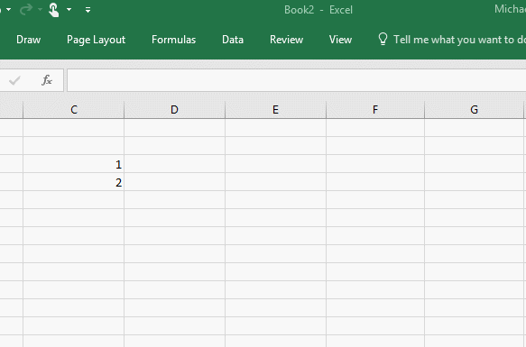

# <a name="create-custom-functions-in-excel-preview"></a>Создание пользовательских функций в Excel (ознакомительная версия)

Пользовательские функции позволяют разработчикам добавлять новые функции в Excel, посредством определения этих функций в JavaScript как части надстройки. Пользователи в Excel могут получить доступ к пользовательским функциям так же, как и к любой встроенной функции в Excel, например `SUM()`. В этой статье описано создание специальных функций в Excel.

[!include[Excel custom functions note](../includes/excel-custom-functions-note.md)]

Ниже продемонстрировано, как конечный пользователь, вставляет настраиваемую функцию в ячейке на листе Excel. Настраиваемая функция `CONTOSO.ADD42` предназначена для добавления 42 к паре чисел, которые пользователь указывает в качестве входных параметров для функции.



Приведенный ниже код определяет настраиваемую функцию `ADD42`.

```js
function add42(a, b) {
  return a + b + 42;
}
```

> [!NOTE]
> В разделе [Известные проблемы](#known-issues) далее в этой статье определены текущие ограничения для пользовательских функций.

## <a name="components-of-a-custom-functions-add-in-project"></a>Компоненты пользовательские функции для надстройки проекта.

Если вы используете [генератор Yo Office](https://github.com/OfficeDev/generator-office) для создания в Excel проекта с пользовательскими функциями, вы обнаружите, что он создает файлы, управляющие вашими функциями, областью задач и надстройкой в целом. Мы сосредоточимся на файлах, которые важны для пользовательских функций: 

| Файл | Формат файла | Описание |
|------|-------------|-------------|
| **./src/functions/functions.js**<br/>или<br/>**./src/functions/functions.ts** | JavaScript<br/>или<br/>TypeScript | Содержит код, который определяет пользовательские функции. |
| **./src/functions/functions.html** | HTML | Предоставляет &lt;скрипт&gt; со ссылкой на файл JavaScript, который определяет пользовательские функции. |
| **./manifest.xml** | XML | Определяет пространство имен для всех пользовательских функций в надстройке и расположение JavaScript и HTML-файлов, которые указаны ранее в этой таблице. Он также перечисляет расположения других файлов, которые могут использоваться надстройкой, например файлы области задач и командные файлы. |

### <a name="script-file"></a>Файл скрипта

Файл скрипта (**./src/functions/functions.js** или **./src/functions/functions.ts** в проекте, созданном генератором Yo Office) содержит код, определяющий пользовательские функции, комментарии, определяющие функцию, и сопоставляет имена пользовательских функций с объектами в файле метаданных JSON.

Указанный ниже код определяет пользовательскую функцию `add` и указывает информацию о сопоставлении для функции. Дополнительные сведения о сопоставлении функций см. в статье [Рекомендации по пользовательским функциям](custom-functions-best-practices.md#associating-function-names-with-json-metadata).

В следующем коде также представлены комментарии кода, определяющие функцию. Обязательный комментарий `@customfunction` объявлен первым, чтобы указать, что это пользовательская функция. Вы также увидите два объявленных параметра (`first` и `second`), за которыми следуют их свойства `description`. Наконец, дается описание `returns`. Дополнительные сведения о том, какие комментарии являются обязательными для вашей пользовательской функции, см. в статье [Создание метаданных JSON для пользовательских функций](custom-functions-json-autogeneration.md).

```js
/**
 * Adds two numbers.
 * @customfunction 
 * @param first First number
 * @param second Second number
 * @returns The sum of the two numbers.
 */

function add(first, second){
  return first + second;
}

// associate `id` values in the JSON metadata file to the JavaScript function names
 CustomFunctions.associate("ADD", add);
```

### <a name="manifest-file"></a>Файл манифеста

XML-файл манифеста для надстройки, который определяет пользовательские функции (**./manifest.xml** в проекте, который создает генератор Yo Office) и определяет пространство имен для всех пользовательских функций в надстройке, а также расположение файлов JavaScript, JSON и HTML. 

Базовая XML-разметка ниже представляет пример элементов `<ExtensionPoint>` и `<Resources>`, которые необходимо включить в манифест надстройки, чтобы активировать пользовательские функции. Если вы используете генератор Yo Office, созданные файлы пользовательской функции будут содержать более сложный файл манифеста, который можно сравнить в этом [репозитории Github](https://github.com/OfficeDev/Excel-Custom-Functions/blob/generate-metadata/manifest.xml).

> [!NOTE] 
> URL-адреса, указанные в файле манифеста для пользовательских функций файлов JavaScript, JSON и HTML, должны быть общедоступными и иметь один поддомен.

```xml
<?xml version="1.0" encoding="UTF-8" standalone="yes"?>
<OfficeApp xmlns="http://schemas.microsoft.com/office/appforoffice/1.1" xmlns:xsi="http://www.w3.org/2001/XMLSchema-instance" xmlns:bt="http://schemas.microsoft.com/office/officeappbasictypes/1.0" xmlns:ov="http://schemas.microsoft.com/office/taskpaneappversionoverrides" xsi:type="TaskPaneApp">
  <Id>6f4e46e8-07a8-4644-b126-547d5b539ece</Id>
  <Version>1.0.0.0</Version>
  <ProviderName>Contoso</ProviderName>
  <DefaultLocale>en-US</DefaultLocale>
  <DisplayName DefaultValue="helloworld"/>
  <Description DefaultValue="Samples to test custom functions"/>
  <Hosts>
    <Host Name="Workbook"/>
  </Hosts>
  <DefaultSettings>
    <SourceLocation DefaultValue="https://localhost:8081/index.html"/>
  </DefaultSettings>
  <Permissions>ReadWriteDocument</Permissions>
  <VersionOverrides xmlns="http://schemas.microsoft.com/office/taskpaneappversionoverrides" xsi:type="VersionOverridesV1_0">
    <Hosts>
      <Host xsi:type="Workbook">
        <AllFormFactors>
          <ExtensionPoint xsi:type="CustomFunctions">
            <Script>
              <SourceLocation resid="JS-URL"/>
            </Script>
            <Page>
              <SourceLocation resid="HTML-URL"/>
            </Page>
            <Metadata>
              <SourceLocation resid="JSON-URL"/>
            </Metadata>
            <Namespace resid="namespace"/>
          </ExtensionPoint>
        </AllFormFactors>
      </Host>
    </Hosts>
    <Resources>
      <bt:Urls>
        <bt:Url id="JSON-URL" DefaultValue="https://subdomain.contoso.com/config/customfunctions.json"/>
        <bt:Url id="JS-URL" DefaultValue="https://subdomain.contoso.com/dist/win32/ship/index.win32.bundle"/>
        <bt:Url id="HTML-URL" DefaultValue="https://subdomain.contoso.com/index.html"/>
      </bt:Urls>
      <bt:ShortStrings>
        <bt:String id="namespace" DefaultValue="CONTOSO"/>
      </bt:ShortStrings>
    </Resources>
  </VersionOverrides>
</OfficeApp>
```

> [!NOTE]
> Функции в Excel имеют в начале пространство имен, указанное в XML-файле манифеста. Пространство имен функции предшествует названию функции, и они будут разделены точкой. Например, чтобы вызвать функцию `ADD42` в ячейке на листе Excel, введите `=CONTOSO.ADD42`, так как `CONTOSO` является пространством имен, а `ADD42` — это имя функции, определяемой в JSON-файл. Пространство имен служит в качестве идентификатора для вашей компании или надстройки. Пространство имен может содержать только буквы, цифры и точки.

## <a name="declaring-a-volatile-function"></a>Объявление переменной функции

[Переменные функции](/office/client-developer/excel/excel-recalculation#volatile-and-non-volatile-functions) — это функции, значение которых периодически изменяется, даже если никакой из аргументов функции не меняется. Эти функции пересчитываются при каждом пересчете в Excel. К примеру, представьте себе ячейку, вызывающую функцию `NOW`. При каждом вызове `NOW` она будет автоматически возвращать текущую дату и время.

В Excel есть несколько встроенных переменных функций, таких как `RAND` и `TODAY`. Полный список переменных функций Excel см. в статье [Переменные и постоянные функции](/office/client-developer/excel/excel-recalculation#volatile-and-non-volatile-functions).

Пользовательские функции позволяют создавать собственные переменные функции, которые могут быть полезны при обработке дат, времени, случайных чисел и моделировании. Например, при моделированиях методом Монте-Карло требуется создание случайных входных данных, чтобы определить оптимальное решение.

Чтобы объявить функцию переменной, добавьте `"volatile": true` в объект `options` для функции в файле метаданных JSON, как показано в приведенном ниже примере кода. Обратите внимание, что функция не может одновременно иметь значения `"streaming": true` и `"volatile": true`. Если оба параметра помечены как `true`, параметр переменности будет игнорироваться.

```json
{
 "id": "TOMORROW",
  "name": "TOMORROW",
  "description":  "Returns tomorrow’s date",
  "helpUrl": "http://www.contoso.com",
  "result": {
      "type": "string",
      "dimensionality": "scalar"
  },
  "options": {
      "volatile": true
  }
}
```

## <a name="saving-and-sharing-state"></a>Состояние сохранения и совместного использования

Пользовательские функции могут сохранять данные в глобальных переменных JavaScript, которые можно использовать в последующих вызовах. Сохраненное состояние полезно, когда пользователи вызывают одни и те же настраиваемые функций из более чем одной ячейки, так как все экземпляры функции могут получить доступ к состоянию. Например, вы можете сохранить данные, возвращенные при вызове веб-ресурса, чтобы не пришлось обеспечивать выполнение дополнительных вызовов.

В приведенном ниже примере кода показана реализация вышеописанной функции передачи температуры, сохраняющей состояние с помощью глобальной переменной. Обратите внимание на следующие особенности этого кода:

- Функция `streamTemperature` обновляет значение температуры, которое отображается в ячейке, каждую секунду и использует переменную `savedTemperatures` как источник данных.

- Так как `streamTemperature` — это функция потоковой передачи, она реализует обработчик отмены, который будет запускаться, если функция была отменена.

- Если пользователь вызывает функцию `streamTemperature` из нескольких ячеек в Excel, функция `streamTemperature` считывает данные из той же самой переменной `savedTemperatures` при каждом запуске. 

- Функция `refreshTemperature` ежесекундно считывает температуру определенного термометра и сохраняет результат в переменной `savedTemperatures`. Так как функция `refreshTemperature` недоступна для конечных пользователей в Excel, ее не нужно регистрировать в JSON-файле.

```js
var savedTemperatures;

function streamTemperature(thermometerID, handler){
  if(!savedTemperatures[thermometerID]){
    refreshTemperature(thermometerID); // starts fetching temperatures if the thermometer hasn't been read yet
  }

  function getNextTemperature(){
    handler.setResult(savedTemperatures[thermometerID]); // setResult sends the saved temperature value to Excel.
    var delayTime = 1000; // Amount of milliseconds to delay a request by.
    setTimeout(getNextTemperature, delayTime); // Wait 1 second before updating Excel again.

    handler.onCancelled() = function {
      clearTimeout(delayTime);
    }
  }
  getNextTemperature();
}

function refreshTemperature(thermometerID){
  sendWebRequest(thermometerID, function(data){
    savedTemperatures[thermometerID] = data.temperature;
  });
  setTimeout(function(){
    refreshTemperature(thermometerID);
  }, 1000); // Wait 1 second before reading the thermometer again, and then update the saved temperature of thermometerID.
}
```

## <a name="coauthoring"></a>Совместное редактирование

Excel Online и Excel для Windows с подпиской на Office 365 позволяют совместно редактировать документы. Эта функция работает с пользовательскими функциями. Если в книге используется пользовательская функция, вашему коллеге будет предложено загрузить надстройку пользовательской функции. Когда вы оба загрузите надстройку, пользовательская функция поделится результатами с помощью совместного редактирования.

Дополнительные сведения о совместном редактировании см. в статье [О совместном редактировании в Excel](/office/vba/excel/concepts/about-coauthoring-in-excel).

## <a name="working-with-ranges-of-data"></a>Работа с диапазонами данных

Ваша пользовательская функция может принимать широкий диапазон данных в виде входных параметров или возвращать широкий диапазон данных. В JavaScript диапазон данных будет иметь вид двумерного массива.

Например, предположим, что функция возвращает второе по величине значение из диапазона значений, хранящихся в Excel. Приведенная ниже функция принимает параметр `values`, относящийся к типу `Excel.CustomFunctionDimensionality.matrix`. Обратите внимание, что в метаданных JSON для данной функции вам следует задать для параметра свойство `type` в `matrix`.

```js
function secondHighest(values){
  let highest = values[0][0], secondHighest = values[0][0];
  for(var i = 0; i < values.length; i++){
    for(var j = 1; j < values[i].length; j++){
      if(values[i][j] >= highest){
        secondHighest = highest;
        highest = values[i][j];
      }
      else if(values[i][j] >= secondHighest){
        secondHighest = values[i][j];
      }
    }
  }
  return secondHighest;
}
```

## <a name="determine-which-cell-invoked-your-custom-function"></a>Определение того, какая ячейка вызывала пользовательскую функцию

В некоторых случаях вам потребуется получить адрес ячейки, которая вызывала пользовательскую функцию. Это может быть полезно в следующих типах сценариев:

- Форматирование диапазонов: Используйте адрес ячейки в качестве ключа для хранения сведений в [AsyncStorage](/office/dev/add-ins/excel/custom-functions-runtime#storing-and-accessing-data). После этого используйте событие [onCalculated](/javascript/api/excel/excel.worksheet#oncalculated) в Excel, чтобы загрузить ключ из `AsyncStorage`.
- Отображение кэшированных значений. Если функция используется в автономном режиме, отображайте сохраненные в кэше значения из `AsyncStorage` с помощью `onCalculated`.
- Сверка: используйте адрес ячейки, чтобы найти исходную ячейку, чтобы упростить сверку при выполнении обработки.

Сведения об адресе ячейки предоставляются только в том случае, если параметру `requiresAddress` присвоено значение `true` в файле метаданных JSON функции. Ниже приведен пример:

```JSON
{
   "id": "ADDTIME",
   "name": "ADDTIME",
   "description": "Display current date and add the amount of hours to it designated by the parameter",
   "helpUrl": "http://www.contoso.com",
   "result": {
      "type": "number",
      "dimensionality": "scalar"
   },
   "parameters": [
      {
         "name": "Additional time",
         "description": "Amount of hours to increase current date by",
         "type": "number",
         "dimensionality": "scalar"
      }
   ],
   "options": {
      "requiresAddress": true
   }
}
```

Чтобы найти адрес ячейки, в файл скрипта (**./src/functions/functions.js** или **./src/functions/functions.ts**) потребуется также добавить функцию `getAddress`. В этой функции можно использовать параметры, как показано в примере ниже в виде `parameter1`. В качестве последнего параметра всегда будет использоваться `invocationContext` — объект, содержащий расположение ячейки, которое передает приложение Excel, если параметру `requiresAddress` присвоено значение `true` в файле метаданных JSON.

```js
function getAddress(parameter1, invocationContext) {
    return invocationContext.address;
}
```

По умолчанию значения, возвращаемые из функции `getAddress`, соответствуют следующему формату: `SheetName!CellNumber`. Например, если функция вызвана с листа с названием Expenses (Расходы) в ячейке B2, возвращаемым значением будет `Expenses!B2`.

## <a name="known-issues"></a>Известные проблемы

С известными проблемами можно ознакомиться в нашем [репозитории GitHub, посвященном пользовательским функциям в Excel](https://github.com/OfficeDev/Excel-Custom-Functions/issues).

## <a name="see-also"></a>См. также

* [Метаданные пользовательских функций](custom-functions-json.md)
* [Среда выполнения для пользовательских функций Excel](custom-functions-runtime.md)
* [Рекомендации в отношении пользовательских функций](custom-functions-best-practices.md)
* [Журнал изменений пользовательских функций](custom-functions-changelog.md)
* [Руководство по пользовательским функциям в Excel](../tutorials/excel-tutorial-create-custom-functions.md)
* [Отладка пользовательских функций](custom-functions-debugging.md)
