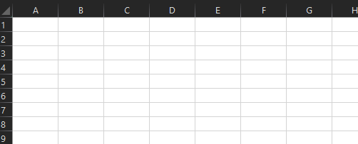

# <a name="volatile-values-in-functions"></a>Пересчитываемые значения в функциях

Летучие функции — это функции, в которых значение меняется при каждом расчете ячейки. Значение может измениться, даже если ни один из аргументов функции не изменится. Эти функции пересчитываются при каждом пересчете в Excel. К примеру, представьте себе ячейку, вызывающую функцию `NOW`. При каждом вызове `NOW` она будет автоматически возвращать текущую дату и время.

[!include[Excel custom functions note](../includes/excel-custom-functions-note.md)]

В Excel есть несколько встроенных переменных функций, таких как `RAND` и `TODAY`. Полный список переменных функций Excel см. в статье [Переменные и постоянные функции](/office/client-developer/excel/excel-recalculation#volatile-and-non-volatile-functions).

Настраиваемые функции позволяют создавать собственные летучие функции, которые могут быть полезны при обработке дат, времени, случайных чисел и моделирования. Например, [моделирование Монте-Карло](https://en.wikipedia.org/wiki/Monte_Carlo_method) требует генерации случайных входных данных для определения оптимального решения.

Если вы решили автогенерировать файл JSON, заявите о волатильной функции с помощью тега комментариев JSDoc. `@volatile` Дополнительные сведения об автогенерации см. в [метаданных Autogenerate JSON для пользовательских функций.](custom-functions-json-autogeneration.md)

Пример волатильной настраиваемой функции, которая имитирует развертывание шестистолковой кости.



```JS
/**
 * Simulates rolling a 6-sided dice.
 * @customfunction
 * @volatile
 */
function roll6sided() {
  return Math.floor(Math.random() * 6) + 1;
}
```

## <a name="next-steps"></a>Следующие шаги
* Узнайте о [настраиваемом параметре функций](custom-functions-parameter-options.md).

## <a name="see-also"></a>Дополнительные материалы

* [Вручную создайте метаданные JSON для пользовательских функций](custom-functions-json.md)
* [Создание пользовательских функций в Excel](custom-functions-overview.md)
