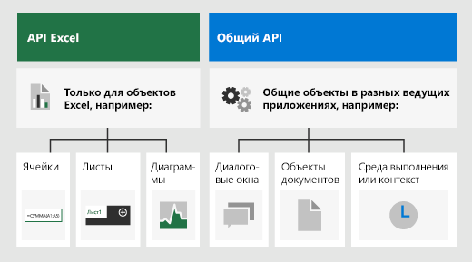

# <a name="advanced-programming-concepts-with-the-excel-javascript-api"></a>Дополнительные концепции программирования с помощью API JavaScript для Excel

Эта статья является продолжением статьи [Основные концепции программирования с помощью API JavaScript для Excel](excel-add-ins-core-concepts.md). В ней описываются более сложные понятия, необходимые для создания сложных надстроек для Excel 2016 или более поздней версии.

## <a name="officejs-apis-for-excel"></a>Интерфейсы API Office.js для Excel

Надстройка Excel взаимодействует с объектами в Excel с помощью API JavaScript для Office, включающего две объектных модели JavaScript:

* **API JavaScript для Excel**. Появившийся в Office 2016 [API JavaScript для Excel](/office/dev/add-ins/reference/overview/excel-add-ins-reference-overview) предоставляет строго типизированные объекты, с помощью которых можно получать доступ к листам, диапазонам, таблицам, диаграммам и другим объектам.

* **Общие API**. Появившиеся в Office 2013 [общие API](/javascript/api/office) можно использовать для доступа к таким компонентам, как пользовательский интерфейс, диалоговые окна и параметры клиентов, общие для нескольких типов приложений Office.

Скорее всего, вы будете разрабатывать большую часть функций надстроек для Excel 2016 или более поздней версии с помощью API JavaScript для Excel, но вам также потребуются объекты из общего API. Пример:

- [Context](/javascript/api/office/office.context). Объект **Context** представляет среду выполнения надстройки и предоставляет доступ к ключевым объектам API. Он состоит из данных конфигурации книги, например `contentLanguage` и `officeTheme`, а также предоставляет сведения о среде выполнения надстройки, например `host` и `platform`. Кроме того, он предоставляет метод `requirements.isSetSupported()`, с помощью которого можно проверить, поддерживается ли указанный набор обязательных элементов приложением Excel, в котором работает надстройка.

- [Document](/javascript/api/office/office.document). Объект **Document** предоставляет метод `getFileAsync()`, позволяющий скачать файл Excel, в котором работает надстройка.

На рисунке ниже показано, когда можно использовать API JavaScript для Excel или общие API.



## <a name="requirement-sets"></a>Наборы обязательных элементов

Наборы обязательных элементов — это именованные группы элементов API. Надстройка Office может выполнить проверку в среде выполнения или использовать указанные в манифесте наборы обязательных элементов, чтобы определить, поддерживает ли ведущее приложение Office необходимые надстройке API. Сведения о том, какие именно наборы обязательных элементов доступны на каждой поддерживаемой платформе, см. в статье [Наборы обязательных элементов API JavaScript для Excel](/office/dev/add-ins/reference/requirement-sets/excel-api-requirement-sets).

### <a name="checking-for-requirement-set-support-at-runtime"></a>Проверка поддержки наборов обязательных элементов в среде выполнения

В приведенном ниже примере кода показано, как определить, поддерживает ли ведущее приложение надстройки указанный набор обязательных элементов API.

```js
if (Office.context.requirements.isSetSupported('ExcelApi', '1.3')) {
  /// perform actions
}
else {
  /// provide alternate flow/logic
}
```

### <a name="defining-requirement-set-support-in-the-manifest"></a>Определение поддержки наборов обязательных элементов в манифесте

С помощью [элемента Requirements](/office/dev/add-ins/reference/manifest/requirements) в манифесте надстройки можно указать минимальные наборы обязательных элементов и/или методы API, необходимые надстройке для активации. Если платформа или ведущее приложение Office не поддерживает наборы обязательных элементов или методы API, указанные в элементе **Requirements** манифеста, надстройка не будет работать в этом ведущем приложении или на этой платформе, а также не будет отображаться в списке надстроек в разделе **Мои надстройки**.

В приведенном ниже примере кода показан элемент **Requirements** в манифесте надстройки, где указано, что надстройка должна загружаться во всех ведущих приложениях Office, поддерживающих набор обязательных элементов ExcelApi версии 1.3 или выше.

```xml
<Requirements>
   <Sets DefaultMinVersion="1.3">
      <Set Name="ExcelApi" MinVersion="1.3"/>
   </Sets>
</Requirements>
```

> [!NOTE]
> Чтобы надстройка была доступна на всех платформах ведущего приложения Office, например интернет-версия Excel, Excel для Windows и для iPad, рекомендуем проверять поддержку обязательных элементов в среде выполнения, а не определять поддержку набора обязательных элементов в манифесте.

### <a name="requirement-sets-for-the-officejs-common-api"></a>Наборы обязательных элементов общего API JavaScript для Office

Сведения о наборах обязательных элементов общего API см. в статье [Наборы обязательных элементов общего API для Office](/office/dev/add-ins/reference/requirement-sets/office-add-in-requirement-sets).

## <a name="loading-the-properties-of-an-object"></a>Загрузка свойств объекта

Вызов метода `load()` для объекта JavaScript в Excel сообщает API, что требуется загрузить объект в память JavaScript при выполнении метода `sync()`. Метод `load()` принимает строку, содержащую разделенные запятыми имена свойств, которые требуется загрузить, или объект, указывающий загружаемые свойства, параметры разбивки на страницы и т. д.

> [!NOTE]
> Если вызвать метод `load()` для объекта (или коллекции), не указывая параметры, то будут загружены все скалярные свойства объекта (или все скалярные свойства всех объектов в коллекции). Чтобы сократить количество данных, передаваемых между ведущим приложением Excel и надстройкой, следует избегать вызовов метода `load()` без явного указания загружаемых свойств.

### <a name="method-details"></a>Сведения о методе

#### <a name="loadparam-object"></a>load(param: объект)

Заполняет прокси-объект, созданный в слое JavaScript, значениями свойства и объекта, указанными в параметрах.

#### <a name="syntax"></a>Синтаксис

```js
object.load(param);
```

#### <a name="parameters"></a>Параметры

|**Параметр**|**Тип**|**Описание**|
|:------------|:-------|:----------|
|`param`|объект|Необязательный параметр. Принимает имена свойств в виде строки с разделителями-запятыми или массива. Кроме того, можно передать объект, чтобы задать свойства выделения и навигации (как показано в приведенном ниже примере).|

#### <a name="returns"></a>Возвращаемое значение

void

#### <a name="example"></a>Пример

В приведенном ниже примере кода показано, как задать свойства одного диапазона в Excel, скопировав их из другого. Обратите внимание, что для начала необходимо загрузить исходный объект, чтобы можно было получить доступ к значениям его свойств и записать их в целевой диапазон. В этом примере предполагается, что два диапазона (**B2:E2** и **B7:E7**) содержат данные, а их форматирование изначально отличается.

```js
Excel.run(function (ctx) {
    var sheet = ctx.workbook.worksheets.getItem("Sample");
    var sourceRange = sheet.getRange("B2:E2");
    sourceRange.load("format/fill/color, format/font/name, format/font/color");

    return ctx.sync()
        .then(function () {
            var targetRange = sheet.getRange("B7:E7");
            targetRange.set(sourceRange);
            targetRange.format.autofitColumns();

            return ctx.sync();
        });
}).catch(function(error) {
    console.log("Error: " + error);
    if (error instanceof OfficeExtension.Error) {
        console.log("Debug info: " + JSON.stringify(error.debugInfo));
    }
});
```

### <a name="load-option-properties"></a>Загрузка свойств параметров

Вместо того чтобы передавать строку с разделителями-запятыми или массив при вызове метода `load()`, можно передать объект, содержащий указанные ниже свойства.

|**Свойство**|**Тип**|**Описание**|
|:-----------|:-------|:----------|
|`select`|объект|Содержит массив или разделенный запятыми список имен скалярных свойств. Необязательный параметр.|
|`expand`|объект|Содержит массив или разделенный запятыми список имен свойств навигации. Необязательный параметр.|
|`top`|целое| Указывает максимальное число элементов в коллекции, которые можно включить в результат. Необязательный параметр. Его можно применять, только если используется параметр нотации объектов.|
|`skip`|int|Укажите количество элементов в коллекции, которые необходимо пропустить и исключить из результата. Если указан параметр `top`, результирующий набор начнется после пропуска заданного числа элементов. Необязательный. Его можно применять, только если используется параметр нотации объектов.|

В следующем примере кода показано, как загрузить коллекцию листов, выбрав свойства `name` и `address` используемого диапазона для каждого листа в коллекции. В нем также указано, что следует загружать только пять верхних листов в коллекции. Для обработки следующих пяти листов можно указать для атрибутов значения `top: 10` и `skip: 5`.

```js
myWorksheets.load({
    select: 'name, userRange/address',
    expand: 'tables',
    top: 5,
    skip: 0
});
```

## <a name="scalar-and-navigation-properties"></a>Скалярные и навигационные свойства

Существует две категории свойств: **скалярные** и **навигационные**. К скалярным свойствам относятся назначаемые типы, такие как строки, целые числа и структуры JSON. Свойства навигации — это объекты и коллекции объектов только для чтения, которым назначаются поля вместо прямого назначения свойства. Например, элементы `name` и `position` объекта [Worksheet](/javascript/api/excel/excel.worksheet) являются скалярными свойствами, а `protection` и `tables` — свойствами навигации. Элемент `prompt` в объекте [DataValidation](/javascript/api/excel/excel.datavalidation) является примером скалярного свойства, которое требуется устанавливать с помощью объекта JSON (`dv.prompt = { title: "MyPrompt"}`) вместо настройки подсвойств (`dv.prompt.title = "MyPrompt" // will not set the title`).

### <a name="scalar-properties-and-navigation-properties-with-objectload"></a>Скалярные и навигационные свойства с методом `object.load()`

При вызове метода `object.load()` без указания параметров загружаются все скалярные свойства объекта. Свойства навигации объекта не загружаются. Кроме того, свойства навигации невозможно загружать напрямую. Вместо этого следует использовать метод `load()`, чтобы ссылаться на отдельные скалярные свойства в нужном свойстве навигации. Например, чтобы загрузить имя шрифта для диапазона, необходимо указать свойства навигации **format** и **font** в качестве пути к свойству **name**:

```js
someRange.load("format/font/name")
```

> [!NOTE]
> С помощью API JavaScript для Excel можно задавать скалярные свойства из навигационного свойства по пути к ним. Например, вы можете задать размер шрифта для диапазона с помощью команды `someRange.format.font.size = 10;`. Чтобы задать свойство, необязательно загружать его. 

## <a name="setting-properties-of-an-object"></a>Установка свойств объекта

Установка свойств объекта с вложенными свойствами навигации может быть трудоемкой задачей. Вместо того чтобы задавать отдельные свойства с помощью путей навигации, как описано выше, вы можете использовать метод `object.set()`, доступный для всех объектов в API JavaScript для Excel. С помощью этого метода можно задать сразу несколько свойств объекта, передавая другой объект того же типа Office.js или объект JavaScript со свойствами, сходными по структуре со свойствами объекта, для которого вызывается метод.

> [!NOTE]
> Метод `set()` реализован только для объектов API JavaScript для Office в определенных ведущих приложениях, таких как API JavaScript для Excel. Общие API не поддерживают этот метод. 

### <a name="set-properties-object-options-object"></a>set (properties: объект, options: объект)

Свойствам объекта, для которого вызывается метод, присваиваются те же значения, что и соответствующим свойствам переданного объекта. Если параметр `properties` является объектом JavaScript, любое свойство в переданном объекте, соответствующее нередактируемому свойству в объекте, для которого вызывается метод, либо игнорируется, либо приводит к возникновению исключения, в зависимости от значения параметра `options`.

#### <a name="syntax"></a>Синтаксис

```js
object.set(properties[, options]);
```

#### <a name="parameters"></a>Параметры

|**Параметр**|**Тип**|**Описание**|
|:------------|:--------|:----------|
|`properties`|объект|Либо объект того же типа Office.js, что и объект, для которого вызывается метод, либо объект JavaScript, имена и типы свойств которого повторяют структуру объекта, для которого вызывается метод.|
|`options`|объект|Необязательный параметр. Может передаваться, только если первый параметр является объектом JavaScript. Объект может содержать следующее свойство: `throwOnReadOnly?: boolean` (по умолчанию — `true`: если переданный объект JavaScript включает нередактируемые свойства, возникает ошибка.)|

#### <a name="returns"></a>Возвращаемое значение

void

#### <a name="example"></a>Пример

В приведенном ниже примере кода показано, как задать несколько свойств формата диапазона, вызвав метод `set()` и передав в него объект JavaScript, имена и типы свойств которого повторяют структуру свойств объекта **Range**. В этом примере предполагается, что данные находятся в диапазоне **B2:E2**.

```js
Excel.run(function (ctx) {
    var sheet = ctx.workbook.worksheets.getItem("Sample");
    var range = sheet.getRange("B2:E2");
    range.set({
        format: {
            fill: {
                color: '#4472C4'
            },
            font: {
                name: 'Verdana',
                color: 'white'
            }
        }
    });
    range.format.autofitColumns();

    return ctx.sync();
}).catch(function(error) {
    console.log("Error: " + error);
    if (error instanceof OfficeExtension.Error) {
        console.log("Debug info: " + JSON.stringify(error.debugInfo));
    }
});
```

## <a name="42ornullobject-methods"></a>Методы &#42;OrNullObject

Многие методы API JavaScript для Excel возвращают исключение, если условие API не соблюдается. Например, если для получения листа указать имя листа, не существующее в книге, то метод `getItem()` вернет исключение `ItemNotFound`. 

Вместо того чтобы реализовывать сложную логику обработки исключений для такого сценария, можно использовать вариант метода `*OrNullObject`, доступный для нескольких методов в API JavaScript для Excel. Если указанный элемент не существует, метод `*OrNullObject` возвращает нулевой объект (не объект JavaScript `null`), вместо того чтобы возвращать исключение. Например, вы можете вызвать метод `getItemOrNullObject()` для коллекции, например **Worksheets**, чтобы попробовать получить элемент из коллекции. Метод `getItemOrNullObject()` возвращает указанный элемент, если он существует. В противном случае возвращается нулевой объект. Возвращаемый нулевой объект содержит логическое свойство `isNullObject`, с помощью которого можно определить, существует ли объект.

В приведенном ниже примере кода осуществляется попытка получить лист Data с помощью метода `getItemOrNullObject()`. Если метод возвращает нулевой объект, то, прежде чем выполнять какие-либо действия с листом, его необходимо создать.

```js
var dataSheet = context.workbook.worksheets.getItemOrNullObject("Data");

return context.sync()
  .then(function() {
    if (dataSheet.isNullObject) {
        // Create the sheet
    }

    dataSheet.position = 1;
    //...
  })
```

## <a name="see-also"></a>См. также

* [Основные концепции программирования с помощью API JavaScript для Excel](excel-add-ins-core-concepts.md)
* [Примеры кода надстроек Excel](https://developer.microsoft.com/office/gallery/?filterBy=Samples,Excel)
* [Оптимизация производительности API JavaScript для Excel](performance.md)
* [Справочник по API JavaScript для Excel](/office/dev/add-ins/reference/overview/excel-add-ins-reference-overview)
