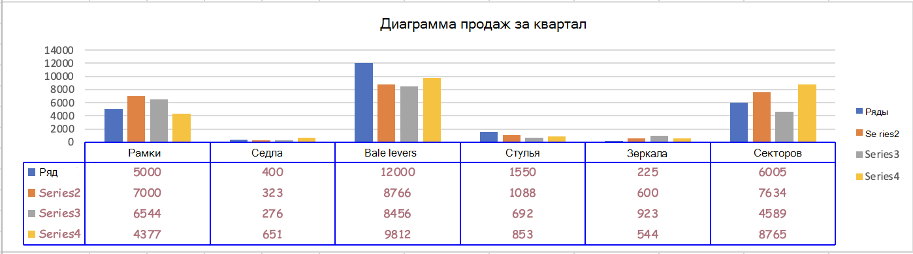

# <a name="work-with-charts-using-the-excel-javascript-api"></a>Работа с диаграммами с использованием API JavaScript для Excel

В этой статье приведены примеры кода, в которых показано, как выполнять стандартные задачи для диаграмм с использованием API JavaScript для Excel.
Полный список свойств и методов, поддерживаемых объектами и объектами, см. в таблице [Chart Object (API JavaScript для Excel)](/javascript/api/excel/excel.chart) и Объект коллекции диаграмм [(API JavaScript](/javascript/api/excel/excel.chartcollection) для Excel).`Chart` `ChartCollection`

## <a name="create-a-chart"></a>Создание диаграммы

В примере кода ниже показано, как создать диаграмму на листе **Sample** (Пример). Диаграмма представляет собой **график**, построенный на основе данных из диапазона **A1:B13**.

```js
await Excel.run(async (context) => {
    let sheet = context.workbook.worksheets.getItem("Sample");
    let dataRange = sheet.getRange("A1:B13");
    let chart = sheet.charts.add(
      Excel.ChartType.line, 
      dataRange, 
      Excel.ChartSeriesBy.auto);

    chart.title.text = "Sales Data";
    chart.legend.position = Excel.ChartLegendPosition.right;
    chart.legend.format.fill.setSolidColor("white");
    chart.dataLabels.format.font.size = 15;
    chart.dataLabels.format.font.color = "black";

    await context.sync();
});
```

### <a name="new-line-chart"></a>Новый график


## <a name="add-a-data-series-to-a-chart"></a>Добавление ряда данных в диаграмму

В примере кода ниже показано, как добавить ряд данных в первую диаграмму на листе. Новый ряд данных соответствует столбцу **2016** и основан на данных из диапазона **D2:D5**.

```js
await Excel.run(async (context) => {
    let sheet = context.workbook.worksheets.getItem("Sample");
    let chart = sheet.charts.getItemAt(0);
    let dataRange = sheet.getRange("D2:D5");

    let newSeries = chart.series.add("2016");
    newSeries.setValues(dataRange);

    await context.sync();
});
```

### <a name="chart-before-the-2016-data-series-is-added"></a>Диаграмма перед добавлением ряда данных 2016


### <a name="chart-after-the-2016-data-series-is-added"></a>Диаграмма после добавления ряда данных 2016


## <a name="set-chart-title"></a>Задание названия диаграммы

В примере ниже показано, как задать название **Sales Data by Year** (Данные продаж по годам) для первой диаграммы на листе.

```js
await Excel.run(async (context) => {
    let sheet = context.workbook.worksheets.getItem("Sample");

    let chart = sheet.charts.getItemAt(0);
    chart.title.text = "Sales Data by Year";

    await context.sync();
});
```

### <a name="chart-after-title-is-set"></a>Диаграмма после задания заголовка


## <a name="set-properties-of-an-axis-in-a-chart"></a>Задание свойств оси диаграммы

Диаграммы, в которых используется [декартова система координат](https://en.wikipedia.org/wiki/Cartesian_coordinate_system), например гистограммы, линейчатые и точечные диаграммы, содержат ось категорий и ось значений. В примерах ниже показано, как задать название и отобразить единицу измерения по оси для диаграммы.

### <a name="set-axis-title"></a>Задание названия оси

В примере кода ниже показано, как задать название **Product** (Продукт) для оси категорий первой диаграммы на листе.

```js
await Excel.run(async (context) => {
    let sheet = context.workbook.worksheets.getItem("Sample");

    let chart = sheet.charts.getItemAt(0);
    chart.axes.categoryAxis.title.text = "Product";

    await context.sync();
});
```

### <a name="chart-after-title-of-category-axis-is-set"></a>Диаграмма после задания названия оси категорий


### <a name="set-axis-display-unit"></a>Задание отображаемой единицы измерения оси

В примере ниже показано, как задать отображаемую единицу измерения **Hundreds** (Сотни) для оси значений первой диаграммы на листе.

```js
await Excel.run(async (context) => {
    let sheet = context.workbook.worksheets.getItem("Sample");

    let chart = sheet.charts.getItemAt(0);
    chart.axes.valueAxis.displayUnit = "Hundreds";

    await context.sync();
});
```

### <a name="chart-after-display-unit-of-value-axis-is-set"></a>Диаграмма после задания единицы измерения оси значений


## <a name="set-visibility-of-gridlines-in-a-chart"></a>Настройка видимости линий сетки на диаграмме

В примере ниже показано, как скрыть основные линии сетки для оси значений первой диаграммы на листе. Основные линии сетки для оси значения диаграммы можно показать, `chart.axes.valueAxis.majorGridlines.visible` установив значение `true`.

```js
await Excel.run(async (context) => {
    let sheet = context.workbook.worksheets.getItem("Sample");

    let chart = sheet.charts.getItemAt(0);
    chart.axes.valueAxis.majorGridlines.visible = false;

    await context.sync();
});
```

### <a name="chart-with-gridlines-hidden"></a>Диаграмма со скрытыми линиями сетки


## <a name="chart-trendlines"></a>Линии трендов диаграммы

### <a name="add-a-trendline"></a>Добавление линии тренда

В примере кода ниже показано, как добавить линию тренда "скользящее среднее" в первый ряд первой диаграммы на листе **Sample** (Пример). Линия тренда отображает "скользящее среднее" за 5 периодов.

```js
await Excel.run(async (context) => {
    let sheet = context.workbook.worksheets.getItem("Sample");

    let chart = sheet.charts.getItemAt(0);
    let seriesCollection = chart.series;
    seriesCollection.getItemAt(0).trendlines.add("MovingAverage").movingAveragePeriod = 5;

    await context.sync();
});
```

#### <a name="chart-with-moving-average-trendline"></a>Диаграмма с линией тренда "скользящее среднее"


### <a name="update-a-trendline"></a>Изменение линии тренда

Следующий пример кода задает линию тренда `Linear` для введите для первой серии в первой диаграмме в таблице с именем **Sample**.

```js
await Excel.run(async (context) => {
    let sheet = context.workbook.worksheets.getItem("Sample");

    let chart = sheet.charts.getItemAt(0);
    let seriesCollection = chart.series;
    let series = seriesCollection.getItemAt(0);
    series.trendlines.getItem(0).type = "Linear";

    await context.sync();
});
```

#### <a name="chart-with-linear-trendline"></a>Диаграмма с линейной линией тренда


## <a name="add-and-format-a-chart-data-table"></a>Добавление и формат таблицы данных диаграммы

С помощью метода можно получить доступ к элементу таблицы данных диаграммы [`Chart.getDataTableOrNullObject`](/javascript/api/excel/excel.chart#excel-excel-chart-getdatatableornullobject-member(1)) . Этот метод возвращает объект [`ChartDataTable`](/javascript/api/excel/excel.chartdatatable) . Объект `ChartDataTable` имеет свойства форматирования boolean, такие как `visible`, и `showLegendKey``showHorizontalBorder`.

Свойство `ChartDataTable.format` возвращает объект [`ChartDataTableFormat`](/javascript/api/excel/excel.chartdatatableformat) , что позволяет далее форматирование и стиль таблицы данных. Объект `ChartDataTableFormat` предлагает `border`и `fill`свойства `font` .

В следующем примере кода показано, как добавить таблицу данных в диаграмму, а затем форматировать эту таблицу данных с помощью объектов `ChartDataTable` и объектов `ChartDataTableFormat` .

```js
// This code sample adds a data table to a chart that already exists on the worksheet, 
// and then adjusts the display and format of that data table.
await Excel.run(async (context) => {
    // Retrieve the chart on the "Sample" worksheet.
    let chart = context.workbook.worksheets.getItem("Sample").charts.getItemAt(0);

    // Get the chart data table object and load its properties.
    let chartDataTable = chart.getDataTableOrNullObject();
    chartDataTable.load();

    // Set the display properties of the chart data table.
    chartDataTable.visible = true;
    chartDataTable.showLegendKey = true;
    chartDataTable.showHorizontalBorder = false;
    chartDataTable.showVerticalBorder = true;
    chartDataTable.showOutlineBorder = true;

    // Retrieve the chart data table format object and set font and border properties. 
    let chartDataTableFormat = chartDataTable.format;
    chartDataTableFormat.font.color = "#B76E79";
    chartDataTableFormat.font.name = "Comic Sans";
    chartDataTableFormat.border.color = "blue";

    await context.sync();
});
```

На следующем скриншоте показана таблица данных, которую создает предыдущий пример кода.



## <a name="export-a-chart-as-an-image"></a>Экспорт диаграммы как изображения

Диаграммы можно отображать как изображения за пределами Excel. Метод `Chart.getImage` возвращает диаграмму в виде строки в кодировке base64, представляющей диаграмму в формате изображения JPEG. В приведенном ниже коде показано, как получить строку изображения и записать ее в консоли.

```js
await Excel.run(async (context) => {
    let chart = context.workbook.worksheets.getItem("Sheet1").charts.getItem("Chart1");
    let imageAsString = chart.getImage();
    await context.sync();
    
    console.log(imageAsString.value);
    // Instead of logging, your add-in may use the base64-encoded string to save the image as a file or insert it in HTML.
});
```

Метод `Chart.getImage` использует три дополнительных параметра: ширина, высота и режим подгонки.

```typescript
getImage(width?: number, height?: number, fittingMode?: Excel.ImageFittingMode): OfficeExtension.ClientResult<string>;
```

Эти параметры определяют размер изображения. Изображения всегда масштабируются пропорционально. Параметры ширины и высоты устанавливают верхние или нижние границы для масштабированного изображения. `ImageFittingMode` имеет три значения со следующими действиями.

- `Fill`: Минимальная высота или ширина изображения — указанная высота или ширина (в зависимости от того, достигается ли она сначала при масштабирования изображения). Это поведение по умолчанию, если не задан параметр режима подгонки.
- `Fit`: Максимальная высота или ширина изображения — указанная высота или ширина (в зависимости от того, достигается ли она сначала при масштабирования изображения).
- `FitAndCenter`: Максимальная высота или ширина изображения — указанная высота или ширина (в зависимости от того, достигается ли она сначала при масштабирования изображения). Получившееся изображение выравнивается по центру относительно другого измерения.

## <a name="see-also"></a>См. также

- [Объектная модель JavaScript для Excel в надстройках Office](excel-add-ins-core-concepts.md)
