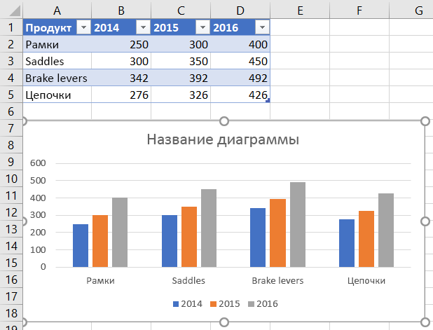
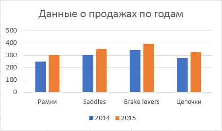
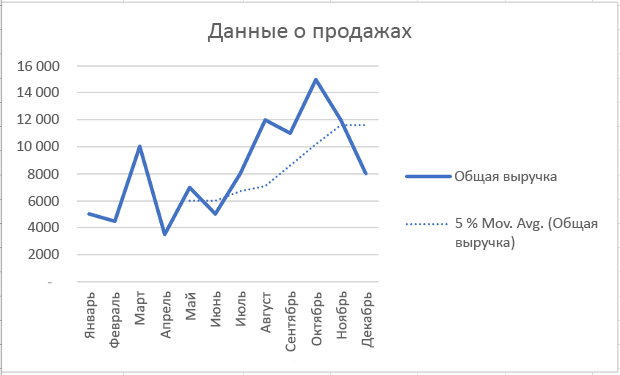

# <a name="work-with-charts-using-the-excel-javascript-api"></a><span data-ttu-id="d83f4-103">Работа с диаграммами с использованием API JavaScript для Excel</span><span class="sxs-lookup"><span data-stu-id="d83f4-103">Work with charts using the Excel JavaScript API</span></span>

<span data-ttu-id="d83f4-104">В этой статье приведены примеры кода, в которых показано, как выполнять стандартные задачи для диаграмм с использованием API JavaScript для Excel.</span><span class="sxs-lookup"><span data-stu-id="d83f4-104">This article provides code samples that show how to perform common tasks with charts using the Excel JavaScript API.</span></span>
<span data-ttu-id="d83f4-105">Полный список свойств и методов, поддерживаемых объектами и объектами, см. в таблице `Chart` `ChartCollection` Chart Object [(API JavaScript](/javascript/api/excel/excel.chart) для Excel) и Объект коллекции диаграмм [(API JavaScript](/javascript/api/excel/excel.chartcollection)для Excel).</span><span class="sxs-lookup"><span data-stu-id="d83f4-105">For the complete list of properties and methods that the `Chart` and `ChartCollection` objects support, see [Chart Object (JavaScript API for Excel)](/javascript/api/excel/excel.chart) and [Chart Collection Object (JavaScript API for Excel)](/javascript/api/excel/excel.chartcollection).</span></span>

## <a name="create-a-chart"></a><span data-ttu-id="d83f4-106">Создание диаграммы</span><span class="sxs-lookup"><span data-stu-id="d83f4-106">Create a chart</span></span>

<span data-ttu-id="d83f4-p102">В примере кода ниже показано, как создать диаграмму на листе **Sample** (Пример). Диаграмма представляет собой **график**, построенный на основе данных из диапазона **A1:B13**.</span><span class="sxs-lookup"><span data-stu-id="d83f4-p102">The following code sample creates a chart in the worksheet named **Sample**. The chart is a **Line** chart that is based upon data in the range **A1:B13**.</span></span>

```js
Excel.run(function (context) {
    var sheet = context.workbook.worksheets.getItem("Sample");
    var dataRange = sheet.getRange("A1:B13");
    var chart = sheet.charts.add("Line", dataRange, "auto");

    chart.title.text = "Sales Data";
    chart.legend.position = "right"
    chart.legend.format.fill.setSolidColor("white");
    chart.dataLabels.format.font.size = 15;
    chart.dataLabels.format.font.color = "black";

    return context.sync();
}).catch(errorHandlerFunction);
```

<span data-ttu-id="d83f4-109">**Новый график**</span><span class="sxs-lookup"><span data-stu-id="d83f4-109">**New line chart**</span></span>


## <a name="add-a-data-series-to-a-chart"></a><span data-ttu-id="d83f4-111">Добавление ряда данных в диаграмму</span><span class="sxs-lookup"><span data-stu-id="d83f4-111">Add a data series to a chart</span></span>

<span data-ttu-id="d83f4-p103">В примере кода ниже показано, как добавить ряд данных в первую диаграмму на листе. Новый ряд данных соответствует столбцу **2016** и основан на данных из диапазона **D2:D5**.</span><span class="sxs-lookup"><span data-stu-id="d83f4-p103">The following code sample adds a data series to the first chart in the worksheet. The new data series corresponds to the column named **2016** and is based upon data in the range **D2:D5**.</span></span>

```js
Excel.run(function (context) {
    var sheet = context.workbook.worksheets.getItem("Sample");
    var chart = sheet.charts.getItemAt(0);
    var dataRange = sheet.getRange("D2:D5");

    var newSeries = chart.series.add("2016");
    newSeries.setValues(dataRange);

    return context.sync();
}).catch(errorHandlerFunction);
```

<span data-ttu-id="d83f4-114">**Диаграмма перед добавлением ряда данных 2016**</span><span class="sxs-lookup"><span data-stu-id="d83f4-114">**Chart before the 2016 data series is added**</span></span>


<span data-ttu-id="d83f4-116">**Диаграмма после добавления ряда данных 2016**</span><span class="sxs-lookup"><span data-stu-id="d83f4-116">**Chart after the 2016 data series is added**</span></span>



## <a name="set-chart-title"></a><span data-ttu-id="d83f4-118">Задание названия диаграммы</span><span class="sxs-lookup"><span data-stu-id="d83f4-118">Set chart title</span></span>

<span data-ttu-id="d83f4-119">В примере ниже показано, как задать название **Sales Data by Year** (Данные продаж по годам) для первой диаграммы на листе.</span><span class="sxs-lookup"><span data-stu-id="d83f4-119">The following code sample sets the title of the first chart in the worksheet to **Sales Data by Year**.</span></span>

```js
Excel.run(function (context) {
    var sheet = context.workbook.worksheets.getItem("Sample");

    var chart = sheet.charts.getItemAt(0);
    chart.title.text = "Sales Data by Year";

    return context.sync();
}).catch(errorHandlerFunction);
```

<span data-ttu-id="d83f4-120">**Диаграмма после задания заголовка**</span><span class="sxs-lookup"><span data-stu-id="d83f4-120">**Chart after title is set**</span></span>



## <a name="set-properties-of-an-axis-in-a-chart"></a><span data-ttu-id="d83f4-122">Задание свойств оси диаграммы</span><span class="sxs-lookup"><span data-stu-id="d83f4-122">Set properties of an axis in a chart</span></span>

<span data-ttu-id="d83f4-p104">Диаграммы, в которых используется [декартова система координат](https://en.wikipedia.org/wiki/Cartesian_coordinate_system), например гистограммы, линейчатые и точечные диаграммы, содержат ось категорий и ось значений. В примерах ниже показано, как задать название и отобразить единицу измерения по оси для диаграммы.</span><span class="sxs-lookup"><span data-stu-id="d83f4-p104">Charts that use the [Cartesian coordinate system](https://en.wikipedia.org/wiki/Cartesian_coordinate_system) such as column charts, bar charts, and scatter charts contain a category axis and a value axis. These examples show how to set the title and display unit of an axis in a chart.</span></span>

### <a name="set-axis-title"></a><span data-ttu-id="d83f4-125">Задание названия оси</span><span class="sxs-lookup"><span data-stu-id="d83f4-125">Set axis title</span></span>

<span data-ttu-id="d83f4-126">В примере кода ниже показано, как задать название **Product** (Продукт) для оси категорий первой диаграммы на листе.</span><span class="sxs-lookup"><span data-stu-id="d83f4-126">The following code sample sets the title of the category axis for the first chart in the worksheet to **Product**.</span></span>

```js
Excel.run(function (context) {
    var sheet = context.workbook.worksheets.getItem("Sample");

    var chart = sheet.charts.getItemAt(0);
    chart.axes.categoryAxis.title.text = "Product";

    return context.sync();
}).catch(errorHandlerFunction);
```

<span data-ttu-id="d83f4-127">**Диаграмма после задания названия оси категорий**</span><span class="sxs-lookup"><span data-stu-id="d83f4-127">**Chart after title of category axis is set**</span></span>


### <a name="set-axis-display-unit"></a><span data-ttu-id="d83f4-129">Задание отображаемой единицы измерения оси</span><span class="sxs-lookup"><span data-stu-id="d83f4-129">Set axis display unit</span></span>

<span data-ttu-id="d83f4-130">В примере ниже показано, как задать отображаемую единицу измерения **Hundreds** (Сотни) для оси значений первой диаграммы на листе.</span><span class="sxs-lookup"><span data-stu-id="d83f4-130">The following code sample sets the display unit of the value axis for the first chart in the worksheet to **Hundreds**.</span></span>

```js
Excel.run(function (context) {
    var sheet = context.workbook.worksheets.getItem("Sample");

    var chart = sheet.charts.getItemAt(0);
    chart.axes.valueAxis.displayUnit = "Hundreds";

    return context.sync();
}).catch(errorHandlerFunction);
```

<span data-ttu-id="d83f4-131">**Диаграмма после задания единицы измерения оси значений**</span><span class="sxs-lookup"><span data-stu-id="d83f4-131">**Chart after display unit of value axis is set**</span></span>


## <a name="set-visibility-of-gridlines-in-a-chart"></a><span data-ttu-id="d83f4-133">Настройка видимости линий сетки на диаграмме</span><span class="sxs-lookup"><span data-stu-id="d83f4-133">Set visibility of gridlines in a chart</span></span>

<span data-ttu-id="d83f4-134">В примере ниже показано, как скрыть основные линии сетки для оси значений первой диаграммы на листе.</span><span class="sxs-lookup"><span data-stu-id="d83f4-134">The following code sample hides the major gridlines for the value axis of the first chart in the worksheet.</span></span> <span data-ttu-id="d83f4-135">Основные линии сетки для оси значения диаграммы можно показать, установив `chart.axes.valueAxis.majorGridlines.visible` значение `true` .</span><span class="sxs-lookup"><span data-stu-id="d83f4-135">You can show the major gridlines for the value axis of the chart, by setting `chart.axes.valueAxis.majorGridlines.visible` to `true`.</span></span>

```js
Excel.run(function (context) {
    var sheet = context.workbook.worksheets.getItem("Sample");

    var chart = sheet.charts.getItemAt(0);
    chart.axes.valueAxis.majorGridlines.visible = false;

    return context.sync();
}).catch(errorHandlerFunction);
```

<span data-ttu-id="d83f4-136">**Диаграмма со скрытыми линиями сетки**</span><span class="sxs-lookup"><span data-stu-id="d83f4-136">**Chart with gridlines hidden**</span></span>


## <a name="chart-trendlines"></a><span data-ttu-id="d83f4-138">Линии трендов диаграммы</span><span class="sxs-lookup"><span data-stu-id="d83f4-138">Chart trendlines</span></span>

### <a name="add-a-trendline"></a><span data-ttu-id="d83f4-139">Добавление линии тренда</span><span class="sxs-lookup"><span data-stu-id="d83f4-139">Add a trendline</span></span>

<span data-ttu-id="d83f4-p106">В примере кода ниже показано, как добавить линию тренда "скользящее среднее" в первый ряд первой диаграммы на листе **Sample** (Пример). Линия тренда отображает "скользящее среднее" за 5 периодов.</span><span class="sxs-lookup"><span data-stu-id="d83f4-p106">The following code sample adds a moving average trendline to the first series in the first chart in the worksheet named **Sample**. The trendline shows a moving average over 5 periods.</span></span>

```js
Excel.run(function (context) {
    var sheet = context.workbook.worksheets.getItem("Sample");

    var chart = sheet.charts.getItemAt(0);
    var seriesCollection = chart.series;
    seriesCollection.getItemAt(0).trendlines.add("MovingAverage").movingAveragePeriod = 5;

    return context.sync();
}).catch(errorHandlerFunction);
```

<span data-ttu-id="d83f4-142">**Диаграмма с линией тренда "скользящее среднее"**</span><span class="sxs-lookup"><span data-stu-id="d83f4-142">**Chart with moving average trendline**</span></span>



### <a name="update-a-trendline"></a><span data-ttu-id="d83f4-144">Изменение линии тренда</span><span class="sxs-lookup"><span data-stu-id="d83f4-144">Update a trendline</span></span>

<span data-ttu-id="d83f4-145">Следующий пример кода задает линию тренда для введите для первой серии в первой диаграмме в таблице `Linear` с именем **Sample**.</span><span class="sxs-lookup"><span data-stu-id="d83f4-145">The following code sample sets the trendline to type `Linear` for the first series in the first chart in the worksheet named **Sample**.</span></span>

```js
Excel.run(function (context) {
    var sheet = context.workbook.worksheets.getItem("Sample");

    var chart = sheet.charts.getItemAt(0);
    var seriesCollection = chart.series;
    var series = seriesCollection.getItemAt(0);
    series.trendlines.getItem(0).type = "Linear";

    return context.sync();
}).catch(errorHandlerFunction);
```

<span data-ttu-id="d83f4-146">**Диаграмма с линейной линией тренда**</span><span class="sxs-lookup"><span data-stu-id="d83f4-146">**Chart with linear trendline**</span></span>


## <a name="export-a-chart-as-an-image"></a><span data-ttu-id="d83f4-148">Экспорт диаграммы как изображения</span><span class="sxs-lookup"><span data-stu-id="d83f4-148">Export a chart as an image</span></span>

<span data-ttu-id="d83f4-149">Диаграммы можно отображать как изображения за пределами Excel.</span><span class="sxs-lookup"><span data-stu-id="d83f4-149">Charts can be rendered as images outside of Excel.</span></span> <span data-ttu-id="d83f4-150">Метод `Chart.getImage` возвращает диаграмму в виде строки в кодировке base64, представляющей диаграмму в формате изображения JPEG.</span><span class="sxs-lookup"><span data-stu-id="d83f4-150">`Chart.getImage` returns the chart as a base64-encoded string representing the chart as a JPEG image.</span></span> <span data-ttu-id="d83f4-151">В приведенном ниже коде показано, как получить строку изображения и записать ее в консоли.</span><span class="sxs-lookup"><span data-stu-id="d83f4-151">The following code shows how to get the image string and log it to the console.</span></span>

```js
Excel.run(function (ctx) {
    var chart = ctx.workbook.worksheets.getItem("Sheet1").charts.getItem("Chart1");
    var imageAsString = chart.getImage();
    return context.sync().then(function () {
        console.log(imageAsString.value);
        // Instead of logging, your add-in may use the base64-encoded string to save the image as a file or insert it in HTML.
    });
}).catch(errorHandlerFunction);
```

<span data-ttu-id="d83f4-152">Метод `Chart.getImage` использует три дополнительных параметра: ширина, высота и режим подгонки.</span><span class="sxs-lookup"><span data-stu-id="d83f4-152">`Chart.getImage` takes three optional parameters: width, height, and the fitting mode.</span></span>

```typescript
getImage(width?: number, height?: number, fittingMode?: Excel.ImageFittingMode): OfficeExtension.ClientResult<string>;
```

<span data-ttu-id="d83f4-153">Эти параметры определяют размер изображения.</span><span class="sxs-lookup"><span data-stu-id="d83f4-153">These parameters determine the size of the image.</span></span> <span data-ttu-id="d83f4-154">Изображения всегда масштабируются пропорционально.</span><span class="sxs-lookup"><span data-stu-id="d83f4-154">Images are always proportionally scaled.</span></span> <span data-ttu-id="d83f4-155">Параметры ширины и высоты устанавливают верхние или нижние границы для масштабированного изображения.</span><span class="sxs-lookup"><span data-stu-id="d83f4-155">The width and height parameters put upper or lower bounds on the scaled image.</span></span> <span data-ttu-id="d83f4-156">У параметра `ImageFittingMode` есть три значения с указанными ниже действиями.</span><span class="sxs-lookup"><span data-stu-id="d83f4-156">`ImageFittingMode` has three values with the following behaviors:</span></span>

- <span data-ttu-id="d83f4-157">`Fill`: Минимальная высота или ширина изображения — указанная высота или ширина (в зависимости от того, достигается ли она сначала при масштабирования изображения).</span><span class="sxs-lookup"><span data-stu-id="d83f4-157">`Fill`: The image's minimum height or width is the specified height or width (whichever is reached first when scaling the image).</span></span> <span data-ttu-id="d83f4-158">Это поведение по умолчанию, если не задан параметр режима подгонки.</span><span class="sxs-lookup"><span data-stu-id="d83f4-158">This is the default behavior when no fitting mode is specified.</span></span>
- <span data-ttu-id="d83f4-159">`Fit`: Максимальная высота или ширина изображения — указанная высота или ширина (в зависимости от того, достигается ли она сначала при масштабирования изображения).</span><span class="sxs-lookup"><span data-stu-id="d83f4-159">`Fit`: The image's maximum height or width is the specified height or width (whichever is reached first when scaling the image).</span></span>
- <span data-ttu-id="d83f4-160">`FitAndCenter`: Максимальная высота или ширина изображения — указанная высота или ширина (в зависимости от того, достигается ли она сначала при масштабирования изображения).</span><span class="sxs-lookup"><span data-stu-id="d83f4-160">`FitAndCenter`: The image's maximum height or width is the specified height or width (whichever is reached first when scaling the image).</span></span> <span data-ttu-id="d83f4-161">Получившееся изображение выравнивается по центру относительно другого измерения.</span><span class="sxs-lookup"><span data-stu-id="d83f4-161">The resulting image is centered relative to the other dimension.</span></span>

## <a name="see-also"></a><span data-ttu-id="d83f4-162">См. также</span><span class="sxs-lookup"><span data-stu-id="d83f4-162">See also</span></span>

- [<span data-ttu-id="d83f4-163">Объектная модель JavaScript для Excel в надстройках Office</span><span class="sxs-lookup"><span data-stu-id="d83f4-163">Excel JavaScript object model in Office Add-ins</span></span>](excel-add-ins-core-concepts.md)
