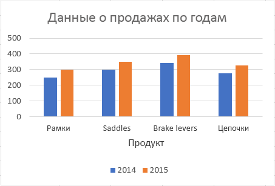

# <a name="work-with-charts-using-the-excel-javascript-api"></a>Работа с диаграммами с использованием API JavaScript для Excel

 В этой статье приведены примеры кода, в которых показано, как выполнять стандартные задачи для диаграмм с помощью API JavaScript для Excel. Полный список свойств и методов, которые поддерживают объекты **Chart** и **ChartCollection** см. в разделах [Объект Chart (API JavaScript для Excel)](https://docs.microsoft.com/javascript/api/excel/excel.chart?view=office-js) и [Объект Chart Collection (API JavaScript для Excel)](https://docs.microsoft.com/javascript/api/excel/excel.chartcollection?view=office-js).

## <a name="create-a-chart"></a>Создание диаграммы

В следующем примере кода показано, как создать диаграмму на листе **Sample**. Диаграмма представляет собой **график**, построенный на основе данных из диапазона **A1:B13**.

```js
Excel.run(function (context) {
    var sheet = context.workbook.worksheets.getItem("Sample");
    var dataRange = sheet.getRange("A1:B13");
    var chart = sheet.charts.add("Line", dataRange, "auto");

    chart.title.text = "Sales Data";
    chart.legend.position = "right"
    chart.legend.format.fill.setSolidColor("white");
    chart.dataLabels.format.font.size = 15;
    chart.dataLabels.format.font.color = "black";

    return context.sync();
}).catch(errorHandlerFunction);
```

**Новый график**


## <a name="add-a-data-series-to-a-chart"></a>Добавление ряда данных в диаграмму

В следующем примере кода показано, как добавить ряд данных в первую диаграмму на листе. Новый ряд данных соответствует столбцу **2016** и основан на данных из диапазона **D2:D5**.

```js
Excel.run(function (context) {
    var sheet = context.workbook.worksheets.getItem("Sample");
    var chart = sheet.charts.getItemAt(0);
    var dataRange = sheet.getRange("D2:D5");

    var newSeries = chart.series.add("2016");
    newSeries.setValues(dataRange);

    return context.sync();
}).catch(errorHandlerFunction);
```

**Диаграмма перед добавлением ряда данных 2016**


**Диаграмма после добавления ряда данных 2016**


## <a name="set-chart-title"></a>Задание названия диаграммы

В примере кода ниже показано, как задать название **Sales Data by Year** (Данные продаж по годам) для первой диаграммы на листе. 

```js
Excel.run(function (context) {
    var sheet = context.workbook.worksheets.getItem("Sample");

    var chart = sheet.charts.getItemAt(0);
    chart.title.text = "Sales Data by Year";

    return context.sync();
}).catch(errorHandlerFunction);
```

**Диаграмма после задания названия**


## <a name="set-properties-of-an-axis-in-a-chart"></a>Задание свойств оси диаграммы

Диаграммы, в которых используется [декартова система координат](https://en.wikipedia.org/wiki/Cartesian_coordinate_system), например гистограммы, линейчатые и точечные диаграммы, содержат ось категорий и ось значений. В примерах ниже показано, как задать название и отобразить единицу измерения по оси для диаграммы.

### <a name="set-axis-title"></a>Задание названия оси

В примере кода ниже показано, как задать название **Product** (Продукт) для оси категорий первой диаграммы на листе.

```js
Excel.run(function (context) {
    var sheet = context.workbook.worksheets.getItem("Sample");

    var chart = sheet.charts.getItemAt(0);
    chart.axes.categoryAxis.title.text = "Product";

    return context.sync();
}).catch(errorHandlerFunction);
```

**Диаграмма после задания названия оси категорий**



### <a name="set-axis-display-unit"></a>Задание отображаемой единицы измерения оси

В примере ниже показано, как задать отображаемую единицу измерения **Hundreds** (Сотни) для оси значений первой диаграммы на листе.

```js
Excel.run(function (context) {
    var sheet = context.workbook.worksheets.getItem("Sample");

    var chart = sheet.charts.getItemAt(0);
    chart.axes.valueAxis.displayUnit = "Hundreds";

    return context.sync();
}).catch(errorHandlerFunction);
```

**Диаграмма после задания единицы измерения оси значений**


## <a name="set-visibility-of-gridlines-in-a-chart"></a>Настройка видимости линий сетки на диаграмме

В примере ниже показано, как скрыть основные линии сетки для оси значений первой диаграммы на листе. Вы можете отобразить основные линии сетки для оси значений диаграммы, задав для свойства `chart.axes.valueAxis.majorGridlines.visible` значение **true**.

```js
Excel.run(function (context) {
    var sheet = context.workbook.worksheets.getItem("Sample");

    var chart = sheet.charts.getItemAt(0);
    chart.axes.valueAxis.majorGridlines.visible = false;

    return context.sync();
}).catch(errorHandlerFunction);
```

**Диаграмма со скрытыми линиями сетки**


## <a name="chart-trendlines"></a>Линии тренда диаграммы

### <a name="add-a-trendline"></a>Добавление линии тренда

В примере кода ниже показано, как добавить линию тренда «скользящее среднее» в первый ряд первой диаграммы на листе **Sample** (Пример). Линия тренда отображает «скользящее среднее» за 5 периодов.

```js
Excel.run(function (context) {
    var sheet = context.workbook.worksheets.getItem("Sample");

    var chart = sheet.charts.getItemAt(0);
    var seriesCollection = chart.series;
    seriesCollection.getItemAt(0).trendlines.add("MovingAverage").movingAveragePeriod = 5;

    return context.sync();
}).catch(errorHandlerFunction);
```

**Диаграмма с линией тренда «скользящее среднее»**


### <a name="update-a-trendline"></a>Обновление линии тренда

В примере кода ниже показано, как задать для линии тренда тип **Linear** (Линейная) для первого ряда первой диаграммы на листе **Sample** (Пример).

```js
Excel.run(function (context) {
    var sheet = context.workbook.worksheets.getItem("Sample");

    var chart = sheet.charts.getItemAt(0);
    var seriesCollection = chart.series;
    var series = seriesCollection.getItemAt(0);
    series.trendlines.getItem(0).type = "Linear";

    return context.sync();
}).catch(errorHandlerFunction);
```

**Диаграмма с линейной линией тренда**


## <a name="see-also"></a>См. также

- [Основные принципы программирования с помощью API JavaScript для Excel](excel-add-ins-core-concepts.md)
