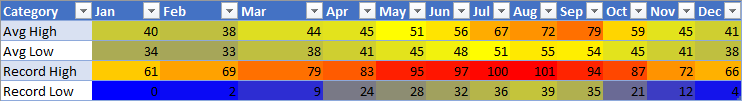

# <a name="apply-conditional-formatting-to-excel-ranges"></a>Применение условного форматирования к диапазонам Excel

Библиотека JavaScript Excel предоставляет API для применения условного форматирования к диапазонам данных в книгах. Эта функция упрощает визуальный анализ больших наборов данных. Форматирование также динамически обновляется с учетом изменений в диапазоне. 

> [!NOTE]
> В этой статье рассматривается условное форматирование в контексте надстроек JavaScript для Excel. В указанных ниже статьях представлены подробные сведения о всех возможностях условного форматирования в Excel.
> -  [Добавление, изменение или удаление условного форматирования](https://support.office.com/article/add-change-or-clear-conditional-formats-8a1cc355-b113-41b7-a483-58460332a1af)
> -  [Использование формул с условным форматированием](https://support.office.com/article/Use-formulas-with-conditional-formatting-FED60DFA-1D3F-4E13-9ECB-F1951FF89D7F)

## <a name="programmatic-control-of-conditional-formatting"></a>Программное управление условным форматированием

Свойство `Range.conditionalFormats` — это коллекция объектов [ConditionalFormat](/javascript/api/excel/excel.conditionalformat), применяемых к диапазону.  Объект `ConditionalFormat` содержит несколько свойств, определяющих применяемый формат на основе [ConditionalFormatType](/javascript/api/excel/excel.conditionalformattype). 

-    `cellValue`
-    `colorScale`
-    `custom`
-    `dataBar`
-    `iconSet`
-    `preset`
-    `textComparison`
-    `topBottom`

> [!NOTE]
> У каждого из этих свойств форматирования есть соответствующий вариант `*OrNullObject`. Дополнительные сведения об этом шаблоне см. в разделе [Методы *OrNullObject](../excel/excel-add-ins-advanced-concepts.md#ornullobject-methods).

Для объекта ConditionalFormat можно установить только один тип формата. Это определено свойством `type`, которое является значением перечисления объекта [ConditionalFormatType](/javascript/api/excel/excel.conditionalformattype). Параметр `type` устанавливается при добавлении условного форматирования к диапазону. 

## <a name="creating-conditional-formatting-rules"></a>Создание правил условного форматирования

Условное форматирование добавляется к диапазону с помощью `conditionalFormats.add`. После добавления можно задать свойства, относящиеся к условному форматированию. В примерах ниже показано создание различных типов форматирования.

### <a name="cell-value"></a>[Значение ячейки](/javascript/api/excel/excel.cellvalueconditionalformat)

При условном форматировании значения ячейки применяется пользовательский формат на основе результатов одной или двух формул в [ConditionalCellValueRule](/javascript/api/excel/excel.conditionalcellvaluerule). Свойство `operator` является оператором [ConditionalCellValueOperator](/javascript/api/excel/excel.conditionalcellvalueoperator), который определяет, как итоговое выражение связано с форматированием.

В приведенном ниже примере показано применение красного шрифта ко всем значениям диапазона, которые меньше нуля.


```typescript
const sheet = context.workbook.worksheets.getItem("Sample");
const range = sheet.getRange("B21:E23");
const conditionalFormat = range.conditionalFormats.add(
    Excel.ConditionalFormatType.cellValue
);

// set the font of negative numbers to red
conditionalFormat.cellValue.format.font.color = "red";
conditionalFormat.cellValue.rule = { formula1: "=0", operator: "LessThan" };

await context.sync();
```

### <a name="color-scale"></a>[Цветовая шкала](/javascript/api/excel/excel.colorscaleconditionalformat)

При условном форматировании с использованием цветовой шкалы применяется цветовой градиент в диапазоне данных. Свойство `criteria` в `ColorScaleConditionalFormat` определяет три точки [ConditionalColorScaleCriterion](/javascript/api/excel/excel.conditionalcolorscalecriterion): `minimum`, `maximum` и (при желании) `midpoint`. У каждой точки условия есть три свойства:

-    `color` — HTML-код цвета для конечной точки.
-    `formula` — число или формула, представляющая значение конечной точки. Оно будет равным `null`, если `type` имеет значение `lowestValue` или `highestValue`.
-    `type` — способ оценки формулы. `highestValue` и `lowestValue` относятся к значениям в форматируемом диапазоне.

В приведенном ниже примере показан диапазон, окрашенный с переходом от синего к желтому и красному цвету. Обратите внимание, что `minimum` и `maximum` являются минимальным и максимальным значением соответственно, и для них используются формулы `null`. Для значения `midpoint` используется тип `percentage` с формулой `"=50"`, чтобы самая желтая ячейка соответствовала среднему значению.



```typescript
const sheet = context.workbook.worksheets.getItem("Sample");
const range = sheet.getRange("B2:M5");
const conditionalFormat = range.conditionalFormats.add(
      Excel.ConditionalFormatType.colorScale
);

// color the backgrounds of the cells from blue to yellow to red based on value
const criteria = {
      minimum: {
           formula: null,
           type: Excel.ConditionalFormatColorCriterionType.lowestValue,
           color: "blue"
      },
      midpoint: {
           formula: "50",
           type: Excel.ConditionalFormatColorCriterionType.percent,
           color: "yellow"
      },
      maximum: {
           formula: null,
           type: Excel.ConditionalFormatColorCriterionType.highestValue,
           color: "red"
      }
};
conditionalFormat.colorScale.criteria = criteria;

await context.sync();
```

### <a name="custom"></a>[Пользовательское](/javascript/api/excel/excel.customconditionalformat)

При пользовательском условном форматировании применяется пользовательский формат к ячейкам на основе формулы произвольной сложности. Объект [ConditionalFormatRule](/javascript/api/excel/excel.conditionalformatrule) позволяет определять формулу в разных нотациях:

-    `formula` — стандартная нотация.
-    `formulaLocal`— Локализовано на основе языка пользователя.
-    `formulaR1C1` — нотация R1C1.

В приведенном ниже примере зеленым цветом окрашен шрифт ячеек с более высокими значениями, чем в ячейках слева.


```typescript
const sheet = context.workbook.worksheets.getItem("Sample");
const range = sheet.getRange("B8:E13");
const conditionalFormat = range.conditionalFormats.add(
     Excel.ConditionalFormatType.custom
);

// if a cell has a higher value than the one to its left, set that cell's font to green
conditionalFormat.custom.rule.formula = '=IF(B8>INDIRECT("RC[-1]",0),TRUE)';
conditionalFormat.custom.format.font.color = "green";

await context.sync();

```
### <a name="data-bar"></a>[Гистограмма](/javascript/api/excel/excel.databarconditionalformat)

При условном форматировании с использованием гистограмм они добавляются к ячейкам. По умолчанию минимальное и максимальное значения в диапазоне создают границы и пропорциональные размеры гистограмм. У `DataBarConditionalFormat` объекта есть несколько свойств для управления внешним видом полосы. 

В приведенном ниже примере используется форматирование с помощью гистограмм с заполнением слева направо.


```typescript
const sheet = context.workbook.worksheets.getItem("Sample");
const range = sheet.getRange("B8:E13");
const conditionalFormat = range.conditionalFormats.add(
     Excel.ConditionalFormatType.dataBar
);

// give left-to-right, default-appearance data bars to all the cells
conditionalFormat.dataBar.barDirection = Excel.ConditionalDataBarDirection.leftToRight;
await context.sync();
```

### <a name="icon-set"></a>[Набор значков](/javascript/api/excel/excel.iconsetconditionalformat)

При условном форматировании с набором значков используются [значки](/javascript/api/excel/excel.icon) Excel для выделения ячеек. Свойство `criteria` — это массив объекта [ConditionalIconCriterion](/javascript/api/excel/excel.ConditionalIconCriterion), определяющий добавляемый символ и условия для добавления. Этот массив автоматически заполняется элементами условия со свойствами по умолчанию. Отдельные свойства не могут быть перезаписаны. Вместо этого необходимо заменить весь объект условия. 

В приведенном ниже примере показано применение в диапазоне набора из трех значков с треугольниками.


```typescript
const sheet = context.workbook.worksheets.getItem("Sample");
const range = sheet.getRange("B8:E13");
const conditionalFormat = range.conditionalFormats.add(
     Excel.ConditionalFormatType.iconSet
);

const iconSetCF = conditionalFormat.iconSet;
iconSetCF.style = Excel.IconSet.threeTriangles;

/*
   With a "three*" icon set style, such as "threeTriangles", the third
    element in the criteria array (criteria[2]) defines the "top" icon;
    e.g., a green triangle. The second (criteria[1]) defines the "middle"
    icon, The first (criteria[0]) defines the "low" icon, but it can often 
    be left empty as this method does below, because every cell that
   does not match the other two criteria always gets the low icon.
*/
iconSetCF.criteria = [
    {} as any,
      {
        type: Excel.ConditionalFormatIconRuleType.number,
        operator: Excel.ConditionalIconCriterionOperator.greaterThanOrEqual,
        formula: "=700"
      },
      {
        type: Excel.ConditionalFormatIconRuleType.number,
        operator: Excel.ConditionalIconCriterionOperator.greaterThanOrEqual,
        formula: "=1000"
      }
];

await context.sync();
```

### <a name="preset-criteria"></a>[Готовые условия](/javascript/api/excel/excel.presetcriteriaconditionalformat)

При условном форматировании с готовыми условиями применяется пользовательский формат к диапазону на основе выбранного стандартного правила. Эти правила определяются с помощью [ConditionalFormatPresetCriterion](/javascript/api/excel/excel.ConditionalFormatPresetCriterion) в [ConditionalPresetCriteriaRule](/javascript/api/excel/excel.conditionalpresetcriteriarule). 

В следующем примере цвета белого шрифта задается в том месте, где значение ячейки равно по крайней мере одному стандартному отклонению от среднего.


```typescript
const sheet = context.workbook.worksheets.getItem("Sample");
const range = sheet.getRange("B2:M5");
const conditionalFormat = range.conditionalFormats.add(
     Excel.ConditionalFormatType.presetCriteria
);

// color every cell's font white that is one standard deviation above average relative to the range
conditionalFormat.preset.format.font.color = "white";
conditionalFormat.preset.rule = {
     criterion: Excel.ConditionalFormatPresetCriterion.oneStdDevAboveAverage
};

await context.sync();
```

### <a name="text-comparison"></a>[Сравнение текста](/javascript/api/excel/excel.textconditionalformat)

При условном форматировании со сравнением текста используется сравнение строк в качестве условия. Свойство `rule` является объектом [ConditionalTextComparisonRule](/javascript/api/excel/excel.conditionaltextcomparisonrule), определяющим строку для сравнения с ячейкой и оператор для указания типа сравнения. 

В примере ниже показано, как отформатировать красный цвет шрифта, если текст ячейки содержит "отсрочено".


```typescript
const sheet = context.workbook.worksheets.getItem("Sample");
const range = sheet.getRange("B16:D18");
const conditionalFormat = range.conditionalFormats.add(
     Excel.ConditionalFormatType.containsText
);

// color the font of every cell containing "Delayed"
conditionalFormat.textComparison.format.font.color = "red";
conditionalFormat.textComparison.rule = {
     operator: Excel.ConditionalTextOperator.contains,
     text: "Delayed"
};

await context.sync();
```

### <a name="topbottom"></a>[Верхнее или нижнее значение](/javascript/api/excel/excel.TopBottomconditionalformat)

При условном форматировании верхнего или нижнего значения применяется форматирование к наибольшему или наименьшему значению в диапазоне. Свойство `rule`, являющееся типом [ConditionalTopBottomRule](/javascript/api/excel/excel.conditionaltopbottomrule), указывает основание для условия (максимальное или минимальное значение), а также применение ранжированной или процентной оценки. 

В приведенном ниже примере применяется зеленое выделение к ячейке с максимальным значением в диапазоне.


```typescript
const sheet = context.workbook.worksheets.getItem("Sample");
const range = sheet.getRange("B21:E23");
const conditionalFormat = range.conditionalFormats.add(
     Excel.ConditionalFormatType.topBottom
);

// for the highest valued cell in the range, make the background green
conditionalFormat.topBottom.format.fill.color = "green"
conditionalFormat.topBottom.rule = { rank: 1, type: "TopItems"}

await context.sync();
```

## <a name="multiple-formats-and-priority"></a>Разные форматирования и приоритет

К диапазону можно применять несколько типов условного форматирования. Если форматы содержат конфликтующие элементы, например разный цвет шрифта, только один формат применяет этот конкретный элемент. Приоритет определяется свойством `ConditionalFormat.priority`. Приоритет — это число (равное индексу в `ConditionalFormatCollection`), которое можно установить при создании формата. Чем ниже значение `priority`, тем выше приоритет формата.

В приведенном ниже примере показан выбор цвета шрифта при конфликте между двумя форматами. Для отрицательных чисел применяется полужирный шрифт, но НЕ красный, так как приоритет получает формат, устанавливающий для них синий цвет шрифта.


```typescript
const sheet = context.workbook.worksheets.getItem("Sample");
const temperatureDataRange = sheet.tables.getItem("TemperatureTable").getDataBodyRange();


// Set low numbers to bold, dark red font and assign priority 1.
const presetFormat = temperatureDataRange.conditionalFormats
    .add(Excel.ConditionalFormatType.presetCriteria);
presetFormat.preset.format.font.color = "red";
presetFormat.preset.format.font.bold = true;
presetFormat.preset.rule = { criterion: Excel.ConditionalFormatPresetCriterion.oneStdDevBelowAverage };
presetFormat.priority = 1;

// Set negative numbers to blue font with green background and set priority 0.
const cellValueFormat = temperatureDataRange.conditionalFormats
    .add(Excel.ConditionalFormatType.cellValue);
cellValueFormat.cellValue.format.font.color = "blue";
cellValueFormat.cellValue.format.fill.color = "lightgreen";
cellValueFormat.cellValue.rule = { formula1: "=0", operator: "LessThan" };
cellValueFormat.priority = 0;

await context.sync();

```

### <a name="mutually-exclusive-conditional-formats"></a>Взаимоисключающие условные форматирования

Свойство `stopIfTrue` объекта `ConditionalFormat` не позволяет применять к диапазону условное форматирование с более низким приоритетом. Если при сопоставлении с диапазоном применяется условное форматирование со свойством `stopIfTrue === true`, последующие условные форматирования не применяются, даже если их элементы не вступают в противоречие.

В приведенном ниже примере показано добавление в диапазон двух условных форматов. Для отрицательных чисел будет использоваться синий шрифт со светло-зеленым фоном, независимо от того, выполняются ли условия другого формата.


```typescript
const sheet = context.workbook.worksheets.getItem("Sample");
const temperatureDataRange = sheet.tables.getItem("TemperatureTable").getDataBodyRange();

// Set low numbers to bold, dark red font and assign priority 1.
const presetFormat = temperatureDataRange.conditionalFormats
    .add(Excel.ConditionalFormatType.presetCriteria);
presetFormat.preset.format.font.color = "red";
presetFormat.preset.format.font.bold = true;
presetFormat.preset.rule = { criterion: Excel.ConditionalFormatPresetCriterion.oneStdDevBelowAverage };
presetFormat.priority = 1;

// Set negative numbers to blue font with green background and 
// set priority 0, but set stopIfTrue to true, so none of the 
// formatting of the conditional format with the higher priority
// value will apply, not even the bolding of the font.
const cellValueFormat = temperatureDataRange.conditionalFormats
    .add(Excel.ConditionalFormatType.cellValue);
cellValueFormat.cellValue.format.font.color = "blue";
cellValueFormat.cellValue.format.fill.color = "lightgreen";
cellValueFormat.cellValue.rule = { formula1: "=0", operator: "LessThan" };
cellValueFormat.priority = 0;
cellValueFormat.stopIfTrue = true;

await context.sync();
```

## <a name="see-also"></a>См. также

- [Основные концепции программирования с помощью API JavaScript для Excel](../excel/excel-add-ins-core-concepts.md)
- [Работа с диапазонами с использованием API JavaScript для Excel](../excel/excel-add-ins-ranges.md)
- [Объект ConditionalFormat (API JavaScript для Excel)](/javascript/api/excel/excel.conditionalformat)
- [Добавление, изменение или удаление условного форматирования](https://support.office.com/article/add-change-or-clear-conditional-formats-8a1cc355-b113-41b7-a483-58460332a1af)
- [Использование формул с условным форматированием](https://support.office.com/article/Use-formulas-with-conditional-formatting-FED60DFA-1D3F-4E13-9ECB-F1951FF89D7F)
