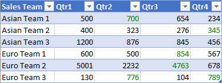
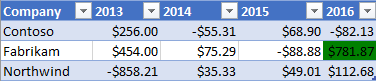

# <a name="apply-conditional-formatting-to-excel-ranges"></a><span data-ttu-id="a61d1-103">Применение условного форматирования к диапазонам Excel</span><span class="sxs-lookup"><span data-stu-id="a61d1-103">Apply conditional formatting to Excel ranges</span></span>

<span data-ttu-id="a61d1-104">Библиотека JavaScript Excel предоставляет API для применения условного форматирования к диапазонам данных в книгах.</span><span class="sxs-lookup"><span data-stu-id="a61d1-104">The Excel JavaScript Library provides APIs to apply conditional formatting to data ranges in your worksheets.</span></span> <span data-ttu-id="a61d1-105">Эта функция упрощает визуальный анализ больших наборов данных.</span><span class="sxs-lookup"><span data-stu-id="a61d1-105">This functionality makes large sets of data easy to visually parse.</span></span> <span data-ttu-id="a61d1-106">Форматирование также динамически обновляется с учетом изменений в диапазоне.</span><span class="sxs-lookup"><span data-stu-id="a61d1-106">The formatting also dynamically updates based on changes within the range.</span></span>

> [!NOTE]
> <span data-ttu-id="a61d1-107">В этой статье рассматривается условное форматирование в контексте надстроек JavaScript для Excel. В указанных ниже статьях представлены подробные сведения о всех возможностях условного форматирования в Excel.</span><span class="sxs-lookup"><span data-stu-id="a61d1-107">This article covers conditional formatting in the context of Excel JavaScript add-ins. The following articles provide detailed information about the full conditional formatting capabilities within Excel.</span></span>
> -  [<span data-ttu-id="a61d1-108">Добавление, изменение или удаление условного форматирования</span><span class="sxs-lookup"><span data-stu-id="a61d1-108">Add, change, or clear conditional formats</span></span>](https://support.office.com/article/add-change-or-clear-conditional-formats-8a1cc355-b113-41b7-a483-58460332a1af)
> -  [<span data-ttu-id="a61d1-109">Использование формул с условным форматированием</span><span class="sxs-lookup"><span data-stu-id="a61d1-109">Use formulas with conditional formatting</span></span>](https://support.office.com/article/Use-formulas-with-conditional-formatting-FED60DFA-1D3F-4E13-9ECB-F1951FF89D7F)

## <a name="programmatic-control-of-conditional-formatting"></a><span data-ttu-id="a61d1-110">Программное управление условным форматированием</span><span class="sxs-lookup"><span data-stu-id="a61d1-110">Programmatic control of conditional formatting</span></span>

<span data-ttu-id="a61d1-111">Свойство `Range.conditionalFormats` — это коллекция объектов [ConditionalFormat](/javascript/api/excel/excel.conditionalformat), применяемых к диапазону.</span><span class="sxs-lookup"><span data-stu-id="a61d1-111">The `Range.conditionalFormats` property is a collection of [ConditionalFormat](/javascript/api/excel/excel.conditionalformat) objects that apply to the range.</span></span>  <span data-ttu-id="a61d1-112">Объект `ConditionalFormat` содержит несколько свойств, определяющих применяемый формат на основе [ConditionalFormatType](/javascript/api/excel/excel.conditionalformattype).</span><span class="sxs-lookup"><span data-stu-id="a61d1-112">The `ConditionalFormat` object contains several properties that define the format to be applied based on the [ConditionalFormatType](/javascript/api/excel/excel.conditionalformattype).</span></span>

-    `cellValue`
-    `colorScale`
-    `custom`
-    `dataBar`
-    `iconSet`
-    `preset`
-    `textComparison`
-    `topBottom`

> [!NOTE]
> <span data-ttu-id="a61d1-113">У каждого из этих свойств форматирования есть соответствующий вариант `*OrNullObject`.</span><span class="sxs-lookup"><span data-stu-id="a61d1-113">Each of these formatting properties has a corresponding `*OrNullObject` variant.</span></span> <span data-ttu-id="a61d1-114">Дополнительные статьи об этом шаблоне в разделе [ \* Методы OrNullObject.](../develop/application-specific-api-model.md#ornullobject-methods-and-properties)</span><span class="sxs-lookup"><span data-stu-id="a61d1-114">Learn more about that pattern in the [\*OrNullObject methods](../develop/application-specific-api-model.md#ornullobject-methods-and-properties) section.</span></span>

<span data-ttu-id="a61d1-115">Для объекта ConditionalFormat можно установить только один тип формата.</span><span class="sxs-lookup"><span data-stu-id="a61d1-115">Only one format type can be set for the ConditionalFormat object.</span></span> <span data-ttu-id="a61d1-116">Это определено свойством `type`, которое является значением перечисления объекта [ConditionalFormatType](/javascript/api/excel/excel.conditionalformattype).</span><span class="sxs-lookup"><span data-stu-id="a61d1-116">This is determined by the `type` property, which is a [ConditionalFormatType](/javascript/api/excel/excel.conditionalformattype) enum value.</span></span> <span data-ttu-id="a61d1-117">Параметр `type` устанавливается при добавлении условного форматирования к диапазону.</span><span class="sxs-lookup"><span data-stu-id="a61d1-117">`type` is set when adding a conditional format to a range.</span></span>

## <a name="creating-conditional-formatting-rules"></a><span data-ttu-id="a61d1-118">Создание правил условного форматирования</span><span class="sxs-lookup"><span data-stu-id="a61d1-118">Creating conditional formatting rules</span></span>

<span data-ttu-id="a61d1-119">Условное форматирование добавляется к диапазону с помощью `conditionalFormats.add`.</span><span class="sxs-lookup"><span data-stu-id="a61d1-119">Conditional formats are added to a range by using `conditionalFormats.add`.</span></span> <span data-ttu-id="a61d1-120">После добавления можно задать свойства, относящиеся к условному форматированию.</span><span class="sxs-lookup"><span data-stu-id="a61d1-120">Once added, the properties specific to the conditional format can be set.</span></span> <span data-ttu-id="a61d1-121">В примерах ниже показано создание различных типов форматирования.</span><span class="sxs-lookup"><span data-stu-id="a61d1-121">The following examples show the creation of different formatting types.</span></span>

### <a name="cell-value"></a>[<span data-ttu-id="a61d1-122">Значение ячейки</span><span class="sxs-lookup"><span data-stu-id="a61d1-122">Cell value</span></span>](/javascript/api/excel/excel.cellvalueconditionalformat)

<span data-ttu-id="a61d1-123">При условном форматировании значения ячейки применяется пользовательский формат на основе результатов одной или двух формул в [ConditionalCellValueRule](/javascript/api/excel/excel.conditionalcellvaluerule).</span><span class="sxs-lookup"><span data-stu-id="a61d1-123">Cell value conditional formatting applies a user-defined format based on the results of one or two formulas in the [ConditionalCellValueRule](/javascript/api/excel/excel.conditionalcellvaluerule).</span></span> <span data-ttu-id="a61d1-124">Свойство `operator` является оператором [ConditionalCellValueOperator](/javascript/api/excel/excel.conditionalcellvalueoperator), который определяет, как итоговое выражение связано с форматированием.</span><span class="sxs-lookup"><span data-stu-id="a61d1-124">The `operator` property is a [ConditionalCellValueOperator](/javascript/api/excel/excel.conditionalcellvalueoperator) defining how the resulting expressions relate to the formatting.</span></span>

<span data-ttu-id="a61d1-125">В приведенном ниже примере показано применение красного шрифта ко всем значениям диапазона, которые меньше нуля.</span><span class="sxs-lookup"><span data-stu-id="a61d1-125">The following example shows red font coloring applied to any value in the range less than zero.</span></span>


```typescript
const sheet = context.workbook.worksheets.getItem("Sample");
const range = sheet.getRange("B21:E23");
const conditionalFormat = range.conditionalFormats.add(
    Excel.ConditionalFormatType.cellValue
);

// set the font of negative numbers to red
conditionalFormat.cellValue.format.font.color = "red";
conditionalFormat.cellValue.rule = { formula1: "=0", operator: "LessThan" };

await context.sync();
```

### <a name="color-scale"></a>[<span data-ttu-id="a61d1-127">Цветовая шкала</span><span class="sxs-lookup"><span data-stu-id="a61d1-127">Color scale</span></span>](/javascript/api/excel/excel.colorscaleconditionalformat)

<span data-ttu-id="a61d1-128">При условном форматировании с использованием цветовой шкалы применяется цветовой градиент в диапазоне данных.</span><span class="sxs-lookup"><span data-stu-id="a61d1-128">Color scale conditional formatting applies a color gradient across the data range.</span></span> <span data-ttu-id="a61d1-129">Свойство `criteria` в `ColorScaleConditionalFormat` определяет три точки [ConditionalColorScaleCriterion](/javascript/api/excel/excel.conditionalcolorscalecriterion): `minimum`, `maximum` и (при желании) `midpoint`.</span><span class="sxs-lookup"><span data-stu-id="a61d1-129">The `criteria` property on the `ColorScaleConditionalFormat` defines three [ConditionalColorScaleCriterion](/javascript/api/excel/excel.conditionalcolorscalecriterion): `minimum`, `maximum`, and, optionally, `midpoint`.</span></span> <span data-ttu-id="a61d1-130">У каждой точки условия есть три свойства:</span><span class="sxs-lookup"><span data-stu-id="a61d1-130">Each of the criterion scale points have three properties:</span></span>

-    <span data-ttu-id="a61d1-131">`color` — HTML-код цвета для конечной точки.</span><span class="sxs-lookup"><span data-stu-id="a61d1-131">`color` - The HTML color code for the endpoint.</span></span>
-    <span data-ttu-id="a61d1-132">`formula` — число или формула, представляющая значение конечной точки.</span><span class="sxs-lookup"><span data-stu-id="a61d1-132">`formula` - A number or formula representing the endpoint.</span></span> <span data-ttu-id="a61d1-133">Оно будет равным `null`, если `type` имеет значение `lowestValue` или `highestValue`.</span><span class="sxs-lookup"><span data-stu-id="a61d1-133">This will be `null` if `type` is `lowestValue` or `highestValue`.</span></span>
-    <span data-ttu-id="a61d1-134">`type` — способ оценки формулы.</span><span class="sxs-lookup"><span data-stu-id="a61d1-134">`type` - How the formula should be evaluated.</span></span> <span data-ttu-id="a61d1-135">`highestValue` и `lowestValue` относятся к значениям в форматируемом диапазоне.</span><span class="sxs-lookup"><span data-stu-id="a61d1-135">`highestValue` and `lowestValue` refer to values in the range being formatted.</span></span>

<span data-ttu-id="a61d1-136">В приведенном ниже примере показан диапазон, окрашенный с переходом от синего к желтому и красному цвету.</span><span class="sxs-lookup"><span data-stu-id="a61d1-136">The following example shows a range being colored blue to yellow to red.</span></span> <span data-ttu-id="a61d1-137">Обратите внимание, что `minimum` и `maximum` являются минимальным и максимальным значением соответственно, и для них используются формулы `null`.</span><span class="sxs-lookup"><span data-stu-id="a61d1-137">Note that `minimum` and `maximum` are the lowest and highest values respectively and use `null` formulas.</span></span> <span data-ttu-id="a61d1-138">Для значения `midpoint` используется тип `percentage` с формулой `"=50"`, чтобы самая желтая ячейка соответствовала среднему значению.</span><span class="sxs-lookup"><span data-stu-id="a61d1-138">`midpoint` is using the `percentage` type with a formula of `"=50"` so the yellowest cell is the mean value.</span></span>


```typescript
const sheet = context.workbook.worksheets.getItem("Sample");
const range = sheet.getRange("B2:M5");
const conditionalFormat = range.conditionalFormats.add(
      Excel.ConditionalFormatType.colorScale
);

// color the backgrounds of the cells from blue to yellow to red based on value
const criteria = {
      minimum: {
           formula: null,
           type: Excel.ConditionalFormatColorCriterionType.lowestValue,
           color: "blue"
      },
      midpoint: {
           formula: "50",
           type: Excel.ConditionalFormatColorCriterionType.percent,
           color: "yellow"
      },
      maximum: {
           formula: null,
           type: Excel.ConditionalFormatColorCriterionType.highestValue,
           color: "red"
      }
};
conditionalFormat.colorScale.criteria = criteria;

await context.sync();
```

### <a name="custom"></a>[<span data-ttu-id="a61d1-140">Пользовательское</span><span class="sxs-lookup"><span data-stu-id="a61d1-140">Custom</span></span>](/javascript/api/excel/excel.customconditionalformat)

<span data-ttu-id="a61d1-141">При пользовательском условном форматировании применяется пользовательский формат к ячейкам на основе формулы произвольной сложности.</span><span class="sxs-lookup"><span data-stu-id="a61d1-141">Custom conditional formatting applies a user-defined format to the cells based on a formula of arbitrary complexity.</span></span> <span data-ttu-id="a61d1-142">Объект [ConditionalFormatRule](/javascript/api/excel/excel.conditionalformatrule) позволяет определять формулу в разных нотациях:</span><span class="sxs-lookup"><span data-stu-id="a61d1-142">The [ConditionalFormatRule](/javascript/api/excel/excel.conditionalformatrule) object lets you define the formula in different notations:</span></span>

-    <span data-ttu-id="a61d1-143">`formula` — стандартная нотация.</span><span class="sxs-lookup"><span data-stu-id="a61d1-143">`formula` - Standard notation.</span></span>
-    <span data-ttu-id="a61d1-144">`formulaLocal` - Локализовано на основе языка пользователя.</span><span class="sxs-lookup"><span data-stu-id="a61d1-144">`formulaLocal` - Localized based on the user's language.</span></span>
-    <span data-ttu-id="a61d1-145">`formulaR1C1` — нотация R1C1.</span><span class="sxs-lookup"><span data-stu-id="a61d1-145">`formulaR1C1` - R1C1-style notation.</span></span>

<span data-ttu-id="a61d1-146">В приведенном ниже примере зеленым цветом окрашен шрифт ячеек с более высокими значениями, чем в ячейках слева.</span><span class="sxs-lookup"><span data-stu-id="a61d1-146">The following example colors the fonts green of cells with higher values than the cell to their left.</span></span>



```typescript
const sheet = context.workbook.worksheets.getItem("Sample");
const range = sheet.getRange("B8:E13");
const conditionalFormat = range.conditionalFormats.add(
     Excel.ConditionalFormatType.custom
);

// if a cell has a higher value than the one to its left, set that cell's font to green
conditionalFormat.custom.rule.formula = '=IF(B8>INDIRECT("RC[-1]",0),TRUE)';
conditionalFormat.custom.format.font.color = "green";

await context.sync();

```
### <a name="data-bar"></a>[<span data-ttu-id="a61d1-148">Гистограмма</span><span class="sxs-lookup"><span data-stu-id="a61d1-148">Data bar</span></span>](/javascript/api/excel/excel.databarconditionalformat)

<span data-ttu-id="a61d1-149">При условном форматировании с использованием гистограмм они добавляются к ячейкам.</span><span class="sxs-lookup"><span data-stu-id="a61d1-149">Data bar conditional formatting adds data bars to the cells.</span></span> <span data-ttu-id="a61d1-150">По умолчанию минимальное и максимальное значения в диапазоне создают границы и пропорциональные размеры гистограмм.</span><span class="sxs-lookup"><span data-stu-id="a61d1-150">By default, the minimum and maximum values in the Range form the bounds and proportional sizes of the data bars.</span></span> <span data-ttu-id="a61d1-151">Объект `DataBarConditionalFormat` обладает несколькими свойствами для управления внешним видом панели.</span><span class="sxs-lookup"><span data-stu-id="a61d1-151">The `DataBarConditionalFormat` object has several properties to control the bar's appearance.</span></span> 

<span data-ttu-id="a61d1-152">В приведенном ниже примере используется форматирование с помощью гистограмм с заполнением слева направо.</span><span class="sxs-lookup"><span data-stu-id="a61d1-152">The following example formats the range with data bars filling left-to-right.</span></span>


```typescript
const sheet = context.workbook.worksheets.getItem("Sample");
const range = sheet.getRange("B8:E13");
const conditionalFormat = range.conditionalFormats.add(
     Excel.ConditionalFormatType.dataBar
);

// give left-to-right, default-appearance data bars to all the cells
conditionalFormat.dataBar.barDirection = Excel.ConditionalDataBarDirection.leftToRight;
await context.sync();
```

### <a name="icon-set"></a>[<span data-ttu-id="a61d1-154">Набор значков</span><span class="sxs-lookup"><span data-stu-id="a61d1-154">Icon set</span></span>](/javascript/api/excel/excel.iconsetconditionalformat)

<span data-ttu-id="a61d1-155">При условном форматировании с набором значков используются [значки](/javascript/api/excel/excel.icon) Excel для выделения ячеек.</span><span class="sxs-lookup"><span data-stu-id="a61d1-155">Icon set conditional formatting uses Excel [Icons](/javascript/api/excel/excel.icon) to highlight cells.</span></span> <span data-ttu-id="a61d1-156">Свойство `criteria` — это массив объекта [ConditionalIconCriterion](/javascript/api/excel/excel.ConditionalIconCriterion), определяющий добавляемый символ и условия для добавления.</span><span class="sxs-lookup"><span data-stu-id="a61d1-156">The `criteria` property is an array of [ConditionalIconCriterion](/javascript/api/excel/excel.ConditionalIconCriterion), which define the symbol to be inserted and the condition under which it is inserted.</span></span> <span data-ttu-id="a61d1-157">Этот массив автоматически заполняется элементами условия со свойствами по умолчанию.</span><span class="sxs-lookup"><span data-stu-id="a61d1-157">This array is automatically prepopulated with criterion elements with default properties.</span></span> <span data-ttu-id="a61d1-158">Отдельные свойства не могут быть перезаписаны.</span><span class="sxs-lookup"><span data-stu-id="a61d1-158">Individual properties cannot be overwritten.</span></span> <span data-ttu-id="a61d1-159">Вместо этого необходимо заменить весь объект условия.</span><span class="sxs-lookup"><span data-stu-id="a61d1-159">Instead, the whole criteria object must be replaced.</span></span> 

<span data-ttu-id="a61d1-160">В приведенном ниже примере показано применение в диапазоне набора из трех значков с треугольниками.</span><span class="sxs-lookup"><span data-stu-id="a61d1-160">The following example shows a three-triangle icon set applied across the range.</span></span>


```typescript
const sheet = context.workbook.worksheets.getItem("Sample");
const range = sheet.getRange("B8:E13");
const conditionalFormat = range.conditionalFormats.add(
     Excel.ConditionalFormatType.iconSet
);

const iconSetCF = conditionalFormat.iconSet;
iconSetCF.style = Excel.IconSet.threeTriangles;

/*
   With a "three*" icon set style, such as "threeTriangles", the third
    element in the criteria array (criteria[2]) defines the "top" icon;
    e.g., a green triangle. The second (criteria[1]) defines the "middle"
    icon, The first (criteria[0]) defines the "low" icon, but it can often 
    be left empty as this method does below, because every cell that
   does not match the other two criteria always gets the low icon.
*/
iconSetCF.criteria = [
    {} as any,
      {
        type: Excel.ConditionalFormatIconRuleType.number,
        operator: Excel.ConditionalIconCriterionOperator.greaterThanOrEqual,
        formula: "=700"
      },
      {
        type: Excel.ConditionalFormatIconRuleType.number,
        operator: Excel.ConditionalIconCriterionOperator.greaterThanOrEqual,
        formula: "=1000"
      }
];

await context.sync();
```

### <a name="preset-criteria"></a>[<span data-ttu-id="a61d1-162">Готовые условия</span><span class="sxs-lookup"><span data-stu-id="a61d1-162">Preset criteria</span></span>](/javascript/api/excel/excel.presetcriteriaconditionalformat)

<span data-ttu-id="a61d1-163">При условном форматировании с готовыми условиями применяется пользовательский формат к диапазону на основе выбранного стандартного правила.</span><span class="sxs-lookup"><span data-stu-id="a61d1-163">Preset conditional formatting applies a user-defined format to the range based on a selected standard rule.</span></span> <span data-ttu-id="a61d1-164">Эти правила определяются с помощью [ConditionalFormatPresetCriterion](/javascript/api/excel/excel.ConditionalFormatPresetCriterion) в [ConditionalPresetCriteriaRule](/javascript/api/excel/excel.conditionalpresetcriteriarule).</span><span class="sxs-lookup"><span data-stu-id="a61d1-164">These rules are defined by the [ConditionalFormatPresetCriterion](/javascript/api/excel/excel.ConditionalFormatPresetCriterion) in the [ConditionalPresetCriteriaRule](/javascript/api/excel/excel.conditionalpresetcriteriarule).</span></span> 

<span data-ttu-id="a61d1-165">В следующем примере цвет шрифта белый, где значение ячейки по крайней мере на одно стандартное отклонение выше среднего диапазона.</span><span class="sxs-lookup"><span data-stu-id="a61d1-165">The following example colors the font white wherever a cell's value is at least one standard deviation above the range's average.</span></span>


```typescript
const sheet = context.workbook.worksheets.getItem("Sample");
const range = sheet.getRange("B2:M5");
const conditionalFormat = range.conditionalFormats.add(
     Excel.ConditionalFormatType.presetCriteria
);

// color every cell's font white that is one standard deviation above average relative to the range
conditionalFormat.preset.format.font.color = "white";
conditionalFormat.preset.rule = {
     criterion: Excel.ConditionalFormatPresetCriterion.oneStdDevAboveAverage
};

await context.sync();
```

### <a name="text-comparison"></a>[<span data-ttu-id="a61d1-167">Сравнение текста</span><span class="sxs-lookup"><span data-stu-id="a61d1-167">Text comparison</span></span>](/javascript/api/excel/excel.textconditionalformat)

<span data-ttu-id="a61d1-168">При условном форматировании со сравнением текста используется сравнение строк в качестве условия.</span><span class="sxs-lookup"><span data-stu-id="a61d1-168">Text comparison conditional formatting uses string comparisons as the condition.</span></span> <span data-ttu-id="a61d1-169">Свойство `rule` является объектом [ConditionalTextComparisonRule](/javascript/api/excel/excel.conditionaltextcomparisonrule), определяющим строку для сравнения с ячейкой и оператор для указания типа сравнения.</span><span class="sxs-lookup"><span data-stu-id="a61d1-169">The `rule` property is a [ConditionalTextComparisonRule](/javascript/api/excel/excel.conditionaltextcomparisonrule) defining a string to compare with the cell and an operator to specify the type of comparison.</span></span> 

<span data-ttu-id="a61d1-170">В следующем примере форматы цвета шрифта красный, когда текст ячейки содержит "Задержки".</span><span class="sxs-lookup"><span data-stu-id="a61d1-170">The following example formats the font color red when a cell's text contains "Delayed".</span></span>


```typescript
const sheet = context.workbook.worksheets.getItem("Sample");
const range = sheet.getRange("B16:D18");
const conditionalFormat = range.conditionalFormats.add(
     Excel.ConditionalFormatType.containsText
);

// color the font of every cell containing "Delayed"
conditionalFormat.textComparison.format.font.color = "red";
conditionalFormat.textComparison.rule = {
     operator: Excel.ConditionalTextOperator.contains,
     text: "Delayed"
};

await context.sync();
```

### <a name="topbottom"></a>[<span data-ttu-id="a61d1-172">Верхнее или нижнее значение</span><span class="sxs-lookup"><span data-stu-id="a61d1-172">Top/bottom</span></span>](/javascript/api/excel/excel.TopBottomconditionalformat)

<span data-ttu-id="a61d1-173">При условном форматировании верхнего или нижнего значения применяется форматирование к наибольшему или наименьшему значению в диапазоне.</span><span class="sxs-lookup"><span data-stu-id="a61d1-173">Top/bottom conditional formatting applies a format to the highest or lowest values in a range.</span></span> <span data-ttu-id="a61d1-174">Свойство `rule`, являющееся типом [ConditionalTopBottomRule](/javascript/api/excel/excel.conditionaltopbottomrule), указывает основание для условия (максимальное или минимальное значение), а также применение ранжированной или процентной оценки.</span><span class="sxs-lookup"><span data-stu-id="a61d1-174">The `rule` property, which is of type [ConditionalTopBottomRule](/javascript/api/excel/excel.conditionaltopbottomrule), sets whether the condition is based on the highest or lowest, as well as whether the evaluation is ranked or percentage-based.</span></span> 

<span data-ttu-id="a61d1-175">В приведенном ниже примере применяется зеленое выделение к ячейке с максимальным значением в диапазоне.</span><span class="sxs-lookup"><span data-stu-id="a61d1-175">The following example applies a green highlight to the highest value cell in the range.</span></span>




```typescript
const sheet = context.workbook.worksheets.getItem("Sample");
const range = sheet.getRange("B21:E23");
const conditionalFormat = range.conditionalFormats.add(
     Excel.ConditionalFormatType.topBottom
);

// for the highest valued cell in the range, make the background green
conditionalFormat.topBottom.format.fill.color = "green"
conditionalFormat.topBottom.rule = { rank: 1, type: "TopItems"}

await context.sync();
```

## <a name="multiple-formats-and-priority"></a><span data-ttu-id="a61d1-177">Разные форматирования и приоритет</span><span class="sxs-lookup"><span data-stu-id="a61d1-177">Multiple formats and priority</span></span>

<span data-ttu-id="a61d1-178">К диапазону можно применять несколько типов условного форматирования.</span><span class="sxs-lookup"><span data-stu-id="a61d1-178">You can apply multiple conditional formats to a range.</span></span> <span data-ttu-id="a61d1-179">Если форматы содержат конфликтующие элементы, например разный цвет шрифта, только один формат применяет этот конкретный элемент.</span><span class="sxs-lookup"><span data-stu-id="a61d1-179">If the formats have conflicting elements, such as differing font colors, only one format applies that particular element.</span></span> <span data-ttu-id="a61d1-180">Приоритет определяется свойством `ConditionalFormat.priority`.</span><span class="sxs-lookup"><span data-stu-id="a61d1-180">Precedence is defined by the `ConditionalFormat.priority` property.</span></span> <span data-ttu-id="a61d1-181">Приоритет — это число (равное индексу в `ConditionalFormatCollection`), которое можно установить при создании формата.</span><span class="sxs-lookup"><span data-stu-id="a61d1-181">Priority is a number (equal to the index in the `ConditionalFormatCollection`) and can be set when creating the format.</span></span> <span data-ttu-id="a61d1-182">Чем ниже значение `priority`, тем выше приоритет формата.</span><span class="sxs-lookup"><span data-stu-id="a61d1-182">The lowerer the `priority` value, the higher the priority of the format is.</span></span>

<span data-ttu-id="a61d1-183">В приведенном ниже примере показан выбор цвета шрифта при конфликте между двумя форматами.</span><span class="sxs-lookup"><span data-stu-id="a61d1-183">The following example shows a conflicting font color choice between the two formats.</span></span> <span data-ttu-id="a61d1-184">Для отрицательных чисел применяется полужирный шрифт, но НЕ красный, так как приоритет получает формат, устанавливающий для них синий цвет шрифта.</span><span class="sxs-lookup"><span data-stu-id="a61d1-184">Negative numbers will get a bold font, but NOT a red font, because priority goes to the format that gives them a blue font.</span></span>


```typescript
const sheet = context.workbook.worksheets.getItem("Sample");
const temperatureDataRange = sheet.tables.getItem("TemperatureTable").getDataBodyRange();


// Set low numbers to bold, dark red font and assign priority 1.
const presetFormat = temperatureDataRange.conditionalFormats
    .add(Excel.ConditionalFormatType.presetCriteria);
presetFormat.preset.format.font.color = "red";
presetFormat.preset.format.font.bold = true;
presetFormat.preset.rule = { criterion: Excel.ConditionalFormatPresetCriterion.oneStdDevBelowAverage };
presetFormat.priority = 1;

// Set negative numbers to blue font with green background and set priority 0.
const cellValueFormat = temperatureDataRange.conditionalFormats
    .add(Excel.ConditionalFormatType.cellValue);
cellValueFormat.cellValue.format.font.color = "blue";
cellValueFormat.cellValue.format.fill.color = "lightgreen";
cellValueFormat.cellValue.rule = { formula1: "=0", operator: "LessThan" };
cellValueFormat.priority = 0;

await context.sync();

```

### <a name="mutually-exclusive-conditional-formats"></a><span data-ttu-id="a61d1-186">Взаимоисключающие условные форматирования</span><span class="sxs-lookup"><span data-stu-id="a61d1-186">Mutually exclusive conditional formats</span></span>

<span data-ttu-id="a61d1-187">Свойство `stopIfTrue` объекта `ConditionalFormat` не позволяет применять к диапазону условное форматирование с более низким приоритетом.</span><span class="sxs-lookup"><span data-stu-id="a61d1-187">The `stopIfTrue` property of `ConditionalFormat` prevents lower priority conditional formats from being applied to the range.</span></span> <span data-ttu-id="a61d1-188">Если при сопоставлении с диапазоном применяется условное форматирование со свойством `stopIfTrue === true`, последующие условные форматирования не применяются, даже если их элементы не вступают в противоречие.</span><span class="sxs-lookup"><span data-stu-id="a61d1-188">When a range matching the conditional format with `stopIfTrue === true` is applied, no subsequent conditional formats are applied, even if their formatting details are not contradictory.</span></span>

<span data-ttu-id="a61d1-189">В приведенном ниже примере показано добавление в диапазон двух условных форматов.</span><span class="sxs-lookup"><span data-stu-id="a61d1-189">The following example shows two conditional formats being added to a range.</span></span> <span data-ttu-id="a61d1-190">Для отрицательных чисел будет использоваться синий шрифт со светло-зеленым фоном, независимо от того, выполняются ли условия другого формата.</span><span class="sxs-lookup"><span data-stu-id="a61d1-190">Negative numbers will have a blue font with a light green background, regardless of whether the other format condition is true.</span></span>


```typescript
const sheet = context.workbook.worksheets.getItem("Sample");
const temperatureDataRange = sheet.tables.getItem("TemperatureTable").getDataBodyRange();

// Set low numbers to bold, dark red font and assign priority 1.
const presetFormat = temperatureDataRange.conditionalFormats
    .add(Excel.ConditionalFormatType.presetCriteria);
presetFormat.preset.format.font.color = "red";
presetFormat.preset.format.font.bold = true;
presetFormat.preset.rule = { criterion: Excel.ConditionalFormatPresetCriterion.oneStdDevBelowAverage };
presetFormat.priority = 1;

// Set negative numbers to blue font with green background and 
// set priority 0, but set stopIfTrue to true, so none of the 
// formatting of the conditional format with the higher priority
// value will apply, not even the bolding of the font.
const cellValueFormat = temperatureDataRange.conditionalFormats
    .add(Excel.ConditionalFormatType.cellValue);
cellValueFormat.cellValue.format.font.color = "blue";
cellValueFormat.cellValue.format.fill.color = "lightgreen";
cellValueFormat.cellValue.rule = { formula1: "=0", operator: "LessThan" };
cellValueFormat.priority = 0;
cellValueFormat.stopIfTrue = true;

await context.sync();
```

## <a name="see-also"></a><span data-ttu-id="a61d1-192">См. также</span><span class="sxs-lookup"><span data-stu-id="a61d1-192">See also</span></span>

- [<span data-ttu-id="a61d1-193">Объектная модель JavaScript для Excel в надстройках Office</span><span class="sxs-lookup"><span data-stu-id="a61d1-193">Excel JavaScript object model in Office Add-ins</span></span>](../excel/excel-add-ins-core-concepts.md)
- [<span data-ttu-id="a61d1-194">Объект ConditionalFormat (API JavaScript для Excel)</span><span class="sxs-lookup"><span data-stu-id="a61d1-194">ConditionalFormat Object (JavaScript API for Excel)</span></span>](/javascript/api/excel/excel.conditionalformat)
- [<span data-ttu-id="a61d1-195">Добавление, изменение или удаление условного форматирования</span><span class="sxs-lookup"><span data-stu-id="a61d1-195">Add, change, or clear conditional formats</span></span>](https://support.office.com/article/add-change-or-clear-conditional-formats-8a1cc355-b113-41b7-a483-58460332a1af)
- [<span data-ttu-id="a61d1-196">Использование формул с условным форматированием</span><span class="sxs-lookup"><span data-stu-id="a61d1-196">Use formulas with conditional formatting</span></span>](https://support.office.com/article/Use-formulas-with-conditional-formatting-FED60DFA-1D3F-4E13-9ECB-F1951FF89D7F)
