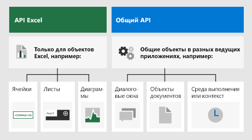
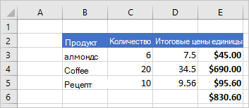
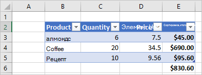
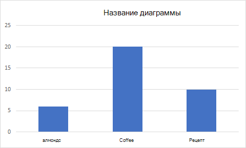

# <a name="excel-javascript-object-model-in-office-add-ins"></a><span data-ttu-id="84f78-103">Объектная модель JavaScript для Excel в надстройках Office</span><span class="sxs-lookup"><span data-stu-id="84f78-103">Excel JavaScript object model in Office Add-ins</span></span>

<span data-ttu-id="84f78-104">В этой статье описано, как создавать надстройки для Excel 2016 или более поздней версии с помощью [API JavaScript для Excel](../reference/overview/excel-add-ins-reference-overview.md).</span><span class="sxs-lookup"><span data-stu-id="84f78-104">This article describes how to use the [Excel JavaScript API](../reference/overview/excel-add-ins-reference-overview.md) to build add-ins for Excel 2016 or later.</span></span> <span data-ttu-id="84f78-105">В статье изложены основные принципы, которые являются фундаментальными при использовании этого API, а также имеются рекомендации по выполнению определенных задач, например чтению данных из большого диапазона или записи данных в него, изменения всех ячеек в диапазоне и много другого.</span><span class="sxs-lookup"><span data-stu-id="84f78-105">It introduces core concepts that are fundamental to using the API and provides guidance for performing specific tasks such as reading or writing to a large range, updating all cells in range, and more.</span></span>

> [!IMPORTANT]
> <span data-ttu-id="84f78-106">Сведения об асинхронном типе интерфейсов API Excel и принципах их работы с книгой см. в статье [Использование модели API, зависящей от приложения](../develop/application-specific-api-model.md).</span><span class="sxs-lookup"><span data-stu-id="84f78-106">See [Using the application-specific API model](../develop/application-specific-api-model.md) to learn about the asynchronous nature of the Excel APIs and how they work with the workbook.</span></span>  

## <a name="officejs-apis-for-excel"></a><span data-ttu-id="84f78-107">Интерфейсы API Office.js для Excel</span><span class="sxs-lookup"><span data-stu-id="84f78-107">Office.js APIs for Excel</span></span>

<span data-ttu-id="84f78-108">Надстройка Excel взаимодействует с объектами в Excel с помощью API JavaScript для Office, включающего две объектных модели JavaScript:</span><span class="sxs-lookup"><span data-stu-id="84f78-108">An Excel add-in interacts with objects in Excel by using the Office JavaScript API, which includes two JavaScript object models:</span></span>

* <span data-ttu-id="84f78-109">**API JavaScript для Excel**. Появившийся в Office 2016 [API JavaScript для Excel](../reference/overview/excel-add-ins-reference-overview.md) предоставляет строго типизированные объекты, с помощью которых можно получать доступ к листам, диапазонам, таблицам, диаграммам и другим объектам.</span><span class="sxs-lookup"><span data-stu-id="84f78-109">**Excel JavaScript API**: Introduced with Office 2016, the [Excel JavaScript API](../reference/overview/excel-add-ins-reference-overview.md) provides strongly-typed objects that you can use to access worksheets, ranges, tables, charts, and more.</span></span>

* <span data-ttu-id="84f78-110">**Общие API**. Появившиеся в Office 2013 [общие API](/javascript/api/office) можно использовать для доступа к таким компонентам, как пользовательский интерфейс, диалоговые окна и параметры клиентов, общие для нескольких типов приложений Office.</span><span class="sxs-lookup"><span data-stu-id="84f78-110">**Common APIs**: Introduced with Office 2013, the [Common API](/javascript/api/office) can be used to access features such as UI, dialogs, and client settings that are common across multiple types of Office applications.</span></span>

<span data-ttu-id="84f78-p102">Скорее всего, вы будете разрабатывать большую часть функций надстроек для Excel 2016 или более поздней версии с помощью API JavaScript для Excel, но вам также потребуются объекты из общего API. Например:</span><span class="sxs-lookup"><span data-stu-id="84f78-p102">While you'll likely use the Excel JavaScript API to develop the majority of functionality in add-ins that target Excel 2016 or later, you'll also use objects in the Common API. For example:</span></span>

* <span data-ttu-id="84f78-p103">[Context](/javascript/api/office/office.context). Объект `Context` представляет среду выполнения надстройки и предоставляет доступ к ключевым объектам API. Он состоит из данных конфигурации книги, например `contentLanguage` и `officeTheme`, а также предоставляет сведения о среде выполнения надстройки, например `host` и `platform`. Кроме того, он предоставляет метод `requirements.isSetSupported()`, с помощью которого можно проверить, поддерживается ли указанный набор обязательных элементов приложением Excel, в котором работает надстройка.</span><span class="sxs-lookup"><span data-stu-id="84f78-p103">[Context](/javascript/api/office/office.context): The `Context` object represents the runtime environment of the add-in and provides access to key objects of the API. It consists of workbook configuration details such as `contentLanguage` and `officeTheme` and also provides information about the add-in's runtime environment such as `host` and `platform`. Additionally, it provides the `requirements.isSetSupported()` method, which you can use to check whether the specified requirement set is supported by the Excel application where the add-in is running.</span></span>
* <span data-ttu-id="84f78-116">[Document](/javascript/api/office/office.document). Объект `Document` предоставляет метод `getFileAsync()`, позволяющий скачать файл Excel, в котором работает надстройка.</span><span class="sxs-lookup"><span data-stu-id="84f78-116">[Document](/javascript/api/office/office.document): The `Document` object provides the `getFileAsync()` method, which you can use to download the Excel file where the add-in is running.</span></span>

<span data-ttu-id="84f78-117">На рисунке ниже показано, когда можно использовать API JavaScript для Excel или общие API.</span><span class="sxs-lookup"><span data-stu-id="84f78-117">The following image illustrates when you might use the Excel JavaScript API or the Common APIs.</span></span>



## <a name="excel-specific-object-model"></a><span data-ttu-id="84f78-119">Объектная модель для Excel</span><span class="sxs-lookup"><span data-stu-id="84f78-119">Excel-specific object model</span></span>

<span data-ttu-id="84f78-120">Чтобы понять API-интерфейсы Excel, вы должны понимать, как компоненты рабочей книги связаны друг с другом.</span><span class="sxs-lookup"><span data-stu-id="84f78-120">To understand the Excel APIs, you must understand how the components of a workbook are related to one another.</span></span>

* <span data-ttu-id="84f78-121">**Рабочая книга** содержит одну или несколько **рабочих листов**.</span><span class="sxs-lookup"><span data-stu-id="84f78-121">A **Workbook** contains one or more **Worksheets**.</span></span>
* <span data-ttu-id="84f78-122">**Рабочий лист** содержит коллекции тех объектов данных, которые присутствуют на отдельном листе, и предоставляет доступ к ячейкам с помощью объектов **Range**.</span><span class="sxs-lookup"><span data-stu-id="84f78-122">A **Worksheet** contains collections of those data objects that are present in the individual sheet, and gives access to cells through **Range** objects.</span></span>
* <span data-ttu-id="84f78-123">**Range** представляет группу смежных клеток.</span><span class="sxs-lookup"><span data-stu-id="84f78-123">A **Range** represents a group of contiguous cells.</span></span>
* <span data-ttu-id="84f78-124">**Диапазоны** используются для создания и размещения **таблиц**, **диаграмм**, **фигур** и других объектов визуализации данных или организации.</span><span class="sxs-lookup"><span data-stu-id="84f78-124">**Ranges** are used to create and place **Tables**, **Charts**, **Shapes**, and other data visualization or organization objects.</span></span>
* <span data-ttu-id="84f78-125">**Рабочие книги** содержат коллекции некоторых из этих объектов данных (таких как **таблицы**) для всей **рабочей книги**.</span><span class="sxs-lookup"><span data-stu-id="84f78-125">**Workbooks** contain collections of some of those data objects (such as **Tables**) for the entire **Workbook**.</span></span>

[!include[Excel cells and ranges note](../includes/note-excel-cells-and-ranges.md)]

### <a name="ranges"></a><span data-ttu-id="84f78-126">Диапазоны</span><span class="sxs-lookup"><span data-stu-id="84f78-126">Ranges</span></span>

<span data-ttu-id="84f78-127">Диапазон - это группа непрерывных ячеек в рабочей книге.</span><span class="sxs-lookup"><span data-stu-id="84f78-127">A range is a group of contiguous cells in the workbook.</span></span> <span data-ttu-id="84f78-128">В надстройках обычно используется нотация в стиле A1 (например, **B3** для отдельной ячейки в столбце **B** и строке **3** или **C2:F4** для ячеек из столбцов с **C** по **F** и строк с **2** по **4**) для определения диапазонов.</span><span class="sxs-lookup"><span data-stu-id="84f78-128">Add-ins typically use A1-style notation (e.g. **B3** for the single cell in column **B** and row **3** or **C2:F4** for the cells from columns **C** through **F** and rows **2** through **4**) to define ranges.</span></span>

<span data-ttu-id="84f78-129">Диапазоны имеют три основных свойства: `values`, `formulas`, и `format`.</span><span class="sxs-lookup"><span data-stu-id="84f78-129">Ranges have three core properties: `values`, `formulas`, and `format`.</span></span> <span data-ttu-id="84f78-130">Эти свойства получают или устанавливают значения ячеек, формулы для оценки и визуальное форматирование ячеек.</span><span class="sxs-lookup"><span data-stu-id="84f78-130">These properties get or set the cell values, formulas to be evaluated, and the visual formatting of the cells.</span></span>

#### <a name="range-sample"></a><span data-ttu-id="84f78-131">Образец диапазона</span><span class="sxs-lookup"><span data-stu-id="84f78-131">Range sample</span></span>

<span data-ttu-id="84f78-132">В следующем примере показано, как создавать записи продаж.</span><span class="sxs-lookup"><span data-stu-id="84f78-132">The following sample shows how to create sales records.</span></span> <span data-ttu-id="84f78-133">Эта функция использует объекты `Range` для установки значений, формул и форматов.</span><span class="sxs-lookup"><span data-stu-id="84f78-133">This function uses `Range` objects to set the values, formulas, and formats.</span></span>

```js
Excel.run(function (context) {
    var sheet = context.workbook.worksheets.getActiveWorksheet();

    // Create the headers and format them to stand out.
    var headers = [
      ["Product", "Quantity", "Unit Price", "Totals"]
    ];
    var headerRange = sheet.getRange("B2:E2");
    headerRange.values = headers;
    headerRange.format.fill.color = "#4472C4";
    headerRange.format.font.color = "white";

    // Create the product data rows.
    var productData = [
      ["Almonds", 6, 7.5],
      ["Coffee", 20, 34.5],
      ["Chocolate", 10, 9.56],
    ];
    var dataRange = sheet.getRange("B3:D5");
    dataRange.values = productData;

    // Create the formulas to total the amounts sold.
    var totalFormulas = [
      ["=C3 * D3"],
      ["=C4 * D4"],
      ["=C5 * D5"],
      ["=SUM(E3:E5)"]
    ];
    var totalRange = sheet.getRange("E3:E6");
    totalRange.formulas = totalFormulas;
    totalRange.format.font.bold = true;

    // Display the totals as US dollar amounts.
    totalRange.numberFormat = [["$0.00"]];

    return context.sync();
});
```

<span data-ttu-id="84f78-134">В этом примере создаются следующие данные в текущем листе:</span><span class="sxs-lookup"><span data-stu-id="84f78-134">This sample creates the following data in the current worksheet:</span></span>



<span data-ttu-id="84f78-136">Дополнительные сведения см. в статье [Настройка и получение значений диапазона, текста или формул с помощью API JavaScript для Excel](excel-add-ins-ranges-set-get-values.md).</span><span class="sxs-lookup"><span data-stu-id="84f78-136">For more information, see [Set and get range values, text, or formulas using the Excel JavaScript API](excel-add-ins-ranges-set-get-values.md).</span></span>

### <a name="charts-tables-and-other-data-objects"></a><span data-ttu-id="84f78-137">Диаграммы, таблицы и другие объекты данных</span><span class="sxs-lookup"><span data-stu-id="84f78-137">Charts, tables, and other data objects</span></span>

<span data-ttu-id="84f78-138">API JavaScript для Excel могут создавать и управлять структурами данных и визуализациями в Excel.</span><span class="sxs-lookup"><span data-stu-id="84f78-138">The Excel JavaScript APIs can create and manipulate the data structures and visualizations within Excel.</span></span> <span data-ttu-id="84f78-139">Таблицы и диаграммы являются двумя наиболее часто используемыми объектами, но API поддерживают сводные таблицы, фигуры, изображения и многое другое.</span><span class="sxs-lookup"><span data-stu-id="84f78-139">Tables and charts are two of the more commonly used objects, but the APIs support PivotTables, shapes, images, and more.</span></span>

#### <a name="creating-a-table"></a><span data-ttu-id="84f78-140">Создание таблицы</span><span class="sxs-lookup"><span data-stu-id="84f78-140">Creating a table</span></span>

<span data-ttu-id="84f78-p108">Создайте таблицы с помощью диапазонов данных. Форматирование и элементы управления таблицами (например, фильтры) автоматически применяются к диапазону.</span><span class="sxs-lookup"><span data-stu-id="84f78-p108">Create tables by using data-filled ranges. Formatting and table controls (such as filters) are automatically applied to the range.</span></span>

<span data-ttu-id="84f78-143">В следующем примере создается таблица с использованием диапазонов из предыдущего примера.</span><span class="sxs-lookup"><span data-stu-id="84f78-143">The following sample creates a table using the ranges from the previous sample.</span></span>

```js
Excel.run(function (context) {
    var sheet = context.workbook.worksheets.getActiveWorksheet();
    sheet.tables.add("B2:E5", true);
    return context.sync();
});
```

<span data-ttu-id="84f78-144">Использование этого примера кода на листе с предыдущими данными создает следующую таблицу:</span><span class="sxs-lookup"><span data-stu-id="84f78-144">Using this sample code on the worksheet with the previous data creates the following table:</span></span>



<span data-ttu-id="84f78-146">Дополнительные сведения см. в статье [Работа с таблицами с использованием API JavaScript для Excel](excel-add-ins-tables.md).</span><span class="sxs-lookup"><span data-stu-id="84f78-146">For more information, see [Work with tables using the Excel JavaScript API](excel-add-ins-tables.md).</span></span>

#### <a name="creating-a-chart"></a><span data-ttu-id="84f78-147">Создание диаграммы</span><span class="sxs-lookup"><span data-stu-id="84f78-147">Creating a chart</span></span>

<span data-ttu-id="84f78-148">Создайте диаграммы для визуализации данных в диапазоне.</span><span class="sxs-lookup"><span data-stu-id="84f78-148">Create charts to visualize the data in a range.</span></span> <span data-ttu-id="84f78-149">API поддерживают десятки разновидностей диаграмм, каждая из которых может быть настроена в соответствии с вашими потребностями.</span><span class="sxs-lookup"><span data-stu-id="84f78-149">The APIs support dozens of chart varieties, each of which can be customized to suit your needs.</span></span>

<span data-ttu-id="84f78-150">В следующем примере создается простая гистограмма для трех элементов, которая размещается на 100 пикселей ниже верхней части листа.</span><span class="sxs-lookup"><span data-stu-id="84f78-150">The following sample creates a simple column chart for three items and places it 100 pixels below the top of the worksheet.</span></span>

```js
Excel.run(function (context) {
    var sheet = context.workbook.worksheets.getActiveWorksheet();
    var chart = sheet.charts.add(Excel.ChartType.columnStacked, sheet.getRange("B3:C5"));
    chart.top = 100;
    return context.sync();
});
```

<span data-ttu-id="84f78-151">Выполнение этого примера на листе с предыдущей таблицей создает следующую диаграмму:</span><span class="sxs-lookup"><span data-stu-id="84f78-151">Running this sample on the worksheet with the previous table creates the following chart:</span></span>



<span data-ttu-id="84f78-153">Дополнительные сведения см. в статье [Работа с диаграммами с использованием API JavaScript для Excel](excel-add-ins-charts.md).</span><span class="sxs-lookup"><span data-stu-id="84f78-153">For more information, see [Work with charts using the Excel JavaScript API](excel-add-ins-charts.md).</span></span>

## <a name="see-also"></a><span data-ttu-id="84f78-154">См. также</span><span class="sxs-lookup"><span data-stu-id="84f78-154">See also</span></span>

* [<span data-ttu-id="84f78-155">Создание первой надстройки Excel</span><span class="sxs-lookup"><span data-stu-id="84f78-155">Build your first Excel add-in</span></span>](../quickstarts/excel-quickstart-jquery.md)
* [<span data-ttu-id="84f78-156">Примеры кода надстроек Excel</span><span class="sxs-lookup"><span data-stu-id="84f78-156">Excel add-ins code samples</span></span>](https://developer.microsoft.com/office/gallery/?filterBy=Samples,Excel)
* [<span data-ttu-id="84f78-157">Оптимизация производительности API JavaScript для Excel</span><span class="sxs-lookup"><span data-stu-id="84f78-157">Excel JavaScript API performance optimization</span></span>](../excel/performance.md)
* [<span data-ttu-id="84f78-158">Справочник по API JavaScript для Excel</span><span class="sxs-lookup"><span data-stu-id="84f78-158">Excel JavaScript API reference</span></span>](../reference/overview/excel-add-ins-reference-overview.md)
