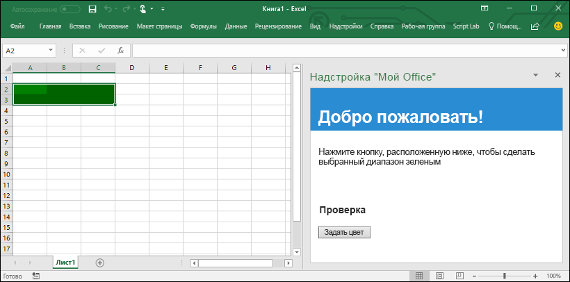

# <a name="build-an-excel-add-in-using-react"></a>Создание надстройки Excel с помощью React

В этой статье описывается процесс создания надстройки Excel с помощью React и API JavaScript для Excel.

## <a name="prerequisites"></a>Предварительные условия

Если это еще не сделано, необходимо установить следующие инструменты:

1. Глобально установите [Create React App](https://github.com/facebookincubator/create-react-app).

    ```bash
    npm install -g create-react-app
    ```

2. Глобально установите [Yeoman](https://github.com/yeoman/yo) и [генератор Yeoman для надстроек Office](https://github.com/OfficeDev/generator-office).

    ```bash
    npm install -g yo generator-office
    ```

## <a name="generate-a-new-react-app"></a>Создание приложения React

Создайте приложение React с помощью Create React App. В терминале выполните следующую команду:

```bash
create-react-app my-addin
```

## <a name="generate-the-manifest-file-and-sideload-the-add-in"></a>Создание файла манифеста и загрузка неопубликованной надстройки

Каждой надстройке необходим файл манифеста, чтобы определить ее параметры и возможности.

1. Перейдите к папке приложения.

    ```bash
    cd my-addin
    ```

2. С помощью генератора Yeoman создайте файл манифеста для надстройки. Выполните приведенную ниже команду, а затем укажите ответы на вопросы, как показано на следующем снимке экрана:

    ```bash
    yo office
    ```
    
    >**Примечание.** Если вам будет предложено переписать файл **package.json**, выберите **No** (не переписывать).

3. Откройте файл манифеста (т. е. файл в корневом каталоге приложения, имя которого заканчивается на "manifest.xml"). Замените все вхождения `https://localhost:3000` на `http://localhost:3000` и сохраните файл.

4. Следуя указаниям для нужной платформы, загрузите неопубликованную надстройку в Excel.

    - Windows: [Загрузка неопубликованных надстроек Office в Windows для тестирования](../testing/create-a-network-shared-folder-catalog-for-task-pane-and-content-add-ins.md)
    - Excel Online: [Загрузка неопубликованных надстроек Office в Office Online](../testing/sideload-office-add-ins-for-testing.md#sideload-an-office-add-in-on-office-online)
    - iPad и Mac: [Загрузка неопубликованных надстроек Office на iPad и Mac](../testing/sideload-an-office-add-in-on-ipad-and-mac.md)

## <a name="update-the-app"></a>Обновление приложения

1. Откройте **public/index.html**, добавьте тег `<script>` сразу перед тегом `</head>` и сохраните файл.

    ```html
    <script src="https://appsforoffice.microsoft.com/lib/1/hosted/office.js"></script>
    ```

2. Откройте **src/index.js**, замените `ReactDOM.render(<App />, document.getElementById('root'));` приведенным ниже кодом и сохраните файл. 

    ```typescript
    const Office = window.Office;
    
    Office.initialize = () => {
      ReactDOM.render(<App />, document.getElementById('root'));
    };
    ```

3. Откройте **src/App.js**, замените его содержимое приведенным ниже кодом и сохраните файл. 

    ```js
    import React, { Component } from 'react';
    import './App.css';

    class App extends Component {
      constructor(props) {
        super(props);

        this.onColorMe = this.onColorMe.bind(this);
      }

      onColorMe() {
        window.Excel.run(async (context) => {
          const range = context.workbook.getSelectedRange();
          range.format.fill.color = 'green';
          await context.sync();
        });
      }

      render() {
        return (
          <div id="content">
            <div id="content-header">
              <div className="padding">
                  <h1>Welcome</h1>
              </div>
            </div>
            <div id="content-main">
              <div className="padding">
                  <p>Choose the button below to set the color of the selected range to green.</p>
                  <br />
                  <h3>Try it out</h3>
                  <button onClick={this.onColorMe}>Color Me</button>
              </div>
            </div>
          </div>
        );
      }
    }

    export default App;
    ```

4. Откройте **src/App.css**, замените его содержимое приведенным ниже кодом и сохраните файл. 

    ```css
    #content-header {
        background: #2a8dd4;
        color: #fff;
        position: absolute;
        top: 0;
        left: 0;
        width: 100%;
        height: 80px; 
        overflow: hidden;
    }

    #content-main {
        background: #fff;
        position: fixed;
        top: 80px;
        left: 0;
        right: 0;
        bottom: 0;
        overflow: auto; 
    }

    .padding {
        padding: 15px;
    }
    ```

## <a name="try-it-out"></a>Проверка

1. Выполните в терминале приведенную ниже команду, чтобы запустить сервер разработки.

    ```bash
    npm start
    ```

2. В Excel выберите вкладку **Главная** и нажмите кнопку **Показать область задач** на ленте, чтобы открыть область задач надстройки.

    

3. В области задач нажмите кнопку **Color Me** (Раскрасить), чтобы сделать выбранный диапазон зеленым.

    

## <a name="next-steps"></a>Дальнейшие действия

Поздравляем, вы успешно создали надстройку Excel с помощью React! Теперь вы можете узнать больше об [основных понятиях](excel-add-ins-core-concepts.md), связанных с созданием надстроек Excel.

## <a name="additional-resources"></a>Дополнительные ресурсы

* [Основные понятия API JavaScript для Excel](excel-add-ins-core-concepts.md)
* [Примеры кода надстроек Excel](http://dev.office.com/code-samples#?filters=excel,office%20add-ins)
* [Справочник по API JavaScript для Excel](../../reference/excel/excel-add-ins-reference-overview.md)
