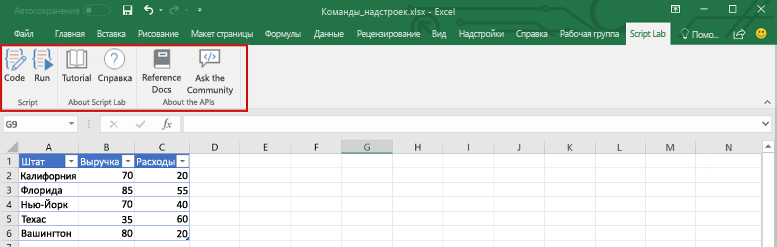
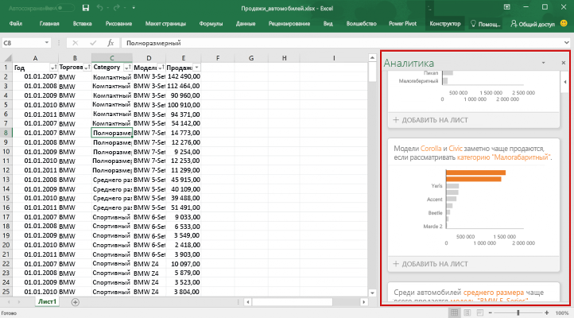

# Общие сведения о надстройках Excel

С помощью надстройки Excel можно расширить возможности приложения Excel на различных платформах, в том числе Office для Windows, Office Online, Office для Mac и Office для iPad. С помощью надстроек Excel в книге можно:

- взаимодействовать с объектами Excel, считывать и записывать данные Excel; 
- расширять возможности с помощью области задач или области содержимого; 
- добавлять настраиваемые кнопки ленты или элементы контекстного меню;
- расширять возможности взаимодействия с помощью диалогового окна. 

В качестве основы используется платформа надстроек Office, предоставляющая API JavaScript для Office.js, с помощью которых можно создавать и запускать надстройки Excel. Используя платформу надстроек Office для создания надстройки Excel, вы получаете следующие преимущества:

* **Кроссплатформенная поддержка**. Надстройки Excel работают в Office для Windows, Mac, iOS и Office Online.
* **Централизованное развертывание**. Администраторы могут легко и быстро развертывать надстройки Excel для пользователей в организации.
* **Единый вход**. Надстройка Excel легко интегрируется с Microsoft Graph.
* **Использование стандартной веб-технологии**. Создавайте надстройки Excel, используя знакомые веб-технологии — HTML, CSS и JavaScript.
* **Распространение через Магазин Office**. Представьте свою надстройку Excel широкой аудитории, опубликовав ее в [Магазине Office](https://store.office.com/en-us/appshome.aspx).

> **Примечание.** Надстройки Excel отличаются от надстроек COM и VSTO — устаревших решений для интеграции с Office, работающих только в Office для Windows. В отличие от надстроек COM, надстройки Excel не требуют установки какого-либо кода на устройстве пользователя или в Excel. 

## Компоненты надстройки Excel 

Надстройка Excel включает два основных компонента: веб-приложение и файл конфигурации, называемый файлом манифеста. 

Веб-приложение использует [API JavaScript для Office](http://dev.office.com/reference/add-ins/javascript-api-for-office) для взаимодействия с объектами в Excel, а также может упрощать работу с ресурсами в Интернете. Например, надстройка может выполнять следующие действия:

* создавать, читать, обновлять и удалять данные в книге (листы, диапазоны, таблицы, диаграммы, именованные элементы и т. д.);
* выполнять авторизацию пользователя в веб-службе с помощью стандартного потока OAuth 2.0;
* отправлять запросы к API Microsoft Graph или другому API.

Веб-приложение может размещаться на любом веб-сервере, а для его создания можно использовать как клиентские платформы (например, Angular, React, jQuery), так и серверные технологии (например, ASP.NET, Node.js, PHP).

[Манифест](../overview/add-in-manifests.md) — это XML-файл конфигурации, который определяет, как надстройка интегрируется с клиентами Office, указывая параметры и возможности, такие как: 

* URL-адрес веб-приложения надстройки;
* отображаемое имя, описание, идентификатор, версию и языковой стандарт по умолчанию для надстройки;
* способ интеграции надстройки с Excel, включая настраиваемый пользовательский интерфейс, создаваемый надстройкой (кнопки ленты, контекстные меню и т. д.);
* разрешения, необходимые надстройке, например чтение и запись документа.

Чтобы пользователи могли устанавливать и использовать надстройку Excel, необходимо опубликовать ее манифест в Магазине Office или каталоге надстроек. 

## Возможности надстройки Excel

Надстройки Excel могут не только взаимодействовать с содержимым книги, но и добавлять настраиваемые кнопки ленты и команды меню, вставлять области задач, открывать диалоговые окна и даже внедрять в лист многофункциональные веб-объекты, например диаграммы или интерактивные визуализации, как показано на приведенных ниже снимках экрана. Дополнительные сведения о каждой из этих возможностей см. в статье [Расширение возможностей Excel](excel-add-ins-extend-excel.md).

**Настраиваемые кнопки ленты**

**Область задач**

**Диалоговое окно**

**Контентная надстройка**

## API JavaScript для взаимодействия с содержимым книги

Надстройка Excel взаимодействует с объектами в Excel с помощью [API JavaScript для Office](http://dev.office.com/reference/add-ins/javascript-api-for-office), включающего две объектных модели JavaScript.

* **API JavaScript для Excel**. Появившийся в Office 2016 [API JavaScript для Excel](http://dev.office.com/reference/add-ins/excel/excel-add-ins-reference-overview) предоставляет строго типизированные объекты, с помощью которых можно получать доступ к листам, диапазонам, таблицам, диаграммам и другим объектам. 

* **Общий API**. Появившийся в Office 2013 общий API можно использовать для доступа к таким компонентам, как пользовательский интерфейс, диалоговые окна и параметры клиентов, общие для нескольких типов ведущих приложений, например Word, Excel и PowerPoint. Общий API предоставляет ограниченные возможности по взаимодействию с Excel, поэтому его можно использовать, если надстройка должна работать в Excel 2013.

## Дальнейшие действия

Приступите к [созданию своей первой надстройки Excel](excel-add-ins-get-started-overview.md). Затем ознакомьтесь с [основными понятиями](excel-add-ins-core-concepts.md), связанными с созданием надстроек Excel.

## Дополнительные ресурсы

- [Обзор платформы надстроек Office](../overview/office-add-ins.md)
- [Рекомендации по разработке надстроек Office](../overview/add-in-development-best-practices.md)
- [Рекомендации по проектированию надстроек Office](../design/add-in-design.md)
- [Основные понятия API JavaScript для Excel](excel-add-ins-core-concepts.md)
- [Справочник по API JavaScript для Excel](http://dev.office.com/reference/add-ins/excel/excel-add-ins-reference-overview)
