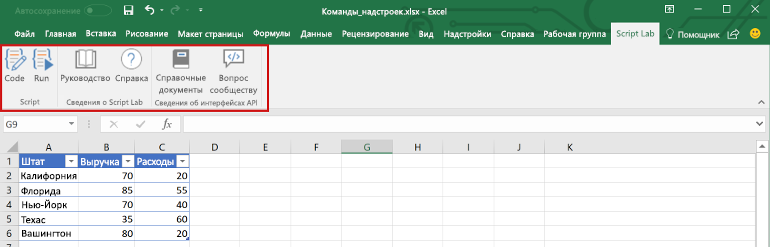
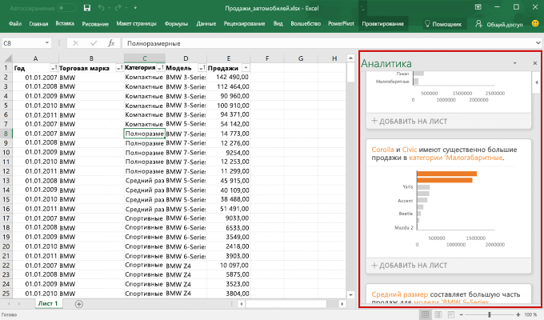
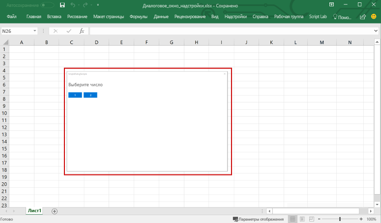
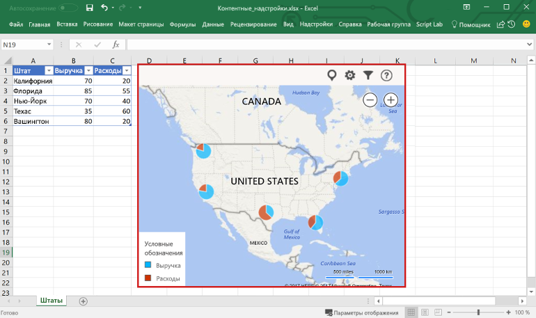

# Общие сведения о надстройках Excel

С помощью надстройки Excel можно расширить возможности приложения Excel на различных платформах, в том числе Office для Windows, Office Online, Office для Mac и Office для iPad. Используйте надстройки в книге Excel, чтобы:

- взаимодействовать с объектами Excel, считывать и записывать данные Excel; 
- расширять возможности с помощью области задач или области содержимого; 
- добавлять настраиваемые кнопки ленты или элементы контекстного меню;
- расширять возможности взаимодействия с помощью диалогового окна. 

В качестве основы используется платформа надстроек Office, предоставляющая API JavaScript для Office.js, с помощью которых можно создавать и запускать надстройки Excel. Используя платформу надстроек Office для создания надстройки Excel, вы получаете следующие преимущества:

* **Кроссплатформенная поддержка**. Надстройки Excel работают в Office для Windows, Mac, iOS и Office Online.
* **Централизованное развертывание.** Администраторы могут легко и быстро развертывать надстройки Excel для пользователей в организации.
* **Использование стандартных веб-технологий**. Создавайте надстройки Excel, используя знакомые веб-технологии — HTML, CSS и JavaScript.
* **Распространение через AppSource**. Представьте свою надстройку Excel широкой аудитории, опубликовав ее в [AppSource](https://appsource.microsoft.com/marketplace/apps?product=office&page=1&src=office&corrid=53245fad-fcbe-41f8-9f97-b0840264f97c&omexanonuid=4a0102fb-b31a-4b9f-9bb0-39d4cc6b789d).

> [!NOTE]
> Надстройки Excel отличаются от надстроек COM и VSTO — устаревших решений для интеграции с Office, работающих только в Office для Windows. В отличие от надстроек COM, надстройки Excel не требуют установки какого-либо кода на устройстве пользователя или в Excel. 

## Компоненты надстройки Excel 

Надстройка Excel включает два основных компонента: веб-приложение и файл конфигурации, называемый файлом манифеста. 

Веб-приложение использует [API JavaScript для Office](https://docs.microsoft.com/office/dev/add-ins/reference/javascript-api-for-office) для взаимодействия с объектами в Excel, а также может упрощать работу с ресурсами в Интернете. Например, надстройка может выполнять следующие действия:

* создавать, читать, обновлять и удалять данные в книге (листы, диапазоны, таблицы, диаграммы, именованные элементы и т. д.);
* выполнять авторизацию пользователя в веб-службе с помощью стандартного потока OAuth 2.0;
* отправлять запросы к API Microsoft Graph или другому API.

Веб-приложение может размещаться на любом веб-сервере, а для его создания можно использовать как клиентские платформы (например, Angular, React, jQuery), так и серверные технологии (например, ASP.NET, Node.js, PHP).

[Манифест](../develop/add-in-manifests.md) — это XML-файл конфигурации, который определяет, как надстройка интегрируется с клиентами Office, указывая параметры и возможности, такие как: 

* URL-адрес веб-приложения надстройки;
* отображаемое имя, описание, идентификатор, версию и языковой стандарт по умолчанию для надстройки;
* способ интеграции надстройки с Excel, включая настраиваемый пользовательский интерфейс, создаваемый надстройкой (кнопки ленты, контекстные меню и т. д.);
* разрешения, необходимые надстройке, например чтение и запись документа.

Чтобы пользователи могли устанавливать и использовать надстройку Excel, необходимо опубликовать ее манифест в AppSource или каталоге надстроек. 

## Возможности надстройки Excel

Надстройки Excel могут не только взаимодействовать с содержимым книги, но и добавлять настраиваемые кнопки ленты и команды меню, вставлять области задач, открывать диалоговые окна и даже внедрять в лист многофункциональные веб-объекты, например диаграммы или интерактивные визуализации.

### Команды надстроек

Команды надстройки — это элементы пользовательского интерфейса, расширяющие возможности пользовательского интерфейса Excel по умолчанию и запускающие действия в надстройке. С помощью команд надстроек можно добавить кнопку на ленту или пункт в контекстное меню в Excel. Когда пользователи выбирают команду надстройки, выполняется действие, например запуск кода JavaScript или отображение страницы надстройки на панели задач. 

**Команды надстроек**

Дополнительные сведения о возможностях команд и поддерживаемых платформах, а также рекомендации по разработке команд надстроек см. в статье [Команды надстроек для Excel, Word и PowerPoint](../design/add-in-commands.md).

### Области задач

Области задач — это области в интерфейсе, которые обычно отображаются в правой части окна приложения Excel. В областях задач расположены элементы управления, с помощью которых запускается код для изменения документа Excel или отображения данных из источника данных. 

**Область задач**

Дополнительные сведения об областях задач см. в статье [Области задач в надстройках Office](../design/task-pane-add-ins.md). Пример реализации области задач в Excel: [Тенденции расходов банка WoodGrove](https://github.com/OfficeDev/Excel-Add-in-WoodGrove-Expense-Trends) на JS.

### Диалоговые окна

Диалоговые окна — это поверхности, которые накладываются на активное окно приложения Excel. Например, с помощью диалоговых окон можно отображать страницы входа, которые невозможно открыть непосредственно в области задач, запрашивать подтверждение действий пользователем и размещать видео, которые могут не помещаться в области задач. Чтобы открывать диалоговые окна в надстройке Excel, используйте [API диалоговых окон](https://docs.microsoft.com/javascript/api/office/office.ui).

**Диалоговое окно**

Дополнительные сведения о диалоговых окнах и соответствующем API см. в статьях [Диалоговые окна в надстройках Office](../design/dialog-boxes.md) и [Использование API диалоговых окон в надстройках Office](../develop/dialog-api-in-office-add-ins.md).

### Контентные надстройки

Контентные надстройки — это поверхности, которые можно внедрять непосредственно в документы Excel. С помощью контентных надстроек можно внедрять в лист многофункциональные веб-объекты, например диаграммы, визуализации данных и файлы мультимедиа, или предоставлять пользователям доступ к элементам управления интерфейса, выполняющим код для изменения документа Excel или отображения данных из источника. Используйте контентные надстройки, когда требуется внедрить функции непосредственно в документ.

**Контентная надстройка**

Дополнительные сведения о контентных надстройках см. в статье [Контентные надстройки Office](../design/content-add-ins.md). Пример контентной надстройки Excel: [Humongous Insurance](https://github.com/OfficeDev/Excel-Content-Add-in-Humongous-Insurance) на сайте GitHub.

## API JavaScript для взаимодействия с содержимым книги

Надстройка Excel взаимодействует с объектами в Excel с помощью [API JavaScript для Office](https://docs.microsoft.com/office/dev/add-ins/reference/javascript-api-for-office), включающего две объектных модели JavaScript.

* **API JavaScript для Excel**. Появившийся в Office 2016 [API JavaScript для Excel](https://docs.microsoft.com/office/dev/add-ins/reference/overview/excel-add-ins-reference-overview) предоставляет строго типизированные объекты, с помощью которых можно получать доступ к листам, диапазонам, таблицам, диаграммам и другим объектам. 

* **Общий API**. Появившийся в Office 2013 общий API можно использовать для доступа к таким компонентам, как пользовательский интерфейс, диалоговые окна и параметры клиентов, общие для нескольких типов ведущих приложений, например Word, Excel и PowerPoint. Общий API предоставляет ограниченные возможности по взаимодействию с Excel, поэтому его можно использовать, если надстройка должна работать в Excel 2013.

## Дальнейшие действия

Приступите к [созданию своей первой надстройки Excel](excel-add-ins-get-started-overview.md). Затем ознакомьтесь с [основными понятиями](excel-add-ins-core-concepts.md), связанными с созданием надстроек Excel.

## См. также

- [Обзор платформы надстроек Office](../overview/office-add-ins.md)
- [Рекомендации по разработке надстроек Office](../concepts/add-in-development-best-practices.md)
- [Рекомендации по проектированию надстроек Office](../design/add-in-design.md)
- [Основные концепции программирования с помощью API JavaScript для Excel](excel-add-ins-core-concepts.md)
- [Справочник по API JavaScript для Excel](https://docs.microsoft.com/office/dev/add-ins/reference/overview/excel-add-ins-reference-overview)
