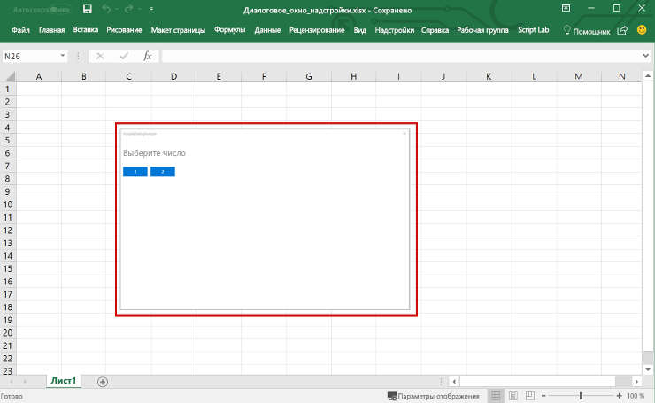

# Общие сведения о надстройках ExcelExcel add-ins overview

С помощью надстройки Excel можно расширить возможности приложения Excel на различных платформах, в том числе Windows, Mac, iPad и в браузере. Используйте надстройки в книге Excel, чтобы:An Excel add-in allows you to extend Excel application functionality across multiple platforms including Windows, Mac, iPad, and in a browser. Use Excel add-ins within a workbook to:

- взаимодействовать с объектами Excel, считывать и записывать данные Excel;Interact with Excel objects, read and write Excel data.
- расширять возможности с помощью области задач или области содержимого;Extend functionality using web based task pane or content pane
- добавлять настраиваемые кнопки ленты или элементы контекстного меню;Add custom ribbon buttons or contextual menu items
- добавлять пользовательские функции;Add custom functions
- расширять возможности взаимодействия с помощью диалогового окна.Provide richer interaction using dialog window

В качестве основы используется платформа надстроек Office, предоставляющая API JavaScript для Office.js, с помощью которых можно создавать и запускать надстройки Excel. Используя платформу надстроек Office для создания надстройки Excel, вы получаете следующие преимущества:The Office Add-ins platform provides the framework and Office.js JavaScript APIs that enable you to create and run Excel add-ins. By using the Office Add-ins platform to create your Excel add-in, you'll get the following benefits:

* **Кроссплатформенная поддержка**. Надстройки Excel работают в Office в Интернете, Office для Windows, Office для Mac и Office для iPad.**Cross-platform support**: Excel add-ins run in Office on the web, Windows, Mac, and iPad.
* **Централизованное развертывание.** Администраторы могут легко и быстро развертывать надстройки Excel для пользователей в организации.**Centralized deployment**: Admins can quickly and easily deploy Excel add-ins to users throughout an organization.
* **Использование стандартных веб-технологий**. Создавайте надстройки Excel, используя знакомые веб-технологии — HTML, CSS и JavaScript.**Use of standard web technology**: Create your Excel add-in using familiar web technologies such as HTML, CSS, and JavaScript.
* **Распространение через AppSource**. Представьте свою надстройку Excel широкой аудитории, опубликовав ее в [AppSource](https://appsource.microsoft.com/marketplace/apps?product=office&page=1&src=office&corrid=53245fad-fcbe-41f8-9f97-b0840264f97c&omexanonuid=4a0102fb-b31a-4b9f-9bb0-39d4cc6b789d).**Distribution via AppSource**: Share your Excel add-in with a broad audience by publishing it to [AppSource](https://appsource.microsoft.com/marketplace/apps?product=office&page=1&src=office&corrid=53245fad-fcbe-41f8-9f97-b0840264f97c&omexanonuid=4a0102fb-b31a-4b9f-9bb0-39d4cc6b789d).

> [!NOTE]
> Надстройки Excel отличаются от надстроек COM и VSTO — устаревших решений для интеграции с Office, работающих только в Office для Windows. В отличие от надстроек COM, надстройки Excel не требуют установки какого-либо кода на устройстве пользователя или в Excel.Excel add-ins are different from COM and VSTO add-ins, which are earlier Office integration solutions that run only in Office on Windows. Unlike COM add-ins, Excel add-ins do not require you to install any code on a user's device, or within Excel.

## Компоненты надстройки ExcelComponents of an Excel add-in

Надстройка Excel включает два основных компонента: веб-приложение и файл конфигурации, называемый файлом манифеста.An Excel add-in includes two basic components: a web application and a configuration file, called a manifest file. 

Веб-приложение использует [API JavaScript для Office](../reference/javascript-api-for-office.md) для взаимодействия с объектами в Excel, а также может упрощать работу с ресурсами в Интернете. Например, надстройка может выполнять следующие действия:The web application uses the [Office JavaScript API](../reference/javascript-api-for-office.md) to interact with objects in Excel, and can also facilitate interaction with online resources. For example, an add-in can perform any of the following tasks:

* создавать, читать, обновлять и удалять данные в книге (листы, диапазоны, таблицы, диаграммы, именованные элементы и т. д.);Create, read, update, and delete data in the workbook (worksheets, ranges, tables, charts, named items, and more).
* выполнять авторизацию пользователя в веб-службе с помощью стандартного потока OAuth 2.0;Perform user authorization with an online service by using the standard OAuth 2.0 flow.
* отправлять запросы к API Microsoft Graph или другому API.Issue API requests to Microsoft Graph or any other API.

Веб-приложение может размещаться на любом веб-сервере, а для его создания можно использовать как клиентские платформы (например, Angular, React, jQuery), так и серверные технологии (например, ASP.NET, Node.js, PHP).The web application can be hosted on any web server, and can be built using client-side frameworks (such as Angular, React, jQuery) or server-side technologies (such as ASP.NET, Node.js, PHP).

[Манифест](../develop/add-in-manifests.md) — это XML-файл конфигурации, который определяет, как надстройка интегрируется с клиентами Office, указывая параметры и возможности, такие как:The [manifest](../develop/add-in-manifests.md) is an XML configuration file that defines how the add-in integrates with Office clients by specifying settings and capabilities such as:

* URL-адрес веб-приложения надстройки;The URL of the add-in's web application.
* отображаемое имя, описание, идентификатор, версию и языковой стандарт по умолчанию для надстройки;The add-in's display name, description, ID, version, and default locale.
* способ интеграции надстройки с Excel, включая настраиваемый пользовательский интерфейс, создаваемый надстройкой (кнопки ленты, контекстные меню и т. д.);How the add-in integrates with Excel, including any custom UI that the add-in creates (ribbon buttons, context menus, and so on).
* разрешения, необходимые надстройке, например чтение и запись документа.Permissions that the add-in requires, such as reading and writing to the document.

Чтобы пользователи могли устанавливать и использовать надстройку Excel, необходимо опубликовать ее манифест в AppSource или каталоге надстроек.To enable end users to install and use an Excel add-in, you must publish its manifest either to AppSource or to an add-ins catalog. Дополнительные сведения о публикации в AppSource см. в статье [Публикация решений в AppSource и в Office](/office/dev/store/submit-to-appsource-via-partner-center).For details about publishing to AppSource, see [Make your solutions available in AppSource and within Office](/office/dev/store/submit-to-appsource-via-partner-center).

## Возможности надстройки ExcelCapabilities of an Excel add-in

Надстройки Excel могут не только взаимодействовать с содержимым книги, но и добавлять настраиваемые кнопки ленты и команды меню, вставлять области задач, добавлять пользовательские функции, открывать диалоговые окна и даже внедрять в лист многофункциональные веб-объекты, например диаграммы или интерактивные визуализации.In addition to interacting with the content in the workbook, Excel add-ins can add custom ribbon buttons or menu commands, insert task panes, add custom functions, open dialog boxes, and even embed rich, web-based objects such as charts or interactive visualizations within a worksheet.

### Команды надстроекAdd-in commands

Команды надстройки — это элементы пользовательского интерфейса, расширяющие возможности пользовательского интерфейса Excel по умолчанию и запускающие действия в надстройке. С помощью команд надстроек можно добавить кнопку на ленту или пункт в контекстное меню в Excel. Когда пользователи выбирают команду надстройки, выполняется действие, например запуск кода JavaScript или отображение страницы надстройки на панели задач.Add-in commands are UI elements that extend the Excel UI and start actions in your add-in. You can use add-in commands to add a button on the ribbon or an item to a context menu in Excel. When users select an add-in command, they initiate actions such as running JavaScript code, or showing a page of the add-in in a task pane. 

**Команды надстроек****Add-in commands**

Дополнительные сведения о возможностях команд и поддерживаемых платформах, а также рекомендации по разработке команд надстроек см. в статье [Команды надстроек для Excel, Word и PowerPoint](../design/add-in-commands.md).For more information about command capabilities, supported platforms, and best practices for developing add-in commands, see [Add-in commands for Excel, Word, and PowerPoint](../design/add-in-commands.md).

### Области задачTask panes

Области задач — это области в интерфейсе, которые обычно отображаются в правой части окна приложения Excel. В областях задач расположены элементы управления, с помощью которых запускается код для изменения документа Excel или отображения данных из источника данных.Task panes are interface surfaces that typically appear on the right side of the window within Excel. Task panes give users access to interface controls that run code to modify the Excel document or display data from a data source. 

**Область задач****Task pane**

Дополнительные сведения об областях задач см. в статье [Области задач в надстройках Office](../design/task-pane-add-ins.md). Пример реализации области задач в Excel: [Тенденции расходов банка WoodGrove](https://github.com/OfficeDev/Excel-Add-in-WoodGrove-Expense-Trends) на JS.For more information about task panes, see [Task panes in Office Add-ins](../design/task-pane-add-ins.md). For a sample that implements a task pane in Excel, see [Excel Add-in JS WoodGrove Expense Trends](https://github.com/OfficeDev/Excel-Add-in-WoodGrove-Expense-Trends).

### Пользовательские функцииCustom functions

Пользовательские функции позволяют разработчикам добавлять новые функции в Excel путем определения этих функций в JavaScript как части надстройки.Custom functions enable developers to add new functions to Excel by defining those functions in JavaScript as part of an add-in. Пользователи в Excel могут получить доступ к пользовательским функциям так же, как и к любой встроенной функции в Excel, например `SUM()`.Users within Excel can access custom functions just as they would any native function in Excel, such as `SUM()`. 

**Пользовательская функция****Custom function**

Дополнительные сведения о пользовательских функциях см. в статье [Создание пользовательских функций в Excel](custom-functions-overview.md).For more information about custom functions, see [Create custom functions in Excel](custom-functions-overview.md).

### Диалоговые окнаDialog boxes

Диалоговые окна — это поверхности, которые накладываются на активное окно приложения Excel. Например, с помощью диалоговых окон можно отображать страницы входа, которые невозможно открыть непосредственно в области задач, запрашивать подтверждение действий пользователем и размещать видео, которые могут не помещаться в области задач. Чтобы открывать диалоговые окна в надстройке Excel, используйте [API диалоговых окон](/javascript/api/office/office.ui).Dialog boxes are surfaces that float above the active Excel application window. You can use dialog boxes for tasks such as displaying sign-in pages that can't be opened directly in a task pane, requesting that the user confirm an action, or hosting videos that might be too small if confined to a task pane. To open dialog boxes in your Excel add-in, use the [Dialog API](/javascript/api/office/office.ui).

**Диалоговое окно****Dialog box**

Дополнительные сведения о диалоговых окнах и соответствующем API см. в статьях [Диалоговые окна в надстройках Office](../design/dialog-boxes.md) и [Использование API диалоговых окон в надстройках Office](../develop/dialog-api-in-office-add-ins.md).For more information about dialog boxes and the Dialog API, see [Dialog boxes in Office Add-ins](../design/dialog-boxes.md) and [Use the Dialog API in your Office Add-ins](../develop/dialog-api-in-office-add-ins.md).

### Контентные надстройкиContent add-ins

Контентные надстройки — это поверхности, которые можно внедрять непосредственно в документы Excel. С помощью контентных надстроек можно внедрять в лист многофункциональные веб-объекты, например диаграммы, визуализации данных и файлы мультимедиа, или предоставлять пользователям доступ к элементам управления интерфейса, выполняющим код для изменения документа Excel или отображения данных из источника. Используйте контентные надстройки, когда требуется внедрить функции непосредственно в документ.Content add-ins are surfaces that you can embed directly into Excel documents. You can use content add-ins to embed rich, web-based objects such as charts, data visualizations, or media into a worksheet or to give users access to interface controls that run code to modify the Excel document or display data from a data source. Use content add-ins when you want to embed functionality directly into the document.

**Контентная надстройка****Content add-in**

Дополнительные сведения о контентных надстройках см. в статье [Контентные надстройки Office](../design/content-add-ins.md). Пример контентной надстройки Excel: [Humongous Insurance](https://github.com/OfficeDev/Excel-Content-Add-in-Humongous-Insurance) на сайте GitHub.For more information about content add-ins, see [Content Office Add-ins](../design/content-add-ins.md). For a sample that implements a content add-in in Excel, see [Excel Content Add-in Humongous Insurance](https://github.com/OfficeDev/Excel-Content-Add-in-Humongous-Insurance) in GitHub.

## API JavaScript для взаимодействия с содержимым книгиJavaScript APIs to interact with workbook content

Надстройка Excel взаимодействует с объектами в Excel с помощью [API JavaScript для Office](../reference/javascript-api-for-office.md), включающего две объектных модели JavaScript:An Excel add-in interacts with objects in Excel by using the [Office JavaScript API](../reference/javascript-api-for-office.md), which includes two JavaScript object models:

* **API JavaScript для Excel**. Появившийся в Office 2016 [API JavaScript для Excel](../reference/overview/excel-add-ins-reference-overview.md) предоставляет строго типизированные объекты, с помощью которых можно получать доступ к листам, диапазонам, таблицам, диаграммам и другим объектам.**Excel JavaScript API**: Introduced with Office 2016, the [Excel JavaScript API](../reference/overview/excel-add-ins-reference-overview.md) provides strongly-typed Excel objects that you can use to access worksheets, ranges, tables, charts, and more. 

* **Общие API**. Появившиеся в Office 2013 общие API позволяют получать доступ к таким компонентам, как пользовательский интерфейс, диалоговые окна и параметры клиентов, общие для нескольких типов приложений Office.**Common API**: Introduced with Office 2013, the Common API enables you to access features such as UI, dialogs, and client settings that are common across multiple types of Office applications. Общий API предоставляет ограниченные возможности по взаимодействию с Excel, поэтому его можно использовать, если надстройка должна работать в Excel 2013.Because the Common API does provide limited functionality for Excel interaction, you can use it if your add-in needs to run on Excel 2013.

## Дальнейшие действияNext steps

Приступите к [созданию своей первой надстройки Excel](../quickstarts/excel-quickstart-jquery.md).Get started by [creating your first Excel add-in](../quickstarts/excel-quickstart-jquery.md). Затем ознакомьтесь с [основными понятиями](excel-add-ins-core-concepts.md), связанными с созданием надстроек Excel.Then, learn about the [core concepts](excel-add-ins-core-concepts.md) of building Excel add-ins.

## См. такжеSee also

- [Обзор платформы надстроек OfficeOffice Add-ins platform overview](../overview/office-add-ins.md)
- [Создание надстроек OfficeBuilding Office Add-ins](../overview/office-add-ins-fundamentals.md)
- [Основные концепции программирования с помощью API JavaScript для ExcelFundamental programming concepts with the Excel JavaScript API](excel-add-ins-core-concepts.md)
- [Справочник по API JavaScript для ExcelExcel JavaScript API reference](../reference/overview/excel-add-ins-reference-overview.md)