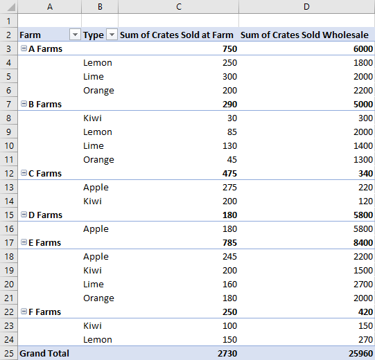

# <a name="work-with-pivottables-using-the-excel-javascript-api"></a>Работа с pivotTables с помощью Excel API JavaScript

PivotTables упрощают большие наборы данных. Они позволяют быстро манипулировать сгруппными данными. API Excel JavaScript позволяет надстройки создавать pivotTables и взаимодействовать с их компонентами. В этой статье описывается, как pivotTables представлены API javaScript Office JavaScript и представлены примеры кода для ключевых сценариев.

Если вы не знакомы с функциями PivotTables, рассмотрите их в качестве конечного пользователя.
См. [в этой ссылке Создание pivotTable](https://support.microsoft.com/office/ccd3c4a6-272f-4c97-afbb-d3f27407fcde#ID0EBBD=PivotTables) для анализа данных таблицы для хорошей грунтовки на этих средствах.

> [!IMPORTANT]
> В настоящее время не поддерживаются pivotTables, созданные с помощью OLAP. Также не поддерживается power Pivot.

## <a name="object-model"></a>Объектная модель

[PivotTable](/javascript/api/excel/excel.pivottable) — это центральный объект для pivotTables в API javaScript Office JavaScript.

- `Workbook.pivotTables` и `Worksheet.pivotTables` [являются pivotTableCollections,](/javascript/api/excel/excel.pivottablecollection) которые содержат [pivotTables](/javascript/api/excel/excel.pivottable) в книге и таблице, соответственно.
- [PivotTable содержит](/javascript/api/excel/excel.pivottable) [pivotHierarchyCollection](/javascript/api/excel/excel.pivothierarchycollection) с несколькими [pivotHierarchies.](/javascript/api/excel/excel.pivothierarchy)
- Эти [pivotHierarchies](/javascript/api/excel/excel.pivothierarchy) можно добавить в определенные коллекции иерархии, чтобы определить, как pivotTable определяет данные поворотов (как по объяснению в [следующем разделе).](#hierarchies)
- [PivotHierarchy содержит](/javascript/api/excel/excel.pivothierarchy) [PivotFieldCollection,](/javascript/api/excel/excel.pivotfieldcollection) который имеет ровно один [PivotField](/javascript/api/excel/excel.pivotfield). Если проект расширяется и включает pivotTables OLAP, это может измениться.
- В [PivotField](/javascript/api/excel/excel.pivotfield) может применяться один или несколько [pivotFilters,](/javascript/api/excel/excel.pivotfilters) если [pivotHierarchy](/javascript/api/excel/excel.pivothierarchy) поля назначено в категорию иерархии.
- [PivotField содержит](/javascript/api/excel/excel.pivotfield) [pivotItemCollection](/javascript/api/excel/excel.pivotitemcollection) с несколькими [pivotItems.](/javascript/api/excel/excel.pivotitem)
- [PivotTable](/javascript/api/excel/excel.pivottable) содержит [pivotLayout,](/javascript/api/excel/excel.pivotlayout) который определяет, где в таблице отображаются [PivotFields](/javascript/api/excel/excel.pivotfield) и [PivotItems.](/javascript/api/excel/excel.pivotitem) Макет также управляет некоторыми настройками отображения для PivotTable.

Давайте рассмотрим, как эти отношения применяются к некоторым примерным данным. В следующих данных описываются продажи фруктов из различных ферм. Это будет пример всей этой статьи.


Эти данные о продажах фермы будут использоваться для того, чтобы сделать PivotTable. Каждый столбец, например **Types,** является `PivotHierarchy` . Иерархия **Типов** содержит поле **Типы.** Поле **Types** содержит элементы **Apple,** **Kiwi,** **Lemon,** **Lime** и **Orange.**

### <a name="hierarchies"></a>Hierarchies

PivotTables организованы на основе четырех категорий иерархии: [строка,](/javascript/api/excel/excel.rowcolumnpivothierarchy) [столбец,](/javascript/api/excel/excel.rowcolumnpivothierarchy) [данные](/javascript/api/excel/excel.datapivothierarchy)и [фильтр](/javascript/api/excel/excel.filterpivothierarchy).

Данные фермы, показанные ранее, имеет пять иерархий: **фермы,** **тип,** **классификация,** ящики, проданные на **ферме,** и **ящики продаются** оптом. Каждая иерархия может существовать только в одной из четырех категорий. Если **тип** добавляется в иерархии столбцов, он также не может быть в строке, данных или иерархиях фильтрации. Если **type** впоследствии добавляется в иерархии строк, он удаляется из иерархий столбцов. Это поведение одинаково, если назначение иерархии Excel пользовательского интерфейса или Excel API JavaScript.

Иерархии строк и столбцов определяют группу данных. Например, иерархия строк  Фермы сгруппит все наборы данных из одной фермы. Выбор иерархии строк и столбцов определяет ориентацию pivotTable.

Иерархии данных — это значения, которые будут агрегироваться на основе иерархий строк и столбцов. PivotTable с иерархией строк  ферм и иерархией  данных оптовой продажи ящиков показывает общую сумму (по умолчанию) всех различных фруктов для каждой фермы.

Иерархии фильтров включают или исключают данные из поворота на основе значений этого фильтрованного типа. Иерархия фильтров **классификации** с выбранным типом **Органический** показывает только данные для органических фруктов.

Вот еще раз данные фермы, а также pivotTable. PivotTable использует  Ферму  и Тип в качестве иерархий **строк,** Ящики, проданные в ферме, а ящики продаются  оптом в качестве иерархий данных (с функцией суммы агрегации по умолчанию) и Классификация как иерархия фильтров (с органическим выбранным).  


Этот pivotTable может быть создан с помощью API JavaScript или Excel пользовательского интерфейса. Оба варианта позволяют дальнейшие манипуляции с помощью надстройок.

## <a name="create-a-pivottable"></a>Создание pivotTable

Для pivotTables необходимо имя, источник и пункт назначения. Источником может быть адрес диапазона или имя таблицы (передается как `Range` , `string` или `Table` тип). Пункт назначения — это адрес диапазона (дается как a `Range` `string` или).
В следующих примерах покажут различные методы создания pivotTable.

### <a name="create-a-pivottable-with-range-addresses"></a>Создание pivotTable с адресами диапазона

```js
Excel.run(function (context) {
    // Create a PivotTable named "Farm Sales" on the current worksheet at cell
    // A22 with data from the range A1:E21.
    context.workbook.worksheets.getActiveWorksheet().pivotTables.add(
      "Farm Sales", "A1:E21", "A22");

    return context.sync();
});
```

### <a name="create-a-pivottable-with-range-objects"></a>Создание pivotTable с объектами Range

```js
Excel.run(function (context) {
    // Create a PivotTable named "Farm Sales" on a worksheet called "PivotWorksheet" at cell A2
    // the data comes from the worksheet "DataWorksheet" across the range A1:E21.
    var rangeToAnalyze = context.workbook.worksheets.getItem("DataWorksheet").getRange("A1:E21");
    var rangeToPlacePivot = context.workbook.worksheets.getItem("PivotWorksheet").getRange("A2");
    context.workbook.worksheets.getItem("PivotWorksheet").pivotTables.add(
      "Farm Sales", rangeToAnalyze, rangeToPlacePivot);

    return context.sync();
});
```

### <a name="create-a-pivottable-at-the-workbook-level"></a>Создание pivotTable на уровне книги

```js
Excel.run(function (context) {
    // Create a PivotTable named "Farm Sales" on a worksheet called "PivotWorksheet" at cell A2
    // the data is from the worksheet "DataWorksheet" across the range A1:E21.
    context.workbook.pivotTables.add(
        "Farm Sales", "DataWorksheet!A1:E21", "PivotWorksheet!A2");

    return context.sync();
});
```

## <a name="use-an-existing-pivottable"></a>Использование существующего pivotTable

Созданные вручную pivotTables также доступны через коллекцию PivotTable книги или отдельных таблиц. Следующий код получает pivotTable с именем **My Pivot из** книги.

```js
Excel.run(function (context) {
    var pivotTable = context.workbook.pivotTables.getItem("My Pivot");
    return context.sync();
});
```

## <a name="add-rows-and-columns-to-a-pivottable"></a>Добавление строк и столбцов в pivotTable

Строки и столбцы совмещут данные вокруг значений этих полей.

Добавление **столбца Ферма** является поворотным для всех продаж каждой фермы. Добавление строк **Тип** и **Классификация** еще больше разбивает данные, основанные на том, какие фрукты были проданы и были ли они органическими или нет.


```js
Excel.run(function (context) {
    var pivotTable = context.workbook.worksheets.getActiveWorksheet().pivotTables.getItem("Farm Sales");

    pivotTable.rowHierarchies.add(pivotTable.hierarchies.getItem("Type"));
    pivotTable.rowHierarchies.add(pivotTable.hierarchies.getItem("Classification"));

    pivotTable.columnHierarchies.add(pivotTable.hierarchies.getItem("Farm"));

    return context.sync();
});
```

Вы также можете иметь pivotTable только с строками или столбцами.

```js
Excel.run(function (context) {
    var pivotTable = context.workbook.worksheets.getActiveWorksheet().pivotTables.getItem("Farm Sales");
    pivotTable.rowHierarchies.add(pivotTable.hierarchies.getItem("Farm"));
    pivotTable.rowHierarchies.add(pivotTable.hierarchies.getItem("Type"));
    pivotTable.rowHierarchies.add(pivotTable.hierarchies.getItem("Classification"));

    return context.sync();
});
```

## <a name="add-data-hierarchies-to-the-pivottable"></a>Добавление иерархий данных в PivotTable

Иерархии данных заполняют PivotTable информацией, которую необходимо объединить на основе строк и столбцов. Добавление иерархий данных ящиков, проданных в **farm** и **Crates Sold Wholesale,** дает суммы этих цифр для каждой строки и столбца.

В примере **и Farm,** и **Type** — строки, а в качестве данных — объем продаж ящика.


```js
Excel.run(function (context) {
    var pivotTable = context.workbook.worksheets.getActiveWorksheet().pivotTables.getItem("Farm Sales");

    // "Farm" and "Type" are the hierarchies on which the aggregation is based.
    pivotTable.rowHierarchies.add(pivotTable.hierarchies.getItem("Farm"));
    pivotTable.rowHierarchies.add(pivotTable.hierarchies.getItem("Type"));

    // "Crates Sold at Farm" and "Crates Sold Wholesale" are the hierarchies
    // that will have their data aggregated (summed in this case).
    pivotTable.dataHierarchies.add(pivotTable.hierarchies.getItem("Crates Sold at Farm"));
    pivotTable.dataHierarchies.add(pivotTable.hierarchies.getItem("Crates Sold Wholesale"));

    return context.sync();
});
```

## <a name="pivottable-layouts-and-getting-pivoted-data"></a>Макеты pivotTable и получение pivoted данных

[PivotLayout](/javascript/api/excel/excel.pivotlayout) определяет размещение иерархий и их данных. Вы можете получить доступ к макету, чтобы определить диапазоны хранения данных.

На следующей схеме показано, какие вызовы функции макета соответствуют диапазонам pivotTable.


### <a name="get-data-from-the-pivottable"></a>Получать данные из PivotTable

Макет определяет отображение pivotTable в таблице. Это означает, `PivotLayout` что объект управляет диапазонами, используемыми для элементов PivotTable. Используйте диапазоны, предоставляемые макетом, чтобы получить данные, собранные и агрегированные сводной. В частности, используйте `PivotLayout.getDataBodyRange` для доступа к данным, производимым pivotTable.

В следующем коде показано, как получить последнюю строку данных PivotTable, проехав макет (общее  общее количество как суммы ящиков, проданных на ферме, так и суммы столбцов, проданных в начале примера).   Затем эти значения суммируется для итогового итогового значения, отображаемого в ячейке **E30** (за пределами PivotTable).

```js
Excel.run(function (context) {
    var pivotTable = context.workbook.worksheets.getActiveWorksheet().pivotTables.getItem("Farm Sales");

    // Get the totals for each data hierarchy from the layout.
    var range = pivotTable.layout.getDataBodyRange();
    var grandTotalRange = range.getLastRow();
    grandTotalRange.load("address");
    return context.sync().then(function () {
        // Sum the totals from the PivotTable data hierarchies and place them in a new range, outside of the PivotTable.
        var masterTotalRange = context.workbook.worksheets.getActiveWorksheet().getRange("E30");
        masterTotalRange.formulas = [["=SUM(" + grandTotalRange.address + ")"]];
    });
});
```

### <a name="layout-types"></a>Типы макетов

PivotTables имеют три стиля макета: Compact, Outline и Tabular. В предыдущих примерах мы видели компактный стиль.

В следующих примерах используются, соответственно, схемы и табулярные стили. Пример кода показывает цикл между различными макетами.

#### <a name="outline-layout"></a>Макет схемы



#### <a name="tabular-layout"></a>Макет табуляра


#### <a name="pivotlayout-type-switch-code-sample"></a>Пример кода коммутатора типа PivotLayout

```js
Excel.run(function (context) {
    // Change the PivotLayout.type to a new type.
    var pivotTable = context.workbook.worksheets.getActiveWorksheet().pivotTables.getItem("Farm Sales");
    pivotTable.layout.load("layoutType");
    return context.sync().then(function () {
        // Cycle between the three layout types.
        if (pivotTable.layout.layoutType === "Compact") {
            pivotTable.layout.layoutType = "Outline";
        } else if (pivotTable.layout.layoutType === "Outline") {
            pivotTable.layout.layoutType = "Tabular";
        } else {
            pivotTable.layout.layoutType = "Compact";
        }
    
        return context.sync();
    });
});
```

### <a name="other-pivotlayout-functions"></a>Другие функции PivotLayout

По умолчанию pivotTables корректирует размер строки и столбца по мере необходимости. Это делается при обновлении PivotTable. `PivotLayout.autoFormat` указывает такое поведение. Любые изменения размера строки или столбца, внесенные вашей надстройки, сохраняются, `autoFormat` когда `false` это . Кроме того, параметры pivotTable по умолчанию сохраняют настраиваемый форматирование в PivotTable (например, изменения заливок и шрифтов). Установите `PivotLayout.preserveFormatting` для `false` применения формата по умолчанию при обновлении.

Кроме того, элемент управления загонами и параметров общей строки, отображение пустых ячеек данных `PivotLayout` и [параметры текста alt.](https://support.microsoft.com/topic/44989b2a-903c-4d9a-b742-6a75b451c669) Ссылка [PivotLayout](/javascript/api/excel/excel.pivotlayout) содержит полный список этих функций.

В следующем примере кода пустые ячейки данных отображают строку, форматировать диапазон тела до согласованного горизонтального выравнивания и гарантировать, что изменения форматирования остаются даже после обновления `"--"` PivotTable.

```js
Excel.run(function (context) {
    var pivotTable = context.workbook.pivotTables.getItem("Farm Sales");
    var pivotLayout = pivotTable.layout;

    // Set a default value for an empty cell in the PivotTable. This doesn't include cells left blank by the layout.
    pivotLayout.emptyCellText = "--";

    // Set the text alignment to match the rest of the PivotTable.
    pivotLayout.getDataBodyRange().format.horizontalAlignment = Excel.HorizontalAlignment.right;

    // Ensure empty cells are filled with a default value.
    pivotLayout.fillEmptyCells = true;

    // Ensure that the format settings persist, even after the PivotTable is refreshed and recalculated.
    pivotLayout.preserveFormatting = true;
    return context.sync();
});
```

## <a name="delete-a-pivottable"></a>Удаление pivotTable

PivotTables удаляются с помощью их имени.

```js
Excel.run(function (context) {
    context.workbook.worksheets.getItem("Pivot").pivotTables.getItem("Farm Sales").delete();
    return context.sync();
});
```

## <a name="filter-a-pivottable"></a>Фильтр pivotTable

Основной метод фильтрации данных pivotTable используется с помощью PivotFilters. Слайсеры предлагают альтернативный, менее гибкий метод фильтрации.

[PivotFilters](/javascript/api/excel/excel.pivotfilters) фильтрует данные на основе четырех категорий [](#hierarchies) иерархии PivotTable (фильтры, столбцы, строки и значения). Существует четыре типа pivotFilters, которые позволяют фильтрацию на основе дат календаря, размыв строк, сравнение номеров и фильтрацию на основе настраиваемого ввода.

[Срезы](/javascript/api/excel/excel.slicer) можно применять как к таблицам PivotTables, так и к Excel таблицам. При применении к pivotTable срезы функционируют как [PivotManualFilter](#pivotmanualfilter) и позволяют фильтрацию на основе настраиваемого ввода. В отличие от PivotFilters, срезеры имеют [компонент Excel пользовательского интерфейса.](https://support.microsoft.com/office/249f966b-a9d5-4b0f-b31a-12651785d29d) С помощью `Slicer` класса вы создаете этот компонент пользовательского интерфейса, управляете фильтрацией и контролируете его внешний вид.

### <a name="filter-with-pivotfilters"></a>Фильтр с помощью pivotFilters

[PivotFilters](/javascript/api/excel/excel.pivotfilters) позволяют фильтровать данные pivotTable на основе четырех категорий [иерархии](#hierarchies) (фильтры, столбцы, строки и значения). В объектной модели PivotTable применяются к `PivotFilters` [PivotField,](/javascript/api/excel/excel.pivotfield)и каждому из них может быть назначено одно `PivotField` или несколько `PivotFilters` объектов. Чтобы применить PivotFilters к PivotField, необходимо приурочеть соответствующую [pivotHierarchy](/javascript/api/excel/excel.pivothierarchy) поля к категории иерархии.

#### <a name="types-of-pivotfilters"></a>Типы pivotFilters

| Тип фильтра | Назначение фильтра | Справочные материалы по API JavaScript для Excel |
|:--- |:--- |:--- |
| DateFilter | Фильтрация на основе даты календаря. | [PivotDateFilter](/javascript/api/excel/excel.pivotdatefilter) |
| LabelFilter | Фильтрация сравнения текста. | [PivotLabelFilter](/javascript/api/excel/excel.pivotlabelfilter) |
| ManualFilter | Настраиваемая фильтрация входных данных. | [PivotManualFilter](/javascript/api/excel/excel.pivotmanualfilter) |
| ValueFilter | Фильтрация сравнения номеров. | [PivotValueFilter](/javascript/api/excel/excel.pivotvaluefilter) |

#### <a name="create-a-pivotfilter"></a>Создание pivotFilter

Чтобы фильтровать pivotTable данные с помощью (например, a), применить фильтр `Pivot*Filter` к `PivotDateFilter` [PivotField](/javascript/api/excel/excel.pivotfield). В следующих четырех примерах кода покажите, как использовать каждый из четырех типов PivotFilters.

##### <a name="pivotdatefilter"></a>PivotDateFilter

Первый пример кода применяет [pivotDateFilter к PivotDateFilter](/javascript/api/excel/excel.pivotdatefilter) с обновленным pivotField, скрывая все данные до **2020-08-01**. 

> [!IMPORTANT]
> A не может применяться к PivotField, если только pivotHierarchy этого поля не назначена в `Pivot*Filter` категорию иерархии. В следующем примере кода необходимо добавить его в категорию PivotTable, прежде чем его можно будет использовать `dateHierarchy` `rowHierarchies` для фильтрации.

```js
Excel.run(function (context) {
    // Get the PivotTable and the date hierarchy.
    var pivotTable = context.workbook.worksheets.getActiveWorksheet().pivotTables.getItem("Farm Sales");
    var dateHierarchy = pivotTable.rowHierarchies.getItemOrNullObject("Date Updated");
    
    return context.sync().then(function () {
        // PivotFilters can only be applied to PivotHierarchies that are being used for pivoting.
        // If it's not already there, add "Date Updated" to the hierarchies.
        if (dateHierarchy.isNullObject) {
          dateHierarchy = pivotTable.rowHierarchies.add(pivotTable.hierarchies.getItem("Date Updated"));
        }

        // Apply a date filter to filter out anything logged before August.
        var filterField = dateHierarchy.fields.getItem("Date Updated");
        var dateFilter = {
          condition: Excel.DateFilterCondition.afterOrEqualTo,
          comparator: {
            date: "2020-08-01",
            specificity: Excel.FilterDatetimeSpecificity.month
          }
        };
        filterField.applyFilter({ dateFilter: dateFilter });
        
        return context.sync();
    });
});
```

> [!NOTE]
> В следующих трех фрагментах кода отображаются только выдержки, определенные фильтром, а не полные `Excel.run` вызовы.

##### <a name="pivotlabelfilter"></a>PivotLabelFilter

Второй фрагмент кода демонстрирует, как применить [pivotLabelFilter](/javascript/api/excel/excel.pivotlabelfilter) к **Типу** PivotField, используя свойство для исключения меток, которые начинаются с буквы `LabelFilterCondition.beginsWith` **L**.

```js
    // Get the "Type" field.
    var filterField = pivotTable.hierarchies.getItem("Type").fields.getItem("Type");

    // Filter out any types that start with "L" ("Lemons" and "Limes" in this case).
    var filter: Excel.PivotLabelFilter = {
      condition: Excel.LabelFilterCondition.beginsWith,
      substring: "L",
      exclusive: true
    };

    // Apply the label filter to the field.
    filterField.applyFilter({ labelFilter: filter });
```

##### <a name="pivotmanualfilter"></a>PivotManualFilter

Третий фрагмент кода применяет ручной фильтр [с PivotManualFilter](/javascript/api/excel/excel.pivotmanualfilter) в поле **Классификация,** отфильтровыв данные, не включающие классификацию **Organic.**

```js
    // Apply a manual filter to include only a specific PivotItem (the string "Organic").
    var filterField = classHierarchy.fields.getItem("Classification");
    var manualFilter = { selectedItems: ["Organic"] };
    filterField.applyFilter({ manualFilter: manualFilter });
```

##### <a name="pivotvaluefilter"></a>PivotValueFilter

Чтобы сравнить числа, используйте фильтр значения [с PivotValueFilter,](/javascript/api/excel/excel.pivotvaluefilter)как показано в заключительном фрагменте кода. Эти данные сравнивают в pivotField фермы с данными в Оптовом pivotField, в том числе только фермами, сумма проданных ящиков превышает `PivotValueFilter` **значение 500**.  

```js
    // Get the "Farm" field.
    var filterField = pivotTable.hierarchies.getItem("Farm").fields.getItem("Farm");
    
    // Filter to only include rows with more than 500 wholesale crates sold.
    var filter: Excel.PivotValueFilter = {
      condition: Excel.ValueFilterCondition.greaterThan,
      comparator: 500,
      value: "Sum of Crates Sold Wholesale"
    };
    
    // Apply the value filter to the field.
    filterField.applyFilter({ valueFilter: filter });
```

#### <a name="remove-pivotfilters"></a>Удаление pivotFilters

Чтобы удалить все pivotFilters, применяем метод к каждому `clearAllFilters` PivotField, как показано в следующем примере кода.

```js
Excel.run(function (context) {
    // Get the PivotTable.
    var pivotTable = context.workbook.worksheets.getActiveWorksheet().pivotTables.getItem("Farm Sales");
    pivotTable.hierarchies.load("name");
    
    return context.sync().then(function () {
        // Clear the filters on each PivotField.
        pivotTable.hierarchies.items.forEach(function (hierarchy) {
          hierarchy.fields.getItem(hierarchy.name).clearAllFilters();
        });
        return context.sync();
    });
});
```

### <a name="filter-with-slicers"></a>Фильтр с помощью срезов

[Срезы](/javascript/api/excel/excel.slicer) позволяют фильтровать данные из Excel pivotTable или таблицы. Срезер использует значения из указанного столбца или PivotField для фильтрации соответствующих строк. Эти значения хранятся в [качестве объектов SlicerItem](/javascript/api/excel/excel.sliceritem) в `Slicer` . Ваша надстройка может регулировать эти фильтры, как и пользователи (Excel[пользовательского интерфейса).](https://support.microsoft.com/office/249f966b-a9d5-4b0f-b31a-12651785d29d) Срез находится на вершине таблицы в слое рисования, как показано на следующем скриншоте.


> [!NOTE]
> Методы, описанные в этом разделе, посвящены использованию срезов, подключенных к PivotTables. Те же методы применяются и к использованию срезов, подключенных к таблицам.

#### <a name="create-a-slicer"></a>Создание среза

С помощью метода или метода можно создать срез в книге или на `Workbook.slicers.add` `Worksheet.slicers.add` таблице. Это добавляет срез в [slicerCollection](/javascript/api/excel/excel.slicercollection) указанного или `Workbook` `Worksheet` объекта. Метод `SlicerCollection.add` имеет три параметра:

- `slicerSource`Источник данных, на котором основан новый срез. Это может быть строка или строка, представляющая `PivotTable` `Table` имя или ID или `PivotTable` `Table` .
- `sourceField`: Поле в источнике данных, с помощью которого необходимо фильтровать. Это может быть строка или строка, представляющая `PivotField` `TableColumn` имя или ID или `PivotField` `TableColumn` .
- `slicerDestination`. Таблица, на которой будет создан новый срез. Это может быть объект или имя или `Worksheet` ИД `Worksheet` . Этот параметр не является необходимым при `SlicerCollection` доступе через `Worksheet.slicers` . В этом случае в качестве назначения используется таблица коллекции.

В следующем примере кода в таблицу **Pivot** добавляется новый срез. Источником среза является pivotTable продаж фермы и фильтры с помощью **данных Type.**  Срезер также называется **Fruit Slicer для** будущей ссылки.

```js
Excel.run(function (context) {
    var sheet = context.workbook.worksheets.getItem("Pivot");
    var slicer = sheet.slicers.add(
        "Farm Sales" /* The slicer data source. For PivotTables, this can be the PivotTable object reference or name. */,
        "Type" /* The field in the data to filter by. For PivotTables, this can be a PivotField object reference or ID. */
    );
    slicer.name = "Fruit Slicer";
    return context.sync();
});
```

#### <a name="filter-items-with-a-slicer"></a>Фильтрация элементов с помощью среза

Срезник фильтрует pivotTable с элементами из `sourceField` . Метод `Slicer.selectItems` задает элементы, которые остаются в срезе. Эти элементы передаются методу в качестве `string[]` , представляющего ключи элементов. Все строки, содержащие эти элементы, остаются в агрегации PivotTable. Последующие `selectItems` вызовы для набора списка к клавишам, указанным в этих вызовах.

> [!NOTE]
> Если передается элемент, который не находится в источнике `Slicer.selectItems` данных, будет `InvalidArgument` выброшена ошибка. Содержимое можно проверить с помощью `Slicer.slicerItems` свойства [SlicerItemCollection.](/javascript/api/excel/excel.sliceritemcollection)

В следующем примере кода показаны три пункта, выбранные для среза: **лимон,** **лайм** и **оранжевый**.

```js
Excel.run(function (context) {
    var slicer = context.workbook.slicers.getItem("Fruit Slicer");
    // Anything other than the following three values will be filtered out of the PivotTable for display and aggregation.
    slicer.selectItems(["Lemon", "Lime", "Orange"]);
    return context.sync();
});
```

Чтобы удалить все фильтры из среза, используйте `Slicer.clearFilters` метод, как показано в следующем примере.

```js
Excel.run(function (context) {
    var slicer = context.workbook.slicers.getItem("Fruit Slicer");
    slicer.clearFilters();
    return context.sync();
});
```

#### <a name="style-and-format-a-slicer"></a>Стиль и формат среза

Надстройка может настраивать параметры отображения среза с помощью `Slicer` свойств. Следующий пример кода задает стиль **SlicerStyleLight6,** задает текст в верхней части среза для **типов** фруктов, помещает срез в положение **(395, 15)** на уровне рисования и задает размер среза до **135x150** пикселей.

```js
Excel.run(function (context) {
    var slicer = context.workbook.slicers.getItem("Fruit Slicer");
    slicer.caption = "Fruit Types";
    slicer.left = 395;
    slicer.top = 15;
    slicer.height = 135;
    slicer.width = 150;
    slicer.style = "SlicerStyleLight6";
    return context.sync();
});
```

#### <a name="delete-a-slicer"></a>Удаление среза

Чтобы удалить срез, позвоните по `Slicer.delete` методу. Следующий пример кода удаляет первый срез из текущего таблицы.

```js
Excel.run(function (context) {
    var sheet = context.workbook.worksheets.getActiveWorksheet();
    sheet.slicers.getItemAt(0).delete();
    return context.sync();
});
```

## <a name="change-aggregation-function"></a>Функция агрегирования изменений

Иерархии данных объединяют свои значения. Для наборов данных номеров это сумма по умолчанию. Свойство определяет такое поведение на основе типа `summarizeBy` [AggregationFunction.](/javascript/api/excel/excel.aggregationfunction)

Поддерживаемые в настоящее время типы функций агрегации: `Sum` , , , , , , , `Count` и `Average` `Max` `Min` `Product` `CountNumbers` `StandardDeviation` `StandardDeviationP` `Variance` `VarianceP` `Automatic` (по умолчанию).

В следующих примерах кода агрегация изменяется на средние значения данных.

```js
Excel.run(function (context) {
    var pivotTable = context.workbook.worksheets.getActiveWorksheet().pivotTables.getItem("Farm Sales");
    pivotTable.dataHierarchies.load("no-properties-needed");
    return context.sync().then(function() {

        // Change the aggregation from the default sum to an average of all the values in the hierarchy.
        pivotTable.dataHierarchies.items[0].summarizeBy = Excel.AggregationFunction.average;
        pivotTable.dataHierarchies.items[1].summarizeBy = Excel.AggregationFunction.average;
        return context.sync();
    });
});
```

## <a name="change-calculations-with-a-showasrule"></a>Изменение вычислений с помощью ShowAsRule

Сводки по умолчанию объединяют данные иерархий строки и столбцов независимо друг от друга. [ShowAsRule](/javascript/api/excel/excel.showasrule) изменяет иерархию данных на значения вывода на основе других элементов в PivotTable.

Объект `ShowAsRule` имеет три свойства:

- `calculation`: Тип относительного вычисления, применяемого к иерархии данных (по `none` умолчанию).
- `baseField`. [PivotField](/javascript/api/excel/excel.pivotfield) в иерархии, содержащей базовые данные перед применив расчет. Поскольку Excel pivotTables имеют сопоставление иерархии в поле один к одному, вы будете использовать одно и то же имя для доступа как к иерархии, так и к полю.
- `baseItem`: Отдельный [pivotItem](/javascript/api/excel/excel.pivotitem) сравнивается со значениями базовых полей, основанными на типе вычисления. Не все вычисления требуют этого поля.

В следующем примере вычисление суммы ящиков, проданных в иерархии данных **фермы,** определяется в процентах от общего числа столбцов.
Мы по-прежнему хотим, чтобы детализация распространила на уровень типа плода, поэтому мы будем использовать иерархию строк **Type** и ее поле.
В примере также **имеется иерархия** фермы в качестве первой строки, поэтому общие записи фермы отображают процент, который каждая ферма отвечает за производство.


```js
Excel.run(function (context) {
    var pivotTable = context.workbook.worksheets.getActiveWorksheet().pivotTables.getItem("Farm Sales");
    var farmDataHierarchy = pivotTable.dataHierarchies.getItem("Sum of Crates Sold at Farm");

    farmDataHierarchy.load("showAs");
    return context.sync().then(function () {

        // Show the crates of each fruit type sold at the farm as a percentage of the column's total.
        var farmShowAs = farmDataHierarchy.showAs;
        farmShowAs.calculation = Excel.ShowAsCalculation.percentOfColumnTotal;
        farmShowAs.baseField = pivotTable.rowHierarchies.getItem("Type").fields.getItem("Type");
        farmDataHierarchy.showAs = farmShowAs;
        farmDataHierarchy.name = "Percentage of Total Farm Sales";
    });
});
```

В предыдущем примере за установите вычисление столбца по отношению к полю отдельной иерархии строк. Если расчет относится к отдельному элементу, используйте `baseItem` свойство.

В следующем примере показан `differenceFrom` расчет. Он отображает разницу записей иерархии данных о продажах фермы по сравнению с записями **a Farms.**
Это ферма, поэтому мы видим различия между другими фермами, а также разбивки для каждого типа как `baseField` фрукты **(Тип** также иерархия строки в этом примере).


```js
Excel.run(function (context) {
    var pivotTable = context.workbook.worksheets.getActiveWorksheet().pivotTables.getItem("Farm Sales");
    var farmDataHierarchy = pivotTable.dataHierarchies.getItem("Sum of Crates Sold at Farm");

    farmDataHierarchy.load("showAs");
    return context.sync().then(function () {
        // Show the difference between crate sales of the "A Farms" and the other farms.
        // This difference is both aggregated and shown for individual fruit types (where applicable).
        var farmShowAs = farmDataHierarchy.showAs;
        farmShowAs.calculation = Excel.ShowAsCalculation.differenceFrom;
        farmShowAs.baseField = pivotTable.rowHierarchies.getItem("Farm").fields.getItem("Farm");
        farmShowAs.baseItem = pivotTable.rowHierarchies.getItem("Farm").fields.getItem("Farm").items.getItem("A Farms");
        farmDataHierarchy.showAs = farmShowAs;
        farmDataHierarchy.name = "Difference from A Farms";
    });
});
```

## <a name="change-hierarchy-names"></a>Изменение имен иерархии

Области иерархии можно изменить. В следующем коде показано, как изменить отображаемые имена двух иерархий данных.

```js
Excel.run(function (context) {
    var dataHierarchies = context.workbook.worksheets.getActiveWorksheet()
        .pivotTables.getItem("Farm Sales").dataHierarchies;
    dataHierarchies.load("no-properties-needed");
    return context.sync().then(function () {
        // changing the displayed names of these entries
        dataHierarchies.items[0].name = "Farm Sales";
        dataHierarchies.items[1].name = "Wholesale";
    });
});
```

## <a name="see-also"></a>Дополнительные материалы

- [Объектная модель JavaScript для Excel в надстройках Office](excel-add-ins-core-concepts.md)
- [Excel Ссылка на API JavaScript](/javascript/api/excel)
