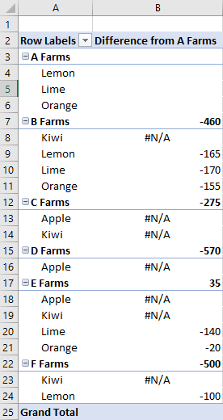

# <a name="work-with-pivottables-using-the-excel-javascript-api"></a><span data-ttu-id="6b7a9-103">Работа со сводными таблицами с помощью API JavaScript для Excel</span><span class="sxs-lookup"><span data-stu-id="6b7a9-103">Work with PivotTables using the Excel JavaScript API</span></span>

<span data-ttu-id="6b7a9-104">СvotTables упрощают более крупные наборы данных.</span><span class="sxs-lookup"><span data-stu-id="6b7a9-104">PivotTables streamline larger data sets.</span></span> <span data-ttu-id="6b7a9-105">Они позволяют быстро манипулировать сгруппными данными.</span><span class="sxs-lookup"><span data-stu-id="6b7a9-105">They allow the quick manipulation of grouped data.</span></span> <span data-ttu-id="6b7a9-106">С помощью API JavaScript для Excel надстройка может создавать с помощью список и взаимодействовать с их компонентами.</span><span class="sxs-lookup"><span data-stu-id="6b7a9-106">The Excel JavaScript API lets your add-in create PivotTables and interact with their components.</span></span> <span data-ttu-id="6b7a9-107">В этой статье описывается, как API JavaScript для Office представлена с помощью список, и представлены примеры кода для ключевых сценариев.</span><span class="sxs-lookup"><span data-stu-id="6b7a9-107">This article describes how PivotTables are represented by the Office JavaScript API and provides code samples for key scenarios.</span></span>

<span data-ttu-id="6b7a9-108">Если вы не знакомы с функциями с помощью список, рассмотрите возможность их изучения в качестве конечного пользователя.</span><span class="sxs-lookup"><span data-stu-id="6b7a9-108">If you are unfamiliar with the functionality of PivotTables, consider exploring them as an end user.</span></span>
<span data-ttu-id="6b7a9-109">Дополнительные сведения об этих [средствах](https://support.office.com/article/Import-and-analyze-data-ccd3c4a6-272f-4c97-afbb-d3f27407fcde#ID0EAABAAA=PivotTables) см. в подметке "Создание с помощью с помощью совверной таблицы для анализа данных на таблицах".</span><span class="sxs-lookup"><span data-stu-id="6b7a9-109">See [Create a PivotTable to analyze worksheet data](https://support.office.com/article/Import-and-analyze-data-ccd3c4a6-272f-4c97-afbb-d3f27407fcde#ID0EAABAAA=PivotTables) for a good primer on these tools.</span></span>

> [!IMPORTANT]
> <span data-ttu-id="6b7a9-110">В настоящее время с помощью OLAP не поддерживаются с помощью стеблей.</span><span class="sxs-lookup"><span data-stu-id="6b7a9-110">PivotTables created with OLAP are not currently supported.</span></span> <span data-ttu-id="6b7a9-111">Power Pivot также не поддерживается.</span><span class="sxs-lookup"><span data-stu-id="6b7a9-111">There is also no support for Power Pivot.</span></span>

## <a name="object-model"></a><span data-ttu-id="6b7a9-112">Объектная модель</span><span class="sxs-lookup"><span data-stu-id="6b7a9-112">Object model</span></span>

<span data-ttu-id="6b7a9-113">[PivotTable](/javascript/api/excel/excel.pivottable) — это центральный объект для список в API JavaScript для Office.</span><span class="sxs-lookup"><span data-stu-id="6b7a9-113">The [PivotTable](/javascript/api/excel/excel.pivottable) is the central object for PivotTables in the Office JavaScript API.</span></span>

- <span data-ttu-id="6b7a9-114">`Workbook.pivotTables` и `Worksheet.pivotTables` являются [pivotTableCollections,](/javascript/api/excel/excel.pivottablecollection) которые содержат [pivotTables](/javascript/api/excel/excel.pivottable) в книге и на электронных таблицах соответственно.</span><span class="sxs-lookup"><span data-stu-id="6b7a9-114">`Workbook.pivotTables` and `Worksheet.pivotTables` are [PivotTableCollections](/javascript/api/excel/excel.pivottablecollection) that contain the [PivotTables](/javascript/api/excel/excel.pivottable) in the workbook and worksheet, respectively.</span></span>
- <span data-ttu-id="6b7a9-115">[PivotTable](/javascript/api/excel/excel.pivottable) содержит [pivotHierarchyCollection](/javascript/api/excel/excel.pivothierarchycollection) с несколькими [pivotHierarchies](/javascript/api/excel/excel.pivothierarchy).</span><span class="sxs-lookup"><span data-stu-id="6b7a9-115">A [PivotTable](/javascript/api/excel/excel.pivottable) contains a [PivotHierarchyCollection](/javascript/api/excel/excel.pivothierarchycollection) that has multiple [PivotHierarchies](/javascript/api/excel/excel.pivothierarchy).</span></span>
- <span data-ttu-id="6b7a9-116">Эти [pivotHierarchies](/javascript/api/excel/excel.pivothierarchy) можно добавить в определенные коллекции иерархии, чтобы определить, как данные pivotTable pivots (как поясняется в [следующем разделе).](#hierarchies)</span><span class="sxs-lookup"><span data-stu-id="6b7a9-116">These [PivotHierarchies](/javascript/api/excel/excel.pivothierarchy) can be added to specific hierarchy collections to define how the PivotTable pivots data (as explained in the [following section](#hierarchies)).</span></span>
- <span data-ttu-id="6b7a9-117">[PivotHierarchy](/javascript/api/excel/excel.pivothierarchy) содержит [pivotFieldCollection,](/javascript/api/excel/excel.pivotfieldcollection) который содержит только одно [pivotField](/javascript/api/excel/excel.pivotfield).</span><span class="sxs-lookup"><span data-stu-id="6b7a9-117">A [PivotHierarchy](/javascript/api/excel/excel.pivothierarchy) contains a [PivotFieldCollection](/javascript/api/excel/excel.pivotfieldcollection) that has exactly one [PivotField](/javascript/api/excel/excel.pivotfield).</span></span> <span data-ttu-id="6b7a9-118">Если проект расширяется и включает в себя севобли OLAP, это может измениться.</span><span class="sxs-lookup"><span data-stu-id="6b7a9-118">If the design expands to include OLAP PivotTables, this may change.</span></span>
- <span data-ttu-id="6b7a9-119">К [pivotField](/javascript/api/excel/excel.pivotfield) может применяться один или несколько [pivotFilters,](/javascript/api/excel/excel.pivotfilters) если [pivotHierarchy](/javascript/api/excel/excel.pivothierarchy) поля назначена категории иерархии.</span><span class="sxs-lookup"><span data-stu-id="6b7a9-119">A [PivotField](/javascript/api/excel/excel.pivotfield) can have one or more [PivotFilters](/javascript/api/excel/excel.pivotfilters) applied, as long as the field's [PivotHierarchy](/javascript/api/excel/excel.pivothierarchy) is assigned to a hierarchy category.</span></span> 
- <span data-ttu-id="6b7a9-120">[PivotField](/javascript/api/excel/excel.pivotfield) содержит [pivotItemCollection](/javascript/api/excel/excel.pivotitemcollection) с несколькими [pivotItems](/javascript/api/excel/excel.pivotitem).</span><span class="sxs-lookup"><span data-stu-id="6b7a9-120">A [PivotField](/javascript/api/excel/excel.pivotfield) contains a [PivotItemCollection](/javascript/api/excel/excel.pivotitemcollection) that has multiple [PivotItems](/javascript/api/excel/excel.pivotitem).</span></span>
- <span data-ttu-id="6b7a9-121">[PivotTable](/javascript/api/excel/excel.pivottable) contains a [PivotLayout](/javascript/api/excel/excel.pivotlayout) that defines where the [PivotFields](/javascript/api/excel/excel.pivotfield) and [PivotItems](/javascript/api/excel/excel.pivotitem) are displayed in the worksheet.</span><span class="sxs-lookup"><span data-stu-id="6b7a9-121">A [PivotTable](/javascript/api/excel/excel.pivottable) contains a [PivotLayout](/javascript/api/excel/excel.pivotlayout) that defines where the [PivotFields](/javascript/api/excel/excel.pivotfield) and [PivotItems](/javascript/api/excel/excel.pivotitem) are displayed in the worksheet.</span></span>

<span data-ttu-id="6b7a9-122">Рассмотрим, как эти связи применяются к некоторым примерам данных.</span><span class="sxs-lookup"><span data-stu-id="6b7a9-122">Let's look at how these relationships apply to some example data.</span></span> <span data-ttu-id="6b7a9-123">В следующих данных описаны продажи деревьев из различных ферм.</span><span class="sxs-lookup"><span data-stu-id="6b7a9-123">The following data describes fruit sales from various farms.</span></span> <span data-ttu-id="6b7a9-124">Это будет пример в этой статье.</span><span class="sxs-lookup"><span data-stu-id="6b7a9-124">It will be the example throughout this article.</span></span>


<span data-ttu-id="6b7a9-126">Эти данные продаж фермы будет использоваться для список.</span><span class="sxs-lookup"><span data-stu-id="6b7a9-126">This fruit farm sales data will be used to make a PivotTable.</span></span> <span data-ttu-id="6b7a9-127">Каждый столбец, например **"Типы",** имеет тип `PivotHierarchy` .</span><span class="sxs-lookup"><span data-stu-id="6b7a9-127">Each column, such as **Types**, is a `PivotHierarchy`.</span></span> <span data-ttu-id="6b7a9-128">**Иерархия** типов содержит поле **"Типы".**</span><span class="sxs-lookup"><span data-stu-id="6b7a9-128">The **Types** hierarchy contains the **Types** field.</span></span> <span data-ttu-id="6b7a9-129">Поле **"Типы"** содержит элементы **Apple,** **Kiwi,** **Юли** **и** **Orange.**</span><span class="sxs-lookup"><span data-stu-id="6b7a9-129">The **Types** field contains the items **Apple**, **Kiwi**, **Lemon**, **Lime**, and **Orange**.</span></span>

### <a name="hierarchies"></a><span data-ttu-id="6b7a9-130">Hierarchies</span><span class="sxs-lookup"><span data-stu-id="6b7a9-130">Hierarchies</span></span>

<span data-ttu-id="6b7a9-131">СvotTables организованы на основе четырех категорий иерархии: [строка,](/javascript/api/excel/excel.rowcolumnpivothierarchy) [столбец,](/javascript/api/excel/excel.rowcolumnpivothierarchy) [данные](/javascript/api/excel/excel.datapivothierarchy)и [фильтр](/javascript/api/excel/excel.filterpivothierarchy).</span><span class="sxs-lookup"><span data-stu-id="6b7a9-131">PivotTables are organized based on four hierarchy categories: [row](/javascript/api/excel/excel.rowcolumnpivothierarchy), [column](/javascript/api/excel/excel.rowcolumnpivothierarchy), [data](/javascript/api/excel/excel.datapivothierarchy), and [filter](/javascript/api/excel/excel.filterpivothierarchy).</span></span>

<span data-ttu-id="6b7a9-132">Данные фермы, показанные ранее, имеет пять иерархий: **фермы,** **тип,** **классификация,** ящики, проданные в ферме, и **crates Sold Farms.**</span><span class="sxs-lookup"><span data-stu-id="6b7a9-132">The farm data shown earlier has five hierarchies: **Farms**, **Type**, **Classification**, **Crates Sold at Farm**, and **Crates Sold Wholesale**.</span></span> <span data-ttu-id="6b7a9-133">Каждая иерархия может существовать только в одной из четырех категорий.</span><span class="sxs-lookup"><span data-stu-id="6b7a9-133">Each hierarchy can only exist in one of the four categories.</span></span> <span data-ttu-id="6b7a9-134">Если **тип** добавляется в иерархии столбцов, он также не может быть в иерархиях строк, данных или фильтров.</span><span class="sxs-lookup"><span data-stu-id="6b7a9-134">If **Type** is added to column hierarchies, it cannot also be in the row, data, or filter hierarchies.</span></span> <span data-ttu-id="6b7a9-135">Если **тип** впоследствии добавляется в иерархии строк, он удаляется из иерархий столбцов.</span><span class="sxs-lookup"><span data-stu-id="6b7a9-135">If **Type** is subsequently added to row hierarchies, it is removed from the column hierarchies.</span></span> <span data-ttu-id="6b7a9-136">Это поведение одинаково для назначения иерархии с помощью пользовательского интерфейса Excel или API JavaScript для Excel.</span><span class="sxs-lookup"><span data-stu-id="6b7a9-136">This behavior is the same whether hierarchy assignment is done through the Excel UI or the Excel JavaScript APIs.</span></span>

<span data-ttu-id="6b7a9-137">Иерархии строк и столбцов определяют группировку данных.</span><span class="sxs-lookup"><span data-stu-id="6b7a9-137">Row and column hierarchies define how data will be grouped.</span></span> <span data-ttu-id="6b7a9-138">Например, иерархия строк  ферм объединяет все наборы данных из одной фермы.</span><span class="sxs-lookup"><span data-stu-id="6b7a9-138">For example, a row hierarchy of **Farms** will group together all the data sets from the same farm.</span></span> <span data-ttu-id="6b7a9-139">Выбор между иерархией строк и столбцов определяет ориентацию pivotTable.</span><span class="sxs-lookup"><span data-stu-id="6b7a9-139">The choice between row and column hierarchy defines the orientation of the PivotTable.</span></span>

<span data-ttu-id="6b7a9-140">Иерархии данных — это значения, которые необходимо агрегировать на основе иерархий строк и столбцов.</span><span class="sxs-lookup"><span data-stu-id="6b7a9-140">Data hierarchies are the values to be aggregated based on the row and column hierarchies.</span></span> <span data-ttu-id="6b7a9-141">С помощью список с иерархией  строк в фермах и иерархией данных "Crates **Sold Farms"** (По умолчанию) для каждой фермы показана общая сумма (по умолчанию) всех разных ферм.</span><span class="sxs-lookup"><span data-stu-id="6b7a9-141">A PivotTable with a row hierarchy of **Farms** and a data hierarchy of **Crates Sold Wholesale** shows the sum total (by default) of all the different fruits for each farm.</span></span>

<span data-ttu-id="6b7a9-142">Иерархии фильтров включают или исключают данные из pivot на основе значений этого отфильтрованного типа.</span><span class="sxs-lookup"><span data-stu-id="6b7a9-142">Filter hierarchies include or exclude data from the pivot based on values within that filtered type.</span></span> <span data-ttu-id="6b7a9-143">Иерархия фильтров **классификации** с выбранным типом **"Органическая"** показывает данные только для органично выбранных видов.</span><span class="sxs-lookup"><span data-stu-id="6b7a9-143">A filter hierarchy of **Classification** with the type **Organic** selected only shows data for organic fruit.</span></span>

<span data-ttu-id="6b7a9-144">Вот данные фермы еще раз вместе со списной.</span><span class="sxs-lookup"><span data-stu-id="6b7a9-144">Here is the farm data again, alongside a PivotTable.</span></span> <span data-ttu-id="6b7a9-145">С помощью иерархии строк  "Ферма" и "Тип" в качестве иерархии используется "Ферма" и "Тип", "Crates **Sold at Farm"** и  **"Crates SoldМайл"** в качестве иерархий данных (с функцией суммирования по умолчанию) и **"Классификация** как иерархия фильтров" (с выбранным "органичным"). </span><span class="sxs-lookup"><span data-stu-id="6b7a9-145">The PivotTable is using **Farm** and **Type** as the row hierarchies, **Crates Sold at Farm** and **Crates Sold Wholesale** as the data hierarchies (with the default aggregation function of sum), and **Classification** as a filter hierarchy (with **Organic** selected).</span></span>


<span data-ttu-id="6b7a9-147">Эта списоная таблица может быть сгенерирована с помощью API JavaScript или пользовательского интерфейса Excel.</span><span class="sxs-lookup"><span data-stu-id="6b7a9-147">This PivotTable could be generated through the JavaScript API or through the Excel UI.</span></span> <span data-ttu-id="6b7a9-148">Оба варианта позволяют дальнейшее манипулирование с помощью надстройки.</span><span class="sxs-lookup"><span data-stu-id="6b7a9-148">Both options allow for further manipulation through add-ins.</span></span>

## <a name="create-a-pivottable"></a><span data-ttu-id="6b7a9-149">Создание севоtTable</span><span class="sxs-lookup"><span data-stu-id="6b7a9-149">Create a PivotTable</span></span>

<span data-ttu-id="6b7a9-150">СvotTables need a name, source, and destination.</span><span class="sxs-lookup"><span data-stu-id="6b7a9-150">PivotTables need a name, source, and destination.</span></span> <span data-ttu-id="6b7a9-151">Источником может быть адрес диапазона или имя таблицы (переданное в виде `Range` , `string` или `Table` типа).</span><span class="sxs-lookup"><span data-stu-id="6b7a9-151">The source can be a range address or table name (passed as a `Range`, `string`, or `Table` type).</span></span> <span data-ttu-id="6b7a9-152">Назначением является адрес диапазона (заданный как a `Range` или `string` ).</span><span class="sxs-lookup"><span data-stu-id="6b7a9-152">The destination is a range address (given as either a `Range` or `string`).</span></span>
<span data-ttu-id="6b7a9-153">В следующих примерах демонстрируются различные методики создания с помощью с помощью список.</span><span class="sxs-lookup"><span data-stu-id="6b7a9-153">The following samples show various PivotTable creation techniques.</span></span>

### <a name="create-a-pivottable-with-range-addresses"></a><span data-ttu-id="6b7a9-154">Создание с помощью севоttable с адресами диапазона</span><span class="sxs-lookup"><span data-stu-id="6b7a9-154">Create a PivotTable with range addresses</span></span>

```js
Excel.run(function (context) {
    // Create a PivotTable named "Farm Sales" on the current worksheet at cell
    // A22 with data from the range A1:E21.
    context.workbook.worksheets.getActiveWorksheet().pivotTables.add(
      "Farm Sales", "A1:E21", "A22");

    return context.sync();
});
```

### <a name="create-a-pivottable-with-range-objects"></a><span data-ttu-id="6b7a9-155">Создание с помощью с помощью объектов Range</span><span class="sxs-lookup"><span data-stu-id="6b7a9-155">Create a PivotTable with Range objects</span></span>

```js
Excel.run(function (context) {
    // Create a PivotTable named "Farm Sales" on a worksheet called "PivotWorksheet" at cell A2
    // the data comes from the worksheet "DataWorksheet" across the range A1:E21.
    var rangeToAnalyze = context.workbook.worksheets.getItem("DataWorksheet").getRange("A1:E21");
    var rangeToPlacePivot = context.workbook.worksheets.getItem("PivotWorksheet").getRange("A2");
    context.workbook.worksheets.getItem("PivotWorksheet").pivotTables.add(
      "Farm Sales", rangeToAnalyze, rangeToPlacePivot);

    return context.sync();
});
```

### <a name="create-a-pivottable-at-the-workbook-level"></a><span data-ttu-id="6b7a9-156">Создание севоtTable на уровне книги</span><span class="sxs-lookup"><span data-stu-id="6b7a9-156">Create a PivotTable at the workbook level</span></span>

```js
Excel.run(function (context) {
    // Create a PivotTable named "Farm Sales" on a worksheet called "PivotWorksheet" at cell A2
    // the data is from the worksheet "DataWorksheet" across the range A1:E21.
    context.workbook.pivotTables.add(
        "Farm Sales", "DataWorksheet!A1:E21", "PivotWorksheet!A2");

    return context.sync();
});
```

## <a name="use-an-existing-pivottable"></a><span data-ttu-id="6b7a9-157">Использование существующей pivotTable</span><span class="sxs-lookup"><span data-stu-id="6b7a9-157">Use an existing PivotTable</span></span>

<span data-ttu-id="6b7a9-158">С помощью коллекции pivotTables, созданной вручную, можно также использовать коллекцию pivotTable книги или отдельных таблиц.</span><span class="sxs-lookup"><span data-stu-id="6b7a9-158">Manually created PivotTables are also accessible through the PivotTable collection of the workbook or of individual worksheets.</span></span> <span data-ttu-id="6b7a9-159">Следующий код получает из книги севоtTable с именем **My Pivot.**</span><span class="sxs-lookup"><span data-stu-id="6b7a9-159">The following code gets a PivotTable named **My Pivot** from the workbook.</span></span>

```js
Excel.run(function (context) {
    var pivotTable = context.workbook.pivotTables.getItem("My Pivot");
    return context.sync();
});
```

## <a name="add-rows-and-columns-to-a-pivottable"></a><span data-ttu-id="6b7a9-160">Добавление строк и столбцов в списоную</span><span class="sxs-lookup"><span data-stu-id="6b7a9-160">Add rows and columns to a PivotTable</span></span>

<span data-ttu-id="6b7a9-161">Строки и столбцы своют данные вокруг значений этих полей.</span><span class="sxs-lookup"><span data-stu-id="6b7a9-161">Rows and columns pivot the data around those fields' values.</span></span>

<span data-ttu-id="6b7a9-162">Добавление **столбца "Ферма"** совокупно совокупные объемы продаж для каждой фермы.</span><span class="sxs-lookup"><span data-stu-id="6b7a9-162">Adding the **Farm** column pivots all the sales around each farm.</span></span> <span data-ttu-id="6b7a9-163">Добавление строк **"Тип"** и **"Классификация"** дополнительно разбивает данные в зависимости от того, какие именно продукты были проданы и были ли они органичными.</span><span class="sxs-lookup"><span data-stu-id="6b7a9-163">Adding the **Type** and **Classification** rows further breaks down the data based on what fruit was sold and whether it was organic or not.</span></span>


```js
Excel.run(function (context) {
    var pivotTable = context.workbook.worksheets.getActiveWorksheet().pivotTables.getItem("Farm Sales");

    pivotTable.rowHierarchies.add(pivotTable.hierarchies.getItem("Type"));
    pivotTable.rowHierarchies.add(pivotTable.hierarchies.getItem("Classification"));

    pivotTable.columnHierarchies.add(pivotTable.hierarchies.getItem("Farm"));

    return context.sync();
});
```

<span data-ttu-id="6b7a9-165">Кроме того, можно использовать с помощью с помощью севоводки только строк или столбцов.</span><span class="sxs-lookup"><span data-stu-id="6b7a9-165">You can also have a PivotTable with only rows or columns.</span></span>

```js
Excel.run(function (context) {
    var pivotTable = context.workbook.worksheets.getActiveWorksheet().pivotTables.getItem("Farm Sales");
    pivotTable.rowHierarchies.add(pivotTable.hierarchies.getItem("Farm"));
    pivotTable.rowHierarchies.add(pivotTable.hierarchies.getItem("Type"));
    pivotTable.rowHierarchies.add(pivotTable.hierarchies.getItem("Classification"));

    return context.sync();
});
```

## <a name="add-data-hierarchies-to-the-pivottable"></a><span data-ttu-id="6b7a9-166">Добавление иерархий данных в списоную</span><span class="sxs-lookup"><span data-stu-id="6b7a9-166">Add data hierarchies to the PivotTable</span></span>

<span data-ttu-id="6b7a9-167">Иерархии данных заполняют с помощью совмещаемых данных с помощью строк и столбцов.</span><span class="sxs-lookup"><span data-stu-id="6b7a9-167">Data hierarchies fill the PivotTable with information to combine based on the rows and columns.</span></span> <span data-ttu-id="6b7a9-168">При добавлении иерархий данных **"Crates Sold at Farm"** и **"Crates Sold SoldА"** суммы этих рисунков для каждой строки и столбца суммы.</span><span class="sxs-lookup"><span data-stu-id="6b7a9-168">Adding the data hierarchies of **Crates Sold at Farm** and **Crates Sold Wholesale** gives sums of those figures for each row and column.</span></span>

<span data-ttu-id="6b7a9-169">В этом примере **"Ферма"** и **"Тип"** — это строки, данные о продажах в кавере.</span><span class="sxs-lookup"><span data-stu-id="6b7a9-169">In the example, both **Farm** and **Type** are rows, with the crate sales as the data.</span></span>


```js
Excel.run(function (context) {
    var pivotTable = context.workbook.worksheets.getActiveWorksheet().pivotTables.getItem("Farm Sales");

    // "Farm" and "Type" are the hierarchies on which the aggregation is based.
    pivotTable.rowHierarchies.add(pivotTable.hierarchies.getItem("Farm"));
    pivotTable.rowHierarchies.add(pivotTable.hierarchies.getItem("Type"));

    // "Crates Sold at Farm" and "Crates Sold Wholesale" are the hierarchies
    // that will have their data aggregated (summed in this case).
    pivotTable.dataHierarchies.add(pivotTable.hierarchies.getItem("Crates Sold at Farm"));
    pivotTable.dataHierarchies.add(pivotTable.hierarchies.getItem("Crates Sold Wholesale"));

    return context.sync();
});
```

## <a name="pivottable-layouts-and-getting-pivoted-data"></a><span data-ttu-id="6b7a9-171">Макеты pivotTable и получение совописаемых данных</span><span class="sxs-lookup"><span data-stu-id="6b7a9-171">PivotTable layouts and getting pivoted data</span></span>

<span data-ttu-id="6b7a9-172">[PivotLayout](/javascript/api/excel/excel.pivotlayout) определяет размещение иерархий и их данных.</span><span class="sxs-lookup"><span data-stu-id="6b7a9-172">A [PivotLayout](/javascript/api/excel/excel.pivotlayout) defines the placement of hierarchies and their data.</span></span> <span data-ttu-id="6b7a9-173">Вы можете получить доступ к макету, чтобы определить диапазоны, в которых хранятся данные.</span><span class="sxs-lookup"><span data-stu-id="6b7a9-173">You access the layout to determine the ranges where data is stored.</span></span>

<span data-ttu-id="6b7a9-174">На следующей схеме показано, какие вызовы функции макета соответствуют диапазонам pivotTable.</span><span class="sxs-lookup"><span data-stu-id="6b7a9-174">The following diagram shows which layout function calls correspond to which ranges of the PivotTable.</span></span>


### <a name="get-data-from-the-pivottable"></a><span data-ttu-id="6b7a9-176">Get data from the PivotTable</span><span class="sxs-lookup"><span data-stu-id="6b7a9-176">Get data from the PivotTable</span></span>

<span data-ttu-id="6b7a9-177">Макет определяет, как отображается pivotTable на этом экране.</span><span class="sxs-lookup"><span data-stu-id="6b7a9-177">The layout defines how the PivotTable is displayed in the worksheet.</span></span> <span data-ttu-id="6b7a9-178">Это `PivotLayout` означает, что объект управляет диапазонами, используемыми для элементов pivotTable.</span><span class="sxs-lookup"><span data-stu-id="6b7a9-178">This means the `PivotLayout` object controls the ranges used for PivotTable elements.</span></span> <span data-ttu-id="6b7a9-179">Используйте диапазоны, предоставляемые макетом, для получения данных, собранных и собранных сводной.</span><span class="sxs-lookup"><span data-stu-id="6b7a9-179">Use the ranges provided by the layout to get data collected and aggregated by the PivotTable.</span></span> <span data-ttu-id="6b7a9-180">В частности, используйте для доступа к данным, которые `PivotLayout.getDataBodyRange` создает с помощью pivotTable.</span><span class="sxs-lookup"><span data-stu-id="6b7a9-180">In particular, use `PivotLayout.getDataBodyRange` to access what the PivotTable produces.</span></span>

<span data-ttu-id="6b7a9-181">В следующем коде показано, как получить последнюю строку данных с помощью  макета (общая  сумма как суммы проданных в ферме, так и столбцов **"Сумма** проданных ящиков" в предыдущем примере).</span><span class="sxs-lookup"><span data-stu-id="6b7a9-181">The following code demonstrates how to get the last row of the PivotTable data by going through the layout (the **Grand Total** of both the **Sum of Crates Sold at Farm** and **Sum of Crates Sold Wholesale** columns in the earlier example).</span></span> <span data-ttu-id="6b7a9-182">Затем эти значения суммются в итоговом итоговом значении, которое отображается в ячейке **E30** (за пределами списной).</span><span class="sxs-lookup"><span data-stu-id="6b7a9-182">Those values are then summed together for a final total, which is displayed in cell **E30** (outside of the PivotTable).</span></span>

```js
Excel.run(function (context) {
    var pivotTable = context.workbook.worksheets.getActiveWorksheet().pivotTables.getItem("Farm Sales");

    // Get the totals for each data hierarchy from the layout.
    var range = pivotTable.layout.getDataBodyRange();
    var grandTotalRange = range.getLastRow();
    grandTotalRange.load("address");
    return context.sync().then(function () {
        // Sum the totals from the PivotTable data hierarchies and place them in a new range, outside of the PivotTable.
        var masterTotalRange = context.workbook.worksheets.getActiveWorksheet().getRange("E30");
        masterTotalRange.formulas = [["=SUM(" + grandTotalRange.address + ")"]];
    });
});
```

### <a name="layout-types"></a><span data-ttu-id="6b7a9-183">Типы макетов</span><span class="sxs-lookup"><span data-stu-id="6b7a9-183">Layout types</span></span>

<span data-ttu-id="6b7a9-184">Сивчатые таблицы имеют три стиля макета: Compact, Outline и Tabular.</span><span class="sxs-lookup"><span data-stu-id="6b7a9-184">PivotTables have three layout styles: Compact, Outline, and Tabular.</span></span> <span data-ttu-id="6b7a9-185">В предыдущих примерах мы видели компактный стиль.</span><span class="sxs-lookup"><span data-stu-id="6b7a9-185">We've seen the compact style in the previous examples.</span></span>

<span data-ttu-id="6b7a9-186">В следующих примерах используются стили структур и таблиц соответственно.</span><span class="sxs-lookup"><span data-stu-id="6b7a9-186">The following examples use the outline and tabular styles, respectively.</span></span> <span data-ttu-id="6b7a9-187">В примере кода показано, как цикли между различными макетами.</span><span class="sxs-lookup"><span data-stu-id="6b7a9-187">The code sample shows how to cycle between the different layouts.</span></span>

#### <a name="outline-layout"></a><span data-ttu-id="6b7a9-188">Макет контура</span><span class="sxs-lookup"><span data-stu-id="6b7a9-188">Outline layout</span></span>


#### <a name="tabular-layout"></a><span data-ttu-id="6b7a9-190">Табулярный макет</span><span class="sxs-lookup"><span data-stu-id="6b7a9-190">Tabular layout</span></span>


## <a name="delete-a-pivottable"></a><span data-ttu-id="6b7a9-192">Удаление советнойtable</span><span class="sxs-lookup"><span data-stu-id="6b7a9-192">Delete a PivotTable</span></span>

<span data-ttu-id="6b7a9-193">PivotTables are deleted by using their name.</span><span class="sxs-lookup"><span data-stu-id="6b7a9-193">PivotTables are deleted by using their name.</span></span>

```js
Excel.run(function (context) {
    context.workbook.worksheets.getItem("Pivot").pivotTables.getItem("Farm Sales").delete();
    return context.sync();
});
```

## <a name="filter-a-pivottable"></a><span data-ttu-id="6b7a9-194">Фильтрация севоtTable</span><span class="sxs-lookup"><span data-stu-id="6b7a9-194">Filter a PivotTable</span></span>

<span data-ttu-id="6b7a9-195">Основной метод фильтрации данных pivotTable — с помощью pivotFilters.</span><span class="sxs-lookup"><span data-stu-id="6b7a9-195">The primary method for filtering PivotTable data is with PivotFilters.</span></span> <span data-ttu-id="6b7a9-196">Срезы предлагают альтернативный, менее гибкий метод фильтрации.</span><span class="sxs-lookup"><span data-stu-id="6b7a9-196">Slicers offer an alternate, less flexible filtering method.</span></span> 

<span data-ttu-id="6b7a9-197">[Фильтры pivotFilters](/javascript/api/excel/excel.pivotfilters) фильтруют данные на основе [](#hierarchies) четырех категорий иерархии (фильтров, столбцов, строк и значений) в списанной.</span><span class="sxs-lookup"><span data-stu-id="6b7a9-197">[PivotFilters](/javascript/api/excel/excel.pivotfilters) filter data based on a PivotTable's four [hierarchy categories](#hierarchies) (filters, columns, rows, and values).</span></span> <span data-ttu-id="6b7a9-198">Существует четыре типа pivotFilters, которые позволяют использовать фильтрацию на основе даты календаря, разбиение строк, сравнение номеров и фильтрацию на основе пользовательского ввода.</span><span class="sxs-lookup"><span data-stu-id="6b7a9-198">There are four types of PivotFilters, allowing calendar date-based filtering, string parsing, number comparison, and filtering based on a custom input.</span></span> 

<span data-ttu-id="6b7a9-199">[Срезы](/javascript/api/excel/excel.slicer) можно применять как к срезам, так и к обычным таблицам Excel.</span><span class="sxs-lookup"><span data-stu-id="6b7a9-199">[Slicers](/javascript/api/excel/excel.slicer) can be applied to both PivotTables and regular Excel tables.</span></span> <span data-ttu-id="6b7a9-200">При применении к pivotTable срезы функционируют как [pivotManualFilter](#pivotmanualfilter) и позволяют фильтровать на основе пользовательского ввода.</span><span class="sxs-lookup"><span data-stu-id="6b7a9-200">When applied to a PivotTable, slicers function like a [PivotManualFilter](#pivotmanualfilter) and allow filtering based on a custom input.</span></span> <span data-ttu-id="6b7a9-201">В отличие от PivotFilters, срезы имеют компонент [пользовательского интерфейса Excel.](https://support.office.com/article/Use-slicers-to-filter-data-249f966b-a9d5-4b0f-b31a-12651785d29d)</span><span class="sxs-lookup"><span data-stu-id="6b7a9-201">Unlike PivotFilters, slicers have an [Excel UI component](https://support.office.com/article/Use-slicers-to-filter-data-249f966b-a9d5-4b0f-b31a-12651785d29d).</span></span> <span data-ttu-id="6b7a9-202">С помощью `Slicer` класса вы создаете этот компонент пользовательского интерфейса, управляете фильтрацией и управляете его внешним видом.</span><span class="sxs-lookup"><span data-stu-id="6b7a9-202">With the `Slicer` class, you create this UI component, manage filtering, and control its visual appearance.</span></span> 

### <a name="filter-with-pivotfilters"></a><span data-ttu-id="6b7a9-203">Фильтрация с помощью pivotFilters</span><span class="sxs-lookup"><span data-stu-id="6b7a9-203">Filter with PivotFilters</span></span>

<span data-ttu-id="6b7a9-204">[Фильтры pivotFilters](/javascript/api/excel/excel.pivotfilters) позволяют фильтровать данные pivotTable на основе четырех категорий [иерархии](#hierarchies) (фильтров, столбцов, строк и значений).</span><span class="sxs-lookup"><span data-stu-id="6b7a9-204">[PivotFilters](/javascript/api/excel/excel.pivotfilters) allow you to filter PivotTable data based on the four [hierarchy categories](#hierarchies) (filters, columns, rows, and values).</span></span> <span data-ttu-id="6b7a9-205">В объектной модели pivotTable применяются к `PivotFilters` [pivotField,](/javascript/api/excel/excel.pivotfield)и каждому из них может быть назначен один или `PivotField` `PivotFilters` несколько.</span><span class="sxs-lookup"><span data-stu-id="6b7a9-205">In the PivotTable object model, `PivotFilters` are applied to a [PivotField](/javascript/api/excel/excel.pivotfield), and each `PivotField` can have one or more assigned `PivotFilters`.</span></span> <span data-ttu-id="6b7a9-206">Чтобы применить pivotFilters к pivotField, соответствующая [pivotHierarchy](/javascript/api/excel/excel.pivothierarchy) поля должна быть назначена категории иерархии.</span><span class="sxs-lookup"><span data-stu-id="6b7a9-206">To apply PivotFilters to a PivotField, the field's corresponding [PivotHierarchy](/javascript/api/excel/excel.pivothierarchy) must be assigned to a hierarchy category.</span></span> 

#### <a name="types-of-pivotfilters"></a><span data-ttu-id="6b7a9-207">Типы pivotFilters</span><span class="sxs-lookup"><span data-stu-id="6b7a9-207">Types of PivotFilters</span></span>

| <span data-ttu-id="6b7a9-208">Тип фильтра</span><span class="sxs-lookup"><span data-stu-id="6b7a9-208">Filter type</span></span> | <span data-ttu-id="6b7a9-209">Цель фильтрации</span><span class="sxs-lookup"><span data-stu-id="6b7a9-209">Filter purpose</span></span> | <span data-ttu-id="6b7a9-210">Справочные материалы по API JavaScript для Excel</span><span class="sxs-lookup"><span data-stu-id="6b7a9-210">Excel JavaScript API reference</span></span> |
|:--- |:--- |:--- |
| <span data-ttu-id="6b7a9-211">DateFilter</span><span class="sxs-lookup"><span data-stu-id="6b7a9-211">DateFilter</span></span> | <span data-ttu-id="6b7a9-212">Фильтрация на основе даты в календаре.</span><span class="sxs-lookup"><span data-stu-id="6b7a9-212">Calendar date-based filtering.</span></span> | [<span data-ttu-id="6b7a9-213">PivotDateFilter</span><span class="sxs-lookup"><span data-stu-id="6b7a9-213">PivotDateFilter</span></span>](/javascript/api/excel/excel.pivotdatefilter) |
| <span data-ttu-id="6b7a9-214">LabelFilter</span><span class="sxs-lookup"><span data-stu-id="6b7a9-214">LabelFilter</span></span> | <span data-ttu-id="6b7a9-215">Фильтрация сравнения текста.</span><span class="sxs-lookup"><span data-stu-id="6b7a9-215">Text comparison filtering.</span></span> | [<span data-ttu-id="6b7a9-216">PivotLabelFilter</span><span class="sxs-lookup"><span data-stu-id="6b7a9-216">PivotLabelFilter</span></span>](/javascript/api/excel/excel.pivotlabelfilter) |
| <span data-ttu-id="6b7a9-217">ManualFilter</span><span class="sxs-lookup"><span data-stu-id="6b7a9-217">ManualFilter</span></span> | <span data-ttu-id="6b7a9-218">Настраиваемая фильтрация входных данных.</span><span class="sxs-lookup"><span data-stu-id="6b7a9-218">Custom input filtering.</span></span> | [<span data-ttu-id="6b7a9-219">PivotManualFilter</span><span class="sxs-lookup"><span data-stu-id="6b7a9-219">PivotManualFilter</span></span>](/javascript/api/excel/excel.pivotmanualfilter) |
| <span data-ttu-id="6b7a9-220">ValueFilter</span><span class="sxs-lookup"><span data-stu-id="6b7a9-220">ValueFilter</span></span> | <span data-ttu-id="6b7a9-221">Фильтрация сравнения номеров.</span><span class="sxs-lookup"><span data-stu-id="6b7a9-221">Number comparison filtering.</span></span> | [<span data-ttu-id="6b7a9-222">PivotValueFilter</span><span class="sxs-lookup"><span data-stu-id="6b7a9-222">PivotValueFilter</span></span>](/javascript/api/excel/excel.pivotvaluefilter) |

#### <a name="create-a-pivotfilter"></a><span data-ttu-id="6b7a9-223">Создание pivotFilter</span><span class="sxs-lookup"><span data-stu-id="6b7a9-223">Create a PivotFilter</span></span>

<span data-ttu-id="6b7a9-224">Чтобы отфильтровать данные pivotTable с помощью (например, a), применим фильтр `Pivot*Filter` `PivotDateFilter` к [pivotField.](/javascript/api/excel/excel.pivotfield)</span><span class="sxs-lookup"><span data-stu-id="6b7a9-224">To filter PivotTable data with a `Pivot*Filter` (such as a `PivotDateFilter`), apply the filter to a [PivotField](/javascript/api/excel/excel.pivotfield).</span></span> <span data-ttu-id="6b7a9-225">В следующих четырех примерах кода покажем, как использовать каждый из четырех типов pivotFilters.</span><span class="sxs-lookup"><span data-stu-id="6b7a9-225">The following four code samples show how to use each of the four types of PivotFilters.</span></span> 

##### <a name="pivotdatefilter"></a><span data-ttu-id="6b7a9-226">PivotDateFilter</span><span class="sxs-lookup"><span data-stu-id="6b7a9-226">PivotDateFilter</span></span>

<span data-ttu-id="6b7a9-227">Первый пример кода применяет [pivotDateFilter](/javascript/api/excel/excel.pivotdatefilter) к pivotField с обновлением даты, скрывая все данные до **2020-08-01**. </span><span class="sxs-lookup"><span data-stu-id="6b7a9-227">The first code sample applies a [PivotDateFilter](/javascript/api/excel/excel.pivotdatefilter) to the **Date Updated** PivotField, hiding any data prior to **2020-08-01**.</span></span> 

> [!IMPORTANT] 
> <span data-ttu-id="6b7a9-228">A не может применяться к `Pivot*Filter` pivotField, если pivotHierarchy этого поля не назначена категории иерархии.</span><span class="sxs-lookup"><span data-stu-id="6b7a9-228">A `Pivot*Filter` can't be applied to a PivotField unless that field's PivotHierarchy is assigned to a hierarchy category.</span></span> <span data-ttu-id="6b7a9-229">В следующем примере кода необходимо добавить его в категорию pivotTable, прежде чем его можно будет использовать `dateHierarchy` `rowHierarchies` для фильтрации.</span><span class="sxs-lookup"><span data-stu-id="6b7a9-229">In the following code sample, the `dateHierarchy` must be added to the PivotTable's `rowHierarchies` category before it can be used for filtering.</span></span>

```js
Excel.run(function (context) {
    // Get the PivotTable and the date hierarchy.
    var pivotTable = context.workbook.worksheets.getActiveWorksheet().pivotTables.getItem("Farm Sales");
    var dateHierarchy = pivotTable.rowHierarchies.getItemOrNullObject("Date Updated");
    
    return context.sync().then(function () {
        // PivotFilters can only be applied to PivotHierarchies that are being used for pivoting.
        // If it's not already there, add "Date Updated" to the hierarchies.
        if (dateHierarchy.isNullObject) {
          dateHierarchy = pivotTable.rowHierarchies.add(pivotTable.hierarchies.getItem("Date Updated"));
        }

        // Apply a date filter to filter out anything logged before August.
        var filterField = dateHierarchy.fields.getItem("Date Updated");
        var dateFilter = {
          condition: Excel.DateFilterCondition.afterOrEqualTo,
          comparator: {
            date: "2020-08-01",
            specificity: Excel.FilterDatetimeSpecificity.month
          }
        };
        filterField.applyFilter({ dateFilter: dateFilter });
        
        return context.sync();
    });
});
```

> [!NOTE]
> <span data-ttu-id="6b7a9-230">В следующих трех фрагментах кода отображаются только фрагменты фильтра, а не полные `Excel.run` вызовы.</span><span class="sxs-lookup"><span data-stu-id="6b7a9-230">The following three code snippets only display filter-specific excerpts, instead of full `Excel.run` calls.</span></span>

##### <a name="pivotlabelfilter"></a><span data-ttu-id="6b7a9-231">PivotLabelFilter</span><span class="sxs-lookup"><span data-stu-id="6b7a9-231">PivotLabelFilter</span></span>

<span data-ttu-id="6b7a9-232">Во втором фрагменте кода показано, как применить [pivotLabelFilter](/javascript/api/excel/excel.pivotlabelfilter) к **Типу** PivotField, используя свойство для исключения меток, которые начинаются с буквы `LabelFilterCondition.beginsWith` **L**.</span><span class="sxs-lookup"><span data-stu-id="6b7a9-232">The second code snippet demonstrates how to apply a [PivotLabelFilter](/javascript/api/excel/excel.pivotlabelfilter) to the **Type** PivotField, using the `LabelFilterCondition.beginsWith` property to exclude labels that start with the letter **L**.</span></span> 

```js
    // Get the "Type" field.
    var filterField = pivotTable.hierarchies.getItem("Type").fields.getItem("Type");

    // Filter out any types that start with "L" ("Lemons" and "Limes" in this case).
    var filter: Excel.PivotLabelFilter = {
      condition: Excel.LabelFilterCondition.beginsWith,
      substring: "L",
      exclusive: true
    };

    // Apply the label filter to the field.
    filterField.applyFilter({ labelFilter: filter });
```

##### <a name="pivotmanualfilter"></a><span data-ttu-id="6b7a9-233">PivotManualFilter</span><span class="sxs-lookup"><span data-stu-id="6b7a9-233">PivotManualFilter</span></span>

<span data-ttu-id="6b7a9-234">В третьем фрагменте кода к полю классификации применяется ручной фильтр  [с pivotManualFilter,](/javascript/api/excel/excel.pivotmanualfilter) отфильтровывая данные, не включающие классификацию **"Органическая".**</span><span class="sxs-lookup"><span data-stu-id="6b7a9-234">The third code snippet applies a manual filter with [PivotManualFilter](/javascript/api/excel/excel.pivotmanualfilter) to the the **Classification** field, filtering out data that doesn't include the classification **Organic**.</span></span> 

```js
    // Apply a manual filter to include only a specific PivotItem (the string "Organic").
    var filterField = classHierarchy.fields.getItem("Classification");
    var manualFilter = { selectedItems: ["Organic"] };
    filterField.applyFilter({ manualFilter: manualFilter });
```

##### <a name="pivotvaluefilter"></a><span data-ttu-id="6b7a9-235">PivotValueFilter</span><span class="sxs-lookup"><span data-stu-id="6b7a9-235">PivotValueFilter</span></span>

<span data-ttu-id="6b7a9-236">Чтобы сравнить числа, используйте фильтр значений [с pivotValueFilter,](/javascript/api/excel/excel.pivotvaluefilter)как показано в фрагменте кода.</span><span class="sxs-lookup"><span data-stu-id="6b7a9-236">To compare numbers, use a value filter with [PivotValueFilter](/javascript/api/excel/excel.pivotvaluefilter), as shown in the final code snippet.</span></span> <span data-ttu-id="6b7a9-237">The `PivotValueFilter` compares the data in the **Farm** PivotField to the data in the **Crates Sold Sold** PivotField, including only farms whose sum of crates sold exceeds the value **500**.</span><span class="sxs-lookup"><span data-stu-id="6b7a9-237">The `PivotValueFilter` compares the data in the **Farm** PivotField to the data in the **Crates Sold Wholesale** PivotField, including only farms whose sum of crates sold exceeds the value **500**.</span></span> 

```js
    // Get the "Farm" field.
    var filterField = pivotTable.hierarchies.getItem("Farm").fields.getItem("Farm");
    
    // Filter to only include rows with more than 500 wholesale crates sold.
    var filter: Excel.PivotValueFilter = {
      condition: Excel.ValueFilterCondition.greaterThan,
      comparator: 500,
      value: "Sum of Crates Sold Wholesale"
    };
    
    // Apply the value filter to the field.
    filterField.applyFilter({ valueFilter: filter });
```

#### <a name="remove-pivotfilters"></a><span data-ttu-id="6b7a9-238">Удаление pivotFilters</span><span class="sxs-lookup"><span data-stu-id="6b7a9-238">Remove PivotFilters</span></span>

<span data-ttu-id="6b7a9-239">Чтобы удалить все pivotFilters, примените метод к каждому pivotField, как показано в следующем `clearAllFilters` примере кода.</span><span class="sxs-lookup"><span data-stu-id="6b7a9-239">To remove all PivotFilters, apply the `clearAllFilters` method to each PivotField, as shown in the following code sample.</span></span> 

```js
Excel.run(function (context) {
    // Get the PivotTable.
    var pivotTable = context.workbook.worksheets.getActiveWorksheet().pivotTables.getItem("Farm Sales");
    pivotTable.hierarchies.load("name");
    
    return context.sync().then(function () {
        // Clear the filters on each PivotField.
        pivotTable.hierarchies.items.forEach(function (hierarchy) {
          hierarchy.fields.getItem(hierarchy.name).clearAllFilters();
        });
        return context.sync();
    });
});
```

### <a name="filter-with-slicers"></a><span data-ttu-id="6b7a9-240">Фильтрация с срезами</span><span class="sxs-lookup"><span data-stu-id="6b7a9-240">Filter with slicers</span></span>

<span data-ttu-id="6b7a9-241">[Срезы](/javascript/api/excel/excel.slicer) позволяют фильтровать данные из таблицы или таблицы Excel.</span><span class="sxs-lookup"><span data-stu-id="6b7a9-241">[Slicers](/javascript/api/excel/excel.slicer) allow data to be filtered from an Excel PivotTable or table.</span></span> <span data-ttu-id="6b7a9-242">Срез использует значения из указанного столбца или pivotField для фильтрации соответствующих строк.</span><span class="sxs-lookup"><span data-stu-id="6b7a9-242">A slicer uses values from a specified column or PivotField to filter corresponding rows.</span></span> <span data-ttu-id="6b7a9-243">Эти значения хранятся в качестве объектов [SlicerItem](/javascript/api/excel/excel.sliceritem) в `Slicer` объекте .</span><span class="sxs-lookup"><span data-stu-id="6b7a9-243">These values are stored as [SlicerItem](/javascript/api/excel/excel.sliceritem) objects in the `Slicer`.</span></span> <span data-ttu-id="6b7a9-244">Надстройка может настраивать эти фильтры, как и пользователи[(с помощью пользовательского интерфейса Excel).](https://support.office.com/article/Use-slicers-to-filter-data-249f966b-a9d5-4b0f-b31a-12651785d29d)</span><span class="sxs-lookup"><span data-stu-id="6b7a9-244">Your add-in can adjust these filters, as can users ([through the Excel UI](https://support.office.com/article/Use-slicers-to-filter-data-249f966b-a9d5-4b0f-b31a-12651785d29d)).</span></span> <span data-ttu-id="6b7a9-245">Срез находится поверх таблицы на уровне рисования, как показано на следующем снимке экрана.</span><span class="sxs-lookup"><span data-stu-id="6b7a9-245">The slicer sits on top of the worksheet in the drawing layer, as shown in the following screenshot.</span></span>


> [!NOTE]
> <span data-ttu-id="6b7a9-247">Методы, описанные в этом разделе, посвящены использованию срезов, подключенных к списанной.</span><span class="sxs-lookup"><span data-stu-id="6b7a9-247">The techniques described in this section focus on how to use slicers connected to PivotTables.</span></span> <span data-ttu-id="6b7a9-248">Те же методы применяются и к использованию срезов, подключенных к таблицам.</span><span class="sxs-lookup"><span data-stu-id="6b7a9-248">The same techniques also apply to using slicers connected to tables.</span></span>

#### <a name="create-a-slicer"></a><span data-ttu-id="6b7a9-249">Создание среза</span><span class="sxs-lookup"><span data-stu-id="6b7a9-249">Create a slicer</span></span>

<span data-ttu-id="6b7a9-250">Вы можете создать срез в книге или на литейке с помощью `Workbook.slicers.add` метода или `Worksheet.slicers.add` метода.</span><span class="sxs-lookup"><span data-stu-id="6b7a9-250">You can create a slicer in a workbook or worksheet by using the `Workbook.slicers.add` method or `Worksheet.slicers.add` method.</span></span> <span data-ttu-id="6b7a9-251">При этом к объекту [SlicerCollection](/javascript/api/excel/excel.slicercollection) указанного объекта добавляется `Workbook` `Worksheet` срез.</span><span class="sxs-lookup"><span data-stu-id="6b7a9-251">Doing so adds a slicer to the [SlicerCollection](/javascript/api/excel/excel.slicercollection) of the specified `Workbook` or `Worksheet` object.</span></span> <span data-ttu-id="6b7a9-252">Метод `SlicerCollection.add` имеет три параметра:</span><span class="sxs-lookup"><span data-stu-id="6b7a9-252">The `SlicerCollection.add` method has three parameters:</span></span>

- <span data-ttu-id="6b7a9-253">`slicerSource`: источник данных, на котором основан новый срез.</span><span class="sxs-lookup"><span data-stu-id="6b7a9-253">`slicerSource`: The data source on which the new slicer is based.</span></span> <span data-ttu-id="6b7a9-254">Это может быть `PivotTable` `Table` строка , или строка, представляющая имя или ИД `PivotTable` или `Table` .</span><span class="sxs-lookup"><span data-stu-id="6b7a9-254">It can be a `PivotTable`, `Table`, or string representing the name or ID of a `PivotTable` or `Table`.</span></span>
- <span data-ttu-id="6b7a9-255">`sourceField`: поле в источнике данных, по которому необходимо отфильтровать данные.</span><span class="sxs-lookup"><span data-stu-id="6b7a9-255">`sourceField`: The field in the data source by which to filter.</span></span> <span data-ttu-id="6b7a9-256">Это может быть `PivotField` `TableColumn` строка , или строка, представляющая имя или ИД `PivotField` или `TableColumn` .</span><span class="sxs-lookup"><span data-stu-id="6b7a9-256">It can be a `PivotField`, `TableColumn`, or string representing the name or ID of a `PivotField` or `TableColumn`.</span></span>
- <span data-ttu-id="6b7a9-257">`slicerDestination`: таблица, на которой будет создан новый срез.</span><span class="sxs-lookup"><span data-stu-id="6b7a9-257">`slicerDestination`: The worksheet where the new slicer will be created.</span></span> <span data-ttu-id="6b7a9-258">Это может быть `Worksheet` объект, имя или ИД `Worksheet` объекта .</span><span class="sxs-lookup"><span data-stu-id="6b7a9-258">It can be a `Worksheet` object or the name or ID of a `Worksheet`.</span></span> <span data-ttu-id="6b7a9-259">Этот параметр не является нужным при `SlicerCollection` доступе к `Worksheet.slicers` нему.</span><span class="sxs-lookup"><span data-stu-id="6b7a9-259">This parameter is unnecessary when the `SlicerCollection` is accessed through `Worksheet.slicers`.</span></span> <span data-ttu-id="6b7a9-260">В этом случае в качестве места назначения используется таблица коллекции.</span><span class="sxs-lookup"><span data-stu-id="6b7a9-260">In this case, the collection's worksheet is used as the destination.</span></span>

<span data-ttu-id="6b7a9-261">В следующем примере кода новый срез добавляется на таблицу **Pivot.**</span><span class="sxs-lookup"><span data-stu-id="6b7a9-261">The following code sample adds a new slicer to the **Pivot** worksheet.</span></span> <span data-ttu-id="6b7a9-262">Источником среза является совивная область продаж фермы, которая фильтруется с использованием данных **Type.** </span><span class="sxs-lookup"><span data-stu-id="6b7a9-262">The slicer's source is the **Farm Sales** PivotTable and filters using the **Type** data.</span></span> <span data-ttu-id="6b7a9-263">Срез также называется **срезом "Срезы"** для дальнейшей ссылки.</span><span class="sxs-lookup"><span data-stu-id="6b7a9-263">The slicer is also named **Fruit Slicer** for future reference.</span></span>

```js
Excel.run(function (context) {
    var sheet = context.workbook.worksheets.getItem("Pivot");
    var slicer = sheet.slicers.add(
        "Farm Sales" /* The slicer data source. For PivotTables, this can be the PivotTable object reference or name. */,
        "Type" /* The field in the data to filter by. For PivotTables, this can be a PivotField object reference or ID. */
    );
    slicer.name = "Fruit Slicer";
    return context.sync();
});
```

#### <a name="filter-items-with-a-slicer"></a><span data-ttu-id="6b7a9-264">Фильтрация элементов с помощью среза</span><span class="sxs-lookup"><span data-stu-id="6b7a9-264">Filter items with a slicer</span></span>

<span data-ttu-id="6b7a9-265">Срез фильтрует с помощью срезов с помощью элементов из `sourceField` срезов.</span><span class="sxs-lookup"><span data-stu-id="6b7a9-265">The slicer filters the PivotTable with items from the `sourceField`.</span></span> <span data-ttu-id="6b7a9-266">Метод `Slicer.selectItems` задает элементы, которые остаются в срезе.</span><span class="sxs-lookup"><span data-stu-id="6b7a9-266">The `Slicer.selectItems` method sets the items that remain in the slicer.</span></span> <span data-ttu-id="6b7a9-267">Эти элементы передаются методу в качестве `string[]` ключей элементов.</span><span class="sxs-lookup"><span data-stu-id="6b7a9-267">These items are passed to the method as a `string[]`, representing the keys of the items.</span></span> <span data-ttu-id="6b7a9-268">Все строки, содержащие эти элементы, остаются в агрегации pivotTable.</span><span class="sxs-lookup"><span data-stu-id="6b7a9-268">Any rows containing those items remain in the PivotTable's aggregation.</span></span> <span data-ttu-id="6b7a9-269">Последующие `selectItems` вызовы, чтобы установить для списка ключи, указанные в этих вызовах.</span><span class="sxs-lookup"><span data-stu-id="6b7a9-269">Subsequent calls to `selectItems` set the list to the keys specified in those calls.</span></span>

> [!NOTE]
> <span data-ttu-id="6b7a9-270">Если передается элемент, который не находится в источнике `Slicer.selectItems` данных, будет `InvalidArgument` выброшена ошибка.</span><span class="sxs-lookup"><span data-stu-id="6b7a9-270">If `Slicer.selectItems` is passed an item that's not in the data source, an `InvalidArgument` error is thrown.</span></span> <span data-ttu-id="6b7a9-271">Содержимое можно проверить с помощью свойства, которое является `Slicer.slicerItems` [SlicerItemCollection.](/javascript/api/excel/excel.sliceritemcollection)</span><span class="sxs-lookup"><span data-stu-id="6b7a9-271">The contents can be verified through the `Slicer.slicerItems` property, which is a [SlicerItemCollection](/javascript/api/excel/excel.sliceritemcollection).</span></span>

<span data-ttu-id="6b7a9-272">В примере кода ниже показано, как выбрать три пункта для среза: **"Неугомя"** и **"Оранжевый".** </span><span class="sxs-lookup"><span data-stu-id="6b7a9-272">The following code sample shows three items being selected for the slicer: **Lemon**, **Lime**, and **Orange**.</span></span>

```js
Excel.run(function (context) {
    var slicer = context.workbook.slicers.getItem("Fruit Slicer");
    // Anything other than the following three values will be filtered out of the PivotTable for display and aggregation.
    slicer.selectItems(["Lemon", "Lime", "Orange"]);
    return context.sync();
});
```

<span data-ttu-id="6b7a9-273">Чтобы удалить все фильтры из среза, используйте метод, как `Slicer.clearFilters` показано в следующем примере.</span><span class="sxs-lookup"><span data-stu-id="6b7a9-273">To remove all filters from the slicer, use the `Slicer.clearFilters` method, as shown in the following sample.</span></span>

```js
Excel.run(function (context) {
    var slicer = context.workbook.slicers.getItem("Fruit Slicer");
    slicer.clearFilters();
    return context.sync();
});
```

#### <a name="style-and-format-a-slicer"></a><span data-ttu-id="6b7a9-274">Стиль и форматирование среза</span><span class="sxs-lookup"><span data-stu-id="6b7a9-274">Style and format a slicer</span></span>

<span data-ttu-id="6b7a9-275">Надстройка может настраивать параметры отображения среза с помощью `Slicer` свойств.</span><span class="sxs-lookup"><span data-stu-id="6b7a9-275">You add-in can adjust a slicer's display settings through `Slicer` properties.</span></span> <span data-ttu-id="6b7a9-276">В следующем примере кода устанавливается стиль **SlicerStyleLight6,** замещется текст в верхней части среза **"Типы",** срез помещается в положение **(395, 15)** на уровне рисования и устанавливается размер среза **135x150** пикселей.</span><span class="sxs-lookup"><span data-stu-id="6b7a9-276">The following code sample sets the style to **SlicerStyleLight6**, sets the text at the top of the slicer to **Fruit Types**, places the slicer at the position **(395, 15)** on the drawing layer, and sets the slicer's size to **135x150** pixels.</span></span>

```js
Excel.run(function (context) {
    var slicer = context.workbook.slicers.getItem("Fruit Slicer");
    slicer.caption = "Fruit Types";
    slicer.left = 395;
    slicer.top = 15;
    slicer.height = 135;
    slicer.width = 150;
    slicer.style = "SlicerStyleLight6";
    return context.sync();
});
```

#### <a name="delete-a-slicer"></a><span data-ttu-id="6b7a9-277">Удаление среза</span><span class="sxs-lookup"><span data-stu-id="6b7a9-277">Delete a slicer</span></span>

<span data-ttu-id="6b7a9-278">Чтобы удалить срез, вызовите `Slicer.delete` метод.</span><span class="sxs-lookup"><span data-stu-id="6b7a9-278">To delete a slicer, call the `Slicer.delete` method.</span></span> <span data-ttu-id="6b7a9-279">В следующем примере кода первый срез удаляется с текущего таблицы.</span><span class="sxs-lookup"><span data-stu-id="6b7a9-279">The following code sample deletes the first slicer from the current worksheet.</span></span>

```js
Excel.run(function (context) {
    var sheet = context.workbook.worksheets.getActiveWorksheet();
    sheet.slicers.getItemAt(0).delete();
    return context.sync();
});
```

## <a name="change-aggregation-function"></a><span data-ttu-id="6b7a9-280">Изменение функции агрегации</span><span class="sxs-lookup"><span data-stu-id="6b7a9-280">Change aggregation function</span></span>

<span data-ttu-id="6b7a9-281">Иерархии данных объединяют свои значения.</span><span class="sxs-lookup"><span data-stu-id="6b7a9-281">Data hierarchies have their values aggregated.</span></span> <span data-ttu-id="6b7a9-282">Для наборов данных чисел это сумма по умолчанию.</span><span class="sxs-lookup"><span data-stu-id="6b7a9-282">For datasets of numbers, this is a sum by default.</span></span> <span data-ttu-id="6b7a9-283">Свойство определяет это поведение на основе типа `summarizeBy` [AggregationFunction.](/javascript/api/excel/excel.aggregationfunction)</span><span class="sxs-lookup"><span data-stu-id="6b7a9-283">The `summarizeBy` property defines this behavior based on an [AggregationFunction](/javascript/api/excel/excel.aggregationfunction) type.</span></span>

<span data-ttu-id="6b7a9-284">Поддерживаемые в настоящее время типы функций агрегирования: `Sum` `Count` , и `Average` `Max` `Min` `Product` `CountNumbers` `StandardDeviation` `StandardDeviationP` `Variance` `VarianceP` `Automatic` (по умолчанию).</span><span class="sxs-lookup"><span data-stu-id="6b7a9-284">The currently supported aggregation function types are `Sum`, `Count`, `Average`, `Max`, `Min`, `Product`, `CountNumbers`, `StandardDeviation`, `StandardDeviationP`, `Variance`, `VarianceP`, and `Automatic` (the default).</span></span>

<span data-ttu-id="6b7a9-285">В следующих примерах кода агрегация изменяется на средние значения данных.</span><span class="sxs-lookup"><span data-stu-id="6b7a9-285">The following code samples changes the aggregation to be averages of the data.</span></span>

```js
Excel.run(function (context) {
    var pivotTable = context.workbook.worksheets.getActiveWorksheet().pivotTables.getItem("Farm Sales");
    pivotTable.dataHierarchies.load("no-properties-needed");
    return context.sync().then(function() {

        // Change the aggregation from the default sum to an average of all the values in the hierarchy.
        pivotTable.dataHierarchies.items[0].summarizeBy = Excel.AggregationFunction.average;
        pivotTable.dataHierarchies.items[1].summarizeBy = Excel.AggregationFunction.average;
        return context.sync();
    });
});
```

## <a name="change-calculations-with-a-showasrule"></a><span data-ttu-id="6b7a9-286">Изменение вычислений с помощью ShowAsRule</span><span class="sxs-lookup"><span data-stu-id="6b7a9-286">Change calculations with a ShowAsRule</span></span>

<span data-ttu-id="6b7a9-287">По умолчанию сводные данные иерархий строк и столбцов объединяются независимо друг от друга.</span><span class="sxs-lookup"><span data-stu-id="6b7a9-287">PivotTables, by default, aggregate the data of their row and column hierarchies independently.</span></span> <span data-ttu-id="6b7a9-288">[ShowAsRule](/javascript/api/excel/excel.showasrule) изменяет иерархию данных на значения вывода на основе других элементов в pivotTable.</span><span class="sxs-lookup"><span data-stu-id="6b7a9-288">A [ShowAsRule](/javascript/api/excel/excel.showasrule) changes the data hierarchy to output values based on other items in the PivotTable.</span></span>

<span data-ttu-id="6b7a9-289">У `ShowAsRule` объекта есть три свойства:</span><span class="sxs-lookup"><span data-stu-id="6b7a9-289">The `ShowAsRule` object has three properties:</span></span>

- <span data-ttu-id="6b7a9-290">`calculation`: тип относительного вычисления, применяемого к иерархии данных (по `none` умолчанию).</span><span class="sxs-lookup"><span data-stu-id="6b7a9-290">`calculation`: The type of relative calculation to apply to the data hierarchy (the default is `none`).</span></span>
- <span data-ttu-id="6b7a9-291">`baseField`: [PivotField](/javascript/api/excel/excel.pivotfield) в иерархии, содержащей базовые данные перед вычислением.</span><span class="sxs-lookup"><span data-stu-id="6b7a9-291">`baseField`: The [PivotField](/javascript/api/excel/excel.pivotfield) in the hierarchy containing the base data before the calculation is applied.</span></span> <span data-ttu-id="6b7a9-292">Поскольку в список Excel есть сопоставление иерархии с полем "один к одному", для доступа к иерархии и полю используется одно и то же имя.</span><span class="sxs-lookup"><span data-stu-id="6b7a9-292">Since Excel PivotTables have a one-to-one mapping of hierarchy to field, you'll use the same name to access both the hierarchy and the field.</span></span>
- <span data-ttu-id="6b7a9-293">`baseItem`: отдельный [pivotItem](/javascript/api/excel/excel.pivotitem) сравнивается со значениями базовых полей на основе типа вычисления.</span><span class="sxs-lookup"><span data-stu-id="6b7a9-293">`baseItem`: The individual [PivotItem](/javascript/api/excel/excel.pivotitem) compared against the values of the base fields based on the calculation type.</span></span> <span data-ttu-id="6b7a9-294">Это поле требуется не для всех вычислений.</span><span class="sxs-lookup"><span data-stu-id="6b7a9-294">Not all calculations require this field.</span></span>

<span data-ttu-id="6b7a9-295">В следующем примере вычисление в иерархии данных фермы **суммы** проданных ящиков устанавливается в процентах от общего числа столбцов.</span><span class="sxs-lookup"><span data-stu-id="6b7a9-295">The following example sets the calculation on the **Sum of Crates Sold at Farm** data hierarchy to be a percentage of the column total.</span></span>
<span data-ttu-id="6b7a9-296">Мы по-прежнему хотим, чтобы степень детализации была расширена  до уровня типа соков, поэтому мы будем использовать иерархию строк Type и его поле.</span><span class="sxs-lookup"><span data-stu-id="6b7a9-296">We still want the granularity to extend to the fruit type level, so we'll use the **Type** row hierarchy and its underlying field.</span></span>
<span data-ttu-id="6b7a9-297">В примере  также в качестве первой строки иерархии показана ферма, поэтому в общем число записей фермы отображается процент, за создание которых отвечает и каждая ферма.</span><span class="sxs-lookup"><span data-stu-id="6b7a9-297">The example also has **Farm** as the first row hierarchy, so the farm total entries display the percentage each farm is responsible for producing as well.</span></span>


```js
Excel.run(function (context) {
    var pivotTable = context.workbook.worksheets.getActiveWorksheet().pivotTables.getItem("Farm Sales");
    var farmDataHierarchy = pivotTable.dataHierarchies.getItem("Sum of Crates Sold at Farm");

    farmDataHierarchy.load("showAs");
    return context.sync().then(function () {

        // Show the crates of each fruit type sold at the farm as a percentage of the column's total.
        var farmShowAs = farmDataHierarchy.showAs;
        farmShowAs.calculation = Excel.ShowAsCalculation.percentOfColumnTotal;
        farmShowAs.baseField = pivotTable.rowHierarchies.getItem("Type").fields.getItem("Type");
        farmDataHierarchy.showAs = farmShowAs;
        farmDataHierarchy.name = "Percentage of Total Farm Sales";
    });
});
```

<span data-ttu-id="6b7a9-299">В предыдущем примере вычисление устанавливается для столбца относительно поля отдельной иерархии строк.</span><span class="sxs-lookup"><span data-stu-id="6b7a9-299">The previous example set the calculation to the column, relative to the field of an individual row hierarchy.</span></span> <span data-ttu-id="6b7a9-300">Если вычисление относится к отдельному элементу, используйте `baseItem` свойство.</span><span class="sxs-lookup"><span data-stu-id="6b7a9-300">When the calculation relates to an individual item, use the `baseItem` property.</span></span>

<span data-ttu-id="6b7a9-301">В следующем примере показано `differenceFrom` вычисление.</span><span class="sxs-lookup"><span data-stu-id="6b7a9-301">The following example shows the `differenceFrom` calculation.</span></span> <span data-ttu-id="6b7a9-302">Он отображает разницу в записях иерархии данных о продажах в кэш фермы относительно записей **A Farms.**</span><span class="sxs-lookup"><span data-stu-id="6b7a9-302">It displays the difference of the farm crate sales data hierarchy entries relative to those of **A Farms**.</span></span>
<span data-ttu-id="6b7a9-303">Это `baseField` **"Ферма",** поэтому мы видим различия между другими фермами, а также разбивку по каждому типу как кебайт **(Тип** также является иерархией строк в этом примере).</span><span class="sxs-lookup"><span data-stu-id="6b7a9-303">The `baseField` is **Farm**, so we see the differences between the other farms, as well as breakdowns for each type of like fruit (**Type** is also a row hierarchy in this example).</span></span>



```js
Excel.run(function (context) {
    var pivotTable = context.workbook.worksheets.getActiveWorksheet().pivotTables.getItem("Farm Sales");
    var farmDataHierarchy = pivotTable.dataHierarchies.getItem("Sum of Crates Sold at Farm");

    farmDataHierarchy.load("showAs");
    return context.sync().then(function () {
        // Show the difference between crate sales of the "A Farms" and the other farms.
        // This difference is both aggregated and shown for individual fruit types (where applicable).
        var farmShowAs = farmDataHierarchy.showAs;
        farmShowAs.calculation = Excel.ShowAsCalculation.differenceFrom;
        farmShowAs.baseField = pivotTable.rowHierarchies.getItem("Farm").fields.getItem("Farm");
        farmShowAs.baseItem = pivotTable.rowHierarchies.getItem("Farm").fields.getItem("Farm").items.getItem("A Farms");
        farmDataHierarchy.showAs = farmShowAs;
        farmDataHierarchy.name = "Difference from A Farms";
    });
});
```

## <a name="change-hierarchy-names"></a><span data-ttu-id="6b7a9-307">Изменение имен иерархии</span><span class="sxs-lookup"><span data-stu-id="6b7a9-307">Change hierarchy names</span></span>

<span data-ttu-id="6b7a9-308">Поля иерархии можно редактировать.</span><span class="sxs-lookup"><span data-stu-id="6b7a9-308">Hierarchy fields are editable.</span></span> <span data-ttu-id="6b7a9-309">В следующем коде показано, как изменить отображаемую имена двух иерархий данных.</span><span class="sxs-lookup"><span data-stu-id="6b7a9-309">The following code demonstrates how to change the displayed names of two data hierarchies.</span></span>

```js
Excel.run(function (context) {
    var dataHierarchies = context.workbook.worksheets.getActiveWorksheet()
        .pivotTables.getItem("Farm Sales").dataHierarchies;
    dataHierarchies.load("no-properties-needed");
    return context.sync().then(function () {
        // changing the displayed names of these entries
        dataHierarchies.items[0].name = "Farm Sales";
        dataHierarchies.items[1].name = "Wholesale";
    });
});
```

## <a name="see-also"></a><span data-ttu-id="6b7a9-310">См. также</span><span class="sxs-lookup"><span data-stu-id="6b7a9-310">See also</span></span>

- [<span data-ttu-id="6b7a9-311">Объектная модель JavaScript для Excel в надстройках Office</span><span class="sxs-lookup"><span data-stu-id="6b7a9-311">Excel JavaScript object model in Office Add-ins</span></span>](excel-add-ins-core-concepts.md)
- [<span data-ttu-id="6b7a9-312">Справочник по API JavaScript для Excel</span><span class="sxs-lookup"><span data-stu-id="6b7a9-312">Excel JavaScript API Reference</span></span>](/javascript/api/excel)
