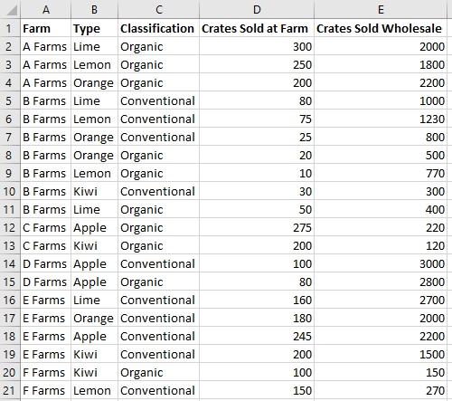
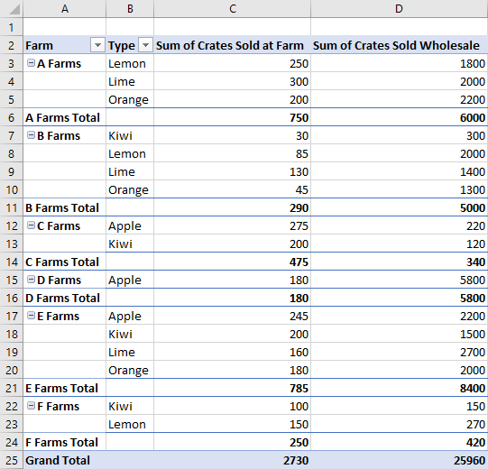

# <a name="work-with-pivottables-using-the-excel-javascript-api"></a><span data-ttu-id="a2a3c-103">Работа со сводными таблицами с помощью API JavaScript для Excel</span><span class="sxs-lookup"><span data-stu-id="a2a3c-103">Work with ranges using the Excel JavaScript API</span></span>

<span data-ttu-id="a2a3c-p101">Сводные таблицы упрощают создание больших наборов данных. Они позволяют быстро манипулировать сгруппированными данными. API JavaScript для Excel позволяет вашей надстройке создавать сводные таблицы и взаимодействовать со своими компонентами.</span><span class="sxs-lookup"><span data-stu-id="a2a3c-p101">PivotTables streamline larger data sets. They allow the quick manipulation of grouped data. The Excel JavaScript API lets your add-in create PivotTables and interact with their components.</span></span> 

<span data-ttu-id="a2a3c-p102">Если вы не знакомы с возможностями сводных таблиц, рекомендуем исследовать их с точки зрения конечного пользователя. Хороший учебник для начинающих по этим средствам содержится в разделе [Создание сводной таблицы для анализа данных листа](https://support.office.com/en-us/article/Import-and-analyze-data-ccd3c4a6-272f-4c97-afbb-d3f27407fcde#ID0EAABAAA=PivotTables).</span><span class="sxs-lookup"><span data-stu-id="a2a3c-p102">If you are unfamiliar with the functionality of PivotTables, consider exploring them as an end user. See [Create a PivotTable to analyze worksheet data](https://support.office.com/en-us/article/Import-and-analyze-data-ccd3c4a6-272f-4c97-afbb-d3f27407fcde#ID0EAABAAA=PivotTables) for a good primer on these tools.</span></span> 

<span data-ttu-id="a2a3c-p103">В этой статье приведены примеры кода для распространенных сценариев. Для дальнейшего понимание API сводной таблицы, просмотрите [**PivotTable**](https://docs.microsoft.com/javascript/api/excel/excel.pivottable) и [**PivotTableCollection**](https://docs.microsoft.com/javascript/api/excel/excel.pivottable).</span><span class="sxs-lookup"><span data-stu-id="a2a3c-p103">This article provides code samples for common scenarios. To further your understanding of the PivotTable API, see [**PivotTable**](https://docs.microsoft.com/javascript/api/excel/excel.pivottable) and [**PivotTableCollection**](https://docs.microsoft.com/javascript/api/excel/excel.pivottable).</span></span>

> [!IMPORTANT]
> <span data-ttu-id="a2a3c-111">Сводные таблицы, созданные с помощью OLAP, в настоящее время не поддерживаются.</span><span class="sxs-lookup"><span data-stu-id="a2a3c-111">PivotTables created with OLAP are not currently supported.</span></span>

## <a name="hierarchies"></a><span data-ttu-id="a2a3c-112">Иерархии</span><span class="sxs-lookup"><span data-stu-id="a2a3c-112">PKI Hierarchies</span></span>

<span data-ttu-id="a2a3c-p104">Сводные таблицы организованы на основе четырех категорий иерархии: строка, столбец, данные и фильтр. Следующие данные, описывающие продажи фруктов из разных ферм, будут использоваться в этой статье.</span><span class="sxs-lookup"><span data-stu-id="a2a3c-p104">PivotTables are organized based on four hierarchy categories: row, column, data, and filter. The following data describing fruit sales from various farms will be used throughout this article.</span></span>



<span data-ttu-id="a2a3c-p105">Эти данные имеют пять иерархий: **Фермы**, **Тип**, **Классификация**, **Ящики, проданные на ферме** и **Ящики, проданные оптом**. Каждая иерархия может существовать только в одной из четырех категорий. Если **Тип** добавляется к иерархиям столбцов, а затем добавляется к иерархиям строк, он остается только в последних.</span><span class="sxs-lookup"><span data-stu-id="a2a3c-p105">This data has five hierarchies: **Farms**, **Type**, **Classification**, **Crates Sold at Farm**, and **Crates Sold Wholesale**. Each hierarchy can only exist in one of the four categories. If **Type** is added to column hierarchies and then added to row hierarchies, it only remains in the latter.</span></span>

<span data-ttu-id="a2a3c-p106">Иерархии строк и столбцов определяют, как будут группироваться данные. Например, иерархия строки **Фермы** объединит все наборы данных из одной фермы. Выбор между иерархией строк и столбцов определяет ориентацию сводной таблицы.</span><span class="sxs-lookup"><span data-stu-id="a2a3c-p106">Row and column hierarchies define how data will be grouped. For example, a row hierarchy of **Farms** will group together all the data sets from the same farm. The choice between row and column hierarchy defines the orientation of the PivotTable.</span></span>

<span data-ttu-id="a2a3c-p107">Иерархии данных - это агрегированные значения, основанные на иерархиях строк и столбцов. Сводная таблица с иерархией строк **Фермы** и иерархия данных **Ящики, проданные оптом** показывает общую сумму (по умолчанию) всех разных фруктов для каждой фермы.</span><span class="sxs-lookup"><span data-stu-id="a2a3c-p107">Data hierarchies are the values to be aggregated based on the row and column hierarchies. A PivotTable with a row hierarchy of **Farms** and a data hierarchy of **Crates Sold Wholesale** shows the sum total (by default) of all the different fruits for each farm.</span></span>

<span data-ttu-id="a2a3c-p108">Иерархии фильтров включают или исключают данные из сводного документа на основе значений в этом отфильтрованном типе. Иерархия фильтра **Классификация** с выбранным типом **Органика** отображает только данные для органических фруктов.</span><span class="sxs-lookup"><span data-stu-id="a2a3c-p108">Filter hierarchies include or exclude data from the pivot based on values within that filtered type. A filter hierarchy of **Classification** with the type **Organic** selected only shows data for organic fruit.</span></span>

<span data-ttu-id="a2a3c-p109">Вот опять данные фермы, вместе со сводной таблицей. Сводная таблица использует **Ферму** и **Тип** в качестве иерархий строк, **Ящики, проданные на ферме** и **Ящики, проданные оптом** в качестве иерархий данных (с функцией агрегации по умолчанию для суммы) и **Классификацию** в качестве иерархии фильтров (при выборе **Органики**).</span><span class="sxs-lookup"><span data-stu-id="a2a3c-p109">Here is the farm data again, alongside a PivotTable. The PivotTable is using **Farm** and **Type** as the row hierarchies, **Crates Sold at Farm** and **Crates Sold Wholesale** as the data hierarchies (with the default aggregation function of sum), and **Classification** as a filter hierarchy (with **Organic** selected).</span></span> 


<span data-ttu-id="a2a3c-p110">Эта сводная таблица может быть сгенерирована через API JavaScript или через интерфейс Excel. Оба параметра позволяют осуществлять дальнейшие манипуляции с помощью надстроек.</span><span class="sxs-lookup"><span data-stu-id="a2a3c-p110">This PivotTable could be generated through the JavaScript API or through the Excel UI. Both options allow for further manipulation through add-ins.</span></span>

## <a name="create-a-pivottable"></a><span data-ttu-id="a2a3c-131">Создание сводной таблицы</span><span class="sxs-lookup"><span data-stu-id="a2a3c-131">Create a PivotTable with Range objects</span></span>

<span data-ttu-id="a2a3c-p111">Для сводных таблиц требуется имя, источник и место назначения. Источником может быть адрес диапазона или имя таблицы (передано как тип `Range`, `string` или `Table`). Адрес назначения - это адрес диапазона (заданный как либо `Range`, либо `string`). Следующие примеры показывают различные методы создания сводной таблицы.</span><span class="sxs-lookup"><span data-stu-id="a2a3c-p111">PivotTables need a name, source, and destination. The source can be a range address or table name (passed as a `Range`, `string`, or `Table` type). The destination is a range address (given as either a `Range` or `string`). The following samples show various PivotTable creation techniques.</span></span>

### <a name="create-a-pivottable-with-range-addresses"></a><span data-ttu-id="a2a3c-136">Создание сводной таблицы с помощью адресов диапазона</span><span class="sxs-lookup"><span data-stu-id="a2a3c-136">Create a PivotTable with range addresses</span></span>

```typescript
await Excel.run(async (context) => {
    // creating a PivotTable named "Farm Sales" on the current worksheet at cell A22 with data from the range A1:E21
    context.workbook.worksheets.getActiveWorksheet().pivotTables.add("Farm Sales", "A1:E21", "A22");

    await context.sync();
});
```

### <a name="create-a-pivottable-with-range-objects"></a><span data-ttu-id="a2a3c-137">Создание сводной таблицы с помощью объектов диапазона</span><span class="sxs-lookup"><span data-stu-id="a2a3c-137">Create a PivotTable with Range objects</span></span>

```typescript
await Excel.run(async (context) => {    
    // creating a PivotTable named "Farm Sales" on a worksheet called "PivotWorksheet" at cell A2
    // the data comes from the worksheet "DataWorksheet" across the range A1:E21
    const rangeToAnalyze = context.workbook.worksheets.getItem("DataWorksheet").getRange("A1:E21");
    const rangeToPlacePivot = context.workbook.worksheets.getItem("PivotWorksheet").getRange("A2");
    context.workbook.worksheets.getItem("PivotWorksheet").pivotTables.add(
        "Farm Sales", rangeToAnalyze, rangeToPlacePivot);
    
    await context.sync();
});
```

### <a name="create-a-pivottable-at-the-workbook-level"></a><span data-ttu-id="a2a3c-138">Создание сводной таблицы на уровне рабочей книги</span><span class="sxs-lookup"><span data-stu-id="a2a3c-138">Create a PivotTable at the workbook level</span></span>

```typescript
await Excel.run(async (context) => {
    // creating a PivotTable named "Farm Sales" on a worksheet called "PivotWorksheet" at cell A2
    // the data is from the worksheet "DataWorksheet" across the range A1:E21
    context.workbook.pivotTables.add("Farm Sales", "DataWorksheet!A1:E21", "PivotWorksheet!A2");

    await context.sync();
});
```

## <a name="use-an-existing-pivottable"></a><span data-ttu-id="a2a3c-139">Использование существующей сводной таблицы</span><span class="sxs-lookup"><span data-stu-id="a2a3c-139">Use an existing PivotTable</span></span>

<span data-ttu-id="a2a3c-140">Созданные вручную сводные таблицы, также доступны через коллекцию сводной таблицы рабочей книги или отдельных листов.</span><span class="sxs-lookup"><span data-stu-id="a2a3c-140">Manually created PivotTables are also accessible through the PivotTable collection of the workbook or of individual worksheets.</span></span> 

<span data-ttu-id="a2a3c-p112">Следующий код получает первую сводную таблицу в книге. Затем он присваивает таблице имя для удобства ссылки в будущем.</span><span class="sxs-lookup"><span data-stu-id="a2a3c-p112">The following code gets the first PivotTable in the workbook. It then gives the table a name for easy future reference.</span></span>

```typescript
await Excel.run(async (context) => {
    const pivotTable = context.workbook.pivotTables.getItem("My Pivot");
    await context.sync();
});
```

## <a name="add-rows-and-columns-to-a-pivottable"></a><span data-ttu-id="a2a3c-143">Добавление строк и столбцов в сводную таблицу</span><span class="sxs-lookup"><span data-stu-id="a2a3c-143">Add rows and columns to a PivotTable</span></span>

<span data-ttu-id="a2a3c-144">Строки и столбцы сводят данные, применимые к тем значениям полей.</span><span class="sxs-lookup"><span data-stu-id="a2a3c-144">Rows and columns pivot the data around those fields’ values.</span></span>

<span data-ttu-id="a2a3c-p113">Добавление столбца **Ферма** выполняет сведение всех продаж, относящихся к каждой ферме. Добавление строк **Тип** и **Классификация** дополнительно разбивает данные на основе того, какие фрукты были проданы, и были ли они органическими или нет.</span><span class="sxs-lookup"><span data-stu-id="a2a3c-p113">Adding the **Farm** column pivots all the sales around each farm. Adding the **Type** and **Classification** rows further breaks down the data based on what fruit was sold and whether it was organic or not.</span></span>


```typescript
await Excel.run(async (context) => {
    const pivotTable = context.workbook.worksheets.getActiveWorksheet().pivotTables.getItem("Farm Sales");

    pivotTable.rowHierarchies.add(pivotTable.hierarchies.getItem("Type"));
    pivotTable.rowHierarchies.add(pivotTable.hierarchies.getItem("Classification"));
    
    pivotTable.columnHierarchies.add(pivotTable.hierarchies.getItem("Farm"));

    await context.sync();
});
```

<span data-ttu-id="a2a3c-148">Вы также можете иметь сводную таблицу только строк или столбцов.</span><span class="sxs-lookup"><span data-stu-id="a2a3c-148">You can also have a PivotTable with only rows or columns.</span></span>

```typescript
await Excel.run(async (context) => {
    const pivotTable = context.workbook.worksheets.getActiveWorksheet().pivotTables.getItem("Farm Sales");
    pivotTable.rowHierarchies.add(pivotTable.hierarchies.getItem("Farm"));
    pivotTable.rowHierarchies.add(pivotTable.hierarchies.getItem("Type"));
    pivotTable.rowHierarchies.add(pivotTable.hierarchies.getItem("Classification"));
    
    await context.sync();
});
```

## <a name="add-data-hierarchies-to-the-pivottable"></a><span data-ttu-id="a2a3c-149">Добавление иерархий данных сводным таблицам</span><span class="sxs-lookup"><span data-stu-id="a2a3c-149">Add data hierarchies to the PivotTable</span></span>

<span data-ttu-id="a2a3c-p114">Иерархии данных заполняют сводную таблицу информацией для объединения на основе строк и столбцов. Добавление иерархий данных **Ящики, проданные на ферме** и **Ящики, проданные оптом** дает суммы этих цифр для каждой строки и столбца.</span><span class="sxs-lookup"><span data-stu-id="a2a3c-p114">Data hierarchies fill the PivotTable with information to combine based on the rows and columns. Adding the data hierarchies of **Crates Sold at Farm** and **Crates Sold Wholesale** gives sums of those figures for each row and column.</span></span> 

<span data-ttu-id="a2a3c-152">В примере, как **Ферма**, так и **Тип** являются строками с данными продаж ящиков.</span><span class="sxs-lookup"><span data-stu-id="a2a3c-152">In the example, both **Farm** and **Type** are rows, with the crate sales as the data.</span></span> 


```typescript
await Excel.run(async (context) => {
    const pivotTable = context.workbook.worksheets.getActiveWorksheet().pivotTables.getItem("Farm Sales");

    // "Farm" and "Type" are the hierarchies on which the aggregation is based
    pivotTable.rowHierarchies.add(pivotTable.hierarchies.getItem("Farm"));
    pivotTable.rowHierarchies.add(pivotTable.hierarchies.getItem("Type"));

    // "Crates Sold at Farm" and "Crates Sold Wholesale" are the hierarchies
    // that will have their data aggregated (summed in this case)
    pivotTable.dataHierarchies.add(pivotTable.hierarchies.getItem("Crates Sold at Farm"));
    pivotTable.dataHierarchies.add(pivotTable.hierarchies.getItem("Crates Sold Wholesale"));

    await context.sync();
});
```

## <a name="change-aggregation-function"></a><span data-ttu-id="a2a3c-154">Изменение агрегатной функции</span><span class="sxs-lookup"><span data-stu-id="a2a3c-154">Change aggregation function</span></span>

<span data-ttu-id="a2a3c-p115">Иерархии данных имеют свои агрегированные значения. Для наборов данных чисел это — значение по умолчанию. Свойство `summarizeBy` определяет эту реакцию на событие на основе типа [AggregrationFunction](https://docs.microsoft.com/javascript/api/excel/excel.aggregationfunction).</span><span class="sxs-lookup"><span data-stu-id="a2a3c-p115">Data hierarchies have their values aggregated. For datasets of numbers, this is a sum by default. The `summarizeBy` property defines this behavior based on an [](https://docs.microsoft.com/javascript/api/excel/excel.aggregationfunction) type.</span></span> 

<span data-ttu-id="a2a3c-158">В настоящее время поддерживаются следующие типы агрегатной функции `Sum`, `Count`, `Average`, `Max`, `Min`, `Product`, `CountNumbers`, `StandardDeviation`, `StandardDeviationP`, `Variance`, `VarianceP`, и `Automatic` (по умолчанию).</span><span class="sxs-lookup"><span data-stu-id="a2a3c-158">The currently supported aggregation function types are `Sum`, `Count`, `Average`, `Max`, `Min`, `Product`, `CountNumbers`, `StandardDeviation`, `StandardDeviationP`, `Variance`, `VarianceP`, and `Automatic` (the default).</span></span>

<span data-ttu-id="a2a3c-159">В следующих примерах кода изменяется агрегирование для средних значений данных.</span><span class="sxs-lookup"><span data-stu-id="a2a3c-159">The following code samples changes the aggregation to be averages of the data.</span></span>

```typescript
await Excel.run(async (context) => {
    const pivotTable = context.workbook.worksheets.getActiveWorksheet().pivotTables.getItem("Farm Sales");
    pivotTable.dataHierarchies.load("no-properties-needed");
    await context.sync();

    // changing the aggregation from the default sum to an average of all the values in the hierarchy
    pivotTable.dataHierarchies.items[0].summarizeBy = Excel.AggregationFunction.average;
    pivotTable.dataHierarchies.items[1].summarizeBy = Excel.AggregationFunction.average;
    await context.sync();
});
```

## <a name="change-calculations-with-a-showasrule"></a><span data-ttu-id="a2a3c-160">Изменение расчетов с помощью ShowAsRule</span><span class="sxs-lookup"><span data-stu-id="a2a3c-160">Change calculations with a ShowAsRule</span></span>

<span data-ttu-id="a2a3c-p116">Сводные таблицы по умолчанию агрегируют данные своей иерархии строк и столбцов независимо друг от друга. [ShowAsRule](https://docs.microsoft.com/javascript/api/excel/excel.showasrule) изменяет иерархию данных для вывода значений на основе других элементов в сводной таблице.</span><span class="sxs-lookup"><span data-stu-id="a2a3c-p116">PivotTables, by default, aggregate the data of their row and column hierarchies independently. A [](https://docs.microsoft.com/javascript/api/excel/excel.showasrule) changes the data hierarchy to output values based on other items in the PivotTable.</span></span>

<span data-ttu-id="a2a3c-163">У объекта  `ShowAsRule` три свойства:</span><span class="sxs-lookup"><span data-stu-id="a2a3c-163">The `ShowAsRule` object has three properties:</span></span>
-   <span data-ttu-id="a2a3c-164">`calculation`: Тип относительного вычисления, которое будет применено к иерархии данных (значение по умолчанию — `none`).</span><span class="sxs-lookup"><span data-stu-id="a2a3c-164">`calculation`: The type of relative calculation to apply to the data hierarchy (the default is `none`).</span></span>
-   <span data-ttu-id="a2a3c-p117">`baseField`: Применяется поле внутри иерархии, содержащее базовые данные перед вычислением. [PivotField](https://docs.microsoft.com/javascript/api/excel/excel.pivotfield) обычно имеет то же имя, что и его родительская иерархия.</span><span class="sxs-lookup"><span data-stu-id="a2a3c-p117">`baseField`: The field within the hierarchy containing the base data before the calculation is applied. The [](https://docs.microsoft.com/javascript/api/excel/excel.pivotfield) usually has the same name as its parent hierarchy.</span></span>
-   <span data-ttu-id="a2a3c-p118">`baseItem`: Индивидуальный класс [PivotItem](https://docs.microsoft.com/javascript/api/excel/excel.pivotitem) сравнивается со значениями базовых полей на основе типа расчета. Не все вычисления требуют этого поля.</span><span class="sxs-lookup"><span data-stu-id="a2a3c-p118">`baseItem`: The individual item compared against the values of the base fields based on the calculation type. Not all calculations require this field.</span></span>

<span data-ttu-id="a2a3c-p119">В следующем примере выполняется вычисление в иерархии данных **Сумма ящиков, проданная на ферме** в процентах от общей суммы столбца. Мы по-прежнему хотим, чтобы степень детализации расширялась до уровня типа фрукта, поэтому будем использовать иерархию строк **Тип** и ее базовое поле. В примере также имеется **Ферма** в качестве иерархии первой строки, поэтому итоговые записи фермы показывают процент, за производство которого каждая ферма несет ответственность.</span><span class="sxs-lookup"><span data-stu-id="a2a3c-p119">The following example sets the calculation on the **Sum of Crates Sold at Farm** data hierarchy to be a percentage of the column total. We still want the granularity to extend to the fruit type level, so we’ll use the **Type** row hierarchy and its underlying field. The example also has **Farm** as the first row hierarchy, so the farm total entries display the percentage each farm is responsible for producing as well.</span></span>


``` TypeScript
await Excel.run(async (context) => {
    const pivotTable = context.workbook.worksheets.getActiveWorksheet().pivotTables.getItem("Farm Sales");
    const farmDataHierarchy = pivotTable.dataHierarchies.getItem("Sum of Crates Sold at Farm");

    farmDataHierarchy.load("showAs");
    await context.sync();

    // show the crates of each fruit type sold at the farm as a percentage of the column's total
    let farmShowAs = farmDataHierarchy.showAs;
    farmShowAs.calculation = Excel.ShowAsCalculation.percentOfColumnTotal;
    farmShowAs.baseField = pivotTable.rowHierarchies.getItem("Type").fields.getItem("Type");
    farmDataHierarchy.showAs = farmShowAs; 
    farmDataHierarchy.name = "Percentage of Total Farm Sales";

    await context.sync();
});
```

<span data-ttu-id="a2a3c-p120">Предыдущий пример устанавливает расчет в столбец относительно отдельной иерархии строк. Когда расчет относится к отдельному элементу, используйте свойство `baseItem`.</span><span class="sxs-lookup"><span data-stu-id="a2a3c-p120">The previous example set the calculation to the column, relative to an individual row hierarchy. When the calculation relates to an individual item, use the `baseItem` property.</span></span> 

<span data-ttu-id="a2a3c-p121">В следующем примере показан расчет `differenceFrom`. Он отображает разницу в иерархических позициях данных по продажам ящиков на ферме по сравнению с позициями "Ферм A". `baseField` — это **Ферма**, поэтому мы видим различия между другими фермами, а также разбивки для каждого типа подобных фруктов (**Тип** также является иерархией строк в этом примере).</span><span class="sxs-lookup"><span data-stu-id="a2a3c-p121">The following example shows the `differenceFrom` calculation. It displays the difference of the farm crate sales data hierarchy entries relative to those of “A Farms”. The `baseField` is **Farm**, so we see the differences between the other farms, as well as breakdowns for each type of like fruit (**Type** is also a row hierarchy in this example).</span></span>


``` TypeScript
await Excel.run(async (context) => {
    const pivotTable = context.workbook.worksheets.getActiveWorksheet().pivotTables.getItem("Farm Sales");
    const farmDataHierarchy = pivotTable.dataHierarchies.getItem("Sum of Crates Sold at Farm");

    farmDataHierarchy.load("showAs");
    await context.sync();

    // show the difference between crate sales of the "A Farms" and the other farms
    // this difference is both aggregated and shown for individual fruit types (where applicable)
    let farmShowAs = farmDataHierarchy.showAs;
    farmShowAs.calculation = Excel.ShowAsCalculation.differenceFrom;
    farmShowAs.baseField = pivotTable.rowHierarchies.getItem("Farm").fields.getItem("Farm");
    farmShowAs.baseItem = pivotTable.rowHierarchies.getItem("Farm").fields.getItem("Farm").items.getItem("A Farms");
    farmDataHierarchy.showAs = farmShowAs;
    farmDataHierarchy.name = "Difference from A Farms";
    await context.sync();
});
```

## <a name="pivottable-layouts"></a><span data-ttu-id="a2a3c-181">Макеты сводной таблицы</span><span class="sxs-lookup"><span data-stu-id="a2a3c-181">PivotTable layouts</span></span>

<span data-ttu-id="a2a3c-p123"> [PivotLayout](https://docs.microsoft.com/javascript/api/excel/excel.pivotlayout) определяет положение иерархий и их данных. Вы получаете доступ к макету для определения диапазонов хранения данных.</span><span class="sxs-lookup"><span data-stu-id="a2a3c-p123">A PivotTable layout defines the placement of hierarchies and their data. You access the layout to determine the ranges where data is stored.</span></span> 

<span data-ttu-id="a2a3c-184">На следующей диаграмме показано, какие вызовы функции макета соответствуют каким диапазонам из сводной таблицы.</span><span class="sxs-lookup"><span data-stu-id="a2a3c-184">The following diagram shows which layout function calls correspond to which ranges of the PivotTable.</span></span>


<span data-ttu-id="a2a3c-p124">Следующий код демонстрирует, как получить последнюю строку данных сводной таблицы, просмотрев макет. Затем эти значения суммируются вместе для общего итога.</span><span class="sxs-lookup"><span data-stu-id="a2a3c-p124">The following code demonstrates how to get the last row of the PivotTable data by going through the layout. Those values are then summed together for a grand total.</span></span>

```typescript
await Excel.run(async (context) => {
    const pivotTable = context.workbook.worksheets.getActiveWorksheet().pivotTables.getItem("Farm Sales");

    // get the totals for each data hierarchy from the layout
    const range = pivotTable.layout.getDataBodyRange();
    const grandTotalRange = range.getLastRow();
    grandTotalRange.load("address");
    await context.sync();

    // sum the totals from the PivotTable data hierarchies and place them in a new range
    const masterTotalRange = context.workbook.worksheets.getActiveWorksheet().getRange("B27:C27");
    masterTotalRange.formulas = [["All Crates", "=SUM(" + grandTotalRange.address + ")"]];
    await context.sync();
});
```

<span data-ttu-id="a2a3c-p125">Сводные таблицы имеют три стиля макета: Compact, Outline и Tabular. Мы видели компактный стиль (Compact) в предыдущих примерах.</span><span class="sxs-lookup"><span data-stu-id="a2a3c-p125">PivotTables have three layout styles: Compact, Outline, and Tabular. We’ve seen the compact style in the previous examples.</span></span> 

<span data-ttu-id="a2a3c-p126">В следующих примерах используются контурные и табличные стили соответственно. В примере кода показано, как перемещаться между различными макетами.</span><span class="sxs-lookup"><span data-stu-id="a2a3c-p126">The following examples use the outline and tabular styles, respectively. The code sample shows how to cycle between the different layouts.</span></span>

### <a name="outline-layout"></a><span data-ttu-id="a2a3c-192">Макет контура</span><span class="sxs-lookup"><span data-stu-id="a2a3c-192">Outline layout</span></span>


### <a name="tabular-layout"></a><span data-ttu-id="a2a3c-194">Табличный макет</span><span class="sxs-lookup"><span data-stu-id="a2a3c-194">Tabular layout</span></span>



## <a name="change-hierarchy-names"></a><span data-ttu-id="a2a3c-196">Изменение имен иерархий</span><span class="sxs-lookup"><span data-stu-id="a2a3c-196">Change hierarchy names</span></span>

<span data-ttu-id="a2a3c-p127">Иерархические поля можно редактировать. Следующий код демонстрирует, как изменить отображаемые имена двух иерархий данных.</span><span class="sxs-lookup"><span data-stu-id="a2a3c-p127">Hierarchy fields are editable. The following code demonstrates how to change the displayed names of two data hierarchies.</span></span>

```typescript
await Excel.run(async (context) => {
    const dataHierarchies = context.workbook.worksheets.getActiveWorksheet()
        .pivotTables.getItem("Farm Sales").dataHierarchies;
    dataHierarchies.load("no-properties-needed");
    await context.sync();
    
    // changing the displayed names of these entries
    dataHierarchies.items[0].name = "Farm Sales";
    dataHierarchies.items[1].name = "Wholesale";
    await context.sync();
});
```

## <a name="delete-a-pivottable"></a><span data-ttu-id="a2a3c-199">Удаление сводной таблицы</span><span class="sxs-lookup"><span data-stu-id="a2a3c-199">Delete a PivotTable</span></span>

<span data-ttu-id="a2a3c-200">Сводная таблица удаляется по имени.</span><span class="sxs-lookup"><span data-stu-id="a2a3c-200">PivotTables are deleted by using their name.</span></span>

```typescript
await Excel.run(async (context) => {
    context.workbook.worksheets.getItem("Pivot").pivotTables.getItem("Farm Sales").delete();

    await context.sync();
});
```

## <a name="see-also"></a><span data-ttu-id="a2a3c-201">См. также</span><span class="sxs-lookup"><span data-stu-id="a2a3c-201">See also</span></span>

- [<span data-ttu-id="a2a3c-202">Фундаментальные понятия программирования с использованием интерфейса API JavaScript для Excel</span><span class="sxs-lookup"><span data-stu-id="a2a3c-202">Fundamental programming concepts with the Excel JavaScript API</span></span>](excel-add-ins-core-concepts.md)
- [<span data-ttu-id="a2a3c-203">Ссылка по API JavaScript для Excel</span><span class="sxs-lookup"><span data-stu-id="a2a3c-203">Excel JavaScript API reference</span></span>](https://docs.microsoft.com/javascript/api/excel)
