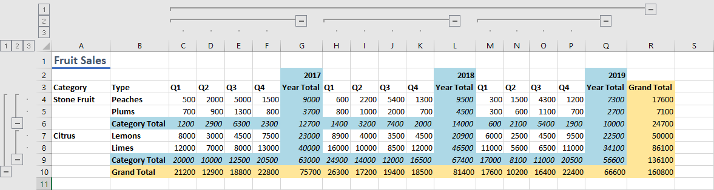

# <a name="group-ranges-for-an-outline-using-the-excel-javascript-api"></a>Диапазоны групп для контура с Excel API JavaScript

В этой статье приводится пример кода, в который показано, как группировать диапазоны для контура с Excel API JavaScript. Полный список свойств и методов, поддерживаемый объектом, см. в `Range` [Excel. Класс Range](/javascript/api/excel/excel.range).

## <a name="group-rows-or-columns-of-a-range-for-an-outline"></a>Групповые строки или столбцы диапазона для контура

Строки или столбцы диапазона можно сгруппить для создания [контура.](https://support.office.com/article/Outline-group-data-in-a-worksheet-08CE98C4-0063-4D42-8AC7-8278C49E9AFF) Эти группы можно свернуть и расширить, чтобы скрыть и показать соответствующие ячейки. Это упрощает быстрый анализ данных верхнего верхней строки. Чтобы сделать эти группы контуров, используйте [Range.group.](/javascript/api/excel/excel.range#group_groupOption_)

Контур может иметь иерархию, в которой небольшие группы вложены в более крупные группы. Это позволяет просматривать контуры на разных уровнях. Изменение уровня видимых контуров можно сделать программным путем с помощью метода [Worksheet.showOutlineLevels.](/javascript/api/excel/excel.worksheet#showOutlineLevels_rowLevels__columnLevels_) Обратите внимание, Excel поддерживает только восемь уровней групп контуров.

В следующем примере кода создается контур с двумя уровнями групп для строк и столбцов. На последующем изображении показаны группировки этого контура. В примере кода диапазоны, которые группуются, не включают строку или столбец управления контурами (в этом примере "Итоги"). Группа определяет, что будет свернуто, а не строка или столбец с управлением.

```js
Excel.run(function (context) {
    var sheet = context.workbook.worksheets.getItem("Sample");

    // Group the larger, main level. Note that the outline controls
    // will be on row 10, meaning 4-9 will collapse and expand.
    sheet.getRange("4:9").group(Excel.GroupOption.byRows);

    // Group the smaller, sublevels. Note that the outline controls
    // will be on rows 6 and 9, meaning 4-5 and 7-8 will collapse and expand.
    sheet.getRange("4:5").group(Excel.GroupOption.byRows);
    sheet.getRange("7:8").group(Excel.GroupOption.byRows);

    // Group the larger, main level. Note that the outline controls
    // will be on column R, meaning C-Q will collapse and expand.
    sheet.getRange("C:Q").group(Excel.GroupOption.byColumns);

    // Group the smaller, sublevels. Note that the outline controls
    // will be on columns G, L, and R, meaning C-F, H-K, and M-P will collapse and expand.
    sheet.getRange("C:F").group(Excel.GroupOption.byColumns);
    sheet.getRange("H:K").group(Excel.GroupOption.byColumns);
    sheet.getRange("M:P").group(Excel.GroupOption.byColumns);
    return context.sync();
}).catch(errorHandlerFunction);
```



## <a name="remove-grouping-from-rows-or-columns-of-a-range"></a>Удаление группировки из строк или столбцов диапазона

Чтобы разгруппировать строку или группу столбцов, используйте [метод Range.ungroup.](/javascript/api/excel/excel.range#ungroup_groupOption_) Это удаляет внешний уровень из контура. Если несколько групп одного и того же типа строки или столбца находятся на одном уровне в указанном диапазоне, все эти группы негруппировываются.

## <a name="see-also"></a>См. также

- [Объектная модель JavaScript для Excel в надстройках Office](excel-add-ins-core-concepts.md)
- [Работа с ячейками с Excel API JavaScript](excel-add-ins-cells.md)
- [Работа с несколькими диапазонами одновременно в надстройках Excel](excel-add-ins-multiple-ranges.md)
