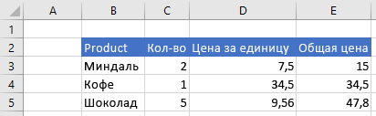
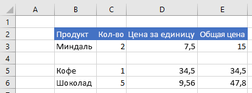

# <a name="insert-a-range-of-cells-using-the-excel-javascript-api"></a>Вставьте диапазон ячеек с Excel API JavaScript

В этой статье содержится пример кода, который вставляет ряд ячеек с Excel API JavaScript. Полный список свойств и методов, поддерживаемых объектом, см. `Range` [в Excel. Класс Range](/javascript/api/excel/excel.range).

[!include[Excel cells and ranges note](../includes/note-excel-cells-and-ranges.md)]

## <a name="insert-a-range-of-cells"></a>Вставка диапазона ячеек

В примере кода ниже показано, как вставить диапазон ячеек в расположение **B4:E4** и сдвинуть другие ячейки вниз, чтобы освободить место для новых ячеек.

```js
Excel.run(function (context) {
    var sheet = context.workbook.worksheets.getItem("Sample");
    var range = sheet.getRange("B4:E4");

    range.insert(Excel.InsertShiftDirection.down);

    return context.sync();
}).catch(errorHandlerFunction);
```

### <a name="data-before-range-is-inserted"></a>Данные перед вставкой диапазона



### <a name="data-after-range-is-inserted"></a>Данные после вставки диапазона



## <a name="see-also"></a>См. также

- [Объектная модель JavaScript для Excel в надстройках Office](excel-add-ins-core-concepts.md)
- [Работа с ячейками с Excel API JavaScript](excel-add-ins-cells.md)
- [Очистить или удалить диапазоны с Excel API JavaScript](excel-add-ins-ranges-clear-delete.md)
