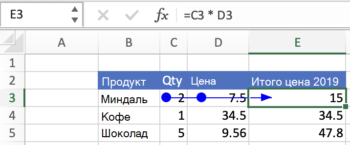
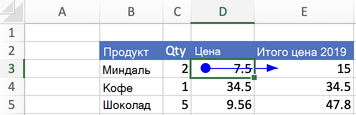

# <a name="get-formula-precedents-and-dependents-using-the-excel-javascript-api"></a>Получите прецеденты формул и иждивенцев с Excel API JavaScript

Excel часто ссылаются на другие ячейки. Эти межклеточные ссылки называются "прецедентами" и "зависимыми". Прецедент — это ячейка, которая предоставляет данные формуле. Зависимая ячейка содержит формулу, которая ссылается на другие ячейки. Дополнительные дополнительные Excel, связанные с отношениями между ячейками, см. в руб. Отображение взаимосвязей между [формулами и ячейками.](https://support.microsoft.com/office/display-the-relationships-between-formulas-and-cells-a59bef2b-3701-46bf-8ff1-d3518771d507)

Ячейка может иметь ячейку прецедента, и эта ячейка прецедента может иметь свои собственные ячейки прецедента. "Прямой прецедент" является первой предыдущей группой ячеек в этой последовательности, аналогичной концепции родителей в родительских отношениях с ребенком. "Прямая зависимость" — это первая зависимая группа ячеек в последовательности, похожая на детей в отношениях между родителем и ребенком. Ячейки, которые относятся к другим ячейкам в книге, но отношения которых не являются отношениями между родителями и детьми, не являются прямыми иждивенцами или прямыми прецедентами.

В этой статье приводится пример кода, который извлекает прямые прецеденты и напрямую зависит от формул с Excel API JavaScript. Полный список свойств и методов, поддерживаемых объектом, см. в руб. `Range` [Range Object (API JavaScript для Excel).](/javascript/api/excel/excel.range)

## <a name="get-the-direct-precedents-of-a-formula"></a>Получите прямые прецеденты формулы

Найдите прямые ячейки прецедента формулы [с помощью Range.getDirectPrecedents.](/javascript/api/excel/excel.range#getdirectprecedents--) `Range.getDirectPrecedents` возвращает `WorkbookRangeAreas` объект. Этот объект содержит адреса всех прямых прецедентов в книге. Для каждого таблицы имеется отдельный объект, содержащий по `RangeAreas` крайней мере один прецедент формулы. Дополнительные сведения о работе с объектом см. в совместной работе с несколькими диапазонами `RangeAreas` [Excel надстройки.](excel-add-ins-multiple-ranges.md)

На следующем скриншоте показан результат выбора кнопки **Trace Precedents** в пользовательском Excel интерфейсе. Эта кнопка рисует стрелку из ячеек-прецедентов в выбранную ячейку. Выбранная ячейка **E3** содержит формулу "=C3 * D3", поэтому **C3** и **D3** являются прецедентными ячейками. В отличие Excel пользовательского интерфейса, `getDirectPrecedents` метод не рисует стрелки.



> [!IMPORTANT]
> Метод `getDirectPrecedents` не может получить ячейки прецедента в книгах.

В следующем примере кода получаются прямые прецеденты для активного диапазона, а затем изменяется фоновый цвет этих ячеек-прецедентов на желтый.

```js
Excel.run(function (context) {
    // Precedents are cells that provide data to the selected formula.
    var range = context.workbook.getActiveCell();
    var directPrecedents = range.getDirectPrecedents();
    range.load("address");
    directPrecedents.areas.load("address");
    
    return context.sync()
        .then(function () {
            console.log(`Direct precedent cells of ${range.address}:`);

            // Use the direct precedents API to loop through precedents of the active cell.
            for (var i = 0; i < directPrecedents.areas.items.length; i++) {
              // Highlight and print out the address of each precedent cell.
              directPrecedents.areas.items[i].format.fill.color = "Yellow";
              console.log(`  ${directPrecedents.areas.items[i].address}`);
            }
        });
}).catch(errorHandlerFunction);
```

## <a name="get-the-direct-dependents-of-a-formula-preview"></a>Получить прямые иждивенцы формулы (предварительный просмотр)

> [!NOTE]
> В `Range.getDirectDependents` настоящее время метод доступен только в общедоступных предварительных версиях. [!INCLUDE [Information about using preview APIs](../includes/using-excel-preview-apis.md)]
> 

Найдите прямые зависимые ячейки формулы [с помощью Range.getDirectDependents.](/javascript/api/excel/excel.range#getDirectDependents__) Как `Range.getDirectPrecedents` , также возвращает `Range.getDirectDependents` `WorkbookRangeAreas` объект. Этот объект содержит адреса всех прямых иждивенцев в книге. Он имеет отдельный `RangeAreas` объект для каждого таблицы, содержащего по крайней мере одну зависимую формулу. Дополнительные сведения о работе с объектом см. в совместной работе с несколькими диапазонами `RangeAreas` [Excel надстройки.](excel-add-ins-multiple-ranges.md)

На следующем скриншоте показан результат выбора кнопки **Trace Dependents** в пользовательском Excel интерфейсе. Эта кнопка рисует стрелку из зависимых ячеек в выбранную ячейку. Выбранная ячейка **D3** имеет ячейку **E3** в качестве зависимой. **E3** содержит формулу "=C3 * D3". В отличие Excel пользовательского интерфейса, `getDirectDependents` метод не рисует стрелки.



> [!IMPORTANT]
> Метод `getDirectDependents` не может получить зависимые ячейки в книгах.

В следующем примере кода получаются прямые иждивенцы для активного диапазона, а затем изменяется фоновый цвет этих зависимых ячеек на желтый.

```js
Excel.run(function (context) {
    // Direct dependents are cells that contain formulas that refer to other cells.
    var range = context.workbook.getActiveCell();
    var directDependents = range.getDirectDependents();
    range.load("address");
    directDependents.areas.load("address");
    
    return context.sync()
        .then(function () {
            console.log(`Direct dependent cells of ${range.address}:`);
    
            // Use the direct dependents API to loop through direct dependents of the active cell.
            for (var i = 0; i < directDependents.areas.items.length; i++) {
              // Highlight and print the address of each dependent cell.
              directDependents.areas.items[i].format.fill.color = "Yellow";
              console.log(`  ${directDependents.areas.items[i].address}`);
            }
        });
}).catch(errorHandlerFunction);
```

## <a name="see-also"></a>См. также

- [Объектная модель JavaScript для Excel в надстройках Office](excel-add-ins-core-concepts.md)
- [Работа с ячейками с Excel API JavaScript](excel-add-ins-cells.md)
- [Работа с несколькими диапазонами одновременно в надстройках Excel](excel-add-ins-multiple-ranges.md)
