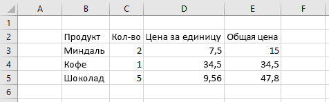

# <a name="set-range-format-using-the-excel-javascript-api"></a>Настройка формата диапазона с Excel API JavaScript

В этой статье данная статья содержит примеры кода, которые устанавливают цвет шрифта, цвет и формат номеров для ячеек в диапазоне с Excel API JavaScript. Полный список свойств `Range` и методов, поддерживаемый объектом, см. в Excel[. Класс Range](/javascript/api/excel/excel.range).

[!include[Excel cells and ranges note](../includes/note-excel-cells-and-ranges.md)]

## <a name="set-font-color-and-fill-color"></a>Задание цвета шрифта и цвета заливки

В примере ниже показано, как задать цвет шрифта и цвет заливки для ячеек в диапазоне **B2: E2**.

```js
await Excel.run(async (context) => {
    let sheet = context.workbook.worksheets.getItem("Sample");

    let range = sheet.getRange("B2:E2");
    range.format.fill.color = "#4472C4";
    range.format.font.color = "white";

    await context.sync();
});
```

### <a name="data-in-range-before-font-color-and-fill-color-are-set"></a>Данные в диапазоне перед заданием цвета шрифта и цвета заливки



### <a name="data-in-range-after-font-color-and-fill-color-are-set"></a>Данные в диапазоне после задания цвета шрифта и цвета заливки


## <a name="set-number-format"></a>Задание формата чисел

В примере ниже показано, как задать формат чисел для ячеек в диапазоне **D3:E5**.

```js
await Excel.run(async (context) => {
    let sheet = context.workbook.worksheets.getItem("Sample");

    let formats = [
        ["0.00", "0.00"],
        ["0.00", "0.00"],
        ["0.00", "0.00"]
    ];

    let range = sheet.getRange("D3:E5");
    range.numberFormat = formats;

    await context.sync();
});
```

### <a name="data-in-range-before-number-format-is-set"></a>Данные в диапазоне перед заданием формата чисел


### <a name="data-in-range-after-number-format-is-set"></a>Данные в диапазоне после задания формата чисел


## <a name="see-also"></a>См. также

- [Объектная модель JavaScript для Excel в надстройках Office](excel-add-ins-core-concepts.md)
- [Работа с ячейками с Excel API JavaScript](excel-add-ins-cells.md)
- [Настройка и получения диапазонов с Excel API JavaScript](excel-add-ins-ranges-set-get.md)
- [Установите и получите значения диапазона, текст или формулы с Excel API JavaScript](excel-add-ins-ranges-set-get-values.md)
