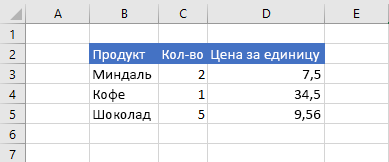

# <a name="set-and-get-range-values-text-or-formulas-using-the-excel-javascript-api"></a>Установите и получите значения диапазона, текст или формулы с Excel API JavaScript

В этой статье данная статья содержит примеры кода, которые устанавливают и получают значения диапазона, текст или формулы с Excel API JavaScript. Полный список свойств и методов, поддерживаемый объектом, см. в `Range` [Excel. Класс Range](/javascript/api/excel/excel.range).

[!include[Excel cells and ranges note](../includes/note-excel-cells-and-ranges.md)]

## <a name="set-values-or-formulas"></a>Задание значений или формул

В следующих примерах кода устанавливаются значения и формулы для одной ячейки или целого ряда ячеек.

### <a name="set-value-for-a-single-cell"></a>Задание значения для одной ячейки

В примере кода ниже показано, как присвоить ячейке **C3** значение 5, а затем настроить ширину столбцов для наилучшего размещения данных.

```js
Excel.run(function (context) {
    var sheet = context.workbook.worksheets.getItem("Sample");

    var range = sheet.getRange("C3");
    range.values = [[ 5 ]];
    range.format.autofitColumns();

    return context.sync();
}).catch(errorHandlerFunction);
```

#### <a name="data-before-cell-value-is-updated"></a>Данные перед изменением значения ячейки



#### <a name="data-after-cell-value-is-updated"></a>Данные после изменения значения ячейки


### <a name="set-values-for-a-range-of-cells"></a>Задание значений для диапазона ячеек

В примере кода ниже показано, как присвоить значения ячейкам в диапазоне **B5:D5**, а затем настроить ширину столбцов для наилучшего размещения данных.

```js
Excel.run(function (context) {
    var sheet = context.workbook.worksheets.getItem("Sample");

    var data = [
        ["Potato Chips", 10, 1.80],
    ];

    var range = sheet.getRange("B5:D5");
    range.values = data;
    range.format.autofitColumns();

    return context.sync();
}).catch(errorHandlerFunction);
```

#### <a name="data-before-cell-values-are-updated"></a>Данные перед изменением значений ячеек


#### <a name="data-after-cell-values-are-updated"></a>Данные после изменения значений ячеек


### <a name="set-formula-for-a-single-cell"></a>Задание формулы для одной ячейки

В примере кода ниже показано, как задать формулу для ячейки **E3**, а затем настроить ширину столбцов для наилучшего размещения данных.

```js
Excel.run(function (context) {
    var sheet = context.workbook.worksheets.getItem("Sample");

    var range = sheet.getRange("E3");
    range.formulas = [[ "=C3 * D3" ]];
    range.format.autofitColumns();

    return context.sync();
}).catch(errorHandlerFunction);
```

#### <a name="data-before-cell-formula-is-set"></a>Данные перед заданием формулы для ячейки


#### <a name="data-after-cell-formula-is-set"></a>Данные после задания формулы для ячейки


### <a name="set-formulas-for-a-range-of-cells"></a>Задание формул для диапазона ячеек

В примере кода ниже показано, как задать формулы для ячеек в диапазоне **E2:E6**, а затем настроить ширину столбцов для наилучшего размещения данных.

```js
Excel.run(function (context) {
    var sheet = context.workbook.worksheets.getItem("Sample");

    var data = [
        ["=C3 * D3"],
        ["=C4 * D4"],
        ["=C5 * D5"],
        ["=SUM(E3:E5)"]
    ];

    var range = sheet.getRange("E3:E6");
    range.formulas = data;
    range.format.autofitColumns();

    return context.sync();
}).catch(errorHandlerFunction);
```

#### <a name="data-before-cell-formulas-are-set"></a>Данные перед заданием формул для ячеек


#### <a name="data-after-cell-formulas-are-set"></a>Данные после задания формул для ячеек


## <a name="get-values-text-or-formulas"></a>Получение значений, текста или формул

Эти примеры кода получают значения, текст и формулы из ряда ячеек.

### <a name="get-values-from-a-range-of-cells"></a>Получение значений из диапазона ячеек

В следующем примере кода получает диапазон **B2:E6,** загружается его свойство и записывает значения `values` на консоль. Свойство `values` диапазона указывает необработанные значения, содержащиеся в ячейках. Даже если некоторые ячейки в диапазоне содержат формулы, свойство диапазона указывает необработанные значения для этих ячеек, а не какие-либо `values` формулы.

```js
Excel.run(function (context) {
    var sheet = context.workbook.worksheets.getItem("Sample");
    var range = sheet.getRange("B2:E6");
    range.load("values");

    return context.sync()
        .then(function () {
            console.log(JSON.stringify(range.values, null, 4));
        });
}).catch(errorHandlerFunction);
```

#### <a name="data-in-range-values-in-column-e-are-a-result-of-formulas"></a>Данные в диапазоне (значения в столбце E представляют собой результат вычисления формул)


#### <a name="rangevalues-as-logged-to-the-console-by-the-code-sample-above"></a>range.values (как записано в консоль в примере кода выше)

```json
[
    [
        "Product",
        "Qty",
        "Unit Price",
        "Total Price"
    ],
    [
        "Almonds",
        2,
        7.5,
        15
    ],
    [
        "Coffee",
        1,
        34.5,
        34.5
    ],
    [
        "Chocolate",
        5,
        9.56,
        47.8
    ],
    [
        "",
        "",
        "",
        97.3
    ]
]
```

### <a name="get-text-from-a-range-of-cells"></a>Получение текста из диапазона ячеек

Следующий пример кода получает диапазон **B2:E6,** загружает его `text` свойство и записывает его на консоль. Свойство диапазона указывает значения отображения для `text` ячеек в диапазоне. Даже если некоторые ячейки в диапазоне содержат формулы, свойство диапазона указывает значения отображения для этих ячеек, а не любые `text` формулы.

```js
Excel.run(function (context) {
    var sheet = context.workbook.worksheets.getItem("Sample");
    var range = sheet.getRange("B2:E6");
    range.load("text");

    return context.sync()
        .then(function () {
            console.log(JSON.stringify(range.text, null, 4));
        });
}).catch(errorHandlerFunction);
```

#### <a name="data-in-range-values-in-column-e-are-a-result-of-formulas"></a>Данные в диапазоне (значения в столбце E представляют собой результат вычисления формул)


#### <a name="rangetext-as-logged-to-the-console-by-the-code-sample-above"></a>range.text (как записано в консоль в примере кода выше)

```json
[
    [
        "Product",
        "Qty",
        "Unit Price",
        "Total Price"
    ],
    [
        "Almonds",
        "2",
        "7.5",
        "15"
    ],
    [
        "Coffee",
        "1",
        "34.5",
        "34.5"
    ],
    [
        "Chocolate",
        "5",
        "9.56",
        "47.8"
    ],
    [
        "",
        "",
        "",
        "97.3"
    ]
]
```

### <a name="get-formulas-from-a-range-of-cells"></a>Получение формул из диапазона ячеек

Следующий пример кода получает диапазон **B2:E6,** загружает его `formulas` свойство и записывает его на консоль. Свойство диапазона указывает формулы для ячеек в диапазоне, содержащих формулы, и необработанные значения для ячеек в диапазоне, которые не `formulas` содержат формул.

```js
Excel.run(function (context) {
    var sheet = context.workbook.worksheets.getItem("Sample");
    var range = sheet.getRange("B2:E6");
    range.load("formulas");

    return context.sync()
        .then(function () {
            console.log(JSON.stringify(range.formulas, null, 4));
        });
}).catch(errorHandlerFunction);
```

#### <a name="data-in-range-values-in-column-e-are-a-result-of-formulas"></a>Данные в диапазоне (значения в столбце E представляют собой результат вычисления формул)


#### <a name="rangeformulas-as-logged-to-the-console-by-the-code-sample-above"></a>range.formulas (как записано в консоль в примере кода выше)

```json
[
    [
        "Product",
        "Qty",
        "Unit Price",
        "Total Price"
    ],
    [
        "Almonds",
        2,
        7.5,
        "=C3 * D3"
    ],
    [
        "Coffee",
        1,
        34.5,
        "=C4 * D4"
    ],
    [
        "Chocolate",
        5,
        9.56,
        "=C5 * D5"
    ],
    [
        "",
        "",
        "",
        "=SUM(E3:E5)"
    ]
]
```

## <a name="see-also"></a>См. также

- [Объектная модель JavaScript для Excel в надстройках Office](excel-add-ins-core-concepts.md)
- [Работа с ячейками с Excel API JavaScript](excel-add-ins-cells.md)
- [Настройка и получения диапазонов с Excel API JavaScript](excel-add-ins-ranges-set-get.md)
- [Настройка формата диапазона с Excel API JavaScript](excel-add-ins-ranges-set-format.md)
