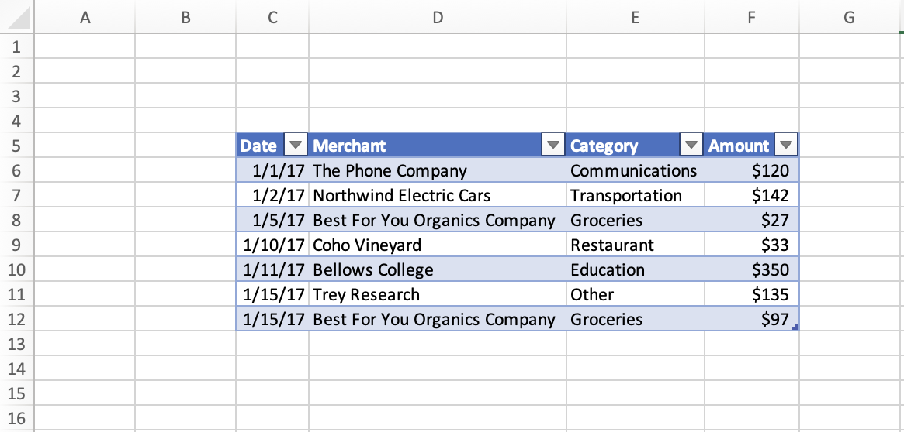
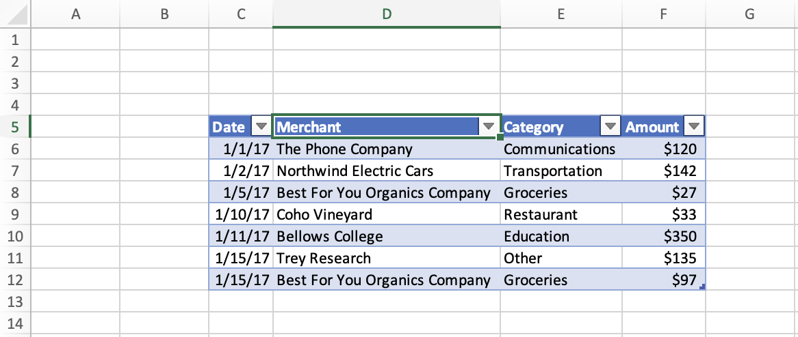
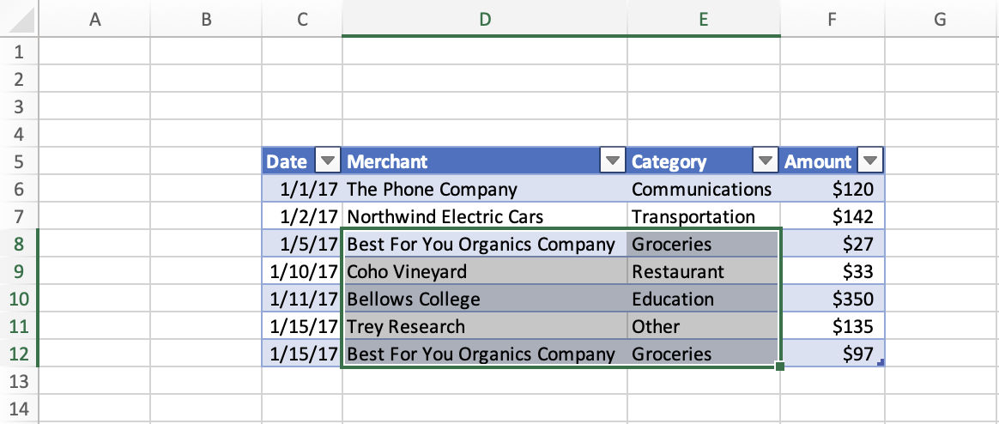

# <a name="set-and-get-the-selected-range-using-the-excel-javascript-api"></a>Установите и получите выбранный диапазон с Excel API JavaScript

В этой статье данная статья содержит примеры кода, которые устанавливают и получают выбранный диапазон с Excel API JavaScript. Полный список свойств `Range` и методов, поддерживаемый объектом, см. в Excel[. Класс Range](/javascript/api/excel/excel.range).

[!include[Excel cells and ranges note](../includes/note-excel-cells-and-ranges.md)]

## <a name="set-the-selected-range"></a>Задание выделенного диапазона

В примере кода ниже показано, как выделить диапазон **B2:E6** на активном листе.

```js
await Excel.run(async (context) => {
    let sheet = context.workbook.worksheets.getActiveWorksheet();
    let range = sheet.getRange("B2:E6");

    range.select();

    await context.sync();
});
```

### <a name="selected-range-b2e6"></a>Выделенный диапазон B2:E6


## <a name="get-the-selected-range"></a>Получение выделенного диапазона

Следующий пример кода получает выбранный диапазон, загружает его `address` свойство и пишет сообщение на консоль.

```js
await Excel.run(async (context) => {
    let range = context.workbook.getSelectedRange();
    range.load("address");

    await context.sync();
    
    console.log(`The address of the selected range is "${range.address}"`);
});
```

## <a name="select-the-edge-of-a-used-range"></a>Выберите край используемого диапазона

Методы [Range.getRangeEdge](/javascript/api/excel/excel.range#excel-excel-range-getrangeedge-member(1)) и [Range.getExtendedRange](/javascript/api/excel/excel.range#excel-excel-range-getextendedrange-member(1)) позволяют надстройке реплицировать поведение ярлыков выбора клавиатуры, выбрав край используемого диапазона на основе выбранного диапазона. Дополнительные дополнительные информацию об используемых диапазонах см. в см. [в руб. Get used range](excel-add-ins-ranges-get.md#get-used-range).

На следующем скриншоте используется диапазон таблицы со значениями в каждой ячейке **C5:F12**. Пустые ячейки за пределами этой таблицы находятся за пределами используемого диапазона.



### <a name="select-the-cell-at-the-edge-of-the-current-used-range"></a>Выберите ячейку на краю текущего используемого диапазона

В следующем примере `Range.getRangeEdge` кода показано, как использовать метод для выбора ячейки на самом дальнем краю используемого диапазона тока в направлении вверх. Это действие соответствует результату использования клавиши Ctrl+Up при выборе диапазона.

```js
await Excel.run(async (context) => {
    // Get the selected range.
    let range = context.workbook.getSelectedRange();

    // Specify the direction with the `KeyboardDirection` enum.
    let direction = Excel.KeyboardDirection.up;

    // Get the active cell in the workbook.
    let activeCell = context.workbook.getActiveCell();

    // Get the top-most cell of the current used range.
    // This method acts like the Ctrl+Up arrow key keyboard shortcut while a range is selected.
    let rangeEdge = range.getRangeEdge(
      direction,
      activeCell
    );
    rangeEdge.select();

    await context.sync();
});
```

#### <a name="before-selecting-the-cell-at-the-edge-of-the-used-range"></a>Перед выбором ячейки на краю используемого диапазона

На следующем скриншоте показан используемый диапазон и выбранный диапазон в используемом диапазоне. Используемый диапазон — это таблица с данными **на C5:F12**. В этой таблице выбирается **диапазон D8:E9** . Этот выбор является *состоянием до* запуска `Range.getRangeEdge` метода.


#### <a name="after-selecting-the-cell-at-the-edge-of-the-used-range"></a>После выбора ячейки на краю используемого диапазона

На следующем скриншоте показана та же таблица, что и на предыдущем скриншоте, с данными в диапазоне **C5:F12**. В этой таблице выбирается **диапазон D5** . Этот выбор после *состояния* , после запуска `Range.getRangeEdge` метода, чтобы выбрать ячейку на краю используемого диапазона в направлении вверх.



### <a name="select-all-cells-from-current-range-to-furthest-edge-of-used-range"></a>Выберите все ячейки от текущего диапазона до дальнего края используемого диапазона

В следующем примере `Range.getExtendedRange` кода показано, как использовать метод для выбора всех ячеек из выбранного диапазона до самого дальнего края используемого диапазона в направлении вниз. Это действие соответствует результату использования клавиши Ctrl+Shift+Down при выборе диапазона.

```js
await Excel.run(async (context) => {
    // Get the selected range.
    let range = context.workbook.getSelectedRange();

    // Specify the direction with the `KeyboardDirection` enum.
    let direction = Excel.KeyboardDirection.down;

    // Get the active cell in the workbook.
    let activeCell = context.workbook.getActiveCell();

    // Get all the cells from the currently selected range to the bottom-most edge of the used range.
    // This method acts like the Ctrl+Shift+Down arrow key keyboard shortcut while a range is selected.
    let extendedRange = range.getExtendedRange(
      direction,
      activeCell
    );
    extendedRange.select();

    await context.sync();
});
```

#### <a name="before-selecting-all-the-cells-from-the-current-range-to-the-edge-of-the-used-range"></a>Перед выбором всех ячеек от текущего диапазона до края используемого диапазона

На следующем скриншоте показан используемый диапазон и выбранный диапазон в используемом диапазоне. Используемый диапазон — это таблица с данными **на C5:F12**. В этой таблице выбирается **диапазон D8:E9** . Этот выбор является *состоянием до* запуска `Range.getExtendedRange` метода.


#### <a name="after-selecting-all-the-cells-from-the-current-range-to-the-edge-of-the-used-range"></a>После выбора всех ячеек от текущего диапазона до края используемого диапазона

На следующем скриншоте показана та же таблица, что и на предыдущем скриншоте, с данными в диапазоне **C5:F12**. В этой таблице выбирается **диапазон D8:E12** . Этот *выбор после состояния* после `Range.getExtendedRange` запуска метода для выбора всех ячеек от текущего диапазона до края используемого диапазона в направлении вниз.



## <a name="see-also"></a>См. также

- [Объектная модель JavaScript для Excel в надстройках Office](excel-add-ins-core-concepts.md)
- [Работа с ячейками с Excel API JavaScript](excel-add-ins-cells.md)
- [Установите и получите значения диапазона, текст или формулы с Excel API JavaScript](excel-add-ins-ranges-set-get-values.md)
- [Настройка формата диапазона с Excel API JavaScript](excel-add-ins-ranges-set-format.md)
