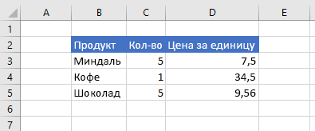
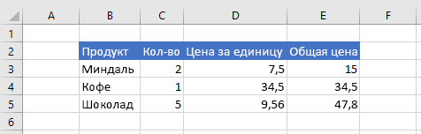

# <a name="work-with-ranges-using-the-excel-javascript-api"></a>Работа с диапазонами с использованием API JavaScript для Excel

В этой статье приведены примеры кода, в которых показано, как выполнять стандартные задачи для диапазонов с использованием API JavaScript для Excel. Полный список свойств и методов, поддерживаемых объектом **Range**, см. в статье [Объект Range (API JavaScript для Excel)](https://docs.microsoft.com/javascript/api/excel/excel.range).

> [!NOTE]
> Примеры кода, в которых показано, как выполнять более сложные задачи для диапазонов, см. в статье [Работа с диапазонами с использованием API JavaScript для Excel (дополнительные задачи)](excel-add-ins-ranges-advanced.md).

## <a name="get-a-range"></a>Получение диапазона

В примерах ниже показаны различные способы получения ссылки на диапазон, расположенный на листе.

### <a name="get-range-by-address"></a>Получение диапазона по адресу

В примере кода ниже показано, как получить диапазон с адресом **B2:B5** с листа **Sample** (Пример), загрузить его свойство **address** и записать сообщение в консоль.

```js
Excel.run(function (context) {
    var sheet = context.workbook.worksheets.getItem("Sample");
    var range = sheet.getRange("B2:C5");
    range.load("address");

    return context.sync()
        .then(function () {
            console.log(`The address of the range B2:C5 is "${range.address}"`);
        });
}).catch(errorHandlerFunction);
```

### <a name="get-range-by-name"></a>Получение диапазона по имени

В примере кода ниже показано, как получить диапазон с именем **MyRange** (Мой диапазон) с листа **Sample** (Пример), загрузить его свойство **address** и записать сообщение в консоль.

```js
Excel.run(function (context) {
    var sheet = context.workbook.worksheets.getItem("Sample");
    var range = sheet.getRange("MyRange");
    range.load("address");

    return context.sync()
        .then(function () {
            console.log(`The address of the range "MyRange" is "${range.address}"`);
        });
}).catch(errorHandlerFunction);
```

### <a name="get-used-range"></a>Получение используемого диапазона

В примере кода ниже показано, как получить используемый диапазон с листа **Sample** (Пример), загрузить его свойство **address** и записать сообщение в консоль. Используемый диапазон — это наименьший диапазон, включающий в себя все ячейки листа, которые содержат значение или форматирование. Если весь лист пуст, метод **getUsedRange()** возвращает диапазон, состоящий только из левой верхней ячейки листа.

```js
Excel.run(function (context) {
    var sheet = context.workbook.worksheets.getItem("Sample");
    var range = sheet.getUsedRange();
    range.load("address");

    return context.sync()
        .then(function () {
            console.log(`The address of the used range in the worksheet is "${range.address}"`);
        });
}).catch(errorHandlerFunction);
```

### <a name="get-entire-range"></a>Получение всего диапазона

В примере кода ниже показано, как получить весь диапазон листа **Sample** (Пример), загрузить его свойство **address** и записать сообщение в консоль.

```js
Excel.run(function (context) {
    var sheet = context.workbook.worksheets.getItem("Sample");
    var range = sheet.getRange();
    range.load("address");

    return context.sync()
        .then(function () {
            console.log(`The address of the entire worksheet range is "${range.address}"`);
        });
}).catch(errorHandlerFunction);
```

## <a name="insert-a-range-of-cells"></a>Вставка диапазона ячеек

В примере кода ниже показано, как вставить диапазон ячеек в расположение **B4:E4** и сдвинуть другие ячейки вниз, чтобы освободить место для новых ячеек.

```js
Excel.run(function (context) {
    var sheet = context.workbook.worksheets.getItem("Sample");
    var range = sheet.getRange("B4:E4");

    range.insert(Excel.InsertShiftDirection.down);
    
    return context.sync();
}).catch(errorHandlerFunction);
```

**Данные перед вставкой диапазона**


**Данные после вставки диапазона**


## <a name="clear-a-range-of-cells"></a>Очистка диапазона ячеек

В примере кода ниже показано, как удалить все содержимое и форматирование ячеек в диапазоне **E2:E5**.  

```js
Excel.run(function (context) {
    var sheet = context.workbook.worksheets.getItem("Sample");
    var range = sheet.getRange("E2:E5");

    range.clear();

    return context.sync();
}).catch(errorHandlerFunction);
```

**Данные перед очисткой диапазона**


**Данные после очистки диапазона**


## <a name="delete-a-range-of-cells"></a>Удаление диапазона ячеек

В примере кода ниже показано, как удалить ячейки в диапазоне **B4:E4** и сдвинуть другие ячейки вверх, чтобы заполнить место, освободившееся после удаления ячеек.

```js
Excel.run(function (context) {
    var sheet = context.workbook.worksheets.getItem("Sample");
    var range = sheet.getRange("B4:E4");

    range.delete(Excel.DeleteShiftDirection.up);

    return context.sync();
}).catch(errorHandlerFunction);
```

**Данные перед удалением диапазона**


**Данные после удаления диапазона**


## <a name="set-the-selected-range"></a>Задание выделенного диапазона

В примере кода ниже показано, как выделить диапазон **B2:E6** на активном листе.

```js
Excel.run(function (context) {
    var sheet = context.workbook.worksheets.getActiveWorksheet();
    var range = sheet.getRange("B2:E6");

    range.select();

    return context.sync();
}).catch(errorHandlerFunction);
```

**Выделенный диапазон B2:E6**


## <a name="get-the-selected-range"></a>Получение выделенного диапазона

В примере кода ниже показано, как получить выделенный диапазон, загрузить его свойство **address** и записать сообщение в консоль. 

```js
Excel.run(function (context) {
    var range = context.workbook.getSelectedRange();
    range.load("address");

    return context.sync()
        .then(function () {
            console.log(`The address of the selected range is "${range.address}"`);
        });
}).catch(errorHandlerFunction);
```

## <a name="set-values-or-formulas"></a>Задание значений или формул

В примерах ниже показано, как задать значения и формулы для одной ячейки или диапазона ячеек.

### <a name="set-value-for-a-single-cell"></a>Задание значения для одной ячейки

В примере кода ниже показано, как присвоить ячейке **C3** значение 5, а затем настроить ширину столбцов для наилучшего размещения данных.

```js
Excel.run(function (context) {
    var sheet = context.workbook.worksheets.getItem("Sample");

    var range = sheet.getRange("C3");
    range.values = [[ 5 ]];
    range.format.autofitColumns();

    return context.sync();
}).catch(errorHandlerFunction);
```

**Данные перед изменением значения ячейки**


**Данные после изменения значения ячейки**



### <a name="set-values-for-a-range-of-cells"></a>Задание значений для диапазона ячеек

В примере кода ниже показано, как присвоить значения ячейкам в диапазоне **B5:D5**, а затем настроить ширину столбцов для наилучшего размещения данных.

```js
Excel.run(function (context) {
    var sheet = context.workbook.worksheets.getItem("Sample");

    var data = [
        ["Potato Chips", 10, 1.80],
    ];
    
    var range = sheet.getRange("B5:D5");
    range.values = data;
    range.format.autofitColumns();

    return context.sync();
}).catch(errorHandlerFunction);
```

**Данные перед изменением значений ячеек**


**Данные после изменения значений ячеек**


### <a name="set-formula-for-a-single-cell"></a>Задание формулы для одной ячейки

В примере кода ниже показано, как задать формулу для ячейки **E3**, а затем настроить ширину столбцов для наилучшего размещения данных.

```js
Excel.run(function (context) {
    var sheet = context.workbook.worksheets.getItem("Sample");

    var range = sheet.getRange("E3");
    range.formulas = [[ "=C3 * D3" ]];
    range.format.autofitColumns();

    return context.sync();
}).catch(errorHandlerFunction);
```

**Данные перед заданием формулы для ячейки**


**Данные после задания формулы для ячейки**


### <a name="set-formulas-for-a-range-of-cells"></a>Задание формул для диапазона ячеек

В примере кода ниже показано, как задать формулы для ячеек в диапазоне **E2:E6**, а затем настроить ширину столбцов для наилучшего размещения данных.

```js
Excel.run(function (context) {
    var sheet = context.workbook.worksheets.getItem("Sample");

    var data = [
        ["=C3 * D3"],
        ["=C4 * D4"],
        ["=C5 * D5"],
        ["=SUM(E3:E5)"]
    ];
    
    var range = sheet.getRange("E3:E6");
    range.formulas = data;
    range.format.autofitColumns();

    return context.sync();
}).catch(errorHandlerFunction);
```

**Данные перед заданием формул для ячеек**


**Данные после задания формул для ячеек**


## <a name="get-values-text-or-formulas"></a>Получение значений, текста или формул

В примерах ниже показано, как получать значения, текст и формулы из диапазона ячеек.

### <a name="get-values-from-a-range-of-cells"></a>Получение значений из диапазона ячеек

В примере кода ниже показано, как получить диапазон **B2:E6**, загрузить его свойство **values** и записать значения из этого свойства в консоль. Свойство **values** диапазона указывает необработанные значения, содержащиеся в ячейках. Даже если некоторые ячейки в диапазоне содержат формулы, свойство **values** диапазона будет указывать необработанные значения для этих ячеек, а не формулы.

```js
Excel.run(function (context) {
    var sheet = context.workbook.worksheets.getItem("Sample");
    var range = sheet.getRange("B2:E6");
    range.load("values");

    return context.sync()
        .then(function () {
            console.log(JSON.stringify(range.values, null, 4));
        });
}).catch(errorHandlerFunction);
```

**Данные в диапазоне (значения в столбце E представляют собой результат вычисления формул)**


**range.values (как записано в консоль в примере кода выше)**

```json
[
    [
        "Product",
        "Qty",
        "Unit Price",
        "Total Price"
    ],
    [
        "Almonds",
        2,
        7.5,
        15
    ],
    [
        "Coffee",
        1,
        34.5,
        34.5
    ],
    [
        "Chocolate",
        5,
        9.56,
        47.8
    ],
    [
        "",
        "",
        "",
        97.3
    ]
]
```

### <a name="get-text-from-a-range-of-cells"></a>Получение текста из диапазона ячеек

В примере кода ниже показано, как получить диапазон **B2:E6**, загрузить его свойство **text** и записать текст из этого свойства в консоль.  Свойство **text** диапазона указывает отображаемые значения для ячеек в диапазоне. Даже если некоторые ячейки в диапазоне содержат формулы, свойство **text** диапазона будет указывать отображаемые значения для этих ячеек, а не формулы.

```js
Excel.run(function (context) {
    var sheet = context.workbook.worksheets.getItem("Sample");
    var range = sheet.getRange("B2:E6");
    range.load("text");

    return context.sync()
        .then(function () {
            console.log(JSON.stringify(range.text, null, 4));
        });
}).catch(errorHandlerFunction);
```

**Данные в диапазоне (значения в столбце E представляют собой результат вычисления формул)**


**range.text (как записано в консоль в примере кода выше)**

```json
[
    [
        "Product",
        "Qty",
        "Unit Price",
        "Total Price"
    ],
    [
        "Almonds",
        "2",
        "7.5",
        "15"
    ],
    [
        "Coffee",
        "1",
        "34.5",
        "34.5"
    ],
    [
        "Chocolate",
        "5",
        "9.56",
        "47.8"
    ],
    [
        "",
        "",
        "",
        "97.3"
    ]
]
```

### <a name="get-formulas-from-a-range-of-cells"></a>Получение формул из диапазона ячеек

В примере кода ниже показано, как получить диапазон **B2:E6**, загрузить его свойство **formulas** и записать содержимое этого свойства в консоль.  Свойство **formulas** диапазона указывает формулы для ячеек, содержащих формулы, и необработанные значения для ячеек, не содержащих формулы, в диапазоне.

```js
Excel.run(function (context) {
    var sheet = context.workbook.worksheets.getItem("Sample");
    var range = sheet.getRange("B2:E6");
    range.load("formulas");

    return context.sync()
        .then(function () {
            console.log(JSON.stringify(range.formulas, null, 4));
        });
}).catch(errorHandlerFunction);
```

**Данные в диапазоне (значения в столбце E представляют собой результат вычисления формул)**


**range.formulas (как записано в консоль в примере кода выше)**

```json
[
    [
        "Product",
        "Qty",
        "Unit Price",
        "Total Price"
    ],
    [
        "Almonds",
        2,
        7.5,
        "=C3 * D3"
    ],
    [
        "Coffee",
        1,
        34.5,
        "=C4 * D4"
    ],
    [
        "Chocolate",
        5,
        9.56,
        "=C5 * D5"
    ],
    [
        "",
        "",
        "",
        "=SUM(E3:E5)"
    ]
]
```

## <a name="set-range-format"></a>Задание формата диапазона

В примерах ниже показано, как задать цвет шрифта, цвет заливки и формат чисел для ячеек в диапазоне.

### <a name="set-font-color-and-fill-color"></a>Задание цвета шрифта и цвета заливки

В примере ниже показано, как задать цвет шрифта и цвет заливки для ячеек в диапазоне **B2: E2**.

```js
Excel.run(function (context) {
    var sheet = context.workbook.worksheets.getItem("Sample");

    var range = sheet.getRange("B2:E2");
    range.format.fill.color = "#4472C4";;
    range.format.font.color = "white";

    return context.sync();
}).catch(errorHandlerFunction);
```

**Данные в диапазоне перед заданием цвета шрифта и цвета заливки**


**Данные в диапазоне после задания цвета шрифта и цвета заливки**



### <a name="set-number-format"></a>Задание формата чисел

В примере ниже показано, как задать формат чисел для ячеек в диапазоне **D3:E5**.

```js
Excel.run(function (context) {
    var sheet = context.workbook.worksheets.getItem("Sample");

    var formats = [
        ["0.00", "0.00"],
        ["0.00", "0.00"],
        ["0.00", "0.00"]
    ];

    var range = sheet.getRange("D3:E5");
    range.numberFormat = formats;

    return context.sync();
}).catch(errorHandlerFunction);
```

**Данные в диапазоне перед заданием формата чисел**


**Данные в диапазоне после задания формата чисел**


### <a name="conditional-formatting-of-ranges"></a>Условное форматирование диапазонов

В диапазонах может применяться форматирование к отдельным ячейкам на основе условий. Дополнительные сведения об этом см. в статье [Применение условного форматирования к диапазонам Excel](excel-add-ins-conditional-formatting.md).

## <a name="find-a-cell-using-string-matching-preview"></a>Поиск ячейки с помощью сопоставления строк (предварительная версия)

> [!NOTE]
> Функция `find` объекта Range в настоящее время доступна только в общедоступной предварительной версии (бета-версии). Для применения этой функции необходимо использовать бета-версию библиотеки в CDN Office.js: https://appsforoffice.microsoft.com/lib/beta/hosted/office.js.
> Если вы используете TypeScript или ваш редактор кода использует файлы определения типа TypeScript для IntelliSense, воспользуйтесь https://appsforoffice.microsoft.com/lib/beta/hosted/office.d.ts.

У объекта `Range` есть метод `find` для поиска указанной строки в диапазоне. Он возвращает диапазон первой ячейки с текстом, соответствующим критериям. Приведенный ниже пример кода находит первую ячейку со значением, соответствующим строке **Food** (Еда), и заносит ее адрес в консоль. Обратите внимание, что метод `find` выдает ошибку `ItemNotFound`, если указанной строки не существует в диапазоне. Если ожидается, что указанная строка может отсутствовать в диапазоне, используйте вместо этого метод [findOrNullObject](excel-add-ins-advanced-concepts.md#42ornullobject-methods), чтобы ваш код корректно обработал этот сценарий.

```js
Excel.run(function (context) {
    var sheet = context.workbook.worksheets.getItem("Sample");
    var table = sheet.tables.getItem("ExpensesTable");
    var searchRange = table.getRange();
    var foundRange = searchRange.find("Food", {
        completeMatch: true, // find will match the whole cell value
        matchCase: false, // find will not match case
        searchDirection: Excel.SearchDirection.forward // find will start searching at the beginning of the range
    });

    foundRange.load("address");
    return context.sync()
        .then(function() {
            console.log(foundRange.address);
    });
}).catch(errorHandlerFunction);
```

Если метод `find` вызывается для диапазона, представляющего одну ячейку, поиск выполняется во всем листе. Поиск начинается в этой ячейке и продолжается в направлении, которое определяется параметром `SearchCriteria.searchDirection`, охватывающим концы листа при необходимости.

## <a name="see-also"></a>См. также

- [Работа с диапазонами с использованием API JavaScript для Excel (дополнительные задачи)](excel-add-ins-ranges-advanced.md)
- [Основные концепции программирования с помощью API JavaScript для Excel](excel-add-ins-core-concepts.md)
