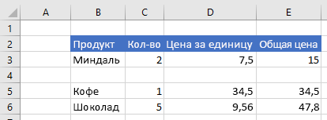
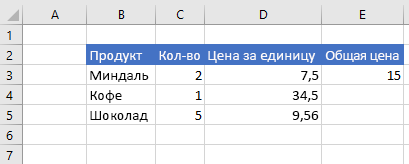

# <a name="work-with-ranges-using-the-excel-javascript-api"></a>Работа с диапазонами с использованием API JavaScript для Excel

В этой статье приведены примеры кода, в которых показано, как выполнять стандартные задачи для диапазонов с использованием API JavaScript для Excel. Полный список свойств и методов, `Range` поддерживаемых объектом, представлен в разделе [объект Range (API JavaScript для Excel)](/javascript/api/excel/excel.range).

> [!NOTE]
> Примеры кода, в которых показано, как выполнять более сложные задачи для диапазонов, см. в статье [Работа с диапазонами с использованием API JavaScript для Excel (дополнительные задачи)](excel-add-ins-ranges-advanced.md).

## <a name="get-a-range"></a>Получение диапазона

В примерах ниже показаны различные способы получения ссылки на диапазон, расположенный на листе.

### <a name="get-range-by-address"></a>Получение диапазона по адресу

В примере кода ниже показано, как получить диапазон с адресом **B2: C5** из листа с именем **Sample**, загружает его `address` свойство и записывает сообщение в консоль.

```js
Excel.run(function (context) {
    var sheet = context.workbook.worksheets.getItem("Sample");
    var range = sheet.getRange("B2:C5");
    range.load("address");

    return context.sync()
        .then(function () {
            console.log(`The address of the range B2:C5 is "${range.address}"`);
        });
}).catch(errorHandlerFunction);
```

### <a name="get-range-by-name"></a>Получение диапазона по имени

Следующий пример кода получает диапазон с именем `MyRange` **Sample**, загружает его `address` свойство и записывает сообщение в консоль.

```js
Excel.run(function (context) {
    var sheet = context.workbook.worksheets.getItem("Sample");
    var range = sheet.getRange("MyRange");
    range.load("address");

    return context.sync()
        .then(function () {
            console.log(`The address of the range "MyRange" is "${range.address}"`);
        });
}).catch(errorHandlerFunction);
```

### <a name="get-used-range"></a>Получение используемого диапазона

Следующий пример кода получает использованный диапазон из листа **Sample**, загружает его `address` свойство и записывает сообщение в консоль. Используемый диапазон — это наименьший диапазон, включающий в себя все ячейки листа, которые содержат значение или форматирование. Если лист пуст, `getUsedRange()` метод возвращает диапазон, состоящий только из верхней левой ячейки на листе.

```js
Excel.run(function (context) {
    var sheet = context.workbook.worksheets.getItem("Sample");
    var range = sheet.getUsedRange();
    range.load("address");

    return context.sync()
        .then(function () {
            console.log(`The address of the used range in the worksheet is "${range.address}"`);
        });
}).catch(errorHandlerFunction);
```

### <a name="get-entire-range"></a>Получение всего диапазона

Следующий пример кода получает весь диапазон листа на листе **Sample**, загружает его `address` свойство и записывает сообщение в консоль.

```js
Excel.run(function (context) {
    var sheet = context.workbook.worksheets.getItem("Sample");
    var range = sheet.getRange();
    range.load("address");

    return context.sync()
        .then(function () {
            console.log(`The address of the entire worksheet range is "${range.address}"`);
        });
}).catch(errorHandlerFunction);
```

## <a name="insert-a-range-of-cells"></a>Вставка диапазона ячеек

В примере кода ниже показано, как вставить диапазон ячеек в расположение **B4:E4** и сдвинуть другие ячейки вниз, чтобы освободить место для новых ячеек.

```js
Excel.run(function (context) {
    var sheet = context.workbook.worksheets.getItem("Sample");
    var range = sheet.getRange("B4:E4");

    range.insert(Excel.InsertShiftDirection.down);

    return context.sync();
}).catch(errorHandlerFunction);
```

### <a name="data-before-range-is-inserted"></a>Данные перед вставкой диапазона


### <a name="data-after-range-is-inserted"></a>Данные после вставки диапазона



## <a name="clear-a-range-of-cells"></a>Очистка диапазона ячеек

В примере кода ниже показано, как удалить все содержимое и форматирование ячеек в диапазоне **E2:E5**.  

```js
Excel.run(function (context) {
    var sheet = context.workbook.worksheets.getItem("Sample");
    var range = sheet.getRange("E2:E5");

    range.clear();

    return context.sync();
}).catch(errorHandlerFunction);
```

### <a name="data-before-range-is-cleared"></a>Данные перед очисткой диапазона


### <a name="data-after-range-is-cleared"></a>Данные после очистки диапазона


## <a name="delete-a-range-of-cells"></a>Удаление диапазона ячеек

В примере кода ниже показано, как удалить ячейки в диапазоне **B4:E4** и сдвинуть другие ячейки вверх, чтобы заполнить место, освободившееся после удаления ячеек.

```js
Excel.run(function (context) {
    var sheet = context.workbook.worksheets.getItem("Sample");
    var range = sheet.getRange("B4:E4");

    range.delete(Excel.DeleteShiftDirection.up);

    return context.sync();
}).catch(errorHandlerFunction);
```

### <a name="data-before-range-is-deleted"></a>Данные перед удалением диапазона


### <a name="data-after-range-is-deleted"></a>Данные после удаления диапазона


## <a name="set-the-selected-range"></a>Задание выделенного диапазона

В примере кода ниже показано, как выделить диапазон **B2:E6** на активном листе.

```js
Excel.run(function (context) {
    var sheet = context.workbook.worksheets.getActiveWorksheet();
    var range = sheet.getRange("B2:E6");

    range.select();

    return context.sync();
}).catch(errorHandlerFunction);
```

### <a name="selected-range-b2e6"></a>Выделенный диапазон B2:E6


## <a name="get-the-selected-range"></a>Получение выделенного диапазона

Следующий пример кода получает выбранный диапазон, загружает его `address` свойство и записывает сообщение в консоль.

```js
Excel.run(function (context) {
    var range = context.workbook.getSelectedRange();
    range.load("address");

    return context.sync()
        .then(function () {
            console.log(`The address of the selected range is "${range.address}"`);
        });
}).catch(errorHandlerFunction);
```

## <a name="set-values-or-formulas"></a>Задание значений или формул

В примерах ниже показано, как задать значения и формулы для одной ячейки или диапазона ячеек.

### <a name="set-value-for-a-single-cell"></a>Задание значения для одной ячейки

В примере кода ниже показано, как присвоить ячейке **C3** значение 5, а затем настроить ширину столбцов для наилучшего размещения данных.

```js
Excel.run(function (context) {
    var sheet = context.workbook.worksheets.getItem("Sample");

    var range = sheet.getRange("C3");
    range.values = [[ 5 ]];
    range.format.autofitColumns();

    return context.sync();
}).catch(errorHandlerFunction);
```

#### <a name="data-before-cell-value-is-updated"></a>Данные перед изменением значения ячейки


#### <a name="data-after-cell-value-is-updated"></a>Данные после изменения значения ячейки


### <a name="set-values-for-a-range-of-cells"></a>Задание значений для диапазона ячеек

В примере кода ниже показано, как присвоить значения ячейкам в диапазоне **B5:D5**, а затем настроить ширину столбцов для наилучшего размещения данных.

```js
Excel.run(function (context) {
    var sheet = context.workbook.worksheets.getItem("Sample");

    var data = [
        ["Potato Chips", 10, 1.80],
    ];

    var range = sheet.getRange("B5:D5");
    range.values = data;
    range.format.autofitColumns();

    return context.sync();
}).catch(errorHandlerFunction);
```

#### <a name="data-before-cell-values-are-updated"></a>Данные перед изменением значений ячеек


#### <a name="data-after-cell-values-are-updated"></a>Данные после изменения значений ячеек


### <a name="set-formula-for-a-single-cell"></a>Задание формулы для одной ячейки

В примере кода ниже показано, как задать формулу для ячейки **E3**, а затем настроить ширину столбцов для наилучшего размещения данных.

```js
Excel.run(function (context) {
    var sheet = context.workbook.worksheets.getItem("Sample");

    var range = sheet.getRange("E3");
    range.formulas = [[ "=C3 * D3" ]];
    range.format.autofitColumns();

    return context.sync();
}).catch(errorHandlerFunction);
```

#### <a name="data-before-cell-formula-is-set"></a>Данные перед заданием формулы для ячейки


#### <a name="data-after-cell-formula-is-set"></a>Данные после задания формулы для ячейки



### <a name="set-formulas-for-a-range-of-cells"></a>Задание формул для диапазона ячеек

В примере кода ниже показано, как задать формулы для ячеек в диапазоне **E2:E6**, а затем настроить ширину столбцов для наилучшего размещения данных.

```js
Excel.run(function (context) {
    var sheet = context.workbook.worksheets.getItem("Sample");

    var data = [
        ["=C3 * D3"],
        ["=C4 * D4"],
        ["=C5 * D5"],
        ["=SUM(E3:E5)"]
    ];

    var range = sheet.getRange("E3:E6");
    range.formulas = data;
    range.format.autofitColumns();

    return context.sync();
}).catch(errorHandlerFunction);
```

#### <a name="data-before-cell-formulas-are-set"></a>Данные перед заданием формул для ячеек


#### <a name="data-after-cell-formulas-are-set"></a>Данные после задания формул для ячеек


## <a name="get-values-text-or-formulas"></a>Получение значений, текста или формул

В примерах ниже показано, как получать значения, текст и формулы из диапазона ячеек.

### <a name="get-values-from-a-range-of-cells"></a>Получение значений из диапазона ячеек

Следующий пример кода получает диапазон **B2: E6**, загружает его `values` свойство и записывает значения в консоль. `values`Свойство диапазона указывает необработанные значения, содержащиеся в ячейках. Даже если некоторые ячейки в диапазоне содержат формулы, `values` свойство диапазона указывает необработанные значения для этих ячеек, а не формулы.

```js
Excel.run(function (context) {
    var sheet = context.workbook.worksheets.getItem("Sample");
    var range = sheet.getRange("B2:E6");
    range.load("values");

    return context.sync()
        .then(function () {
            console.log(JSON.stringify(range.values, null, 4));
        });
}).catch(errorHandlerFunction);
```

#### <a name="data-in-range-values-in-column-e-are-a-result-of-formulas"></a>Данные в диапазоне (значения в столбце E представляют собой результат вычисления формул)


#### <a name="rangevalues-as-logged-to-the-console-by-the-code-sample-above"></a>range.values (как записано в консоль в примере кода выше)

```json
[
    [
        "Product",
        "Qty",
        "Unit Price",
        "Total Price"
    ],
    [
        "Almonds",
        2,
        7.5,
        15
    ],
    [
        "Coffee",
        1,
        34.5,
        34.5
    ],
    [
        "Chocolate",
        5,
        9.56,
        47.8
    ],
    [
        "",
        "",
        "",
        97.3
    ]
]
```

### <a name="get-text-from-a-range-of-cells"></a>Получение текста из диапазона ячеек

Следующий пример кода получает диапазон **B2: E6**, загружает его `text` свойство и записывает его в консоль. `text`Свойство диапазона определяет отображаемые значения для ячеек в диапазоне. Даже если некоторые ячейки в диапазоне содержат формулы, `text` свойство диапазона определяет отображаемые значения для этих ячеек, а не формулы.

```js
Excel.run(function (context) {
    var sheet = context.workbook.worksheets.getItem("Sample");
    var range = sheet.getRange("B2:E6");
    range.load("text");

    return context.sync()
        .then(function () {
            console.log(JSON.stringify(range.text, null, 4));
        });
}).catch(errorHandlerFunction);
```

#### <a name="data-in-range-values-in-column-e-are-a-result-of-formulas"></a>Данные в диапазоне (значения в столбце E представляют собой результат вычисления формул)


#### <a name="rangetext-as-logged-to-the-console-by-the-code-sample-above"></a>range.text (как записано в консоль в примере кода выше)

```json
[
    [
        "Product",
        "Qty",
        "Unit Price",
        "Total Price"
    ],
    [
        "Almonds",
        "2",
        "7.5",
        "15"
    ],
    [
        "Coffee",
        "1",
        "34.5",
        "34.5"
    ],
    [
        "Chocolate",
        "5",
        "9.56",
        "47.8"
    ],
    [
        "",
        "",
        "",
        "97.3"
    ]
]
```

### <a name="get-formulas-from-a-range-of-cells"></a>Получение формул из диапазона ячеек

Следующий пример кода получает диапазон **B2: E6**, загружает его `formulas` свойство и записывает его в консоль. `formulas`Свойство диапазона определяет формулы для ячеек в диапазоне, содержащих формулы, и необработанные значения для ячеек в диапазоне, которые не содержат формул.

```js
Excel.run(function (context) {
    var sheet = context.workbook.worksheets.getItem("Sample");
    var range = sheet.getRange("B2:E6");
    range.load("formulas");

    return context.sync()
        .then(function () {
            console.log(JSON.stringify(range.formulas, null, 4));
        });
}).catch(errorHandlerFunction);
```

#### <a name="data-in-range-values-in-column-e-are-a-result-of-formulas"></a>Данные в диапазоне (значения в столбце E представляют собой результат вычисления формул)


#### <a name="rangeformulas-as-logged-to-the-console-by-the-code-sample-above"></a>range.formulas (как записано в консоль в примере кода выше)

```json
[
    [
        "Product",
        "Qty",
        "Unit Price",
        "Total Price"
    ],
    [
        "Almonds",
        2,
        7.5,
        "=C3 * D3"
    ],
    [
        "Coffee",
        1,
        34.5,
        "=C4 * D4"
    ],
    [
        "Chocolate",
        5,
        9.56,
        "=C5 * D5"
    ],
    [
        "",
        "",
        "",
        "=SUM(E3:E5)"
    ]
]
```

## <a name="set-range-format"></a>Задание формата диапазона

В примерах ниже показано, как задать цвет шрифта, цвет заливки и формат чисел для ячеек в диапазоне.

### <a name="set-font-color-and-fill-color"></a>Задание цвета шрифта и цвета заливки

В примере ниже показано, как задать цвет шрифта и цвет заливки для ячеек в диапазоне **B2: E2**.

```js
Excel.run(function (context) {
    var sheet = context.workbook.worksheets.getItem("Sample");

    var range = sheet.getRange("B2:E2");
    range.format.fill.color = "#4472C4";
    range.format.font.color = "white";

    return context.sync();
}).catch(errorHandlerFunction);
```

#### <a name="data-in-range-before-font-color-and-fill-color-are-set"></a>Данные в диапазоне перед заданием цвета шрифта и цвета заливки


#### <a name="data-in-range-after-font-color-and-fill-color-are-set"></a>Данные в диапазоне после задания цвета шрифта и цвета заливки


### <a name="set-number-format"></a>Задание формата чисел

В примере ниже показано, как задать формат чисел для ячеек в диапазоне **D3:E5**.

```js
Excel.run(function (context) {
    var sheet = context.workbook.worksheets.getItem("Sample");

    var formats = [
        ["0.00", "0.00"],
        ["0.00", "0.00"],
        ["0.00", "0.00"]
    ];

    var range = sheet.getRange("D3:E5");
    range.numberFormat = formats;

    return context.sync();
}).catch(errorHandlerFunction);
```

#### <a name="data-in-range-before-number-format-is-set"></a>Данные в диапазоне перед заданием формата чисел


#### <a name="data-in-range-after-number-format-is-set"></a>Данные в диапазоне после задания формата чисел


## <a name="read-or-write-to-an-unbounded-range"></a>Чтение из неограниченного диапазона и запись в него

### <a name="read-an-unbounded-range"></a>Чтение из неограниченного диапазона

Неограниченный адрес диапазона — это адрес диапазона, в котором задаются либо все столбцы, либо все строки. Например:

- Диапазоны адресов состоят из целых столбцов:<ul><li>`C:C`</li><li>`A:F`</li></ul>
- Диапазоны адресов состоят из целых строк:<ul><li>`2:2`</li><li>`1:4`</li></ul>

Когда API отправляет запрос на получение неограниченного диапазона (например, `getRange('C:C')`), ответ будет содержать значения `null` для свойств уровня ячейки, например свойств `values`, `text`, `numberFormat` и `formula`. Другие свойства диапазона, например `address` и `cellCount`, будут содержать допустимые значения для неограниченного диапазона.

### <a name="write-to-an-unbounded-range"></a>Запись в неограниченный диапазон

Невозможно задать свойства уровня ячейки `values` , например, `numberFormat` и `formula` для неограниченного диапазона, так как входной запрос слишком велик. Например, приведенный ниже фрагмент кода недопустим, так как он пытается указать свойство `values` для неограниченного диапазона. API возвращает ошибку при попытке установить свойства на уровне ячейки для неограниченного диапазона.

```js
var range = context.workbook.worksheets.getActiveWorksheet().getRange('A:B');
range.values = 'Due Date';
```

## <a name="read-or-write-to-a-large-range"></a>Чтение из большого диапазона и запись в него

Если диапазон содержит большое количество ячеек, значений, форматов чисел или формул, то, возможно, не удастся выполнить операции API над этим диапазоном. API всегда делает все возможное, чтобы выполнить запрошенную операцию над диапазоном (то есть получить или записать указанные данные), но попытка выполнить операцию чтения или записи для большого диапазона может привести к ошибке API из-за чрезмерного потребления ресурсов. Чтобы избежать таких ошибок, мы рекомендуем выполнять отдельные операции чтения или записи для небольших подмножеств большого диапазона, а не пытаться выполнить одну операцию чтения или записи для большого диапазона.

Подробнее об ограничениях системы можно узнать в разделе "надстройки Excel" [ограничений ресурсов и оптимизации производительности для надстроек Office](../concepts/resource-limits-and-performance-optimization.md#excel-add-ins).

### <a name="conditional-formatting-of-ranges"></a>Условное форматирование диапазонов

В диапазонах может применяться форматирование к отдельным ячейкам на основе условий. Дополнительные сведения об этом см. в статье [Применение условного форматирования к диапазонам Excel](excel-add-ins-conditional-formatting.md).

## <a name="find-a-cell-using-string-matching"></a>Поиск ячейки с помощью сопоставления строк

У объекта `Range` есть метод `find` для поиска указанной строки в диапазоне. Он возвращает диапазон первой ячейки с текстом, соответствующим критериям. Приведенный ниже пример кода находит первую ячейку со значением, соответствующим строке **Food** (Еда), и заносит ее адрес в консоль. Обратите внимание, что метод `find` выдает ошибку `ItemNotFound`, если указанной строки не существует в диапазоне. Если ожидается, что указанная строка может отсутствовать в диапазоне, используйте вместо этого метод [findOrNullObject](../develop/application-specific-api-model.md#ornullobject-methods-and-properties), чтобы ваш код корректно обработал этот сценарий.

```js
Excel.run(function (context) {
    var sheet = context.workbook.worksheets.getItem("Sample");
    var table = sheet.tables.getItem("ExpensesTable");
    var searchRange = table.getRange();
    var foundRange = searchRange.find("Food", {
        completeMatch: true, // find will match the whole cell value
        matchCase: false, // find will not match case
        searchDirection: Excel.SearchDirection.forward // find will start searching at the beginning of the range
    });

    foundRange.load("address");
    return context.sync()
        .then(function() {
            console.log(foundRange.address);
    });
}).catch(errorHandlerFunction);
```

Если метод `find` вызывается для диапазона, представляющего одну ячейку, поиск выполняется во всем листе. Поиск начинается в этой ячейке и продолжается в направлении, которое определяется параметром `SearchCriteria.searchDirection`, охватывающим концы листа при необходимости.

## <a name="see-also"></a>См. также

- [Работа с диапазонами с использованием API JavaScript для Excel (дополнительные задачи)](excel-add-ins-ranges-advanced.md)
- [Основные концепции программирования с помощью API JavaScript для Excel](excel-add-ins-core-concepts.md)
