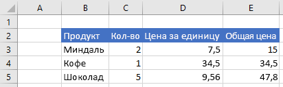
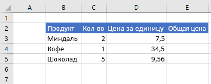

# <a name="work-with-ranges-using-the-excel-javascript-api"></a><span data-ttu-id="69613-102">Работа с диапазонами с использованием API JavaScript для Excel</span><span class="sxs-lookup"><span data-stu-id="69613-102">Work with ranges using the Excel JavaScript API</span></span>

<span data-ttu-id="69613-103">В этой статье приведены примеры кода, в которых показано, как выполнять стандартные задачи для диапазонов с использованием API JavaScript для Excel.</span><span class="sxs-lookup"><span data-stu-id="69613-103">This article provides code samples that show how to perform common tasks with ranges using the Excel JavaScript API.</span></span> <span data-ttu-id="69613-104">Полный список свойств и методов, поддерживаемых объектом **Range**, см. в статье [Объект Range (API JavaScript для Excel)](https://docs.microsoft.com/javascript/api/excel/excel.range).</span><span class="sxs-lookup"><span data-stu-id="69613-104">For the complete list of properties and methods that the **Range** object supports, see [Range Object (JavaScript API for Excel)](https://docs.microsoft.com/javascript/api/excel/excel.range).</span></span>

## <a name="get-a-range"></a><span data-ttu-id="69613-105">Получение диапазона</span><span class="sxs-lookup"><span data-stu-id="69613-105">Get a range</span></span>

<span data-ttu-id="69613-106">В примерах ниже показаны различные способы получения ссылки на диапазон, расположенный на листе.</span><span class="sxs-lookup"><span data-stu-id="69613-106">The following examples show different ways to get a reference to a range within a worksheet.</span></span>

### <a name="get-range-by-address"></a><span data-ttu-id="69613-107">Получение диапазона по адресу</span><span class="sxs-lookup"><span data-stu-id="69613-107">Get range by address</span></span>

<span data-ttu-id="69613-108">В примере кода ниже показано, как получить диапазон с адресом **B2:B5** с листа **Sample** (Пример), загрузить его свойство **address** и записать сообщение в консоль.</span><span class="sxs-lookup"><span data-stu-id="69613-108">The following code sample gets the range with address **B2:B5** from the worksheet named **Sample**, loads its **address** property, and writes a message to the console.</span></span>

```js
Excel.run(function (context) {
    var sheet = context.workbook.worksheets.getItem("Sample");
    var range = sheet.getRange("B2:C5");
    range.load("address");

    return context.sync()
        .then(function () {
            console.log(`The address of the range B2:C5 is "${range.address}"`);
        });
}).catch(errorHandlerFunction);
```

### <a name="get-range-by-name"></a><span data-ttu-id="69613-109">Получение диапазона по имени</span><span class="sxs-lookup"><span data-stu-id="69613-109">Get range by name</span></span>

<span data-ttu-id="69613-110">В примере кода ниже показано, как получить диапазон с именем **MyRange** (Мой диапазон) с листа **Sample** (Пример), загрузить его свойство **address** и записать сообщение в консоль.</span><span class="sxs-lookup"><span data-stu-id="69613-110">The following code sample gets the range named **MyRange** from the worksheet named **Sample**, loads its **address** property, and writes a message to the console.</span></span>

```js
Excel.run(function (context) {
    var sheet = context.workbook.worksheets.getItem("Sample");
    var range = sheet.getRange("MyRange");
    range.load("address");

    return context.sync()
        .then(function () {
            console.log(`The address of the range "MyRange" is "${range.address}"`);
        });
}).catch(errorHandlerFunction);
```

### <a name="get-used-range"></a><span data-ttu-id="69613-111">Получение используемого диапазона</span><span class="sxs-lookup"><span data-stu-id="69613-111">Get used range</span></span>

<span data-ttu-id="69613-112">В примере кода ниже показано, как получить используемый диапазон с листа **Sample** (Пример), загрузить его свойство **address** и записать сообщение в консоль.</span><span class="sxs-lookup"><span data-stu-id="69613-112">The following code sample gets the used range from the worksheet named **Sample**, loads its **address** property, and writes a message to the console.</span></span> <span data-ttu-id="69613-113">Используемый диапазон — это наименьший диапазон, включающий в себя все ячейки листа, которые содержат значение или форматирование.</span><span class="sxs-lookup"><span data-stu-id="69613-113">The used range is the smallest range that encompasses any cells in the worksheet that have a value or formatting assigned to them.</span></span> <span data-ttu-id="69613-114">Если весь лист пуст, метод **getUsedRange()** возвращает диапазон, состоящий только из левой верхней ячейки листа.</span><span class="sxs-lookup"><span data-stu-id="69613-114">If the entire worksheet is blank, the **getUsedRange()** method returns a range that consists of only the top-left cell in the worksheet.</span></span>

```js
Excel.run(function (context) {
    var sheet = context.workbook.worksheets.getItem("Sample");
    var range = sheet.getUsedRange();
    range.load("address");

    return context.sync()
        .then(function () {
            console.log(`The address of the used range in the worksheet is "${range.address}"`);
        });
}).catch(errorHandlerFunction);
```

### <a name="get-entire-range"></a><span data-ttu-id="69613-115">Получение всего диапазона</span><span class="sxs-lookup"><span data-stu-id="69613-115">Get entire range</span></span>

<span data-ttu-id="69613-116">В примере кода ниже показано, как получить весь диапазон листа **Sample** (Пример), загрузить его свойство **address** и записать сообщение в консоль.</span><span class="sxs-lookup"><span data-stu-id="69613-116">The following code sample gets the entire worksheet range from the worksheet named **Sample**, loads its **address** property, and writes a message to the console.</span></span>

```js
Excel.run(function (context) {
    var sheet = context.workbook.worksheets.getItem("Sample");
    var range = sheet.getRange();
    range.load("address");

    return context.sync()
        .then(function () {
            console.log(`The address of the entire worksheet range is "${range.address}"`);
        });
}).catch(errorHandlerFunction);
```

## <a name="insert-a-range-of-cells"></a><span data-ttu-id="69613-117">Вставка диапазона ячеек</span><span class="sxs-lookup"><span data-stu-id="69613-117">Insert a range of cells</span></span>

<span data-ttu-id="69613-118">В примере кода ниже показано, как вставить диапазон ячеек в расположение **B4:E4** и сдвинуть другие ячейки вниз, чтобы освободить место для новых ячеек.</span><span class="sxs-lookup"><span data-stu-id="69613-118">The following code sample inserts a range of cells in location **B4:E4** and shifts other cells down to provide space for the new cells.</span></span>

```js
Excel.run(function (context) {
    var sheet = context.workbook.worksheets.getItem("Sample");
    var range = sheet.getRange("B4:E4");

    range.insert(Excel.InsertShiftDirection.down);
    
    return context.sync();
}).catch(errorHandlerFunction);
```

<span data-ttu-id="69613-119">**Данные перед вставкой диапазона**</span><span class="sxs-lookup"><span data-stu-id="69613-119">**Data before range is inserted**</span></span>



<span data-ttu-id="69613-121">**Данные после вставки диапазона**</span><span class="sxs-lookup"><span data-stu-id="69613-121">**Data after range is inserted**</span></span>


## <a name="clear-a-range-of-cells"></a><span data-ttu-id="69613-123">Очистка диапазона ячеек</span><span class="sxs-lookup"><span data-stu-id="69613-123">Clear a range of cells</span></span>

<span data-ttu-id="69613-124">В примере кода ниже показано, как удалить все содержимое и форматирование ячеек в диапазоне **E2:E5**.</span><span class="sxs-lookup"><span data-stu-id="69613-124">The following code sample clears all contents and formatting of cells in the range **E2:E5**.</span></span>  

```js
Excel.run(function (context) {
    var sheet = context.workbook.worksheets.getItem("Sample");
    var range = sheet.getRange("E2:E5");

    range.clear();

    return context.sync();
}).catch(errorHandlerFunction);
```

<span data-ttu-id="69613-125">**Данные перед очисткой диапазона**</span><span class="sxs-lookup"><span data-stu-id="69613-125">**Data before range is cleared**</span></span>


<span data-ttu-id="69613-127">**Данные после очистки диапазона**</span><span class="sxs-lookup"><span data-stu-id="69613-127">**Data after range is cleared**</span></span>


## <a name="delete-a-range-of-cells"></a><span data-ttu-id="69613-129">Удаление диапазона ячеек</span><span class="sxs-lookup"><span data-stu-id="69613-129">Delete a range of cells</span></span>

<span data-ttu-id="69613-130">В примере кода ниже показано, как удалить ячейки в диапазоне **B4:E4** и сдвинуть другие ячейки вверх, чтобы заполнить место, освободившееся после удаления ячеек.</span><span class="sxs-lookup"><span data-stu-id="69613-130">The following code sample deletes the cells in the range **B4:E4** and shift other cells up to fill the space that was vacated by the deleted cells.</span></span>

```js
Excel.run(function (context) {
    var sheet = context.workbook.worksheets.getItem("Sample");
    var range = sheet.getRange("B4:E4");

    range.delete(Excel.DeleteShiftDirection.up);

    return context.sync();
}).catch(errorHandlerFunction);
```

<span data-ttu-id="69613-131">**Данные перед удалением диапазона**</span><span class="sxs-lookup"><span data-stu-id="69613-131">**Data before range is deleted**</span></span>


<span data-ttu-id="69613-133">**Данные после удаления диапазона**</span><span class="sxs-lookup"><span data-stu-id="69613-133">**Data after range is deleted**</span></span>


## <a name="set-the-selected-range"></a><span data-ttu-id="69613-135">Задание выделенного диапазона</span><span class="sxs-lookup"><span data-stu-id="69613-135">Set the selected range</span></span>

<span data-ttu-id="69613-136">В примере кода ниже показано, как выделить диапазон **B2:E6** на активном листе.</span><span class="sxs-lookup"><span data-stu-id="69613-136">The following code sample selects the range **B2:E6** in the active worksheet.</span></span>

```js
Excel.run(function (context) {
    var sheet = context.workbook.worksheets.getActiveWorksheet();
    var range = sheet.getRange("B2:E6");

    range.select();

    return context.sync();
}).catch(errorHandlerFunction);
```

<span data-ttu-id="69613-137">**Выделенный диапазон B2:E6**</span><span class="sxs-lookup"><span data-stu-id="69613-137">**Selected range B2:E6**</span></span>


## <a name="get-the-selected-range"></a><span data-ttu-id="69613-139">Получение выделенного диапазона</span><span class="sxs-lookup"><span data-stu-id="69613-139">Get the selected range</span></span>

<span data-ttu-id="69613-140">В примере кода ниже показано, как получить выделенный диапазон, загрузить его свойство **address** и записать сообщение в консоль.</span><span class="sxs-lookup"><span data-stu-id="69613-140">The following code sample gets the selected range, loads its **address** property, and writes a message to the console.</span></span> 

```js
Excel.run(function (context) {
    var range = context.workbook.getSelectedRange();
    range.load("address");

    return context.sync()
        .then(function () {
            console.log(`The address of the selected range is "${range.address}"`);
        });
}).catch(errorHandlerFunction);
```

## <a name="set-values-or-formulas"></a><span data-ttu-id="69613-141">Задание значений или формул</span><span class="sxs-lookup"><span data-stu-id="69613-141">Set values or formulas</span></span>

<span data-ttu-id="69613-142">В примерах ниже показано, как задать значения и формулы для одной ячейки или диапазона ячеек.</span><span class="sxs-lookup"><span data-stu-id="69613-142">The following examples show how to set values and formulas for a single cell or a range of cells.</span></span>

### <a name="set-value-for-a-single-cell"></a><span data-ttu-id="69613-143">Задание значения для одной ячейки</span><span class="sxs-lookup"><span data-stu-id="69613-143">Set value for a single cell</span></span>

<span data-ttu-id="69613-144">В примере кода ниже показано, как присвоить ячейке **C3** значение 5, а затем настроить ширину столбцов для наилучшего размещения данных.</span><span class="sxs-lookup"><span data-stu-id="69613-144">The following code sample sets the value of cell **C3** to "5" and then sets the width of the columns to best fit the data.</span></span>

```js
Excel.run(function (context) {
    var sheet = context.workbook.worksheets.getItem("Sample");

    var range = sheet.getRange("C3");
    range.values = [[ 5 ]];
    range.format.autofitColumns();

    return context.sync();
}).catch(errorHandlerFunction);
```

<span data-ttu-id="69613-145">**Данные перед изменением значения ячейки**</span><span class="sxs-lookup"><span data-stu-id="69613-145">**Data before cell value is updated**</span></span>


<span data-ttu-id="69613-147">**Данные после изменения значения ячейки**</span><span class="sxs-lookup"><span data-stu-id="69613-147">**Data after cell value is updated**</span></span>


### <a name="set-values-for-a-range-of-cells"></a><span data-ttu-id="69613-149">Задание значений для диапазона ячеек</span><span class="sxs-lookup"><span data-stu-id="69613-149">Set values for a range of cells</span></span>

<span data-ttu-id="69613-150">В примере кода ниже показано, как присвоить значения ячейкам в диапазоне **B5:D5**, а затем настроить ширину столбцов для наилучшего размещения данных.</span><span class="sxs-lookup"><span data-stu-id="69613-150">The following code sample sets values for the cells in the range **B5:D5** and then sets the width of the columns to best fit the data.</span></span>

```js
Excel.run(function (context) {
    var sheet = context.workbook.worksheets.getItem("Sample");

    var data = [
        ["Potato Chips", 10, 1.80],
    ];
    
    var range = sheet.getRange("B5:D5");
    range.values = data;
    range.format.autofitColumns();

    return context.sync();
}).catch(errorHandlerFunction);
```

<span data-ttu-id="69613-151">**Данные перед изменением значений ячеек**</span><span class="sxs-lookup"><span data-stu-id="69613-151">**Data before cell values are updated**</span></span>


<span data-ttu-id="69613-153">**Данные после изменения значений ячеек**</span><span class="sxs-lookup"><span data-stu-id="69613-153">**Data after cell values are updated**</span></span>


### <a name="set-formula-for-a-single-cell"></a><span data-ttu-id="69613-155">Задание формулы для одной ячейки</span><span class="sxs-lookup"><span data-stu-id="69613-155">Set formula for a single cell</span></span>

<span data-ttu-id="69613-156">В примере кода ниже показано, как задать формулу для ячейки **E3**, а затем настроить ширину столбцов для наилучшего размещения данных.</span><span class="sxs-lookup"><span data-stu-id="69613-156">The following code sample sets a formula for cell **E3** and then sets the width of the columns to best fit the data.</span></span>

```js
Excel.run(function (context) {
    var sheet = context.workbook.worksheets.getItem("Sample");

    var range = sheet.getRange("E3");
    range.formulas = [[ "=C3 * D3" ]];
    range.format.autofitColumns();

    return context.sync();
}).catch(errorHandlerFunction);
```

<span data-ttu-id="69613-157">**Данные перед заданием формулы для ячейки**</span><span class="sxs-lookup"><span data-stu-id="69613-157">**Data before cell formula is set**</span></span>



<span data-ttu-id="69613-159">**Данные после задания формулы для ячейки**</span><span class="sxs-lookup"><span data-stu-id="69613-159">**Data after cell formula is set**</span></span>


### <a name="set-formulas-for-a-range-of-cells"></a><span data-ttu-id="69613-161">Задание формул для диапазона ячеек</span><span class="sxs-lookup"><span data-stu-id="69613-161">Set formulas for a range of cells</span></span>

<span data-ttu-id="69613-162">В примере кода ниже показано, как задать формулы для ячеек в диапазоне **E2:E6**, а затем настроить ширину столбцов для наилучшего размещения данных.</span><span class="sxs-lookup"><span data-stu-id="69613-162">The following code sample sets formulas for cells in the range **E2:E6** and then sets the width of the columns to best fit the data.</span></span>

```js
Excel.run(function (context) {
    var sheet = context.workbook.worksheets.getItem("Sample");

    var data = [
        ["=C3 * D3"],
        ["=C4 * D4"],
        ["=C5 * D5"],
        ["=SUM(E3:E5)"]
    ];
    
    var range = sheet.getRange("E3:E6");
    range.formulas = data;
    range.format.autofitColumns();

    return context.sync();
}).catch(errorHandlerFunction);
```

<span data-ttu-id="69613-163">**Данные перед заданием формул для ячеек**</span><span class="sxs-lookup"><span data-stu-id="69613-163">**Data before cell formulas are set**</span></span>


<span data-ttu-id="69613-165">**Данные после задания формул для ячеек**</span><span class="sxs-lookup"><span data-stu-id="69613-165">**Data after cell formulas are set**</span></span>


## <a name="get-values-text-or-formulas"></a><span data-ttu-id="69613-167">Получение значений, текста или формул</span><span class="sxs-lookup"><span data-stu-id="69613-167">Get values, text, or formulas</span></span>

<span data-ttu-id="69613-168">В примерах ниже показано, как получать значения, текст и формулы из диапазона ячеек.</span><span class="sxs-lookup"><span data-stu-id="69613-168">These examples show how to get values, text, and formulas from a range of cells.</span></span>

### <a name="get-values-from-a-range-of-cells"></a><span data-ttu-id="69613-169">Получение значений из диапазона ячеек</span><span class="sxs-lookup"><span data-stu-id="69613-169">Get values from a range of cells</span></span>

<span data-ttu-id="69613-170">В примере кода ниже показано, как получить диапазон **B2:E6**, загрузить его свойство **values** и записать значения из этого свойства в консоль.</span><span class="sxs-lookup"><span data-stu-id="69613-170">The following code sample gets the range **B2:E6**, loads its **values** property, and writes the values to the console.</span></span> <span data-ttu-id="69613-171">Свойство **values** диапазона указывает необработанные значения, содержащиеся в ячейках.</span><span class="sxs-lookup"><span data-stu-id="69613-171">The **values** property of a range specifies the raw values that the cells contain.</span></span> <span data-ttu-id="69613-172">Даже если некоторые ячейки в диапазоне содержат формулы, свойство **values** диапазона будет указывать необработанные значения для этих ячеек, а не формулы.</span><span class="sxs-lookup"><span data-stu-id="69613-172">Even if some cells in a range contain formulas, the **values** property of the range specifies the raw values for those cells, not any of the formulas.</span></span>

```js
Excel.run(function (context) {
    var sheet = context.workbook.worksheets.getItem("Sample");
    var range = sheet.getRange("B2:E6");
    range.load("values");

    return context.sync()
        .then(function () {
            console.log(JSON.stringify(range.values, null, 4));
        });
}).catch(errorHandlerFunction);
```

<span data-ttu-id="69613-173">**Данные в диапазоне (значения в столбце E представляют собой результат вычисления формул)**</span><span class="sxs-lookup"><span data-stu-id="69613-173">**Data in range (values in column E are a result of formulas)**</span></span>


<span data-ttu-id="69613-175">**range.values (как записано в консоль в примере кода выше)**</span><span class="sxs-lookup"><span data-stu-id="69613-175">**range.values (as logged to the console by the code sample above)**</span></span>

```json
[
    [
        "Product",
        "Qty",
        "Unit Price",
        "Total Price"
    ],
    [
        "Almonds",
        2,
        7.5,
        15
    ],
    [
        "Coffee",
        1,
        34.5,
        34.5
    ],
    [
        "Chocolate",
        5,
        9.56,
        47.8
    ],
    [
        "",
        "",
        "",
        97.3
    ]
]
```

### <a name="get-text-from-a-range-of-cells"></a><span data-ttu-id="69613-176">Получение текста из диапазона ячеек</span><span class="sxs-lookup"><span data-stu-id="69613-176">Get text from a range of cells</span></span>

<span data-ttu-id="69613-177">В примере кода ниже показано, как получить диапазон **B2:E6**, загрузить его свойство **text** и записать текст из этого свойства в консоль.</span><span class="sxs-lookup"><span data-stu-id="69613-177">The following code sample gets the range **B2:E6**, loads its **text** property, and writes it to the console.</span></span>  <span data-ttu-id="69613-178">Свойство **text** диапазона указывает отображаемые значения для ячеек в диапазоне.</span><span class="sxs-lookup"><span data-stu-id="69613-178">The **text** property of a range specifies the display values for cells in the range.</span></span> <span data-ttu-id="69613-179">Даже если некоторые ячейки в диапазоне содержат формулы, свойство **text** диапазона будет указывать отображаемые значения для этих ячеек, а не формулы.</span><span class="sxs-lookup"><span data-stu-id="69613-179">Even if some cells in a range contain formulas, the **text** property of the range specifies the display values for those cells, not any of the formulas.</span></span>

```js
Excel.run(function (context) {
    var sheet = context.workbook.worksheets.getItem("Sample");
    var range = sheet.getRange("B2:E6");
    range.load("text");

    return context.sync()
        .then(function () {
            console.log(JSON.stringify(range.text, null, 4));
        });
}).catch(errorHandlerFunction);
```

<span data-ttu-id="69613-180">**Данные в диапазоне (значения в столбце E представляют собой результат вычисления формул)**</span><span class="sxs-lookup"><span data-stu-id="69613-180">**Data in range (values in column E are a result of formulas)**</span></span>


<span data-ttu-id="69613-182">**range.text (как записано в консоль в примере кода выше)**</span><span class="sxs-lookup"><span data-stu-id="69613-182">**range.text (as logged to the console by the code sample above)**</span></span>

```json
[
    [
        "Product",
        "Qty",
        "Unit Price",
        "Total Price"
    ],
    [
        "Almonds",
        "2",
        "7.5",
        "15"
    ],
    [
        "Coffee",
        "1",
        "34.5",
        "34.5"
    ],
    [
        "Chocolate",
        "5",
        "9.56",
        "47.8"
    ],
    [
        "",
        "",
        "",
        "97.3"
    ]
]
```

### <a name="get-formulas-from-a-range-of-cells"></a><span data-ttu-id="69613-183">Получение формул из диапазона ячеек</span><span class="sxs-lookup"><span data-stu-id="69613-183">Get formulas from a range of cells</span></span>

<span data-ttu-id="69613-184">В примере кода ниже показано, как получить диапазон **B2:E6**, загрузить его свойство **formulas** и записать содержимое этого свойства в консоль.</span><span class="sxs-lookup"><span data-stu-id="69613-184">The following code sample gets the range **B2:E6**, loads its **formulas** property, and writes it to the console.</span></span>  <span data-ttu-id="69613-185">Свойство **formulas** диапазона указывает формулы для ячеек, содержащих формулы, и необработанные значения для ячеек, не содержащих формулы, в диапазоне.</span><span class="sxs-lookup"><span data-stu-id="69613-185">The **formulas** property of a range specifies the formulas for cells in the range that contain formulas and the raw values for cells in the range that do not contain formulas.</span></span>

```js
Excel.run(function (context) {
    var sheet = context.workbook.worksheets.getItem("Sample");
    var range = sheet.getRange("B2:E6");
    range.load("formulas");

    return context.sync()
        .then(function () {
            console.log(JSON.stringify(range.formulas, null, 4));
        });
}).catch(errorHandlerFunction);
```

<span data-ttu-id="69613-186">**Данные в диапазоне (значения в столбце E представляют собой результат вычисления формул)**</span><span class="sxs-lookup"><span data-stu-id="69613-186">**Data in range (values in column E are a result of formulas)**</span></span>


<span data-ttu-id="69613-188">**range.formulas (как записано в консоль в примере кода выше)**</span><span class="sxs-lookup"><span data-stu-id="69613-188">**range.formulas (as logged to the console by the code sample above)**</span></span>

```json
[
    [
        "Product",
        "Qty",
        "Unit Price",
        "Total Price"
    ],
    [
        "Almonds",
        2,
        7.5,
        "=C3 * D3"
    ],
    [
        "Coffee",
        1,
        34.5,
        "=C4 * D4"
    ],
    [
        "Chocolate",
        5,
        9.56,
        "=C5 * D5"
    ],
    [
        "",
        "",
        "",
        "=SUM(E3:E5)"
    ]
]
```

## <a name="set-range-format"></a><span data-ttu-id="69613-189">Задание формата диапазона</span><span class="sxs-lookup"><span data-stu-id="69613-189">Set range format</span></span>

<span data-ttu-id="69613-190">В примерах ниже показано, как задать цвет шрифта, цвет заливки и формат чисел для ячеек в диапазоне.</span><span class="sxs-lookup"><span data-stu-id="69613-190">The following examples show how to set font color, fill color, and number format for cells in a range.</span></span>

### <a name="set-font-color-and-fill-color"></a><span data-ttu-id="69613-191">Задание цвета шрифта и цвета заливки</span><span class="sxs-lookup"><span data-stu-id="69613-191">Set font color and fill color</span></span>

<span data-ttu-id="69613-192">В примере ниже показано, как задать цвет шрифта и цвет заливки для ячеек в диапазоне **B2: E2**.</span><span class="sxs-lookup"><span data-stu-id="69613-192">The following code sample sets the font color and fill color for cells in range **B2:E2**.</span></span>

```js
Excel.run(function (context) {
    var sheet = context.workbook.worksheets.getItem("Sample");

    var range = sheet.getRange("B2:E2");
    range.format.fill.color = "#4472C4";;
    range.format.font.color = "white";

    return context.sync();
}).catch(errorHandlerFunction);
```

<span data-ttu-id="69613-193">**Данные в диапазоне перед заданием цвета шрифта и цвета заливки**</span><span class="sxs-lookup"><span data-stu-id="69613-193">**Data in range before font color and fill color are set**</span></span>


<span data-ttu-id="69613-195">**Данные в диапазоне после задания цвета шрифта и цвета заливки**</span><span class="sxs-lookup"><span data-stu-id="69613-195">**Data in range after font color and fill color are set**</span></span>


### <a name="set-number-format"></a><span data-ttu-id="69613-197">Задание формата чисел</span><span class="sxs-lookup"><span data-stu-id="69613-197">Set number format</span></span>

<span data-ttu-id="69613-198">В примере ниже показано, как задать формат чисел для ячеек в диапазоне **D3:E5**.</span><span class="sxs-lookup"><span data-stu-id="69613-198">The following code sample sets the number format for the cells in range **D3:E5**.</span></span>

```js
Excel.run(function (context) {
    var sheet = context.workbook.worksheets.getItem("Sample");

    var formats = [
        ["0.00", "0.00"],
        ["0.00", "0.00"],
        ["0.00", "0.00"]
    ];

    var range = sheet.getRange("D3:E5");
    range.numberFormat = formats;

    return context.sync();
}).catch(errorHandlerFunction);
```

<span data-ttu-id="69613-199">**Данные в диапазоне перед заданием формата чисел**</span><span class="sxs-lookup"><span data-stu-id="69613-199">**Data in range before number format is set**</span></span>


<span data-ttu-id="69613-201">**Данные в диапазоне после задания формата чисел**</span><span class="sxs-lookup"><span data-stu-id="69613-201">**Data in range after number format is set**</span></span>


### <a name="conditional-formatting-of-ranges"></a><span data-ttu-id="69613-203">Условное форматирование диапазонов</span><span class="sxs-lookup"><span data-stu-id="69613-203">Conditional formatting of ranges</span></span>

<span data-ttu-id="69613-204">В диапазонах может применяться форматирование к отдельным ячейкам на основе условий.</span><span class="sxs-lookup"><span data-stu-id="69613-204">Ranges can have formats applied to individual cells based on conditions.</span></span> <span data-ttu-id="69613-205">Дополнительные сведения об этом см. в статье [Применение условного форматирования к диапазонам Excel](excel-add-ins-conditional-formatting.md).</span><span class="sxs-lookup"><span data-stu-id="69613-205">For more information about this, see [Apply conditional formatting to Excel ranges](excel-add-ins-conditional-formatting.md).</span></span>

## <a name="work-with-dates-using-the-moment-msdate-plug-in"></a><span data-ttu-id="69613-206">Работа с датами с использованием подключаемого модуля Moment-MSDate</span><span class="sxs-lookup"><span data-stu-id="69613-206">Work with dates using the Moment-MSDate plug-in</span></span>

<span data-ttu-id="69613-207">[Библиотека JavaScript Moment](https://momentjs.com/) предоставляет удобный способ использования дат и меток времени.</span><span class="sxs-lookup"><span data-stu-id="69613-207">The [Moment JavaScript library](https://momentjs.com/) provides a convenient way to use dates and timestamps.</span></span> <span data-ttu-id="69613-208">[Подключаемый модуль Moment-MSDate](https://www.npmjs.com/package/moment-msdate) преобразует формат моментов времени в предпочитаемый для Excel.</span><span class="sxs-lookup"><span data-stu-id="69613-208">The [Moment-MSDate plug-in](https://www.npmjs.com/package/moment-msdate) converts the format of moments into one preferable for Excel.</span></span> <span data-ttu-id="69613-209">Это тот же формат, который возвращает [функция ТДАТА](https://support.office.com/article/now-function-3337fd29-145a-4347-b2e6-20c904739c46).</span><span class="sxs-lookup"><span data-stu-id="69613-209">This is the same format the [NOW function](https://support.office.com/article/now-function-3337fd29-145a-4347-b2e6-20c904739c46) returns.</span></span>

<span data-ttu-id="69613-210">В приведенном ниже коде показано, как установить для диапазона в **B4** метку момента времени.</span><span class="sxs-lookup"><span data-stu-id="69613-210">The following code shows how to set the range at **B4** to a moment's timestamp:</span></span>

```js
Excel.run(function (context) {
    var sheet = context.workbook.worksheets.getItem("Sample");
    
    var now = Date.now();
    var nowMoment = moment(now);
    var nowMS = nowMoment.toOADate();
    
    var dateRange = sheet.getRange("B4");
    dateRange.values = [[nowMS]];
    
    dateRange.numberFormat = [["[$-409]m/d/yy h:mm AM/PM;@"]];
    
    return context.sync();
}).catch(errorHandlerFunction);
```

<span data-ttu-id="69613-211">Это похоже на способ получения даты из ячейки и ее преобразования в формат момента времени или другой формат, как показано в приведенном ниже коде:</span><span class="sxs-lookup"><span data-stu-id="69613-211">It is a similar technique to get the date back out of the cell and convert it to a moment or other format, as demonstrated in the following code:</span></span>

```js
Excel.run(function (context) {
    var sheet = context.workbook.worksheets.getItem("Sample");

    var dateRange = sheet.getRange("B4");
    dateRange.load("values");
        
    return context.sync().then(function () {
        var nowMS = dateRange.values[0][0];

        // log the date as a moment
        var nowMoment = moment.fromOADate(nowMS);
        console.log(`get (moment): ${JSON.stringify(nowMoment)}`);

        // log the date as a UNIX-style timestamp 
        var now = nowMoment.unix();
        console.log(`get (timestamp): ${now}`);
    });
}).catch(errorHandlerFunction);
```

<span data-ttu-id="69613-212">Вашей надстройке потребуется отформатировать диапазоны, чтобы отобразить даты в более понятной для человека форме.</span><span class="sxs-lookup"><span data-stu-id="69613-212">Your add-in will have to format the ranges to display the dates in a more human-readable form.</span></span> <span data-ttu-id="69613-213">В примере `"[$-409]m/d/yy h:mm AM/PM;@"` время отобразится как "12/3/18 3:57 PM".</span><span class="sxs-lookup"><span data-stu-id="69613-213">The example of `"[$-409]m/d/yy h:mm AM/PM;@"` displays a time like "12/3/18 3:57 PM".</span></span> <span data-ttu-id="69613-214">Дополнительные сведения о форматах чисел даты и времени см. в разделе "Рекомендации по форматам даты и времени" статьи [Рекомендации по настройке числовых форматов](https://support.office.com/article/review-guidelines-for-customizing-a-number-format-c0a1d1fa-d3f4-4018-96b7-9c9354dd99f5).</span><span class="sxs-lookup"><span data-stu-id="69613-214">For more information about date and time number formats, please see the "Guidelines for date and time formats" in the [Review guidelines for customizing a number format](https://support.office.com/article/review-guidelines-for-customizing-a-number-format-c0a1d1fa-d3f4-4018-96b7-9c9354dd99f5) article.</span></span>

## <a name="copy-and-paste"></a><span data-ttu-id="69613-215">Копирование и вставка</span><span class="sxs-lookup"><span data-stu-id="69613-215">Copy and Paste</span></span>

> [!NOTE]
> <span data-ttu-id="69613-216">Функция copyFrom в настоящее время доступна только в общедоступной предварительной версии (бета-версии).</span><span class="sxs-lookup"><span data-stu-id="69613-216">The copyFrom function is currently available only in public preview (beta).</span></span> <span data-ttu-id="69613-217">Для применения этой функции необходимо использовать бета-версию библиотеки в CDN Office.js: https://appsforoffice.microsoft.com/lib/beta/hosted/office.js.</span><span class="sxs-lookup"><span data-stu-id="69613-217">To use this feature, you must use the beta library of the Office.js CDN: https://appsforoffice.microsoft.com/lib/beta/hosted/office.js.</span></span>
> <span data-ttu-id="69613-218">Если вы используете TypeScript или ваш редактор кода использует файлы определения типа TypeScript для IntelliSense, воспользуйтесь https://appsforoffice.microsoft.com/lib/beta/hosted/office.d.ts.</span><span class="sxs-lookup"><span data-stu-id="69613-218">If you are using TypeScript or your code editor uses TypeScript type definition files for IntelliSense, use https://appsforoffice.microsoft.com/lib/beta/hosted/office.d.ts.</span></span>

<span data-ttu-id="69613-219">Функция copyFrom диапазона реплицирует поведение копирования и вставки пользовательского интерфейса Excel.</span><span class="sxs-lookup"><span data-stu-id="69613-219">Range’s copyFrom function replicates the copy-and-paste behavior of the Excel UI.</span></span> <span data-ttu-id="69613-220">Диапазон объекта, который вызывается copyFrom, является назначением.</span><span class="sxs-lookup"><span data-stu-id="69613-220">The range object that copyFrom is called on is the destination.</span></span> <span data-ttu-id="69613-221">Источник для копирования передается как диапазон или адрес строки, представляющий диапазон.</span><span class="sxs-lookup"><span data-stu-id="69613-221">The source to be copied is passed as a range or a string address representing a range.</span></span> <span data-ttu-id="69613-222">В следующем примере кода копируются данные из **A1:E1** в диапазон, начиная с **G1** (который заканчивается вставкой в **G1:K1**).</span><span class="sxs-lookup"><span data-stu-id="69613-222">The following code sample copies the data from **A1:E1** into the range starting at **G1** (which ends up pasting into **G1:K1**).</span></span>

```js
Excel.run(function (context) {
    var sheet = context.workbook.worksheets.getItem("Sample");
    // copy a range starting at a single cell destination
    sheet.getRange("G1").copyFrom("A1:E1");
    return context.sync();
}).catch(errorHandlerFunction);
```

<span data-ttu-id="69613-223">Range.copyFrom содержит три необязательных параметра.</span><span class="sxs-lookup"><span data-stu-id="69613-223">Range.copyFrom has three optional parameters.</span></span>

```ts
copyFrom(sourceRange: Range | string, copyType?: "All" | "Formulas" | "Values" | "Formats", skipBlanks?: boolean, transpose?: boolean): void;
``` 

<span data-ttu-id="69613-224">`copyType` указывает, какие данные копируются из источника в назначение.</span><span class="sxs-lookup"><span data-stu-id="69613-224">`copyType` specifies what data gets copied from the source to the destination.</span></span> 
<span data-ttu-id="69613-225">`“Formulas”` переносит формулы в ячейках источника и сохраняет относительное положение диапазонов этих формул.</span><span class="sxs-lookup"><span data-stu-id="69613-225">`“Formulas”` transfers the formulas in the source cells and preserves the relative positioning of those formulas’ ranges.</span></span> <span data-ttu-id="69613-226">Все записи, не являющиеся формулами, копируются в исходном виде.</span><span class="sxs-lookup"><span data-stu-id="69613-226">Any non-formula entries are copied as-is.</span></span> 
<span data-ttu-id="69613-227">`“Values”` копирует значения данных, а в случае формул — результат формулы.</span><span class="sxs-lookup"><span data-stu-id="69613-227">`“Values”` copies the data values and, in the case of formulas, the result of the formula.</span></span> 
<span data-ttu-id="69613-228">`“Formats”` копирует форматирование диапазона, включая шрифт, цвет и другие параметры форматирования, но без значений.</span><span class="sxs-lookup"><span data-stu-id="69613-228">`“Formats”` copies the formatting of the range, including font, color, and other format settings, but no values.</span></span> 
<span data-ttu-id="69613-229">`”All”` (вариант по умолчанию) копирует данные и форматирование, сохраняя формулы ячеек при их обнаружении.</span><span class="sxs-lookup"><span data-stu-id="69613-229">`”All”` (the default option) copies both data and formatting, preserving cells’ formulas if found.</span></span>

<span data-ttu-id="69613-230">`skipBlanks` устанавливает, будут ли копироваться пустые ячейки в назначение.</span><span class="sxs-lookup"><span data-stu-id="69613-230">`skipBlanks` sets whether blank cells are copied into the destination.</span></span> <span data-ttu-id="69613-231">Если значение равно true, `copyFrom` пропускает пустые ячейки в диапазоне источника.</span><span class="sxs-lookup"><span data-stu-id="69613-231">When true, `copyFrom` skips blank cells in the source range.</span></span> <span data-ttu-id="69613-232">Пропущенные ячейки не перезапишут существующие данные в соответствующих им ячейках конечного диапазона.</span><span class="sxs-lookup"><span data-stu-id="69613-232">Skipped cells will not overwrite the existing data of their corresponding cells in the destination range.</span></span> <span data-ttu-id="69613-233">Значение по умолчанию: false.</span><span class="sxs-lookup"><span data-stu-id="69613-233">The default is false.</span></span>

<span data-ttu-id="69613-234">В приведенном ниже примере кода и изображениях демонстрируется это поведение в простом сценарии.</span><span class="sxs-lookup"><span data-stu-id="69613-234">The following code sample and images demonstrate this behavior in a simple scenario.</span></span> 

```js
Excel.run(function (context) {
    var sheet = context.workbook.worksheets.getItem("Sample");
    // copy a range, omitting the blank cells so existing data is not overwritten in those cells
    sheet.getRange("D1").copyFrom("A1:C1",
        Excel.RangeCopyType.all,
        true, // skipBlanks
        false); // transpose
    // copy a range, including the blank cells which will overwrite existing data in the target cells
    sheet.getRange("D2").copyFrom("A2:C2",
        Excel.RangeCopyType.all,
        false, // skipBlanks
        false); // transpose
    return context.sync();
}).catch(errorHandlerFunction);
```

<span data-ttu-id="69613-235">*Прежде чем предыдущая функция была запущена.*</span><span class="sxs-lookup"><span data-stu-id="69613-235">*Before the preceeding function has been run.*</span></span>


<span data-ttu-id="69613-237">*После запуска предыдущей функции.*</span><span class="sxs-lookup"><span data-stu-id="69613-237">*After the preceeding function has been run.*</span></span>


<span data-ttu-id="69613-239">`transpose` определяет, переставляются ли данные в исходное расположение, то есть переключаются ли строки и столбцы.</span><span class="sxs-lookup"><span data-stu-id="69613-239">`transpose` determines whether or not the data is transposed, meaning its rows and columns are switched, into the source location.</span></span> <span data-ttu-id="69613-240">Переставленный диапазон переключается на главной диагонали, поэтому строки **1**, **2** и **3** становятся столбцами **A**, **B** и **C**.</span><span class="sxs-lookup"><span data-stu-id="69613-240">A transposed range is flipped along the main diagonal, so rows **1**, **2**, and **3** will become columns **A**, **B**, and **C**.</span></span> 


## <a name="see-also"></a><span data-ttu-id="69613-241">См. также</span><span class="sxs-lookup"><span data-stu-id="69613-241">See also</span></span>

- [<span data-ttu-id="69613-242">Основные концепции программирования с помощью API JavaScript для Excel</span><span class="sxs-lookup"><span data-stu-id="69613-242">Fundamental programming concepts with the Excel JavaScript API</span></span>](excel-add-ins-core-concepts.md)

