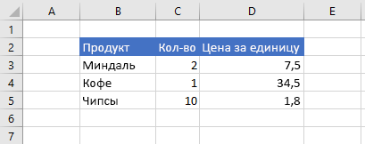

# <a name="work-with-ranges-using-the-excel-javascript-api"></a><span data-ttu-id="9bdc7-103">Работа с диапазонами с использованием API JavaScript для Excel</span><span class="sxs-lookup"><span data-stu-id="9bdc7-103">Work with ranges using the Excel JavaScript API</span></span>

<span data-ttu-id="9bdc7-104">В этой статье приведены примеры кода, в которых показано, как выполнять стандартные задачи для диапазонов с использованием API JavaScript для Excel.</span><span class="sxs-lookup"><span data-stu-id="9bdc7-104">This article provides code samples that show how to perform common tasks with ranges using the Excel JavaScript API.</span></span> <span data-ttu-id="9bdc7-105">Полный список свойств и методов, `Range` поддерживаемых объектом, представлен в разделе [объект Range (API JavaScript для Excel)](/javascript/api/excel/excel.range).</span><span class="sxs-lookup"><span data-stu-id="9bdc7-105">For the complete list of properties and methods that the `Range` object supports, see [Range Object (JavaScript API for Excel)](/javascript/api/excel/excel.range).</span></span>

> [!NOTE]
> <span data-ttu-id="9bdc7-106">Примеры кода, в которых показано, как выполнять более сложные задачи для диапазонов, см. в статье [Работа с диапазонами с использованием API JavaScript для Excel (дополнительные задачи)](excel-add-ins-ranges-advanced.md).</span><span class="sxs-lookup"><span data-stu-id="9bdc7-106">For code samples that show how to perform more advanced tasks with ranges, see [Work with ranges using the Excel JavaScript API (advanced)](excel-add-ins-ranges-advanced.md).</span></span>

## <a name="get-a-range"></a><span data-ttu-id="9bdc7-107">Получение диапазона</span><span class="sxs-lookup"><span data-stu-id="9bdc7-107">Get a range</span></span>

<span data-ttu-id="9bdc7-108">В примерах ниже показаны различные способы получения ссылки на диапазон, расположенный на листе.</span><span class="sxs-lookup"><span data-stu-id="9bdc7-108">The following examples show different ways to get a reference to a range within a worksheet.</span></span>

### <a name="get-range-by-address"></a><span data-ttu-id="9bdc7-109">Получение диапазона по адресу</span><span class="sxs-lookup"><span data-stu-id="9bdc7-109">Get range by address</span></span>

<span data-ttu-id="9bdc7-110">В примере кода ниже показано, как получить диапазон с адресом **B2: C5** из листа с именем **Sample**, загружает его `address` свойство и записывает сообщение в консоль.</span><span class="sxs-lookup"><span data-stu-id="9bdc7-110">The following code sample gets the range with address **B2:C5** from the worksheet named **Sample**, loads its `address` property, and writes a message to the console.</span></span>

```js
Excel.run(function (context) {
    var sheet = context.workbook.worksheets.getItem("Sample");
    var range = sheet.getRange("B2:C5");
    range.load("address");

    return context.sync()
        .then(function () {
            console.log(`The address of the range B2:C5 is "${range.address}"`);
        });
}).catch(errorHandlerFunction);
```

### <a name="get-range-by-name"></a><span data-ttu-id="9bdc7-111">Получение диапазона по имени</span><span class="sxs-lookup"><span data-stu-id="9bdc7-111">Get range by name</span></span>

<span data-ttu-id="9bdc7-112">Следующий пример кода получает диапазон с именем `MyRange` **Sample**, загружает его `address` свойство и записывает сообщение в консоль.</span><span class="sxs-lookup"><span data-stu-id="9bdc7-112">The following code sample gets the range named `MyRange` from the worksheet named **Sample**, loads its `address` property, and writes a message to the console.</span></span>

```js
Excel.run(function (context) {
    var sheet = context.workbook.worksheets.getItem("Sample");
    var range = sheet.getRange("MyRange");
    range.load("address");

    return context.sync()
        .then(function () {
            console.log(`The address of the range "MyRange" is "${range.address}"`);
        });
}).catch(errorHandlerFunction);
```

### <a name="get-used-range"></a><span data-ttu-id="9bdc7-113">Получение используемого диапазона</span><span class="sxs-lookup"><span data-stu-id="9bdc7-113">Get used range</span></span>

<span data-ttu-id="9bdc7-114">Следующий пример кода получает использованный диапазон из листа **Sample**, загружает его `address` свойство и записывает сообщение в консоль.</span><span class="sxs-lookup"><span data-stu-id="9bdc7-114">The following code sample gets the used range from the worksheet named **Sample**, loads its `address` property, and writes a message to the console.</span></span> <span data-ttu-id="9bdc7-115">Используемый диапазон — это наименьший диапазон, включающий в себя все ячейки листа, которые содержат значение или форматирование.</span><span class="sxs-lookup"><span data-stu-id="9bdc7-115">The used range is the smallest range that encompasses any cells in the worksheet that have a value or formatting assigned to them.</span></span> <span data-ttu-id="9bdc7-116">Если лист пуст, `getUsedRange()` метод возвращает диапазон, состоящий только из верхней левой ячейки на листе.</span><span class="sxs-lookup"><span data-stu-id="9bdc7-116">If the entire worksheet is blank, the `getUsedRange()` method returns a range that consists of only the top-left cell in the worksheet.</span></span>

```js
Excel.run(function (context) {
    var sheet = context.workbook.worksheets.getItem("Sample");
    var range = sheet.getUsedRange();
    range.load("address");

    return context.sync()
        .then(function () {
            console.log(`The address of the used range in the worksheet is "${range.address}"`);
        });
}).catch(errorHandlerFunction);
```

### <a name="get-entire-range"></a><span data-ttu-id="9bdc7-117">Получение всего диапазона</span><span class="sxs-lookup"><span data-stu-id="9bdc7-117">Get entire range</span></span>

<span data-ttu-id="9bdc7-118">Следующий пример кода получает весь диапазон листа на листе **Sample**, загружает его `address` свойство и записывает сообщение в консоль.</span><span class="sxs-lookup"><span data-stu-id="9bdc7-118">The following code sample gets the entire worksheet range from the worksheet named **Sample**, loads its `address` property, and writes a message to the console.</span></span>

```js
Excel.run(function (context) {
    var sheet = context.workbook.worksheets.getItem("Sample");
    var range = sheet.getRange();
    range.load("address");

    return context.sync()
        .then(function () {
            console.log(`The address of the entire worksheet range is "${range.address}"`);
        });
}).catch(errorHandlerFunction);
```

## <a name="insert-a-range-of-cells"></a><span data-ttu-id="9bdc7-119">Вставка диапазона ячеек</span><span class="sxs-lookup"><span data-stu-id="9bdc7-119">Insert a range of cells</span></span>

<span data-ttu-id="9bdc7-120">В примере кода ниже показано, как вставить диапазон ячеек в расположение **B4:E4** и сдвинуть другие ячейки вниз, чтобы освободить место для новых ячеек.</span><span class="sxs-lookup"><span data-stu-id="9bdc7-120">The following code sample inserts a range of cells in location **B4:E4** and shifts other cells down to provide space for the new cells.</span></span>

```js
Excel.run(function (context) {
    var sheet = context.workbook.worksheets.getItem("Sample");
    var range = sheet.getRange("B4:E4");

    range.insert(Excel.InsertShiftDirection.down);

    return context.sync();
}).catch(errorHandlerFunction);
```

### <a name="data-before-range-is-inserted"></a><span data-ttu-id="9bdc7-121">Данные перед вставкой диапазона</span><span class="sxs-lookup"><span data-stu-id="9bdc7-121">Data before range is inserted</span></span>


### <a name="data-after-range-is-inserted"></a><span data-ttu-id="9bdc7-123">Данные после вставки диапазона</span><span class="sxs-lookup"><span data-stu-id="9bdc7-123">Data after range is inserted</span></span>


## <a name="clear-a-range-of-cells"></a><span data-ttu-id="9bdc7-125">Очистка диапазона ячеек</span><span class="sxs-lookup"><span data-stu-id="9bdc7-125">Clear a range of cells</span></span>

<span data-ttu-id="9bdc7-126">В примере кода ниже показано, как удалить все содержимое и форматирование ячеек в диапазоне **E2:E5**.</span><span class="sxs-lookup"><span data-stu-id="9bdc7-126">The following code sample clears all contents and formatting of cells in the range **E2:E5**.</span></span>  

```js
Excel.run(function (context) {
    var sheet = context.workbook.worksheets.getItem("Sample");
    var range = sheet.getRange("E2:E5");

    range.clear();

    return context.sync();
}).catch(errorHandlerFunction);
```

### <a name="data-before-range-is-cleared"></a><span data-ttu-id="9bdc7-127">Данные перед очисткой диапазона</span><span class="sxs-lookup"><span data-stu-id="9bdc7-127">Data before range is cleared</span></span>


### <a name="data-after-range-is-cleared"></a><span data-ttu-id="9bdc7-129">Данные после очистки диапазона</span><span class="sxs-lookup"><span data-stu-id="9bdc7-129">Data after range is cleared</span></span>


## <a name="delete-a-range-of-cells"></a><span data-ttu-id="9bdc7-131">Удаление диапазона ячеек</span><span class="sxs-lookup"><span data-stu-id="9bdc7-131">Delete a range of cells</span></span>

<span data-ttu-id="9bdc7-132">В примере кода ниже показано, как удалить ячейки в диапазоне **B4:E4** и сдвинуть другие ячейки вверх, чтобы заполнить место, освободившееся после удаления ячеек.</span><span class="sxs-lookup"><span data-stu-id="9bdc7-132">The following code sample deletes the cells in the range **B4:E4** and shift other cells up to fill the space that was vacated by the deleted cells.</span></span>

```js
Excel.run(function (context) {
    var sheet = context.workbook.worksheets.getItem("Sample");
    var range = sheet.getRange("B4:E4");

    range.delete(Excel.DeleteShiftDirection.up);

    return context.sync();
}).catch(errorHandlerFunction);
```

### <a name="data-before-range-is-deleted"></a><span data-ttu-id="9bdc7-133">Данные перед удалением диапазона</span><span class="sxs-lookup"><span data-stu-id="9bdc7-133">Data before range is deleted</span></span>


### <a name="data-after-range-is-deleted"></a><span data-ttu-id="9bdc7-135">Данные после удаления диапазона</span><span class="sxs-lookup"><span data-stu-id="9bdc7-135">Data after range is deleted</span></span>


## <a name="set-the-selected-range"></a><span data-ttu-id="9bdc7-137">Задание выделенного диапазона</span><span class="sxs-lookup"><span data-stu-id="9bdc7-137">Set the selected range</span></span>

<span data-ttu-id="9bdc7-138">В примере кода ниже показано, как выделить диапазон **B2:E6** на активном листе.</span><span class="sxs-lookup"><span data-stu-id="9bdc7-138">The following code sample selects the range **B2:E6** in the active worksheet.</span></span>

```js
Excel.run(function (context) {
    var sheet = context.workbook.worksheets.getActiveWorksheet();
    var range = sheet.getRange("B2:E6");

    range.select();

    return context.sync();
}).catch(errorHandlerFunction);
```

### <a name="selected-range-b2e6"></a><span data-ttu-id="9bdc7-139">Выделенный диапазон B2:E6</span><span class="sxs-lookup"><span data-stu-id="9bdc7-139">Selected range B2:E6</span></span>


## <a name="get-the-selected-range"></a><span data-ttu-id="9bdc7-141">Получение выделенного диапазона</span><span class="sxs-lookup"><span data-stu-id="9bdc7-141">Get the selected range</span></span>

<span data-ttu-id="9bdc7-142">Следующий пример кода получает выбранный диапазон, загружает его `address` свойство и записывает сообщение в консоль.</span><span class="sxs-lookup"><span data-stu-id="9bdc7-142">The following code sample gets the selected range, loads its `address` property, and writes a message to the console.</span></span>

```js
Excel.run(function (context) {
    var range = context.workbook.getSelectedRange();
    range.load("address");

    return context.sync()
        .then(function () {
            console.log(`The address of the selected range is "${range.address}"`);
        });
}).catch(errorHandlerFunction);
```

## <a name="set-values-or-formulas"></a><span data-ttu-id="9bdc7-143">Задание значений или формул</span><span class="sxs-lookup"><span data-stu-id="9bdc7-143">Set values or formulas</span></span>

<span data-ttu-id="9bdc7-144">В примерах ниже показано, как задать значения и формулы для одной ячейки или диапазона ячеек.</span><span class="sxs-lookup"><span data-stu-id="9bdc7-144">The following examples show how to set values and formulas for a single cell or a range of cells.</span></span>

### <a name="set-value-for-a-single-cell"></a><span data-ttu-id="9bdc7-145">Задание значения для одной ячейки</span><span class="sxs-lookup"><span data-stu-id="9bdc7-145">Set value for a single cell</span></span>

<span data-ttu-id="9bdc7-146">В примере кода ниже показано, как присвоить ячейке **C3** значение 5, а затем настроить ширину столбцов для наилучшего размещения данных.</span><span class="sxs-lookup"><span data-stu-id="9bdc7-146">The following code sample sets the value of cell **C3** to "5" and then sets the width of the columns to best fit the data.</span></span>

```js
Excel.run(function (context) {
    var sheet = context.workbook.worksheets.getItem("Sample");

    var range = sheet.getRange("C3");
    range.values = [[ 5 ]];
    range.format.autofitColumns();

    return context.sync();
}).catch(errorHandlerFunction);
```

#### <a name="data-before-cell-value-is-updated"></a><span data-ttu-id="9bdc7-147">Данные перед изменением значения ячейки</span><span class="sxs-lookup"><span data-stu-id="9bdc7-147">Data before cell value is updated</span></span>


#### <a name="data-after-cell-value-is-updated"></a><span data-ttu-id="9bdc7-149">Данные после изменения значения ячейки</span><span class="sxs-lookup"><span data-stu-id="9bdc7-149">Data after cell value is updated</span></span>


### <a name="set-values-for-a-range-of-cells"></a><span data-ttu-id="9bdc7-151">Задание значений для диапазона ячеек</span><span class="sxs-lookup"><span data-stu-id="9bdc7-151">Set values for a range of cells</span></span>

<span data-ttu-id="9bdc7-152">В примере кода ниже показано, как присвоить значения ячейкам в диапазоне **B5:D5**, а затем настроить ширину столбцов для наилучшего размещения данных.</span><span class="sxs-lookup"><span data-stu-id="9bdc7-152">The following code sample sets values for the cells in the range **B5:D5** and then sets the width of the columns to best fit the data.</span></span>

```js
Excel.run(function (context) {
    var sheet = context.workbook.worksheets.getItem("Sample");

    var data = [
        ["Potato Chips", 10, 1.80],
    ];

    var range = sheet.getRange("B5:D5");
    range.values = data;
    range.format.autofitColumns();

    return context.sync();
}).catch(errorHandlerFunction);
```

#### <a name="data-before-cell-values-are-updated"></a><span data-ttu-id="9bdc7-153">Данные перед изменением значений ячеек</span><span class="sxs-lookup"><span data-stu-id="9bdc7-153">Data before cell values are updated</span></span>


#### <a name="data-after-cell-values-are-updated"></a><span data-ttu-id="9bdc7-155">Данные после изменения значений ячеек</span><span class="sxs-lookup"><span data-stu-id="9bdc7-155">Data after cell values are updated</span></span>



### <a name="set-formula-for-a-single-cell"></a><span data-ttu-id="9bdc7-157">Задание формулы для одной ячейки</span><span class="sxs-lookup"><span data-stu-id="9bdc7-157">Set formula for a single cell</span></span>

<span data-ttu-id="9bdc7-158">В примере кода ниже показано, как задать формулу для ячейки **E3**, а затем настроить ширину столбцов для наилучшего размещения данных.</span><span class="sxs-lookup"><span data-stu-id="9bdc7-158">The following code sample sets a formula for cell **E3** and then sets the width of the columns to best fit the data.</span></span>

```js
Excel.run(function (context) {
    var sheet = context.workbook.worksheets.getItem("Sample");

    var range = sheet.getRange("E3");
    range.formulas = [[ "=C3 * D3" ]];
    range.format.autofitColumns();

    return context.sync();
}).catch(errorHandlerFunction);
```

#### <a name="data-before-cell-formula-is-set"></a><span data-ttu-id="9bdc7-159">Данные перед заданием формулы для ячейки</span><span class="sxs-lookup"><span data-stu-id="9bdc7-159">Data before cell formula is set</span></span>


#### <a name="data-after-cell-formula-is-set"></a><span data-ttu-id="9bdc7-161">Данные после задания формулы для ячейки</span><span class="sxs-lookup"><span data-stu-id="9bdc7-161">Data after cell formula is set</span></span>


### <a name="set-formulas-for-a-range-of-cells"></a><span data-ttu-id="9bdc7-163">Задание формул для диапазона ячеек</span><span class="sxs-lookup"><span data-stu-id="9bdc7-163">Set formulas for a range of cells</span></span>

<span data-ttu-id="9bdc7-164">В примере кода ниже показано, как задать формулы для ячеек в диапазоне **E2:E6**, а затем настроить ширину столбцов для наилучшего размещения данных.</span><span class="sxs-lookup"><span data-stu-id="9bdc7-164">The following code sample sets formulas for cells in the range **E2:E6** and then sets the width of the columns to best fit the data.</span></span>

```js
Excel.run(function (context) {
    var sheet = context.workbook.worksheets.getItem("Sample");

    var data = [
        ["=C3 * D3"],
        ["=C4 * D4"],
        ["=C5 * D5"],
        ["=SUM(E3:E5)"]
    ];

    var range = sheet.getRange("E3:E6");
    range.formulas = data;
    range.format.autofitColumns();

    return context.sync();
}).catch(errorHandlerFunction);
```

#### <a name="data-before-cell-formulas-are-set"></a><span data-ttu-id="9bdc7-165">Данные перед заданием формул для ячеек</span><span class="sxs-lookup"><span data-stu-id="9bdc7-165">Data before cell formulas are set</span></span>


#### <a name="data-after-cell-formulas-are-set"></a><span data-ttu-id="9bdc7-167">Данные после задания формул для ячеек</span><span class="sxs-lookup"><span data-stu-id="9bdc7-167">Data after cell formulas are set</span></span>


## <a name="get-values-text-or-formulas"></a><span data-ttu-id="9bdc7-169">Получение значений, текста или формул</span><span class="sxs-lookup"><span data-stu-id="9bdc7-169">Get values, text, or formulas</span></span>

<span data-ttu-id="9bdc7-170">В примерах ниже показано, как получать значения, текст и формулы из диапазона ячеек.</span><span class="sxs-lookup"><span data-stu-id="9bdc7-170">These examples show how to get values, text, and formulas from a range of cells.</span></span>

### <a name="get-values-from-a-range-of-cells"></a><span data-ttu-id="9bdc7-171">Получение значений из диапазона ячеек</span><span class="sxs-lookup"><span data-stu-id="9bdc7-171">Get values from a range of cells</span></span>

<span data-ttu-id="9bdc7-172">Следующий пример кода получает диапазон **B2: E6**, загружает его `values` свойство и записывает значения в консоль.</span><span class="sxs-lookup"><span data-stu-id="9bdc7-172">The following code sample gets the range **B2:E6**, loads its `values` property, and writes the values to the console.</span></span> <span data-ttu-id="9bdc7-173">`values`Свойство диапазона указывает необработанные значения, содержащиеся в ячейках.</span><span class="sxs-lookup"><span data-stu-id="9bdc7-173">The `values` property of a range specifies the raw values that the cells contain.</span></span> <span data-ttu-id="9bdc7-174">Даже если некоторые ячейки в диапазоне содержат формулы, `values` свойство диапазона указывает необработанные значения для этих ячеек, а не формулы.</span><span class="sxs-lookup"><span data-stu-id="9bdc7-174">Even if some cells in a range contain formulas, the `values` property of the range specifies the raw values for those cells, not any of the formulas.</span></span>

```js
Excel.run(function (context) {
    var sheet = context.workbook.worksheets.getItem("Sample");
    var range = sheet.getRange("B2:E6");
    range.load("values");

    return context.sync()
        .then(function () {
            console.log(JSON.stringify(range.values, null, 4));
        });
}).catch(errorHandlerFunction);
```

#### <a name="data-in-range-values-in-column-e-are-a-result-of-formulas"></a><span data-ttu-id="9bdc7-175">Данные в диапазоне (значения в столбце E представляют собой результат вычисления формул)</span><span class="sxs-lookup"><span data-stu-id="9bdc7-175">Data in range (values in column E are a result of formulas)</span></span>


#### <a name="rangevalues-as-logged-to-the-console-by-the-code-sample-above"></a><span data-ttu-id="9bdc7-177">range.values (как записано в консоль в примере кода выше)</span><span class="sxs-lookup"><span data-stu-id="9bdc7-177">range.values (as logged to the console by the code sample above)</span></span>

```json
[
    [
        "Product",
        "Qty",
        "Unit Price",
        "Total Price"
    ],
    [
        "Almonds",
        2,
        7.5,
        15
    ],
    [
        "Coffee",
        1,
        34.5,
        34.5
    ],
    [
        "Chocolate",
        5,
        9.56,
        47.8
    ],
    [
        "",
        "",
        "",
        97.3
    ]
]
```

### <a name="get-text-from-a-range-of-cells"></a><span data-ttu-id="9bdc7-178">Получение текста из диапазона ячеек</span><span class="sxs-lookup"><span data-stu-id="9bdc7-178">Get text from a range of cells</span></span>

<span data-ttu-id="9bdc7-179">Следующий пример кода получает диапазон **B2: E6**, загружает его `text` свойство и записывает его в консоль.</span><span class="sxs-lookup"><span data-stu-id="9bdc7-179">The following code sample gets the range **B2:E6**, loads its `text` property, and writes it to the console.</span></span> <span data-ttu-id="9bdc7-180">`text`Свойство диапазона определяет отображаемые значения для ячеек в диапазоне.</span><span class="sxs-lookup"><span data-stu-id="9bdc7-180">The `text` property of a range specifies the display values for cells in the range.</span></span> <span data-ttu-id="9bdc7-181">Даже если некоторые ячейки в диапазоне содержат формулы, `text` свойство диапазона определяет отображаемые значения для этих ячеек, а не формулы.</span><span class="sxs-lookup"><span data-stu-id="9bdc7-181">Even if some cells in a range contain formulas, the `text` property of the range specifies the display values for those cells, not any of the formulas.</span></span>

```js
Excel.run(function (context) {
    var sheet = context.workbook.worksheets.getItem("Sample");
    var range = sheet.getRange("B2:E6");
    range.load("text");

    return context.sync()
        .then(function () {
            console.log(JSON.stringify(range.text, null, 4));
        });
}).catch(errorHandlerFunction);
```

#### <a name="data-in-range-values-in-column-e-are-a-result-of-formulas"></a><span data-ttu-id="9bdc7-182">Данные в диапазоне (значения в столбце E представляют собой результат вычисления формул)</span><span class="sxs-lookup"><span data-stu-id="9bdc7-182">Data in range (values in column E are a result of formulas)</span></span>


#### <a name="rangetext-as-logged-to-the-console-by-the-code-sample-above"></a><span data-ttu-id="9bdc7-184">range.text (как записано в консоль в примере кода выше)</span><span class="sxs-lookup"><span data-stu-id="9bdc7-184">range.text (as logged to the console by the code sample above)</span></span>

```json
[
    [
        "Product",
        "Qty",
        "Unit Price",
        "Total Price"
    ],
    [
        "Almonds",
        "2",
        "7.5",
        "15"
    ],
    [
        "Coffee",
        "1",
        "34.5",
        "34.5"
    ],
    [
        "Chocolate",
        "5",
        "9.56",
        "47.8"
    ],
    [
        "",
        "",
        "",
        "97.3"
    ]
]
```

### <a name="get-formulas-from-a-range-of-cells"></a><span data-ttu-id="9bdc7-185">Получение формул из диапазона ячеек</span><span class="sxs-lookup"><span data-stu-id="9bdc7-185">Get formulas from a range of cells</span></span>

<span data-ttu-id="9bdc7-186">Следующий пример кода получает диапазон **B2: E6**, загружает его `formulas` свойство и записывает его в консоль.</span><span class="sxs-lookup"><span data-stu-id="9bdc7-186">The following code sample gets the range **B2:E6**, loads its `formulas` property, and writes it to the console.</span></span> <span data-ttu-id="9bdc7-187">`formulas`Свойство диапазона определяет формулы для ячеек в диапазоне, содержащих формулы, и необработанные значения для ячеек в диапазоне, которые не содержат формул.</span><span class="sxs-lookup"><span data-stu-id="9bdc7-187">The `formulas` property of a range specifies the formulas for cells in the range that contain formulas and the raw values for cells in the range that do not contain formulas.</span></span>

```js
Excel.run(function (context) {
    var sheet = context.workbook.worksheets.getItem("Sample");
    var range = sheet.getRange("B2:E6");
    range.load("formulas");

    return context.sync()
        .then(function () {
            console.log(JSON.stringify(range.formulas, null, 4));
        });
}).catch(errorHandlerFunction);
```

#### <a name="data-in-range-values-in-column-e-are-a-result-of-formulas"></a><span data-ttu-id="9bdc7-188">Данные в диапазоне (значения в столбце E представляют собой результат вычисления формул)</span><span class="sxs-lookup"><span data-stu-id="9bdc7-188">Data in range (values in column E are a result of formulas)</span></span>


#### <a name="rangeformulas-as-logged-to-the-console-by-the-code-sample-above"></a><span data-ttu-id="9bdc7-190">range.formulas (как записано в консоль в примере кода выше)</span><span class="sxs-lookup"><span data-stu-id="9bdc7-190">range.formulas (as logged to the console by the code sample above)</span></span>

```json
[
    [
        "Product",
        "Qty",
        "Unit Price",
        "Total Price"
    ],
    [
        "Almonds",
        2,
        7.5,
        "=C3 * D3"
    ],
    [
        "Coffee",
        1,
        34.5,
        "=C4 * D4"
    ],
    [
        "Chocolate",
        5,
        9.56,
        "=C5 * D5"
    ],
    [
        "",
        "",
        "",
        "=SUM(E3:E5)"
    ]
]
```

## <a name="set-range-format"></a><span data-ttu-id="9bdc7-191">Задание формата диапазона</span><span class="sxs-lookup"><span data-stu-id="9bdc7-191">Set range format</span></span>

<span data-ttu-id="9bdc7-192">В примерах ниже показано, как задать цвет шрифта, цвет заливки и формат чисел для ячеек в диапазоне.</span><span class="sxs-lookup"><span data-stu-id="9bdc7-192">The following examples show how to set font color, fill color, and number format for cells in a range.</span></span>

### <a name="set-font-color-and-fill-color"></a><span data-ttu-id="9bdc7-193">Задание цвета шрифта и цвета заливки</span><span class="sxs-lookup"><span data-stu-id="9bdc7-193">Set font color and fill color</span></span>

<span data-ttu-id="9bdc7-194">В примере ниже показано, как задать цвет шрифта и цвет заливки для ячеек в диапазоне **B2: E2**.</span><span class="sxs-lookup"><span data-stu-id="9bdc7-194">The following code sample sets the font color and fill color for cells in range **B2:E2**.</span></span>

```js
Excel.run(function (context) {
    var sheet = context.workbook.worksheets.getItem("Sample");

    var range = sheet.getRange("B2:E2");
    range.format.fill.color = "#4472C4";
    range.format.font.color = "white";

    return context.sync();
}).catch(errorHandlerFunction);
```

#### <a name="data-in-range-before-font-color-and-fill-color-are-set"></a><span data-ttu-id="9bdc7-195">Данные в диапазоне перед заданием цвета шрифта и цвета заливки</span><span class="sxs-lookup"><span data-stu-id="9bdc7-195">Data in range before font color and fill color are set</span></span>


#### <a name="data-in-range-after-font-color-and-fill-color-are-set"></a><span data-ttu-id="9bdc7-197">Данные в диапазоне после задания цвета шрифта и цвета заливки</span><span class="sxs-lookup"><span data-stu-id="9bdc7-197">Data in range after font color and fill color are set</span></span>


### <a name="set-number-format"></a><span data-ttu-id="9bdc7-199">Задание формата чисел</span><span class="sxs-lookup"><span data-stu-id="9bdc7-199">Set number format</span></span>

<span data-ttu-id="9bdc7-200">В примере ниже показано, как задать формат чисел для ячеек в диапазоне **D3:E5**.</span><span class="sxs-lookup"><span data-stu-id="9bdc7-200">The following code sample sets the number format for the cells in range **D3:E5**.</span></span>

```js
Excel.run(function (context) {
    var sheet = context.workbook.worksheets.getItem("Sample");

    var formats = [
        ["0.00", "0.00"],
        ["0.00", "0.00"],
        ["0.00", "0.00"]
    ];

    var range = sheet.getRange("D3:E5");
    range.numberFormat = formats;

    return context.sync();
}).catch(errorHandlerFunction);
```

#### <a name="data-in-range-before-number-format-is-set"></a><span data-ttu-id="9bdc7-201">Данные в диапазоне перед заданием формата чисел</span><span class="sxs-lookup"><span data-stu-id="9bdc7-201">Data in range before number format is set</span></span>


#### <a name="data-in-range-after-number-format-is-set"></a><span data-ttu-id="9bdc7-203">Данные в диапазоне после задания формата чисел</span><span class="sxs-lookup"><span data-stu-id="9bdc7-203">Data in range after number format is set</span></span>


## <a name="read-or-write-to-an-unbounded-range"></a><span data-ttu-id="9bdc7-205">Чтение из неограниченного диапазона и запись в него</span><span class="sxs-lookup"><span data-stu-id="9bdc7-205">Read or write to an unbounded range</span></span>

### <a name="read-an-unbounded-range"></a><span data-ttu-id="9bdc7-206">Чтение из неограниченного диапазона</span><span class="sxs-lookup"><span data-stu-id="9bdc7-206">Read an unbounded range</span></span>

<span data-ttu-id="9bdc7-207">Неограниченный адрес диапазона — это адрес диапазона, в котором задаются либо все столбцы, либо все строки.</span><span class="sxs-lookup"><span data-stu-id="9bdc7-207">An unbounded range address is a range address that specifies either entire columns or entire rows.</span></span> <span data-ttu-id="9bdc7-208">Пример:</span><span class="sxs-lookup"><span data-stu-id="9bdc7-208">For example:</span></span>

- <span data-ttu-id="9bdc7-209">Диапазоны адресов состоят из целых столбцов:</span><span class="sxs-lookup"><span data-stu-id="9bdc7-209">Range addresses comprised of entire columns:</span></span><ul><li>`C:C`</li><li>`A:F`</li></ul>
- <span data-ttu-id="9bdc7-210">Диапазоны адресов состоят из целых строк:</span><span class="sxs-lookup"><span data-stu-id="9bdc7-210">Range addresses comprised of entire rows:</span></span><ul><li>`2:2`</li><li>`1:4`</li></ul>

<span data-ttu-id="9bdc7-p107">Когда API отправляет запрос на получение неограниченного диапазона (например, `getRange('C:C')`), ответ будет содержать значения `null` для свойств уровня ячейки, например свойств `values`, `text`, `numberFormat` и `formula`. Другие свойства диапазона, например `address` и `cellCount`, будут содержать допустимые значения для неограниченного диапазона.</span><span class="sxs-lookup"><span data-stu-id="9bdc7-p107">When the API makes a request to retrieve an unbounded range (for example, `getRange('C:C')`), the response will contain `null` values for cell-level properties such as `values`, `text`, `numberFormat`, and `formula`. Other properties of the range, such as `address` and `cellCount`, will contain valid values for the unbounded range.</span></span>

### <a name="write-to-an-unbounded-range"></a><span data-ttu-id="9bdc7-213">Запись в неограниченный диапазон</span><span class="sxs-lookup"><span data-stu-id="9bdc7-213">Write to an unbounded range</span></span>

<span data-ttu-id="9bdc7-214">Невозможно задать свойства уровня ячейки `values` , например, `numberFormat` и `formula` для неограниченного диапазона, так как входной запрос слишком велик.</span><span class="sxs-lookup"><span data-stu-id="9bdc7-214">You cannot set cell-level properties such as `values`, `numberFormat`, and `formula` on an unbounded range because the input request is too large.</span></span> <span data-ttu-id="9bdc7-215">Например, приведенный ниже фрагмент кода недопустим, так как он пытается указать свойство `values` для неограниченного диапазона.</span><span class="sxs-lookup"><span data-stu-id="9bdc7-215">For example, the following code snippet is not valid because it attempts to specify `values` for an unbounded range.</span></span> <span data-ttu-id="9bdc7-216">API возвращает ошибку при попытке установить свойства на уровне ячейки для неограниченного диапазона.</span><span class="sxs-lookup"><span data-stu-id="9bdc7-216">The API returns an error if you attempt to set cell-level properties for an unbounded range.</span></span>

```js
var range = context.workbook.worksheets.getActiveWorksheet().getRange('A:B');
range.values = 'Due Date';
```

## <a name="read-or-write-to-a-large-range"></a><span data-ttu-id="9bdc7-217">Чтение из большого диапазона и запись в него</span><span class="sxs-lookup"><span data-stu-id="9bdc7-217">Read or write to a large range</span></span>

<span data-ttu-id="9bdc7-p109">Если диапазон содержит большое количество ячеек, значений, форматов чисел или формул, то, возможно, не удастся выполнить операции API над этим диапазоном. API всегда делает все возможное, чтобы выполнить запрошенную операцию над диапазоном (то есть получить или записать указанные данные), но попытка выполнить операцию чтения или записи для большого диапазона может привести к ошибке API из-за чрезмерного потребления ресурсов. Чтобы избежать таких ошибок, мы рекомендуем выполнять отдельные операции чтения или записи для небольших подмножеств большого диапазона, а не пытаться выполнить одну операцию чтения или записи для большого диапазона.</span><span class="sxs-lookup"><span data-stu-id="9bdc7-p109">If a range contains a large number of cells, values, number formats, and/or formulas, it may not be possible to run API operations on that range. The API will always make a best attempt to run the requested operation on a range (i.e., to retrieve or write the specified data), but attempting to perform read or write operations for a large range may result in an API error due to excessive resource utilization. To avoid such errors, we recommend that you run separate read or write operations for smaller subsets of a large range, instead of attempting to run a single read or write operation on a large range.</span></span>

<span data-ttu-id="9bdc7-221">Подробнее об ограничениях системы можно узнать в разделе "надстройки Excel" [ограничений ресурсов и оптимизации производительности для надстроек Office](../concepts/resource-limits-and-performance-optimization.md#excel-add-ins).</span><span class="sxs-lookup"><span data-stu-id="9bdc7-221">For details on the system limitations, see the "Excel add-ins" section of [Resource limits and performance optimization for Office Add-ins](../concepts/resource-limits-and-performance-optimization.md#excel-add-ins).</span></span>

### <a name="conditional-formatting-of-ranges"></a><span data-ttu-id="9bdc7-222">Условное форматирование диапазонов</span><span class="sxs-lookup"><span data-stu-id="9bdc7-222">Conditional formatting of ranges</span></span>

<span data-ttu-id="9bdc7-223">В диапазонах может применяться форматирование к отдельным ячейкам на основе условий.</span><span class="sxs-lookup"><span data-stu-id="9bdc7-223">Ranges can have formats applied to individual cells based on conditions.</span></span> <span data-ttu-id="9bdc7-224">Дополнительные сведения об этом см. в статье [Применение условного форматирования к диапазонам Excel](excel-add-ins-conditional-formatting.md).</span><span class="sxs-lookup"><span data-stu-id="9bdc7-224">For more information about this, see [Apply conditional formatting to Excel ranges](excel-add-ins-conditional-formatting.md).</span></span>

## <a name="find-a-cell-using-string-matching"></a><span data-ttu-id="9bdc7-225">Поиск ячейки с помощью сопоставления строк</span><span class="sxs-lookup"><span data-stu-id="9bdc7-225">Find a cell using string matching</span></span>

<span data-ttu-id="9bdc7-226">У объекта `Range` есть метод `find` для поиска указанной строки в диапазоне.</span><span class="sxs-lookup"><span data-stu-id="9bdc7-226">The `Range` object has a `find` method to search for a specified string within the range.</span></span> <span data-ttu-id="9bdc7-227">Он возвращает диапазон первой ячейки с текстом, соответствующим критериям.</span><span class="sxs-lookup"><span data-stu-id="9bdc7-227">It returns the range of the first cell with matching text.</span></span> <span data-ttu-id="9bdc7-228">Приведенный ниже пример кода находит первую ячейку со значением, соответствующим строке **Food** (Еда), и заносит ее адрес в консоль.</span><span class="sxs-lookup"><span data-stu-id="9bdc7-228">The following code sample finds the first cell with a value equal to the string **Food** and logs its address to the console.</span></span> <span data-ttu-id="9bdc7-229">Обратите внимание, что метод `find` выдает ошибку `ItemNotFound`, если указанной строки не существует в диапазоне.</span><span class="sxs-lookup"><span data-stu-id="9bdc7-229">Note that `find` throws an `ItemNotFound` error if the specified string doesn't exist in the range.</span></span> <span data-ttu-id="9bdc7-230">Если ожидается, что указанная строка может отсутствовать в диапазоне, используйте вместо этого метод [findOrNullObject](../develop/application-specific-api-model.md#ornullobject-methods-and-properties), чтобы ваш код корректно обработал этот сценарий.</span><span class="sxs-lookup"><span data-stu-id="9bdc7-230">If you expect that the specified string may not exist in the range, use the [findOrNullObject](../develop/application-specific-api-model.md#ornullobject-methods-and-properties) method instead, so your code gracefully handles that scenario.</span></span>

```js
Excel.run(function (context) {
    var sheet = context.workbook.worksheets.getItem("Sample");
    var table = sheet.tables.getItem("ExpensesTable");
    var searchRange = table.getRange();
    var foundRange = searchRange.find("Food", {
        completeMatch: true, // find will match the whole cell value
        matchCase: false, // find will not match case
        searchDirection: Excel.SearchDirection.forward // find will start searching at the beginning of the range
    });

    foundRange.load("address");
    return context.sync()
        .then(function() {
            console.log(foundRange.address);
    });
}).catch(errorHandlerFunction);
```

<span data-ttu-id="9bdc7-231">Если метод `find` вызывается для диапазона, представляющего одну ячейку, поиск выполняется во всем листе.</span><span class="sxs-lookup"><span data-stu-id="9bdc7-231">When the `find` method is called on a range representing a single cell, the entire worksheet is searched.</span></span> <span data-ttu-id="9bdc7-232">Поиск начинается в этой ячейке и продолжается в направлении, которое определяется параметром `SearchCriteria.searchDirection`, охватывающим концы листа при необходимости.</span><span class="sxs-lookup"><span data-stu-id="9bdc7-232">The search begins at that cell and goes in the direction specified by `SearchCriteria.searchDirection`, wrapping around the ends of the worksheet if needed.</span></span>

## <a name="see-also"></a><span data-ttu-id="9bdc7-233">См. также</span><span class="sxs-lookup"><span data-stu-id="9bdc7-233">See also</span></span>

- [<span data-ttu-id="9bdc7-234">Работа с диапазонами с использованием API JavaScript для Excel (дополнительные задачи)</span><span class="sxs-lookup"><span data-stu-id="9bdc7-234">Work with ranges using the Excel JavaScript API (advanced)</span></span>](excel-add-ins-ranges-advanced.md)
- [<span data-ttu-id="9bdc7-235">Объектная модель JavaScript для Excel в надстройках Office</span><span class="sxs-lookup"><span data-stu-id="9bdc7-235">Excel JavaScript object model in Office Add-ins</span></span>](excel-add-ins-core-concepts.md)
