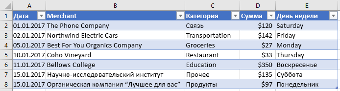

# <a name="work-with-tables-using-the-excel-javascript-api"></a>Работа с таблицами с использованием API JavaScript для Excel

В этой статье приведены примеры кода, в которых показано, как выполнять стандартные задачи для таблиц с использованием API JavaScript для Excel. Полный список свойств и методов, `Table` `TableCollection` поддерживаемых объектами and, представлен в статье [объект Table (API JavaScript для Excel)](/javascript/api/excel/excel.table) и [объект TableCollection (API JavaScript для Excel)](/javascript/api/excel/excel.tablecollection).

## <a name="create-a-table"></a>Создание таблицы

В примере кода ниже показано, как создать таблицу на листе **Sample** (Пример). В таблице имеются заголовки, а также четыре столбца и семь строк с данными. Если приложение Excel, в котором выполняется код, поддерживает [набор требований](../reference/requirement-sets/excel-api-requirement-sets.md) **ExcelApi 1,2**, ширина столбцов и высота строк задаются в соответствии с текущими данными в таблице.

> [!NOTE]
> Чтобы указать имя для таблицы, необходимо сначала создать таблицу, а затем задать ее `name` свойство, как показано в следующем примере.

```js
Excel.run(function (context) {
    var sheet = context.workbook.worksheets.getItem("Sample");
    var expensesTable = sheet.tables.add("A1:D1", true /*hasHeaders*/);
    expensesTable.name = "ExpensesTable";

    expensesTable.getHeaderRowRange().values = [["Date", "Merchant", "Category", "Amount"]];

    expensesTable.rows.add(null /*add rows to the end of the table*/, [
        ["1/1/2017", "The Phone Company", "Communications", "$120"],
        ["1/2/2017", "Northwind Electric Cars", "Transportation", "$142"],
        ["1/5/2017", "Best For You Organics Company", "Groceries", "$27"],
        ["1/10/2017", "Coho Vineyard", "Restaurant", "$33"],
        ["1/11/2017", "Bellows College", "Education", "$350"],
        ["1/15/2017", "Trey Research", "Other", "$135"],
        ["1/15/2017", "Best For You Organics Company", "Groceries", "$97"]
    ]);

    if (Office.context.requirements.isSetSupported("ExcelApi", "1.2")) {
        sheet.getUsedRange().format.autofitColumns();
        sheet.getUsedRange().format.autofitRows();
    }

    sheet.activate();

    return context.sync();
}).catch(errorHandlerFunction);
```

**Новая таблица**


## <a name="add-rows-to-a-table"></a>Добавление строк в таблицу

В примере ниже показано, как добавить семь новых строк в таблицу **ExpensesTable** (Таблица расходов) на листе **Sample** (Пример). Новые строки будут добавлены в конец таблицы. Если приложение Excel, в котором выполняется код, поддерживает [набор требований](../reference/requirement-sets/excel-api-requirement-sets.md) **ExcelApi 1,2**, ширина столбцов и высота строк задаются в соответствии с текущими данными в таблице.

> [!NOTE]
> `index`Свойство объекта [TableRow](/javascript/api/excel/excel.tablerow) указывает номер индекса строки в коллекции Rows таблицы. `TableRow`Объект не содержит `id` свойство, которое можно использовать в качестве уникального ключа для идентификации строки.

```js
Excel.run(function (context) {
    var sheet = context.workbook.worksheets.getItem("Sample");
    var expensesTable = sheet.tables.getItem("ExpensesTable");

    expensesTable.rows.add(null /*add rows to the end of the table*/, [
        ["1/16/2017", "THE PHONE COMPANY", "Communications", "$120"],
        ["1/20/2017", "NORTHWIND ELECTRIC CARS", "Transportation", "$142"],
        ["1/20/2017", "BEST FOR YOU ORGANICS COMPANY", "Groceries", "$27"],
        ["1/21/2017", "COHO VINEYARD", "Restaurant", "$33"],
        ["1/25/2017", "BELLOWS COLLEGE", "Education", "$350"],
        ["1/28/2017", "TREY RESEARCH", "Other", "$135"],
        ["1/31/2017", "BEST FOR YOU ORGANICS COMPANY", "Groceries", "$97"]
    ]);

    if (Office.context.requirements.isSetSupported("ExcelApi", "1.2")) {
        sheet.getUsedRange().format.autofitColumns();
        sheet.getUsedRange().format.autofitRows();
    }

    return context.sync();
}).catch(errorHandlerFunction);
```

**Таблица с новыми строками**


## <a name="add-a-column-to-a-table"></a>Добавление столбца в таблицу

В примерах ниже показано, как добавить столбец в таблицу. В первом примере показано, как заполнить новый столбец статическими значениями, во втором — как заполнить новый столбец формулами.

> [!NOTE]
> Свойство **index** объекта [TableColumn](/javascript/api/excel/excel.tablecolumn) указывает номер индекса столбца в коллекции столбцов таблицы. Свойство **id** объекта **TableColumn** содержит уникальный ключ, идентифицирующий столбец.

### <a name="add-a-column-that-contains-static-values"></a>Добавление столбца, содержащего статические значения

В примере кода ниже показано, как добавить новый столбец в таблицу **ExpensesTable** (Таблица расходов) на листе **Sample** (Пример). Новый столбец будет добавлен после всех существующих столбцов в таблице. Он будет содержать заголовок Day of the Week (День недели), а также данные для заполнения ячеек в столбце. Если приложение Excel, в котором выполняется код, поддерживает [набор требований](../reference/requirement-sets/excel-api-requirement-sets.md) **ExcelApi 1,2**, ширина столбцов и высота строк задаются в соответствии с текущими данными в таблице.

```js
Excel.run(function (context) {
    var sheet = context.workbook.worksheets.getItem("Sample");
    var expensesTable = sheet.tables.getItem("ExpensesTable");

    expensesTable.columns.add(null /*add columns to the end of the table*/, [
        ["Day of the Week"],
        ["Saturday"],
        ["Friday"],
        ["Monday"],
        ["Thursday"],
        ["Sunday"],
        ["Saturday"],
        ["Monday"]
    ]);

    if (Office.context.requirements.isSetSupported("ExcelApi", "1.2")) {
        sheet.getUsedRange().format.autofitColumns();
        sheet.getUsedRange().format.autofitRows();
    }

    return context.sync();
}).catch(errorHandlerFunction);
```

**Таблица с новым столбцом**



### <a name="add-a-column-that-contains-formulas"></a>Добавление столбца, содержащего формулы

В примере кода ниже показано, как добавить новый столбец в таблицу **ExpensesTable** (Таблица расходов) на листе **Sample** (Пример). Новый столбец будет добавлен в конец таблицы, будет содержать заголовок Type of the Day (Тип дня), и в нем будет использована формула для заполнения каждой ячейки столбца. Если приложение Excel, в котором выполняется код, поддерживает [набор требований](../reference/requirement-sets/excel-api-requirement-sets.md) **ExcelApi 1,2**, ширина столбцов и высота строк задаются в соответствии с текущими данными в таблице.

```js
Excel.run(function (context) {
    var sheet = context.workbook.worksheets.getItem("Sample");
    var expensesTable = sheet.tables.getItem("ExpensesTable");

    expensesTable.columns.add(null /*add columns to the end of the table*/, [
        ["Type of the Day"],
        ['=IF(OR((TEXT([DATE], "dddd") = "Saturday"), (TEXT([DATE], "dddd") = "Sunday")), "Weekend", "Weekday")'],
        ['=IF(OR((TEXT([DATE], "dddd") = "Saturday"), (TEXT([DATE], "dddd") = "Sunday")), "Weekend", "Weekday")'],
        ['=IF(OR((TEXT([DATE], "dddd") = "Saturday"), (TEXT([DATE], "dddd") = "Sunday")), "Weekend", "Weekday")'],
        ['=IF(OR((TEXT([DATE], "dddd") = "Saturday"), (TEXT([DATE], "dddd") = "Sunday")), "Weekend", "Weekday")'],
        ['=IF(OR((TEXT([DATE], "dddd") = "Saturday"), (TEXT([DATE], "dddd") = "Sunday")), "Weekend", "Weekday")'],
        ['=IF(OR((TEXT([DATE], "dddd") = "Saturday"), (TEXT([DATE], "dddd") = "Sunday")), "Weekend", "Weekday")'],
        ['=IF(OR((TEXT([DATE], "dddd") = "Saturday"), (TEXT([DATE], "dddd") = "Sunday")), "Weekend", "Weekday")']
    ]);

    if (Office.context.requirements.isSetSupported("ExcelApi", "1.2")) {
        sheet.getUsedRange().format.autofitColumns();
        sheet.getUsedRange().format.autofitRows();
    }

    return context.sync();
}).catch(errorHandlerFunction);
```

**Таблица с новым столбцом, содержащим вычисленные значения**


## <a name="update-column-name"></a>Изменение имени столбца

В примере кода ниже показано, как изменить имя первого столбца в таблице на **Purchase date**. Если приложение Excel, в котором выполняется код, поддерживает [набор требований](../reference/requirement-sets/excel-api-requirement-sets.md) **ExcelApi 1,2**, ширина столбцов и высота строк задаются в соответствии с текущими данными в таблице.

```js
Excel.run(function (context) {
    var sheet = context.workbook.worksheets.getItem("Sample");

    var expensesTable = sheet.tables.getItem("ExpensesTable");
    expensesTable.columns.load("items");

    return context.sync()
        .then(function () {
            expensesTable.columns.items[0].name = "Purchase date";

            if (Office.context.requirements.isSetSupported("ExcelApi", "1.2")) {
                sheet.getUsedRange().format.autofitColumns();
                sheet.getUsedRange().format.autofitRows();
            }

            return context.sync();
        });
}).catch(errorHandlerFunction);
```

**Таблица со столбцом с новым именем**


## <a name="get-data-from-a-table"></a>Получение данных из таблицы

В примере кода ниже показано, как считать данные из таблицы **ExpensesTable** (Таблица расходов), размещенной на листе **Sample** (Пример), а затем отобразить эти данные под таблицей на том же листе.

```js
Excel.run(function (context) {
    var sheet = context.workbook.worksheets.getItem("Sample");
    var expensesTable = sheet.tables.getItem("ExpensesTable");

    // Get data from the header row
    var headerRange = expensesTable.getHeaderRowRange().load("values");

    // Get data from the table
    var bodyRange = expensesTable.getDataBodyRange().load("values");

    // Get data from a single column
    var columnRange = expensesTable.columns.getItem("Merchant").getDataBodyRange().load("values");

    // Get data from a single row
    var rowRange = expensesTable.rows.getItemAt(1).load("values");

    // Sync to populate proxy objects with data from Excel
    return context.sync()
        .then(function () {
            var headerValues = headerRange.values;
            var bodyValues = bodyRange.values;
            var merchantColumnValues = columnRange.values;
            var secondRowValues = rowRange.values;

            // Write data from table back to the sheet
            sheet.getRange("A11:A11").values = [["Results"]];
            sheet.getRange("A13:D13").values = headerValues;
            sheet.getRange("A14:D20").values = bodyValues;
            sheet.getRange("B23:B29").values = merchantColumnValues;
            sheet.getRange("A32:D32").values = secondRowValues;

            // Sync to update the sheet in Excel
            return context.sync();
        });
}).catch(errorHandlerFunction);
```

**Таблица и выведенные данные**


## <a name="detect-data-changes"></a>Обнаружение изменений данных

Возможно, надстройке потребуется реагировать на изменения пользователями данных в таблице. Чтобы обнаружить эти изменения, можно [зарегистрировать обработчик событий](excel-add-ins-events.md#register-an-event-handler) для события `onChanged` таблицы. Обработчики события `onChanged` получают объект [TableChangedEventArgs](/javascript/api/excel/excel.tablechangedeventargs) при возникновении события.

Объект `TableChangedEventArgs` предоставляет сведения об изменениях и источнике. Так как событие `onChanged` возникает при изменении формата или значения данных, может быть полезно, чтобы надстройка проверяла, действительно ли значения изменились. Свойство `details` объединяет эти сведения в виде интерфейса [ChangedEventDetail](/javascript/api/excel/excel.changedeventdetail). В следующем примере кода показано, как отобразить значения и типы измененной ячейки до и после изменения.

```js
// This function would be used as an event handler for the Table.onChanged event.
function onTableChanged(eventArgs) {
    Excel.run(function (context) {
        var details = eventArgs.details;
        var address = eventArgs.address;

        // Print the before and after types and values to the console.
        console.log(`Change at ${address}: was ${details.valueBefore}(${details.valueTypeBefore}),`
            + ` now is ${details.valueAfter}(${details.valueTypeAfter})`);
        return context.sync();
    });
}
```

## <a name="sort-data-in-a-table"></a>Сортировка данных в таблице

В примере кода ниже показано, как отсортировать данные по убыванию в четвертом столбце таблицы.

```js
Excel.run(function (context) {
    var sheet = context.workbook.worksheets.getItem("Sample");
    var expensesTable = sheet.tables.getItem("ExpensesTable");

    // Queue a command to sort data by the fourth column of the table (descending)
    var sortRange = expensesTable.getDataBodyRange();
    sortRange.sort.apply([
        {
            key: 3,
            ascending: false,
        },
    ]);

    // Sync to run the queued command in Excel
    return context.sync();
}).catch(errorHandlerFunction);
```

**Данные таблицы, отсортированные по столбцу Amount (Сумма) в порядке убывания**


При сортировке данных на листе создается уведомление о событии. Дополнительные сведения о событиях, связанных с сортировкой, и о регистрации обработчиков событий надстройкой в ответ на такие события см. в статье [Обработка событий сортировки](excel-add-ins-worksheets.md#handle-sorting-events).

## <a name="apply-filters-to-a-table"></a>Применение фильтров к таблице

В примере кода ниже показано, как применить фильтры для столбцов **Amount** (Сумма) и **Category** (Категория) в таблице. В результате применения фильтров будут отображены только те строки, у которых в столбце **Category** (Категория) содержится одно из указанных значений, а значения в столбце **Amount** (Сумма) меньше среднего значения для всех строк.

```js
Excel.run(function (context) {
    var sheet = context.workbook.worksheets.getItem("Sample");
    var expensesTable = sheet.tables.getItem("ExpensesTable");

    // Queue a command to apply a filter on the Category column
    filter = expensesTable.columns.getItem("Category").filter;
    filter.apply({
        filterOn: Excel.FilterOn.values,
        values: ["Restaurant", "Groceries"]
    });

    // Queue a command to apply a filter on the Amount column
    var filter = expensesTable.columns.getItem("Amount").filter;
    filter.apply({
        filterOn: Excel.FilterOn.dynamic,
        dynamicCriteria: Excel.DynamicFilterCriteria.belowAverage
    });

    // Sync to run the queued commands in Excel
    return context.sync();
}).catch(errorHandlerFunction);
```

**Таблица данных, в которой применены фильтры для столбцов Category (Категория) и Amount (Сумма)**


## <a name="clear-table-filters"></a>Удаление фильтров в таблице

В примере кода ниже показано, как удалить все фильтры, примененные к таблице.

```js
Excel.run(function (context) {
    var sheet = context.workbook.worksheets.getItem("Sample");
    var expensesTable = sheet.tables.getItem("ExpensesTable");

    expensesTable.clearFilters();

    return context.sync();
}).catch(errorHandlerFunction);
```

**Данные таблицы без фильтров**


## <a name="get-the-visible-range-from-a-filtered-table"></a>Получение отображаемого диапазона из отфильтрованной таблицы

В примере кода ниже показано, как получить диапазон, содержащий данные только из тех ячеек, которые в данный момент отображаются в указанной таблице, и записать значения из этого диапазона в консоль. Вы можете использовать `getVisibleView()` метод, как показано ниже, чтобы получить видимое содержимое таблицы при применении фильтров столбцов.

```js
Excel.run(function (context) {
    var sheet = context.workbook.worksheets.getItem("Sample");
    var expensesTable = sheet.tables.getItem("ExpensesTable");

    var visibleRange = expensesTable.getDataBodyRange().getVisibleView();
    visibleRange.load("values");

    return context.sync()
        .then(function() {
            console.log(visibleRange.values);
        });
}).catch(errorHandlerFunction);
```

## <a name="autofilter"></a>Автофильтр

Надстройка может использовать объект [AutoFilter](/javascript/api/excel/excel.autofilter) таблицы для фильтрации данных. Объект `AutoFilter` является целой структурой фильтра таблицы или диапазона. Все операции фильтрации, описанные выше в этой статье, совместимы с автофильтром. Единая точка доступа упрощает доступ к нескольким фильтрам и управление ими.

В следующем примере кода показана такая же [фильтрация данных, как в примере кода выше](#apply-filters-to-a-table), но выполненная полностью с помощью автофильтра.

```js
Excel.run(function (context) {
    var sheet = context.workbook.worksheets.getItem("Sample");
    var expensesTable = sheet.tables.getItem("ExpensesTable");

    expensesTable.autoFilter.apply(expensesTable.getRange(), 2, {
        filterOn: Excel.FilterOn.values,
        values: ["Restaurant", "Groceries"]
    });
    expensesTable.autoFilter.apply(expensesTable.getRange(), 3, {
        filterOn: Excel.FilterOn.dynamic,
        dynamicCriteria: Excel.DynamicFilterCriteria.belowAverage
    });

    return context.sync();
}).catch(errorHandlerFunction);
```

Объект `AutoFilter` можно также применять к диапазону на уровне листа. Дополнительные сведения см. в статье [Работа с листами с использованием API JavaScript для Excel](excel-add-ins-worksheets.md#filter-data).

## <a name="format-a-table"></a>Форматирование таблицы

В примере кода ниже показано, как применить форматирование к таблице. В примере показано, как указать различные цвета заливки для строки заголовков, основной части, второй строки и первого столбца таблицы. Сведения о свойствах, которые вы можете использовать для задания формата, см. в статье [Объект RangeFormat (API JavaScript для Excel)](/javascript/api/excel/excel.rangeformat).

```js
Excel.run(function (context) {
    var sheet = context.workbook.worksheets.getItem("Sample");
    var expensesTable = sheet.tables.getItem("ExpensesTable");

    expensesTable.getHeaderRowRange().format.fill.color = "#C70039";
    expensesTable.getDataBodyRange().format.fill.color = "#DAF7A6";
    expensesTable.rows.getItemAt(1).getRange().format.fill.color = "#FFC300";
    expensesTable.columns.getItemAt(0).getDataBodyRange().format.fill.color = "#FFA07A";

    return context.sync();
}).catch(errorHandlerFunction);
```

**Таблица после применения форматирования**


## <a name="convert-a-range-to-a-table"></a>Преобразование диапазона в таблицу

В примере кода ниже показано, как создать диапазон данных и преобразовывать его в таблицу.

```js
Excel.run(function (context) {
    var sheet = context.workbook.worksheets.getItem("Sample");

    // Define values for the range
    var values = [["Product", "Qtr1", "Qtr2", "Qtr3", "Qtr4"],
    ["Frames", 5000, 7000, 6544, 4377],
    ["Saddles", 400, 323, 276, 651],
    ["Brake levers", 12000, 8766, 8456, 9812],
    ["Chains", 1550, 1088, 692, 853],
    ["Mirrors", 225, 600, 923, 544],
    ["Spokes", 6005, 7634, 4589, 8765]];

    // Create the range
    var range = sheet.getRange("A1:E7");
    range.values = values;

    if (Office.context.requirements.isSetSupported("ExcelApi", "1.2")) {
        sheet.getUsedRange().format.autofitColumns();
        sheet.getUsedRange().format.autofitRows();
    }

    sheet.activate();

    // Convert the range to a table
    var expensesTable = sheet.tables.add('A1:E7', true);
    expensesTable.name = "ExpensesTable";

    return context.sync();
}).catch(errorHandlerFunction);
```

**Данные в диапазоне (перед его преобразованием в таблицу)**


**Данные в таблице (после преобразования диапазона в таблицу)**


## <a name="import-json-data-into-a-table"></a>Импорт данных JSON в таблицу

В примере кода ниже показано, как создать таблицу на листе **Sample** (Пример), а затем заполнить ее с помощью объекта JSON, который определяет две строки данных. Если приложение Excel, в котором выполняется код, поддерживает [набор требований](../reference/requirement-sets/excel-api-requirement-sets.md) **ExcelApi 1,2**, ширина столбцов и высота строк задаются в соответствии с текущими данными в таблице.

```js
Excel.run(function (context) {
    var sheet = context.workbook.worksheets.getItem("Sample");

    var expensesTable = sheet.tables.add("A1:D1", true /*hasHeaders*/);
    expensesTable.name = "ExpensesTable";
    expensesTable.getHeaderRowRange().values = [["Date", "Merchant", "Category", "Amount"]];

    var transactions = [
      {
        "DATE": "1/1/2017",
        "MERCHANT": "The Phone Company",
        "CATEGORY": "Communications",
        "AMOUNT": "$120"
      },
      {
        "DATE": "1/1/2017",
        "MERCHANT": "Southridge Video",
        "CATEGORY": "Entertainment",
        "AMOUNT": "$40"
      }
    ];

    var newData = transactions.map(item =>
        [item.DATE, item.MERCHANT, item.CATEGORY, item.AMOUNT]);

    expensesTable.rows.add(null, newData);

    if (Office.context.requirements.isSetSupported("ExcelApi", "1.2")) {
        sheet.getUsedRange().format.autofitColumns();
        sheet.getUsedRange().format.autofitRows();
    }

    sheet.activate();

    return context.sync();
}).catch(errorHandlerFunction);
```

**Новая таблица**


## <a name="see-also"></a>См. также

- [Основные концепции программирования с помощью API JavaScript для Excel](excel-add-ins-core-concepts.md)
